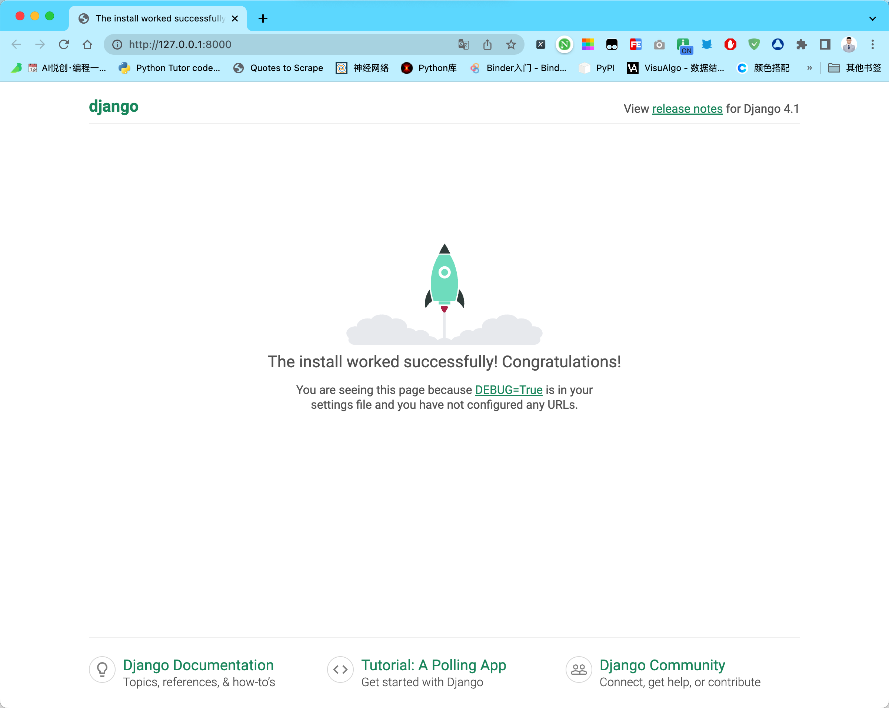
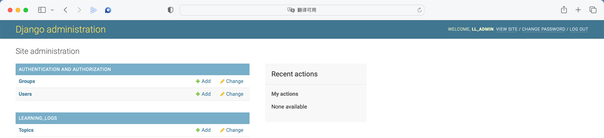
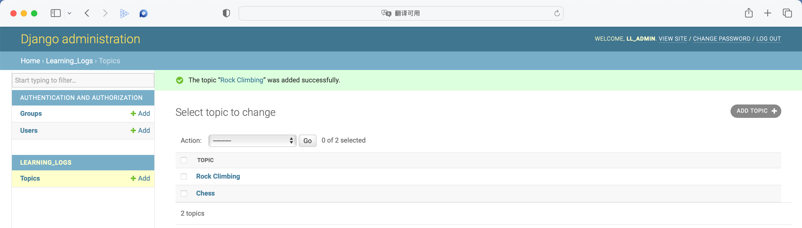
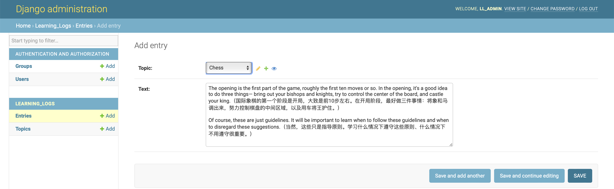
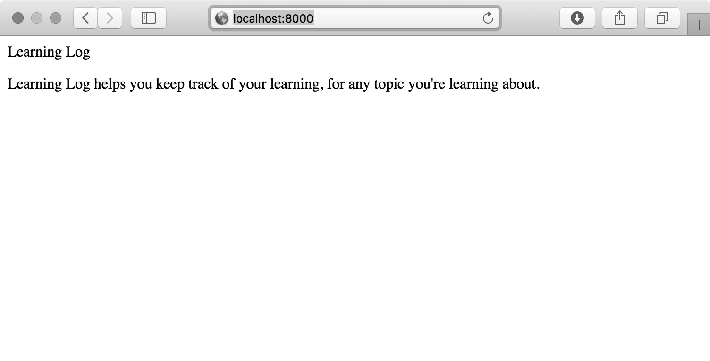
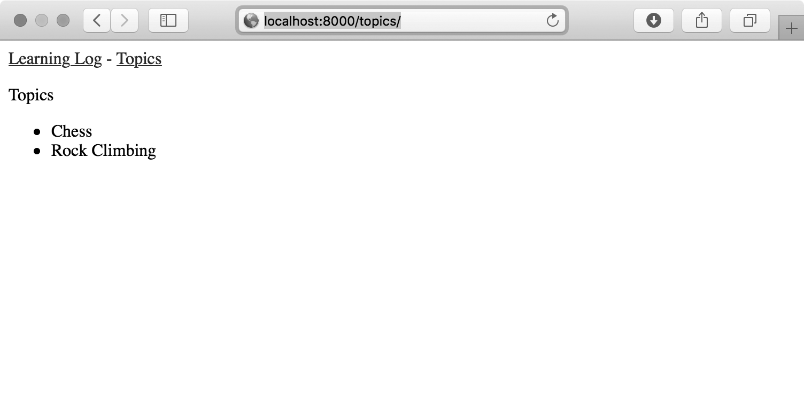
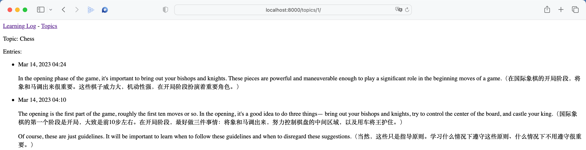

你好，我是悦创。

在幕后，当今的网站实际上都是富应用程序(rich application)，就像成熟的桌面应用程序一样。Python 提供了一组开发 Web 应用程序的卓越工 具。在本章中，你将学习如何使用 [Django](https://www.djangoproject.com/)  来开发一个名为“学习笔记”(Learning Log)的项目，这是一个在线日志系统，让你能够记录所学习的有关特定主题的知识。

我们将为这个项目制定规范，然后为应用程序使用的数据定义模型。我们将使用 Django 的管理系统来输入一些初始数据，再学习编写视图和模板，让 Django 能够为我们的网站创建网页。

Django 是一个 Web 框架——一套用于帮助开发交互式网站的工具。Django 能够响应网页请求，还能让你更轻松地读写数据库、管理用户等。在后面，我们将改进“学习笔记”项目，再将其部署到活动的服务器，让你和你的朋友能够使用它。

## 1. 建立项目

建立项目时，首先需要以规范的方式对项目进行描述，再建立虚拟环境，以便在其中创建项目。

### 1.1 制定规范

完整的规范详细说明了项目的目标，阐述了项目的功能，并讨论了项目的外观和用户界面。 与任何良好的项目规划和商业计划书一样，规范应突出重点，帮助避免项目偏离轨道。这里不会制定完整的项目规划，而只列出一些明确的目标，以突出开发的重点。我们制定的规范如下:

::: tip

我们要编写一个名为“学习笔记”的Web应用程序，让用户能够记录感兴趣的主题，并在学习每个主题的过程中添加日志条目。“学习笔记”的主页对这个网站进行描述，并邀请用户注册或登录。用户登录后，可以创建新主题、添加新条目以及阅读既有的条目。

:::

学习新的主题时，记录学到的知识可帮助跟踪和复习这些知识。优秀的应用程序让这个记录过程简单易行。

### 1.2 建立虚拟环境

要使用 Django，首先需要建立一个虚拟工作环境。**虚拟环境**是系统的一个位置，你可以在其中安装包，并将其与其他 Python 包隔离。将项目的库与其他项目分离是有益的，且为了在之后将“学习笔记”部署到服务器，这也是必须的。

为项目新建一个目录，将其命名为 `learning_log` ，再在终端中切换到这个目录，并创建一个虚拟环境。如果你使用的是 Python3，可使用如下命令来创建虚拟环境:

```python
➜  Django-Study-Notes git:(main) cd learning_log
➜  learning_log git:(main) python3 -m venv ll_env
➜  learning_log git:(main) ✗
```

这里运行了模块 venv，并使用它来创建一个名为 `ll_env` 的虚拟环境。如果这样做管用，请跳 到后面的 [【1.4节】](#_1-4-激活虚拟环境);如果不管用，请阅读 [【1.3】](#_1-3-安装)节。

---

### 1.3 安装 virtualenv

如果你使用的是较早的 Python 版本，或者 系统没有正确地设置，不能使用模块 venv，可安装 virtualenv 包。为此，可执行如下命令:

```python
pip install --user virtualenv
```

::: warning

如果你使用的是 Linux 系统，且上面的做法不管用，可使用系统的包管理器来安装 virtualenv。例如，要在 Ubuntu 系统中安装 virtualenv，可使用命令`sudo apt-get install python-virtualenv`。

:::

在终端中切换到目录 `learning_log`，并像下面这样创建一个虚拟环境:

```python
learning_log$ virtualenv ll_env
New python executable in ll_env/bin/python 
Installing setuptools, pip...done. 
learning_log$
```

::: warning

如果你的系统安装了多个 Python 版本，需要指定 virtualenv 使用的版本。例如，命令 `virtualenv ll_env --python=python3` 创建一个使用 Python3 的虚拟环境。

:::

---

### 1.4 激活虚拟环境

建立虚拟环境后，需要使用下面的命令激活它:

```python
learning_log$ source ll_env/bin/activate 
(ll_env)learning_log$
```

这个命令运行 `ll_env/bin` 中的脚本 activate。环境处于活动状态时，环境名将包含在括号内，如上面👆第二行所示。在这种情况下，你可以在环境中安装包，并使用已安装的包。你在 `ll_env` 中安装的包仅在该环境处于活动状态时才可用。

::: warning

如果你使用的是 Windows 系统，请使用命令 `ll_env\Scripts\activate` (不包含 source )来激活这个虚拟环境。如果你使用的是PowerShell，可能需要将 Activate 的首字母大写。

:::

要停止使用虚拟环境，可执行命令 `deactivate`:

```python
(ll_env) ➜  learning_log git:(main) ✗ deactivate
➜  learning_log git:(main) ✗
```

如果关闭运行虚拟环境的终端，虚拟环境也将不再处于活动状态。

### 1.5 安装 Django

创建并激活虚拟环境后，就可安装 Django 了:

```python
➜  learning_log git:(main) ✗ source ll_env/bin/activate
(ll_env) ➜  learning_log git:(main) ✗ pip install django
Collecting django
  Using cached Django-4.1.3-py3-none-any.whl (8.1 MB)
Collecting sqlparse>=0.2.2
  Using cached sqlparse-0.4.3-py3-none-any.whl (42 kB)
Collecting asgiref<4,>=3.5.2
  Using cached asgiref-3.5.2-py3-none-any.whl (22 kB)
Installing collected packages: sqlparse, asgiref, django
Successfully installed asgiref-3.5.2 django-4.1.3 sqlparse-0.4.3

[notice] A new release of pip available: 22.2.2 -> 22.3.1
[notice] To update, run: pip install --upgrade pip
(ll_env) ➜  learning_log git:(main) ✗
```

由于我们是在虚拟环境（独立的环境）中工作，因此在所有的系统中，安装 Django 的命令都相同:不需要指定标志 `--user`，也无需使用 `python -m pip install package_name` 这样较长的命令。

别忘了，Django 仅在虚拟环境处于活动状态时才可用。

::: warning

每隔大约 8 个月，Django 新版本就会发布，因此在你安装 Django 时，看到的可能是更新的版本。即便你使用的是更新的 Django 版本，这个项目也可行。如果要使用这里所示的 Django 版本，请使用命令 `pip install django==4.1.*`  安装 Django 4.1 的最新版本。如果你在使用更新的版本时遇到麻烦，请评论区留言。

:::

### 1.6 在 Django 中创建项目

在依然处于活动的虚拟环境的情况下(`ll_env`包含在括号内)，执行如下命令来新建一个项目:

```python
(ll_env) ➜  learning_log git:(main) ✗ django-admin startproject learning_log .
(ll_env) ➜  learning_log git:(main) ✗ ls
learning_log ll_env       manage.py
(ll_env) ➜  learning_log git:(main) ✗ ls learning_log
__init__.py asgi.py     settings.py urls.py     wsgi.py
```

**第一行命令：** 让 Django 新建一个名为 `learning_log` 的项目。这个命令末尾的句点让新项目使用合适的目录结构，这样开发完成后可轻松地将应用程序部署到服务器。

::: warning

千万别忘了这个句点，否则部署应用程序时将遭遇一些配置问题。如果忘记了这个句点， 就将创建的文件和文件夹删除( `ll_env` 除外)，再重新运行这个命令。

:::

**第二行命令中：** 运行了命令 ls (在 Windows 系统上应为 dir )，结果表明 Django 新建了一个名为 `learning_log` 的目录。它还创建了一个名为 `manage.py` 的文件，这是一个简单的程序，它接受命令并将其交给 Django 的相关部分去运行。我们将使用这些命令来管理诸如使用数据库和运行服务器等任务。

**第三行命令中：** 目录 `learning_log` 包含 4 个文件，其中最重要的是 `settings.py`、`urls.py` 和 `wsgi.py`。

- 文件  `settings.py` 指定 Django 如何与你的系统交互以及如何管理项目。在开发项目的过程中，我们将修改其中一些设置，并添加一些设置。
- 文件 `urls.py` 告诉 Django 应创建哪些网页来响应浏览器请求。 
- 文件 `wsgi.py` 帮助 Django 提供它创建的文件，这个文件名是 web server gateway interface (Web服务器网关接口)的首字母缩写。

---

### 1.7 创建数据库

Django 将大部分与项目相关的信息都存储在数据库中，因此我们需要创建一个供 Django 使用的数据库。为给项目“学习笔记”创建数据库，请在处于活动虚拟环境中的情况下执行下面的命令:

```python
(ll_env) ➜  learning_log git:(main) python manage.py runserver  # 可以运行测试看看，红色提示你创建数据库
Watching for file changes with StatReloader
Performing system checks...

System check identified no issues (0 silenced).

You have 18 unapplied migration(s). Your project may not work properly until you apply the migrations for app(s): admin, auth, contenttypes, sessions.
Run 'python manage.py migrate' to apply them.
November 17, 2022 - 07:00:43
Django version 4.1.3, using settings 'learning_log.settings'
Starting development server at http://127.0.0.1:8000/
Quit the server with CONTROL-C.
^C%
(ll_env) ➜  learning_log git:(main) ✗ python manage.py migrate  # 创建数据库
Operations to perform:
  Apply all migrations: admin, auth, contenttypes, sessions
Running migrations:
  Applying contenttypes.0001_initial... OK
  Applying auth.0001_initial... OK
  Applying admin.0001_initial... OK
  Applying admin.0002_logentry_remove_auto_add... OK
  Applying admin.0003_logentry_add_action_flag_choices... OK
  Applying contenttypes.0002_remove_content_type_name... OK
  Applying auth.0002_alter_permission_name_max_length... OK
  Applying auth.0003_alter_user_email_max_length... OK
  Applying auth.0004_alter_user_username_opts... OK
  Applying auth.0005_alter_user_last_login_null... OK
  Applying auth.0006_require_contenttypes_0002... OK
  Applying auth.0007_alter_validators_add_error_messages... OK
  Applying auth.0008_alter_user_username_max_length... OK
  Applying auth.0009_alter_user_last_name_max_length... OK
  Applying auth.0010_alter_group_name_max_length... OK
  Applying auth.0011_update_proxy_permissions... OK
  Applying auth.0012_alter_user_first_name_max_length... OK
  Applying sessions.0001_initial... OK
(ll_env) ➜  learning_log git:(main) ✗ ls
db.sqlite3   learning_log ll_env       manage.py
```

我们将修改数据库称为**迁移数据库**。首次执行命令 migrate 时，将让 Django 确保数据库与项目的当前状态匹配。在使用 SQLite (后面将更详细地介绍)的新项目中首次执行这个命令时， Django 将新建一个数据库。在执行 `python manage.py migrate` 处，Django 指出它将创建必要的数据库表，用于存储我们将在这个项目( Synchronize unmigrated apps，同步未迁移的应用程序)中使用的信息，再确保数据库结构与当前代码(Apply all migrations，应用所有的迁移)匹配。「用于存储执行管理和身份验证任务所需的信息。」

然后，我们运行了命令 ls，其输出表明 Django 又创建了一个文件——`db.sqlite3`。SQLite 是 一种使用单个文件的数据库，是编写简单应用程序的理想选择，因为它让你不用太关注数据库管理的问题。

::: warning

在虚拟环境中运行 `manage.py` 时，务必使用命令 python ，即便你在运行其他程序时使用的是另外的命令，如 python3 。在虚拟环境中，命令 python 指的是在虚拟环境中安装的 Python 版本。

:::

---

### 1.8 查看项目

下面来核实 Django 是否正确地创建了项目。为此，可执行命令 runserver，如下所示:

```python
(ll_env) ➜  learning_log git:(main) ✗ python manage.py runserver
Watching for file changes with StatReloader
Performing system checks...

System check identified no issues (0 silenced).
November 17, 2022 - 07:17:43
Django version 4.1.3, using settings 'learning_log.settings'
Starting development server at http://127.0.0.1:8000/
Quit the server with CONTROL-C.
```

Django 启动了一个名为 development server 的服务器，让你能够查看系统中的项目，了解其工作情况。如果你在浏览器中输入 URL 以请求页面，该 Django 服务器将进行响应:生成合适的页面，并将其发送给浏览器。

- `System check identified no issues (0 silenced).` ，Django 通过检查确认正确地创建了项目;

- `Django version 4.1.3, using settings 'learning_log.settings'` 它指出了使用的 Django 版本以及当前使用的设置文件的名称;
- `Starting development server at http://127.0.0.1:8000/`，它指出了项目的 URL。URL [http://127.0.0.1:8000/](http://127.0.0.1:8000/) 表明项目 将在你的计算机(即 localhost )的端口 8000 上侦听请求。localhost 是一种只处理当前系统发出的请求，而不允许其他任何人查看你正在开发的网页的服务器。

现在打开一款 Web 浏览器，并输入URL:[http://localhost:8000/](http://localhost:8000/);如果这不管用，请输入 [http://127.0.0.1:8000/](http://127.0.0.1:8000/) 。你将看到类似于下图所示的页面，这个页面是 Django 创建的，让你知道到目前为止一切正常。现在暂时不要关闭这个服务器。等你要关闭这个服务器时， 可切换到执行命令 runserver 时所在的终端窗口，再按 Ctrl + C。




::: warning

如果出现错误消息 That port is already in use (指定端口被占用)，请执行命令 `python manage.py runserver 8001` ，让 Diango 使用另一个端口。如果这个端口也不可用，请不断执行上述命令，并逐渐增大其中的端口号，直到找到可用的端口。

:::

---

### 1.9 动手试一试

::: tip

**练习1-1:新项目**

为深入了解 Django 都做了些什么，可创建两个空项目，看看 Django 创建了什么。新建一个文件夹，并给 它指定简单的名称，如 `snap_gram` 或 `insta_chat` (不要在目录 `learning_log` 中新建该文件夹)。在终端中切换到该文件夹，并创建一个虚拟环境。在这个虚拟环境中，安装 Django，并执行 命令 `django-admin startproject snap_gram .`  (千万不要忘了这个命令末尾的句点)。

看看这个命令创建了哪些文件和文件夹，并与项目“学习笔记”包含的文件和文件夹进行比较。这样多做几次，直到你对 Django 新建项目时创建的东西了如指掌。然后，将项目目录删除(如果你想这样做的话)。

:::

## 2. 创建应用程序

Django **项目**由一系列应用程序组成，它们协同工作让项目成为一个整体。本章只创建一个应用程序，它将完成项目的大部分工作。第19章将添加一个管理用户账户的应用程序。

当前，在前面打开的终端窗口中应该还运行着 runserver 。请再打开一个终端窗口(或标签页)，并切换到 `manage.py` 所在的目录。 激活虚拟环境，再执行命令 startapp :

```python {1-2,5}
➜  learning_log git:(main) ✗ source ll_env/bin/activate
(ll_env) ➜  learning_log git:(main) ✗ python manage.py startapp learning_logs
❶(ll_env) ➜  learning_log git:(main) ✗ ls
db.sqlite3    learning_log  learning_logs ll_env        manage.py
❷(ll_env) ➜  learning_log git:(main) ✗ ls learning_logs
__init__.py apps.py     models.py   views.py
admin.py    migrations  tests.py
(ll_env) ➜  learning_log git:(main) ✗
```

命令 `startapp appname` 让 Django 搭建创建应用程序所需的基础设施。如果现在查看项目目录，将看到其中新增了文件夹 `learning_logs`(见❶)。

打开这个文件夹，看看 Django 都创建了什 么(见❷)，其中最重要的文件是 `models.py`、`admin.py` 和 `views.py`。我们将使用`models.py` 来定义要在应用程序中管理的数据，稍后再介绍 `admin.py` 和 `views.py`。

### 2.1 定义模型

我们来想想涉及的数据。每位用户都需要在学习笔记中创建很多主题。用户输入的每个条目都与特定主题相关联，这些条目将以文本
的方式显示。我们还需要存储每个条目的时间戳，以便告诉用户各个条目都是什么时候创建的。

打开文件 `models.py`，看看它当前包含哪些内容:

#### models.py

```python
from django.db import models

# Create your models here.
# 在这里创建模型。
```

这里导入了模块 models ，并让我们创建自己的模型。模型告诉 Django 如何处理应用程序中存储的数据。在代码层面，模型就是一个类，就像前面讨论的每个类一样，包含属性和方法。下面是表示用户将存储的主题的模型:

```python {5-8,10-12}
from django.db import models


# Create your models here.
class Topic(models.Model):
    """用户学习的主题"""
    text = models.CharField(max_length=200)
    date_added = models.DateTimeField(auto_now_add=True)

    def __str__(self):
        """返回模型的字符串表示"""
        return self.text
```

我们创建了一个名为 Topic 的类，它继承 Model ，即 Django 中定义了模型基本功能的类。我们给 Topic 类添加了两个属性: text 和 `date_added`。

- 属性 text 是一个 CharField ——由字符组成的数据，即文本(见代码第7行)。需要存储少量文本，如名称、标题或城市时，可使用CharField 。定义 CharField 属性时，必须告诉 Django 该在数据库中预留多少空间。这里将 `max_length` 设置成了 200 (即 200 字 符)，这对存储大多数主题名来说足够了。
- 属性 `date_added` 是一个 DateTimeField ——记录日期和时间的数据(见代码第8行)。我们传递了实参 `auto_now_add=True` ，每当用户创建新主题时，Django 都会将这个属性自动设置为当前日期和时间。

::: warning

要获悉可在模型中使用的各种字段，请参阅 Django Model Field Reference 。就当前而言，你无须全面了解其中的所有内容，但自己开发应用程序时，这些内容将供极大的帮助。[https://docs.djangoproject.com/zh-hans/4.1/ref/models/fields/](https://docs.djangoproject.com/zh-hans/4.1/ref/models/fields/)

:::

需要告诉 Django，默认使用哪个属性来显示有关主题的信息。 Django 调用方法 `__str__()`  来显示模型的简单表示。这里编写了方法`__str__() `，它返回存储在属性 text 中的字符串(见代码第10行)。

### 2.2 激活模型

要使用这些模型，必须让 Django 将前述应用程序包含到项目中。为此，打开 `settings.py` (它位于目录 `learning_log/learning_log` 中)，其中有个片段告诉 Django 哪些应用程序被安装到了项目中并将协同工作:

#### settings.py

```python
--snip--
INSTALLED_APPS = [
    'django.contrib.admin',
    'django.contrib.auth',
    'django.contrib.contenttypes',
    'django.contrib.sessions',
    'django.contrib.messages',
    'django.contrib.staticfiles',
] --snip--
```

 请将 `INSTALLED_APPS` 修改成下面这样，将前面的应用程序添加到这个列表中:

::: code-tabs#python

@tab 注解版

```python
--snip--
INSTALLED_APPS = [
    # 我的应用程序 
    'learning_logs',
    # 默认添加的应用程序 
    'django.contrib.admin',
--snip-- ]
--snip--
```

@tab 实际编写版本

```python {2}
INSTALLED_APPS = [
    'learning_log',
    'django.contrib.admin',
    'django.contrib.auth',
    'django.contrib.contenttypes',
    'django.contrib.sessions',
    'django.contrib.messages',
    'django.contrib.staticfiles',
]
```

:::

通过将应用程序编组，在项目不断增大，包含更多的应用程序时，有助于对应用程序进行跟踪。这里新建了一个名为“我的应用程序”的片段，当前它只包含应用程序 `learning_logs` 。**务必将自己创建的应用程序放在默认应用程序前面，这样能够覆盖默认应用程序的行为。**

接下来，需要让 Django 修改数据库，使其能够存储与模型 Topic 相关的信息。为此，在终端窗口中执行下面的命令:

::: code-tabs#python

@tab 操作

```python {1}
(ll_env) ➜  learning_log git:(main) ✗ python manage.py makemigrations learning_logs
Migrations for 'learning_logs':
  learning_logs/migrations/0001_initial.py
    - Create model Topic
(ll_env) ➜  learning_log git:(main) ✗ 
```

@tab 0001_initial.py 文件内容

```python
# Generated by Django 4.1.3 on 2023-01-06 15:24

from django.db import migrations, models


class Migration(migrations.Migration):

    initial = True

    dependencies = [
    ]

    operations = [
        migrations.CreateModel(
            name='Topic',
            fields=[
                ('id', models.BigAutoField(auto_created=True, primary_key=True, serialize=False, verbose_name='ID')),
                ('text', models.CharField(max_length=200)),
                ('date_added', models.DateTimeField(auto_now_add=True)),
            ],
        ),
    ]
```

:::

命令 makemigrations 让 Django 确定该如何修改数据库，使其能够存储与前面定义的新模型相关联的数据。输出表明 Django 创建了一 个名为 `0001_initial.py` 的迁移文件，这个文件将在数据库中为模型 Topic 创建一个表。

下面应用这种迁移，让 Django 替我们修改数据库:

```python {1,5}
(ll_env) ➜  learning_log git:(main) ✗ python manage.py migrate                     
Operations to perform:
  Apply all migrations: admin, auth, contenttypes, learning_logs, sessions
Running migrations:
  Applying learning_logs.0001_initial... OK
```

这个命令的大部分输出与首次执行命令 migrate 的输出相同。需要检查的是第5行输出。在这里，Django 指出为 `learning_logs` 应用迁移时一切正常。

每当需要修改“学习笔记”管理的数据时，都采取如下三个步骤:

- 修改 `models.py`
- 对 `learning_logs` 调用 makemigrations: `python manage.py makemigrations learning_logs`
- 以及让 Django 迁移项目: `python manage.py migrate`

### 2.3 Django 管理网站

Django 供的管理网站 (admin site)让你能够轻松地处理模型。 网站管理员可以使用管理网站，但普通用户不能使用。本节将建立管理网站，并通过它使用模型 Topic 来添加一些主题。

#### a. 创建超级用户

Django 允许创建具备所有权限的用户，即超级用户 。权限决定了用户可执行的操作。

最严格的权限设置只允许用户阅读网站的公开信息。注册用户通常可阅读自己的私有数据，还可查看一些只有会员才能查看的信息。为有效地管理 Web 应用程序，网站所有者通常需要访问网站存储的所有信息。优秀的管理员会小心对待用户的敏感信息，因为用户极其信任自己访问的应用程序。

为在 Django 中创建超级用户，请执行下面的命令并按示做:

```python {1}
(ll_env) ➜  learning_log git:(main) ✗ python manage.py createsuperuser 
❶Username (leave blank to use 'huangjiabao'): ll_admin
❷Email address: bornforthis@bornforthis.cn
❸Password: 
Password (again): 
This password is too short. It must contain at least 8 characters.
This password is too common.
This password is entirely numeric.
Bypass password validation and create user anyway? [y/N]: y
Superuser created successfully.
(ll_env) ➜  learning_log git:(main) ✗ 
```

你执行命令 createsuperuser 时，Django 示输入超级用户 的用户名(见❶)。这里输入的是 `ll_admin` ，但可输入任何用户名。如果你愿意，可以输入电子邮箱地址，也可让这个字段为空(见❷)。需要输入密码两次(见❸)。

::: warning 注意

一些敏感信息可能会向网站管理员隐藏。

例如， Django 并不存储你输入的密码，而是存储从该密码派生出来的一个字符串，称为散列值 。每当你输入密码时， Django 都计算其散列值，并将结果与存储的散列值进行比较。如果这两个散列值相同，你就通过了身份验证。由于存储的是散列值，即便黑客获得了网站数据库的访问权，也只能获取其中存储的散列值，无法获得密码。在网站配置正确的情况下，几乎无法根据散列值推导出原始密码。

:::

#### b. 向管理网站注册模型

Django 自动在管理网站中添加了一些模型，如 User 和 Group ，但对于我们创建的模型，必须手工进行注册。

说成白话就是：前面创建了 app，之后编写了 app 的结构，那么接下来其实就需要将我们 app 的结构添加到 app 的后台「admin」。

我们创建应用程序 `learning_logs` 时，Django 在 `models.py` 所 在的目录中创建了一个名为 `admin.py` 的文件:

##### admin.py

```python
from django.contrib import admin

# Register your models here.
```

为向管理网站注册 Topic ，请输入下面的代码:

```python{2,4}
from django.contrib import admin
❶from .models import Topic
# Register your models here.
❷admin.site.register(Topic)
```

这些代码首先导入要注册的模型 Topic (见❶)。models 前 面的句点让 Django 在 `admin.py` 所在的目录中查找 `models.py`。`admin.site.register()` 让 Django 通过管理网站 管理模型(见❷)。

现在，使用超级用户账户访问管理网站：访问 [http://localhost:8000/admin/](http://localhost:8000/admin/)，并输入刚创建的超级用户的用户名和密码。你将看到类似于下图所示的屏幕。这个页面让你能够添加和修改用户和用户组，还可管理与刚才定义的模型 `Topic` 相关的数据。



::: warning

如果在浏览器中看到一条消息，指出访问的网页不可用，请确认在终端窗口中运行着 Django 服务器。如果没有，请激活虚拟环境，并执行命令`python manage.py runserver`。在开发过程中，如果无法通过浏览器访问项目，首先应采取的故障排除措施是，关闭所有打开的终端，再打开终端并执行命令`runserver`。

:::

#### c. 添加主题

向管理网站注册 `Topic` 后，我们来添加第一个主题。为此，单击 Topics 进入主题页面，它几乎是空的，因为还没有添加任何主题。单击Add，将出现一个用于添加新主题的表单。在第一个方框中输入 `Chess`，再单击 Save 回到主题管理页面，其中包含刚创建的主题。

下面再创建一个主题，以便有更多的数据可供使用。再次单击 Add，并输入 Rock Climbing，然后单击 Save 回到主题管理页面。现在，你可以看到其中包含了主题 Chess 和 `Rock Climbing`。



### 2.4 定义模型 Entry

要记录学到的国际象棋和攀岩知识，用户必须能够在学习笔记中添加条目。为此，需要定义相关的模型。每个条目都与特定主题相关联，这种关系称为**多对一关系**，即多个条目可关联到同一个主题。

下面是模型 `Entry` 的代码，请将这些代码放在文件 `models.py` 中：

#### models.py

```python
from django.db import models

class Topic(models.Model):
    --snip--

class Entry(models.Model): ❶
    """学到的有关某个主题的具体知识。条目"""
    topic = models.ForeignKey(Topic, on_delete=models.CASCADE) ❷
    text = models.TextField() ❸
    date_added = models.DateTimeField(auto_now_add=True)

    class Meta: ❹
        verbose_name_plural = 'entries'

    def __str__(self):
        """返回模型的字符串表示。"""
        return f"{self.text[:50]}..." ❺
```

像 `Topic` 一样，`Entry` 也继承了 Django 基类 `Model`（见❶）。

- 第一个属性 `topic` 是个 `ForeignKey` 实例（见❷）。

- **外键**（foreign key）是一个数据库术语，它指向数据库中的另一条记录，这里是将每个条目关联到特定主题。创建每个主题时，都分配了一个键（ID）。需要在两项数据之间建立联系时，Django 使用与每项信息相关联的键。我们稍后将根据这些联系获取与特定主题相关联的所有条目。实参 `on_delete=models.CASCADE` 让Django在删除主题的同时删除所有与之相关联的条目，这称为**级联删除**（cascading delete）。

- 接下来是属性 `text`，它是一个 `TextField` 实例（见❸）。这种字段的长度不受限制，因为我们不想限制条目的长度。
- 属性 `date_added` 让我们能够按创建顺序呈现条目，并在每个条目旁边放置时间戳。

在❹处，我们在 `Entry` 类中嵌套了 `Meta` 类。`Meta` 存储用于管理模型的额外信息。在这里，它让我们能够设置一个特殊属性，让 Django 在需要时使用 `Entries` 来表示多个条目。如果没有这个类，Django 将使用 `Entrys` 来表示多个条目。

方法 `__str__()` 告诉 Django，呈现条目时应显示哪些信息。条目包含的文本可能很长，因此让 Django 只显示 `text` 的前 50 字符（见❺）。我们还添加了一个省略号，指出显示的并非整个条目。

### 2.5 迁移模型 Entry

添加新模型后，需要再次迁移数据库。你将慢慢地对这个过程了如指掌：修改 `models.py` ，执行命令 `python manage.py makemigrations *app_name*`，再执行命令 `python manage.py migrate`。

请使用如下命令迁移数据库并查看输出：

```python {1}
(ll_env)learning_log$ python manage.py makemigrations learning_logs
Migrations for 'learning_logs':
  learning_logs/migrations/0002_entry.py ❶
    - Create model Entry
(ll_env)learning_log$ python manage.py migrate
Operations to perform:
  --snip--
  Applying learning_logs.0002_entry... OK ❷
```

生成了一个新的迁移文件 `0002_entry.py`，它告诉 Django 如何修改数据库，使其能够存储与模型 `Entry` 相关的信息（见❶）。在❷处执行命令 `migrate`，我们发现 Django 应用了该迁移且一切顺利。

### 2.6 向管理网站注册 Entry

我们还需要注册模型 `Entry`。为此，需要将 `admin.py` 修改成类似于下面这样：

#### admin.py

```python
from django.contrib import admin

from .models import Topic, Entry

admin.site.register(Topic)
admin.site.register(Entry)
```

返回到 [http://localhost/admin/](http://localhost/admin/)，你将看到 `Learning_Logs` 下列出了 Entries。单击 Entries 的 Add 链接，或者单击 Entries 再选择 Add entry，将看到一个下拉列表，供你选择要为哪个主题创建条目，以及一个用于输入条目的文本框。从下拉列表中选择 Chess，并添加一个条目。下面是我添加的第一个条目。

```
The opening is the first part of the game, roughly the first ten moves or so. In the opening, it's a good idea to do three things— bring out your bishops and knights, try to control the center of the board, and castle your king.（国际象棋的第一个阶段是开局，大致是前10步左右。在开局阶段，最好做三件事情：将象和马调出来，努力控制棋盘的中间区域，以及用车将王护住。）

Of course, these are just guidelines. It will be important to learn when to follow these guidelines and when to disregard these suggestions.（当然，这些只是指导原则。学习什么情况下遵守这些原则、什么情况下不用遵守很重要。）
```



当你单击 Save 时，将返回到主条目管理页面。在这里，你将发现使用 `text[:50]` 作为条目的字符串表示的好处：在管理界面中只显示了条目的开头部分而不是其所有文本，这使得管理多个条目容易得多。

再来创建一个国际象棋条目，并创建一个攀岩条目，以提供一些初始数据。下面是第二个国际象棋条目。

```
In the opening phase of the game, it's important to bring out your bishops and knights. These pieces are powerful and maneuverable enough to play a significant role in the beginning moves of a game.（在国际象棋的开局阶段，将象和马调出来很重要。这些棋子威力大，机动性强，在开局阶段扮演着重要角色。）
```

下面是第一个攀岩条目。

```
One of the most important concepts in climbing is to keep your weight on your feet as much as possible. There's a myth that climbers can hang all day on their arms. In reality, good climbers have practiced specific ways of keeping their weight over their feet whenever possible.（最重要的攀岩概念之一是尽可能让双脚承受体重。有人误认为攀岩者能依靠手臂的力量坚持一整天。实际上，优秀的攀岩者都经过专门训练，能够尽可能让双脚承受体重。）
```

接着往下开发“学习笔记”时，这三个条目提供了可供使用的数据。

### 2.7 Django shell

输入一些数据后，就可通过交互式终端会话以编程方式查看这些数据了。这种交互式环境称为 Django **shell**，是测试项目和排除故障的理想之地。下面是一个交互式 shell 会话示例：

```python
(ll_env)learning_log$ python manage.py shell
>>> from learning_logs.models import Topic ❶
>>> Topic.objects.all()
<QuerySet [<Topic: Chess>, <Topic: Rock Climbing>]>
```

在活动状态的虚拟环境中执行时，命令 `python manage.py shell` 启动 Python 解释器，让你能够探索存储在项目数据库中的数据。这里导入了模块 `learning_logs.models` 中的模型 `Topic`（见❶），再使用方法 `Topic.objects.all()` 获取模型 `Topic` 的所有实例，这将返回一个称为**查询集**（queryset）的列表。

可以像遍历列表一样遍历查询集。下面演示了如何查看分配给每个主题对象的 ID：

```python
>>> topics = Topic.objects.all()
>>> for topic in topics:
...   print(topic.id, topic)
...
1 Chess
2 Rock Climbing
```

将返回的查询集存储在 `topics` 中，再打印每个主题的 `id` 属性和字符串表示。从输出可知，主题 Chess 的 ID 为 1，而 Rock Climbing 的 ID 为 2。

知道主题对象的 ID 后，就可使用方法 `Topic.objects.get()` 获取该对象并查看其属性。下面来看看主题 Chess 的属性 `text` 和 `date_added `的值：

```python
>>> t = Topic.objects.get(id=1)
>>> t.text
'Chess'
>>> t.date_added
datetime.datetime(2019, 2, 19, 1, 55, 31, 98500, tzinfo=<UTC>)
```

我们还可以查看与主题相关联的条目。前面给模型 `Entry` 定义了属性 `topic`。这是一个 `ForeignKey` ，将条目与主题关联起来。利用这种关联，Django 能够获取与特定主题相关联的所有条目，如下所示：

```python
>>> t.entry_set.all() ❶
<QuerySet [<Entry: The opening is the first part of the game, roughly...>,
<Entry:
In the opening phase of the game, it's important t...>]>
```

要通过外键关系获取数据，可使用相关模型的小写名称、下划线和单词 `set`（见❶）。

例如，假设有模型 `Pizza` 和 `Topping` ，而 `Topping` 通过一个外键关联到 `Pizza` 。如果有一个名为 `my_pizza` 的 `Pizza` 对象，就可使用代码 `my_pizza.topping_set.all()` 来获取这张比萨的所有配料。

编写用户可请求的页面时，我们将使用这种语法。确认代码能获取所需的数据时，shell 很有帮助。如果代码在 shell 中的行为符合预期，那么它们在项目文件中也能正确地工作。如果代码引发了错误或获取的数据不符合预期，那么在简单的 shell 环境中排除故障要比在生成页面的文件中排除故障容易得多。我们不会太多地使用 shell，但应继续使用它来熟悉对存储在项目中的数据进行访问的 Django 语法。

::: warning

每次修改模型后，都需要重启 shell，这样才能看到修改的效果。要退出 shell 会话，可按 Ctr + D。如果你使用的是 Windows 系统，应按 Ctr + Z，再按回车键。

:::

::: tip 动手试一试

**练习2-1：简短的条目**　当前，Django 在管理网站或 shell 中显示 `Entry` 实例时，模型 `Entry` 的方法 `__str__()` 都在其末尾加上省略号。请在方法 `__str__()` 中添加一条 `if` 语句，以便仅在条目长度超过 50 字符时才添加省略号。使用管理网站添加一个不超过 50 字符的条目，并核实显示它时没有省略号。

**练习2-2：Django API**　当你编写访问项目中数据的代码时，实际上编写的是查询。请浏览 Django 网站中有关如何查询数据的文档 Making queries，其中大部分内容是你不熟悉的，但等你自己开发项目时，这些内容会很有用。

**练习2-3：比萨店**　新建一个名为 Pizzeria 的项目，并在其中添加一个名为 `pizzas` 的应用程序。定义一个名为 `Pizza` 的模型，它包含字段 `name`，用于存储比萨名称，如 `Hawaiian` 和 `Meat Lovers` 。定义一个名为 `Topping` 的模型，它包含字段 `pizza` 和 `name`，其中字段 `pizza` 是一个关联到 `Pizza` 的外键，而字段 `name` 用于存储配料，如 `pineapple`、`Canadian bacon` 和 `sausage`。

向管理网站注册这两个模型，并使用管理网站输入一些比萨名和配料。使用 shell 来查看你输入的数据。

:::

## 3. 创建页面：学习笔记主页

使用 Django 创建页面的过程分三个阶段：定义 URL，编写视图和编写模板。按什么顺序完成这三个阶段无关紧要，但在本项目中，总是先定义 URL 模式。URL 模式描述了 URL 是如何设计的，让 Django 知道如何将浏览器请求与网站 URL 匹配，以确定返回哪个页面。

每个 URL 都被映射到特定的**视图**——视图函数获取并处理页面所需的数据。视图函数通常使用**模板**来渲染页面，而模板定义页面的总体结构。为明白其中的工作原理，我们来创建学习笔记的主页。这包括定义该主页的 URL，编写其视图函数并创建一个简单的模板。

我们只是要确保“学习笔记”按要求的那样工作，因此暂时让这个页面尽可能简单。Web 应用程序能够正常运行后，设置样式可使其更有趣，但中看不中用的应用程序毫无意义。就目前而言，主页只显示标题和简单的描述。

### 3.1 映射 URL

用户通过在浏览器中输入 URL 以及单击链接来请求页面，因此我们要确定项目需要哪些 URL。主页的 URL 最重要，它是用户用来访问项目的基础 URL。当前，基础 URL（[http://localhost:8000/](http://localhost:8000/)）返回默认的 Django 网站，让我们知道正确地建立了项目。下面修改这一点，将这个基础 URL 映射到“学习笔记”的主页。

打开项目主文件夹 `learning_log` 中的文件 `urls.py`，你将看到如下代码：

#### urls.py

```python
from django.contrib import admin ❶
from django.urls import path

urlpatterns = [ ❷
    path('admin/', admin.site.urls), ❸
]
```

前两行导入了一个模块和一个函数，以便对管理网站的 URL 进行管理（见❶）。这个文件的主体定义了变量 `urlpatterns`（见❷）。在这个针对整个项目的 `urls.py` 文件中，变量 `urlpatterns` 包含项目中应用程序的 URL。❸处的代码包含模块 `admin.site.urls` ，该模块定义了可在管理网站中请求的所有 URL。

我们需要包含 `learning_logs` 的 URL，因此添加如下代码：

```python
from django.contrib import admin
from django.urls import path, include

urlpatterns = [
    path('admin/', admin.site.urls),
    path('', include('learning_logs.urls')), ❶
]
```

在❶处，添加一行代码来包含模块 `learning_logs.urls` 。

默认的 `urls.py` 包含在文件夹 `learning_log` 中，现在需要在文件夹 `learning_logs` 中再创建一个 `urls.py` 文件。为此，新建一个文件，使用文件名 `urls.py` 将其存储到文件夹 `learning_logs` 中，再在这个文件中输入如下代码：

#### urls.py

```python
"""定义 learning_logs 的 URL 模式。""" ❶

from django.urls import path ❷

from . import views ❸

app_name = 'learning_logs' ❹
urlpatterns = [ ❺
    # 主页
    path('', views.index, name='index'), ❻
]
```

为指出当前位于哪个 `urls.py` 文件中，在该文件开头添加一个文档字符串（见❶）。接下来，导入了函数 `path`，因为需要使用它将 URL 映射到视图（见❷）。我们还导入了模块 `views`（见❸），其中的句点让 Python 从当前 `urls.py` 模块所在的文件夹导入 `views.py` 。变量 `app_name` 让 Django 能够将这个 `urls.py` 文件同项目内其他应用程序中的同名文件区分开来（见❹）。在这个模块中，变量 `urlpatterns` 是一个列表，包含可在应用程序 `learning_logs` 中请求的页面。

实际的 URL 模式是对函数 `path()` 的调用，这个函数接受三个实参（见❺）。第一个是一个字符串，帮助 Django 正确地路由（route）请求。收到请求的 URL 后，Django 力图将请求路由给一个视图。为此，它搜索所有的 URL 模式，找到与当前请求匹配的那个。Django 忽略项目的基础URL（[http://localhost:8000/](http://localhost:8000/)），因此空字符串（`''`）与基础 URL 匹配。其他 URL 都与这个模式不匹配。如果请求的 URL 与任何既有的 URL 模式都不匹配，Django 将返回一个错误页面。

`path()` 的第二个实参（见❻）指定了要调用 `view.py` 中的哪个函数。请求的 URL 与前述正则表达式匹配时，Django 将调用 `view.py` 中的函数 `index()`（这个视图函数将在下一节编写）。

<span style="color:orange">**第三个实参将这个 URL 模式的名称指定为 `index`，让我们能够在代码的其他地方引用它。每当需要提供到这个主页的链接时，都将使用这个名称，而不编写URL。**</span>

### 3.2 编写视图

视图函数接受请求中的信息，准备好生成页面所需的数据，再将这些数据发送给浏览器——这通常是使用定义页面外观的模板实现的。

`learning_logs` 中的文件 `views.py` 是执行命令 `python manage.py startapp` 时自动生成的，当前其内容如下：

```python
from django.shortcuts import render

# 在这里创建视图。
```

当前，这个文件只导入了函数 `render()`，它根据视图提供的数据渲染响应。请在这个文件中添加为主页编写视图的代码，如下所示：

```python
from django.shortcuts import render

def index(request):
    """学习笔记的主页。"""
    return render(request, 'learning_logs/index.html')
```

URL 请求与刚才定义的模式匹配时，Django 将在文件 `views.py` 中查找函数 `index()` ，再将对象 `request` 传递给这个视图函数。这里不需要处理任何数据，因此这个函数只包含调用 `render()` 的代码。这里向函数 `render()` 提供了两个实参：对象 `request` 以及一个可用于创建页面的模板。下面来编写这个模板。

### 3.3 编写模板

模板定义页面的外观，而每当页面被请求时，Django 将填入相关的数据。模板让你能够访问视图提供的任何数据。我们的主页视图没有提供任何数据，因此相应的模板非常简单。

在文件夹 learning_logs 中新建一个文件夹，并将其命名为 templates。在文件夹 templates 中，再新建一个文件夹，并将其命名为learning_logs。这好像有点多余（在文件夹 learning_logs 中创建文件夹 templates，又在这个文件夹中创建文件夹 learning_logs），但是建立了 Django 能够明确解读的结构，即便项目很大、包含很多应用程序亦如此。在最里面的文件夹 learning_logs 中，新建一个文件，并将其命名为 `index.html`。

（这个文件的路径为 `learning_log/learning_logs/templates/learning_logs/index.html`  ），再在其中编写如下代码：

#### index.html

```html
<p>Learning Log</p>

<p>Learning Log helps you keep track of your learning, for any topic you're
learning about.</p>
```

这个文件非常简单。这里向不熟悉 HTML 的读者解释一下：标签 `<p></p>` 标识段落。标签 `<p>` 指出段落的开头位置，而标签 `</p>` 指出段落的结束位置。这里定义了两个段落：第一个充当标题，第二个阐述了用户可使用“学习笔记”来做什么。

现在，如果请求这个项目的基础URL [http://localhost:8000/](http://localhost:8000/)，将看到刚才创建的页面，而不是默认的 Django 页面。Django 接受请求的URL，发现该 URL 与模式 `''` 匹配，因此调用函数 `views.index()` 。这将使用 `index.html` 包含的模板来渲染页面，结果如下图所示。



创建页面的过程看起来可能很复杂，但将 URL、视图和模板分离的效果很好。这让我们能够分别考虑项目的不同方面，在项目很大时，可让各个参与者专注于最擅长的方面。

例如，数据库专家专注于模型，程序员专注于视图代码，而 Web 设计人员专注于模板。

::: warning

可能出现如下错误消息：

```python
ModuleNotFoundError: No module named 'learning_logs.urls'
```

如果确实如此，请在执行命令 `python manage.py runserver` 的终端窗口中按 Ctrl + C 停用服务器，再重新执行这个命令。这样做后，应该能够看到主页。每当遇到类似的错误时，都尝试停用并重启服务器，看看是否管用。

:::

::: tip 动手试一试

**练习3-1：膳食规划程序**　假设你要创建一个应用程序，帮助用户规划一周的膳食。为此，新建一个文件夹，并将其命名为 meal_planner，再在这个文件夹中新建一个 Django 项目。然后，新建一个名为 `meal_plans` 的应用程序，并为这个项目创建一个简单的主页。

**练习3-2：比萨店主页**　在为完成练习2-3而创建的项目 Pizzeria 中，添加一个主页。

:::

## 4. 创建其他页面

制定创建页面的流程后，可以开始扩充“学习笔记”项目了。我们将创建两个显示数据的页面，其中一个列出所有的主题，另一个显示特定主题的所有条目。对于每个页面，我们都将指定 URL 模式、编写一个视图函数并编写一个模板。但这样做之前，我们先创建一个父模板，项目中的其他模板都将继承它。

### 4.1 模板继承

<span style="color:orange">**创建网站时，一些通用元素几乎会在所有页面中出现。**</span>

在这种情况下，可编写一个包含通用元素的父模板，并让每个页面都继承这个模板，而不必在每个页面中重复定义这些通用元素。这种方法能让你专注于开发每个页面的独特方面，还能让修改项目的整体外观容易得多。

#### 4.1.1 父模板

下面创建一个名为 `base.html` 的模板，并将其存储在 `index.html` 所在的目录中。这个模板包含所有页面都有的元素，而其他模板都继承它。

当前，所有页面都包含的元素只有顶端的标题。因为每个页面都包含这个模板，所以将这个标题设置为到主页的链接：

##### base.html

```html
<p>
    <a href="">Learning Log</a> ❶
</p>

 ❷
```

这个文件的第一部分创建一个包含项目名的段落，该段落也是到主页的链接。为创建链接，使用了一个**模板标签**，它是用花括号和百分号（``）表示的。

模板标签是一小段代码，生成要在页面中显示的信息。这里的模板标签 `` 生成一个 URL，该 URL 与在 `learning_logs/urls.py` 中定义的名为 `'index'` 的URL 模式匹配（见❶）。

在本例中，`learning_logs` 是一个**命名空间**，而 `index` 是该命名空间中一个名称独特的 URL 模式。这个命名空间来自在文件 `learning_logs/urls.py` 中赋给 `app_name` 的值。

在简单的 HTML 页面中，链接是使用**锚**标签 `<a>` 定义的：

```html
<a href="link_url">link text</a>
```

通过使用模板标签来生成 URL，能很容易地确保链接是最新的：只需修改 `urls.py` 中的 URL 模式，Django 就会在页面下次被请求时自动插入修改后的 URL。在本项目中，每个页面都将继承 `base.html` ，因此从现在开始，每个页面都包含到主页的链接。

在❷处，我们插入了一对块标签。这个块名为 content，是一个占位符，其中包含的信息由子模板指定。

子模板并非必须定义父模板中的每个块，因此在父模板中，可使用任意多个块来预留空间，而子模板可根据需要定义相应数量的块。

::: warning

在 Python 代码中，几乎总是缩进四个空格。相比于 Python 文件，模板文件的缩进层级更多，因此每个层级通常只缩进两个空格。每个层级缩进多少个空格无关紧要，只需确保一致即可。

:::

#### 4.1.2 子模板

现在需要重写 `index.html` ，使其继承 `base.html`。为此，向 `index.html` 添加如下代码：

##### index.html

```html
 ❶

 ❷
<p>Learning Log helps you keep track of your learning, for any topic you're
learning about.</p>
 ❸
```

如果将这些代码与原来的 `index.html` 进行比较，将发现标题 Learning Log 没有了，取而代之的是指定要继承哪个模板的代码（见❶）。子模板的第一行必须包含标签``，让 Django 知道它继承了哪个父模板。文件 `base.html` 位于文件夹 `learning_logs` 中，因此父模板路径中包含 `learning_logs` 。这行代码导入模板 `base.html` 的所有内容，让 `index.html` 能够指定要在 `content` 块预留的空间中添加的内容。

在❷处，插入了一个名为 `content` 的 `` 标签，以定义 `content` 块。不是从父模板继承的内容都包含在 `content` 块中，在这里是一个描述项目“学习笔记”的段落。

在❸处，使用标签 `` 指出了内容定义的结束位置。在标签 `` 中，并非必须指定块名，但如果模板包含多个块，指定块名有助于确定结束的是哪个块。

模板继承的优点开始显现出来了：在子模板中，只需包含当前页面特有的内容。这不仅简化了每个模板，还使得网站修改起来容易得多。要修改很多页面都包含的元素，只需修改父模板即可，所做的修改将传导到继承该父模板的每个页面。在包含数十乃至数百个页面的项目中，这种结构使得网站改进起来更容易、更快捷。

::: warning

在大型项目中，通常有一个用于整个网站的父模板 `base.html` ，且网站的每个主要部分都有一个父模板。每个部分的父模板都继承 `base.html`，而网站的每个页面都继承相应部分的父模板。这让你能够轻松地修改整个网站的外观、网站任何一部分的外观以及任何一个页面的外观。这种配置提供了一种效率极高的工作方式，让你乐意不断地去改进网站。

:::

### 4.2 显示所有主题的页面

有了高效的页面创建方法，就能专注于另外两个页面了：显示所有主题的页面和显示特定主题中条目的页面。前者显示用户创建的所有主题，它是第一个需要使用数据的页面。

#### 4.2.1 URL 模式

首先，定义显示所有主题的页面的 URL。我们通常使用一个简单的 URL 片段来指出页面显示的信息，这里使用单词 topics，因此 URL： [http://localhost:8000/topics/](http://localhost:8000/topics/) 将返回显示所有主题的页面。下面演示了该如何修改 `learning_logs/urls.py`：

##### urls.py

```python
"""为 learning_logs 定义 URL 模式。"""
--snip--
urlpatterns = [
    # 主页
    path('', views.index, name='index'),
    # 显示所有的主题。
    path('topics/', views.topics, name='topics'), ❶
]
```

这里在用于主页 URL 的字符串参数中添加了 `topics/`（见❶）。Django 检查请求的 URL 时，这个模式与如下 URL 匹配：基础 URL 后面跟着 topics。可在末尾包含斜杠，也可省略，但单词 topics 后面不能有任何东西，否则就与该模式不匹配。URL 与该模式匹配的请求都将交给 `views.py` 中的函数 `topics()`处理。

#### 4.2.2 视图

函数 `topics()` 需要从数据库中获取一些数据，并将其交给给模板。需要在 `views.py` 中添加的代码如下：

##### views.py

```python
from django.shortcuts import render

from .models import Topic ❶

def index(request):
    --snip--

def topics(request): ❷
    """显示所有的主题。"""
    topics = Topic.objects.order_by('date_added') ❸
    context = {'topics': topics} ❹
    return render(request, 'learning_logs/topics.html', context) ❺
```

首先导入与所需数据相关联的模型（见❶）。函数 `topics()` 包含一个形参：Django 从服务器那里收到的 `request` 对象（见❷）。在❸处，查询数据库——请求提供 `Topic` 对象，并根据属性 `date_added` 进行排序。返回的查询集被存储在 `topics` 中。

在❹处，定义一个将发送给模板的上下文。**上下文**是一个字典，其中的键是将在模板中用来访问数据的名称，而值是要发送给模板的数据。这里只有一个键值对，包含一组将在页面中显示的主题。创建使用数据的页面时，除了对象 `request` 和模板的路径外，还将变量 `context` 传递给 `render()`（见❺）。

#### 4.2.3 模板

显示所有主题的页面的模板接受字典 `context`，以便使用 `topics()` 提供的数据。请创建一个文件，将其命名为 `topics.html` ，并存储到 `index.html` 所在的目录中。下面演示了如何在这个模板中显示主题：

##### topics.html

```html




  <p>Topics</p>

  <ul> ❶
     ❷
      <li>{{ topic }}</li> ❸
     ❹
      <li>No topics have been added yet.</li>
     ❺
  </ul> ❻


```

就像模板 `index.html` 中一样，首先使用标签 `` 来继承 `base.html` ，再开始定义 `content` 块。这个页面的主体是一个项目列表，其中列出了用户输入的主题。在标准 HTML 中，项目列表称为**无序列表**，用标签 `<ul></ul>` 表示。包含所有主题的项目列表始于❶处。

在❷处，使用一个相当于 `for` 循环的模板标签，它遍历字典 `context` 中的列表 `topics`。模板中使用的代码与 Python 代码存在一些重要差别：Python 使用缩进来指出哪些代码行是 `for` 循环的组成部分；而在模板中，每个 `for` 循环都必须使用 `` 标签来显式地指出其结束位置。因此在模板中，循环类似于下面这样：

```python

    do something with each item

```

在循环中，要将每个主题转换为项目列表中的一项。

要在模板中打印变量，需要将变量名用双花括号括起。这些花括号不会出现在页面中，只是用于告诉 Django 我们使用了一个模板变量。因此每次循环时，❸处的代码 `{{ topic }}` 都被替换为 `topic` 的当前值。HTML 标签 `<li></li>` 表示一个**项目列表项**。在标签对 `<ul></ul>` 内部，位于标签 `<li>` 和 `</li>` 之间的内容都是一个项目列表项。

在❹处，使用模板标签 `` ，它告诉 Django 在列表 `topics` 为空时该如何办。这里是打印一条消息，告诉用户还没有添加任何主题。最后两行分别结束 `for` 循环（见❺）和项目列表（见❻）。

现在需要修改父模板，使其包含到显示所有主题的页面的链接。为此，在其中添加如下代码：

##### base.html

```html
<p>
  <a href="">Learning Log</a> - ❶
  <a href="">Topics</a> ❷
</p>


```

在到主页的链接后面添加一个连字符（见❶），再添加一个到显示所有主题的页面的链接——使用的也是模板标签 ``（见❷）。这行让 Django 生成一个链接，它与 `learning_logs/urls.py` 中名为 `'topics'` 的 URL 模式匹配。

现在如果刷新浏览器中的主页，将看到链接 Topics。如果单击这个链接，将看到类似于图4-1所示的页面。




### 4.3 显示特定主题的页面

接下来，需要创建一个专注于特定主题的页面，它显示该主题的名称以及所有条目。我们同样将定义一个新的 URL 模式，编写一个视图并创建一个模板。此外，还将修改显示所有主题的页面，让每个项目列表项都变为到相应主题页面的链接。

#### 4.3.1 URL 模式

显示特定主题的页面的 URL 模式与前面的所有 URL 模式都稍有不同，因为它使用主题的 `id` 属性来指出请求的是哪个主题。例如，如果用户要查看主题 Chess（其 `id` 为 1）的详细页面，URL 将为 [http://localhost:8000/topics/1/](http://localhost:8000/topics/1/) 。下面是与这个URL匹配的模式，应将其放在 `learning_logs/urls.py` 中：

##### urls.py

```python
--snip--
urlpatterns = [
    --snip--
    # 特定主题的详细页面。
    path('topics/<int:topic_id>/', views.topic, name='topic'),
]
```

我们来详细研究这个 URL 模式中的字符串 `'topics/<int:topic_id>/'`。

这个字符串的第一部分让 Django 查找在基础 URL 后包含单词 topics 的 URL，第二部分（`/<int:topic_id>/`）与包含在两个斜杠内的整数匹配，并将这个整数存储在一个名为 `topic_id` 的实参中。

发现 URL 与这个模式匹配时，Django 将调用视图函数 `topic()`，并将存储在 `topic_id` 中的值作为实参传递给它。在这个函数中，将使用 `topic_id` 的值来获取相应的主题。

#### 4.3.2 视图

函数 `topic()` 需要从数据库中获取指定的主题以及与之相关联的所有条目，如下所示：

##### views.py

```python
--snip--
def topic(request, topic_id): ❶
    """显示单个主题及其所有的条目。"""
    topic = Topic.objects.get(id=topic_id) ❷
    entries = topic.entry_set.order_by('-date_added') ❸
    context = {'topic': topic, 'entries': entries} ❹
    return render(request, 'learning_logs/topic.html', context) ❺
```

这是除 `request` 对象外，第一个还包含另一个形参的视图函数。这个函数接受表达式 `/<int:topic_id>/` 捕获的值，并将其存储到 `topic_id` 中（见❶）。

在❷处，使用 `get()` 来获取指定的主题，就像前面在 Django shell 中所做的那样。在❸处，获取与该主题相关联的条目，并根据 `date_added` 进行排序：`date_added` 前面的减号指定按降序排列，即先显示最近的条目。将主题和条目都存储在字典 `context` 中（见❹），再将这个字典发送给模板 `topic.html`（见❺）。

::: warning

❷处和❸处的代码称为**查询**，因为它们向数据库查询了特定的信息。在自己的项目中编写这样的查询时，先在 Django shell 中进行尝试大有裨益。比起先编写视图和模板、再在浏览器中检查结果，在 shell 中执行代码可更快获得反馈。

:::

#### 4.3.3 模板

这个模板需要显示主题的名称和条目的内容。如果当前主题不包含任何条目，还需向用户指出这一点：

##### topic.html

```html




  <p>Topic: {{ topic }}</p> ❶

  <p>Entries:</p>
  <ul> ❷
   ❸
    <li>
      <p>{{ entry.date_added|date:'M d, Y H:i' }}</p> ❹
      <p>{{ entry.text|linebreaks }}</p> ❺
    </li>
   ❻
    <li>There are no entries for this topic yet.</li>
  
  </ul>


```

像这个项目的其他页面一样，这里也继承了 `base.html` 。接下来，显示当前的主题（见❶），它存储在模板变量 `{{ topic }}` 中。为什么可以使用变量 `topic` 呢？因为它包含在字典 `context` 中。接下来，定义一个显示每个条目的项目列表（见❷），并像前面显示所有主题一样遍历条目（见❸）。

每个项目列表项都将列出两项信息：条目的时间戳和完整的文本。为列出时间戳（见❹），我们显示属性 `date_added` 的值。

在 Django 模板中，竖线（`|`）表示模板**过滤器**，即对模板变量的值进行修改的函数。过滤器 `date: 'M d, Y H:i'` 以类似于这样的格式显示时间戳：`January 1, 2018 23:00`。接下来的一行显示 `text` 的完整值，而不仅仅是前 50 字符。

过滤器 `linebreaks`（见❺）将包含换行符的长条目转换为浏览器能够理解的格式，以免显示为不间断的文本块。在❻处，使用模板标签``打印一条消息，告诉用户当前主题还没有条目。

#### 4.3.4 将显示所有主题的页面中的主题设置为链接

在浏览器中查看显示特定主题的页面前，需要修改模板 `topics.html`，让每个主题都链接到相应的页面，如下所示：

##### topics.html

```html
--snip--
   
     <li>
       <a href="">{{ topic }}</a>
     </li>
  
--snip--
```

我们使用模板标签 `url` 根据 `learning_logs` 中名为 `'topic'` 的 URL模式生成了合适的链接。这个URL模式要求提供实参 `topic_id` ，因此在模板标签`url`中添加了属性 `topic.id` 。现在，主题列表中的每个主题都是链接了，链接到显示相应主题的页面，如 [http://localhost:8000/ topics/1/](http://localhost:8000/ topics/1/)。

如果现在刷新显示所有主题的页面，再单击其中的一个主题，将看到类似于下图所示的页面。




::: warning

`topic.id` 和 `topic_id` 之间存在细微而重要的差别。表达式 `topic.id` 检查主题并获取其 ID 值，而在代码中，变量 `topic_id` 是指向该 ID 的引用。使用 ID 时如果出现错误，请确保正确地使用了这两个表达式。

:::

::: tip 动手试一试

**练习4-1：模板文档**　请浏览 Django 模板文档。自己开发项目时，你可再回过头来参考该文档。

**练习4-2：比萨店页面**　在前面练习中开发的项目 Pizzeria 中，添加一个页面来显示供应的比萨的名称。然后，将每个比萨名都设置成链接，可通过单击来显示一个列出相应配料的页面。请务必使用模板继承来高效地创建页面。

:::

## 5. 小结

在本章中，你学习了：如何使用 Django 框架来创建 Web 应用程序；制定简要的项目规范，在虚拟环境中安装 Django，创建一个项目，并核实该项目已被正确地创建；如何创建应用程序，以及如何定义表示应用程序数据的模型。你了解了数据库，以及在修改模型后， Django 可为迁移数据库提供什么帮助。你创建了可访问管理网站的超级用户，并使用管理网站输入了一些初始数据。

你还探索了 Django shell，它让你能够在终端会话中处理项目的数据。你学习了如何定义 URL、创建视图函数以及编写为网站创建页面的模板。最后，你使用模板继承简化了各个模板的结构，使修改网站变得更容易。

下一篇将创建对用户友好而直观的页面，让用户无须通过管理网站就能添加新的主题和条目，以及编辑既有条目。我们还将添加一个用户注册系统，让用户能够创建账户并记录自己的学习笔记。Web 应用程序的核心就是，让任意数量的用户都能与之交互。


欢迎关注我公众号：AI悦创，有更多更好玩的等你发现！

::: details 公众号：AI悦创【二维码】


:::

::: info AI悦创·编程一对一

AI悦创·推出辅导班啦，包括「Python 语言辅导班、C++ 辅导班、java 辅导班、算法/数据结构辅导班、少儿编程、pygame 游戏开发、Linux、Web」，全部都是一对一教学：一对一辅导 + 一对一答疑 + 布置作业 + 项目实践等。当然，还有线下线上摄影课程、Photoshop、Premiere 一对一教学、QQ、微信在线，随时响应！微信：Jiabcdefh

C++ 信息奥赛题解，长期更新！长期招收一对一中小学信息奥赛集训，莆田、厦门地区有机会线下上门，其他地区线上。微信：Jiabcdefh

方法一：[QQ](http://wpa.qq.com/msgrd?v=3&uin=1432803776&site=qq&menu=yes)

方法二：微信：Jiabcdefh

:::

