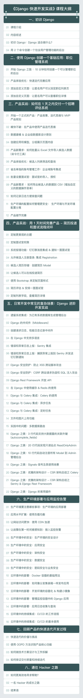

## 课程介绍

你好，我是悦创。

> 注：本课程使用 Django 3.1 版本进行教学。

Django 是当前最流行的 Python Web 框架，很多知名产品比如 Instagram、Disqus 等等都用到了 Django。

它能够快捷高效地帮我们解决实际问题，非常适合做企业内部管理系统的开发。

用 Django 开发一个简单的应用是很容易的，但是，如果你要进行较为复杂的项目开发，就要涉及到 Django Admin 的深入用法，也要花较长的时间了解整个 Django 的能力、周边插件和生态。

同时，产品上线后，怎么去做负载均衡，怎么设置安全策略，怎么做持续集成和持续交付，也不是一朝一夕就能学会的，这个都需要更加系统的学习以及更多实战经验的积累。

在这门课中，我们将围绕一个实战项目展开，用 2 天的时间开发一个企业管理系统，完成从开发到部署再到后期运维的全部流程。

学完之后：

1. 你会掌握 Django 管理后台的深度的定制方法，知道怎样去添加定制的功能；
2. 你会理解 Django 中间件的工作原理，能够自己设计实现一个中间件，完成诸如日志记录、系统鉴权、数据库访问、RPC 调度以及缓存处理等功能；
3. 你能够非常熟练地使用 Django 快速为企业现有的系统搭建一个管理后台，通过 Django 应用来补全现有系统的功能，同时不影响现有系统的继续使用；
4. 你能够深入掌握精益创业的产品思维，在学习技术的同时，提升自己的产品能力。

## 课程目录

## 适合人群

1. Web 开发工程师
2. 前端、后端工程师
3. 运维工程师
4. Python 工程师

欢迎关注我公众号：AI悦创，有更多更好玩的等你发现！

::: details 公众号：AI悦创【二维码】

:::

::: info AI悦创·编程一对一

AI悦创·推出辅导班啦，包括「Python 语言辅导班、C++ 辅导班、java 辅导班、算法/数据结构辅导班、少儿编程、pygame 游戏开发」，全部都是一对一教学：一对一辅导 + 一对一答疑 + 布置作业 + 项目实践等。当然，还有线下线上摄影课程、Photoshop、Premiere 一对一教学、QQ、微信在线，随时响应！微信：Jiabcdefh

C++ 信息奥赛题解，长期更新！长期招收一对一中小学信息奥赛集训，莆田、厦门地区有机会线下上门，其他地区线上。微信：Jiabcdefh

方法一：[QQ](http://wpa.qq.com/msgrd?v=3&uin=1432803776&site=qq&menu=yes)

方法二：微信：Jiabcdefh

:::

