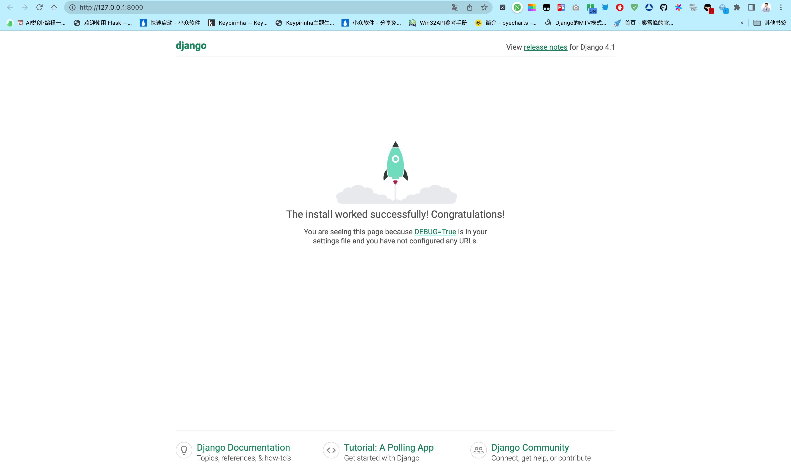

## 1. 开发环境说明

本教程写作时开发环境的系统平台为 MacOS，Python 版本为 3.10.10 （64 位），Django 版本为 4.1.7。

建议尽可能地与教程的开发环境保持一致（尤其是 Python 与 Django 版本），避免不必要的麻烦。Python 版本必须为 Python 3.10 或以上，django 版本号必须为 django 4.1.x。

::: warning 注意：

django 2.0 以上版本不再支持 Python 2。

:::

## 2. 使用虚拟环境

**强烈推荐在虚拟环境下进行 django 的开发。**

虚拟环境是一种 Python 工具，使用它可以创建一个独立的 Python 环境。

### 2.1 为什么要使用虚拟环境呢？

举个例子，假设你已经在系统中安装了 Python，并且在阅读此教程前你已经进行过一些 django 的学习，但那时候安装的 django 还是 2.x 的老版本。我们教程使用的是最新版的 django 4.1.x 版本，你可能不愿意删除掉旧版的 django 2.x，因为那可能导致你以前的项目无法运行。既想让原来的项目在 django 2.x 环境下运行，又想再安装 django 4.1.x 来开启本教程的项目，怎么办呢？使用虚拟环境就能够完美解决这个问题。

虚拟环境帮我们从系统的 Python 环境中克隆一个全新的 Python 环境出来，这个环境独立于原来的 Python 环境。我们可以在这个新克隆的环境下安装 django 4.1.x，并且在这个新环境下运行我们的新项目。

有多种方式创建和使用虚拟环境，此前我个人习惯使用 virtualenv 配合 virtualenvwrapper 两个 Python 库来使用和管理虚拟环境，现在我比较喜欢使用 Pipenv 代替上面两个工具。此外 Python 3.3 以后的发行版，自带一个 venv 供开箱即用。为了简单起见，这里介绍两种方式，一种是我之前用的 virtualenv，还有一种就是我现在在用的 Pipenv。virtualenvwrapper 和 venv 的使用，可以在学完这个教程后自行探索。

> 鉴于 Pipenv 可以完美替代 virtualenv 和 virtualenvwrapper，而且对项目依赖的管理做的更好，所以后续教程如果用到虚拟环境，都会使用 Pipenv 进行管理。

### 2.2 virtualenv 创建和管理虚拟环境

virtualenv 的使用非常简单，首先安装 virtualenv，打开命令行工具，输入下面的命令即可安装 virtualenv：

```python
➜  ~ pip3 install virtualenv
```

安装成功后就可以开始创建虚拟环境，指定一个你喜欢的目录，virtualenv 会把这个新的虚拟环境装到你指定目录下。例如我把它装到 `/Users/huangjiabao/GitHub/SourceCode/gossip_django` 目录下，并将虚拟环境命名为 `blogproject_virtualenv`（也可以取任何你喜欢的名字）。在命令栏运行如下命令：

```python
➜  ~ virtualenv /Users/huangjiabao/GitHub/SourceCode/gossip_django/blogproject_virtualenv
created virtual environment CPython3.10.10.final.0-64 in 132ms
  creator CPython3Posix(dest=/Users/huangjiabao/GitHub/SourceCode/gossip_django/blogproject_virtualenv, clear=False, no_vcs_ignore=False, global=False)
  seeder FromAppData(download=False, pip=bundle, setuptools=bundle, wheel=bundle, via=copy, app_data_dir=/Users/huangjiabao/Library/Application Support/virtualenv)
    added seed packages: pip==23.0, setuptools==67.1.0, wheel==0.38.4
  activators BashActivator,CShellActivator,FishActivator,NushellActivator,PowerShellActivator,PythonActivator
```

虚拟环境已经创建好了，我们需要激活这个环境，进入到刚才创建的虚拟环境的根目录，运行 Scripts 目录下的 activate 程序激活它：

```python
➜  ~ cd /Users/huangjiabao/GitHub/SourceCode/gossip_django
➜  gossip_django source blogproject_virtualenv/bin/activate
(blogproject_virtualenv) ➜  gossip_django
```

::: warning

Windows 使用的是如下命令：

```python
> cd \Users\huangjiabao\GitHub\SourceCode\gossip_django
> .\blogproject_virtualenv\Scripts\activate
(blogproject_virtualenv) >
```

:::

可以看到命令提示符前面多了 (blogproject_virtualenv)，说明我们已经成功激活了虚拟环境，接下来就可以开始安装 django 了。

::: warning

如果使用 PowerShell，微软默认不允许执行 ps1 脚本，如果你得到如下错误：

```python
+CategoryInfo          : SecurityError:(:) []，PSSecurityException
+FullyQualifiedErrorId : UnauthorizedAccess
```

需要修改 PowerShell 的脚本执行策略以允许 ps1 脚本运行，命令为 `Set-ExecutionPolicy RemoteSigned`：

```python
> Set-ExecutionPolicy RemoteSigned

执行策略更改
执行策略可帮助你防止执行不信任的脚本。更改执行策略可能会产生安全风险，如 https:/go.microsoft.com/fwlink/?LinkID=135170
中的 about_Execution_Policies 帮助主题所述。是否要更改执行策略?
[Y] 是(Y)  [A] 全是(A)  [N] 否(N)  [L] 全否(L)  [S] 暂停(S)  [?] 帮助 (默认值为“N”): Y
```

即将执行策略修改为允许执行被信任的且由发布者签名的下载自 Internet 的脚本。

:::

### 2.3 Pipenv 创建和管理虚拟环境

首先通过命令 `pip install pipenv` 安装 Pipenv。

然后创建一个文件夹，作为我们将要开发的博客项目的根目录，例如我在个人的工作目录 `/Users/huangjiabao/GitHub/SourceCode/` 下新建一个名为 `gossip_django` 的目录，作为项目根目录。

然后进入这个目录，在这个目录下执行 `pipenv install`，Pipenv 将会为我们做好一切工作。

具体来说，Pipenv 会根据项目文件夹的名称创建一个虚拟环境，并且会在项目根目录下生成 `Pipfile` 和 `Pipfile.lock` 用于管理项目依赖（以后使用 Pipenv 安装的依赖会自动写入 Pipfile 文件，无需再手动维护 `requirements.txt` 文件，类似于 `node.js` 的 `package.json`，简直爽歪歪）。

此外，Pipenv 还非常贴心地输出下列信息，告诉你如何使用创建的虚拟环境：

> To activate this project's virtualenv, run pipenv shell.
>
> Alternatively, run a command inside the virtualenv with pipenv run.

即，要激活虚拟环境，在项目根目录下运行 `pipenv shell` 命令。

或者，没有激活虚拟环境的情况下，运行 `pipenv run + 命令`，也可以在虚拟环境中执行指定的命令。

考虑到 Pipenv 可以非常方便地帮我们管理虚拟环境以及项目依赖，后续我们将始终使用 Pipenv 作为虚拟环境管理工具。

::: tip 提示

**你可能想知道 pipenv 创建的虚拟环境在哪里？**

默认情况下，Pipenv 会将虚拟环境创建在 `gossip_django` 目录下，在项目根目录下使用 `pipenv --venv` 可以查看到项目对应的虚拟环境的具体位置：

```python
➜  gossip_django pipenv --venv
/Users/huangjiabao/.local/share/virtualenvs/gossip_django-ZQeY6wPY
```

:::

## 3. 安装 Django

Django 的官方文档对 [如何安装 django](https://docs.djangoproject.com/en/4.1/intro/install/) 给出了详细且明确的指导，不过我们目前用不上这些，只需使用 pipenv 命令就可以解决问题。**进入项目根目录**，运行：

```python {1}
➜  gossip_django pipenv install django==4.1.7
Installing django==4.1.7...
Resolving django==4.1.7...
Installing...
Adding django to Pipfile's [packages] ...
✔ Installation Succeeded
Pipfile.lock (4801e4) out of date, updating to (e062db)...
Locking [packages] dependencies...
Building requirements...
Resolving dependencies...
✔ Success!
Locking [dev-packages] dependencies...
Updated Pipfile.lock (d41549317508291ef2fa7a316435d8d5e96c0d02db9eafa5d7aa74137be062db)!
Installing dependencies from Pipfile.lock (e062db)...
To activate this project's virtualenv, run pipenv shell.
Alternatively, run a command inside the virtualenv with pipenv run.
```

我们用 `django==4.1.7` 来安装指定的 django 版本以保证和教程中的一致。如果你直接 `pipenv install django` 的话有可能安装最新的 django 发行版本，而不是 `django 4.1.7`，有可能带来不兼容性，为后续教程的顺利进行带来麻烦。

测试一下安装是否成功，先在命令行输入 `pipenv run python` 启动**虚拟环境**中的 Python 解释器交互界面。

然后输入 `import django` ，如果没有报错就说明 django 安装成功。

通过运行 `print(django.get_version())` 打印出 django 的版本号，确保安装了正确版本的 django。

```python
➜  gossip_django pipenv run python
Python 3.10.10 (main, Feb  8 2023, 05:34:50) [Clang 14.0.0 (clang-1400.0.29.202)] on darwin
Type "help", "copyright", "credits" or "license" for more information.
>>> import django
>>> print(django.get_version())
4.1.7
```

## 4. 建立 Django 工程

万事已经具备了，让我们来建立 django 项目工程。

django 工程（Project）是我们项目代码的容器，例如我们博客项目中所有的代码（包括 django 为我们自动生成的以及我们自己写的）都包含在这个工程里。

其实说通俗一点就是用一个文件夹把一系列 Python 代码文件和 django 配置文件包裹起来，这个文件夹就可以看做一个 django 工程。我们不必亲自动手新建这个文件夹和代码文件，django 的内置命令已经帮我们做了这些事情。

例如:我把博客工程的代码放在 `/Users/huangjiabao/GitHub/SourceCode/gossip_django` 目录下，工程名我把它叫做 `gossip_django_blog` ，那么在项目根目录运行如下命令创建工程：

```python
➜  gossip_django pipenv run django-admin startproject gossip_django_blog .
```

`django-admin startproject` 命令用来初始化一个 django 项目，它接收两个参数，第一个是项目名 `gossip_django_blog`，第二个指定项目生成的位置，因为之前我们为了使用 Pipenv 创建了项目根目录，所以将项目位置指定为此前创建的位置。

进入工程所在目录 `/Users/huangjiabao/GitHub/SourceCode/gossip_django`（你可能设置在其它路径），会发现多了一个 `gossip_django_blog` 的目录，整个项目的文件结构如下：

```python
➜  gossip_django tree
.
├── Pipfile
├── Pipfile.lock
├── gossip_django_blog
│   ├── __init__.py
│   ├── asgi.py
│   ├── settings.py
│   ├── urls.py
│   └── wsgi.py
└── manage.py
```

最顶层的 `gossip_django` 目录是我们刚刚指定的项目根目录。`gossip_django` 目录下面有一个 `manage.py` 文件，manage 是管理的意思，顾名思义 `manage.py` 就是 django 为我们生成的管理这个项目的 Python 脚本文件，以后用到时会再次介绍。与 `manage.py` 同级的还有一个 `gossip_django_blog` 的目录，这里面存放了一些 django 的配置文件，例如 `settings.py`、`urls.py` 等等，以后用到时会详细介绍。

## 5. Hello Django

网站需要运行在一个 Web 服务器上，django 已经为我们提供了一个用于本地开发的 Web 服务器。在命令行工具里进入到 `manage.py` 所在目录，即 `gossip_django` 目录下。运行 `pipenv run python manage.py runserver` 命令就可以在本机上开启一个 Web 服务器：

```python {1}
➜  gossip_django pipenv run python manage.py runserver
Watching for file changes with StatReloader
Performing system checks...

System check identified no issues (0 silenced).

You have 18 unapplied migration(s). Your project may not work properly until you apply the migrations for app(s): admin, auth, contenttypes, sessions.
Run 'python manage.py migrate' to apply them.
February 27, 2023 - 15:28:22
Django version 4.1.7, using settings 'gossip_django_blog.settings'
Starting development server at http://127.0.0.1:8000/
Quit the server with CONTROL-C.
```

看到这样的信息表明我们的服务器开启成功。

在浏览器输入 [http://127.0.0.1:8000/](http://127.0.0.1:8000/) ，看到如下的页面：



::: warning 

如果在浏览器输入 [http://127.0.0.1:8000/](http://127.0.0.1:8000/) 后显示无法访问该网站，请检查是不是浏览器代理的问题。比如开启了某些 VPN 代理服务等，将它们全部关闭即可。

:::

这是 `manage.py` 的第一个用法，运行它的 `runserver` 命令开启本地开发服务器，以后我们还会遇到更多的命令。

命令栏工具下按 `Ctrl + C` 可以退出开发服务器（按一次没用的话连续多按几次）。重新开启则再次运行 `python manage.py runserver` 。

django 默认的语言是英语，所以显示给我们的欢迎页面是英文的。我们在 django 的配置文件里稍作修改，让它支持中文。用任何一个文本编辑器打开 `settings.py` 文件，找到如下的两行代码：

```python
# filename: gossip_django/gossip_django_blog/settings.py
## 其它配置代码...

LANGUAGE_CODE = 'en-us'

TIME_ZONE = 'UTC'

## 其它配置代码...
```

把 `LANGUAGE_CODE` 的值改为 `zh-hans`，`TIME_ZONE` 的值改为 `Asia/Shanghai`：

```python
# filename: gossip_django/gossip_django_blog/settings.py

# 把英文改为中文
# LANGUAGE_CODE = 'en-us'
LANGUAGE_CODE = 'zh-hans'
# 把国际时区改为中国时区（东八区）
# TIME_ZONE = 'UTC'
TIME_ZONE = 'Asia/Shanghai'
## 其它配置代码...
```

**保存更改后**关闭 `settings.py` 文件。

再次运行开发服务器，并在浏览器打开 [http://127.0.0.1:8000/](http://127.0.0.1:8000/)，可以看到 django 已经支持中文了。

一切准备就绪，开始进入我们的 django 博客开发之旅吧！

> 文中涉及的示例代码，已同步更新到 gossip_django 仓库。地址：[https://github.com/AndersonHJB/gossip_django](https://github.com/AndersonHJB/gossip_django)


欢迎关注我公众号：AI悦创，有更多更好玩的等你发现！

::: details 公众号：AI悦创【二维码】


:::

::: info AI悦创·编程一对一

AI悦创·推出辅导班啦，包括「Python 语言辅导班、C++ 辅导班、java 辅导班、算法/数据结构辅导班、少儿编程、pygame 游戏开发、Linux、Web」，全部都是一对一教学：一对一辅导 + 一对一答疑 + 布置作业 + 项目实践等。当然，还有线下线上摄影课程、Photoshop、Premiere 一对一教学、QQ、微信在线，随时响应！微信：Jiabcdefh

C++ 信息奥赛题解，长期更新！长期招收一对一中小学信息奥赛集训，莆田、厦门地区有机会线下上门，其他地区线上。微信：Jiabcdefh

方法一：[QQ](http://wpa.qq.com/msgrd?v=3&uin=1432803776&site=qq&menu=yes)

方法二：微信：Jiabcdefh

:::


