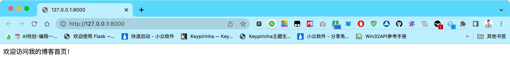
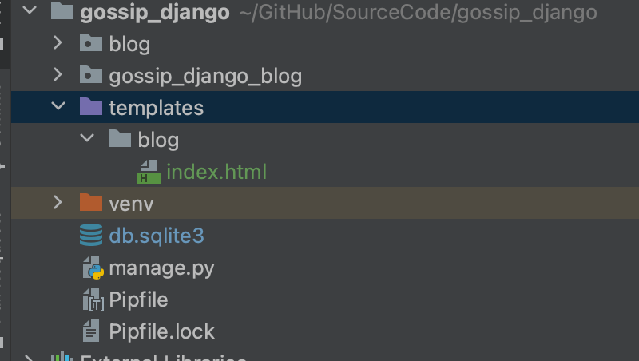

## 1. Django 处理 HTTP 请求

你好，我是悦创。

Web 应用的交互过程其实就是 HTTP 请求与响应的过程。无论是在 PC 端还是移动端，我们通常使用浏览器来上网，上网流程大致来说是这样的：

1. 我们打开浏览器，在地址栏输入想访问的网址，比如 [https://bornforthis.cn/](https://bornforthis.cn/)（当然你也可能从收藏夹里直接打开网站，但本质上都是一样的）。
2. 浏览器知道我们想要访问哪个网址后，它在后台帮我们做了很多事情。主要就是把我们的访问意图包装成一个 HTTP 请求，发给我们想要访问的网址所对应的服务器。通俗点说就是浏览器帮我们通知网站的服务器，说有人来访问你啦，访问的请求都写在 HTTP 报文里了，你按照要求处理后告诉我，我再帮你回应他！
3. 服务器处理了HTTP 请求，然后生成一段 HTTP 响应给浏览器。浏览器解读这个响应，把相关的内容在浏览器里显示出来，于是我们就看到了网站的内容。比如你访问了我的博客主页 [https://bornforthis.cn/](https://bornforthis.cn/)，服务器接收到这个请求后就知道用户访问的是首页，首页显示的是全部文章列表，于是它从数据库里把文章数据取出来，生成一个写着这些数据的 HTML 文档，包装到 HTTP 响应里发给浏览器，浏览器解读这个响应，把 HTML 文档显示出来，我们就看到了文章列表的内容。

因此，django 作为一个 Web 框架，它的使命就是处理流程中的第二步。即接收浏览器发来的 HTTP 请求，返回相应的 HTTP 响应。于是引出这么几个问题：

1. django 如何接收 HTTP 请求？
2. django 如何处理这个 HTTP 请求？
3. django 如何生成 HTTP 响应？

对于如何处理这些问题，django 有其一套规定的机制。我们按照 django 的规定，就能开发出所需的功能。

## 2. Hello 视图函数

我们先以一个最简单的 Hello World 为例来看看 django 处理上述问题的机制是怎么样的。

### 2.1 绑定 URL 与视图函数

首先 django 需要知道当用户访问不同的网址时，应该如何处理这些不同的网址（即所说的路由）。django 的做法是把不同的网址对应的处理函数写在一个 `urls.py` 文件里，当用户访问某个网址时，django 就去会这个文件里找，如果找到这个网址，就会调用和它绑定在一起的处理函数（叫做视图函数）。

下面是具体的做法，**首先在 blog 应用的目录下创建一个 urls.py 文件**，这时你的目录看起来是这样：

```python {28}
➜  gossip_django git:(main) ✗ tree forld
forld  [error opening dir]

0 directories, 0 files
➜  gossip_django git:(main) ✗ tree blog
blog
├── __init__.py
├── admin.py
├── apps.py
├── migrations
│   ├── 0001_initial.py
│   └── __init__.py
├── models.py
├── tests.py
└── views.py

2 directories, 8 files
➜  gossip_django git:(main) ✗ tree blog
blog
├── __init__.py
├── admin.py
├── apps.py
├── migrations
│   ├── 0001_initial.py
│   └── __init__.py
├── models.py
├── tests.py
├── urls.py
└── views.py

2 directories, 9 files
➜  gossip_django git:(main) ✗
```

在 `blog\urls.py` 中写入这些代码：

```python
# -*- coding: utf-8 -*-
# @Time    : 2023/3/4 22:42
# @Author  : AI悦创
# @FileName: urls.py.py
# @Software: PyCharm
# @Blog    ：https://bornforthis.cn/
from django.urls import path

from . import views

urlpatterns = [
    path('', views.index, name='index'),
]
```

我们首先从 `django.urls` 导入了 `path` 函数，又从当前目录下导入了 views 模块。然后我们把网址和处理函数的关系写在了 `urlpatterns` 列表里。

绑定关系的写法是把网址和对应的处理函数作为参数传给 `path` 函数（第一个参数是网址，第二个参数是处理函数），另外我们还传递了另外一个参数 `name`，这个参数的值将作为处理函数 `index` 的别名，这在以后会用到。

注意这里我们的网址实际上是一个规则，django 会用这个规则去匹配用户实际输入的网址，如果匹配成功，就会调用其后面的视图函数做相应的处理。

比如说我们本地开发服务器的域名是 [http://127.0.0.1:8000](http://127.0.0.1:8000/)，那么当用户输入网址 [http://127.0.0.1:8000](http://127.0.0.1:8000/) 后，django 首先会把协议 `http`、域名 `127.0.0.1` 和端口号 8000 去掉，此时只剩下一个空字符串，而 `''` 的模式正是匹配一个空字符串，于是二者匹配，django 便会调用其对应的 `views.index` 函数。

::: warning

在 gossip_django_blog 目录下（即 `settings.py` 所在的目录），原本就有一个 `urls.py` 文件，这是整个工程项目的 URL 配置文件。而我们这里新建了一个 `urls.py` 文件，且位于 blog 应用下。这个文件将用于 blog 应用相关的 URL 配置，这样便于模块化管理。不要把两个文件搞混了。

:::

### 2.2 编写视图函数

第二步就是要实际编写我们的 `views.index` 视图函数了，按照惯例视图函数定义在 `views.py` 文件里：

```python {4,10-11}
# filename: blog/views.py

from django.shortcuts import render
from django.http import HttpResponse


# Create your views here.


def index(request):
    return HttpResponse("欢迎访问我的博客首页！")
```

我们前面说过，Web 服务器的作用就是接收来自用户的 HTTP 请求，根据请求内容作出相应的处理，并把处理结果包装成 HTTP 响应返回给用户。

这个两行的函数体现了这个过程。它首先接受了一个名为 `request` 的参数，这个 `request` 就是 django 为我们封装好的 HTTP 请求，它是类 `HttpRequest` 的一个实例。然后我们便直接返回了一个 HTTP 响应给用户，这个 HTTP 响应也是 django 帮我们封装好的，它是类 `HttpResponse` 的一个实例，只是我们给它传了一个自定义的字符串参数。

浏览器接收到这个响应后就会在页面上显示出我们传递的内容 ：欢迎访问我的博客首页！

**这个时候，我估计你会迫不及待的运行 Django 但是，你会发现运行并没有效果。**

还差最后一步了，我们前面建立了一个 `urls.py` 文件，并且绑定了 URL 和视图函数 `index`，但是 django 并不知道。django 匹配 URL 模式是在 `gossip_django_blog` 目录（即 `settings.py` 文件所在的目录）的 `urls.py` 下的，所以我们要把 blog 应用下的 `urls.py` 文件包含到 `gossip_django_blog\urls.py` 里去，打开这个文件看到如下内容：

```python
# filename: gossip_django_blog/urls.py

"""
一大段注释
"""

from django.contrib import admin
from django.urls import path

urlpatterns = [
    path('admin/', admin.site.urls),
]
```

修改成如下的形式：

```python {2,6}
from django.contrib import admin
from django.urls import path, include

urlpatterns = [
    path('admin/', admin.site.urls),
    path('', include('blog.urls')),
]
```

我们这里导入了一个 `include` 函数，然后利用这个函数把 blog 应用下的 `urls.py` 文件包含了进来。此外 include 前还有一个 `''`，这是一个空字符串。

这里也可以写其它字符串，django 会把这个字符串和后面 include 的 `urls.py` 文件中的 URL 拼接。比如说如果我们这里把 `''` 改成 `'blog/'`，而我们在 `blog/urls.py` 中写的 URL 是 `''`，即一个空字符串。那么 django 最终匹配的就是 `blog/` 加上一个空字符串，即 `blog/`。

### 2.3 运行结果

运行 `pipenv run python manage.py runserver` 打开开发服务器，在浏览器输入开发服务器的地址 [http://127.0.0.1:8000/](http://127.0.0.1:8000/)，可以看到 django 返回的内容了。

> 欢迎访问我的博客首页！




## 3. 使用 django 模板系统

这基本上就上 django 的开发流程了，写好处理 HTTP 请求和返回 HTTP 响应的视图函数，然后把视图函数绑定到相应的 URL 上。

**但是等一等！**

我们看到在视图函数里返回的是一个 `HttpResponse` 类的实例，我们给它传入了一个希望显示在用户浏览器上的字符串。但是我们的博客不可能只显示这么一句话，它有可能会显示很长很长的内容。比如我们发布的博客文章列表，或者一大段的博客文章。我们不能每次都把这些大段大段的内容传给 `HttpResponse`。

django 对这个问题给我们提供了一个很好的解决方案，叫做模板系统。django 要我们把大段的文本写到一个文件里，然后 django 自己会去读取这个文件，再把读取到的内容传给 `HttpResponse`。让我们用模板系统来改造一下上面的例子。

首先在我们的项目**根目录**（即 `manage.py` 文件所在目录）下建立一个名为 templates 的文件夹，用来存放我们的模板。然后在 templates 目录下建立一个名为 blog 的文件夹，用来存放和 blog 应用相关的模板。

当然模板存放在哪里是无关紧要的，只要 django 能够找到的就好。但是我们建立这样的文件夹结构的目的是把不同应用用到的模板隔离开来，这样方便以后维护。我们在 `templates/blog` 目录下建立一个名为 `index.html` 的文件，此时你的目录结构应该是这样的：



::: warning

再一次强调 templates 目录位于项目根目录，而 `index.html` 位于 `templates/blog` 目录下，而不是 blog 应用下，如果弄错了你可能会得到一个 `TemplateDoesNotExist` 异常。如果遇到这个异常，请回来检查一下模板目录结构是否正确。

:::

在 `templates/blog/index.html` 文件里写入下面的代码：

```html
<!DOCTYPE html>
<html lang="en">
<head>
    <meta charset="UTF-8">
    <title>{{ title }}</title>
</head>
<body>
    <h1>{{ welcome }}</h1>
</body>
</html>
```

这是一个标准的 HTML 文档，只是里面有两个比较奇怪的地方：`{{ title }}`，`{{ welcome }}`。这是 django 规定的语法。用 `{{ }}` 包起来的变量叫做模板变量。django 在渲染这个模板的时候会根据我们传递给模板的变量替换掉这些变量。最终在模板中显示的将会是我们传递的值。

::: warning

`index.html` 必须以 UTF-8 的编码格式保存，且小心不要往里面添加一些特殊字符，否则极有可能得到一个 `UnicodeDecodeError` 这样的错误。

:::

模板写好了，还得告诉 django 去哪里找模板，在 settings.py 文件里设置一下模板文件所在的路径。在 `settings.py` 找到 `TEMPLATES` 选项，它的内容是这样的：

```python
# filename: gossip_django_blog/settings.py

TEMPLATES = [
    {
        'BACKEND': 'django.template.backends.django.DjangoTemplates',
        'DIRS': [],
        'APP_DIRS': True,
        'OPTIONS': {
            'context_processors': [
                'django.template.context_processors.debug',
                'django.template.context_processors.request',
                'django.contrib.auth.context_processors.auth',
                'django.contrib.messages.context_processors.messages',
            ],
        },
    },
]
```

其中 `DIRS` 就是设置模板的路径，在 `[]` 中写入 `os.path.join(BASE_DIR, 'templates')`，即像下面这样：

```python {1,6}
import os

TEMPLATES = [
    {
        'BACKEND': 'django.template.backends.django.DjangoTemplates',
        'DIRS': [os.path.join(BASE_DIR, 'templates')],
        'APP_DIRS': True,
        'OPTIONS': {
            'context_processors': [
                'django.template.context_processors.debug',
                'django.template.context_processors.request',
                'django.contrib.auth.context_processors.auth',
                'django.contrib.messages.context_processors.messages',
            ],
        },
    },
]
```

这里 `BASE_DIR` 是 `settings.py` 在配置开头前面定义的变量，记录的是工程根目录 gossip_django 的值。在这个目录下有模板文件所在的目录 `templates/`，于是利用 `os.path.join`  把这两个路径连起来，构成完整的模板路径，django 就知道去这个路径下面找我们的模板了。

视图函数可以改一下了：

```python {12-16}
# filename: blog/views.py

from django.shortcuts import render
from django.http import HttpResponse


# Create your views here.


# def index(request):
#     return HttpResponse("欢迎访问我的博客首页！")
def index(request):
    return render(request, 'blog/index.html', context={
        'title': '我的博客首页',
        'welcome': '欢迎访问我的博客首页'
    })
```

这里我们不再是直接把字符串传给 `HttpResponse` 了，而是调用 django 提供的 `render` 函数。这个函数根据我们传入的参数来构造 `HttpResponse`。

我们首先把 HTTP 请求传了进去，然后 `render` 根据第二个参数的值 `blog/index.html` 找到这个模板文件并读取模板中的内容。之后 `render` 根据我们传入的 `context` 参数的值把模板中的变量替换为我们传递的变量的值，`{{ title }}` 被替换成了 `context` 字典中 `title` 对应的值，同理 `{{ welcome }}` 也被替换成相应的值。

最终，我们的 HTML 模板中的内容字符串被传递给 `HttpResponse` 对象并返回给浏览器（django 在 `render` 函数里隐式地帮我们完成了这个过程），这样用户的浏览器上便显示出了我们写的 HTML 模板的内容了。


欢迎关注我公众号：AI悦创，有更多更好玩的等你发现！

::: details 公众号：AI悦创【二维码】


:::

::: info AI悦创·编程一对一

AI悦创·推出辅导班啦，包括「Python 语言辅导班、C++ 辅导班、java 辅导班、算法/数据结构辅导班、少儿编程、pygame 游戏开发、Linux、Web」，全部都是一对一教学：一对一辅导 + 一对一答疑 + 布置作业 + 项目实践等。当然，还有线下线上摄影课程、Photoshop、Premiere 一对一教学、QQ、微信在线，随时响应！微信：Jiabcdefh

C++ 信息奥赛题解，长期更新！长期招收一对一中小学信息奥赛集训，莆田、厦门地区有机会线下上门，其他地区线上。微信：Jiabcdefh

方法一：[QQ](http://wpa.qq.com/msgrd?v=3&uin=1432803776&site=qq&menu=yes)

方法二：微信：Jiabcdefh

:::


