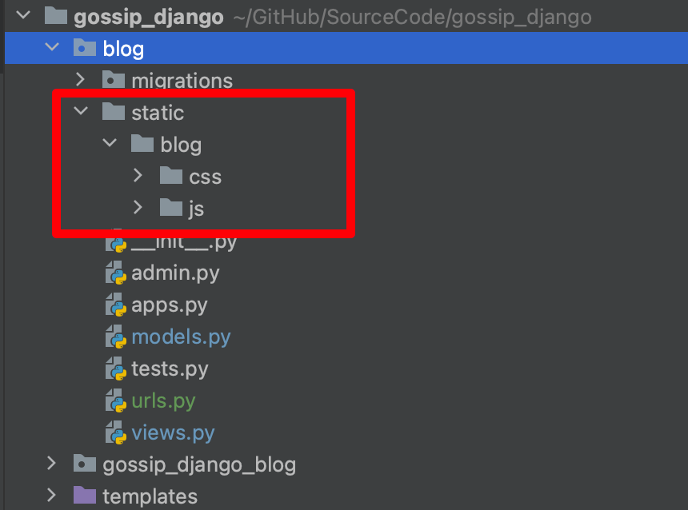
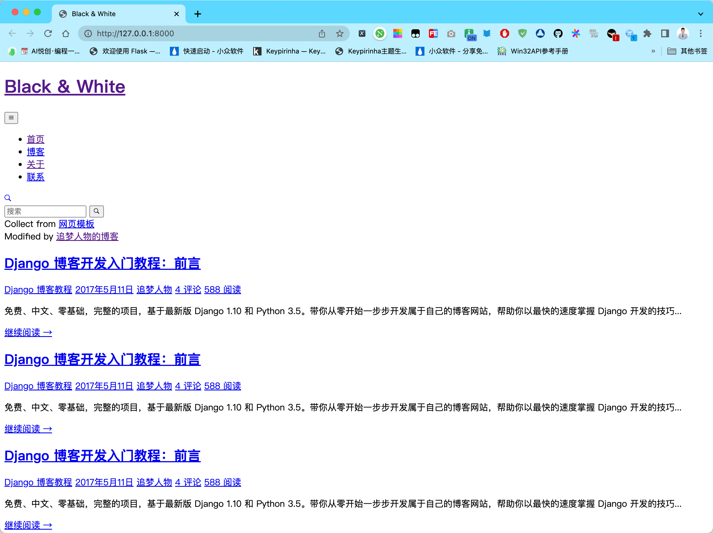
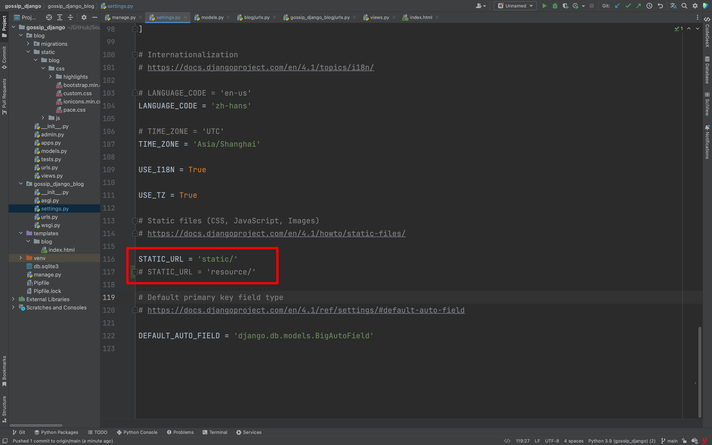
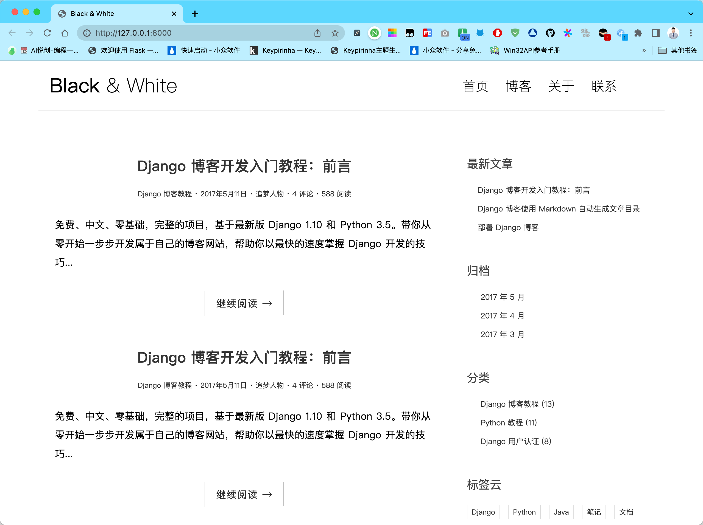

你好，我是悦创。

在此之前我们已经编写了博客的首页视图，并且配置了 URL 和模板，让 django 能够正确地处理 HTTP 请求并返回合适的 HTTP 响应。不过我们仅仅在首页返回了一句话：欢迎访问我的博客。这是个 Hello World 级别的视图函数，我们需要编写真正的首页视图函数，当用户访问我们的博客首页时，他将看到我们发表的博客文章列表，就像 [演示项目](#) 里展示的这样。

## 1. 首页视图函数

上一节我们阐明了 django 的开发流程。即首先配置 URL，把 URL 和相应的视图函数绑定，一般写在 `urls.py` 文件里，然后在工程的 `urls.py` 文件引入。

其次是编写视图函数，视图中需要渲染模板，我们也在 `settings.py` 中进行了模板相关的配置，让 django 能够找到需要渲染的模板。最后把渲染完成的 HTTP 响应返回就可以了。相关的配置和准备工作都在之前完成了，这里我们只需专心编写视图函数，让它实现我们想要的功能即可。

首页的视图函数其实很简单，代码像这样：

```python
# filename: blog/views.py

from django.shortcuts import render
from .models import Post

def index(request):
    post_list = Post.objects.all().order_by('-created_time')
    return render(request, 'blog/index.html', context={'post_list': post_list})
```

我们曾经在前面的章节讲解过模型管理器 `objects` 的使用。

这里我们使用 `all()` 方法从数据库里获取了全部的文章，存在了 `post_list` 变量里。`all` 方法返回的是一个 `QuerySet`（可以理解成一个类似于列表的数据结构），由于通常来说博客文章列表是按文章发表时间倒序排列的，即最新的文章排在最前面，所以我们紧接着调用了 `order_by` 方法对这个返回的 queryset 进行排序。排序依据的字段是 `created_time`，即文章的创建时间。`-` 号表示逆序，如果不加 `-` 则是正序。 接着如之前所做，我们渲染了 `blog/index.html` 模板文件，并且把包含文章列表数据的 `post_list` 变量传给了模板。

## 2. 处理静态文件

我们的项目使用了从网上下载的一套博客模板（[点击这里下载全套模板](https://github.com/AndersonHJB/django-blog-tutorial-templates)）。这里面除了 HTML 文档外，还包含了一些 CSS 文件和 JavaScript 文件以让网页呈现出我们现在看到的样式。同样我们需要对 django 做一些必要的配置，才能让 django 知道如何在开发服务器中引入这些 CSS 和 JavaScript 文件，这样才能让博客页面的 CSS 样式生效。

按照惯例，我们把 CSS 和 JavaScript 文件放在 **blog 应用**的 static 目录下。

- 因此，先在 **blog 应用**下建立一个 static 文件夹。

- 同时，为了避免和其它应用中的 CSS 和 JavaScript 文件命名冲突（别的应用下也可能有和 blog 应用下同名的 CSS 、JavaScript 文件），我们再在 static 目录下建立一个 blog 文件夹。
- 把下载的博客模板中的 css 和 js 文件夹连同里面的全部文件一同拷贝进这个目录。

最终我们的 blog 应用目录结构应该是这样的：



用下载的博客模板中的 `index.html` 文件替换掉之前我们自己写的 `index.html` 文件。如果你好奇，现在就可以运行开发服务器，看看首页是什么样子。




如图所示，你会看到首页显示的样式非常混乱，原因是浏览器无法正确加载 CSS 等样式文件。需要以 django 的方式来正确地处理 CSS 和 JavaScript 等静态文件的加载路径。

CSS 样式文件通常在 HTML 文档的 head 标签里引入，打开 `index.html` 文件，在文件的开始处找到 head 标签包裹的内容，大概像这样：

```html
# filename: templates/blog/index.html

<!DOCTYPE html>
<html>
  <head>
      <title>Black &amp; White</title>

      <!-- meta -->
      <meta charset="UTF-8">
      <meta name="viewport" content="width=device-width, initial-scale=1">

      <!-- css -->
      <link rel="stylesheet" href="css/bootstrap.min.css">
      <link rel="stylesheet" href="http://code.ionicframework.com/ionicons/2.0.1/css/ionicons.min.css">
      <link rel="stylesheet" href="css/pace.css">
      <link rel="stylesheet" href="css/custom.css">

      <!-- js -->
      <script src="js/jquery-2.1.3.min.js"></script>
      <script src="js/bootstrap.min.js"></script>
      <script src="js/pace.min.js"></script>
      <script src="js/modernizr.custom.js"></script>
  </head>
  <body>
      <!-- 其它内容 -->
      <script src="js/script.js"></script>
  </body>
</html>
```

CSS 样式文件的路径在 link 标签的 href 属性里，而 JavaScript 文件的路径在 script 标签的 src 属性里。可以看到诸如 `href="css/bootstrap.min.css"` 或者 `src="js/jquery-2.1.3.min.js"` 这样的引用，由于引用文件的路径不对，所以浏览器引入这些文件失败。我们需要把它们改成正确的路径。把代码改成下面样子，正确地引入 static 文件下的 CSS 和 JavaScript 文件：

```html
templates/blog/index.html

+ 
<!DOCTYPE html>
<html>
  <head>
      <title>Black &amp; White</title>

      <!-- meta -->
      <meta charset="UTF-8">
      <meta name="viewport" content="width=device-width, initial-scale=1">

      <!-- css -->
      - <link rel="stylesheet" href="css/bootstrap.min.css">
      <link rel="stylesheet" href="http://code.ionicframework.com/ionicons/2.0.1/css/ionicons.min.css">
      - <link rel="stylesheet" href="css/pace.css">
      - <link rel="stylesheet" href="css/custom.css">
      + <link rel="stylesheet" href="">
      + <link rel="stylesheet" href="">
      + <link rel="stylesheet" href="">

      <!-- js -->
      - <script src="js/jquery-2.1.3.min.js"></script>
      - <script src="js/bootstrap.min.js"></script>
      - <script src="js/pace.min.js"></script>
      - <script src="js/modernizr.custom.js"></script>
      + <script src=""></script>
      + <script src=""></script>
      + <script src=""></script>
      + <script src=""></script>
  </head>
  <body>
      <!-- 其它内容 -->
      - <script src="js/script.js' %}"></script>
      + <script src=""></script>
  </body>
</html>
```

**这里 - 表示删掉这一行，而 + 表示增加这一行。（增加了哪些内容看仔细一点，千万别漏掉）**

我们把引用路径放在了一个奇怪的符号里，例如：`href=""`。用 `` 包裹起来的叫做**模板标签**。我们前面说过用 `{{ }}` 包裹起来的叫做**模板变量**，其作用是在最终渲染的模板里显示由视图函数传过来的变量值。而这里我们使用的模板标签的功能则类似于函数，例如这里的 `static` 模板标签，它把跟在后面的字符串 `'css/bootstrap.min.css'` 转换成正确的文件引入路径。这样 css 和 js 文件才能被正确加载，样式才能正常显示。

::: warning

为了能在模板中使用 `` 模板标签，别忘了在最顶部 `` 。static 模板标签位于 static 模块中，只有通过 load 模板标签将该模块引入后，才能在模板中使用 `` 标签。

:::

替换完成后你可以刷新页面并看看网页的源代码，看一看 `` 模板标签在页面渲染后究竟被替换成了什么样的值。例如我们可以看到

```html
<link rel="stylesheet" href="">
```

这一部分最终在浏览器中显示的是：

```html
<link rel="stylesheet" href="/static/blog/css/pace.css">
```

这正是 `pace.css` 文件所在的路径，其它的文件路径也被类似替换。可以看到 ` ` 标签的作用实际就是把后面的字符串加了一个 `/static/` 前缀，比如 `` 最终渲染的值是 `/static/blog/css/pace.css`。而 `/static/` 前缀是我们在 `settings.py` 文件中通过 `STATIC_URL = '/static/'` 指定的。

事实上，如果我们直接把引用路径写成 `/static/blog/css/pace.css` 也是可以的，那么为什么要使用 `` 标签呢？想一下，目前 URL 的前缀是 `/static/`，如果哪一天因为某些原因，我们需要把 `/static/` 改成 `/resource/`，如果你是直接写的引用路径而没有使用 static 模板标签，那么你可能需要改 N 个地方。如果你使用了 static 模板标签，那么只要在 `settings.py` 处改一个地方就可以了，即把 `STATIC_URL = '/static/'` 改成 `STATIC_URL = '/resource/'`。



::: tip

有时候按 F5 刷新后页面还是很乱，这可能是因为浏览器缓存了之前的结果。按 Shift + F5（有些浏览器可能是 Ctrl + F5）强制刷新浏览器页面即可。如果还是不行，重启一下开发服务器以及清除浏览器缓存。

:::

注意这里有一个 CSS 文件的引入：

```html
<link rel="stylesheet" href="http://code.ionicframework.com/ionicons/2.0.1/css/ionicons.min.css">
```

我们没有使用模板标签，因为这里的引用的文件是一个外部文件，不是我们项目里 `static/blog/css` 目录下的文件，因此无需使用模板标签。

正确引入了静态文件后样式显示正常了。




## 3. 修改模板

目前我们看到的只是模板中预先填充的一些数据，我们得让它显示从数据库中获取的文章数据。下面来稍微改造一下模板：

在模板 `index.html` 中你会找到一系列 `article` 标签：

```html
templates/blog/index.html

...
<article class="post post-1">
  ...
</article>

<article class="post post-2">
  ...
</article>

<article class="post post-3">
  ...
</article>
...
```

这里面包裹的内容显示的就是文章数据了。我们前面在视图函数 `index` 里给模板传了一个 `post_list` 变量，它里面包含着从数据库中取出的文章列表数据。就像 Python 一样，我们可以在模板中循环这个列表，把文章一篇篇循环出来，然后一篇篇显示文章的数据。要在模板中使用循环，需要使用到前面提到的模板标签，这次使用 `` 模板标签。将 `index.html` 中多余的 article 标签删掉，只留下一个 article 标签，然后写上下列代码：

```html
templates/blog/index.html

...

  <article class="post post-{{ post.pk }}">
    ...
  </article>

  <div class="no-post">暂时还没有发布的文章！</div>

...
```

可以看到语法和 Python 的 for 循环类似，只是被 `` 这样一个模板标签符号包裹着。` `的作用是当 `post_list` 为空，即数据库里没有文章时显示 `` 下面的内容，最后我们用 `` 告诉 django 循环在这里结束了。

**你可能不太理解模板中的 `post` 和 `post_list` 是什么。**

`post_list` 是一个 `QuerySet`（类似于一个列表的数据结构），其中每一项都是之前定义在 `blog/models.py` 中的 Post 类的实例，且每个实例分别对应着数据库中每篇文章的记录。因此我们循环遍历 `post_list` ，每一次遍历的结果都保存在 `post` 变量里。

所以我们使用模板变量来显示 `post` 的属性值。例如这里的 `{{ post.pk }}`（pk 是 `primary key` 的缩写，即 post 对应于数据库中记录的 id 值，该属性尽管我们没有显示定义，但是 django 会自动为我们添加）。

现在我们可以在循环体内通过 `post` 变量访问单篇文章的数据了。分析 article 标签里面的 HTML 内容，h1 显示的是文章的标题，

```html
<h1 class="entry-title">
    <a href="single.html">Adaptive Vs. Responsive Layouts And Optimal Text Readability</a>
</h1>
```

我们把标题替换成 `post` 的 `title` 属性值。注意要把它包裹在模板变量里，因为它最终要被替换成实际的 title 值。

```html
<h1 class="entry-title">
    <a href="single.html">{{ post.title }}</a>
</h1>
```

下面这 5 个 span 标签里分别显示了分类（category）、文章发布时间、文章作者、评论数、阅读量。

```html
<div class="entry-meta">
  <span class="post-category"><a href="#">django 博客教程</a></span>
  <span class="post-date"><a href="#"><time class="entry-date"
                                            datetime="2012-11-09T23:15:57+00:00">2017年5月11日</time></a></span>
  <span class="post-author"><a href="#">追梦人物</a></span>
  <span class="comments-link"><a href="#">4 评论</a></span>
  <span class="views-count"><a href="#">588 阅读</a></span>
</div>
```

再次替换掉一些数据，由于评论数和阅读量暂时没法替换，因此先留着，我们在之后实现了这些功能后再来修改它，目前只替换分类、文章发布时间、文章作者：

```html
<div class="entry-meta">
  <span class="post-category"><a href="#">{{ post.category.name }}</a></span>
  <span class="post-date"><a href="#"><time class="entry-date"
                                            datetime="{{ post.created_time }}">{{ post.created_time }}</time></a></span>
  <span class="post-author"><a href="#">{{ post.author }}</a></span>
  <span class="comments-link"><a href="#">4 评论</a></span>
  <span class="views-count"><a href="#">588 阅读</a></span>
</div>
```

这里 p 标签里显示的是摘要：

```html
<div class="entry-content clearfix">
  <p>免费、中文、零基础，完整的项目，基于最新版 django 1.10 和 Python 3.5。带你从零开始一步步开发属于自己的博客网站，帮助你以最快的速度掌握 django
    开发的技巧...</p>
  <div class="read-more cl-effect-14">
    <a href="#" class="more-link">继续阅读 <span class="meta-nav">→</span></a>
  </div>
</div>
```

替换成 `post` 的摘要：

```html
<div class="entry-content clearfix">
  <p>{{ post.excerpt }}</p>
  <div class="read-more cl-effect-14">
    <a href="#" class="more-link">继续阅读 <span class="meta-nav">→</span></a>
  </div>
</div>
```

再次访问首页，它显示：暂时还没有发布的文章！好吧，做了这么多工作，但是数据库中其实还没有任何数据呀！接下来我们就实际写几篇文章保存到数据库里，看看显示的效果究竟如何。


欢迎关注我公众号：AI悦创，有更多更好玩的等你发现！

::: details 公众号：AI悦创【二维码】


:::

::: info AI悦创·编程一对一

AI悦创·推出辅导班啦，包括「Python 语言辅导班、C++ 辅导班、java 辅导班、算法/数据结构辅导班、少儿编程、pygame 游戏开发、Linux、Web」，全部都是一对一教学：一对一辅导 + 一对一答疑 + 布置作业 + 项目实践等。当然，还有线下线上摄影课程、Photoshop、Premiere 一对一教学、QQ、微信在线，随时响应！微信：Jiabcdefh

C++ 信息奥赛题解，长期更新！长期招收一对一中小学信息奥赛集训，莆田、厦门地区有机会线下上门，其他地区线上。微信：Jiabcdefh

方法一：[QQ](http://wpa.qq.com/msgrd?v=3&uin=1432803776&site=qq&menu=yes)

方法二：微信：Jiabcdefh

:::


