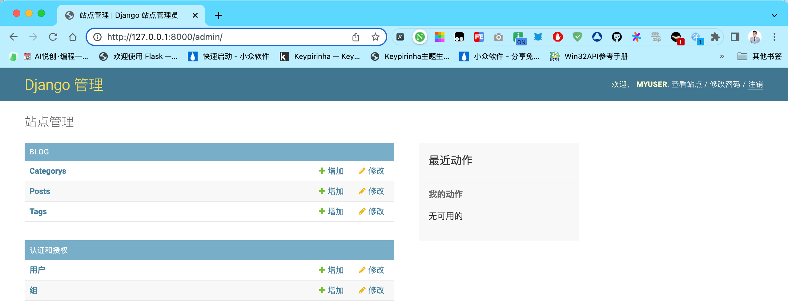
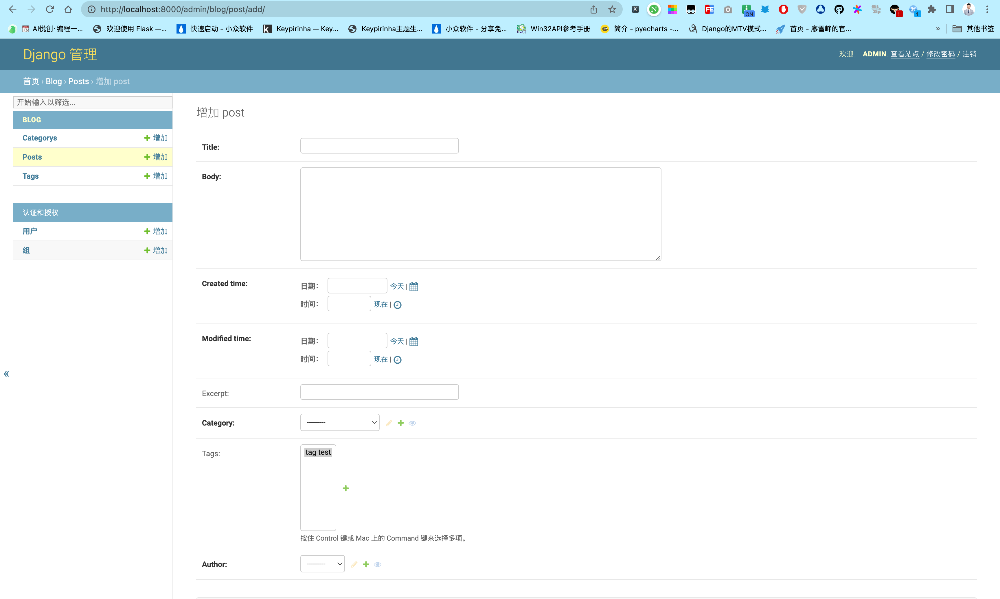
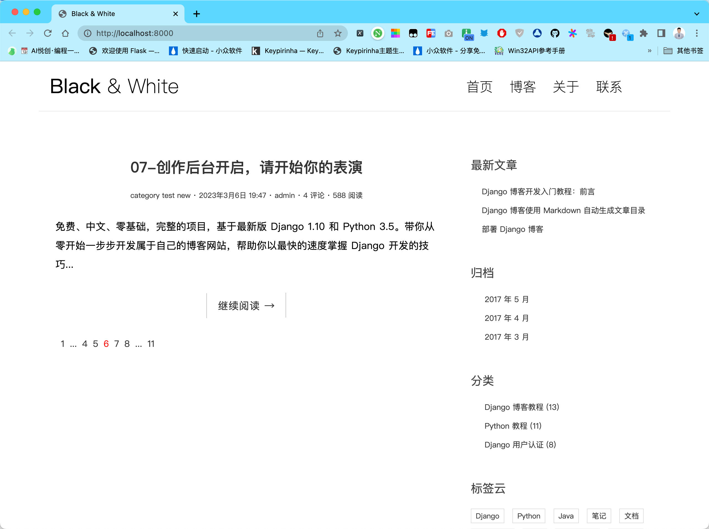
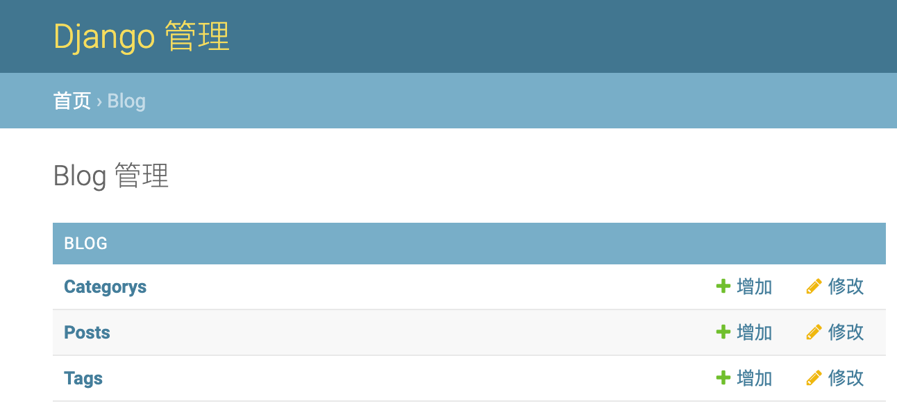
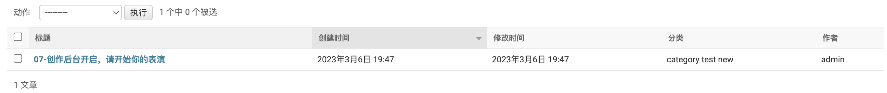

你好，我是悦创。

在此之前我们完成了 django 博客首页视图的编写，我们希望首页展示发布的博客文章列表，但是它却抱怨：暂时还没有发布的文章！如它所言，我们确实还没有发布任何文章，本节我们将使用 django 自带的 admin 后台来发布我们的博客文章。

## 1. 创建 admin 后台管理员账户

要想进入 django admin 后台，首先需要创建一个超级管理员账户。我们在 [Django 迁移、操作数据库](https://bornforthis.cn/column/Django-fast-development-practice/gossip/04.html) 中已经创建了一个后台账户，但如果你没有按照前面的步骤创建账户的话，可以进入项目根目录，运行 `pipenv run python manage.py createsuperuser` 命令新建一个：

```python
➜  gossip_django git:(main) ✗ pipenv run python manage.py createsuperuser

用户名 (leave blank to use 'huangjiabao'): admin
电子邮件地址: admin@example.com
Password:
Password (again):
密码长度太短。密码必须包含至少 8 个字符。
这个密码太常见了。
密码只包含数字。
Bypass password validation and create user anyway? [y/N]: y
Superuser created successfully.
```

::: warning

在命令行输入密码时可能不会显示输入的字符，不要以为键盘坏了，照正常的方式输入密码即可。

:::

## 2. 在 admin 后台注册模型

要在后台注册我们自己创建的几个模型，这样 django admin 才能知道它们的存在，注册非常简单，只需要在 `blog/admin.py` 中加入下面的代码：

```python {4,6-9}
# filename: blog/admin.py

from django.contrib import admin
from .models import Post, Category, Tag

# Register your models here.
admin.site.register(Post)
admin.site.register(Category)
admin.site.register(Tag)
```

运行开发服务器，访问 [http://127.0.0.1:8000/admin/](http://127.0.0.1:8000/admin/) ，就进入了到了 django admin 后台登录页面，输入刚才创建的管理员账户密码就可以登录到后台了。




可以看到我们刚才注册的三个模型了，点击 Posts 后面的**增加**按钮，将进入添加 Post 的页面，也就是新增博客文章。然后在相关的地方输入一些测试用的内容，增加完后点击保存，这样文章就添加完毕了，你也可以多添加几篇看看效果。

::: warning

每篇文章必须有一个分类，在添加文章时你可以选择已有分类。如果数据库中还没有分类，在选择分类时点击 Category 后面的 + 按钮新增一个分类即可。

:::




你可能想往文章内容中添加图片，但目前来说还做不到。在支持 Markdown 语法部分中将介绍如何在文章中插入图片的方法。

访问 [http://127.0.0.1:8000/](http://127.0.0.1:8000/) 首页，你就可以看到你添加的文章列表了，下面是我所在环境的效果图：



## 3. 定制 admin 后台

使用 admin 后台的时候，我们发现了下面的一些体验相关的问题：

- admin 后台本身的页面元素是已经汉化了的，但是我们自己的 blog 应用，以及 Post、Category、Tag 在页面中显示却是英文的，以及发布文章的时候，表单各字段的 label 也是英文的。
- 在 admin 后台的 post 列表页面，我们只看到了文章的标题，但是我们希望它显示更加详细的信息，例如作者、发布时间、修改时间等。
- 新增文章时，所有数据都要自己手动填写。但是，有些数据应该是自动生成。例如文章发布时间 Created time 和修改时间 Modified time，应该在创建或者修改文章时自动生成，而不是手动控制。同时我们的博客是单人博客系统，发布者肯定是文章作者，这个也应该自动设定为 admin 后台的登录账户。

虽然 django 的 admin 应用开箱即用，但也提供了丰富的定制功能，这正是 django 吸引人的地方，下面我们根据需求来一个个定制。

### 3.1 汉化 blog 应用

首先来看一下需要汉化的地方，admin 首页每个版块代表一个 app，比如 BLOG 版块表示 blog 应用，版块标题默认显示的就是应用名。应用版块下包含了该应用全部已经注册到 admin 后台的 model，之前我们注册了 Post、Category 和 Tag，所以显示的是这三个 model，显示的名字就是 model 的名字。如下图所示：



其次是新增 post 页面的表单，各个字段的 label 由定义在 Post 类的 Field 名转换而来，比如 Post 模型中定义了 title 字段，则对应表单的 label 就是 Title。

首先是 BLOG 版块的标题 BLOG，一个版块代表一个应用，显然这个标题使用应用名转换而来，在 blog 应用下有一个 `app.py` 模块，其代码如下：

```python
from django.apps import AppConfig


class BlogConfig(AppConfig):
    default_auto_field = 'django.db.models.BigAutoField'
    name = 'blog'
```

这些是我们在运行 startapp 创建 blog 应用时自动生成的代码，可以看到有一个 `BlogConfig` 类，其继承自 `AppConfig` 类，看名字就知道这是和应用配置有关的类。我们可以通过设置这个类中的一些属性的值来配置这个应用的一些特性的。比如这里的 name 是用来定义 app 的名字，需要和应用名保持一致，不要改。要修改 app 在 admin 后台的显示名字，添加 `verbose_name` 属性。

```python {7}
from django.apps import AppConfig


class BlogConfig(AppConfig):
    default_auto_field = 'django.db.models.BigAutoField'
    name = 'blog'
    verbose_name = '博客'
```

同时，我们此前在 settings 中注册应用时，是直接注册的 app 名字 blog，现在在 BlogConfig 类中对 app 做了一些配置，所以应该将这个类注册进去：

```python {3}
INSTALLED_APPS = [
    # 'blog',  # 注册 blog 应用
    'blog.apps.BlogConfig',
    'django.contrib.admin',
    'django.contrib.auth',
    'django.contrib.contenttypes',
    'django.contrib.sessions',
    'django.contrib.messages',
    'django.contrib.staticfiles',
]
```

再次登录后台，就可以看到 BLOG 版块的标题已经显示为**博客**了。

接下来是让应用下注册的 model 显示为中文，既然应用是在 `apps.py` 中配置，那么和 model 有关的配置应该去找相对应的 model 。配置 model 的一些特性是通过 model 的内部类 `Meta` 中来定义。比如对于 Post 模型，要让他在 admin 后台显示为中文，如下：

```python {5-7}
class Post(models.Model):
    ...
    author = models.ForeignKey(User, on_delete=models.CASCADE)

    class Meta:
        verbose_name = '文章'
        verbose_name_plural = verbose_name

    def __str__(self):
        return self.title
```

同样地，这里通过 `verbose_name` 来指定对应的 model 在 admin 后台的显示名称，这里 `verbose_name_plural` 用来表示多篇文章时的复数显示形式。英语中，如果有多篇文章，就会显示为 Posts，表示复数，中文没有复数表现形式，所以定义为和 `verbose_name`一样。

同样的可以把 Tag 和 Category 也设置一下：

```python {4-6,15-17}
class Category(models.Model):
    name = models.CharField(max_length=100)

    class Meta:
        verbose_name = '分类'
        verbose_name_plural = verbose_name

    def __str__(self):
        return self.name


class Tag(models.Model):
    name = models.CharField(max_length=100)

    class Meta:
        verbose_name = '标签'
        verbose_name_plural = verbose_name

    def __str__(self):
        return self.name
```

在 admin 就可以看到汉化后的效果了。

然后就是修改 post 的表单的 label，label 由定义在 model 中的 Field 名转换二来，所以在 Field 中修改。

```python
class Post(models.Model):
    title = models.CharField('标题', max_length=70)
    body = models.TextField('正文')
    created_time = models.DateTimeField('创建时间')
    modified_time = models.DateTimeField('修改时间')
    excerpt = models.CharField('摘要', max_length=200, blank=True)
    category = models.ForeignKey(Category, verbose_name='分类', on_delete=models.CASCADE)
    tags = models.ManyToManyField(Tag, verbose_name='标签', blank=True)
    author = models.ForeignKey(User, verbose_name='作者', on_delete=models.CASCADE)
```

可以看到我们给每个 Field 都传入了一个位置参数，参数值即为 field 应该显示的名字（如果不传，django 自动根据 field 名生成）。这个参数的名字也叫 `verbose_name`，绝大部分 field 这个参数都位于第一个位置，但由于 `ForeignKey`、`ManyToManyField` 第一个参数必须传入其关联的 Model，所以 category、tags 这些字段我们使用了关键字参数 `verbose_name`。

### 3.2 文章列表显示更加详细的信息

在 admin 后台的文章列表页面，我们只看到了文章的标题，但是我们希望它显示更加详细的信息，这需要我们来定制 admin 了，在 `admin.py` 添加如下代码：

```python
# filename: blog/admin.py

from django.contrib import admin
from .models import Post, Category, Tag

class PostAdmin(admin.ModelAdmin):
    list_display = ['title', 'created_time', 'modified_time', 'category', 'author']

# 把新增的 Postadmin 也注册进来
admin.site.register(Post, PostAdmin)
admin.site.register(Category)
admin.site.register(Tag)
```

刷新 admin Post 列表页面，可以看到显示的效果好多了。



### 3.3 简化新增文章的表单

接下来优化新增文章时，填写表单数据的不合理的地方。文章的创建时间和修改时间应该根据当前时间自动生成，而现在是由人工填写，还有就是文章的作者应该自动填充为后台管理员用户，那么这些自动填充数据的字段就不需要在新增文章的表单中出现了。

此前我们在 `blog/admin.py` 中定义了一个 `PostAdmin` 来配置 Post 在 admin 后台的一些展现形式。`list_display` 属性控制 Post 列表页展示的字段。此外还有一个 fields 属性，则用来控制表单展现的字段，正好符合我们的需求：

```python
class PostAdmin(admin.ModelAdmin):
    list_display = ['title', 'created_time', 'modified_time', 'category', 'author']
    fields = ['title', 'body', 'excerpt', 'category', 'tags']
```

这里 fields 中定义的字段就是表单中展现的字段。

**接下来是填充创建时间，修改时间和文章作者的值。**

之前提到，文章作者应该自动设定为登录后台发布此文章的管理员用户。发布文章的过程实际上是一个 HTTP 请求过程，此前提到，django 将 HTTP 请求封装在 HttpRequest 对象中，然后将其作为第一个参数传给视图函数（这里我们没有看到新增文章的视图，因为 django admin 已经自动帮我们生成了），而如果用户登录了我们的站点，那么 django 就会将这个用户实例绑定到 `request.user` 属性上，我们可以通过 `request.user` 取到当前请求用户，然后将其关联到新创建的文章即可。

Postadmin 继承自 ModelAdmin，它有一个 `save_model` 方法，这个方法只有一行代码：`obj.save()`。它的作用就是将此 Modeladmin 关联注册的 model 实例（这里 Modeladmin 关联注册的是 Post）保存到数据库。这个方法接收四个参数，其中前两个，一个是 request，即此次的 HTTP 请求对象，第二个是 obj，即此次创建的关联对象的实例，于是通过复写此方法，就可以将 `request.user` 关联到创建的 Post 实例上，然后将 Post 数据再保存到数据库：

```python
class PostAdmin(admin.ModelAdmin):
    list_display = ['title', 'created_time', 'modified_time', 'category', 'author']
    fields = ['title', 'body', 'excerpt', 'category', 'tags']

    def save_model(self, request, obj, form, change):
        obj.author = request.user
        super().save_model(request, obj, form, change)
```

最后还剩下文章的创建时间和修改时间需要填充，一个想法我们可以沿用上面的思路，复写 `save_model` 方法，将创建的 post 对象关联当前时间，但是这存在一个问题，就是这样做的话只有通过 admin 后台创建的文章才能自动关联这些时间，但创建文章不一定是在 Admin，也可能通过命令行。这时候我们可以通过对 Post 模型的定制来达到目的。

首先，Model 中定义的每个 Field 都接收一个 default 关键字参数，这个参数的含义是，如果将 model 的实例保存到数据库时，对应的 Field 没有设置值，那么 django 会取这个 default 指定的默认值，将其保存到数据库。因此，对于文章创建时间这个字段，初始没有指定值时，默认应该指定为当前时间，所以刚好可以通过 default 关键字参数指定：

```python
from django.utils import timezone

class Post(models.Model):
    ...
    created_time = models.DateTimeField('创建时间', default=timezone.now)
    ...
```

这里 default 既可以指定为一个常量值，也可以指定为一个可调用（callable）对象，我们指定 `timezone.now` 函数，这样如果没有指定 `created_time` 的值，django 就会将其指定为 `timezone.now` 函数调用后的值。`timezone.now` 是 django 提供的工具函数，返回当前时间。因为 timezone 模块中的函数会自动帮我们处理时区，所以我们使用的是 django 为我们提供的 timezone 模块，而不是 Python 提供的 datetime 模块来处理时间。

**那么修改时间 `modified_time` 可以用 default 吗？**

答案是不能，因为虽然第一次保存数据时，会根据默认值指定为当前时间，但是当模型数据第二次修改时，由于 `modified_time` 已经有值，即第一次的默认值，那么第二次保存时默认值就不会起作用了，如果我们不修改 `modified_time` 的值的话，其值永远是第一次保存数据库时的默认值。

所以这里问题的关键是每次保存模型时，都应该修改 `modified_time` 的值。每一个 Model 都有一个 save 方法，这个方法包含了将 model 数据保存到数据库中的逻辑。通过覆写这个方法，在 model 被 save 到数据库前指定 `modified_time` 的值为当前时间不就可以了？代码如下：

```python
from django.utils import timezone

class Post(models.Model):
    ...

    def save(self, *args, **kwargs):
        self.modified_time = timezone.now()
        super().save(*args, **kwargs)
```

要注意在指定完 `modified_time` 的值后，别忘了调用父类的 save 以执行数据保存回数据库的逻辑。


欢迎关注我公众号：AI悦创，有更多更好玩的等你发现！

::: details 公众号：AI悦创【二维码】


:::

::: info AI悦创·编程一对一

AI悦创·推出辅导班啦，包括「Python 语言辅导班、C++ 辅导班、java 辅导班、算法/数据结构辅导班、少儿编程、pygame 游戏开发、Linux、Web」，全部都是一对一教学：一对一辅导 + 一对一答疑 + 布置作业 + 项目实践等。当然，还有线下线上摄影课程、Photoshop、Premiere 一对一教学、QQ、微信在线，随时响应！微信：Jiabcdefh

C++ 信息奥赛题解，长期更新！长期招收一对一中小学信息奥赛集训，莆田、厦门地区有机会线下上门，其他地区线上。微信：Jiabcdefh

方法一：[QQ](http://wpa.qq.com/msgrd?v=3&uin=1432803776&site=qq&menu=yes)

方法二：微信：Jiabcdefh

:::


