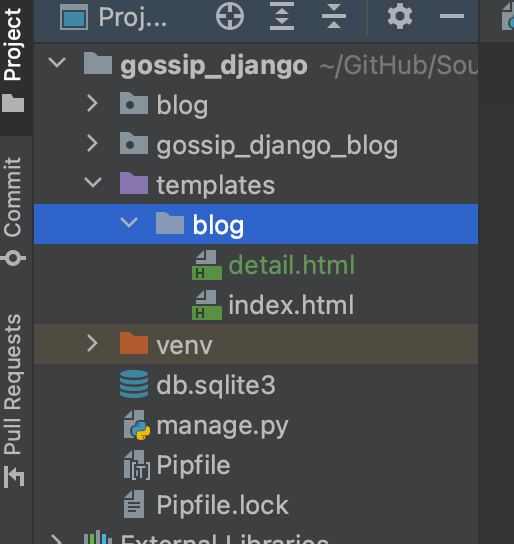
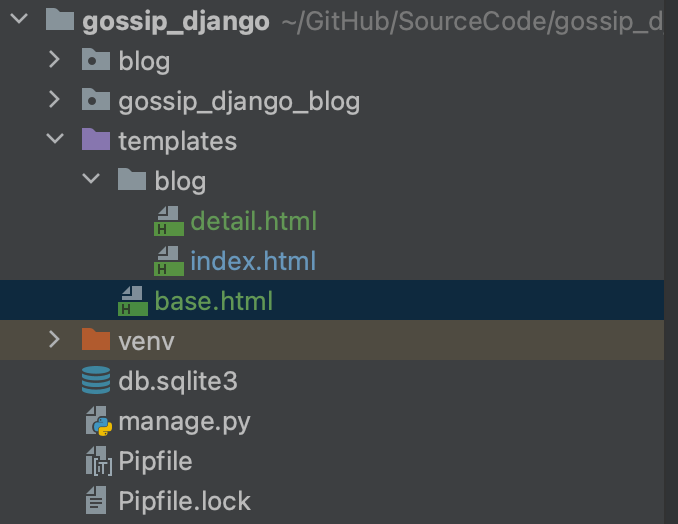
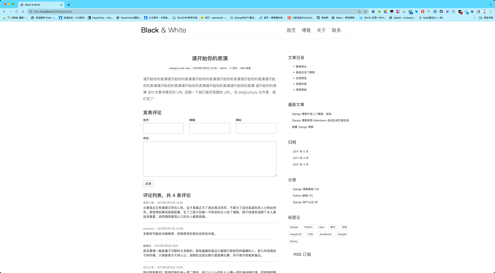

你好，我是悦创。

首页展示的是所有文章的列表，当用户看到感兴趣的文章时，他点击文章的标题或者继续阅读的按钮，应该跳转到文章的详情页面来阅读文章的详细内容。现在让我们来开发博客的详情页面，有了前面的基础，开发流程都是一样的了：首先配置 URL，即把相关的 URL 和视图函数绑定在一起，然后实现视图函数，编写模板并让视图函数渲染模板。

## 1. 设计文章详情页的 URL

回顾一下我们首页视图的 URL，在 `blog/urls.py` 文件里，我们写了：

```python
# filename: blog/urls.py

from django.urls import path

from . import views

urlpatterns = [
    path('', views.index, name='index'),
]
```

首页视图匹配的 URL 去掉域名后其实就是一个空的字符串。对文章详情视图而言，每篇文章对应着不同的 URL。比如我们可以把文章详情页面对应的视图设计成这个样子：当用户访问 `<网站域名>/posts/1/` 时，显示的是第一篇文章的内容，而当用户访问 `<网站域名>/posts/2/` 时，显示的是第二篇文章的内容，这里数字代表了第几篇文章，也就是数据库中 Post 记录的 id 值。下面依照这个规则来绑定 URL 和视图：

```python {10}
# filename: blog/urls.py

from django.urls import path

from . import views

app_name = 'blog'
urlpatterns = [
    path('', views.index, name='index'),
    path('posts/<int:pk>/', views.detail, name='detail'),
]
```

这里 `'posts/<int:pk>/'` 刚好匹配我们上面定义的 URL 规则。这条规则的含义是，以 `posts/` 开头，后跟一个整数，并且以 `/` 符号结尾，如 `posts/1/`、 `posts/255/` 等都是符合规则的，此外这里 `<int:pk>` 是 django 路由匹配规则的特殊写法，其作用是从用户访问的 URL 里把匹配到的数字捕获并作为关键字参数传给其对应的视图函数 `detail`。比如当用户访问 `posts/255/` 时（注意 django 并不关心域名，而只关心去掉域名后的相对 URL），`<int:pk>` 匹配 255，那么这个 255 会在调用视图函数 detail 时被传递进去，其参数名就是冒号后面指定的名字 `pk`，实际上视图函数的调用就是这个样子：`detail(request, pk=255)`。我们这里必须从 URL 里捕获文章的 id，因为只有这样我们才能知道用户访问的究竟是哪篇文章。

::: tip

django 的路由匹配规则有很多类型，除了这里的 int 整数类型，还有 str 字符类型、uuid 等，可以通过官方文档了解：[Path converters](https://docs.djangoproject.com/en/4.1/topics/http/urls/#path-converters)

:::

此外我们通过 `app_name='blog'` 告诉 django 这个 `urls.py` 模块是属于 blog 应用的，这种技术叫做视图函数命名空间。我们看到 `blog/urls.py` 目前有两个视图函数，并且通过 name 属性给这些视图函数取了个别名，分别是 index、detail。

但是一个复杂的 django 项目可能不止这些视图函数，例如一些第三方应用中也可能有叫 index、detail 的视图函数，**那么怎么把它们区分开来，防止冲突呢？**

方法就是通过 `app_name` 来指定命名空间，命名空间具体如何使用将在下面介绍。如果你忘了在 `blog/urls.py` 中添加这一句，接下来你可能会得到一个 `NoMatchReversed` 异常。

为了方便地生成上述的 URL，我们在 `Post` 类里定义一个 `get_absolute_url` 方法，注意 `Post` 本身是一个 Python 类，在类中我们是可以定义任何方法的。

```python {5,14-17}
# filename: blog/models.py

from django.contrib.auth.models import User
from django.db import models
from django.urls import reverse
from django.utils import timezone

class Post(models.Model):
    ...

    def __str__(self):
        return self.title

    # 自定义 get_absolute_url 方法
    # 记得从 django.urls 中导入 reverse 函数
    def get_absolute_url(self):
        return reverse('blog:detail', kwargs={'pk': self.pk})
```

注意到 URL 配置中的 `path('posts/<int:pk>/', views.detail, name='detail')` ，我们设定的 `name='detail'` 在这里派上了用场。

看到这个 `reverse` 函数，它的第一个参数的值是 `'blog:detail'`，意思是 blog 应用下的 `name=detail` 的函数，由于我们在上面通过 `app_name = 'blog'` 告诉了 django 这个 URL 模块是属于 blog 应用的，因此 django 能够顺利地找到 blog 应用下 name 为 detail 的视图函数，于是 `reverse` 函数会去解析这个视图函数对应的 URL，我们这里 detail 对应的规则就是 `posts/<int:pk>/` int 部分会被后面传入的参数 `pk` 替换，所以，如果 `Post` 的 id（或者 pk，这里 pk 和 id 是等价的） 是 255 的话，那么 `get_absolute_url` 函数返回的就是 `/posts/255/` ，这样 Post 自己就生成了自己的 URL。


## 2. 编写 detail 视图函数

接下来就是实现我们的 `detail` 视图函数了：

```python
# filename: blog/views.py

from django.shortcuts import render, get_object_or_404
from .models import Post

def index(request):
    # ...

def detail(request, pk):
    post = get_object_or_404(Post, pk=pk)
    return render(request, 'blog/detail.html', context={'post': post})
```

视图函数很简单，它根据我们从 URL 捕获的文章 id（也就是 pk，这里 pk 和 id 是等价的）获取数据库中文章 id 为该值的记录，然后传递给模板。注意这里我们用到了从 django.shortcuts 模块导入的 `get_object_or_404` 方法，其作用就是当传入的 pk 对应的 Post 在数据库存在时，就返回对应的 `post`，如果不存在，就给用户返回一个 404 错误，表明用户请求的文章不存在。

## 3. 编写详情页模板

接下来就是书写模板文件，从下载的博客模板（如果你还没有下载，请 [点击这里](https://github.com/AndersonHJB/django-blog-tutorial-templates) 下载）中把 `single.html` 拷贝到 `templates/blog` 目录下（和 `index.html` 在同一级目录），然后改名为 `detail.html`。此时你的目录结构应该像这个样子：



在 index 页面博客文章列表的**标题**和**继续阅读按钮**写上超链接跳转的链接，即文章 `post` 对应的详情页的 URL，让用户点击后可以跳转到 detail 页面：

```html {6,13}
templates/blog/index.html

<article class="post post-{{ post.pk }}">
  <header class="entry-header">
    <h1 class="entry-title">
      <a href="{{ post.get_absolute_url }}">{{ post.title }}</a>
    </h1>
    ...
  </header>
  <div class="entry-content clearfix">
    ...
    <div class="read-more cl-effect-14">
      <a href="{{ post.get_absolute_url }}" class="more-link">继续阅读 <span class="meta-nav">→</span></a>
    </div>
  </div>
</article>

  <div class="no-post">暂时还没有发布的文章！</div>

```

这里我们修改两个地方，第一个是文章标题处：

```html
<h1 class="entry-title">
  <a href="{{ post.get_absolute_url }}">{{ post.title }}</a>
</h1>
```

我们把 a 标签的 href 属性的值改成了 `{{ post.get_absolute_url }}`。回顾一下模板变量的用法，由于 `get_absolute_url` 这个方法（我们定义在 Post 类中的）返回的是 `post` 对应的 URL，因此这里 `{{ post.get_absolute_url }}` 最终会被替换成该 `post` 自身的 URL。

同样，第二处修改的是继续阅读按钮的链接：

```html
<a href="{{ post.get_absolute_url }}" class="more-link">继续阅读 <span class="meta-nav">→</span></a>
```

这样当我们点击首页文章的标题或者继续阅读按钮后就会跳转到该篇文章对应的详情页面了。然而如果你尝试跳转到详情页后，你会发现样式是乱的。这在 [博客从“裸奔”到“有皮肤”](https://bornforthis.cn/column/Django-fast-development-practice/gossip/06.html) 时讲过，由于我们是直接复制的模板，还没有正确地处理静态文件。我们可以按照介绍过的方法修改静态文件的引入路径，但很快你会发现在任何页面都是需要引入这些静态文件，如果每个页面都要修改会很麻烦，而且代码都是重复的。下面就介绍 django 模板继承的方法来帮我们消除这些重复操作。

## 4. 模板继承

我们看到 `index.html` 文件和 `detail.html` 文件除了 main 标签包裹的部分不同外，其它地方都是相同的，我们可以把相同的部分抽取出来，放到 `base.html `里。首先在 templates 目录下新建一个 `base.html` 文件，这时候你的项目目录应该变成了这个样子：



把 `index.html` 的内容全部拷贝到 `base.html` 文件里，然后删掉 main 标签包裹的内容，替换成如下的内容。

```html
templates/base.html

...
<main class="col-md-8">
    
    
</main>
<aside class="col-md-4">
  
  
  ...
</aside>
...
```

**这里 block 也是一个模板标签，其作用是占位。**

比如这里的 `` 是一个占位框，main 是我们给这个 block 取的名字。

**下面我们会看到 block 标签的作用。**

同时我们也在 aside 标签下加了一个 `` 占位框，因为 `detail.html` 中 aside 标签下会多一个目录栏。当 `` 中没有任何内容时，`` 在模板中不会显示。但当其中有内容是，模板就会显示 block 中的内容。

在 `index.html` 里，我们在文件**最顶部**使用 `` 继承 `base.html`，这样就把 `base.html` 里的代码继承了过来，另外在 `` 包裹的地方填上 index 页面应该显示的内容：

::: code-tabs

@tab 简写

```html
templates/blog/index.html




    
        <article class="post post-1">
          ...
        </article>
    
        <div class="no-post">暂时还没有发布的文章！</div>
    
    <!-- 简单分页效果
    <div class="pagination-simple">
        <a href="#">上一页</a>
        <span class="current">第 6 页 / 共 11 页</span>
        <a href="#">下一页</a>
    </div>
    -->
    <div class="pagination">
      ...
    </div>

```

@tab 直接 copy

```html



    
            <article class="post post-{{ post.pk }}">
                <header class="entry-header">
                    <h1 class="entry-title">
                        <a href="{{ post.get_absolute_url }}">{{ post.title }}</a>
                    </h1>
                    <div class="entry-meta">
                        <span class="post-category"><a href="#">{{ post.category.name }}</a></span>
                        <span class="post-date"><a href="#"><time class="entry-date"
                                                                  datetime="{{ post.created_time }}">{{ post.created_time }}</time></a></span>
                        <span class="post-author"><a href="#">{{ post.author }}</a></span>
                        <span class="comments-link"><a href="#">4 评论</a></span>
                        <span class="views-count"><a href="#">588 阅读</a></span>
                    </div>
                </header>
                <div class="entry-content clearfix">
                    <p>免费、中文、零基础，完整的项目，基于最新版 Django 1.10 和 Python 3.5。带你从零开始一步步开发属于自己的博客网站，帮助你以最快的速度掌握
                        Django
                        开发的技巧...</p>
                    <div class="read-more cl-effect-14">
                        <a href="{{ post.get_absolute_url }}" class="more-link">继续阅读 <span class="meta-nav">→</span></a>
                    </div>
                </div>
            </article>
        
            <div class="np-post">暂时还没有发布文章</div>
        
    <!-- 简单分页效果
    <div class="pagination-simple">
        <a href="#">上一页</a>
        <span class="current">第 6 页 / 共 11 页</span>
        <a href="#">下一页</a>
    </div>
    -->
    <div class="pagination">
        <ul>
            <li><a href="">1</a></li>
            <li><a href="">...</a></li>
            <li><a href="">4</a></li>
            <li><a href="">5</a></li>
            <li class="current"><a href="">6</a></li>
            <li><a href="">7</a></li>
            <li><a href="">8</a></li>
            <li><a href="">...</a></li>
            <li><a href="">11</a></li>
        </ul>
    </div>

```

:::

这样 `base.html` 里的代码加上 `` 里的代码就和最开始 `index.html` 里的代码一样了。这就是模板继承的作用，公共部分的代码放在 `base.html` 里，而其它页面不同的部分通过替换 `` 占位标签里的内容即可。

如果你对这种模板继承还是有点糊涂，可以把这种继承和 Python 中类的继承类比。`base.html` 就是父类，`index.html` 就是子类。`index.html` 继承了 `base.html` 中的全部内容，同时它自身还有一些内容，这些内容就通过 “覆写” ``（把 block 看做是父类的属性）的内容添加即可。

detail 页面处理起来就简单了，同样继承 `base.html` ，在 `` 里填充 `detail.html` 页面应该显示的内容，以及在 `` 中填写 `base.html` 中没有的目录部分的内容。不过目前的目录只是占位数据，我们在以后会实现如何从文章中自动摘取目录。

```html
templates/blog/detail.html




    <article class="post post-1">
      ...
    </article>
    <section class="comment-area">
      ...
    </section>


    <div class="widget widget-content">
        <h3 class="widget-title">文章目录</h3>
        <ul>
            <li>
                <a href="#">教程特点</a>
            </li>
            <li>
                <a href="#">谁适合这个教程</a>
            </li>
            <li>
                <a href="#">在线预览</a>
            </li>
            <li>
                <a href="#">资源列表</a>
            </li>
            <li>
                <a href="#">获取帮助</a>
            </li>
        </ul>
    </div>

```

修改 article 标签下的一些内容，让其显示文章的实际数据：

::: code-tabs

@tab 简写

```html
<article class="post post-{{ post.pk }}">
  <header class="entry-header">
    <h1 class="entry-title">{{ post.title }}</h1>
    <div class="entry-meta">
      <span class="post-category"><a href="#">{{ post.category.name }}</a></span>
      <span class="post-date"><a href="#"><time class="entry-date"
                                                datetime="{{ post.created_time }}">{{ post.created_time }}</time></a></span>
      <span class="post-author"><a href="#">{{ post.author }}</a></span>
      <span class="comments-link"><a href="#">4 评论</a></span>
      <span class="views-count"><a href="#">588 阅读</a></span>
    </div>
  </header>
  <div class="entry-content clearfix">
    {{ post.body }}
  </div>
</article>
```

@tab 直接 copy

```python



    <article class="post post-{{ post.pk }}">
        <header class="entry-header">
            <h1 class="entry-title">{{ post.title }}</h1>
            <div class="entry-meta">
                <span class="post-category"><a href="#">{{ post.category.name }}</a></span>
                <span class="post-date"><a href="#"><time class="entry-date"
                                                          datetime="{{ post.created_time }}">{{ post.created_time }}</time></a></span>
                <span class="post-author"><a href="#">{{ post.author }}</a></span>
                <span class="comments-link"><a href="#">4 评论</a></span>
                <span class="views-count"><a href="#">588 阅读</a></span>
            </div>
        </header>
        <div class="entry-content clearfix">
            {{ post.body }}
        </div>
    </article>
    <section class="comment-area" id="comment-area">
        <hr>
        <h3>发表评论</h3>
        <form action="#" method="post" class="comment-form">
            <div class="row">
                <div class="col-md-4">
                    <label for="id_name">名字：</label>
                    <input type="text" id="id_name" name="name" required>
                </div>
                <div class="col-md-4">
                    <label for="id_email">邮箱：</label>
                    <input type="email" id="id_email" name="email" required>
                </div>
                <div class="col-md-4">
                    <label for="id_url">网址：</label>
                    <input type="text" id="id_url" name="url">
                </div>
                <div class="col-md-12">
                    <label for="id_comment">评论：</label>
                    <textarea name="comment" id="id_comment" required></textarea>
                    <button type="submit" class="comment-btn">发表</button>
                </div>
            </div>    <!-- row -->
        </form>
        <div class="comment-list-panel">
            <h3>评论列表，共 <span>4</span> 条评论</h3>
            <ul class="comment-list list-unstyled">
                <li class="comment-item">
                    <span class="nickname">追梦人物</span>
                    <time class="submit-date" datetime="2012-11-09T23:15:57+00:00">2017年3月12日 14:56</time>
                    <div class="text">
                        文章观点又有道理又符合人性，这才是真正为了表达观点而写，不是为了迎合某某知名人士粉丝而写。我觉得如果琼瑶是前妻，生了三孩子后被一不知名的女人挖了墙角，我不信谁会说那个女人是追求真爱，说同情琼瑶骂小三的女人都是弱者。
                    </div>
                </li>
                <li class="comment-item">
                    <span class="nickname">zmrenwu</span>
                    <time class="submit-date" datetime="2012-11-09T23:15:57+00:00">2017年3月11日 23:56</time>
                    <div class="text">
                        本能有可能会冲破格局，但格局有时候也会拘住本能。
                    </div>
                </li>
                <li class="comment-item">
                    <span class="nickname">蝙蝠侠</span>
                    <time class="submit-date" datetime="2012-11-09T23:15:57+00:00">2017年3月9日 8:56</time>
                    <div class="text">
                        其实真理一般是属于沉默的大多数的。那些偏激的观点只能吸引那些同样偏激的人。前几年琼瑶告于妈抄袭，大家都表示大快人心，说明吃瓜观众都只是就事论事，并不是对琼瑶有偏见。
                    </div>
                </li>
                <li class="comment-item">
                    <span class="nickname">长江七号</span>
                    <time class="submit-date" datetime="2012-11-09T23:15:57+00:00">2017年2月12日 12:56</time>
                    <div class="text">
                        观点我很喜欢！就是哎嘛本来一清二楚的，来个小三小四乱七八糟一团乱麻夹缠不清，简直麻烦要死
                    </div>
                </li>
            </ul>
        </div>
    </section>


    <div class="widget widget-content">
        <h3 class="widget-title">文章目录</h3>
        <ul>
            <li>
                <a href="#">教程特点</a>
            </li>
            <li>
                <a href="#">谁适合这个教程</a>
            </li>
            <li>
                <a href="#">在线预览</a>
            </li>
            <li>
                <a href="#">资源列表</a>
            </li>
            <li>
                <a href="#">获取帮助</a>
            </li>
        </ul>
    </div>

```

:::

再次从首页点击一篇文章的标题或者继续阅读按钮跳转到详情页面，可以看到预期效果了！




欢迎关注我公众号：AI悦创，有更多更好玩的等你发现！

::: details 公众号：AI悦创【二维码】


:::

::: info AI悦创·编程一对一

AI悦创·推出辅导班啦，包括「Python 语言辅导班、C++ 辅导班、java 辅导班、算法/数据结构辅导班、少儿编程、pygame 游戏开发、Linux、Web」，全部都是一对一教学：一对一辅导 + 一对一答疑 + 布置作业 + 项目实践等。当然，还有线下线上摄影课程、Photoshop、Premiere 一对一教学、QQ、微信在线，随时响应！微信：Jiabcdefh

C++ 信息奥赛题解，长期更新！长期招收一对一中小学信息奥赛集训，莆田、厦门地区有机会线下上门，其他地区线上。微信：Jiabcdefh

方法一：[QQ](http://wpa.qq.com/msgrd?v=3&uin=1432803776&site=qq&menu=yes)

方法二：微信：Jiabcdefh

:::


