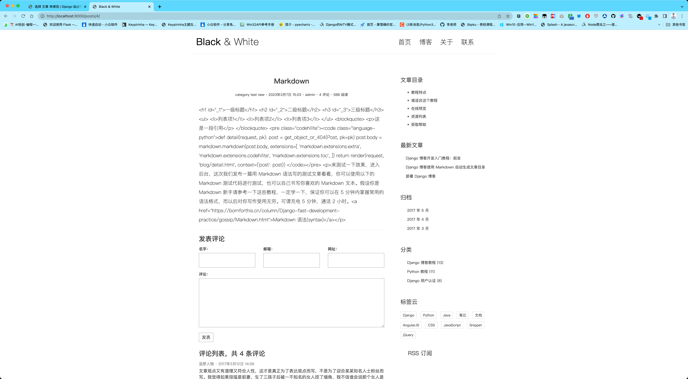
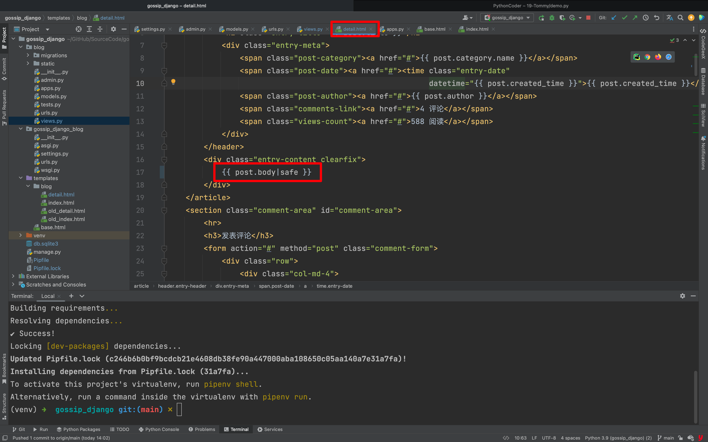
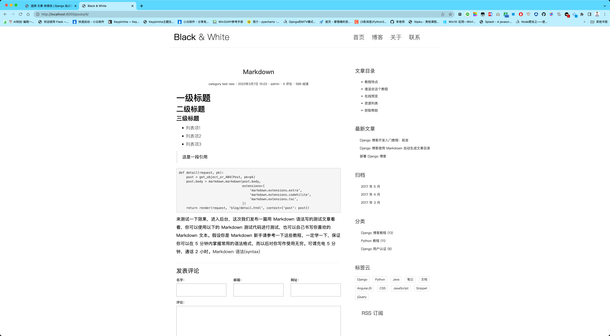
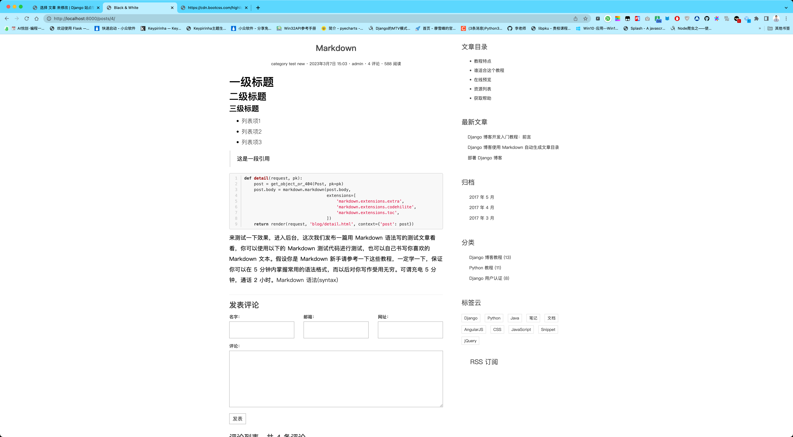

你好，我是悦创。

为了让博客文章具有良好的排版，显示更加丰富的格式，我们使用 Markdown 语法来书写博文。

Markdown 是一种 HTML 文本标记语言，只要遵循它约定的语法格式，Markdown 的解析工具就能够把 Markdown 文档转换为标准的 HTML 文档，从而使文章呈现更加丰富的格式，例如标题、列表、代码块等等 HTML 元素。

由于 Markdown 语法简单直观，不用超过 5 分钟就可以轻松掌握常用的标记语法，因此大家青睐使用 Markdown 书写 HTML 文档。下面让我们的博客也支持使用 Markdown 写作。

## 1. 安装 Python Markdown

将 Markdown 格式的文本解析成标准的 HTML 文档是一个复杂的工程，好在已有好心人帮我们完成了这些工作，直接拿来使用即可。首先安装 Markdown，这是一个 Python 第三方库，在**项目根目录**下运行命令 `pipenv install markdown`。

```python
pipenv install markdown
```


## 2. 在 detail 视图中解析 Markdown

将 Markdown 格式的文本解析成 HTML 文本非常简单，只需调用这个库的 `markdown` 方法。我们书写的博客文章内容存在 `Post` 的 `body` 属性里，回到我们的详情页视图函数，对 `post` 的 `body` 的值做一下解析，把 Markdown 文本转为 HTML 文本再传递给模板：

```python
# filename: blog/views.py

import markdown
from django.shortcuts import get_object_or_404, render

from .models import Post

def detail(request, pk):
    post = get_object_or_404(Post, pk=pk)
    post.body = markdown.markdown(post.body,
                                  extensions=[
                                      'markdown.extensions.extra',
                                      'markdown.extensions.codehilite',
                                      'markdown.extensions.toc',
                                  ])
    return render(request, 'blog/detail.html', context={'post': post})
```

这样我们在模板中显示 `{{ post.body }}` 的时候，就不再是原始的 Markdown 文本了，而是解析过后的 HTML 文本。

::: warning

这里我们给 `markdown` 解析函数传递了额外的参数 `extensions`，它是对 Markdown 语法的拓展，这里使用了三个拓展，分别是 extra、codehilite、toc。

extra 本身包含很多基础拓展，而 codehilite 是语法高亮拓展，这为后面的实现代码高亮功能提供基础，而 toc 则允许自动生成目录（在以后会介绍）。

:::

来测试一下效果，进入后台，这次我们发布一篇用 Markdown 语法写的测试文章看看，你可以使用以下的 Markdown 测试代码进行测试，也可以自己书写你喜欢的 Markdown 文本。假设你是 Markdown 新手请参考一下这些教程，一定学一下，保证你可以在 5 分钟内掌握常用的语法格式，而以后对你写作受用无穷。可谓充电 5 分钟，通话 2 小时。[Markdown 语法(syntax)](/column/Django-fast-development-practice/gossip/Markdown.html)

````markdown
# 一级标题

## 二级标题

### 三级标题

- 列表项1
- 列表项2
- 列表项3

> 这是一段引用

```python
def detail(request, pk):
    post = get_object_or_404(Post, pk=pk)
    post.body = markdown.markdown(post.body,
                                  extensions=[
                                      'markdown.extensions.extra',
                                      'markdown.extensions.codehilite',
                                      'markdown.extensions.toc',
                                  ])
    return render(request, 'blog/detail.html', context={'post': post})
```

来测试一下效果，进入后台，这次我们发布一篇用 Markdown 语法写的测试文章看看，你可以使用以下的 Markdown 测试代码进行测试，也可以自己书写你喜欢的 Markdown 文本。假设你是 Markdown 新手请参考一下这些教程，一定学一下，保证你可以在 5 分钟内掌握常用的语法格式，而以后对你写作受用无穷。可谓充电 5 分钟，通话 2 小时。[Markdown 语法(syntax)](https://bornforthis.cn/column/Django-fast-development-practice/gossip/Markdown.html)
````

**如果你发现无法显示代码块，即代码无法换行，请检查代码块的语法是否书写有误。代码块的语法如上边的测试文本中最后一段所示。**

你可能想在文章中插入图片，目前能做的且推荐做的是使用外链引入图片。比如将图片上传到七牛云这样的云存储服务器，然后通过 Markdown 的图片语法将图片引入。Markdown 引入图片的语法为：``。

## 3. safe 标签



我们在发布的文章详情页没有看到预期的效果，而是类似于一堆乱码一样的 HTML 标签，这些标签本应该在浏览器显示它自身的格式，但是 django 出于安全方面的考虑，任何的 HTML 代码在 django 的模板中都会被转义（即显示原始的 HTML 代码，而不是经浏览器渲染后的格式）。为了解除转义，只需在模板变量后使用 `safe` 过滤器即可，告诉 django，这段文本是安全的，你什么也不用做。在模板中找到展示博客文章内容的 `{{ post.body }}` 部分，为其加上 safe 过滤器：`{{ post.body|safe }}`，大功告成，这下看到预期效果了。






safe 是 django 模板系统中的过滤器（Filter），可以简单地把它看成是一种函数，其作用是作用于模板变量，将模板变量的值变为经过滤器处理过后的值。例如这里 `{{ post.body|safe }}`，本来 `{{ post.body }}`经模板系统渲染后应该显示 body 本身的值，但是在后面加上 safe 过滤器后，渲染的值不再是 body 本身的值，而是由 safe 函数处理后返回的值。过滤器的用法是在模板变量后加一个 `|` 管道符号，再加上过滤器的名称。可以连续使用多个过滤器，例如 `{{ var|filter1|filter2 }}`。

## 4. 代码高亮

程序员写博客免不了要插入一些代码，Markdown 的语法使我们容易地书写代码块，但是目前来说，显示的代码块里的代码没有任何颜色，很不美观，也难以阅读，要是能够像代码编辑器里一样让代码高亮就好了。

代码高亮我们借助 js 插件来实现，其原理就是 js 解析整个 html 页面，然后找到代码块元素，为代码块中的元素添加样式。我们使用的插件叫做 `highlight.js` 和 `highlightjs-line-numbers.js`，**前者提供基础的代码高亮，后者为代码块添加行号。**

首先在 `base.html` 的 head 标签里引入代码高亮的样式，有多种样式供你选择，这里我们选择 Github 主题的样式。样式文件直接通过 CDN 引入，同时在 style 标签里自定义了一点元素样式，使得代码块的显示效果更加完美。

::: code-tabs

@tab 简写

```html
<head>
  ...
  <link href="https://cdn.bootcss.com/highlight.js/9.15.8/styles/github.min.css" rel="stylesheet">

  <style>
    .codehilite {
      padding: 0;
    }

    /* for block of numbers */
    .hljs-ln-numbers {
      -webkit-touch-callout: none;
      -webkit-user-select: none;
      -khtml-user-select: none;
      -moz-user-select: none;
      -ms-user-select: none;
      user-select: none;

      text-align: center;
      color: #ccc;
      border-right: 1px solid #CCC;
      vertical-align: top;
      padding-right: 5px;
    }

    .hljs-ln-n {
      width: 30px;
    }

    /* for block of code */
    .hljs-ln .hljs-ln-code {
      padding-left: 10px;
      white-space: pre;
    }
  </style>
</head>
```

@tab 直接 copy

```html
<!DOCTYPE html>
<html>

<head>
    <title>Black &amp; White</title>

    <!-- meta -->
    <meta charset="UTF-8">
    <meta name="viewport" content="width=device-width, initial-scale=1">

    <!-- css -->
    <link rel="stylesheet" href="">
    <link rel="stylesheet" href="">
    <link rel="stylesheet" href="">
    <link rel="stylesheet" href="">
    <link href="https://cdn.bootcss.com/highlight.js/9.15.8/styles/github.min.css" rel="stylesheet">
    <style>
        .codehilite {
            padding: 0;
        }

        /* for block of numbers */
        .hljs-ln-numbers {
            -webkit-touch-callout: none;
            -webkit-user-select: none;
            -khtml-user-select: none;
            -moz-user-select: none;
            -ms-user-select: none;
            user-select: none;

            text-align: center;
            color: #ccc;
            border-right: 1px solid #CCC;
            vertical-align: top;
            padding-right: 5px;
        }

        .hljs-ln-n {
            width: 30px;
        }

        /* for block of code */
        .hljs-ln .hljs-ln-code {
            padding-left: 10px;
            white-space: pre;
        }
    </style>
    <!-- js -->
    <script src=""></script>
    <script src=""></script>
    <script src=""></script>
    <script src=""></script>
</head>

<body>
<script src="https://cdn.bootcss.com/highlight.js/9.15.8/highlight.min.js"></script>
<script src="https://cdn.bootcss.com/highlightjs-line-numbers.js/2.7.0/highlightjs-line-numbers.min.js"></script>
<script>
    hljs.initHighlightingOnLoad();
    hljs.initLineNumbersOnLoad();
</script>
<div class="container">
    <header id="site-header">
        <div class="row">
            <div class="col-md-4 col-sm-5 col-xs-8">
                <div class="logo">
                    <h1><a href="index.html"><b>Black</b> &amp; White</a></h1>
                </div>
            </div><!-- col-md-4 -->
            <div class="col-md-8 col-sm-7 col-xs-4">
                <nav class="main-nav" role="navigation">
                    <div class="navbar-header">
                        <button type="button" id="trigger-overlay" class="navbar-toggle">
                            <span class="ion-navicon"></span>
                        </button>
                    </div>

                    <div class="collapse navbar-collapse" id="bs-example-navbar-collapse-1">
                        <ul class="nav navbar-nav navbar-right">
                            <li class="cl-effect-11"><a href="index.html" data-hover="首页">首页</a></li>
                            <li class="cl-effect-11"><a href="full-width.html" data-hover="博客">博客</a></li>
                            <li class="cl-effect-11"><a href="about.html" data-hover="关于">关于</a></li>
                            <li class="cl-effect-11"><a href="contact.html" data-hover="联系">联系</a></li>
                        </ul>
                    </div><!-- /.navbar-collapse -->
                </nav>
                <div id="header-search-box">
                    <a id="search-menu" href="#"><span id="search-icon" class="ion-ios-search-strong"></span></a>
                    <div id="search-form" class="search-form">
                        <form role="search" method="get" id="searchform" action="#">
                            <input type="search" placeholder="搜索" required>
                            <button type="submit"><span class="ion-ios-search-strong"></span></button>
                        </form>
                    </div>
                </div>
            </div><!-- col-md-8 -->
        </div>
    </header>
</div>
<div class="copyrights">Collect from <a href="http://www.cssmoban.com/">网页模板</a></div>
<div class="copyrights">Modified by <a href="https://bornforthis.cn/">AI悦创的博客</a></div>

<div class="content-body">
    <div class="container">
        <div class="row">
            <main class="col-md-8">
                
                
            </main>
            <aside class="col-md-4">
                
                
            </aside>
        </div>
    </div>
</div>
<footer id="site-footer">
    <div class="container">
        <div class="row">
            <div class="col-md-12">
                <p class="copyright">&copy 2017 - 采集自<a href="http://www.cssmoban.com/"
                                                           target="_blank" title="模板之家">模板之家</a>
                    - 由<a href="https://bornforthis.cn/" title="网页模板" target="_blank">AI悦创的博客</a>修改
                </p>
            </div>
        </div>
    </div>
</footer>

<!-- Mobile Menu -->
<div class="overlay overlay-hugeinc">
    <button type="button" class="overlay-close"><span class="ion-ios-close-empty"></span></button>
    <nav>
        <ul>
            <li><a href="index.html">首页</a></li>
            <li><a href="full-width.html">博客</a></li>
            <li><a href="about.html">关于</a></li>
            <li><a href="contact.html">联系</a></li>
        </ul>
    </nav>
</div>

<script src=""></script>

</body>
</html>
```

:::

然后是引入 js 文件，因为应该等整个页面加载完，插件再去解析代码块，所以把 js 文件的引入放在 body 底部：

```html
<body>
  <script src="https://cdn.bootcss.com/highlight.js/9.15.8/highlight.min.js"></script>
  <script src="https://cdn.bootcss.com/highlightjs-line-numbers.js/2.7.0/highlightjs-line-numbers.min.js"></script>
  <script>
    hljs.initHighlightingOnLoad();
    hljs.initLineNumbersOnLoad();
  </script>
</body>
</body>
```

非常简单，通过 CDN 引入 `highlight.js` 和 `highlightjs-line-numbers.js`，然后初始化了两个插件。再来看下效果，非常完美！




欢迎关注我公众号：AI悦创，有更多更好玩的等你发现！

::: details 公众号：AI悦创【二维码】


:::

::: info AI悦创·编程一对一

AI悦创·推出辅导班啦，包括「Python 语言辅导班、C++ 辅导班、java 辅导班、算法/数据结构辅导班、少儿编程、pygame 游戏开发、Linux、Web」，全部都是一对一教学：一对一辅导 + 一对一答疑 + 布置作业 + 项目实践等。当然，还有线下线上摄影课程、Photoshop、Premiere 一对一教学、QQ、微信在线，随时响应！微信：Jiabcdefh

C++ 信息奥赛题解，长期更新！长期招收一对一中小学信息奥赛集训，莆田、厦门地区有机会线下上门，其他地区线上。微信：Jiabcdefh

方法一：[QQ](http://wpa.qq.com/msgrd?v=3&uin=1432803776&site=qq&menu=yes)

方法二：微信：Jiabcdefh

:::


