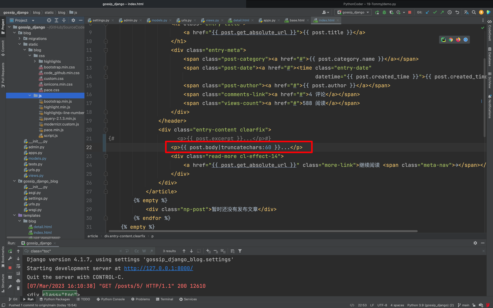
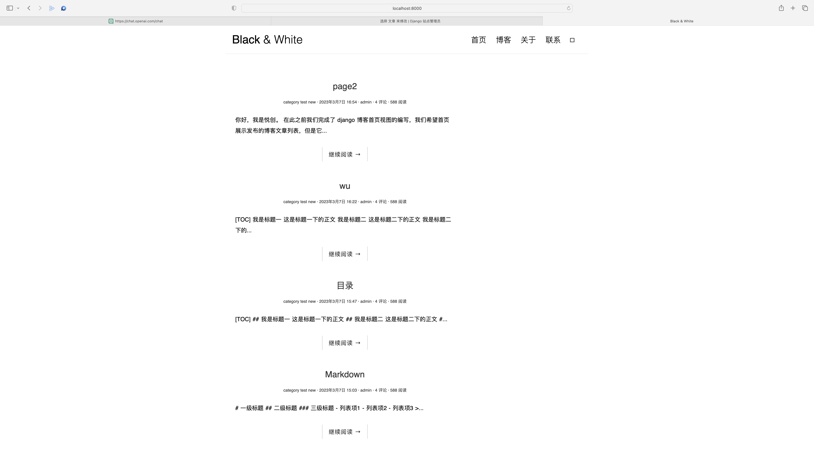

你好，我是悦创。

博客文章的模型有一个 `excerpt` 字段，这个字段用于存储文章的摘要。目前为止，还只能在 django admin 后台手动为文章输入摘要。每次手动输入摘要比较麻烦，对有些文章来说，只要摘取正文的前 N 个字符作为摘要，以便提供文章预览就可以了。因此我们来实现如果文章没有输入摘要，则自动摘取正文的前 N 个字符作为摘要，这有两种实现方法。

## 1. 覆写 save 方法

第一种方法是通过覆写模型的 `save` 方法，从正文字段摘取前 N 个字符保存到摘要字段。在 [创作后台开启，请开始你的表演](/column/Django-fast-development-practice/gossip/07.html) 中我们提到过 `save` 方法中执行的是保存模型实例数据到数据库的逻辑，因此通过覆写 save 方法，在保存数据库前做一些事情，比如填充某个缺失字段的值。

回顾一下博客文章模型代码：

```python
# filename: blog/models.py

class Post(models.Model):
    # 其它字段...
    body = models.TextField()
    excerpt = models.CharField(max_length=200, blank=True)

    def save(self, *args, **kwargs):
        self.modified_time = timezone.now()
        super().save(*args, **kwargs)
```

其中 `body` 字段存储的是正文，`excerpt` 字段用于存储摘要。通过覆写模型的 save 方法，在数据被保存到数据库前，先从 `body` 字段摘取 N 个字符保存到 `excerpt` 字段中，从而实现自动摘要的目的。具体代码如下：

```python
# filename: blog/models.py

import markdown
from django.utils.html import strip_tags

class Post(models.Model):
    # 其它字段...
    body = models.TextField()
    excerpt = models.CharField(max_length=200, blank=True)

    # 其它方法...

    def save(self, *args, **kwargs):
        self.modified_time = timezone.now()

        # 首先实例化一个 Markdown 类，用于渲染 body 的文本。
        # 由于摘要并不需要生成文章目录，所以去掉了目录拓展。
        md = markdown.Markdown(extensions=[
            'markdown.extensions.extra',
            'markdown.extensions.codehilite',
        ])

        # 先将 Markdown 文本渲染成 HTML 文本
        # strip_tags 去掉 HTML 文本的全部 HTML 标签
        # 从文本摘取前 54 个字符赋给 excerpt
        self.excerpt = strip_tags(md.convert(self.body))[:54]

        super().save(*args, **kwargs)
```

这里生成摘要的方案是，先将 `body` 中的 Markdown 文本转为 HTML 文本，去掉 HTML 文本里的 HTML 标签，然后摘取文本的前 54 个字符作为摘要。去掉 HTML 标签的目的是防止前 54 个字符中存在块级 HTML 标签而使得摘要格式比较难看。可以看到很多网站都采用这样一种生成摘要的方式。

然后在模板中适当的地方使用模板标签引用 `{{ post.excerpt }}` 显示摘要的值即可：

```html
templates/blog/index.html

<article class="post post-{{ post.pk }}">
  ...
  <div class="entry-content clearfix">
      <p>{{ post.excerpt }}...</p>
      <div class="read-more cl-effect-14">
          <a href="{{ post.get_absolute_url }}" class="more-link">继续阅读 <span class="meta-nav">→</span></a>
      </div>
  </div>
</article>
```

新添加一篇文章（这样才能触发 save 方法，此前添加的文章不会自动生成摘要，要手动保存一下触发 save 方法），可以看到摘要效果了。

## 2. 使用 truncatechars 模板过滤器

第二种方法是使用 `truncatechars` 模板过滤器（Filter）。在 django 的模板系统中，模板过滤器的使用语法为 `{{ var | filter: arg }}`。可以将模板过滤看做一个函数，它会作用于被它过滤的模板变量，从而改变模板变量的值。例如这里的 `truncatechars` 过滤器可以截取模板变量值的前 N 个字符显示。关于模板过滤器，我们之前使用过 `safe` 过滤器，可以参考 [让博客支持 Markdown 语法和代码高亮]() 这篇文章中对模板过滤器的说明。

例如摘要效果，需要显示 `post.body` 的前 54 的字符，那么可以在模板中使用 `{{ post.body | truncatechars:54 }}`。

```html
templates/blog/index.html

<article class="post post-{{ post.pk }}">
  ...
  <div class="entry-content clearfix">
      <p>{{ post.body|truncatechars:54 }}</p>
      <div class="read-more cl-effect-14">
          <a href="{{ post.get_absolute_url }}" class="more-link">继续阅读 <span class="meta-nav">→</span></a>
      </div>
  </div>
</article>
```



不过这种方法的一个缺点就是如果前 54 个字符含有块级 HTML 元素标签的话（比如一段代码块），会使摘要比较难看。所以推荐使用第一种方法。



欢迎关注我公众号：AI悦创，有更多更好玩的等你发现！

::: details 公众号：AI悦创【二维码】


:::

::: info AI悦创·编程一对一

AI悦创·推出辅导班啦，包括「Python 语言辅导班、C++ 辅导班、java 辅导班、算法/数据结构辅导班、少儿编程、pygame 游戏开发、Linux、Web」，全部都是一对一教学：一对一辅导 + 一对一答疑 + 布置作业 + 项目实践等。当然，还有线下线上摄影课程、Photoshop、Premiere 一对一教学、QQ、微信在线，随时响应！微信：Jiabcdefh

C++ 信息奥赛题解，长期更新！长期招收一对一中小学信息奥赛集训，莆田、厦门地区有机会线下上门，其他地区线上。微信：Jiabcdefh

方法一：[QQ](http://wpa.qq.com/msgrd?v=3&uin=1432803776&site=qq&menu=yes)

方法二：微信：Jiabcdefh

:::


