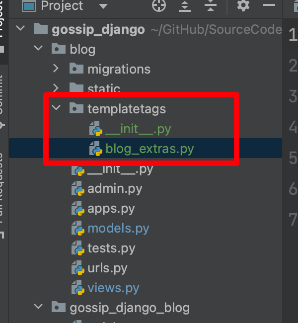

你好，我是悦创。

我们的博客侧边栏有四项内容：最新文章、归档、分类和标签云。这些内容相对比较固定和独立，且在各个页面都会显示，如果像文章列表或者文章详情一样，从视图函数中获取这些数据然后传递给模板，则每个页面对应的视图函数里都要写一段获取这些内容的代码，这会导致很多重复代码。更好的解决方案是直接在模板中获取，为此，我们使用 django 的一个新技术：自定义模板标签来完成任务。

## 1. 使用模板标签的解决思路

我们前面已经接触过一些 django 内置的模板标签，比如比较简单的 `` 模板标签，这个标签帮助我们在模板中引入静态文件。还有比较复杂的如 ` ` 标签。

这里我们希望自己定义一个模板标签，例如名为 `show_recent_posts` 的模板标签，它可以这样工作：我们只要在模板中写入 ``，那么模板中就会渲染一个最新文章列表页面，这和我们在编写博客首页面视图函数是类似的。

首页视图函数中从数据库获取文章列表并保存到 `post_list` 变量，然后把这个 `post_list` 变量传给模板，模板使用 for 模板标签循环这个文章列表变量，从而展示一篇篇文章。

这里唯一的不同是我们从数据库获取文章列表的操作不是在视图函数中进行，而是在模板中通过自定义的 `` 模板标签进行。

以上就是解决思路，但模板标签不是随意写的，必须遵循 django 的规范才能在 django 的模板系统中使用，下面就依照这些规范来实现我们的需求。

## 2. 模板标签目录结构

首先在我们的 **blog 应用**下创建一个 templatetags 文件夹。然后在这个文件夹下创建一个 `__init__.py` 文件，使这个文件夹成为一个 Python 包，之后在 templatetags 目录下创建一个 `blog_extras.py` 文件，这个文件存放自定义的模板标签代码。

此时你的目录结构应该是这样的：



## 3. 编写模板标签代码

接下来就是编写各个模板标签的代码了，自定义模板标签代码写在 `blog_extras.py` 文件中。其实模板标签本质上就是一个 Python 函数，因此按照 Python 函数的思路来编写模板标签的代码就可以了，并没有任何新奇的东西或者需要新学习的知识在里面。

### 3.1 最新文章模板标签

打开 `blog_extras.py` 文件，开始写我们的最新文章模板标签。

```python
from django import template

from ..models import Post, Category, Tag

register = template.Library()


@register.inclusion_tag('blog/inclusions/_recent_posts.html', takes_context=True)
def show_recent_posts(context, num=5):
    return {
        'recent_post_list': Post.objects.all().order_by('-created_time')[:num],
    }
```

这里我们首先导入 template 这个模块，然后实例化了一个 `template.Library` 类，并将函数 `show_recent_posts` 装饰为 `register.inclusion_tag`，这样就告诉 django，这个函数是我们自定义的一个类型为 inclusion_tag 的模板标签。

`inclusion_tag` 模板标签和视图函数的功能类似，它返回一个字典值，字典中的值将作为模板变量，传入由 `inclusion_tag` 装饰器第一个参数指定的模板。当我们在模板中通过 ``使用自己定义的模板标签时，django 会将指定模板的内容使用模板标签返回的模板变量渲染后替换。

`inclusion_tag` 装饰器的参数 `takes_context` 设置为 `True` 时将告诉 django，在渲染 `_recent_posts.html` 模板时，不仅传入`show_recent_posts` 返回的模板变量，同时会传入父模板（即使用 `` 模板标签的模板）上下文（可以简单理解为渲染父模板的视图函数传入父模板的模板变量以及 django 自己传入的模板变量）。当然这里并没有用到这个上下文，这里只是做个简单演示，如果需要用到，就可以在模板标签函数的定义中使用 context 变量引用这个上下文。

接下来就是定义模板 `_recent_posts.html` 的内容。在 `templates/blog` 目录下创建一个 `inclusions` 文件夹，然后创建一个 `_recent_posts.html` 文件，内容如下：

```html
<div class="widget widget-recent-posts">
    <h3 class="widget-title">最新文章</h3>
    <ul>
        
            <li>
                <a href="{{ post.get_absolute_url }}">{{ post.title }}</a>
            </li>
        
            暂无文章！
        
    </ul>
</div>
```

很简单，循环由 `show_recent_posts` 传递的模板变量 `recent_post_list` 即可，和 `index.html` 中循环显示文章列表是一样的。

### 3.2 归档模板标签

和最新文章模板标签一样，先写好函数，然后将函数注册为模板标签即可。

```python
@register.inclusion_tag('blog/inclusions/_archives.html', takes_context=True)
def show_archives(context):
    return {
        'date_list': Post.objects.dates('created_time', 'month', order='DESC'),
    }
```

这里 `Post.objects.dates` 方法会返回一个列表，列表中的元素为每一篇文章（Post）的创建时间（已去重），且是 Python 的 `date` 对象，精确到月份，降序排列。

接受的三个参数值表明了这些含义，一个是 `created_time` ，即 `Post` 的创建时间，`month` 是精度，`order='DESC'` 表明降序排列（即离当前越近的时间越排在前面）。

例如我们写了 3 篇文章，分别发布于 2017 年 2 月 21 日、2017 年 3 月 25 日、2017 年 3 月 28 日，那么 `dates` 函数将返回 2017 年 3 月 和 2017 年 2 月这样一个时间列表，且降序排列，从而帮助我们实现按月归档的目的。

然后是渲染的模板 `_archives.html` 的内容：

```html
<div class="widget widget-archives">
    <h3 class="widget-title">归档</h3>
    <ul>
        
            <li>
                <a href="#">{{ date.year }} 年 {{ date.month }} 月</a>
            </li>
        
            暂无归档！
        
    </ul>
</div>
```

由于 `date_list` 中的每个元素都是 Python 的 `date` 对象，所以可以引用 `year` 和 `month` 属性来获取年份和月份。

### 3.3 分类模板标签

过程还是一样，先写好函数，然后将函数注册为模板标签。注意分类模板标签函数中使用到了 `Category` 类，其定义在 `blog.models.py `文件中，使用前记得先导入它，否则会报错。

```python
@register.inclusion_tag('blog/inclusions/_categories.html', takes_context=True)
def show_categories(context):
    return {
        'category_list': Category.objects.all(),
    }
```

`_categories.html` 的内容：

```html
<div class="widget widget-category">
    <h3 class="widget-title">分类</h3>
    <ul>
        
            <li>
                <a href="#">{{ category.name }} <span class="post-count">(13)</span></a>
            </li>
        
            暂无分类！
        
    </ul>
</div>
```

`<span class="post-count">(13)</span>` 显示的是该分类下的文章数目，这个特性会在接下来的教程中讲解如何实现，目前暂时用占位数据代替吧。

### 3.4 标签云模板标签

标签和分类其实是很类似的，模板标签：

```python
@register.inclusion_tag('blog/inclusions/_tags.html', takes_context=True)
def show_tags(context):
    return {
        'tag_list': Tag.objects.all(),
    }
```

`_tags.html`：

```html
<div class="widget widget-tag-cloud">
    <h3 class="widget-title">标签云</h3>
    <ul>
        
            <li>
                <a href="#">{{ tag.name }}</a>
            </li>
        
            暂无标签！
        
    </ul>
</div>
```

## 4. 使用自定义的模板标签

打开 `base.html`，为了使用刚才定义的模板标签，我们首先需要在模板中导入存放这些模板标签的模块，这里是 `blog_extras.py` 模块。当时我们为了使用 static 模板标签时曾经导入过 ``，这次在 `` 下再导入 `blog_extras`：

```html
templates/base.html



<!DOCTYPE html>
<html>
...
</html>
```

然后找到侧边栏各项，将他们都替换成对应的模板标签：

```html
templates/base.html

<aside class="col-md-4">
  
  

  
  
  
  

  <div class="rss">
     <a href=""><span class="ion-social-rss-outline"></span> RSS 订阅</a>
  </div>
</aside>
```

此前侧边栏中各个功能块都替换成了模板标签，其实实际内容还是一样的，只是我们将其挪到了模块化的模板中，并有这些自定义的模板标签负责渲染这些内容。

此外我们定义的 `show_recent_posts` 标签可以接收参数，默认为 5，即显示 5 篇文章，如果要控制其显示 10 篇文章，可以使用 `` 这种方式传入参数。

现在运行开发服务器，可以看到侧边栏显示的数据已经不再是之前的占位数据，而是我们保存在数据库中的数据了。

::: warning

如果你是在开发服务器启动的过程中编写的模板标签代码，那么一定要重启一下开发服务器才能导入 blog_extras，否则会报

TemplateSyntaxError at /

'blog_extras' is not a registered tag library. Must be one of:

类似这样的错误。

:::

**注意**：如果你按照教程的步骤做完后发现报错，请按以下顺序检查。

1. 检查目录结构是否正确。确保 `templatetags` 位于 `blog` 目录下，且目录名必须为 `templatetags`。具体请对照上文给出的目录结构。
2. 确保 `templatetags` 目录下有 `__init__.py` 文件。
3. 确保通过 `register = template.Library()` 和 `@register.inclusion_tag` 装饰器将函数装饰为一个模板标签。
4. 确保在使用模板标签以前导入了 `blog_extras`，即 ``。**注意要在使用任何 `blog_extras`下的模板标签以前导入它。**
5. 确保模板标签的语法使用正确，即 ``，注意 `{ `和 `%` 以及 `%` 和 `}` 之间**没有**任何空格。


欢迎关注我公众号：AI悦创，有更多更好玩的等你发现！

::: details 公众号：AI悦创【二维码】


:::

::: info AI悦创·编程一对一

AI悦创·推出辅导班啦，包括「Python 语言辅导班、C++ 辅导班、java 辅导班、算法/数据结构辅导班、少儿编程、pygame 游戏开发、Linux、Web」，全部都是一对一教学：一对一辅导 + 一对一答疑 + 布置作业 + 项目实践等。当然，还有线下线上摄影课程、Photoshop、Premiere 一对一教学、QQ、微信在线，随时响应！微信：Jiabcdefh

C++ 信息奥赛题解，长期更新！长期招收一对一中小学信息奥赛集训，莆田、厦门地区有机会线下上门，其他地区线上。微信：Jiabcdefh

方法一：[QQ](http://wpa.qq.com/msgrd?v=3&uin=1432803776&site=qq&menu=yes)

方法二：微信：Jiabcdefh

:::


