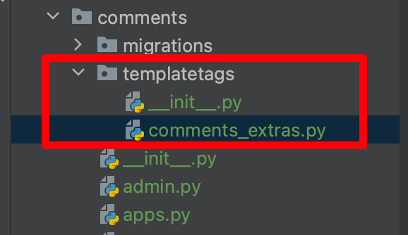
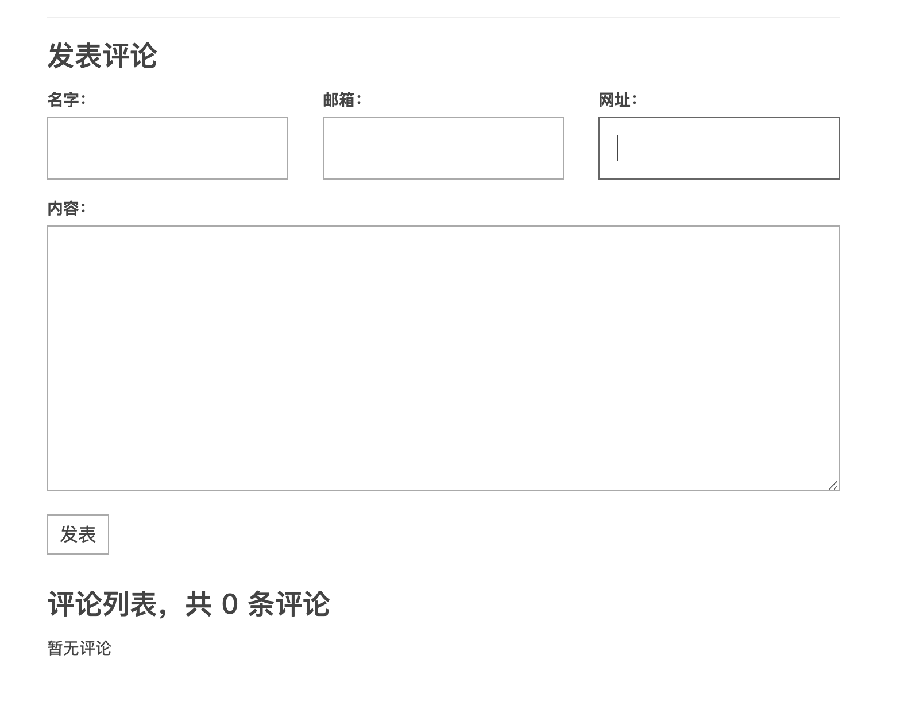
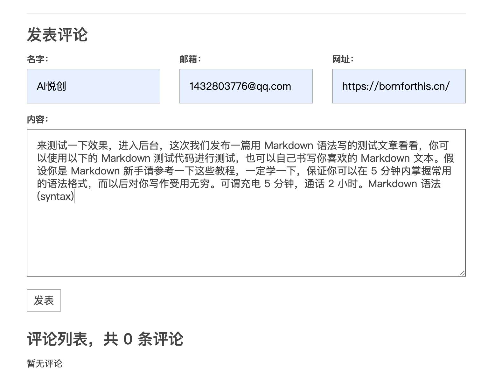
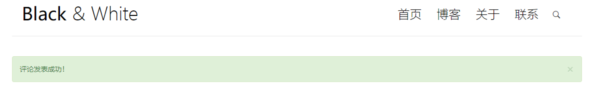
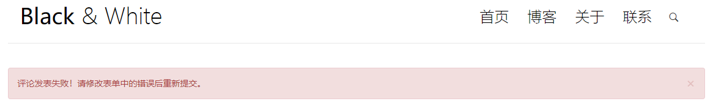
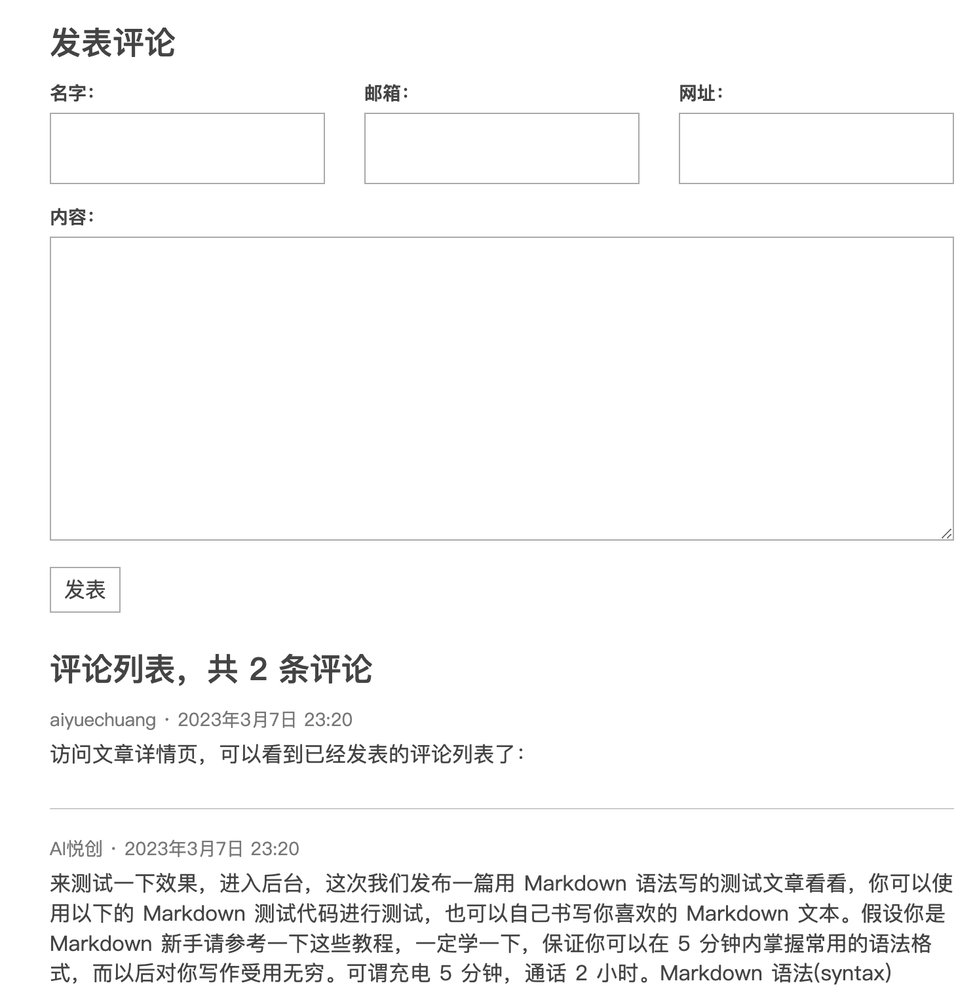

## 1. 创建评论应用

你好，我是悦创。

相对来说，评论是另外一个比较独立的功能。django 提倡，如果功能相对比较独立的话，最好是创建一个应用，把相应的功能代码组织到这个应用里。我们的第一个应用叫 blog，它里面放了展示博客文章列表和详情等相关功能的代码。而这里我们再创建一个应用，名为 comments，这里面将存放和评论功能相关的代码。首先**进入到项目根目录**，然后输入如下命令创建一个新的应用：

```python
➜  gossip_django git:(main) ✗ pipenv run python manage.py startapp comments
```

可以看到生成的 comments 应用目录结构和 blog 应用的目录是类似的（关于创建应用以及应用的目录结构在 ["空空如也"的博客应用](/column/Django-fast-development-practice/gossip/02.html) 中已经有过详细介绍）。

创建新的应用后一定要记得在 `settings.py` 里注册这个应用，django 才知道这是一个应用。

```python
# filename: blogproject/settings.py

...
INSTALLED_APPS = [
    ...
    'blog.apps.BlogConfig',  # 注册 blog 应用
    'comments.apps.CommentsConfig',  # 注册 comments 应用
]
...
```

注意这里注册的是 `CommentsConfig` 类，在 [博客从“裸奔”到“有皮肤”](/column/Django-fast-development-practice/gossip/06.html) 中曾经讲过如何对应用做一些初始化配置，例如让 blog 应用在 django 的 admin 后台显示中文名字。这里也对评论应用做类似的配置：

```python
# filename: comments/app.py

from django.apps import AppConfig


class CommentsConfig(AppConfig):
    default_auto_field = 'django.db.models.BigAutoField'
    name = 'comments'
    verbose_name = '评论'
```

## 2. 设计评论的数据库模型

用户评论的数据必须被存储到数据库里，以便其他用户访问时 django 能从数据库取回这些数据然后展示给访问的用户，因此我们需要为评论设计数据库模型，这和设计文章、分类、标签的数据库模型是一样的，如果你忘了怎么做，再回顾一下 [创建 Django 博客的数据库模型](/column/Django-fast-development-practice/gossip/03.html) 中的做法。我们的评论模型设计如下（评论模型的代码写在 `comments/models.py` 里）：

```python
# filename: comments/models.py

from django.db import models
from django.utils import timezone


class Comment(models.Model):
    name = models.CharField('名字', max_length=50)
    email = models.EmailField('邮箱')
    url = models.URLField('网址', blank=True)
    text = models.TextField('内容')
    created_time = models.DateTimeField('创建时间', default=timezone.now)
    post = models.ForeignKey('blog.Post', verbose_name='文章', on_delete=models.CASCADE)

    class Meta:
        verbose_name = '评论'
        verbose_name_plural = verbose_name

    def __str__(self):
        return '{}: {}'.format(self.name, self.text[:20])
```

评论会保存评论用户的 `name`（名字）、`email`（邮箱）、`url`（个人网站，可以为空），用户发表的内容将存放在 `text` 字段里，`created_time` 记录评论时间。

最后，这个评论是关联到某篇文章（Post）的，由于一个评论只能属于一篇文章，一篇文章可以有多个评论，是一对多的关系，因此这里我们使用了 `ForeignKey`。关于 `ForeignKey` 我们前面已有介绍，这里不再赘述。

此外，在 [博客从“裸奔”到“有皮肤”](/column/Django-fast-development-practice/gossip/06.html) 中提过，所有模型的字段都接受一个 `verbose_name` 参数（大部分是第一个位置参数），django 在根据模型的定义自动生成表单时，会使用这个参数的值作为表单字段的 label，我们在后面定义的评论表单时会进一步看到其作用。

创建了数据库模型就要迁移数据库，迁移数据库的命令也在前面讲过。在**项目根目录**下分别运行下面两条命令：

```python
➜ pipenv run python manage.py makemigrations
➜ pipenv run python manage.py migrate
```

```python
➜  gossip_django git:(main) ✗ pipenv run python manage.py makemigrations
Migrations for 'blog':
  blog/migrations/0002_alter_category_options_alter_post_options_and_more.py
    - Change Meta options on category
    - Change Meta options on post
    - Change Meta options on tag
    - Alter field author on post
    - Alter field body on post
    - Alter field category on post
    - Alter field created_time on post
    - Alter field excerpt on post
    - Alter field modified_time on post
    - Alter field tags on post
    - Alter field title on post
Migrations for 'comments':
  comments/migrations/0001_initial.py
    - Create model Comment
➜  gossip_django git:(main) ✗ pipenv run python manage.py migrate
Operations to perform:
  Apply all migrations: admin, auth, blog, comments, contenttypes, sessions
Running migrations:
  Applying blog.0002_alter_category_options_alter_post_options_and_more... OK
  Applying comments.0001_initial... OK
➜  gossip_django git:(main) ✗
```

## 3. 注册评论模型到 admin

既然已经创建了模型，我们就可以将它注册到 django admin 后台，方便管理员用户对评论进行管理，如何注册 admin 以及美化在 [博客从“裸奔”到“有皮肤”](/column/Django-fast-development-practice/gossip/06.html) 有过详细介绍，这里给出相关代码：

```python
# filename: comments/admin.py

from django.contrib import admin
from .models import Comment


class CommentAdmin(admin.ModelAdmin):
    list_display = ['name', 'email', 'url', 'post', 'created_time']
    fields = ['name', 'email', 'url', 'text', 'post']


admin.site.register(Comment, CommentAdmin)
```

## 4. 设计评论表单

这一节我们将学习一个全新的 django 知识：表单。那么什么是表单呢？基本的 HTML 知识告诉我们，在 HTML 文档中这样的代码表示一个表单：

```html
<form action="" method="post">
    <input type="text" name="username" />
    <input type="password" name="password" />
    <input type="submit" value="login" />
</form>
```

**为什么需要表单呢？**

表单是用来收集并向服务器提交用户输入的数据的。

考虑用户在我们博客网站上发表评论的过程，当用户想要发表评论时，他找到我们给他展示的一个评论表单（我们已经看到在文章详情页的底部就有一个评论表单，你将看到表单呈现给我们的样子），然后根据表单的要求填写相应的数据。

之后用户点击评论按钮，这些数据就会发送给某个 URL。

我们知道每一个 URL 对应着一个 django 的视图函数，于是 django 调用这个视图函数，我们在视图函数中写上处理用户通过表单提交上来的数据的代码，比如验证数据的合法性并且保存数据到数据库中，那么用户的评论就被 django 处理了。

如果通过表单提交的数据存在错误，那么我们把错误信息返回给用户，并在前端重新渲染表单，要求用户根据错误信息修正表单中不符合格式的数据，再重新提交。

django 的表单功能就是帮我们完成上述所说的表单处理逻辑，表单对 django 来说是一个内容丰富的话题，很难通过教程中的这么一个例子涵盖其全部用法。因此我们强烈建议你在完成本教程后接下来的学习中仔细阅读 django 官方文档关于 [表单](https://docs.djangoproject.com/zh-hans/4.1/topics/forms/) 的介绍，因为表单在 Web 开发中会经常遇到。

下面开始编写评论表单代码。在 comments 目录下（和 `models.py` 同级）新建一个 `forms.py` 文件，用来存放表单代码，我们的表单代码如下：

```python
# filename: comments/forms.py

from django import forms
from .models import Comment


class CommentForm(forms.ModelForm):
    class Meta:
        model = Comment  # 表明这个表单对应的数据库模型是 Comment 
        fields = ['name', 'email', 'url', 'text']
```

要使用 django 的表单功能，我们首先导入 forms 模块。

django 的表单类必须继承自 `forms.Form` 类或者 `forms.ModelForm` 类。

如果表单对应有一个数据库模型（例如这里的评论表单对应着评论模型），那么使用 `ModelForm` 类会简单很多，这是 django 为我们提供的方便。

之后我们在表单的内部类 `Meta` 里指定一些和表单相关的东西。`model = Comment` 表明这个表单对应的数据库模型是 `Comment` 类。`fields = ['name', 'email', 'url', 'text']` 指定了表单需要显示的字段，这里我们指定了 name、email、url、text 需要显示。

## 5. 关于表单进一步的解释

**django 为什么要给我们提供一个表单类呢？**

为了便于理解，我们可以把表单和前面讲过的 django ORM 系统做类比。回想一下，我们使用数据库保存创建的博客文章，但是从头到尾没有写过任何和数据库有关的代码（要知道数据库自身也有一门数据库语言），这是因为 django 的 ORM 系统内部帮我们做了一些事情。我们遵循 django 的规范写的一些 Python 代码，例如创建 Post、Category 类，然后通过运行数据库迁移命令将这些代码反应到数据库。

django 的表单和这个思想类似，正常的前端表单代码应该是和本文开头所提及的那样的 HTML 代码，但是我们目前并没有写这些代码，而是写了一个 `CommentForm` 这个 Python 类。通过调用这个类的一些方法和属性，django 将自动为我们创建常规的表单代码，接下来的教程我们就会看到具体是怎么做的。

## 6. 展示评论表单

表单类已经定义完毕，现在的任务是在文章的详情页下方将这个表单展现给用户，用户便可以通过这个表单填写评论数据，从而发表评论。

**那么怎么展现一个表单呢？**

django 会根据表单类的定义自动生成表单的 HTML 代码，我们要做的就是实例化这个表单类，然后将表单的实例传给模板，让 django 的模板引擎来渲染这个表单。

**那怎么将表单类的实例传给模板呢？**

因为表单出现在文章详情页，一种想法是修改文章详情页 `detail` 视图函数，在这个视图中实例化一个表单，然后传递给模板。

然而这样做的一个缺点就是需要修改 `detail` 视图函数的代码，而且 `detail` 视图函数的作用主要就是处理文章详情，一个视图函数最好不要让它做太多杂七杂八的事情。另外一种想法是使用自定义的模板标签，我们在 [页面侧边栏：使用自定义模板标签](/column/Django-fast-development-practice/gossip/12.html) 中详细介绍过如何自定义模板标签来渲染一个局部的 HTML 页面，这里我们使用自定义模板标签的方法，来渲染表单页面。

[如何编写自定义的模板标签和过滤器][1]

[1]:https://docs.djangoproject.com/zh-hans/4.1/howto/custom-template-tags/

和 blog 应用中定义模板标签的老套路一样，首先建立评论应用模板标签的文件结构，在 comments 文件夹下新建一个 templatetags 文件夹，然后创建 `__init__.py` 文件使其成为一个包，再创建一个 `comments_extras.py `文件用于存放模板标签的代码，文件结构如下：



然后我们定义一个 `inclusion_tag` 类型的模板标签，用于渲染评论表单，关于如何定义模板标签，在 [页面侧边栏：使用自定义模板标签](/column/Django-fast-development-practice/gossip/12.html) 中已经有详细介绍，这里不再赘述。

```python
from django import template
from ..forms import CommentForm

register = template.Library()


@register.inclusion_tag('comments/inclusions/_form.html', takes_context=True)
def show_comment_form(context, post, form=None):
    if form is None:
        form = CommentForm()
    return {
        'form': form,
        'post': post,
    }
```

从定义可以看到，`show_comment_form` 模板标签使用时会接受一个 post（文章 Post 模型的实例）作为参数，同时也可能传入一个评论表单 CommentForm 的实例 form，如果没有接受到评论表单参数，模板标签就会新创建一个 `CommentForm` 的实例（一个没有绑定任何数据的空表单）传给模板，否则就直接将接受到的评论表单实例直接传给模板，这主要是为了复用已有的评论表单实例（后面会看到其用法）。

然后在 `templates/comments/inclusions` 目录下（没有就新建）新建一个 `_form.html` 模板，写上代码：

```html
<form action="" method="post" class="comment-form">
    
    <div class="row">
        <div class="col-md-4">
            <label for="{{ form.name.id_for_label }}">{{ form.name.label }}：</label>
            {{ form.name }}
            {{ form.name.errors }}
        </div>
        <div class="col-md-4">
            <label for="{{ form.email.id_for_label }}">{{ form.email.label }}：</label>
            {{ form.email }}
            {{ form.email.errors }}
        </div>
        <div class="col-md-4">
            <label for="{{ form.url.id_for_label }}">{{ form.url.label }}：</label>
            {{ form.url }}
            {{ form.url.errors }}
        </div>
        <div class="col-md-12">
            <label for="{{ form.text.id_for_label }}">{{ form.text.label }}：</label>
            {{ form.text }}
            {{ form.text.errors }}
            <button type="submit" class="comment-btn">发表</button>
        </div>
    </div>    <!-- row -->
</form>
```

这个表单的模板有点复杂，一一讲解一下。

首先 HTML 的 form 标签有 2 个重要的属性，`action` 和 `method`。`action` 指定表单内容提交的地址，这里我们提交给 `comments:comment` 视图函数对应的 URL（后面会创建这个视图函数并绑定对应的 URL），模板标签 `url` 的用法在 [分类、归档和标签页](/column/Django-fast-development-practice/gossip/13.html) 教程中有详细介绍。`method` 指定提交表单时的 HTTP 请求类型，一般表单提交都是使用 POST。

然后我们看到 ``，这个模板标签在表单渲染时会自动渲染为一个隐藏类型的 HTML input 控件，其值为一个随机字符串，作用主要是为了防护 CSRF（跨站请求伪造）攻击。`` 在模板中渲染出来的内容大概如下所示：

```html
<input type="hidden" name="csrfmiddlewaretoken" value="KH9QLnpQPv2IBcv3oLsksJXdcGvKSnC8t0mTfRSeNIlk5T1G1MBEIwVhK4eh6gIZ">
```

> CSRF 攻击是一种常见的 Web 攻击手段。攻击者利用用户存储在浏览器中的 cookie，向目标网站发送 HTTP 请求，这样在目标网站看来，请求来自于用户，而实际发送请求的人却是攻击者。例如假设我们的博客支持登录功能（目前没有），并使用 cookie（或者 session）记录用户的登录状态，且评论表单没有 csrf token 防护。用户登录了我们的博客后，又去访问了一个小电影网站，小电影网站有一段恶意 JavaScript 脚本，它读取用户的 cookie，并构造了评论表单的数据，然后脚本使用这个 cookie 向我们的博客网站发送一条 POST 请求，django 就会认为这是来自该用户的评论发布请求，便会在后台创建一个该用户的评论，而这个用户全程一脸懵逼。
>
> CSRF 的一个防范措施是，对所有访问网站的用户颁发一个令牌（token），对于敏感的 HTTP 请求，后台会校验此令牌，确保令牌的确是网站颁发给指定用户的。因此，当用户访问别的网站时，虽然攻击者可以拿到用户的 cookie，但是无法取得证明身份的令牌，因此发过来的请求便不会被受理。
>
> 以上是对 CSRF 攻击和防护措施的一个简单介绍，更加详细的讲解请使用搜索引擎搜索相关资料。

`show_comment_form` 模板标签给模板传递了一个模板变量 form，它是 `CommentForm` 的一个实例，表单的字段 `{{ form.name }}`、`{{ form.email }}`、`{{ form.url }}` 等将自动渲染成表单控件，例如 `<input>` 控件。

> 注意到表单的定义中并没有定义 `name`、`email`、`url` 等属性，那它们是哪里来的呢？看到 `CommentForm` 中 `Meta` 下的 `fields`，django 会自动将 `fields` 中声明的模型字段设置为表单的属性。

`{{ form.name.errors }}`、`{{ form.email.errors }}` 等将渲染表单对应字段的错误（如果有的话），例如用户 email 格式填错了，那么 django 会检查用户提交的 email 的格式，然后将格式错误信息保存到 `errors` 中，模板便将错误信息渲染显示。

`{{ form.xxx.label }}` 用来获取表单的 label，之前说过，django 根据表单对应的模型中字段的 `verbose_name` 参数生成。

然后我们就可以在 `detail.html ` 中使用这个模板标签来渲染表单了，注意在使用前记得先 `` 这个模块。而且为了避免可能的报错，最好**重启一下开发服务器**。

```html


...

<h3>发表评论</h3>

```

这里当用户访问文章详情页面时，我们给他展示一个空表单，所以这里只传入了 post 参数需要的值，而没有传入 form 参数所需的值。可以看到表单渲染出来的结果了：



## 7. 评论视图函数

当用户提交表单中的数据后，django 需要调用相应的视图函数来处理这些数据，下面开始写我们视图函数处理逻辑：

```python
from blog.models import Post
from django.shortcuts import get_object_or_404, redirect, render
from django.views.decorators.http import require_POST

from .forms import CommentForm


@require_POST
def comment(request, post_pk):
    # 先获取被评论的文章，因为后面需要把评论和被评论的文章关联起来。
    # 这里我们使用了 django 提供的一个快捷函数 get_object_or_404，
    # 这个函数的作用是当获取的文章（Post）存在时，则获取；否则返回 404 页面给用户。
    post = get_object_or_404(Post, pk=post_pk)

    # django 将用户提交的数据封装在 request.POST 中，这是一个类字典对象。
    # 我们利用这些数据构造了 CommentForm 的实例，这样就生成了一个绑定了用户提交数据的表单。
    form = CommentForm(request.POST)

    # 当调用 form.is_valid() 方法时，django 自动帮我们检查表单的数据是否符合格式要求。
    if form.is_valid():
        # 检查到数据是合法的，调用表单的 save 方法保存数据到数据库，
        # commit=False 的作用是仅仅利用表单的数据生成 Comment 模型类的实例，但还不保存评论数据到数据库。
        comment = form.save(commit=False)

        # 将评论和被评论的文章关联起来。
        comment.post = post

        # 最终将评论数据保存进数据库，调用模型实例的 save 方法
        comment.save()

        # 重定向到 post 的详情页，实际上当 redirect 函数接收一个模型的实例时，它会调用这个模型实例的 get_absolute_url 方法，
        # 然后重定向到 get_absolute_url 方法返回的 URL。
        return redirect(post)

    # 检查到数据不合法，我们渲染一个预览页面，用于展示表单的错误。
    # 注意这里被评论的文章 post 也传给了模板，因为我们需要根据 post 来生成表单的提交地址。
    context = {
        'post': post,
        'form': form,
    }
    return render(request, 'comments/preview.html', context=context)
```

这个评论视图相比之前的一些视图复杂了很多，主要是处理评论的过程更加复杂。具体过程在代码中已有详细注释，这里仅就视图中出现了一些新的知识点进行讲解。

首先视图函数被 `require_POST` 装饰器装饰，从装饰器的名字就可以看出，其作用是限制这个视图只能通过 POST 请求触发，因为创建评论需要用户通过表单提交的数据，而提交表单通常都是限定为 POST 请求，这样更加安全。

另外我们使用了 `redirect` 快捷函数。这个函数位于 `django.shortcuts` 模块中，它的作用是对 HTTP 请求进行重定向（即用户访问的是某个 URL，但由于某些原因，服务器会将用户重定向到另外的 URL）。`redirect` 既可以接收一个 URL 作为参数，也可以接收一个模型的实例作为参数（例如这里的 post）。如果接收一个模型的实例，那么这个实例必须实现了 `get_absolute_url` 方法，这样 `redirect` 会根据 `get_absolute_url` 方法返回的 URL 值进行重定向。

如果用户提交的数据合法，我们就将评论数据保存到数据库，否则说明用户提交的表单包含错误，我们将渲染一个 `preview.html` 页面，来展示表单中的错误，以便用户修改后重新提交。`preview.html` 的代码如下：

```html




  

```

这里还是使用 `show_comment_form` 模板标签来展示一个表单，然而不同的是，这里我们传入由视图函数 `comment` 传来的绑定了用户提交的数据的表单实例 `form`，而不是渲染一个空表单。因为视图函数 `comment` 中的表单实例是绑定了用户提交的评论数据，以及对数据进行过合法性校验的表单，因此当 django 渲染这个表单时，会连带渲染用户已经填写的表单数据以及数据不合法的错误提示信息，而不是一个空的表单了。例如下图，我们提交的数据中 email 格式不合法，表单校验了数据格式，然后渲染错误提示：



## 8. 绑定 URL

视图函数需要和 URL 绑定，这里我们在 comment 应用中再建一个 `urls.py` 文件，写上 URL 模式：

```python
from django.urls import path

from . import views

app_name = 'comments'
urlpatterns = [
    path('comment/<int:post_pk>', views.comment, name='comment'),
]
```

别忘了给这个评论的 URL 模式规定命名空间，即 `app_name = 'comments'`。

最后要在项目的 blogproject 目录的 `urls.py` 里包含 `comments/urls.py` 这个文件：

```python
blogproject/urls.py

from django.contrib import admin
from django.urls import path, include

urlpatterns = [
    path('admin/', admin.site.urls),
    path('', include('blog.urls')),
    path('', include('comments.urls')),
]
```

可以测试一下提交评论的功能了，首先尝试输入非法格式的数据，例如将邮箱输入为 `xxx@xxx`，那么评论视图在校验表单数据合法性时，发现邮箱格式不符，就会渲染 preview 页面，展示表单中的错误，将邮箱修改为正确的格式后，再次点击发表，页面就跳转到了被评论文章的详情页，说明视图正确执行了保存表单数据到数据库的逻辑。

不过这里有一点不好的地方就是，评论成功后页面直接跳转到了被评论文章的详情页，没有任何提示，用户也不知道评论究竟有没有真的成功。这里我们使用 django 自带的 messages 应用来给用户发送评论成功或者失败的消息。

## 9. 发送评论消息

django 默认已经为我们做好了 messages 的相关配置，直接用即可。

两个地方需要发送消息，第一个是当评论成功，即评论数据成功保存到数据库后，因此在 comment 视图中加一句。

```python
from django.contrib import messages

if form.is_valid():
    ...
    # 最终将评论数据保存进数据库，调用模型实例的 save 方法
    comment.save()

    messages.add_message(request, messages.SUCCESS, '评论发表成功！', extra_tags='success')
    return redirect(post)
```

这里导入 django 的 messages 模块，使用 `add_message` 方法增加了一条消息，消息的第一个参数是当前请求，因为当前请求携带用户的 cookie，django 默认将详细存储在用户的 cookie 中。第二个参数是消息级别，评论发表成功的消息设置为 messages.SUCCESS，这是 django 已经默认定义好的一个整数，消息级别也可以自己定义。紧接着传入消息的内容，最后 `extra_tags` 给这条消息打上额外的标签，标签值可以在展示消息时使用，比如这里我们会把这个值用在模板中的 HTML 标签的 class 属性，增加样式。

同样的，如果评论失败了，也发送一条消息：

```python
# 检查到数据不合法，我们渲染一个预览页面，用于展示表单的错误。
# 注意这里被评论的文章 post 也传给了模板，因为我们需要根据 post 来生成表单的提交地址。
context = {
    'post': post,
    'form': form,
}
messages.add_message(request, messages.ERROR, '评论发表失败！请修改表单中的错误后重新提交。', extra_tags='danger')
```

发送的消息被缓存在 cookie 中，然后我们在模板中获取显示即可。显示消息比较好的地方是在导航条的下面，我们在模板 `base.html` 的导航条代码下增加如下代码：

```html
<header>
  ...
</header>

    
      <div class="alert alert-{{ message.tags }} alert-dismissible" role="alert">
        <button type="button" class="close" data-dismiss="alert" aria-label="Close"><span
                aria-hidden="true">&times;</span></button>
        {{ message }}
      </div>
    

```

这里 django 会通过全局上下文自动把 `messages` 变量传给模板，这个变量里存储我们发送的消息内容，然后就是循环显示消息了。这里我们使用了 bootstrap 的一个 alert 组件，为其设置不同的 class 会显示不同的颜色，所以之前添加消息时传入的 `extra_tags` 就派上了用场。比如这里 `alert-{{ message.tags }}`，当传入的是 success 时，类名就为 `alert-success`，这时显示的消息背景颜色就是绿色，传入的是 dangerous，则显示的就是红色。

评论发布成功和失败的消息效果如下图：







## 10. 显示评论内容

为了不改动已有的视图函数的代码，评论数据我们也使用自定义的模板标签来实现。模板标签代码如下：

```python
@register.inclusion_tag('comments/inclusions/_list.html', takes_context=True)
def show_comments(context, post):
    comment_list = post.comment_set.all().order_by('-created_time')
    comment_count = comment_list.count()
    return {
        'comment_count': comment_count,
        'comment_list': comment_list,
    }
```

我们使用了 `post.comment_set.all()` 来获取 `post` 对应的全部评论。 `Comment` 和`Post` 是通过 `ForeignKey` 关联的，回顾一下我们当初获取某个分类 `cate` 下的全部文章时的代码：`Post.objects.filter(category=cate)`。这里 `post.comment_set.all()` 也等价于 `Comment.objects.filter(post=post)`，即根据 `post` 来过滤该 `post` 下的全部评论。但既然我们已经有了一个 `Post` 模型的实例 `post`（它对应的是 `Post` 在数据库中的一条记录），那么获取和 `post` 关联的评论列表有一个简单方法，即调用它的 `xxx_set` 属性来获取一个类似于 `objects` 的模型管理器，然后调用其 `all` 方法来返回**这个 `post`** 关联的全部评论。 其中 `xxx_set` 中的 `xxx` 为关联模型的类名（小写）。例如 `Post.objects.filter(category=cate)` 也可以等价写为 `cate.post_set.all()`。

模板 `_list.html` 代码如下：

```html
<h3>评论列表，共 <span>{{ comment_count }}</span> 条评论</h3>
<ul class="comment-list list-unstyled">
  
    <li class="comment-item">
      <span class="nickname">{{ comment.name }}</span>
      <time class="submit-date" datetime="{{ comment.created_time }}">{{ comment.created_time }}</time>
      <div class="text">
        {{ comment.text|linebreaks }}
      </div>
    </li>
  
    暂无评论
  
</ul>
```

要注意这里 `{{ comment.text|linebreaks }}` 中对评论内容使用的过滤器 `linebreaks`，浏览器会将换行以及连续的多个空格合并为一个空格。如果用户评论的内容中有换行，浏览器会将换行替换为空格，从而显示的用户评论内容就会挤成一堆。`linebreaks` 过滤器预先将换行符替换为 `br` HTML 标签，这样内容就能换行显示了。

然后将 `detail.html` 中此前占位用的评论模板替换为模板标签渲染的内容：

```html
<h3>发表评论</h3>

<div class="comment-list-panel">
    
</div>
```

访问文章详情页，可以看到已经发表的评论列表了：




欢迎关注我公众号：AI悦创，有更多更好玩的等你发现！

::: details 公众号：AI悦创【二维码】


:::

::: info AI悦创·编程一对一

AI悦创·推出辅导班啦，包括「Python 语言辅导班、C++ 辅导班、java 辅导班、算法/数据结构辅导班、少儿编程、pygame 游戏开发、Linux、Web」，全部都是一对一教学：一对一辅导 + 一对一答疑 + 布置作业 + 项目实践等。当然，还有线下线上摄影课程、Photoshop、Premiere 一对一教学、QQ、微信在线，随时响应！微信：Jiabcdefh

C++ 信息奥赛题解，长期更新！长期招收一对一中小学信息奥赛集训，莆田、厦门地区有机会线下上门，其他地区线上。微信：Jiabcdefh

方法一：[QQ](http://wpa.qq.com/msgrd?v=3&uin=1432803776&site=qq&menu=yes)

方法二：微信：Jiabcdefh

:::


