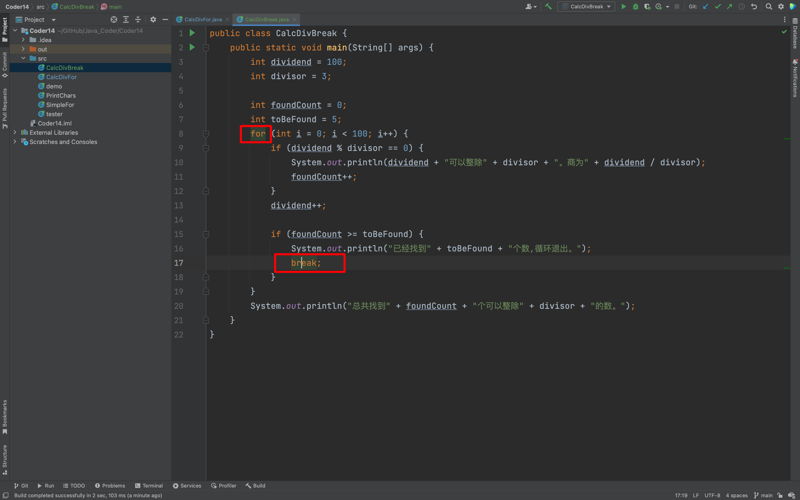

## 0. 目录

- 简化输出连续 26 个字符的程序
- 简化并增强找整除数的程序
- break 语句
- continue 语句

## 1. 简化输出连续 26 个字符的程序

### 1.1 for 语句

- 让程序在满足某条件时，重复执行某个代码块。for 是 Java 中的关键字
- for 语句语法和简单的示例程
- 初始语句在 for 循环开始前执行一次，以后不再执行；循环体条件表达式在每次循环体执行前会执行，如果为 true，则执行循环体，否则循环结束；循环体后语句会在每次循环执行后被执行；

::: code-tabs

@tab 语法

```java
for (初始语句; 循环体条件表达式; 循环体后语句) {
    for 循环体
}
```
@tab 代码

```java
public class SimpleFor {
    public static void main(String[] args) {
        for (int i = 0; i < 10; i++) {
            System.out.println("i的值是：" + i);
        }
    }
}
```

@tab 输出
```java
i的值是：0
i的值是：1
i的值是：2
i的值是：3
i的值是：4
i的值是：5
i的值是：6
i的值是：7
i的值是：8
i的值是：9
```

:::

### 1.2 使用 for 简化输出连续 26 个字符的程序

::: code-tabs

@tab PrintChars1

```java
public class PrintChars {
    public static void main(String[] args) {
        char ch = '我';
        int startNum = ch;
        for (int i = 0; i < 26; i++) {
            int newNum = startNum + i;
            System.out.println(newNum + "\t" + ((char) newNum));
        }
    }
}
```
@tab PrintChars2

```java
public class PrintChars {
    public static void main(String[] args) {
        char ch = 'A';
        int startNum = ch;
        for (int i = 0; i < 26; i++) {
            int newNum = startNum + i;
            System.out.println(newNum + "\t" + ((char) newNum));
        }
    }
}
```

:::

## 2. 简化并增强找整除数的程序

### 2.1 简化和增强找整除数的程序

- 使用 for 语句让程序简洁
- 增加新功能，输出最多10个可以整除的数
- 条件布尔表达式可以用 for 语句外部的变量
- 循环体执行后的语句可以有多个表达式，用逗号分开

#### 2.1.1 使用 for 语句让程序简洁

```java
public class CalcDivFor {
    public static void main(String[] args) {
        int divided = 100;
        int divisor = 3;

        for (int i = 0; i < 100; i++) {
            if (divided % divisor == 0) {
                System.out.println(divided + "可以整除" + divisor + "。商为" + divided / divisor);
            }
            divided++;

        }

    }
}
```

#### 2.1.2 增加新功能，输出最多10个可以整除的数

```java
public class CalcDivFor {
    public static void main(String[] args) {
        int divided = 100;
        int divisor = 3;

        int found = 0;
        for (int i = 0; i < 100 && found < 10; i++) {
            if (divided % divisor == 0) {
                System.out.println(divided + "可以整除" + divisor + "。商为" + divided / divisor);
                found++;
            }
            divided++;
        }


    }
}
```
#### 2.1.3 条件布尔表达式可以用 for 语句外部的变量

其实，上面的代码 found 使用的就是 for 外面的变量。

#### 2.1.4 循环体执行后的语句可以有多个表达式，用逗号分开

```java
public class CalcDivFor {
    public static void main(String[] args) {
        int divided = 100;
        int divisor = 3;

        int found = 0;
        for (int i = 0; i < 100 && found < 10; i++, divided++) {
            if (divided % divisor == 0) {
                System.out.println(divided + "可以整除" + divisor + "。商为" + divided / divisor);
                found++; // 前 ++ 和 后 ++ 影响都不大，前 ++ 与 后 ++，其实是在运行的那行才会体现区别
            }
        }
    }
}
```
当然，强调一点，上面把 `divided++`写入，其实不是一个好的方式，还是推荐单独写出来。
```java
public class demo {
    public static void main(String[] args) {
        int divided = 100;
        int divisor = 3;

        int found = 0;
//        下面这样写可以吗？
//        不行，逻辑出错，found 需要在可以取整的时候自增，现在这样编写，意味着不管能不能整除都可以自增
        for (int i = 0; i < 100 && found < 10; i++, found++) {
            if (divided % divisor == 0) {
                System.out.println(divided + "可以整除" + divisor + "。商为" + divided / divisor);
            }
            divided++;
        }


    }
}
```

## 3. Break 语句

### 3.1 结束循环

- break 语句可以结束循环
- 在求整除程序中使用 break 提前结束循环
```java
public class CalcDivBreak {
    public static void main(String[] args) {
        int dividend = 100;
        int divisor = 3;

        int foundCount = 0;
        int toBeFound = 5;
        for (int i = 0; i < 100; i++) {
            if (dividend % divisor == 0) {
                System.out.println(dividend + "可以整除" + divisor + "。商为" + dividend / divisor);
                foundCount++;
            }
            dividend++;

            if (foundCount >= toBeFound) {
                System.out.println("已经找到" + toBeFound + "个数,循环退出。");
                break;
            }
        }
        System.out.println("总共找到" + foundCount + "个可以整除" + divisor + "的数。");
    }
}
```
如果，你有时候不知道 break 出哪个循环，可以直接光标点击，即可看见跳出的是哪个循环。



## 4. continue 语句

### 4.1 跳过不符合条件的循环

- continue 语句可以结束当次循环的执行，开始下一次循环体的执行

::: code-tabs

@tab CalcDivBreakAndContinue

```java
public class CalcDivBreakAndContinue {
    public static void main(String[] args) {
        int dividend = 10;
        int divisor = 21;

        int foundCount = 0;
        int toBeFound = 5;
        for (int i = 0; i < 200; i++, dividend++) {
            if (divisor > dividend) {
                System.out.println("跳过" + dividend + ", 因为它比除数" + divisor + "小。");
                continue;
            }
            if (dividend % divisor == 0) {
                System.out.println(dividend + "可以整除" + divisor + "。商为" + dividend / divisor);
                foundCount++;
            }

            if (foundCount >= toBeFound) {
                break;
            }
        }
        System.out.println("总共找到" + foundCount + "个可以整除" + divisor + "的数。");
    }
}
```
@tab 补充代码 CalcDivForWithLimit
```java
public class CalcDivForWithLimit {
    public static void main(String[] args) {
        int dividend = 100;
        int divisor = 3;

        int foundCount = 0;
        int toBeFound = 5;
        for (int i = 0; i < 100 && toBeFound > foundCount; i++) {
            if (dividend % divisor == 0) {
                System.out.println(dividend + "可以整除" + divisor + "。商为" + dividend / divisor);
                foundCount++;
            }
            dividend++;
        }
        System.out.println("总共找到" + foundCount + "个可以整除" + divisor + "的数。");
    }
}
```
@tab CalcDivForWithLimit2

```java
public class CalcDivForWithLimit2 {
    public static void main(String[] args) {
        int dividend = 100;
        int divisor = 3;

        int foundCount = 0;
        int toBeFound = 5;
        for (int i = 0; i < 100 && toBeFound > foundCount; i++, foundCount++) {
            if (dividend % divisor == 0) {
                System.out.println(dividend + "可以整除" + divisor + "。商为" + dividend / divisor);
            }
            dividend++;
        }
        System.out.println("总共找到" + foundCount + "个可以整除" + divisor + "的数。");
    }
}
```

:::


欢迎关注我公众号：AI悦创，有更多更好玩的等你发现！

::: details 公众号：AI悦创【二维码】


:::

::: info AI悦创·编程一对一

AI悦创·推出辅导班啦，包括「Python 语言辅导班、C++ 辅导班、java 辅导班、算法/数据结构辅导班、少儿编程、pygame 游戏开发」，全部都是一对一教学：一对一辅导 + 一对一答疑 + 布置作业 + 项目实践等。当然，还有线下线上摄影课程、Photoshop、Premiere 一对一教学、QQ、微信在线，随时响应！微信：Jiabcdefh

C++ 信息奥赛题解，长期更新！长期招收一对一中小学信息奥赛集训，莆田、厦门地区有机会线下上门，其他地区线上。微信：Jiabcdefh

方法一：[QQ](http://wpa.qq.com/msgrd?v=3&uin=1432803776&site=qq&menu=yes)

方法二：微信：Jiabcdefh

:::


