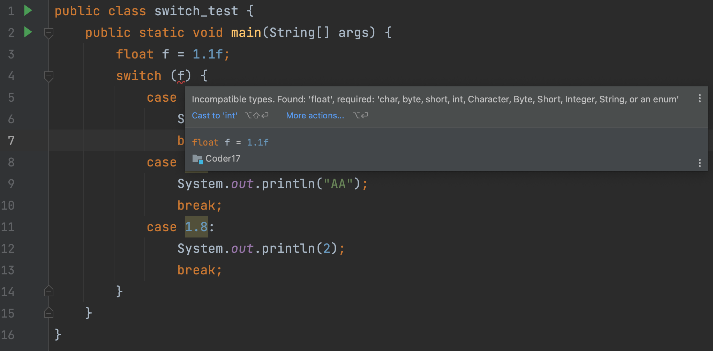

## 0. 目录

- 将阿拉伯数字转换为中文数字
- 使用 switch 语句简化程序
- switch 语法中的 break
- switch 语句语法点总结
## 1. 将阿拉伯数字转换为中文数字

- 使用 if 可以完成，但是略显不够整洁
- 能够根据两个值相比较，进入某个代码块最适合这个情况
```java
public class IfElseNum {
    public static void main(String[] args) {

        int n = 1;

        String ret = n + "对应的汉字是";
        if (n == 0) {
            ret = ret + "零";
        } else if (n == 1) {
            ret = ret + "壹";
        } else if (n == 2) {
            ret = ret + "贰";
        } else if (n == 3) {
            ret = ret + "叁";
        } else if (n == 4) {
            ret = ret + "肆";
        } else if (n == 5) {
            ret = ret + "伍";
        } else if (n == 6) {
            ret = ret + "陆";
        } else if (n == 7) {
            ret = ret + "柒";
        } else if (n == 8) {
            ret = ret + "捌";
        } else if (n == 9) {
            ret = ret + "玖";
        } else {
            System.out.println("错误的值" + n + "。值需要在大于等于1，小于等于9。");
        }

        System.out.println(ret);
    }
}
```
```java
1对应的汉字是壹
```

## 2. 使用 switch 语句简化程序

- switch 语句的语法

```java
switch (用于比较的 int 值){
    case 目标值 1，对应一个 if else(xxx):
        匹配后可以执行的语句
    case 目标值 2，不可以与别的 case 字句重复:
        匹配后可以执行的语句
    default （对应最后的 else，可选:
        default 语句
}
```


- switch 里的 case 子句中也可以有任意合法的语句，比如 if-else，for 循环等
```java
public class IfElseSwitch {
    public static void main(String[] args) {

        int n = 2;

        String ret = n + "对应的汉字是";

        switch (n) {
            case 1:
                ret = ret + "壹";
                break;
            case 2:
                ret = ret + "贰";
                break;
            case 3:
                ret = ret + "叁";
                break;
            case 4:
                ret = ret + "肆";
                break;
            case 5:
                ret = ret + "伍";
                break;
            case 6:
                ret = ret + "陆";
                break;
            case 7:
                ret = ret + "柒";
                break;
            case 8:
                ret = ret + "捌";
                break;
            case 9:
                ret = ret + "玖";
                break;
            default:
                System.out.println("错误的值" + n + "。值需要大于等于1，小于等于9。");
        }
        System.out.println(ret);
    }
}
```
case 不是一个代码块，所以在 switch 里面不能出现重名的变量。这是 switch 比较让人困扰的一个点，switch 中的 case 虽然是不同的 case，但是不能重新重名的变量。——因为，他都在 switch 代码块。

**如果代码中没有 break 会怎么样？**

```java
public class IfElseSwitch {
    public static void main(String[] args) {

        int n = 2;

        String ret = n + "对应的汉字是";

        switch (n) {
            case 1:
                ret = ret + "壹";
//                break;
            case 2:
                ret = ret + "贰";
//                break;
            case 3:
                ret = ret + "叁";
//                break;
            case 4:
                ret = ret + "肆";
//                break;
            case 5:
                ret = ret + "伍";
//                break;
            case 6:
                ret = ret + "陆";
//                break;
            case 7:
                ret = ret + "柒";
//                break;
            case 8:
                ret = ret + "捌";
//                break;
            case 9:
                ret = ret + "玖";
//                break;
            default:
                System.out.println("错误的值" + n + "。值需要大于等于1，小于等于9。");
        }
        System.out.println(ret);
    }
}
```
```java
错误的值2。值需要大于等于1，小于等于9。
2对应的汉字是贰叁肆伍陆柒捌玖
```
这也是 switch 的特点，case 匹配到一个符合的，它就会顺着 case 一直执行。直到遇到 break。
总结：break; 语句"不是必须的"。如果不写，如果一旦 case 相应的值成功，但内部没有 break 语句，那么将会无条件(不再进行 case 匹配)的继续向下执行其它 case 中的语句，直到遇到 break; 语句或者到达 switch 语句结束。
## 3. switch 语法中的 break

- switch 语句如果没有遇到 break，会一直执行下去。
- 如果我们的例子没有 break 会怎么样
- 没有 break 的情况也有用武之地
## 4. switch 语句语法点总结

- switch 语句中用于比较的值，必须是 int 类型「当然，大家对于 switch 支持其它的类型呼声很高，一开始 switch 就是支持 int。这个取决于你用的 java 的版本。」
```java
public class switch_test {
    public static void main(String[] args) {
//        int i = 0;
        String s = "AA";
        switch (s) {
            case "0":
                System.out.println(0);
                break;
            case "AA":
                System.out.println("AA");
                break;
            case "D":
                System.out.println(2);
                break;
        }
    }
}
```


> Incompatible types. Found: "float', required: 'char, byte, short, int, Character, Byte, Short, Integer, String, or an enum'
> 不兼容的类型。Found: "float'， required: 'char, byte, short, int, Character, byte, short, Integer, String，或enum'

- switch 语句适用于有固定多个目标值匹配，然后执行不同的逻辑的情况
- 必须使用 break 语句显示的结束一个 case 子句，否则 switch 语句会从第一个 match 的 case 语句开始执行直到遇到 break 语句或者 switch 语句结束
- default 子句是可选的，如果所有的 case 语句都没有匹配上，才会执行 default 中的代码
- 不能在不同的 case 里，声明相同的变量。这个和你在相同的代码块里，声明相同的变量的结果是一样的。「会报：变量名重复的错误」


欢迎关注我公众号：AI悦创，有更多更好玩的等你发现！

::: details 公众号：AI悦创【二维码】


:::

::: info AI悦创·编程一对一

AI悦创·推出辅导班啦，包括「Python 语言辅导班、C++ 辅导班、java 辅导班、算法/数据结构辅导班、少儿编程、pygame 游戏开发」，全部都是一对一教学：一对一辅导 + 一对一答疑 + 布置作业 + 项目实践等。当然，还有线下线上摄影课程、Photoshop、Premiere 一对一教学、QQ、微信在线，随时响应！微信：Jiabcdefh

C++ 信息奥赛题解，长期更新！长期招收一对一中小学信息奥赛集训，莆田、厦门地区有机会线下上门，其他地区线上。微信：Jiabcdefh

方法一：[QQ](http://wpa.qq.com/msgrd?v=3&uin=1432803776&site=qq&menu=yes)

方法二：微信：Jiabcdefh

:::


