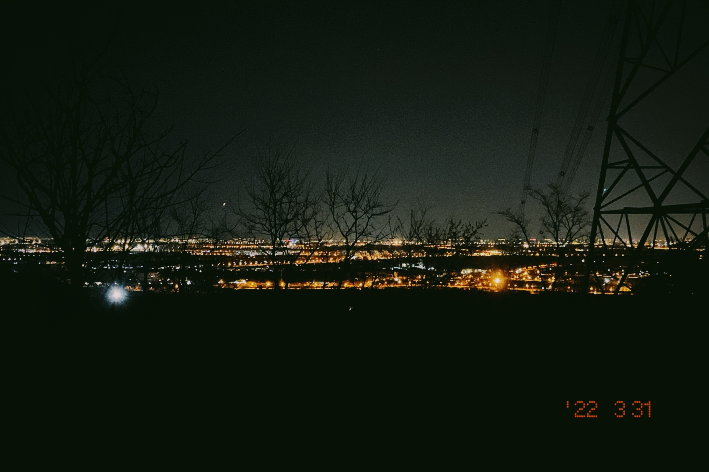
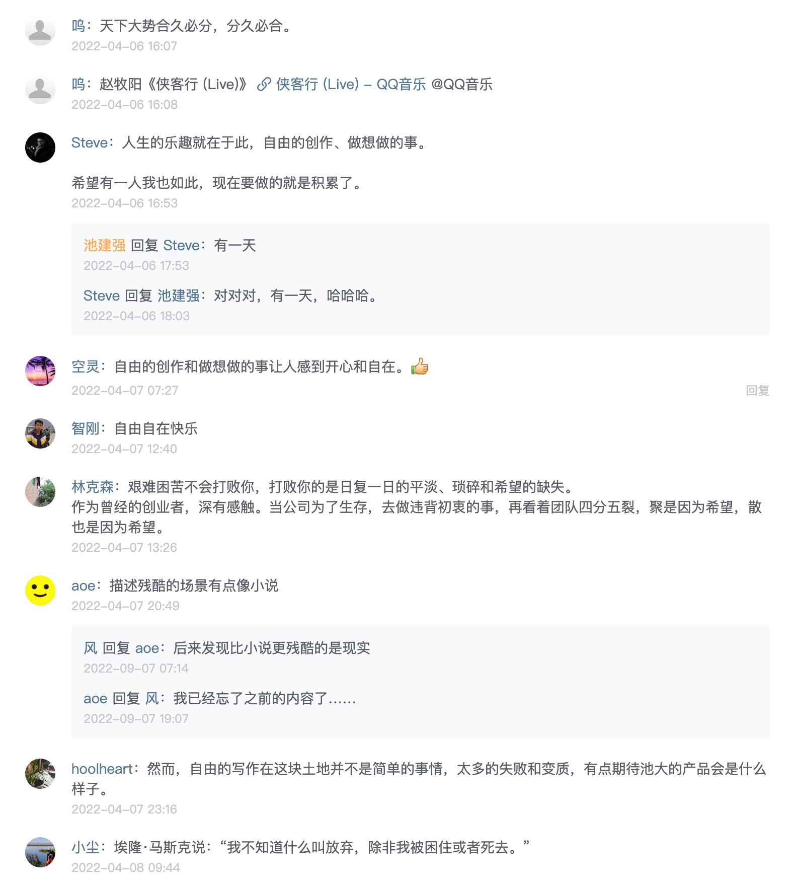
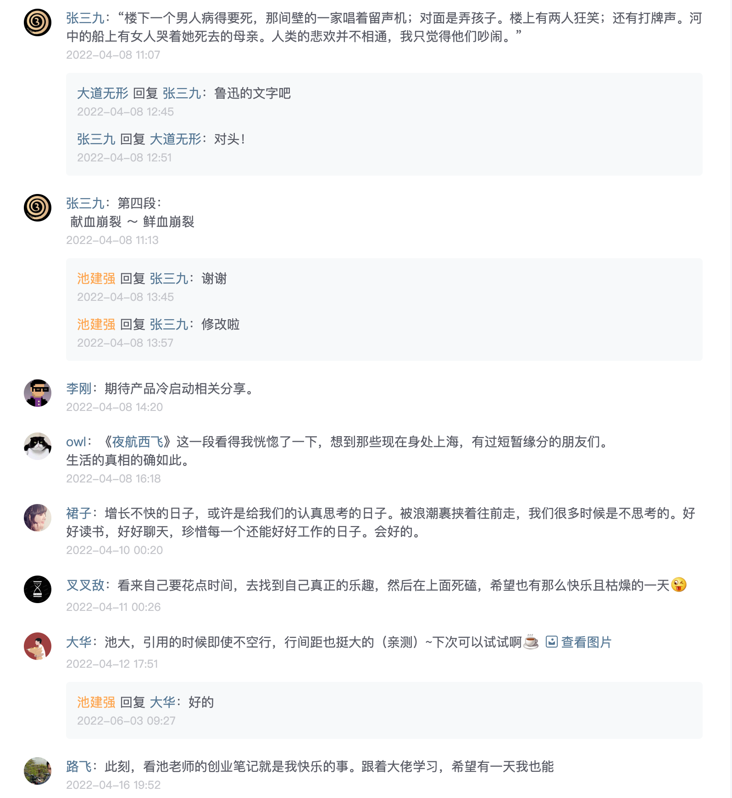

以前创业，创始员工血管里流的都是乌鸡血，以为三两年之后就能披荆斩棘走上人生巅峰，谁打鸡血啊，你就是鸡血。

到了高速成长期，所有的艰难险阻都会成为你向前的动力，比如我的朋友二爷，经常特别嚣张的对所有人说，让困难来的更凶猛一些吧。**在这个增长阶段，大部分问题都会被掩盖。春暖花开，面朝大海。**

---

但是，没有公司能够一直保持高速增长啊，现在，能增长已经很不错了。

冯大辉老师说，**要学会接受不增长的日子。**

**当公司进入这个时期，就需要夯实各种基础，技术、业务、人才等等，踏踏实实卧着，等待下一个一跃而起的机会。这个阶段，可能会出现各种问题，人员滞重，流程繁复，待遇低下，缺乏创意等等，公司的优点也会被说成缺陷。**

---

**艰难困苦不会打倒你，但是日复一日的平淡、琐碎和希望的缺失，会让一部分人心灰意冷，远走他乡。**

创业初期我们总是想象，提刀上马，杀进满天黄沙……但真实的生活并不是这么写意的，它是战场，你会看到兵戎交战，鲜血崩裂，鲜活的人变得一动不动，默默死去。你需要解决的问题繁琐、艰难、吃力，你就像悬挂一块峭壁之外的攀岩者，一手勾住岩石，一手持钢凿，试图在悬崖峭壁上钻出一孔泉眼……这就是普通人的普通生活。

最终一个公司的结局是什么呢？消亡。这时候坚持多久就变得很重要。

能坚持久的公司，一定有自己存在的价值，有创见，有好的创始团队和员工，有社会价值，有用户价值，有投资价值，同样需要默默坚守，需要干脏活累活，需要过朴实无华的生活，且枯燥。

《夜航西飞》的作者柏瑞尔在书中描写非洲的干旱：

> 有一年，恩乔罗地区所有的种子都死了，恩乔罗附近所有农场的情况也一样，无论是低处、山上还是林中的田地，无论大农庄还是仅靠一把犁与一个希望开垦的农田。因为得不到营养，种子都死了，它们绝望地渴盼着雨水。

> 第一天早晨，天空如窗户般明净，第二天早晨依旧如此，接下来的每个早晨也都一样，直到人们不再记得下雨是什么感觉，也不再记得田野看起来是什么样。它们曾绿意盎然，浸润着生命，赤足可踩踏其间。一切都停止了生长，叶片蜷缩，所有生物都背朝太阳。

> 或许在别处 —— 伦敦、孟买、波士顿，某家报纸上写了一个标题：旱情威胁英属东非。或许有人看到了这条新闻，抬起头来看着他头顶的那片天空 —— 就和我们头顶上的这片一样清朗，他可能觉得非洲最边缘的干旱根本算不上新闻。

这就是生活的真相。你觉得平平无奇的，在另一个地域也变得不一样。

那有没有快乐的事呢？当然有，写这篇文章，和用户交流，设计一个产品特性，一次产品发布，都可以给我们带来长久的快乐。

商业上的成功并不足以让我们全情投入，成功人士那么多了，不缺我一个。但自由的创作和做想做的事让人感到开心和自在，人生的乐趣，不就在于此吗？朴实无华的快乐。

## Comment

