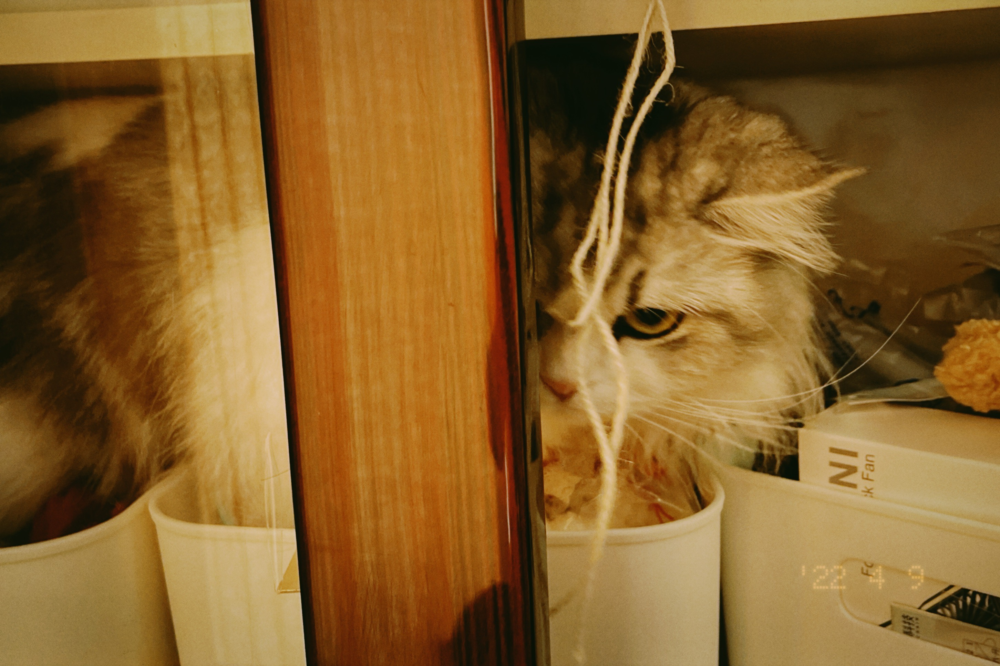
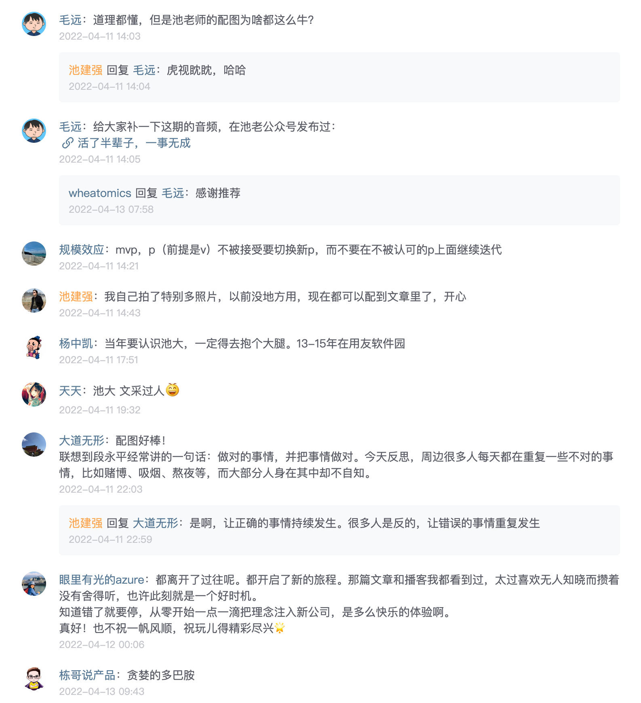
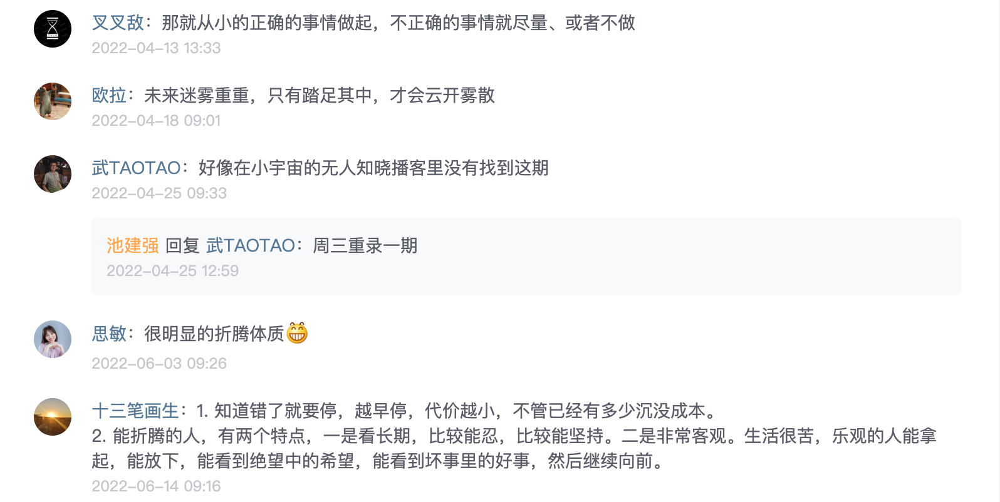

我很喜欢一部电影，叫做「城中大盗」，男主角说过的一句话：You know, people get up everyday, do the same thing, they tell themselves they change their life one day, they never do. I gonna change my life.”

::: tip 摘要

You know, people get up everyday, do the same thing, they tell themselves they change their life one day, they never do. I gonna change my life.

你知道吗，人们每天起床，做着同样的事情，他们告诉自己，有一天要改变生活，但他们从来不付诸行动。

:::

**其实这就是大部分人的生活状态，想去改变，想要做事，想要创业，想总是想的，什么时候干，不知道。也许一辈子都没机会干，这取决于格局、决心和契机。缺一不可～**

契机可能来自一次漫不经心的聊天。2021 年 12 月，我的朋友孟岩老师邀请我做一期播客，节目里和节目外，聊了很多创业相关的事情，聊起他和上一家公司的合伙人之间的故事，合作、冲突，包括如何离开自己亲手创建的且慢。他说，我从段永平身上学到重要的一点就是，**知道错了就要停，越早停，代价越小，不管已经有多少沉没成本。**「及时止损」

当年孟岩创建有知有行的时候，张潇雨对他说，孟岩: **你可以从 0 开始一点一滴把自己的理念注入到新公司，这是多么开心的体验。**

彼时我也在思考极客时间的定位。这是我主导研发并运营推广的第一款商业产品，我对极客时间倾注了太多的心血，五年以后，当年的种子已经长成了树苗，业务范围扩大了，公司对极客时间的定位，和我的想法，也会有分歧，包括战略、策略，服务人群等等，那时候我就有一个强烈的想法，把极客时间交给公司的其他同事做，继续生长，自己去做一些更有意思的事情。

录播课的过程也很有意思，耗时一个多小时。录完之后，孟岩说，特别好。过了几天，告诉我，不够好。我不知道是我不好还是他不好，总之得重录。我听了之后，感觉还蛮有意思的，不想浪费，就发在了自己的公众号上。

这段音频讲的是两个七零后的成长和交汇。聊了很多我自己的经历，从洪恩到用友，从锤子到极客时间，从编程到写作，再到产品，从亏钱到赚钱，孟岩还给我总结了一下：

池老师你看，你本来学习很好，然后报了两个错误志愿，大学掉到了第三志愿里。然后是工作，到了顺义的一个工厂擦散热器，每天下班儿之后扛着硬盘来学习，然后去了洪恩，跟着池宇峰做了很多产品，对，就在人家要成功的前夜走了，离开了，对吧，人家让你回去，你还没回去。

然后去了用友软件工程，在中国 C 端互联网飞速发展的时候，你在一个企业级的公司里面慢慢养老，对吧，后来觉得不甘心，然后去了锤子，风口浪尖上的公司，在那儿经历了很多东西。四十多岁开始创业做产品。之前积累了一些财富，然后又通过不正确的投资亏掉了一些。

是不是很传奇？

最后，孟老师给我推荐了一本书《贪婪的多巴胺》，书里讲，**很多创业类型的人，或者说能折腾的人，他们的体内的多巴胺远超于其他人的平均水平。** 

这样的人有两种特点：

- 第一种特点是看长期，就是比较能忍，比较能坚持。
- 第二个特点呢，就是非常乐观。生活很苦，乐观的人能拿起，能放下，能看到绝望中的希望，能看到坏事里的好事，然后继续向前。

孟岩说：你今天表现出来的特质，就是这样一种人。

和他聊完我想起了《夜航西飞》里的一段话，打动人心：

> 我学会了：如果你必须离开一个地方，一个你曾经住过、爱过、深埋着所有过往的地方，无论以何种方式离开，都不要慢慢离开，要尽你所能决绝地离开，永远不要回头，也永远不要相信过去的时光才更好，因为它们已经消亡。**过去的岁月看来安全无害，能被轻易跨越，而未来藏在迷雾之中，隔着距离，看来叫人胆怯。但当你踏足其中，就会云开雾散。** 我学会了这一点，但就像所有人一样，待到学会，为时太晚。

::: info 回顾

其实无论公司也好，人也好，都需要往前走，未来迷雾重重，只要踏足其中，就会云开雾散。

:::

## Note

:::: tabs

@tab 摘要1

You know, people get up everyday, do the same thing, they tell themselves they change their life one day, they never do. I gonna change my life.

你知道吗，人们每天起床，做着同样的事情，他们告诉自己，有一天要改变生活，但他们从来不付诸行动。

@tab 摘要2

其实这就是大部分人的生活状态，想去改变，想要做事，想要创业，想总是想的，什么时候干，不知道。也许一辈子都没机会干，这取决于格局、决心和契机。缺一不可～

@tab 摘要3

知道错了就要停，越早停，代价越小，不管已经有多少沉没成本。

@tab 摘要4

你可以从 0 开始一点一滴把自己的理念注入到新公司，这是多么开心的体验。

@tab 摘要5

很多创业类型的人，或者说能折腾的人，他们的体内的多巴胺远超于其他人的平均水平。

@tab 两种人

这样的人有两种特点：

- 第一种特点是看长期，就是比较能忍，比较能坚持。
- 第二个特点呢，就是非常乐观。生活很苦，乐观的人能拿起，能放下，能看到绝望中的希望，能看到坏事里的好事，然后继续向前。

@tab 打动人心

过去的岁月看来安全无害，能被轻易跨越，而未来藏在迷雾之中，隔着距离，看来叫人胆怯。但当你踏足其中，就会云开雾散。

::::

## Comment

[https://mp.weixin.qq.com/s/IsrqWT7R48WnA6lSdhMc0Q](https://mp.weixin.qq.com/s/IsrqWT7R48WnA6lSdhMc0Q)

<VidStack src="/mp3/墨问东西/创业手记/活了半辈子，一事无成.mp3" title="活了半辈子，一事无成" />
