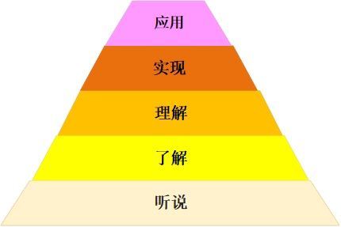
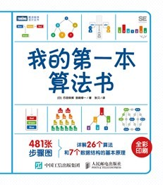
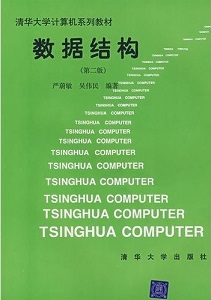

## 1. 学习算法和编程的用处

学习算法和编程，到底有什么用？就目前而言，大致有如下几种用处：

### 1.1 是入行程序员的基本技能

这一点不用说了，程序员的日常工作就是编程，程序员面试考的就是算法。要想成为程序员，编程+算法是最最基础要学习的东西。

### 1.2 了解计算机技术和程序员思维的捷径

在互联网公司，有些岗位，虽然自己不需要编程，却总是难免要和程序员打交道，最典型的例如：产品经理。

这样的角色，如果对计算机技术和程序员的思维方式缺乏最根本的了解，日常工作也就无法进行了。学习基础编程和算法则是对这两者有所了解的最快途径。

### 1.3 非技术岗位员工可以用来解决日常问题

不过随着计算机硬件的普及，编程语言和软件工程的不断发展，各类教育资源的普及化和多样化（例如知识付费的出现），编程这件事情已经变得越来越触手可及了。

大多数人都能通过写代码解决部分工作生活中遇到的问题的情形，已然成为可能。

特别是 Python 这种拥有大量支持库的语言，各种各样的功能都已经被封装成库函数，只要具备最基本的编码能力，会调库函数，写爬虫、处理数据、做数据分析都很方便。而这些，已经成为越来越多注入市场、运营类职位的必须。

另：随着人工智能技术的发展，大量通用模型被封装成基础服务，可以用过调用远程接口使用。会写代码，了解最基础的原理，就可以拥抱人工智能，开发AI产品了！听起来是不是双眼一亮觉得很赞！

### 1.4 锻炼思维能力，提升逻辑能力

就算不打算写代码，学习算法也是一种对思维能力的绝佳训练。

算法的两大要素：

- 控制流程描绘事物发生发展的过程；
- 数据结构对事物组织的形式高度抽象。

这都是逻辑思维的最基础。算法的学习过程相当于一种思维体操，可以有效锻炼我们“思维的肌肉”。让你的大脑灵活的运转过来。

### 1.5 与 K12 教育接轨

2017 年，国务院发布《新一代人工智能发展规划》，明确指出在中小学阶段设置人工智能相关课程，逐步推广编程教育。

浙江省已经在尝试将编程纳入高考体系。虽然离全面覆盖为时尚早，但编程、算法正在逐步渗入 K12 教育已经明确为大势所趋。

一则，咱们大学都毕业了，总不能连中小学生会的都不会吧。再则，大家就算不是为了自己，为将来的儿女着想，也该自学点编程。要不然到时候，怎么跟自己的儿女有共同话题呢！

## 2. 掌握算法的五个层次

不同的人对某一事物了解、掌握的程度是不同的，同一个人在不同时期对同一事物的了解和掌握也很可能是不同的。

对于算法的掌握，大致可以分为5个层次（见下图）：

这五个层次所对应的程度如下（其中涉及到一些专业名词和术语，这些在今后的章节里都会讲解，此处先知道一下）：

**Level-1 听说**：

- 知道算法名
- 知道算法功能

**Level-2 了解**：

- 知道算法原理（自然语言描述）
- 知道算法优缺点

**Level-3 理解**：

- 知道算法的过程和细节
- 能够描述算法的控制流程和数据结构
- 知道算法的时空复杂度

**Level-4 实现**：

- 能够用编程语言编写出无逻辑错误的算法

**Level-5 应用**：

- 能够应用算法解决实际问题

这五个层次，自上而下，由浅入深。

## 3. 对应不同层次的讲解方法

现在讲解算法的书籍层出不穷，大家到任何一家网上书店或者卖书的电商网站，输入“算法”两个字，都能搜出几十页的书籍列表。但是不同的书，讲解的深度是不同的。

我们前面介绍过的《编程的艺术》和《算法导论》从内容上详细剖析了算法细节及其背后的数学属性，如果真的能够学通学透，应该可以达到 Level-4 的水平。

Level-4 也是纸上谈兵的最高境界——真的到现实中去运用，将理论知识转化为实践经验，就不是仅仅依靠书本可以做到的了。必须要实践！

现在有不少看起来很 Cute 的算法书，里面有很多插图、漫画，多了许多亲和力，比如这本现在就很火：

其中介绍了 26 个算法，绝大部分描述是用图来表示的，确实简洁易懂。

不过，正因为全部都是直观描述，实际上，只是介绍了算法原理，并没有严格的流程和细节。对应 Level-1 和 Level-2 的程度，另有部分 Level-3 层面的介绍（例如时间复杂度），但作为编程的依据恐怕就不够了。

当然，这本《我的第一本算法书》应该说是算法书中的特例，其他很多虽然图画很萌很 Q 的书，也是描述了算法细节的。

不同算法书，各有侧重。还有些书籍名称虽然不含有“算法”两个字，但其实主要内容讲得也是算法。比如这本：

这本书是作者上学时专业课的课本，那门专业课的名称就叫做“数据结构”，不过大部分内容讲的是经典算法。

## 4. 算法驱动编程

市面上的书都已经那么多了，那么本课程又有什么不同之处呢？

第一，本课所讲授的算法数量，比任何一本书里介绍的算法数量都要少！仅限最最基础的部分：顺序查找、二分查找、选择排序、冒泡排序、插入排序和快速排序。

第二，本课所讲授的每一个算法都已经到达细节阶段，真的学会的话一定可以编写出正确的实现算法的程序，是不是期待的搓搓手（Level-4）。

第三，本课预先不要求任何编程基础，我们是编程和算法一起学的。我们是以算法来驱动编程的！

算法少而程度深，是希望大家立足于最最最基础，打捞基础，才有往后走的可能性“不怕千招会，就怕一招熟” —— 吃透 6 个算法，达到别人一提名字就完全凭空写出代码的程度；相较于能将几十个算法作为谈资，但却一个都写不出来，无论是对于职业发展还是脑力锻炼，显然都是前者对大家更有帮助。

以算法驱动编程，就是说我们会沿着Level-1到Level-4的顺序，在介绍一个算法的时候，先讲一下它是做什么用的，有什么优缺点，原理是什么（怎么能够达到目标功效的），然后再通过画流程图、写程序代码的方式展现算法的全部细节。

在学习算法细节的过程中，自然而然地接触编程语言和程序编写，和算法同步学习编程语言语法、词法等。

## 5. 算法的难点：从原理到实现

如果以后反正不想编程，就算要学算法，是不是只要会用自然语言描述就可以了？不用写成代码了吧？

的确，算法本身是一个方法，它可以用自然语言直观地描述（Level-2），也可以用编程语言来形式化地表达（Level-4）。然而，即使所指向的标的相同，不同的表达方式所揭露的深度和难度却大有不同。

因此，我认为：**就算是仅仅为了把算法学清楚，也有必要写代码**。

本课只介绍六个算法，整体都比较简单。特别是第一个顺序查找，如果单看原理，简直简单得不像话！大家可能会觉得：这也配叫算法？即使到了本课最后一个算法快速排序，仅仅论及原理，一句话就能讲完。

不要说本课讲的这些，就是很多非常复杂高效的算法，只是简单概括原理，也不过就是一句话——自然语言的概括性也正体现于此。

可是就是看起来这么简单，其运作原理可以用自然语言一言以蔽之的算法，等到真的用编程语言写出来，我怕大家会觉得不认识了——这几行字符是什么意思？这是快速排序吗？它们在干什么呀？

**算法的难点**恰恰在于：如何从概括性的原理，转换为与具体数据结构结合可以一步步实施并直接对应为计算机指令的控制流程。

这一难点，正是本课的核心所在！

对每个算法，我们不仅**（1）要讲抽象原理**，还要**（2）将其拆解成数据结构+控制流程**，**（3）详细推演整个运行过程的细节，**再**（4）将整个流程写成代码**，然后**（5）在运行环境中执行**。

为了能够完成对所学算法的形式化表达，我们会：

- 先学习纯粹理论层面的控制流程和数据结构知识，不涉及编程。
- 之后简单了解一下编程语言，和Python编程的一点点内容。
- 然后再按照我们规划的六个算法，一边学算法一边学编程。

让我们一起加油吧～学会这些，你就不是小白啦，只有打牢基础，才能向大牛进发！

欢迎关注我公众号：AI悦创，有更多更好玩的等你发现！

::: details 公众号：AI悦创【二维码】

:::

::: info AI悦创·编程一对一

AI悦创·推出辅导班啦，包括「Python 语言辅导班、C++ 辅导班、java 辅导班、算法/数据结构辅导班、少儿编程、pygame 游戏开发」，全部都是一对一教学：一对一辅导 + 一对一答疑 + 布置作业 + 项目实践等。当然，还有线下线上摄影课程、Photoshop、Premiere 一对一教学、QQ、微信在线，随时响应！微信：Jiabcdefh

C++ 信息奥赛题解，长期更新！长期招收一对一中小学信息奥赛集训，莆田、厦门地区有机会线下上门，其他地区线上。微信：Jiabcdefh

方法一：[QQ](http://wpa.qq.com/msgrd?v=3&uin=1432803776&site=qq&menu=yes)

方法二：微信：Jiabcdefh

:::

