在我们计算机领域，控制流程的定义就是程序中陈述、指令或函数调用的执行历程。听起来是不是有点抽象？

其实，我们可以从一个更广域的角度去理解，控制流程——控制流程就是步骤和过程，在我们的日常生活中处处都有控制流程，看了你就能秒懂了！

## 1. 顺序

### 1.1 逐步完成一件事

我们要烤一个蛋糕。于是上网搜索到下面这个配方——

> **原料**：鸡蛋，糖，面粉，黄油，牛奶
>
> **步骤**：
>
> 1. 称量出4个鸡蛋，60g糖，90g面粉，50g黄油和60g牛奶
>
> 2. 把蛋清和蛋黄分开
>
> 3. 用打蛋器打5分钟蛋清，把蛋清打发成泡沫
>
> 4. 把蛋黄和其他原料放到一起搅拌成蛋黄糊
>
> 5. 把蛋黄糊和蛋清泡沫放到一起搅拌成蛋糕坯
>
> 6. 把蛋糕坯放到蛋糕模具中用烤箱在150度烤40分钟
>
> **成品**：戚风蛋糕

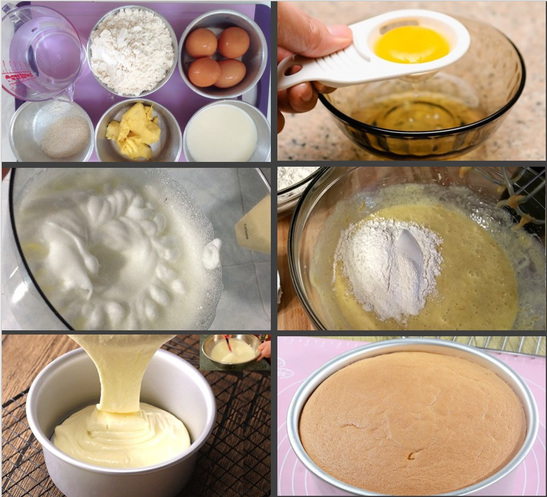

是不是看到这里口水都流下来，其实啊，这个配方其实就是一个广义的算法。它的目标明确：就是解决“如何烤一个蛋糕”的问题。输入是各种原料，输出是戚风蛋糕，流程则是1-6这些步骤。

怎么样，做蛋糕的工序是不是能够让你轻松掌握这个定义！

为了让大家看得更清楚一些，我们且尝试用图表来展示输入、输出及操作过程：

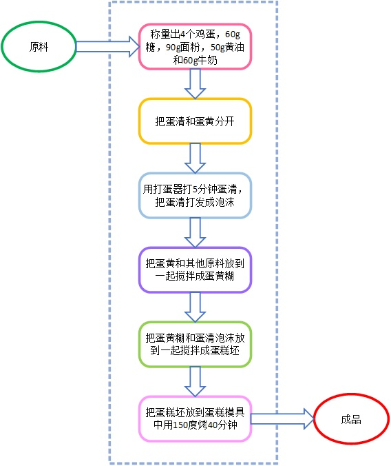

中间的虚线框可以被看做一个“黑盒”，我们把原料输入进去，里面自上而下经过一道“流水线”操作，形成成品输出出来。

### 1.2 顺序结构

我们只看上节图中虚线框里面的内容，会发现里面正好是文字版中的1-6六个步骤。

这些步骤是一个接着一个顺序进行的——这也是控制流程的三种基本结构里最简单的一种：顺序 （Sequence） 结构。

在生活中，无论是哪种类型事物的发生发展过程，顺序结构都是最为常见的。

为了方便表达，我们用下面这样的图来表示顺序结构：

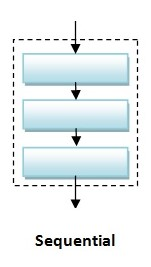

其中每一个矩形框都表示一个确定的步骤（一个任务）。

## 2. 条件（分支）

有些时候，一件事的发展并不是完全确定的，很可能要在某个步骤上，根据某种具体的条件进行判断，要么这样，要么那样。

### 2.1 流程变更

延续上面做蛋糕的例子我们来看这个——

> 我们本来按照配方打算制作戚风蛋糕，可是在进行分离蛋清和蛋黄的操作的时候出现了一点失误，把蛋黄掉到蛋清里面去了！

一旦蛋清里混合了蛋黄，就无法成功打发成蛋清泡沫了。如果我们继续按照上面的顺序步骤操作，结果就是蛋清打发幅度变小，和蛋黄糊混合后无力支撑蛋黄糊，烤出来的面团就会皱缩得根本成不了蛋糕。

这种情况下，也不是不能补救，我们干脆把蛋清和蛋黄混在一起打发：

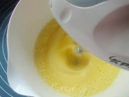

再和入面粉，这样烤出来的也是蛋糕，不过就变成海绵蛋糕了而已：

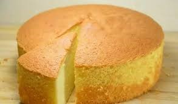

### 2.2 分成两路的菜谱

分离蛋清蛋黄的时候，没操作好是经常会发生的事情。不如我们在配方里直接告诉操作者，万一分离鸡蛋的时候出错，也别把鸡蛋浪费了，直接就改做海绵蛋糕好了。

当然，我们还是可以用文字来描述：

> **原料**：鸡蛋，糖，面粉，黄油，牛奶
>
> **步骤**：
>
> 1.称量出4个鸡蛋，60g糖，90g面粉，50g黄油和60g牛奶
>
> 2.把蛋清和蛋黄分开 ——
>
> 如果能够正确分离开就到步骤3-Y，否则到步骤3-N
>
> 3-Y. 用打蛋器打5分钟蛋清，把蛋清打发成泡沫
> 4-Y. 把蛋黄和其他原料放到一起搅拌成蛋黄糊
> 5-Y. 把蛋黄糊和蛋清泡沫放到一起搅拌成蛋糕坯
> 6-Y. 把蛋糕坯放到蛋糕模具中用烤箱在150度烤40分钟
>
> **成品**：戚风蛋糕
>
> 3-N. 用打蛋器打10分钟蛋清蛋黄混合液，达成混合泡沫
> 4-N. 把其他原料放到混合泡沫里搅拌成蛋糕坯
> 5-N. 把蛋糕坯放到蛋糕模具中，用160度烤30分钟
>
> **成品**：海绵蛋糕

这样固然也可以表达清楚，但总有些不太直观，不如还是用图表示，比如下面这样：

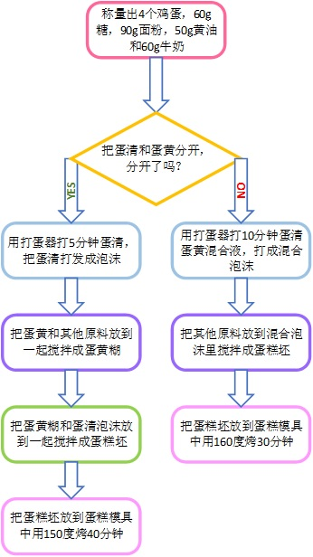

### 2.3 条件（分支）结构

根据某一个条件成立与否将后续结果分为不同分支的流程结构，叫做条件（Condition）结构，也称为分支（Branch）结构。我们用下图来表示：

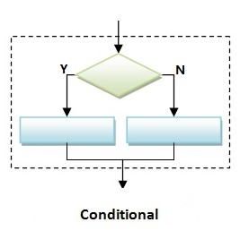

> 小贴士：其中的菱形框内填写条件，矩形框仍然和顺序结构含义相同。

有的时候，我们只关心条件成立的情况，如果这个条件成立，我们就做一些事情，否则就什么都不做。这种情况下，也可以画成这样：

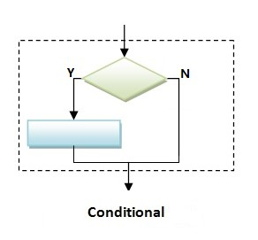

## 3. 循环（迭代）

### 3.1 重复同一操作

还是做蛋糕的例子：

> 如果我们要做出蓬松可口的戚风蛋糕，光是正确分离蛋清蛋黄还是不够的，分离出来的蛋清要被充分打发才可以。

在之前的流程中，我们简单的要求“用打蛋器打5分钟蛋清”。虽然在大多数情况下，这样做能够达到“打发”的效果，但毕竟在现实中，因为打蛋器转速不同，鸡蛋的质量和大小不同，简单地搅打5分钟，可能导致有时打发不够，有时打发过度。

怎么能够保证蛋清打发合适呢？我们可以把下面这步拿出来，单独拆解开来看。

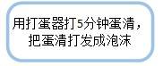

换一种打发方式，具体**操作方法**是：用打蛋器打一会儿，就停下来看看，还没打发就继续打，打到发起来为止。

这个过程，用图描述如下：

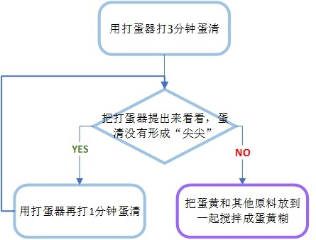

首先判断当前是否满足了某个条件，如果是，则进行“用打蛋器打1分钟蛋清”的操作，完成这一操作之后再去判断一下是否满足条件，如果仍然是，重复“打1分钟”的操作，如此若干次，直到不再符合判断条件为止。

### 3.2 循环（迭代）结构

这个不断重复的流程结构就叫做循环（Loop）结构，也叫做迭代（Iteration）结构。对应的图形如下：

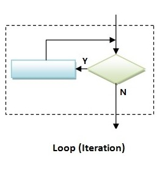

上图整个结构叫做循环，绿色菱形框内装的是循环条件；而蓝色矩形框内装的则是循环体。

> 小贴士：虽然这里的循环体只有一个框，但并不代表只能有一个操作，上面的条件结构也是如此。这一点，在之后结构的嵌套中会详细讲解。

循环体从头到尾的一次执行过程叫做**一次循环**。**循环的次数**可以很多，只要循环条件被满足，循环体就会被不断重复执行，重复几千几万次，甚至几百万几千万次，只要是**有限次数**，就都没有问题。

在这里我们强调**循环的次数必须是有限的**。如果一个循环一旦开始执行就会永远不停地执行下去，那就叫做**无限循环**。

根据之前算法的定义，算法的操作步骤必须是有限的，因此，算法的控制流程中是不可以出现无限循环的，一旦出现了，就叫做**死循环**，是一种非常严重的逻辑错误。

循环结构有不同的变种。上面给出的结构又可以被叫做 **while 循环**，是最常见的一种，因为在大多数编程语言里，实现此种循环都要用到 while 语句，因此而得名。它的特点是在进入循环体之前先判断条件。

另有一种循环叫做 **repeat 循环**（也可以叫 do…while 循环），它的特点是无论如何先执行一次循环体，然后再判断条件，看接下来是否重复执行。

还有一种循环叫做 **for 循环**，它的特点是重复执行固定次数。

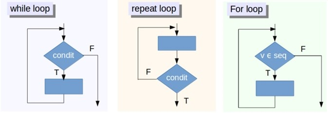

这几种循环，虽然细节上有所不同，但其实是完全**可以相互转化**的，用 while 循环来达到 repeat 或者 for 循环的效果都没有问题，恭喜大家一下子就 get 了这么多流程结构！

欢迎关注我公众号：AI悦创，有更多更好玩的等你发现！

::: details 公众号：AI悦创【二维码】

:::

::: info AI悦创·编程一对一

AI悦创·推出辅导班啦，包括「Python 语言辅导班、C++ 辅导班、java 辅导班、算法/数据结构辅导班、少儿编程、pygame 游戏开发」，全部都是一对一教学：一对一辅导 + 一对一答疑 + 布置作业 + 项目实践等。当然，还有线下线上摄影课程、Photoshop、Premiere 一对一教学、QQ、微信在线，随时响应！微信：Jiabcdefh

C++ 信息奥赛题解，长期更新！长期招收一对一中小学信息奥赛集训，莆田、厦门地区有机会线下上门，其他地区线上。微信：Jiabcdefh

方法一：[QQ](http://wpa.qq.com/msgrd?v=3&uin=1432803776&site=qq&menu=yes)

方法二：微信：Jiabcdefh

:::

