## 1. 什么是流程图？

流程图（Flow Chart）是一种表示算法或工作流的框图。它用不同类型的框代表不同种类的步骤，每两个步骤之间则以箭头连接。我们正在讲的控制流程，就可以用流程图来表示噢。

流程图有一套相对复杂的符号系统，比如下图这样：

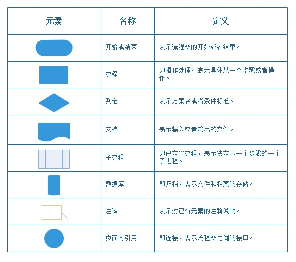

不同机构或组织对于流程图符号系统的定义也有所不同，有些流程图元素相当复杂，比如下例：

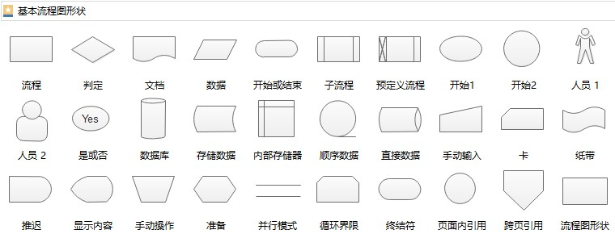

## 2. 极简版流程图符号表

鉴于本门课所需要描述的算法过程十分简单基础，流程图只是我们辅助了解算法的工具，所以呀，我们没必要在工具上付出太多时间。

我们仅取一般流程图的一个子集，作为极简版流程图使用就够了。

上一章我们通过例子了解了控制流程的三种基本结构，并用图表的方式展示了这三种结构：

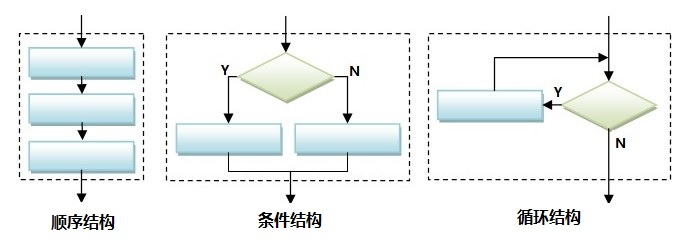

把这几个图中的基本元素拆解出来，则是如下这样：

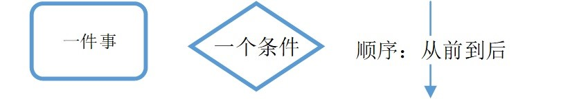

这就能组合出顺序、条件和循环结构啦——我们的极简版流程图，只有这三个符号就可以啦！

当然，个别时候我们可能特别需要标识出一个完整流程的起始，遇到如此情形，我们用下面图形表示算法的开始和结束：

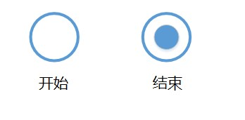

不过大多数情况下，只用三个基本符号的组合，从上到下表示一个算法的整体流程，就可以了。

## 3. 最简单的流程图

上一节我们讲的极简版流程图是希望构建流程的基本符号体系尽量简单，基本符号的数量尽量少。

那么，当我们绘制流程图的时候，最简单的流程图会是什么样子呢？

有没有可能一个基本符号都不用？显然不可能。如果一片空白，怎么能叫流程图呢？

那有没有可能一幅流程图里只有唯一的一个基本符号？这种情况可能吗？这是可能的。

那么，在这样一副流程图里，唯一出现的那个符号是什么呢？很显然，是矩形框。因为除了矩形框，其他的要素都不能独立存在。

如果一个条件没有因为其成立与否导致后续的差别，这个条件本身也就不存在了。如果图中没有事件或条件，箭头也没有可连接的东西。因此，只有一个事件（或者操作），才能够独立存在构成流程图。

比如我们有一个流程总共就做一件事：打鸡蛋，那么这个流程图就可以画成这样：

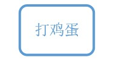

或者这样：

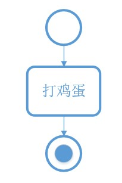

当然，为了省事，只要不影响理解，我们就省略开始和结束符号了。

## 4. 流程图的粒度与嵌套

### 4.1 粒度

一个矩形框，只能表示一件事，那么是不是说只有一个矩形框的流程图只能表达非常简单、短促的过程呢？

未必。因为“一件事”本身就是一个抽象概念，这件事可以很小也可以很大，比如下面也是一个流程图：

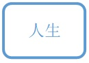

虽然只有一个矩形框，却可以用来表示一个人的一生。

当然，用一个“人生”框来描述一个人的一生，是一种非常抽象的概括。换言之就是描述的粒度很粗。

如果都用这样粗粒度的描述，那人与人之间也就没有什么区别了。更多的时候，我们需要更细化一些的表述。

下图就细化了不少，其中每一个矩形框的粒度，相对于“人生”框都变小了。

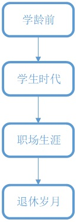

上面的图可以继续细化，使得每一个步骤的粒度更小。因为进一步细化会导致图形复杂度增加，我们在此处仅取上图中第二个矩形框——“学生时代”来做细化：

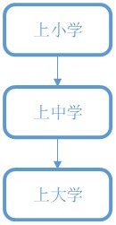

我们把上述两个细化步骤展开来看，就变成了这样：

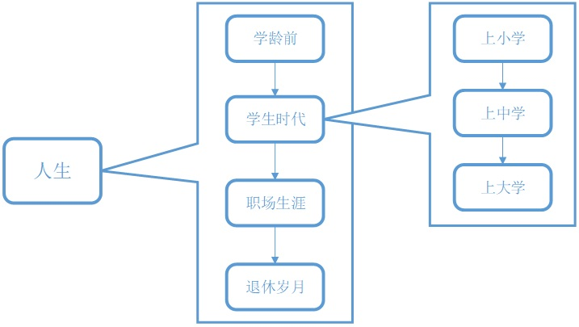

“人生”，“学生时代”和“上小学”虽然都是用一个矩形框来表达的，但各自的**粒度**却很不同。

### 4.2 嵌套

既然“学生时代”这个步骤又可以展开成一个流程图，那么我们完全可以把新的流程图放到之前的图里，代替“学生时代”框，就像下面这样：

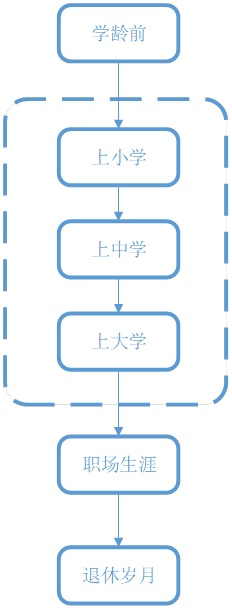

这就是流程图的嵌套。

简单来说，任何一个流程图中的一个步骤（矩形框）都有可能被一个新的流程取代，用一个粒度更细的流程图来取代原本一个独立的步骤，就叫做流程图的**嵌套**。

虽然上面这个例子用来替代原有步骤的流程图是一个顺序结构，但实际上并非只有顺序结构才能够用来作为嵌套进原图的子图，任何一种结构都可以。

## 5. 条件结构和循环结构的嵌入

上面顺序结构的学生时代比较适合用来描述一个人已经经历过的学生时代。如果我们想用一个流程图来表达一个人的人生规划，而不是过往经历的总结，那么只用顺序结构就不太够用了。

以学生时代的细化为例：

> 上小学和上中学基本是顺理成章的，但上大学是要经过高考选拔的。如果一个人还没有上大学，那么 TA 并不能保证自己一定能上大学。

TA 在规划人生的时候需要将高考失败考虑进去，那么可以将人生规划改写成如此：

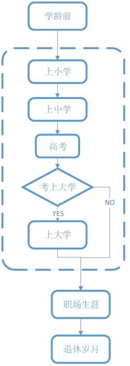

但是如果这位同学比较倔强，不肯为一次高考失利就结束学生生涯，那么 TA 的学生生涯也可以是这样的：

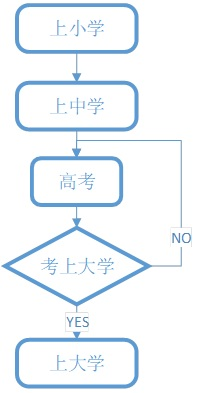

条件结构变成了循环结构。如果考不上大学就一直考下去。

这样做虽然有志气，但是不一定是个理智的决定。如果高考持续失利的话，上图中的循环结构就成了一个死循环了！（虽然实际上如果真肯努力高考也并不是很难，但毕竟理论上存在死循环的可能。）

而且，就算不陷入死循环，为了上个大学消耗十年八年在考试上也实在没有必要。

那不如我们再设定一个条件：高考最多考3次，再考不上，就不继续上学了。本着这个念头，学生时代流程图就变成了下面这样：

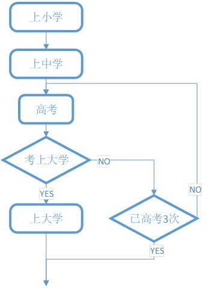

将这个两重嵌套的结构放回到原图中，就变成了下面这个样子：

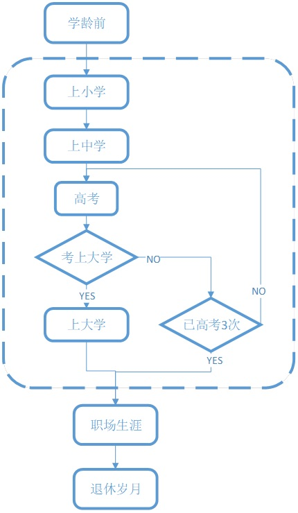

上面这个例子中，不同步骤的粒度大小差别巨大，人生的大多数阶段都一笔带过，关于计划的部分仅仅体现在了考大学一件事情上，这样一张图用来作为人生规划显然是不够的。它只是用来解释不同的粒度的步骤和控制结构的嵌套关系而已。

在实际应用中，当我们用到流程图的时候，一般会让各步骤的粒度近似。从头至尾每一部分可能有条件或者循环结构的地方都尽量表达出来。

## 6. 粒度均衡的流程图

我们还是回到做蛋糕的例子。现在我们已经学习了不同的结构和它们的连接与嵌套，那么我们就可以用流程图来描述做蛋糕的全过程了：

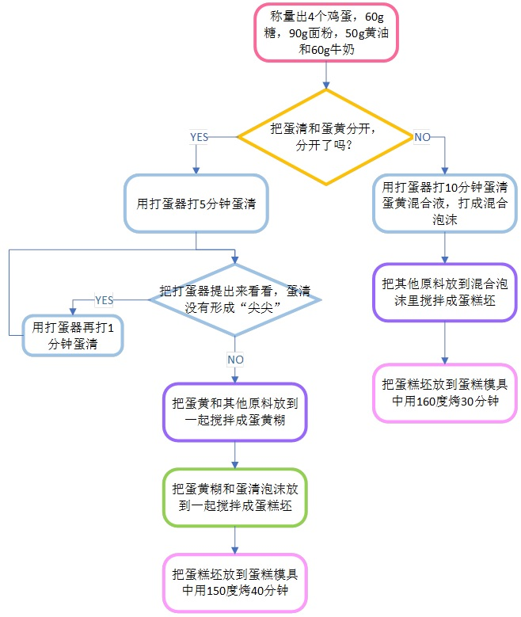

但是要注意，即使仅仅是一个描述烤蛋糕的流程图，其实也可以有不同粒度的表达方式。

比如：

> 我现在不太关心具体用多少克原料，搅打几分钟，烘烤多少度。
>
> 而只关心分离蛋清蛋黄的步骤，一旦分不好就要换一种制作方法，后续的步骤会有所不同。

那么上面的许多细节都可以被忽略掉，我们的图也可以退化成下面这样：

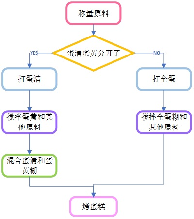

总之，流程图是一种表达的工具，我们用它来描述我们想要告知他人的内容。

就好像用语言述说同一件事因时因地因对象不同会有重点详略不同一样，描述同一个算法/过程的流程图也并非唯一的。

欢迎关注我公众号：AI悦创，有更多更好玩的等你发现！

::: details 公众号：AI悦创【二维码】

:::

::: info AI悦创·编程一对一

AI悦创·推出辅导班啦，包括「Python 语言辅导班、C++ 辅导班、java 辅导班、算法/数据结构辅导班、少儿编程、pygame 游戏开发」，全部都是一对一教学：一对一辅导 + 一对一答疑 + 布置作业 + 项目实践等。当然，还有线下线上摄影课程、Photoshop、Premiere 一对一教学、QQ、微信在线，随时响应！微信：Jiabcdefh

C++ 信息奥赛题解，长期更新！长期招收一对一中小学信息奥赛集训，莆田、厦门地区有机会线下上门，其他地区线上。微信：Jiabcdefh

方法一：[QQ](http://wpa.qq.com/msgrd?v=3&uin=1432803776&site=qq&menu=yes)

方法二：微信：Jiabcdefh

:::

