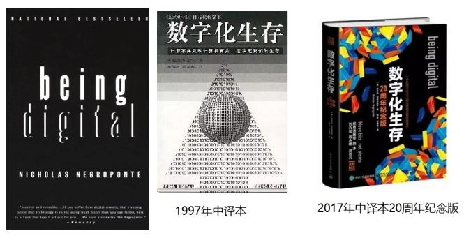

## 1. 数字化

现实世界由万事万物构成，而计算机能够处理，只有数据。说得更直接一点，计算机能够处理的其实都是数字。因此，当我们用计算机来协助处理日常事物的时候，首先要做的一件事就是数字化。

虽然在实践中，通常存储在计算机存储设备上的数字化数据是二进制形式的。但严格来说，任何把模拟源转换为任意类型数字格式的过程，都可以叫做数字化。

**数字化指将信息转换成数字格式的过程**。具体而言，就是把一个物体，图像，声音，文本或者信号转换为一系列数字的集合：

- 一张图片的数字化是将其被分割成若干的像素，每个像素用R（red，红色）G（green，绿色）B（blue，蓝色）三种颜色分量对应的三个0-255的值来表示；
- 一段声音的数字化则是将记录下来的模拟声波经由傅里叶变换转化为若干三角函数的叠加；
- 文字的数字化是针对不同字符体系进行编码，将某一字符转化为一个特定的数字“号码”；
- ……

## 2. 数字化生存

曾经，20多年前，“数字化”一词就像前几年的“云计算”、“大数据”和这两年的“人工智能”一样，是一个火爆媒体的热词。

那个时候还没有自媒体的概念，但“数字化”铺天盖地而来，覆盖了从书籍、期刊、报刊到广播电视的一切媒体形式。

1995年，MIT教授兼媒体实验室主任尼古拉·尼葛洛庞帝（Nicholas Negroponte）出版了一本号称二十世纪信息技术圣经的书：《Being Digital》，中译名为《数字化生存》。

书中以数字化为主线，阐述了信息技术对未来生活、工作、教育的改变，是一本带有很大预言性质的著作。

在被称之为中国互联网**“盗火”时代**的上个世纪90年代后期，此书在中国掀起了滔天巨浪。

书中的一句名言—— **“预测未来的最好办法就是创造未来”**——影响了一代人，其中就包括那些后来批量崛起的中国互联网新贵们。

二十多年过去了，尼葛洛庞帝在当年书中的预言许多已经成为了现实，尤其是对电脑和互联网的普及。曾经是家庭昂贵消费品的电脑成为了人人随身携带的物品（智能手机），“数字化生存”真的从概念变成了一种生活方式。

## 3. 数据化

把事物数字化是使其得以被计算机处理的基础。

如今，计算机的分层技术已经解决了将实际存储的信息形式和显示信息的形式分离。虽然实际存储在计算机电器元件里的信息是二进制01码，但作为计算机的操作者，我们通过计算机输出设备看到、听到的，以及通过输入设备传递给计算机的，仍然是日常的文字、图象、音视频等。

对于在计算机中存储的信息，我们统一称之为数据，而不再用“数字”一词。故而，事物的数字化，其实又可以称为是“数据化”。

如今的我们，手机几乎成了一个身体器官，只要在清醒状态，就不时地在查看这个或者那个App。

所有的商品都可以通过文字、图片、音频、视频被了解，通过点击几下屏幕被交易，再被物流带到我们身边，或者就干脆以数字化的形式被消费（例如电子版的书籍、媒体信息、影视剧、音乐等）。

而在个过程中，我们每个人也在被数据化着——一家家电商、社交平台、媒体平台通过我们的行为和喜好给我们打上一个个标签，归属到各种类别。再通过各类算法越来越精准、个性化地向我们推销商品、诱导消费，乃至操控我们的思维和观念……

将事物、概念数据化，是今天所有的这一切得以实现的最基础。

当我们把thousands，millions，乃至billions级别的事物数据化之后，首先面对的一个任务就是将它们组织起来，使其有序化，能够容易地被找到，在增减修改后也可以通过尽量少的操作重新使其有序化。惟其如此，我们才能使用这些数据。

## 4. 数据的组织

人类对于数据、信息的组织和整理并非是到了计算机时代才出现的。

远在计算机被发明出来之前，生活在不同国家和文明中的人们就已经发明出了虽有差异但根本原则十分接近的组织数据的方法。这些方法的集中表现就是图书馆对书籍的组织形式。

无论是西方的图书馆还是东方的藏书楼，都有很大的室内空间，有一排排的书架，书架上放着一本本的书。整个图书馆（藏书楼）可能很大，有好几层高，有好多大房间，每间里面都摆满了从底到顶的大书架，每个书架上都摆满了密密麻麻的书籍。

我们怎么从这浩如烟海的书籍中迅速找到我们想要的那本呢？当有一本新书进来的时候，放到哪里才能让它像其他书一样容易被找到呢？

真实的图书馆管理工作背后有一套复杂的理论和实践方法（library science），简单归纳一下基础原则，大致是：

- 所有的书籍排列都有一种内在的顺序；
- 某一本书籍所在的具体位置相对固定，且和这本书籍的属性（书名、著者、内容等等）相关；
- 增减了某些书籍后，不会影响其他书籍所在的位置；
- ……

为了达到这些原则，东西方的先人们发明了各种类型的图书分类法、图书排列法、索引法、目录组织法等存储、组织书籍的方法。

在这一系列方法的指导下，一本书进入到图书馆后，会按照既定原则被放置到某个特定位置，而不是随处乱扔。有人要借阅它的时候，通过某种检索手段可以直接获取该书所在的位置，而不用像没头苍蝇一样四处乱翻。

## 5. 数据结构

前面我们已经提到过，数据结构就是数据的组织方式。

单纯说“数据的组织方式”有些抽象，我们不妨先将数据结构想象成一个容器：

- 这个容器里面容纳了若干某种类型的数据；
- 一个“容器”内部的数据之间是有相互关系的，这种相互关系使得我们能够在查找的时候找到目标数据；
- 对一个容器中的数据进行对其内容有影响的操作（增加新的，删除旧的，修改原有的），必须遵守和容器相关的限制，不能任意胡来。

我们还是以图书馆中的书籍为例，来解释一下“容器”和数据的关系。

> 比如现在有**两个图书馆：A和B**。
>
> **A规定**：所有的图书纵向排列，第一本放在第一个书架最上层的最左侧，第二本放在第一个书架次上层的最左侧，依次向下，一旦到了最底层则再返回到最上层。
>
> **B规定**：所有的图书横向排列，第一本放在第一个书架最下层的最左侧，第二本挨着第一本放在其右侧，依次向右，一旦一层占满，就再向上一层排列。
>
> A和B都有上下两卷本的《红楼梦》，偏偏《红楼梦（上）》在A馆和B馆内都位于201室第18个书架第3层的左12位置。
>
> 那么我该到哪儿去找《红楼梦（下）》呢？

显然，在 A 馆就应该去 201 室第 18 个书架第2层（从下往上数）左12位置找，在B馆就得去 201 室第 18 个书架第 3 层的左 13 位置找。

> **A还有规定**：最开始每个房间布置20个书架，每两排之间都要空3米，一旦现在的书架不够用了，就把屋内所有书架的距离调小1米，在空位置上放新书架。
>
> **B对应的规定是**：最开始每个房间布置40个书架，然后就再不许挪动。但每占满3个房间，就要空一个房间。一旦现在的书架不够用了，就在新房间里布置新书架。

现在 A 和 B 馆都新进了一批小说，原来的 201 室的书架均已满，新小说放在哪里呢？

按规定，A 馆的 201 室会重新排列书架，新书放在 201 室第 21 个书架上。B 馆则不会动 201 室，而是在原本空着的 204 室布置上书架，把所有的新书都放过去。

计算机领域的数据结构多种多样，说起来，“容器”本身都差不多，都是计算机内部的一块存储空间，而造成数据结构之间差距的，则是内部数据的相互关联方式和对其进行操作的限制。

这些不同虽然各具特色，但**目标都是共同的**：让被组织起来的数据可以以一种高效的方式被访问和修改。

在接下来的两章中，我们将学习几种常用的数据结构。

欢迎关注我公众号：AI悦创，有更多更好玩的等你发现！

::: details 公众号：AI悦创【二维码】

:::

::: info AI悦创·编程一对一

AI悦创·推出辅导班啦，包括「Python 语言辅导班、C++ 辅导班、java 辅导班、算法/数据结构辅导班、少儿编程、pygame 游戏开发」，全部都是一对一教学：一对一辅导 + 一对一答疑 + 布置作业 + 项目实践等。当然，还有线下线上摄影课程、Photoshop、Premiere 一对一教学、QQ、微信在线，随时响应！微信：Jiabcdefh

C++ 信息奥赛题解，长期更新！长期招收一对一中小学信息奥赛集训，莆田、厦门地区有机会线下上门，其他地区线上。微信：Jiabcdefh

方法一：[QQ](http://wpa.qq.com/msgrd?v=3&uin=1432803776&site=qq&menu=yes)

方法二：微信：Jiabcdefh

:::

