## 1. 存储空间

上一章我们讲了冯诺依曼结构，其中很关键的一点是：存储空间分成若干存储单元，每个单元都有序号，单元内放置存储内容。

无论指令还是数据，物理上都存储在存储器里面，逻辑上都在存储空间之中。

存储单元和存储在里面的信息，可以类比成编号的货架和放置在其上的货物（见下图）：

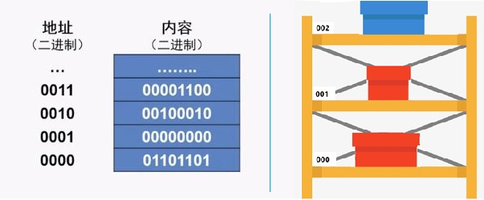

前些章反复说过，**所谓数据结构就是数据的组织方式**。

现在我们已经把数据类比成了货物，那么对于数据的组织方式，自然就是存放这些货物的方式啦。

所有“货物”（数据或指令）都是在放在“仓库”（存储空间）里的“货架”（存储单元）上的，那么不同的“货物存放”方式，自然指的就是：

1. 以何种原则对仓库中的货架进行分配；
2. 如何将货物码放上去。

## 2. 数组：一块连续的存储空间

### 2.1 存储空间的大小

数组在被创建的时候就分配到了一块存储空间，这块空间的**大小**和两个因素有关：

1. 数组中每个元素的大小——一般情况下每个元素的大小由其数据类型决定，不同数据类型的元素占据空间可能不同。
2. 数组的长度——这个数组最多可以容纳多少个元素。

关于数据类型是一个专门的话题，有一定的复杂度，此处暂不涉及。现在大家只需要知道：本课中我们要处理的都是整（数）型（integer）数据。

**在数据结构既定的情况下，数组占据的存储空间与数组的长度成正比。**

### 2.2 分配存储空间

我们在程序中创建一个数组的时候，需要指定它的长度。

计算机在运行程序的时候，根据数组长度计算出它所需要占用空间的大小（占用空间大小 = 单个元素大小 x 数组长度），一下子把所需要的空间全都分配出来。

在程序结束之前，这块儿空间都会属于这个数组，不会用于存储其他的数据。即使自始至终这个数组是空的，里面没有任何数据，这块空间也会空在那里，不做他用。

这就好比，我告诉仓库管理员：给我留 10 个（也可以是 100 个，10000 个，或者一百万个……）架子，我要装货，于是这 10 个架子就归我了。

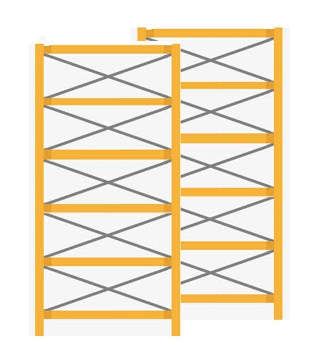

在我通知管理员不再使用它们之前，这些货架就放在那里。我可以往上面放任意我想放的货物（当然数据类型要相符），我也可以任由它一直空着，或者有一部分放货物，有一部分空着。

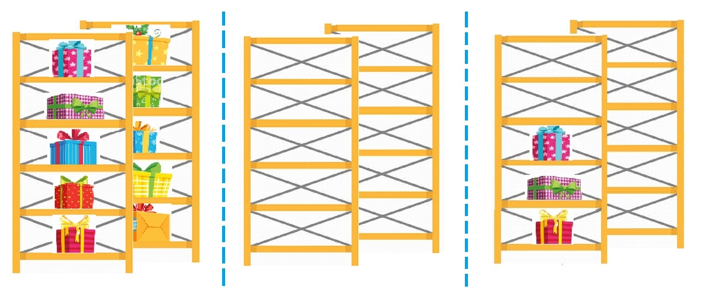

## 3. 数组的下标

### 3.1 存储单元的绝对地址

地址空间中的每个**存储单元**都有对应的**地址**——在此可以简单地理解为一个序号。这个序号是固定不变的，任何时候这个单元都是这个号——这叫做存储单元的绝对地址。

也就是说，仓库中的每个**货架**都有自己的仓库统一**编号**，始终如一。

### 3.2 数组元素的相对位置标号

当我们创建了一个数组后，这个数组可以承载的元素个数就确定了。但是这个数组从具体那个存储单元开始位置是不确定的。

也就是说，我们申请到了一系列的货架，这些货架是一个个挨着一个的，货架的个数也是确定的，但具体从什么位置开始，却是不一定的。

在这种情况下，我们可以给数组中每一个元素一个相对位置的标号，这个标号就是每一个元素相对数组头部（数组的头部即整个数组的第1个元素所在位置）的偏差值。

一个数组：第 1 个元素位置与数组“头部”的偏差（相对位置）为 0，那么我们就给它标号为 0；第 2 个元素位置和头部偏差为 1，那么它的标号 1；……；第 n 个元素位置和头部的偏差为（n-1），因此第 n 个元素所在位置的标号为（n-1）。

假设某个数组长度为 10，则最后一个元素所在位置与头部的偏差为 9，于是最后一个元素所在位置的标号就是 9。

所有这些相对位置，都是在数组创建时就已经确定了的。各个位置上，无论有没有元素，位置标号都是客观存在的，且在这个数组中是不变的。

### 3.3 数组、数组的存储和元素下标

下面这些货架，原本各有各的仓库统一编号（从 90000000 开始）。但是在它们被分给一个名叫 arr，长度为 10 的整型数组之后，每一个准备放未来整型数值的位置就都有了一个新的、相对于 arr 头部位置的标号，这个标号从 0 开始，逐个递增 1。

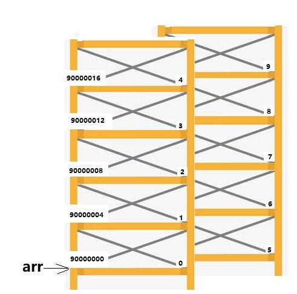

> 小贴士：大家可能注意到了，每个位置的原始编号不是递增 1 而是递增 4，这是因为在这里我们假设每个整型值的大小为 4 个字节（byte）。
>
> 字节是计算机领域衡量数据大小的基本单位，整型是表示整数的数据类型，同一种数据类型中每个个体的大小都是一样的，具体大小和编程语言有关系。
>
> 在大多数编程语言中，整型值都是 4 个字节。而 Python 的整型比较特殊，这个到后面再讲。这里我们姑且认为一个整型数值占位 4 个字节。

现在回顾一下数组的示意图，下图表示一个名为 arr，长度为 10 的数组：

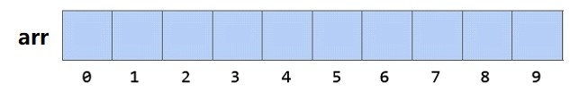

0-9 是 arr 数组中各个元素的下标，根据上面的解释大家知道，下标对应的是数组中每个元素位置的标号，也就是该元素位置相对于数组头部的偏差。

## 4. 数组中的元素

### 4.1 数组中的元素

数组被创建出来以后，我们就可以把元素放进去了，就好像用货物把货架装满一样：

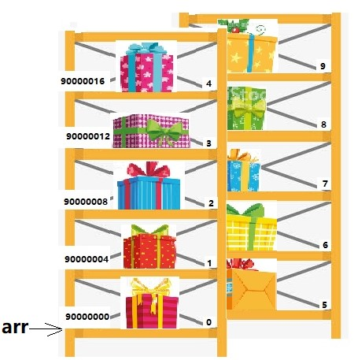

假设上图对应的数组是下面这样：

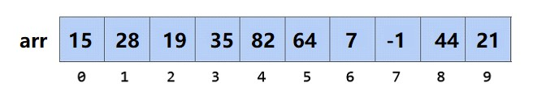

现在我们来看这个数组：

- 数组名：arr
- 数组长度：10
- 起始元素下标：0
- 相邻位置下标增幅：1

### 4.2 数组的元素值

那么我们如何指出数组中的各个元素呢？比如，我们想要知道上面 arr 数组中第 4 个元素对应的数值是什么（在上面例子中对应的值是 35），怎样告知计算机我们的想法呢？

在现在大多数的编程语言中，我们会用这个符号来指代 arr 数组中的第 4 个元素：`arr[3]`

具体来看就是这样：

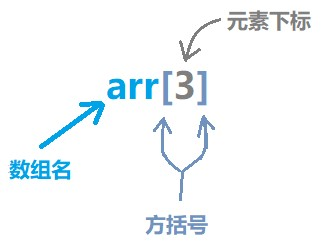

这个组合表示的就是：

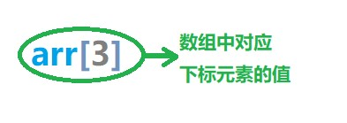

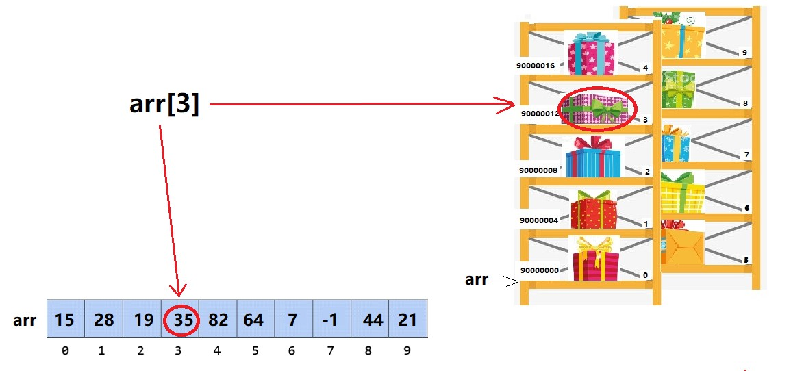

也就是说，在大多数编程语言里，我们用 `arr[i]` 来表示名为 arr 的数组中第（i+1）个元素的值，这里的i应该是一个大于等于 0，小于数组 arr 长度的整数。一般情况下，如果 i 小于 0，或者大于等于数组的长度，程序就会报错。

## 5. 数组的特性

### 5.1 固定存储空间

综上，在最初的设计层面上，数组是依赖内存分配形成的，在使用数组前必须先为它申请空间。这使得数组这种数据结构具有了下面这样的特性：

1. 一个数组占据的存储空间大小固定，不能改变；
2. 所占据的存储空间是专用的，不能被其他信息占据；
3. 所占据的存储空间是连续性的，中间不能间隔其他的信息；
4. 数组中的各个元素可以用数组名和下标直接访问。

### 5.2 优点

这样的数据结构肯定是很方便的，要读要写都很直接。

无论多长的数组，要访问其中某一个元素，只要知道它的下标，就能一步到位，直接访问对应的元素。

### 5.3 缺点

它的弊病也非常明显：

#### 5.3.1 太占地儿！

一开始就要把以后所有要用的存储空间都申请下来，就算很长时间里装不满，也不许存入其他信息。空置的空间是很可惜的。

现在，虽然存储设备越来越便宜了，可是大数据时代又来了，要存的数据也多。空间总不是可以随意浪费的。

#### 5.3.2 修改困难

理论上讲，一个数组如果没装满，那么所有的空置位置都应该在尾部，而不是到处乱空。

比如下面两图，左边是错的，右边就是对的。

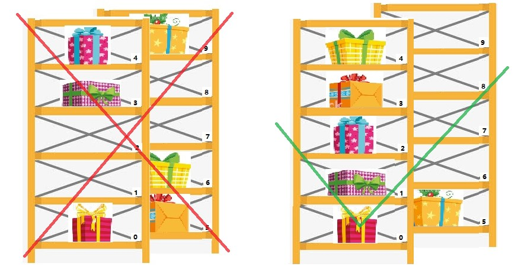

这样的话，如果给数组中加入新元素，则只能加在尾部，如果要插入到中间位置，就要有一些元素被移动（如下图）:

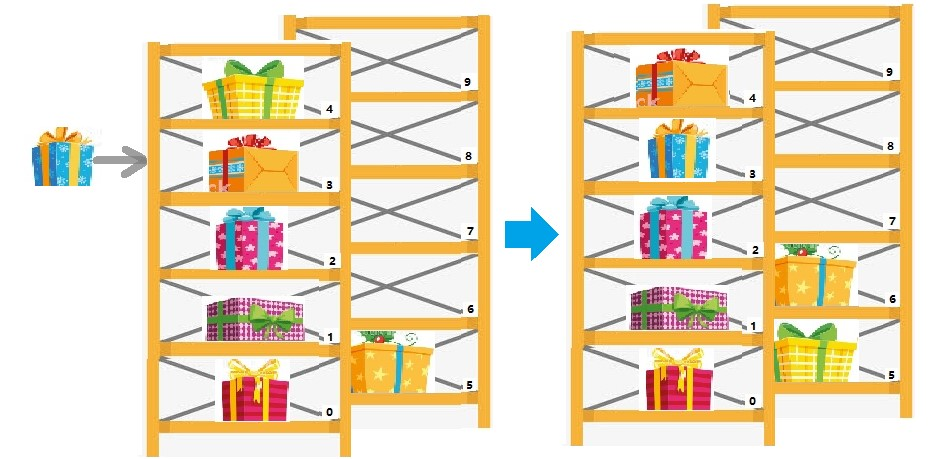

反过来，如果删除掉一个元素，也得把后面的再往前挪一位（如下图）:

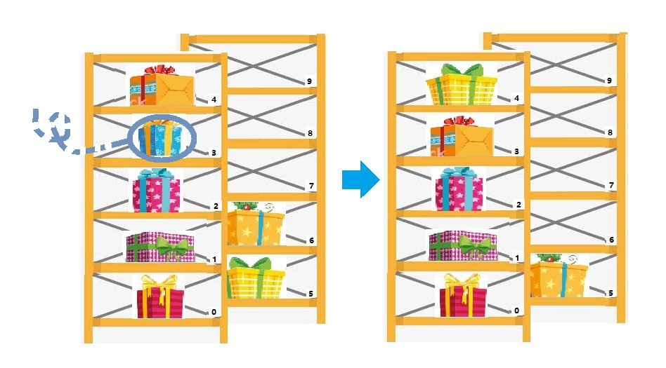

### 5.4 连续存储惹的祸

所有这些限制，都是因为数组是连续的一块存储空间，且各元素由下标标识引起的。如果不遵守这些限制，数组相应的好处也就得不到了。

计算机中大部分的任务主要需要读取（看看货架子上的货物是什么），需要写入（把货放到货架上去）的任务相对较少。而对于读取任务，数组还是有着它得天独厚的优势的。

不过，万一我们遇到的就是写入较多的任务，或者虽然读取比较多，但数据动态性很强（里面元素有时很多，有时很少）的任务，该怎么办呢？

欢迎关注我公众号：AI悦创，有更多更好玩的等你发现！

这时候我们可以启用另一种数据结构：链表——请看下一章。

::: details 公众号：AI悦创【二维码】

:::

::: info AI悦创·编程一对一

AI悦创·推出辅导班啦，包括「Python 语言辅导班、C++ 辅导班、java 辅导班、算法/数据结构辅导班、少儿编程、pygame 游戏开发」，全部都是一对一教学：一对一辅导 + 一对一答疑 + 布置作业 + 项目实践等。当然，还有线下线上摄影课程、Photoshop、Premiere 一对一教学、QQ、微信在线，随时响应！微信：Jiabcdefh

C++ 信息奥赛题解，长期更新！长期招收一对一中小学信息奥赛集训，莆田、厦门地区有机会线下上门，其他地区线上。微信：Jiabcdefh

方法一：[QQ](http://wpa.qq.com/msgrd?v=3&uin=1432803776&site=qq&menu=yes)

方法二：微信：Jiabcdefh

:::

