## 1. 链表

虽然链表和数组是两种不同的数据结构，但它们都是被存储在连续的存储空间上的。

如果将两种数据结构中的数据比作“货物”，那么放置它们的“仓库”都是一样的，里面都有一排排标好了固定编号的货架（见下图）。

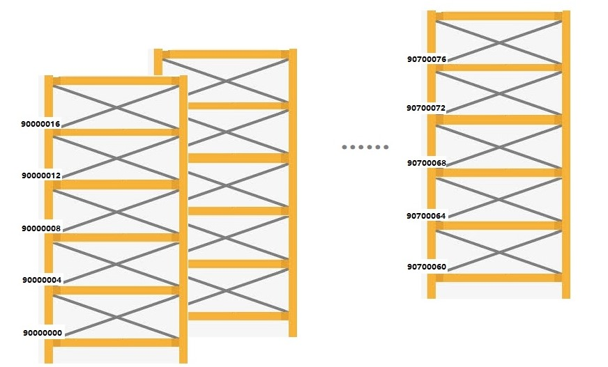

不过和数组那样一下预定一系列连续的货架，就算不放货物也要占着不给别人用的数据组织方式不同，链表是按需分配的——有货物要存储了，才临时申请正好放这些货物的货架，随时加减。

### 1.1 单向链表

最简单的一种链表——单向（非循环）链表的示意图是这样的：

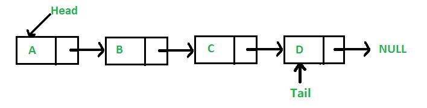

这样一个链表由若干链接在一起的节点（node）构成，每一个节点都包含两个部分：

- 本节点的数据
- 指向下一个节点的链接，也就是下一个节点的起始地址

在仓库里摆起来，就是下图这个样子的（假设一个链接的占位和数据一样，都是 4 个字节）：

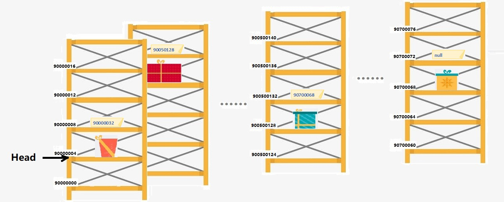

上图中，每一个节点占两个货架，第一个放货物（数据），第二个放一个标签，这个标签上写着另一个货架的编号，根据这个编号找到的货架就是链表中下一个节点的起始位置。

### 1.2 单向循环链表

如果是要将一个单向链表改成单向循环链表，则只需要改动最后一个节点的链接即可。

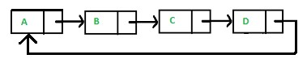

原本来单向链表中，最后一个节点指向下一个节点的链接为空值（表示下一个节点不存在），现在我们只需要将空值改为原本头节点的起始位置就好了：

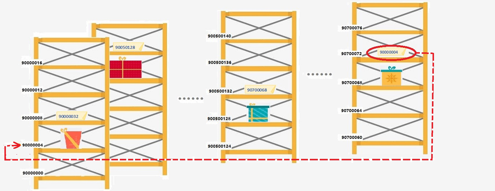

### 1.3 双向循环链表

双向循环链表则是每个节点包括三个部分：

- 数据
- 上一个节点的起始地址
- 下一个节点的起始地址

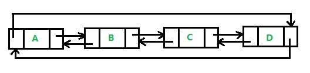

“摆出来”的样子：

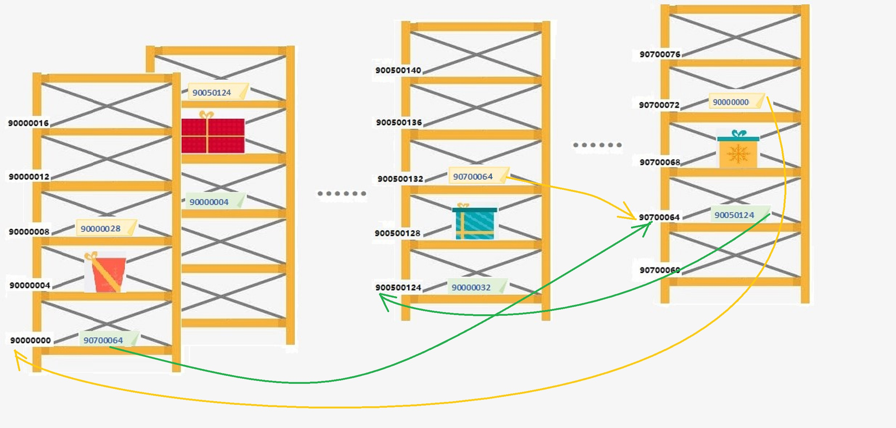

## 2. 链表的编辑

编辑链表最基本的操作就是插入、删除节点。

下面我们以最常用的单向（非循环）链表为例，来看看这两个操作。

### 2.1 插入节点

插入节点的操作对于单向链表而言相当简单，可以分为三步：

1. 在空闲空间中创建一个新节点；
2. 找到要插入的位置，将原本该位置之前那个节点的向后链接（指向下一个节点的链接）断开，重建链接指向新节点；
3. 将新节点的向后链接指向其前序节点原本指向的那个位置。

这个过程，用示意图显示如下：

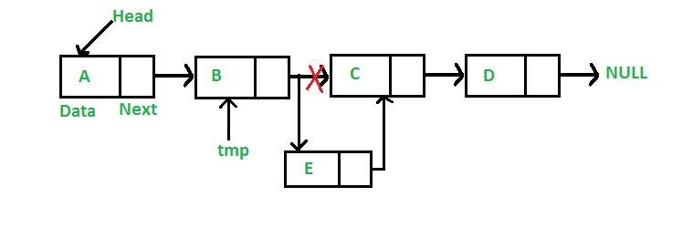

形象化的操作如下图：

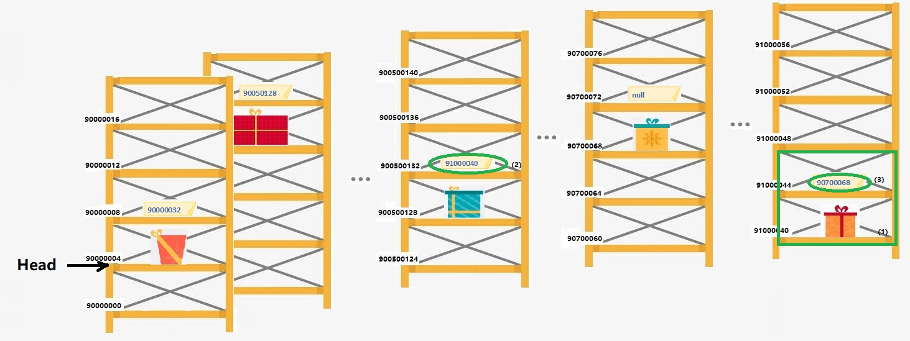

1. 首先找到有空的“货架”，申请下需要的空间（一个节点两货架）；
2. 找到新节点的前序节点（下图中是起始地址为 900500128 的节点），把该节点中的链接地址改成新节点的地址；
3. 然后把新节点的链接地址改成原来 900500128 节点中的链接地址。

就是这么简单！

> 小贴士：新节点可以创建在任何有足够空间的位置，比如上图中的 90000012，90000020，900500136，90700060……等等位置都是可以的。
>
> 我们放在一个全新的“货架”上，是为了让大家看得更清楚，并且易于理解：链表中节点的逻辑顺序和实际存放的物理顺序无关。

### 2.2 删除节点

删除节点相对更容易一些：

1. 找到要删除节点的前序节点，将前序节点的后向链接改成要删除节点的后向链接；
2. 把要删除的节点直接删除掉（将其原本占据的存储空间释放出来）。

示意图如下：

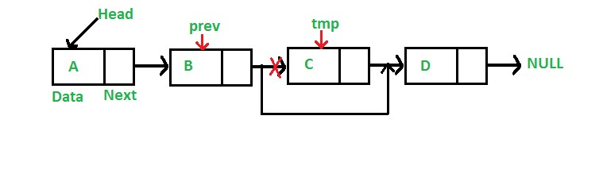

形象化操作如下：

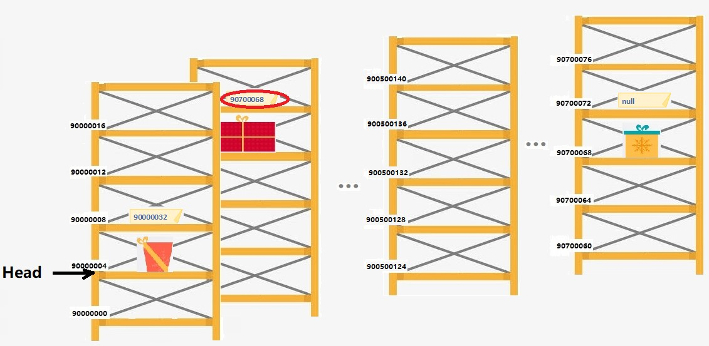

## 3. 特性各异的链表与数组

### 3.1 实现方式导致特征差异

前面我们已经对比了数组和单向链表，当时还提出了一个问题：为什么两者的优缺点有这么截然的分别？

通过上一章和本章我们应该已经明白了，数据结构表现出来的差异，是由其在存储系统中的实现方式导致的。

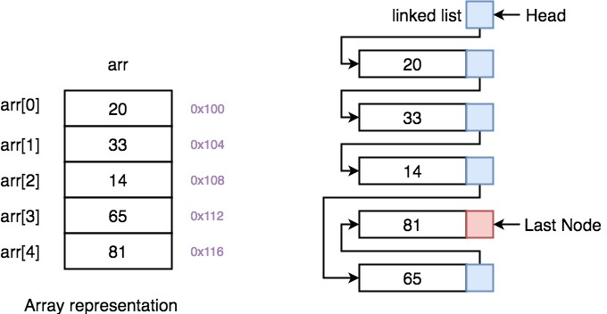

一下就占用成百上千甚至更多货架的数组，和每次只能申请两三个小格子的链表，归置货物的方式方法肯定不一样。

凡事都有 trade off，前者在自己的范围内固然可以很爽，但一旦遇到突破范围的情况，就很难应对了。后者虽然每一个节点建得都挺繁琐，但也要灵活得多。

### 3.2 数据结构的发展

当然，到此为止我们讲的数组和链表都是最原始的数组和链表的概念。

在现代计算机早期的发展阶段，各种编程语言还很不成熟，编程人员采用01代码或者低级语言进行编程（关于编程语言后面会有专门章节来讲），需要直接根据对应的存储地址获取数据或指令。

那个时候计算机软硬件所能够允许的数据结构也非常简单，造成了数组和链表的泾渭分流。

随着计算机技术的发展，程序设计语言也不断演变，层低级语言、中级语言过渡到高级语言。

和早期的直接通过地址访问存储空间内容不同，逐步发展的高级语言把对数据的访问，对存储空间的操作加上了层层包装。

Java、Python等语言的开发者，已经基本上不需要再费脑筋去管理程序消耗的存储空间——这些繁琐的事情可以交给程序的运行环境去做，开发者则可以把重心放在算法本身。

高级程序设计语言对数据的管理能力越来越强，于是出现了多种大小可变、硬件无关的数据类型。这些新的数据类型的出现，使得结合数组和链表两者的优点成为可能。

### 3.3 结合数组与链表的优点

让我们来想想这两者的**优点**：

- 数组
    - 每个元素可以通过下标直接访问
- 链表
    - 长度不受限制
    - 可以灵活地插入删除数据

如果有一种序列数据结构，同时具备这些特点就好了。

上世纪九十年代才出现的编程语言—— Python 语言就定义了一种**融合数组和链表的数据结构**： List（中文译名为“列表”）。

Python 中的 List 是一种序列结构，序列中的每个元素都有一个索引（可简单理解成下标），通过索引值，可以直接访问其中任意一个元素的值。

List 的长度随时可变，既可以在结尾处添加新元素，也可以在序列中间插入或者删除元素。

关于 Python 语言和其中的 List 数据类型后面会细讲。有一点现在要说明——

> 本课所讲述的算法，基本都要用到逻辑上的数组数据结构——一个定长，不能插入删除节点，可以用下标直接访问元素的序列。
>
> 虽然在编写程序实现算法时，Python 代码中会用 List 类型来充当数组使用，但为了体现数组的基本特征，我们在使用 List 时会尽量不去添加或者删除节点。
>
> 这样做也是为了让大家虽然用 Python 实现算法，但学习到的经典算法原理和思想保持”纯正“，未来也能够相对容易地用其他语言实现算法。

欢迎关注我公众号：AI悦创，有更多更好玩的等你发现！

这时候我们可以启用另一种数据结构：链表——请看下一章。

::: details 公众号：AI悦创【二维码】

:::

::: info AI悦创·编程一对一

AI悦创·推出辅导班啦，包括「Python 语言辅导班、C++ 辅导班、java 辅导班、算法/数据结构辅导班、少儿编程、pygame 游戏开发」，全部都是一对一教学：一对一辅导 + 一对一答疑 + 布置作业 + 项目实践等。当然，还有线下线上摄影课程、Photoshop、Premiere 一对一教学、QQ、微信在线，随时响应！微信：Jiabcdefh

C++ 信息奥赛题解，长期更新！长期招收一对一中小学信息奥赛集训，莆田、厦门地区有机会线下上门，其他地区线上。微信：Jiabcdefh

方法一：[QQ](http://wpa.qq.com/msgrd?v=3&uin=1432803776&site=qq&menu=yes)

方法二：微信：Jiabcdefh

:::

