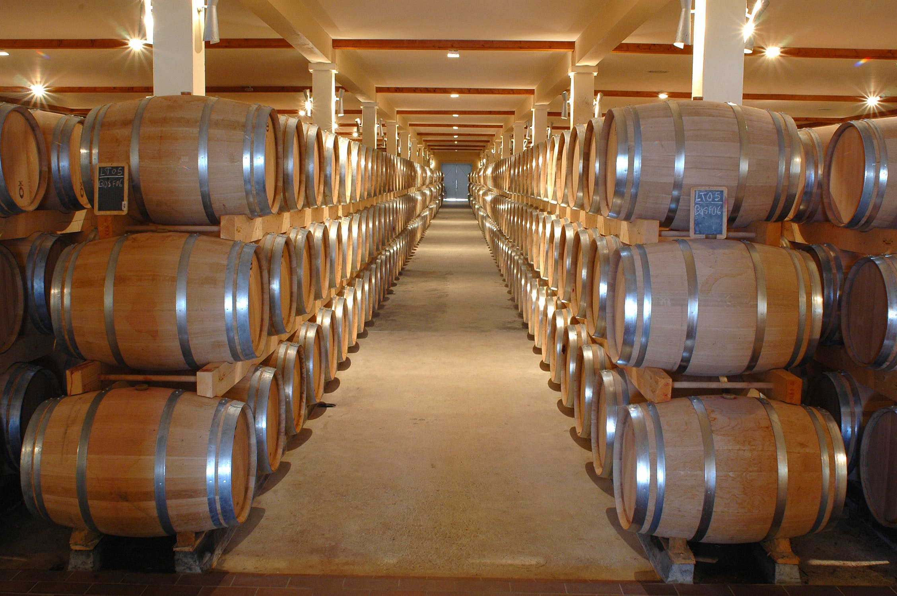
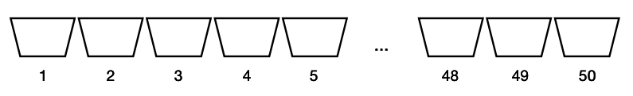
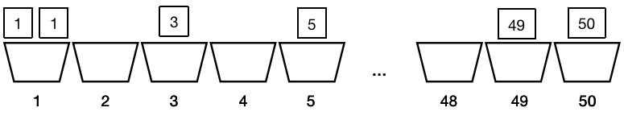

> 人的差异在于业余时间。——爱因斯坦

你好，我是悦创。

由于桶排序算法把每个数都放到合适的“桶”里进行排序，所以它因此得名。桶排序的算法原理可以理解为创建一个新的数组，把数依次放入合适的桶内，再按一定顺序输出桶。

当每个桶的数据范围为1且数据皆为整数时，桶排序的时间复杂度在所有情况下都是�(�)*O*(*n*)，因为它是一个线性的排序算法。但是，它的空间需求要视排序数据的范围而定，所以极有可能浪费很多空间。

## 1. 桶排序

假设我们有 10 个整数 `[1,1,3,19,35,49,50,5,10,16]`，它们的范围在 1 到 50 之间。如下图所示，我们建立 50 个存放数据的桶。



如下图所示，把数据放入对应编号的桶中。然后，直接把装有元素的桶的编号输出，输出的次数以桶内元素的数量为准。



用代码实现上述的桶排序非常简单：

桶排序代码（固定元素范围版）：

```python
countn = [0] * 51  # 建立足够的桶
nums, result = [1, 1, 3, 19, 35, 49, 50, 5, 10, 16], []
for i in nums:
    countn[i] += 1  # 统计每个元素出现的次数
for i in range(1, len(countn)):
    if countn[i]:  # 如果桶内有元素
        result += [i] * countn[i]  # 往结果数组中加上相应数量的元素。
print(result)
```

运行程序，输出结果为：

```python
[1, 1, 3, 5, 10, 16, 19, 35, 49, 50]
```

代码中，`countn[i]` 存储的值是元素i在数组中出现的次数。所以，在往 result 数组中添加元素时，要添加 `countn[i]` 次。代码实现的程序是升序排序，若想要降序排序，遍历 countn 数组时从后往前即可。

## 2. 桶排序改进版

如果要排序的元素范围不确定，我们需要采用稍有不同的一种方法。

桶排序代码（非固定元素范围版）：

```python
nums, result = [19, 21, 23, 14, 35, 49, 37, 59, 10, 16], []
minv, maxv = min(nums), max(nums)  # 找出所有元素中的最小值和最大值
countn = [0] * (maxv - minv + 1)  # 算出需要桶的最大个数
for i in nums:
    countn[i - minv] += 1  # 桶的编号与对应元素不一致，需要通过计算调整
for i in range(1, len(countn)):
    if countn[i]:
        result += [i + minv] * countn[i]
print(result)
```

运行程序，输出结果为：

```python
[14, 16, 19, 21, 23, 35, 37, 49, 59]
```

在这段代码中，与上一版不一样的地方在于每个桶的编号和它存储的元素不同。最小值对应的是编号 0，最小值 +1 对应的是编号 1，也就是说，元素 i 对应的编号是它自身减去最小值。往桶里放入元素和输出元素时都要以这个规律为准。

以上的方法都只适用于对整数的排序。同时，可以看出，为了排序定义的大部分桶都没有被使用。如果数据量不大但出现了极值，会造成严重的空间浪费。

为了满足这两种需求，我们可以把排序范围分段，例如在 $1< x \leq 100$范围内的元素放入同一个桶内，$100 < x \leq 200$的元素放入一个桶内，以此类推。每一个桶内所包含的元素范围大小必须相等。在每一个桶内，再使用其他排序算法对元素进行排序，之后按顺序合并所有的桶即可。

## 3. 小结

到此为止，我们一共讲解了八种常用排序算法，学习排序算法的重点在于理解各个排序算法的核心思想，并把它们应用到其他算法中去。


欢迎关注我公众号：AI悦创，有更多更好玩的等你发现！

::: details 公众号：AI悦创【二维码】


:::

::: info AI悦创·编程一对一

AI悦创·推出辅导班啦，包括「Python 语言辅导班、C++ 辅导班、java 辅导班、算法/数据结构辅导班、少儿编程、pygame 游戏开发」，全部都是一对一教学：一对一辅导 + 一对一答疑 + 布置作业 + 项目实践等。当然，还有线下线上摄影课程、Photoshop、Premiere 一对一教学、QQ、微信在线，随时响应！微信：Jiabcdefh

C++ 信息奥赛题解，长期更新！长期招收一对一中小学信息奥赛集训，莆田、厦门地区有机会线下上门，其他地区线上。微信：Jiabcdefh

方法一：[QQ](http://wpa.qq.com/msgrd?v=3&uin=1432803776&site=qq&menu=yes)

方法二：微信：Jiabcdefh

:::


