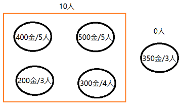
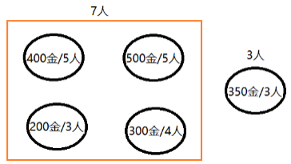

你好，我是悦创。

矿工挖矿问题是为了解决在给定金矿和矿工数量的前提下，能够获得最多黄金的挖矿策略。

## 问题描述

某一地区发现了 5 座金矿，每座金矿的黄金储量不同，需要参与挖掘的工人数也不同。假设参与挖矿工人的总数是 10 人，且每座金矿要么全挖，要么不挖，不能派出一半人挖取一半金矿。要求用程序求解，要想得到尽可能多的黄金，应该选择挖取哪几座金矿？

金矿的黄金储量与所需挖掘工人的数量如表 1 所示。

表 1　黄金储量与所需工人数量表

| 金矿编号 | 黄金储量 | 所需工人数量 |
| :------- | :------- | :----------- |
| 1        | 400      | 5            |
| 2        | 500      | 5            |
| 3        | 200      | 3            |
| 4        | 300      | 4            |

续表

| 金矿编号 | 黄金储量 | 所需工人数量 |
| :------- | :------- | :----------- |
| 5        | 350      | 3            |

如果要用动态规划算法解决该问题，需要定位用于解题的三要素：最优子结构、边界和状态转移函数。

首先寻找最优子结构。我们的解题目标是确定 10 个工人挖 5 座金矿时能够获得的最多的黄金数量，该结果可以从 10 个工人挖 4 座金矿的子问题中递归求解。

在解决 10 个工人挖 4 座金矿的过程中，存在两种选择，一种是放弃第 5 座金矿，将 10 个工人全部投放到前 4 座金矿的挖掘中，如图所示。




另一种选择是对第 5 座金矿进行挖掘，因此需要从 10 人中分配 3 个人加入第 5 座金矿的挖掘工作中，如图所示。



因此，最终的最优解应该是这两种选择中获得黄金数量较多的那个，即为图 3 所描述的场景与图 4 所描述场景中的最大值。

为了方便描述，假设金矿的数量为 n，工人的数量为 w，当前获得的黄金数量为 `G[n]`，当前所用矿工的数量为 `P[n]`，则根据上述分析，要获得 10 个矿工挖掘第 5 座金矿的最优解 `F(5, 10)`，需要在 `F(4, 10)` 和 `F(4, 10-P [5])+G [5]` 中获取较大的值，即 `F(5, 10) = max (F (4, 10), F (4, 10-P [5])+G [5])`.

因此，针对该问题而言，以上便是 `F(5, 10)` 情况下的最优子结构。

之后，我们来考虑该问题的边界。对于一座金矿的情况，若当前的矿工数量不能满足该金矿的挖掘需要，则获得的黄金数量为 0，若能满足矿工数量要求，则获得的黄金数量为 `G[n]`。因此，该问题的边界条件可表述为：

当 n=1, w>=P [n] 时，`F(n, w)=G [n]`；

当 n=1, w<P [n] 时，F (n, w)=0。

综上，可以得到该问题的状态转移函数：

`F(n,w) = 0 (n<=1, w<p[n])`

`F(n,w) = G[n] (n==1, w>=P[n])`

`F(n,w) = F(n -1,w) (n>1, w<P[n])`

`F(n,w) = max(F(n-1,w), F(n-1,w-P[n])+G[n]) (n>1, w>=P[n])`

至此，定义了用动态规划算法解决该问题的三个要素，下面要做的是利用边界、最优子结构和状态转移函数对该问题进行求解。

在初始化阶段，利用表格分析求解思路。如表 1 所示，表格的第一列代表挖掘金矿数，即 n 的取值情况；表格的第一行代表占用工人数，即 w 的取值情况；中间各空白区域是需要通过计算填入的对应的黄金数量，即 `F(n, w)` 的取值。

| *w/n*  | 1 人 | 2 人 | 3 人 | 4 人 | 5 人 | 6 人 | 7 人 | 8 人 | 9 人 | 10 人 |
| :----- | :--- | :--- | :--- | :--- | :--- | :--- | :--- | :--- | :--- | :---- |
| 1 金矿 |      |      |      |      |      |      |      |      |      |       |
| 2 金矿 |      |      |      |      |      |      |      |      |      |       |
| 3 金矿 |      |      |      |      |      |      |      |      |      |       |
| 4 金矿 |      |      |      |      |      |      |      |      |      |       |
| 5 金矿 |      |      |      |      |      |      |      |      |      |       |

在挖掘第一座金矿时，由于其所需的工人数量为 5，所以当 w 的取值小于 5 时，根据公式 `F(n,w) = 0 (n <= 1, w < p[n])`，获得的黄金数量均为 0。当 w 的取值大于或等于 5 时，根据公式 `F(n,w) = G[n] (n == 1, w>=P [n])`，即第一个金矿的储量，黄金数量的取值为 400，如表 2 所示。此时确定了该问题的边界。

| *w/n*  | 1 人 | 2 人 | 3 人 | 4 人 | 5 人 | 6 人 | 7 人 | 8 人 | 9 人 | 10 人 |
| :----- | :--- | :--- | :--- | :--- | :--- | :--- | :--- | :--- | :--- | :---- |
| 1 金矿 | 0    | 0    | 0    | 0    | 400  | 400  | 400  | 400  | 400  | 400   |
| 2 金矿 |      |      |      |      |      |      |      |      |      |       |
| 3 金矿 |      |      |      |      |      |      |      |      |      |       |
| 4 金矿 |      |      |      |      |      |      |      |      |      |       |
| 5 金矿 |      |      |      |      |      |      |      |      |      |       |

在挖掘第 2 座金矿时，由于其需要 5 个人进行挖掘，因此当 w 取值小于 5 时，根据公式 `F(n,w) = F(n-1,w) (n>1, w<P[n])`，`F(2, w) = F(1, w) = 0`；当 w 取值大于或等于 5 时，根据公式 `F(n,w) = max(F (n-1,w), F(n-1, w-P[n]) + G[n]) (n>1, w>=P [n])`，在 5~9 人的区间里，获得的黄金数量为 500，即所有人都去参加第 2 座金矿的挖掘时获得的黄金量，在参与人数为 10 时，可以两座金矿同时挖掘，因此获得的黄金数量为 900，如表所示。

| *w/n*  | 1 人 | 2 人 | 3 人 | 4 人 | 5 人 | 6 人 | 7 人 | 8 人 | 9 人 | 10 人 |
| :----- | :--- | :--- | :--- | :--- | :--- | :--- | :--- | :--- | :--- | :---- |
| 1 金矿 | 0    | 0    | 0    | 0    | 400  | 400  | 400  | 400  | 400  | 400   |
| 2 金矿 | 0    | 0    | 0    | 0    | 500  | 500  | 500  | 500  | 500  | 900   |
| 3 金矿 |      |      |      |      |      |      |      |      |      |       |
| 4 金矿 |      |      |      |      |      |      |      |      |      |       |
| 5 金矿 |      |      |      |      |      |      |      |      |      |       |

同理，在挖掘第 3 座金矿时，黄金产出量为 200，需要的工人数量为 3，根据上述计算方式可得黄金产出量，如表所示。

| *w/n*  | 1 人 | 2 人 | 3 人 | 4 人 | 5 人 | 6 人 | 7 人 | 8 人 | 9 人 | 10 人 |
| :----- | :--- | :--- | :--- | :--- | :--- | :--- | :--- | :--- | :--- | :---- |
| 1 金矿 | 0    | 0    | 0    | 0    | 400  | 400  | 400  | 400  | 400  | 400   |
| 2 金矿 | 0    | 0    | 0    | 0    | 500  | 500  | 500  | 500  | 500  | 900   |
| 3 金矿 | 0    | 0    | 200  | 200  | 500  | 500  | 500  | 700  | 700  | 900   |
| 4 金矿 |      |      |      |      |      |      |      |      |      |       |
| 5 金矿 |      |      |      |      |      |      |      |      |      |       |

第 4 座金矿的黄金产出量为 300，需要的工人数量为 4，根据上述计算方式，可得黄金产出量，如表所示。

| *w/n*  | 1 人 | 2 人 | 3 人 | 4 人 | 5 人 | 6 人 | 7 人 | 8 人 | 9 人 | 10 人 |
| :----- | :--- | :--- | :--- | :--- | :--- | :--- | :--- | :--- | :--- | :---- |
| 1 金矿 | 0    | 0    | 0    | 0    | 400  | 400  | 400  | 400  | 400  | 400   |
| 2 金矿 | 0    | 0    | 0    | 0    | 500  | 500  | 500  | 500  | 500  | 900   |
| 3 金矿 | 0    | 0    | 200  | 200  | 500  | 500  | 500  | 700  | 700  | 900   |
| 4 金矿 | 0    | 0    | 200  | 300  | 500  | 500  | 500  | 700  | 800  | 900   |
| 5 金矿 |      |      |      |      |      |      |      |      |      |       |

针对第 5 座金矿的黄金产出量计算与上述过程一致，具体产出量如表所示。

| *w/n*  | 1 人 | 2 人 | 3 人 | 4 人 | 5 人 | 6 人 | 7 人 | 8 人 | 9 人 | 10 人 |
| :----- | :--- | :--- | :--- | :--- | :--- | :--- | :--- | :--- | :--- | :---- |
| 1 金矿 | 0    | 0    | 0    | 0    | 400  | 400  | 400  | 400  | 400  | 400   |
| 2 金矿 | 0    | 0    | 0    | 0    | 500  | 500  | 500  | 500  | 500  | 900   |
| 3 金矿 | 0    | 0    | 200  | 200  | 500  | 500  | 500  | 700  | 700  | 900   |
| 4 金矿 | 0    | 0    | 200  | 300  | 500  | 500  | 500  | 700  | 800  | 900   |
| 5 金矿 | 0    | 0    | 350  | 350  | 500  | 550  | 650  | 850  | 850  | 900   |

通过以上的计算过程，我们不难发现，除了第 1 座金矿的相关数据，表格中的其他数据都可以由前一行的一个或两个格子中的数推导而来。例如，3 座金矿 8 个人挖掘的黄金量 F (3, 8) 就来自 2 座金矿 8 个人挖掘的黄金量 F (2, 8) 和 2 座金矿 5 个人挖掘的黄金量 F (2, 5)，即 F (3, 8) = max (F (2, 8), F (2, 5) + 200) = max (500，500 + 200) = 700。

再比如，4 座金矿 10 个人挖掘的黄金量 F (4，10)，来自 3 座金矿 10 个人挖掘的黄金量 F (3，10) 和 3 座金矿 6 个人挖掘的黄金量 F (3，6)，即 F (4，10) = max (F (3，10)，F (3，6) + 300) = max (900，500 + 300) = 900，如表所示。

| *w/n*  | 1 人 | 2 人 | 3 人 | 4 人 | 5 人 | 6 人 | 7 人 | 8 人 | 9 人 | 10 人 |
| :----- | :--- | :--- | :--- | :--- | :--- | :--- | :--- | :--- | :--- | :---- |
| 1 金矿 | 0    | 0    | 0    | 0    | 400  | 400  | 400  | 400  | 400  | 400   |
| 2 金矿 | 0    | 0    | 0    | 0    | 500  | 500  | 500  | 500  | 500  | 900   |

续表

| *w/n*  | 1 人 | 2 人 | 3 人 | 4 人 | 5 人 | 6 人 | 7 人 | 8 人 | 9 人 | 10 人 |
| :----- | :--- | :--- | :--- | :--- | :--- | :--- | :--- | :--- | :--- | :---- |
| 3 金矿 | 0    | 0    | 200  | 200  | 500  | 500  | 500  | 700  | 700  | 900   |
| 4 金矿 | 0    | 0    | 200  | 300  | 500  | 500  | 500  | 700  | 800  | 900   |
| 5 金矿 | 0    | 0    | 350  | 350  | 500  | 550  | 650  | 850  | 850  | 900   |

## 最终代码

挖金矿问题的动态规划求解代码如下所示。

```python
def goldMining(n, w, g, p):
    results = []  # 保存返回结果的数组
    preResults = []  # 保存上一行结果的数组
    results.append(0)  # 数组第一位为辅助位，填充0值
    preResults.append(0)
    for i in range(1, w + 1):  # 填充边界格子的值，从左向右填充表格第一行的内容
        results.append(0)  # 初始化结果数组
        if i < p[0]:
            preResults.append(0)  # 若人数少于第一个金矿所需人数，黄金量为0
        else:
            preResults.append(g[0])  # 否则，黄金量为第一个金矿储量
        results[i] = preResults[i]

    for i in range(1, n):  # 外层循环为金矿数量
        for j in range(1, w + 1):  # 内层循环为矿工数量（注意下标）
            if j < p[i]:
                results[j] = preResults[j]
            else:
                results[j] = max(preResults[j], preResults[j - p[i]] + g[i])
        preResults = results.copy()
    del results[0]
    return results
    # 验证


if __name__ == '__main__':
    n = 5
    w = 10
    g = [400, 500, 200, 300, 350]
    p = [5, 5, 3, 4, 3]
    result = goldMining(n, w, g, p)
    print(result)
```

## 小结

首先定义边界值，确定数组 preResults 中各个元素的取值，同时初始化数组 results。之后，通过函数 `goldMining (n, w, g, p)` 迭代计算各座金矿数量与工人数量组合的黄金量，最终获得问题的解。


欢迎关注我公众号：AI悦创，有更多更好玩的等你发现！

::: details 公众号：AI悦创【二维码】


:::

::: info AI悦创·编程一对一

AI悦创·推出辅导班啦，包括「Python 语言辅导班、C++ 辅导班、java 辅导班、算法/数据结构辅导班、少儿编程、pygame 游戏开发」，全部都是一对一教学：一对一辅导 + 一对一答疑 + 布置作业 + 项目实践等。当然，还有线下线上摄影课程、Photoshop、Premiere 一对一教学、QQ、微信在线，随时响应！微信：Jiabcdefh

C++ 信息奥赛题解，长期更新！长期招收一对一中小学信息奥赛集训，莆田、厦门地区有机会线下上门，其他地区线上。微信：Jiabcdefh

方法一：[QQ](http://wpa.qq.com/msgrd?v=3&uin=1432803776&site=qq&menu=yes)

方法二：微信：Jiabcdefh

:::


