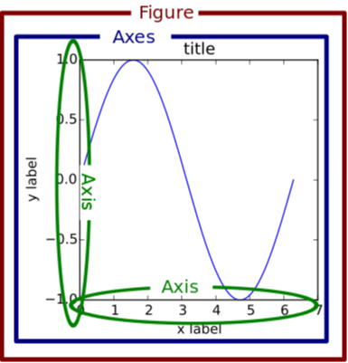
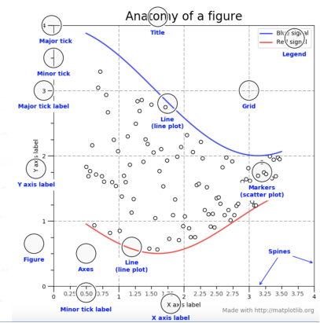

你好，我是悦创。

在本课中，我们将学习 Matplotlib 的一些基本功能，包括关键术语及其定义。

Matplotlib 是一个多功能的工具，可以用来创建许多不同的绘图元素。因此，它可能会让新用户感到困惑。在尝试创建一个绘图之前，让我们确保首先定义一些基本术语。

第一个问题是什么是 `figure` ？你可能会看到一些像下面这样的代码。

```python
plot.set_title("This is a figure.")
axes.set_title("This is a figure.")
```

什么是 `plot`？什么是 `axes` ？它们之间有什么区别？如何通过图 `figure` 或轴 `axes` 来绘制图形？

下面是一张官方图片，它告诉我们一个图 `figure` 重要组成部分。



## 1. Figure

整个图即红框所标示的，就像一个画布。我们想画的东西都会在这个画布上。该图可以包含一个或多个 `axes` 图。无论我们画多少，图都控制着所有的 `axes`。

## 2. Axes

`axes` 由蓝色方框标记。它们是数据出现的地方。一个图可以包含一个以上的 `axes`，但 `axes` 只能属于一个 `figure`。

## 3. Axis

X 轴和 Y 轴由用绿色圈出的，是类似数字线的对象。它们设定了图形的界限，并产生了刻度（轴上的标记）和刻度标签（标示刻度的字符串）。

## 4. Artist

`Artist` 是基本画图元素的合集。包括许多对象，如 "标题"`title`、"图例"`legend`、"轴"`axis`、"轴线"`spine`、"网格"`grid`和 "刻度"`tick`。下面的图片显示了一个 `Artist` 的详细解剖图，说明了许多 `Artist` 对象。

既然我们在这一课中已经学习了 Matplotlib 的一些基本概念，那么让我们在下一课中尝试绘制我们的第一个图。



欢迎关注我公众号：AI悦创，有更多更好玩的等你发现！

::: details 公众号：AI悦创【二维码】


:::

::: info AI悦创·编程一对一

AI悦创·推出辅导班啦，包括「Python 语言辅导班、C++ 辅导班、java 辅导班、算法/数据结构辅导班、少儿编程、pygame 游戏开发、Linux、Web全栈」，全部都是一对一教学：一对一辅导 + 一对一答疑 + 布置作业 + 项目实践等。当然，还有线下线上摄影课程、Photoshop、Premiere 一对一教学、QQ、微信在线，随时响应！微信：Jiabcdefh

C++ 信息奥赛题解，长期更新！长期招收一对一中小学信息奥赛集训，莆田、厦门地区有机会线下上门，其他地区线上。微信：Jiabcdefh

方法一：[QQ](http://wpa.qq.com/msgrd?v=3&uin=1432803776&site=qq&menu=yes)

方法二：微信：Jiabcdefh

:::


