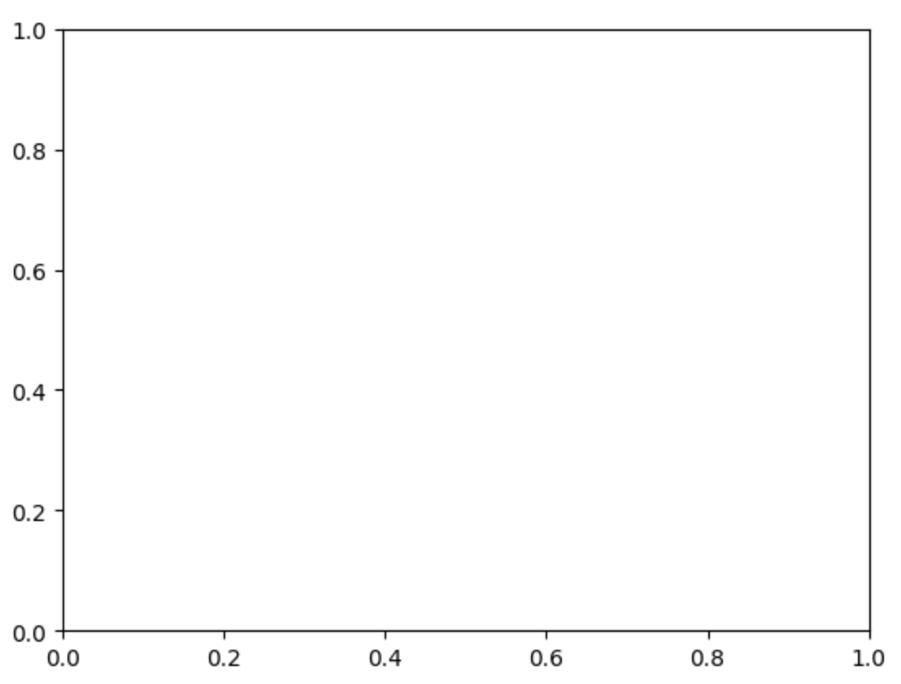
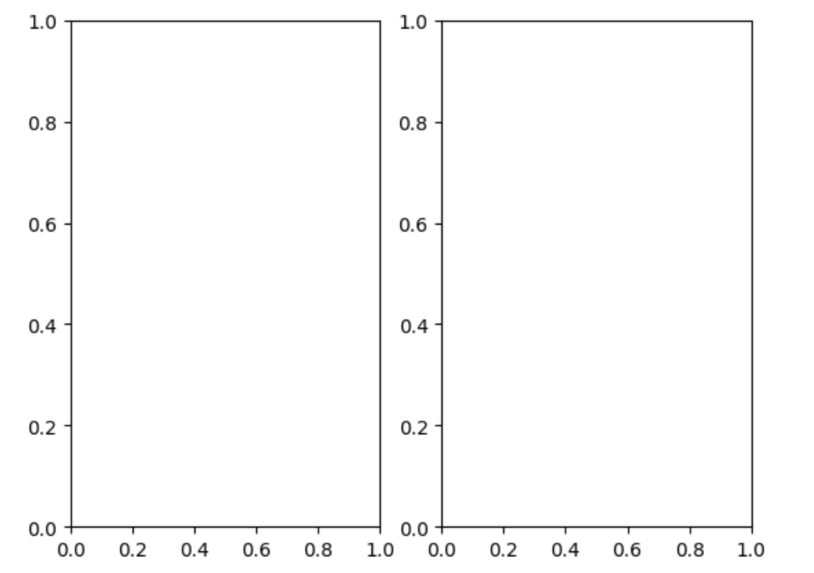
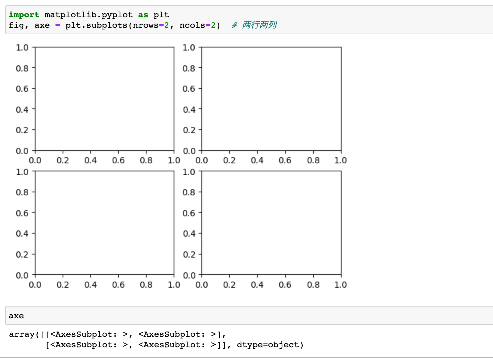
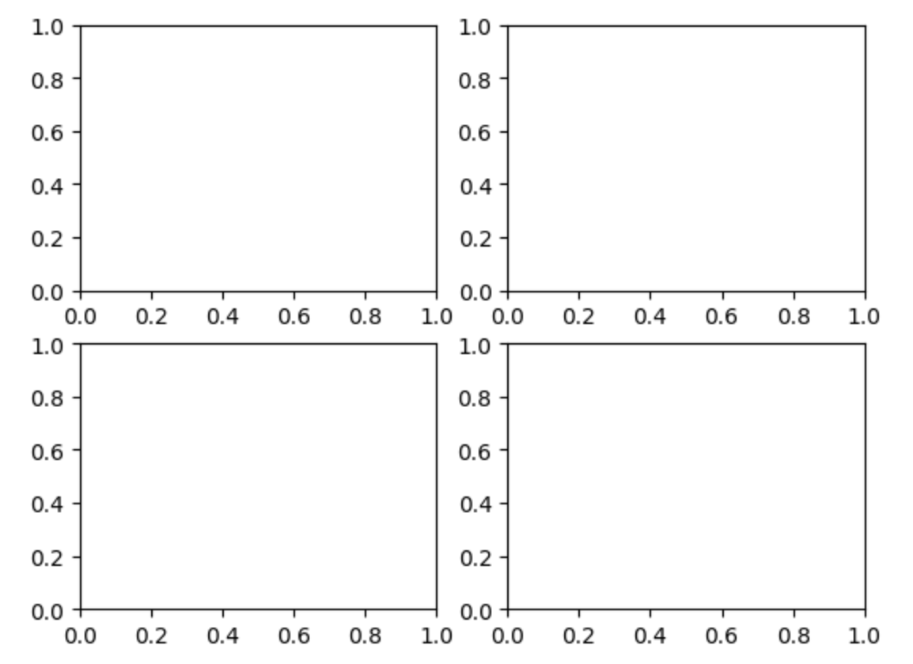
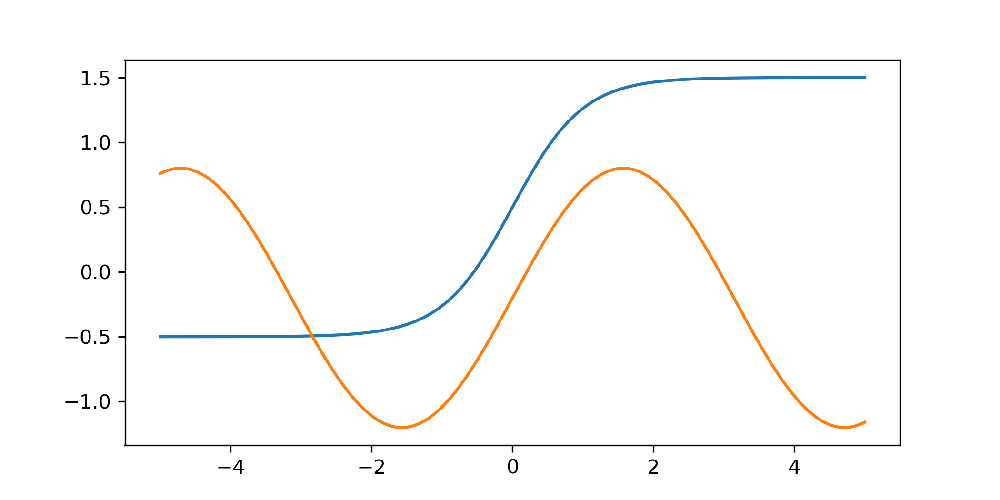
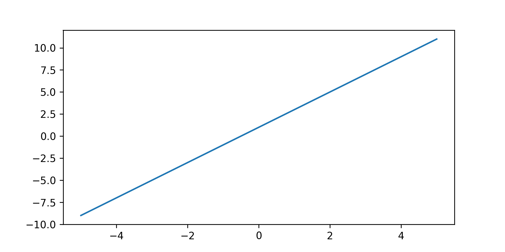

你好，我是悦创。

在本课中，我们将学习如何通过使用函数 `subplot()` 在画布上画出一条线。

让我们一步一步的来画第一张图。这个过程将教我们如何系统的画一张图。在这个图中，我们使用 `numpy` 生成数据，作两条线。

## 第1步 创建数据集

首先我们创建数据集，它将由两条线组成。在这个例子中，使用 `numpy` 生成一系列的点，作为 x 轴的数值。然后，使用 `sin` 计算 x 轴的每一个值，生成值作为 y 轴。

::: code-tabs

@tab 代码

```python
import numpy as np

points = np.linspace(-5, 5, 256)
y1 = np.power(points, 3) + 2.0
y2 = np.sin(points) - 1.0
```

@tab 分解

```python
In [1]: import numpy as np

In [2]: points = np.linspace(-5, 5, 256)

In [3]: points
Out[3]:
array([-5.        , -4.96078431, -4.92156863, -4.88235294, -4.84313725,
       -4.80392157, -4.76470588, -4.7254902 , -4.68627451, -4.64705882,
       -4.60784314, -4.56862745, -4.52941176, -4.49019608, -4.45098039,
       -4.41176471, -4.37254902, -4.33333333, -4.29411765, -4.25490196,
       -4.21568627, -4.17647059, -4.1372549 , -4.09803922, -4.05882353,
       -4.01960784, -3.98039216, -3.94117647, -3.90196078, -3.8627451 ,
       -3.82352941, -3.78431373, -3.74509804, -3.70588235, -3.66666667,
       -3.62745098, -3.58823529, -3.54901961, -3.50980392, -3.47058824,
       -3.43137255, -3.39215686, -3.35294118, -3.31372549, -3.2745098 ,
       -3.23529412, -3.19607843, -3.15686275, -3.11764706, -3.07843137,
       -3.03921569, -3.        , -2.96078431, -2.92156863, -2.88235294,
       -2.84313725, -2.80392157, -2.76470588, -2.7254902 , -2.68627451,
       -2.64705882, -2.60784314, -2.56862745, -2.52941176, -2.49019608,
       -2.45098039, -2.41176471, -2.37254902, -2.33333333, -2.29411765,
       -2.25490196, -2.21568627, -2.17647059, -2.1372549 , -2.09803922,
       -2.05882353, -2.01960784, -1.98039216, -1.94117647, -1.90196078,
       -1.8627451 , -1.82352941, -1.78431373, -1.74509804, -1.70588235,
       -1.66666667, -1.62745098, -1.58823529, -1.54901961, -1.50980392,
       -1.47058824, -1.43137255, -1.39215686, -1.35294118, -1.31372549,
       -1.2745098 , -1.23529412, -1.19607843, -1.15686275, -1.11764706,
       -1.07843137, -1.03921569, -1.        , -0.96078431, -0.92156863,
       -0.88235294, -0.84313725, -0.80392157, -0.76470588, -0.7254902 ,
       -0.68627451, -0.64705882, -0.60784314, -0.56862745, -0.52941176,
       -0.49019608, -0.45098039, -0.41176471, -0.37254902, -0.33333333,
       -0.29411765, -0.25490196, -0.21568627, -0.17647059, -0.1372549 ,
       -0.09803922, -0.05882353, -0.01960784,  0.01960784,  0.05882353,
        0.09803922,  0.1372549 ,  0.17647059,  0.21568627,  0.25490196,
        0.29411765,  0.33333333,  0.37254902,  0.41176471,  0.45098039,
        0.49019608,  0.52941176,  0.56862745,  0.60784314,  0.64705882,
        0.68627451,  0.7254902 ,  0.76470588,  0.80392157,  0.84313725,
        0.88235294,  0.92156863,  0.96078431,  1.        ,  1.03921569,
        1.07843137,  1.11764706,  1.15686275,  1.19607843,  1.23529412,
        1.2745098 ,  1.31372549,  1.35294118,  1.39215686,  1.43137255,
        1.47058824,  1.50980392,  1.54901961,  1.58823529,  1.62745098,
        1.66666667,  1.70588235,  1.74509804,  1.78431373,  1.82352941,
        1.8627451 ,  1.90196078,  1.94117647,  1.98039216,  2.01960784,
        2.05882353,  2.09803922,  2.1372549 ,  2.17647059,  2.21568627,
        2.25490196,  2.29411765,  2.33333333,  2.37254902,  2.41176471,
        2.45098039,  2.49019608,  2.52941176,  2.56862745,  2.60784314,
        2.64705882,  2.68627451,  2.7254902 ,  2.76470588,  2.80392157,
        2.84313725,  2.88235294,  2.92156863,  2.96078431,  3.        ,
        3.03921569,  3.07843137,  3.11764706,  3.15686275,  3.19607843,
        3.23529412,  3.2745098 ,  3.31372549,  3.35294118,  3.39215686,
        3.43137255,  3.47058824,  3.50980392,  3.54901961,  3.58823529,
        3.62745098,  3.66666667,  3.70588235,  3.74509804,  3.78431373,
        3.82352941,  3.8627451 ,  3.90196078,  3.94117647,  3.98039216,
        4.01960784,  4.05882353,  4.09803922,  4.1372549 ,  4.17647059,
        4.21568627,  4.25490196,  4.29411765,  4.33333333,  4.37254902,
        4.41176471,  4.45098039,  4.49019608,  4.52941176,  4.56862745,
        4.60784314,  4.64705882,  4.68627451,  4.7254902 ,  4.76470588,
        4.80392157,  4.84313725,  4.88235294,  4.92156863,  4.96078431,
        5.        ])

In [4]: y1 = np.power(points, 3) + 2.0

In [5]: y1
Out[5]:
array([-1.23000000e+02, -1.20081831e+02, -1.17209437e+02, -1.14382455e+02,
       -1.11600523e+02, -1.08863280e+02, -1.06170364e+02, -1.03521413e+02,
       -1.00916065e+02, -9.83539589e+01, -9.58347317e+01, -9.33580222e+01,
       -9.09234683e+01, -8.85307084e+01, -8.61793805e+01, -8.38691227e+01,
       -8.15995733e+01, -7.93703704e+01, -7.71811520e+01, -7.50315565e+01,
       -7.29212219e+01, -7.08497863e+01, -6.88168879e+01, -6.68221649e+01,
       -6.48652554e+01, -6.29457976e+01, -6.10634296e+01, -5.92177895e+01,
       -5.74085156e+01, -5.56352459e+01, -5.38976186e+01, -5.21952718e+01,
       -5.05278437e+01, -4.88949725e+01, -4.72962963e+01, -4.57314532e+01,
       -4.42000814e+01, -4.27018191e+01, -4.12363043e+01, -3.98031752e+01,
       -3.84020701e+01, -3.70326270e+01, -3.56944840e+01, -3.43872794e+01,
       -3.31106513e+01, -3.18642377e+01, -3.06476770e+01, -2.94606072e+01,
       -2.83026664e+01, -2.71734928e+01, -2.60727247e+01, -2.50000000e+01,
       -2.39549570e+01, -2.29372338e+01, -2.19464686e+01, -2.09822994e+01,
       -2.00443645e+01, -1.91323021e+01, -1.82457501e+01, -1.73843469e+01,
       -1.65477305e+01, -1.57355391e+01, -1.49474109e+01, -1.41829839e+01,
       -1.34418964e+01, -1.27237865e+01, -1.20282923e+01, -1.13550520e+01,
       -1.07037037e+01, -1.00738856e+01, -9.46523584e+00, -8.87739256e+00,
       -8.30999389e+00, -7.76267800e+00, -7.23508304e+00, -6.72684714e+00,
       -6.23760846e+00, -5.76700515e+00, -5.31467535e+00, -4.88025722e+00,
       -4.46338889e+00, -4.06370853e+00, -3.68085427e+00, -3.31446427e+00,
       -2.96417667e+00, -2.62962963e+00, -2.31046129e+00, -2.00630979e+00,
       -1.71681329e+00, -1.44160994e+00, -1.18033788e+00, -9.32635261e-01,
       -6.98140233e-01, -4.76490942e-01, -2.67325538e-01, -7.02821690e-02,
        1.15001018e-01,  2.88885873e-01,  4.51734250e-01,  6.03907999e-01,
        7.45768973e-01,  8.77679022e-01,  1.00000000e+00,  1.11309376e+00,
        1.21732215e+00,  1.31304702e+00,  1.40063023e+00,  1.48043362e+00,
        1.55281905e+00,  1.61814837e+00,  1.67678344e+00,  1.72908610e+00,
        1.77541820e+00,  1.81614160e+00,  1.85161816e+00,  1.88220971e+00,
        1.90827811e+00,  1.93018522e+00,  1.94829289e+00,  1.96296296e+00,
        1.97455730e+00,  1.98343774e+00,  1.98996615e+00,  1.99450438e+00,
        1.99741427e+00,  1.99905768e+00,  1.99979646e+00,  1.99999246e+00,
        2.00000754e+00,  2.00020354e+00,  2.00094232e+00,  2.00258573e+00,
        2.00549562e+00,  2.01003385e+00,  2.01656226e+00,  2.02544270e+00,
        2.03703704e+00,  2.05170711e+00,  2.06981478e+00,  2.09172189e+00,
        2.11779029e+00,  2.14838184e+00,  2.18385840e+00,  2.22458180e+00,
        2.27091390e+00,  2.32321656e+00,  2.38185163e+00,  2.44718095e+00,
        2.51956638e+00,  2.59936977e+00,  2.68695298e+00,  2.78267785e+00,
        2.88690624e+00,  3.00000000e+00,  3.12232098e+00,  3.25423103e+00,
        3.39609200e+00,  3.54826575e+00,  3.71111413e+00,  3.88499898e+00,
        4.07028217e+00,  4.26732554e+00,  4.47649094e+00,  4.69814023e+00,
        4.93263526e+00,  5.18033788e+00,  5.44160994e+00,  5.71681329e+00,
        6.00630979e+00,  6.31046129e+00,  6.62962963e+00,  6.96417667e+00,
        7.31446427e+00,  7.68085427e+00,  8.06370853e+00,  8.46338889e+00,
        8.88025722e+00,  9.31467535e+00,  9.76700515e+00,  1.02376085e+01,
        1.07268471e+01,  1.12350830e+01,  1.17626780e+01,  1.23099939e+01,
        1.28773926e+01,  1.34652358e+01,  1.40738856e+01,  1.47037037e+01,
        1.53550520e+01,  1.60282923e+01,  1.67237865e+01,  1.74418964e+01,
        1.81829839e+01,  1.89474109e+01,  1.97355391e+01,  2.05477305e+01,
        2.13843469e+01,  2.22457501e+01,  2.31323021e+01,  2.40443645e+01,
        2.49822994e+01,  2.59464686e+01,  2.69372338e+01,  2.79549570e+01,
        2.90000000e+01,  3.00727247e+01,  3.11734928e+01,  3.23026664e+01,
        3.34606072e+01,  3.46476770e+01,  3.58642377e+01,  3.71106513e+01,
        3.83872794e+01,  3.96944840e+01,  4.10326270e+01,  4.24020701e+01,
        4.38031752e+01,  4.52363043e+01,  4.67018191e+01,  4.82000814e+01,
        4.97314532e+01,  5.12962963e+01,  5.28949725e+01,  5.45278437e+01,
        5.61952718e+01,  5.78976186e+01,  5.96352459e+01,  6.14085156e+01,
        6.32177895e+01,  6.50634296e+01,  6.69457976e+01,  6.88652554e+01,
        7.08221649e+01,  7.28168879e+01,  7.48497863e+01,  7.69212219e+01,
        7.90315565e+01,  8.11811520e+01,  8.33703704e+01,  8.55995733e+01,
        8.78691227e+01,  9.01793805e+01,  9.25307084e+01,  9.49234683e+01,
        9.73580222e+01,  9.98347317e+01,  1.02353959e+02,  1.04916065e+02,
        1.07521413e+02,  1.10170364e+02,  1.12863280e+02,  1.15600523e+02,
        1.18382455e+02,  1.21209437e+02,  1.24081831e+02,  1.27000000e+02])

In [6]: y2 = np.sin(points) - 1.0

In [7]: y2
Out[7]:
array([-4.10757253e-02, -3.06918250e-02, -2.17984037e-02, -1.44091365e-02,
       -8.53538580e-03, -4.18618340e-03, -1.36821700e-03, -8.58196988e-05,
       -3.40963409e-04, -2.13325580e-03, -5.45994092e-03, -1.03159034e-02,
       -1.66936764e-02, -2.45834529e-02, -3.39731011e-02, -4.48481827e-02,
       -5.71919755e-02, -7.09854987e-02, -8.62075424e-02, -1.02834700e-01,
       -1.20841405e-01, -1.40199967e-01, -1.60880622e-01, -1.82851567e-01,
       -2.06079019e-01, -2.30527263e-01, -2.56158703e-01, -2.82933929e-01,
       -3.10811767e-01, -3.39749352e-01, -3.69702186e-01, -4.00624212e-01,
       -4.32467882e-01, -4.65184231e-01, -4.98722951e-01, -5.33032472e-01,
       -5.68060036e-01, -6.03751783e-01, -6.40052829e-01, -6.76907357e-01,
       -7.14258696e-01, -7.52049411e-01, -7.90221393e-01, -8.28715946e-01,
       -8.67473878e-01, -9.06435592e-01, -9.45541177e-01, -9.84730502e-01,
       -1.02394331e+00, -1.06311929e+00, -1.10219822e+00, -1.14112001e+00,
       -1.17982479e+00, -1.21825307e+00, -1.25634574e+00, -1.29404424e+00,
       -1.33129059e+00, -1.36802753e+00, -1.40419856e+00, -1.43974807e+00,
       -1.47462138e+00, -1.50876489e+00, -1.54212608e+00, -1.57465366e+00,
       -1.60629761e+00, -1.63700927e+00, -1.66674142e+00, -1.69544834e+00,
       -1.72308588e+00, -1.74961156e+00, -1.77498458e+00, -1.79916593e+00,
       -1.82211842e+00, -1.84380676e+00, -1.86419760e+00, -1.88325959e+00,
       -1.90096342e+00, -1.91728185e+00, -1.93218981e+00, -1.94566437e+00,
       -1.95768480e+00, -1.96823263e+00, -1.97729163e+00, -1.98484788e+00,
       -1.99088975e+00, -1.99540796e+00, -1.99839555e+00, -1.99984795e+00,
       -1.99976290e+00, -1.99814054e+00, -1.99498337e+00, -1.99029624e+00,
       -1.98408636e+00, -1.97636327e+00, -1.96713886e+00, -1.95642731e+00,
       -1.94424508e+00, -1.93061091e+00, -1.91554577e+00, -1.89907282e+00,
       -1.88121738e+00, -1.86200693e+00, -1.84147098e+00, -1.81964114e+00,
       -1.79655095e+00, -1.77223592e+00, -1.74673345e+00, -1.72008275e+00,
       -1.69232480e+00, -1.66350227e+00, -1.63365950e+00, -1.60284237e+00,
       -1.57109826e+00, -1.53847599e+00, -1.50502572e+00, -1.47079889e+00,
       -1.43584812e+00, -1.40022715e+00, -1.36399078e+00, -1.32719470e+00,
       -1.28989550e+00, -1.25215054e+00, -1.21401785e+00, -1.17555608e+00,
       -1.13682435e+00, -1.09788224e+00, -1.05878961e+00, -1.01960659e+00,
       -9.80393413e-01, -9.41210388e-01, -9.02117763e-01, -8.63175648e-01,
       -8.24443924e-01, -7.85982148e-01, -7.47849462e-01, -7.10104500e-01,
       -6.72805303e-01, -6.36009225e-01, -5.99772845e-01, -5.64151884e-01,
       -5.29201114e-01, -4.94974280e-01, -4.61524010e-01, -4.28901739e-01,
       -3.97157631e-01, -3.66340498e-01, -3.36497726e-01, -3.07675203e-01,
       -2.79917249e-01, -2.53266547e-01, -2.27764077e-01, -2.03449053e-01,
       -1.80358864e-01, -1.58529015e-01, -1.37993073e-01, -1.18782616e-01,
       -1.00927184e-01, -8.44542308e-02, -6.93890880e-02, -5.57549203e-02,
       -4.35726929e-02, -3.28611378e-02, -2.36367260e-02, -1.59136417e-02,
       -9.70376034e-03, -5.01663075e-03, -1.85946020e-03, -2.37103374e-04,
       -1.52054937e-04, -1.60444566e-03, -4.59204225e-03, -9.11025075e-03,
       -1.51521236e-02, -2.27083705e-02, -3.17673723e-02, -4.23151992e-02,
       -5.43356321e-02, -6.78101876e-02, -8.27181462e-02, -9.90365843e-02,
       -1.16740409e-01, -1.35802399e-01, -1.56193242e-01, -1.77881584e-01,
       -2.00834075e-01, -2.25015421e-01, -2.50388441e-01, -2.76914118e-01,
       -3.04551665e-01, -3.33258584e-01, -3.62990733e-01, -3.93702394e-01,
       -4.25346342e-01, -4.57873920e-01, -4.91235111e-01, -5.25378615e-01,
       -5.60251932e-01, -5.95801438e-01, -6.31972469e-01, -6.68709406e-01,
       -7.05955759e-01, -7.43654257e-01, -7.81746930e-01, -8.20175205e-01,
       -8.58879992e-01, -8.97801775e-01, -9.36880706e-01, -9.76056694e-01,
       -1.01526950e+00, -1.05445882e+00, -1.09356441e+00, -1.13252612e+00,
       -1.17128405e+00, -1.20977861e+00, -1.24795059e+00, -1.28574130e+00,
       -1.32309264e+00, -1.35994717e+00, -1.39624822e+00, -1.43193996e+00,
       -1.46696753e+00, -1.50127705e+00, -1.53481577e+00, -1.56753212e+00,
       -1.59937579e+00, -1.63029781e+00, -1.66025065e+00, -1.68918823e+00,
       -1.71706607e+00, -1.74384130e+00, -1.76947274e+00, -1.79392098e+00,
       -1.81714843e+00, -1.83911938e+00, -1.85980003e+00, -1.87915860e+00,
       -1.89716530e+00, -1.91379246e+00, -1.92901450e+00, -1.94280802e+00,
       -1.95515182e+00, -1.96602690e+00, -1.97541655e+00, -1.98330632e+00,
       -1.98968410e+00, -1.99454006e+00, -1.99786674e+00, -1.99965904e+00,
       -1.99991418e+00, -1.99863178e+00, -1.99581382e+00, -1.99146461e+00,
       -1.98559086e+00, -1.97820160e+00, -1.96930817e+00, -1.95892427e+00])

In [8]:
```

:::

## 第2步 创建画布

然后我们将创建一个只有作图区域(`axes`)的画布。函数 `subplots()` 的功能是创建一个具有指定布局的图形，或画布。如果我们不传递 `nrows` 或 `ncols` 参数，`subplots()` 将创建一个只有一条轴的画布。

```python
import matplotlib.pyplot as plt
fig, axe = plt.subplots()
```



### 探究

:::: tabs

@tab plt.subplots(nrows=1, ncols=2)

```python
import matplotlib.pyplot as plt
fig, axe = plt.subplots(nrows=1, ncols=2)  # 一行两列
```



`fig` 和 `axe` 是在 `matplotlib` 中用于创建图形和子图的对象。

具体来说，`fig` 是 `matplotlib.figure.Figure` 类型的对象，表示整个图形或绘图区域。它包含一个或多个子图 (`axes`)，并提供了访问和管理子图的方法。在上述代码中，`fig` 表示一个包含两个子图的图形对象。

`axe` 则是一个包含子图 (`axes`) 对象的数组，它是 `matplotlib.axes.Axes` 类型的对象。子图是图形中的一个单独的绘图区域，用于绘制数据。在上述代码中，`axe` 是一个包含两个子图对象的数组，每个子图对象可以用于绘制数据和设置绘图属性。

**比如下面的代码， axe 就有四个数据：**



自行多测试测试即可。

@tab plt.subplots(nrows=2, ncols=2)

```python
import matplotlib.pyplot as plt
fig, axe = plt.subplots(nrows=2, ncols=2)  # 两行两列
```



@tab 注解

fig 是 Matplotlib 中的一个图形对象，可以用于创建和编辑图形。 axe 是 Matplotlib 中的一个工具，用于在一个二维平面上绘制图形。

::::

## 第3步 画图

接下来，我们将通过使用 `plot` 将数据添加到轴上。默认情况下，第一个参数是用于 X 轴，第二个参数是用于 Y 轴。

```python
axe.plot(points, y1)
axe.plot(points, y2)
```

## 第4步 显示图片

我们可以通过调用 `plt.show()` 来显示我们的图片。

```python
plt.show()
```

> 注意：这里的 `plt` 是对 `matplotlib.pyplot` 的引用。

> 注意：上面的代码与下面的代码不同。在 PC 上，我们可以调用 `plt.show()` 来在屏幕上显示图像。然而，在下面的示例代码中，我们需要将图像输出为一个文件。

```python
import numpy as np
import matplotlib.pyplot as plt

points = np.linspace(-5, 5, 256)
y1 = np.tanh(points) + 0.5
y2 = np.sin(points) - 0.2

fig, axe = plt.subplots(figsize=(7, 3.5), dpi=300)
axe.plot(points, y1)
axe.plot(points, y2)
fig.savefig('output/to.png')

plt.close(fig)
```



`figsize` 和 `dpi` 是用于指定图像大小和分辨率的参数。

- `figsize` 是一个元组，用于指定图像的宽度和高度（以英寸为单位）。在示例代码中，`figsize=(7, 3.5)` 指定了图像的宽度为 7 英寸，高度为 3.5 英寸。
- `dpi` 则是用于指定图像的分辨率，即每英寸包含的像素数。在示例代码中，`dpi=300` 表示每英寸包含 300 个像素。

这些参数对于生成高质量的图像非常重要。通常，我们希望图像足够大和分辨率足够高，以便在不失真的情况下放大或打印图像。但是，过大的图像和过高的分辨率也会增加图像的文件大小和处理时间。因此，需要根据具体应用场景进行调整。

### 补充「dpi 像素怎么调整？」

`dpi` 参数可以通过在 `savefig()` 或 `subplots()` 方法中传入不同的值来调整。

在 `savefig()` 方法中，可以通过设置 `dpi` 参数来指定保存图像的分辨率，示例代码如下：

```python
fig.savefig('output/to.png', dpi=150)
```

上述代码将图像的分辨率设置为 150 dpi。

在 `subplots()` 方法中，可以通过设置 `dpi` 参数来指定图像的分辨率，示例代码如下：

```python
fig, axe = plt.subplots(figsize=(7, 3.5), dpi=150)
```

上述代码将图像的分辨率设置为 150 dpi。

需要注意的是，`dpi` 参数的取值通常取决于具体应用场景和设备。通常情况下，屏幕的分辨率约为 `72-96 dpi`，而打印机的分辨率可能达到 `300 dpi` 或更高。因此，在生成图像时需要根据具体情况选择适当的分辨率。

## 第5步 总结

在本课中，我们学习了如何使用 `figuer` 和 `axes` 来绘制图表。然而，有许多不同的方法来绘制图表。在其他情况下，其他绘制图表的方法可能更方便。然后其他方法不太灵活，因为它们只允许我们在一个图上绘制一个子图。选择哪种方法最有效，取决于我们想如何直观地表示我们的数据。在下一课，我们将学习绘制图表的其他方法。

## 杂谈

```python
import numpy as np
import matplotlib.pyplot as plt


def f(x):
    return 2 * x + 1


points = np.linspace(-5, 5, 256)
y1 = map(f, points)
y1 = np.array(list(y1))

fig, axe = plt.subplots(figsize=(7, 3.5), dpi=300)

axe.plot(points, y1)
plt.show()
# fig.savefig('to.png')
# plt.close(fig)
```



欢迎关注我公众号：AI悦创，有更多更好玩的等你发现！

::: details 公众号：AI悦创【二维码】


:::

::: info AI悦创·编程一对一

AI悦创·推出辅导班啦，包括「Python 语言辅导班、C++ 辅导班、java 辅导班、算法/数据结构辅导班、少儿编程、pygame 游戏开发、Linux、Web全栈」，全部都是一对一教学：一对一辅导 + 一对一答疑 + 布置作业 + 项目实践等。当然，还有线下线上摄影课程、Photoshop、Premiere 一对一教学、QQ、微信在线，随时响应！微信：Jiabcdefh

C++ 信息奥赛题解，长期更新！长期招收一对一中小学信息奥赛集训，莆田、厦门地区有机会线下上门，其他地区线上。微信：Jiabcdefh

方法一：[QQ](http://wpa.qq.com/msgrd?v=3&uin=1432803776&site=qq&menu=yes)

方法二：微信：Jiabcdefh

:::


