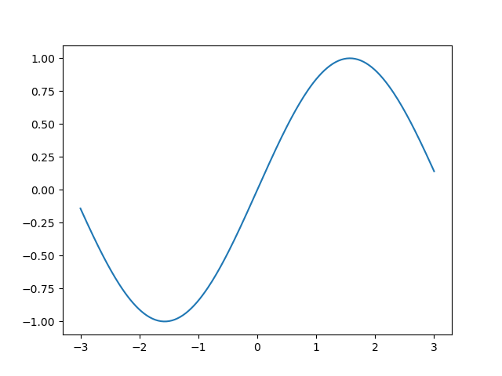
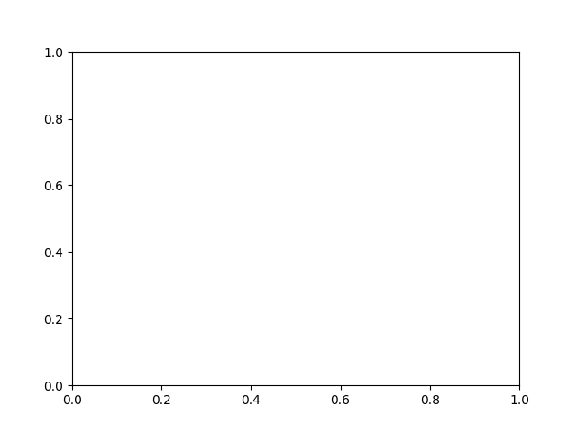

你好，我是悦创。

在本课中，我们将学习如何从不同的对象中绘制图表。

画图的方法不止一种。在[上一课](/column/Python-data-visualization/Matplotlib/03.html)中，我们学习了如何用正式的方法来画一个图片。现在，让我们来比较一下几种其他方法，以观察它们之间的区别。

## 1. 用 pyplot.plot 绘图

当我们想用 `(x, y)` 来绘制一个单一的图形时，使用 pyplot 模块是最简单的方法。如果我们想快速得到一个简单的图像，我们可以从 `pyplot`  模块中调用函数  `plot`，就像下面的示例代码。

> 注意：x 和 y 是一系列的数据点。

```python
import matplotlib.pyplot as plt
plt.plot(x, y)
```

```python
import matplotlib.pyplot as plt
import numpy as np

x = np.linspace(-3, 3, 256)
y = np.sin(x)

plt.plot(x, y)

plt.savefig("./output/o.png")
```



代码第 7 行：通过 `pyplot.plot` 绘制数据对 `(x，y)`。

## 2. 用 axes 绘图

我们可能记得，`axes ` 只是一个 `plot`，所以如果我们选择得到一个轴对象，则它可以执行与绘图相同的功能。如果我们想画一个图，可以调用 `subplot()`。如果我们想画一个以上的图，可以调用 `subplots()`，该函数返回多个 `axes`，参数为 `nrows` 和 `ncols` 。

### 2.1 subplot()

```python
import matplotlib.pyplot as plt

ax = plt.subplot()
ax.plot(x, y)
```

```python
import matplotlib.pyplot as plt
import numpy as np

x = np.linspace(-3, 3, 256)
y = np.sin(x)

ax = plt.subplot()
ax.plot(x, y)
plt.savefig("./output/o.png")
```


代码第7行：从 `subplot` 中返回一个 `axes` 对象。

代码第8行：从一个 `axes` 对象中使用 `plot` 。

### 2.2 subplots()

`plt.subplots()`是 Matplotlib 库中的一个函数，用于创建一个新的图形窗口，并返回一组 numpy 数组，这些数组表示子图的轴对象。使用这个函数，你可以同时处理多个图形和子图。以下是一些基本的用法。

1. 创建一个空的图形和子图：

```python
import matplotlib.pyplot as plt

fig, ax = plt.subplots()
plt.show()
```

这将创建一个空的图形和子图。`fig` 是一个 `Figure` 对象，`ax` 是一个 `AxesSubplot` 对象。



2. 创建包含多个子图的图形：

```python
import matplotlib.pyplot as plt

fig, axs = plt.subplots(2, 2)  # 2 rows and 2 columns
plt.show()
```

这将创建一个包含4个子图的图形，排列成2行2列。`axs`是一个2x2的numpy数组，每个元素都是一个`AxesSubplot`对象。

3. 在子图上绘制图形：

```python
import matplotlib.pyplot as plt
import numpy as np

x = np.linspace(0, 2 * np.pi, 400)
y = np.sin(x ** 2)

fig, axs = plt.subplots(2)
axs[0].plot(x, y)
axs[0].set_title('Axis [0]')
axs[1].plot(x, -y)
axs[1].set_title('Axis [1]')

plt.show()
```

这将在两个子图上分别绘制 $y=sin(x^2)$和 $y=-sin(x^2)$两条曲线。

这只是 `plt.subplots()` 的基本用法，你可以根据需要进行更复杂的配置，如调整子图之间的间距，设置子图的标题，标签等。


## 3. 在 figure 对象中作图

为了从一个图形对象中进行绘图，有三个步骤：

- 首先，创建一个画布(`figure`)。
- 第二，使用 `add_subplot` 从图对象中创建一个 `plot` 对象。
- 最后，通过调用 `plot` 绘制图表。


欢迎关注我公众号：AI悦创，有更多更好玩的等你发现！

::: details 公众号：AI悦创【二维码】


:::

::: info AI悦创·编程一对一

AI悦创·推出辅导班啦，包括「Python 语言辅导班、C++ 辅导班、java 辅导班、算法/数据结构辅导班、少儿编程、pygame 游戏开发、Linux、Web全栈」，全部都是一对一教学：一对一辅导 + 一对一答疑 + 布置作业 + 项目实践等。当然，还有线下线上摄影课程、Photoshop、Premiere 一对一教学、QQ、微信在线，随时响应！微信：Jiabcdefh

C++ 信息奥赛题解，长期更新！长期招收一对一中小学信息奥赛集训，莆田、厦门地区有机会线下上门，其他地区线上。微信：Jiabcdefh

方法一：[QQ](http://wpa.qq.com/msgrd?v=3&uin=1432803776&site=qq&menu=yes)

方法二：微信：Jiabcdefh

:::


