## 0. 目录

- Python 第三方库
- Pygame 的简单介绍
- 创建窗体、背景

## 1. Python 第三方库

Python 本身具有一些基本功能和函数，但是很明显并不能覆盖所有需要的功能，比如说：图像处理、大量数据的计算或者分析等，这个时候就需要第三方库。

### 1.1 什么是第三方库？

第三方库指的是，除 Python 自带的库之外的库称为 Python 的第三方库。在解释什么是第三方库时，我们需要先理解什么是 Python 自带的库。

在安装 Python 时，Python 给我们自带了诸多库，例如：re、os、math、random、logging 等。「这些库的的具体功能不用在意～」

::: info 相关链接

更多关于 Python 自带的库，查询：

- 英文：[https://docs.python.org/3/library/index.html](https://docs.python.org/3/library/index.html)

- 中文：[https://docs.python.org/zh-cn/3/library/index.html](https://docs.python.org/zh-cn/3/library/index.html)

:::

理解好 Python 自带库之后，我们就可以知道：**Python 自带库，即使再如何多也无法涵盖我们所需要的功能，这个时候就需要第三方库。**

这个时候，你有可能会问：第三方库有哪些？怎么查？

直接访问：[https://pypi.org/](https://pypi.org/) 所有的第三方库，都会发布在此网站。

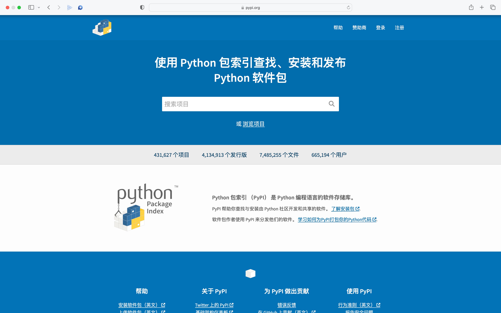

查询自己想要的第三方库，比如下图查询我自己开发的库：Code1v1

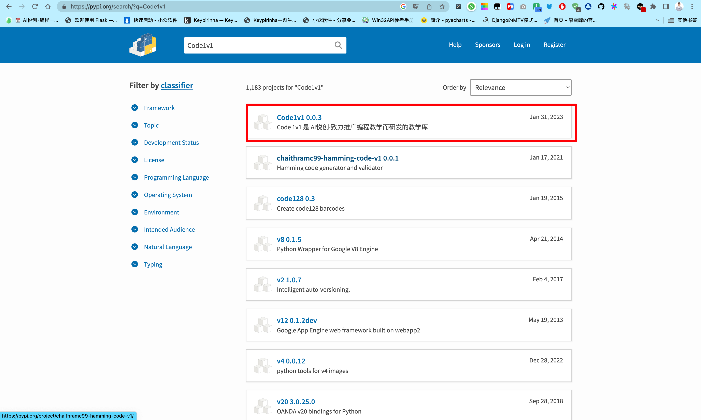

### 1.2 第三方库如何安装？

Python 的便捷性，可以让我使用下面的命令进行安装第三方库：

#### MacOS

```python
pip3 install 库名称
```

#### Windows

```python
pip install 库名称
```

::: tip 提示

今后安装 Python 第三方库，都可以使用 `pip install 库名称` 。

举个例子🌰：我们现在要安装 pygame 来为我们后续的游戏开发做准备，那么安装 pygame 的命令就是：

```python
pip install pygame
```

命令「指令」中的 pygame 就是我们所说的**库名称**。

如果实在不清楚，可以直接查询所需要的库，网站都会给你提供安装命令。

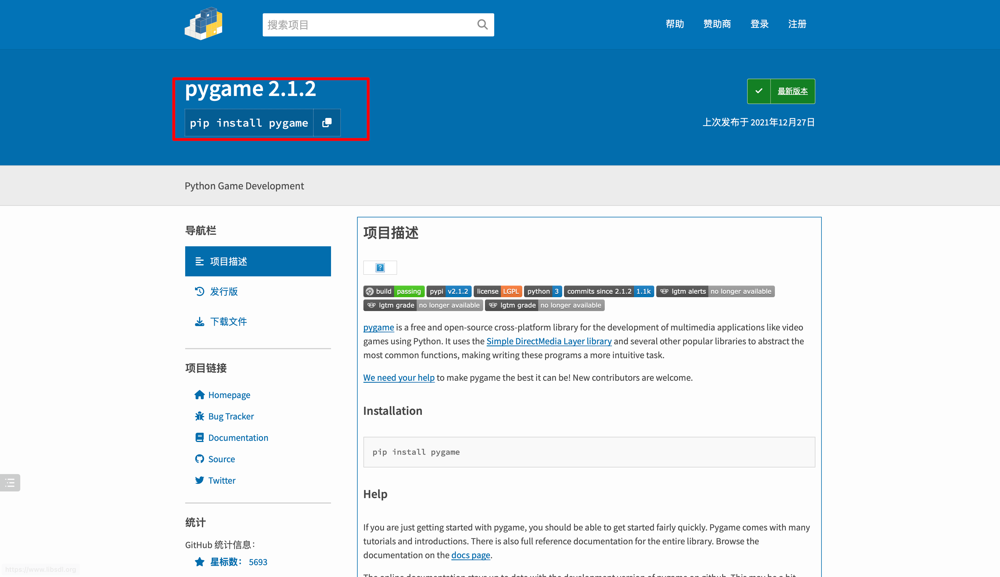

:::

### 1.3 理解命令

- 体育老师：小悦，马上去跑三圈。
- 语文老师：小悦，马上罚你抄写课本 120 页，30 遍。没抄完不可以放学！
- 妈妈：马上关掉游戏！去吃饭！

上面不管是体育老师、语文老师、妈妈都是在下达命令，也可以理解为指令。

所以，[1.2](#_1-2-第三方库如何安装) 中的安装命令，其实就是：让计算机去给我们执行某种任务。比如：安装 pygame。

### 1.4 具体的安装流程

### MacOS

1. 打开终端

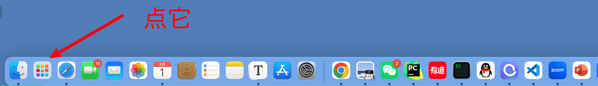

2. 点击其他、终端

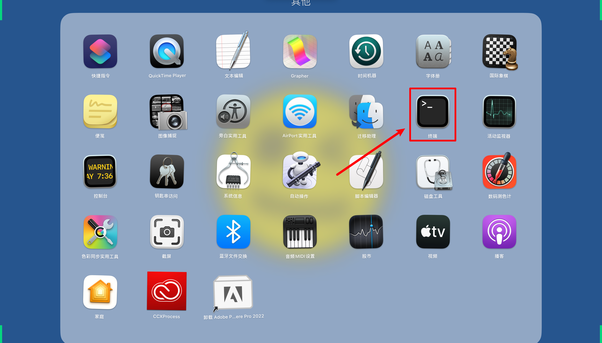

3. 输入安装命令：`pip3 install pygame`

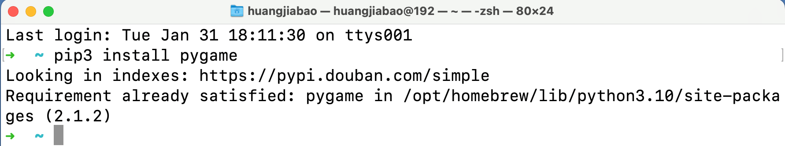

4. 安装完成

#### Windows

1. 键盘上**开始**按键 + **R** 会出现运行

::: center

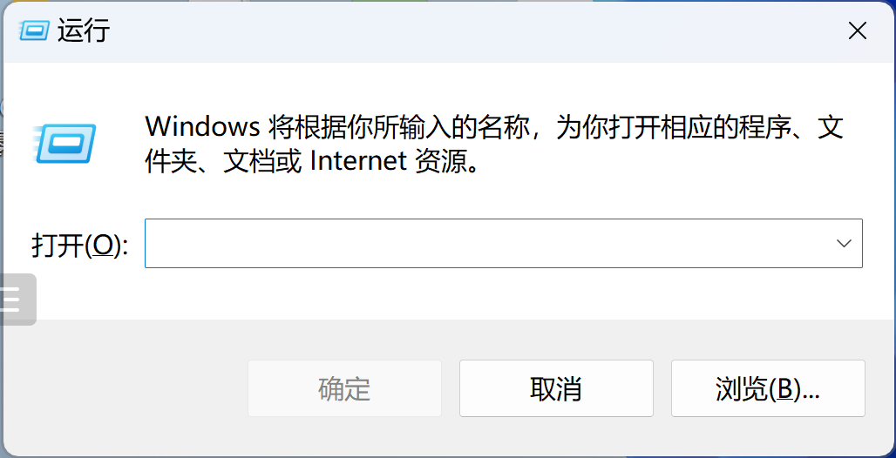

:::

2. 输入：cmd 回车

::: center

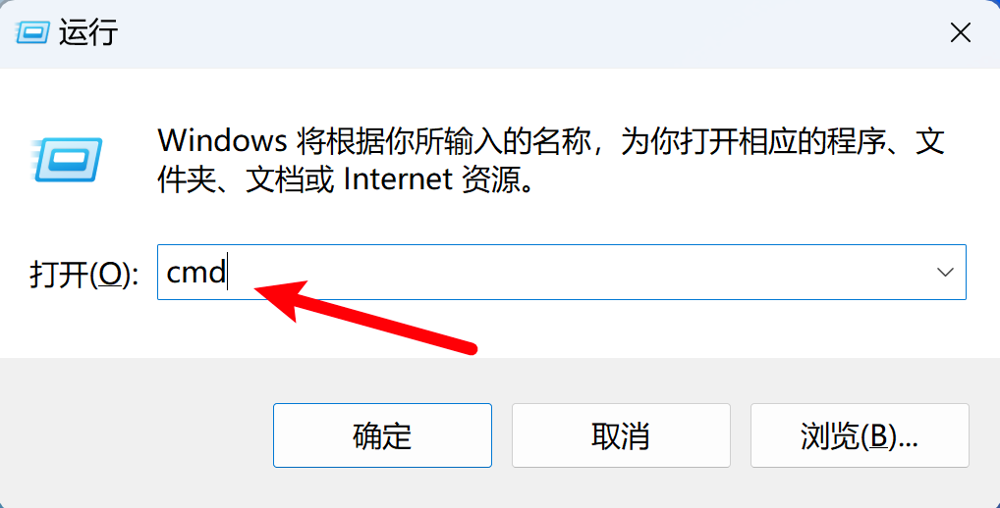

:::

3. 出现命令行「终端」

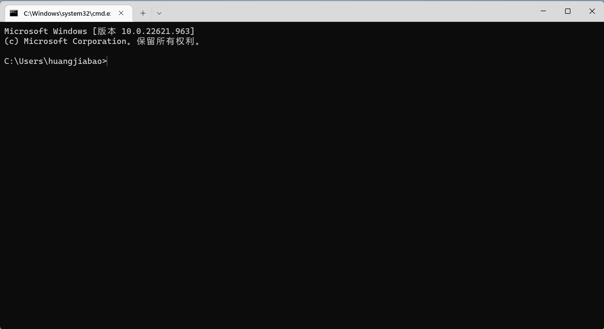

4. 输入安装命令并回车，`pip install pygame`

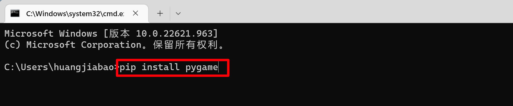

5. 正在安装

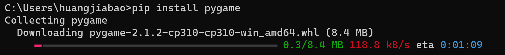

6. 安装完成

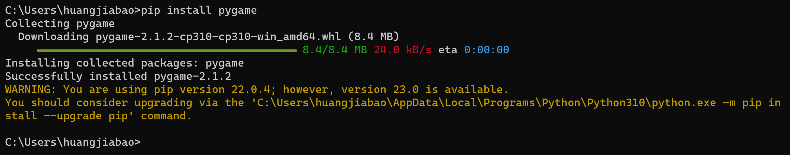

## 2. Pygame 简单介绍

Pygame 是 Python 中比较流行的游戏库，它提供的函数能够处理图像、文本、声音等，也有一些商业游戏项目采用 Pygame 开发，但一般来说不适合开发大型游戏，我们学习 Python 编程用它比较合适（另外，从此处开始，就要大量使用函数等内容了，难度会逐步加大）。

### 2.1 案例1：Pygame 初体验

::: tip 案例1 详情

新建代码文件来测试 pygame 的效果，同时学习如何导入 Python 库的方法。

:::

### 2.2 新建 Python 文件

::: center

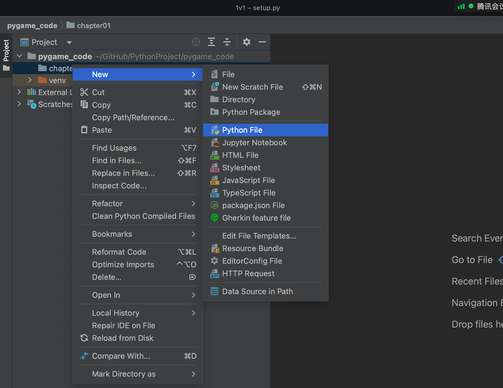

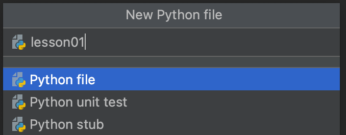

:::

### 2.3 编写导入库

要使用额外的库，不管 Python 内置库还是第三方库。都需要使用 `import` 来导入对应的库。代码如下：

```python
import pygame  # 导入 pygame 库
```

如果，只想导入库中的某一部分功能，我们可以通过 "`.`" 来一层一层找到具体需要的功能「Line 2」，也可以使用 “`from 库名称 import 具体功能`” 「Line 2」的方法。

```python {2,4}
import pygame  # 导入 pygame 库
import pygame.examples.aliens
# 接下来导入 pygame 库中的 aliens
from pygame.examples import aliens
# 运行 aliens 的主函数入口
pygame.examples.aliens.main()
```


### 2.4 导入 pygame examples

::: info 关于

Pygame 自带了一些内置小游戏，examples 里面还有很多其他样例游戏，你可以自行查看。

更多 pygame 内置游戏：[https://www.pygame.org/docs/ref/examples.html](https://www.pygame.org/docs/ref/examples.html)

:::

:::: tabs

@tab 1. aliens

```python {3,5}
import pygame  # 导入 pygame 库
# 接下来导入 pygame 库中的 aliens
from pygame.examples import aliens
# 运行 aliens 的主函数入口
pygame.examples.aliens.main()
```

**游戏界面：**

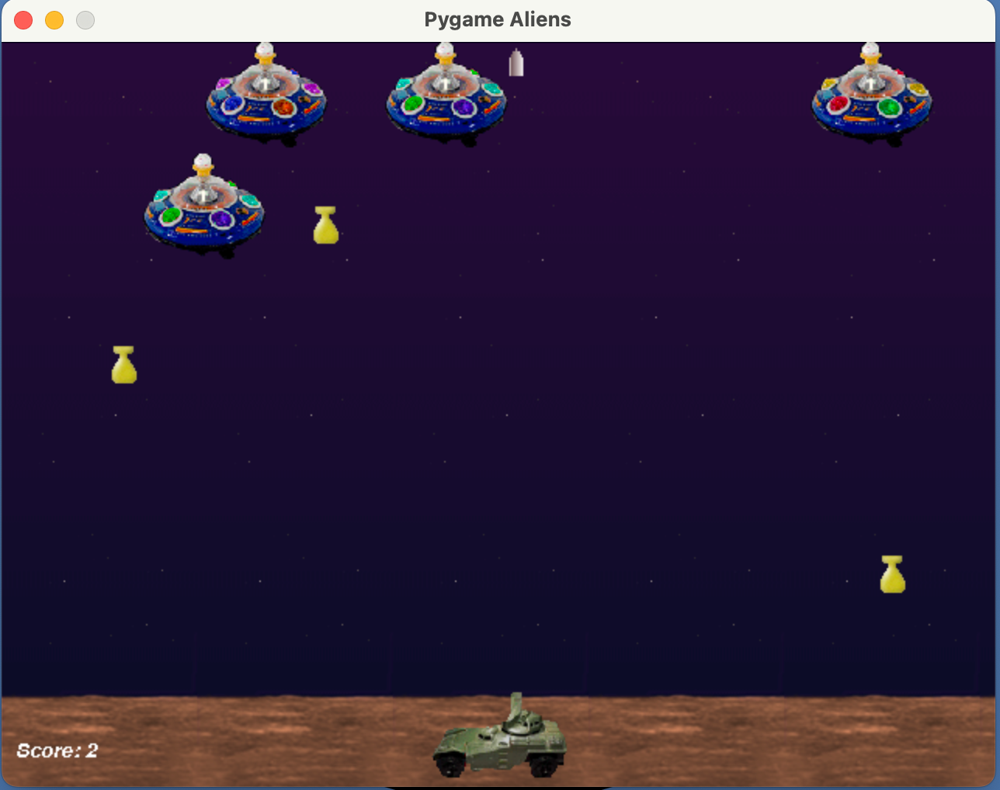


@tab 2. stars

```python {3,5}
import pygame  # 导入 pygame 库
# 接下来导入 pygame 库中的 stars
from pygame.examples import stars
# 运行 stars 的主函数入口
pygame.examples.stars.main()
```

**游戏界面：**

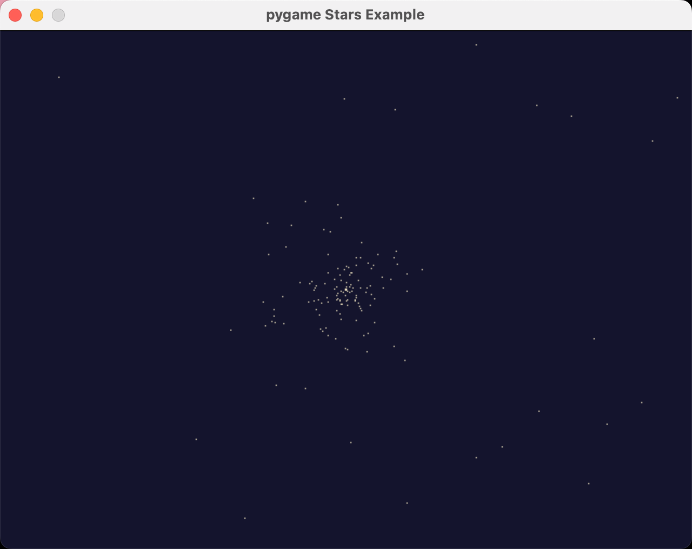

@tab 3. chimp

```python {3,5}
import pygame  # 导入 pygame 库
# 接下来导入 pygame 库中的 chimp
from pygame.examples import chimp
# 运行 chimp 的主函数入口
pygame.examples.chimp.main()
```

**游戏界面：**

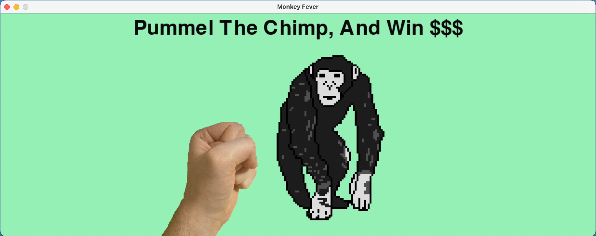

@tab 4. moveit

```python {3,5}
import pygame  # 导入 pygame 库
# 接下来导入 pygame 库中的 moveit
from pygame.examples import moveit
# 运行 moveit 的主函数入口
pygame.examples.moveit.main()
```

**游戏界面：**

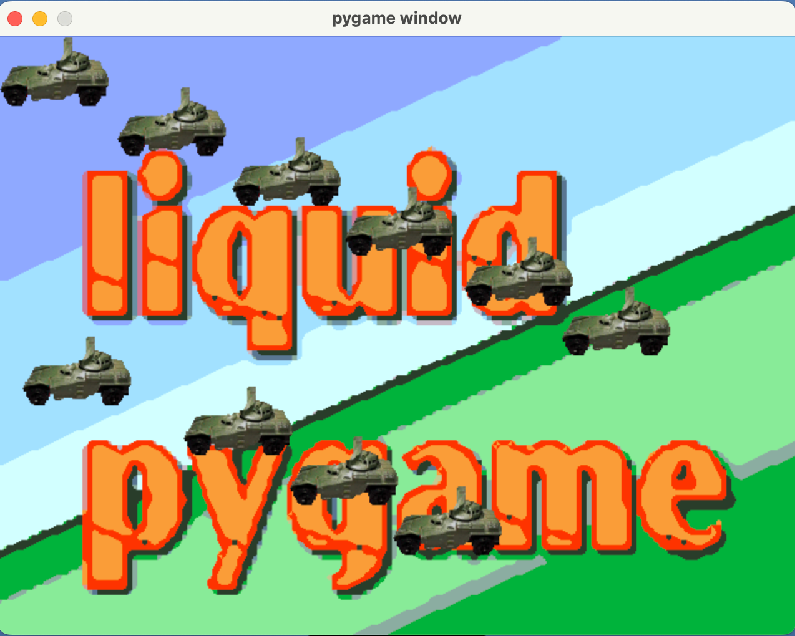

@tab 5. fonty

```python {3,5}
import pygame  # 导入 pygame 库
# 接下来导入 pygame 库中的 fonty
from pygame.examples import fonty
# 运行 fonty 的主函数入口
pygame.examples.fonty.main()
```

**游戏界面：**


::::

## 3. 创建窗体、背景

### 3.1 案例2：初始化窗口

::: tip 案例2 详情

通过编写一个窗体界面，来体验 Pygame 的初始化、颜色处理、事件获取等功能。

:::

### 3.2 编写代码

```python
import pygame  # 导入 pygame 库

# 进入游戏时需要加载游戏——可理解为：游戏初始化
pygame.init()  # 调用初始化函数

screen_width = 600  # 窗口宽度
screen_height = 400  # 窗口高度
screen_size = (screen_width, screen_height)  # 存放在我们的元组中
screen = pygame.display.set_mode(screen_size)  # screen 接收了 pygame 建立的对象，对象之后会学到。
```

接下来，我们可以运行看看效果，注意这个窗口会一闪而过，如下图：

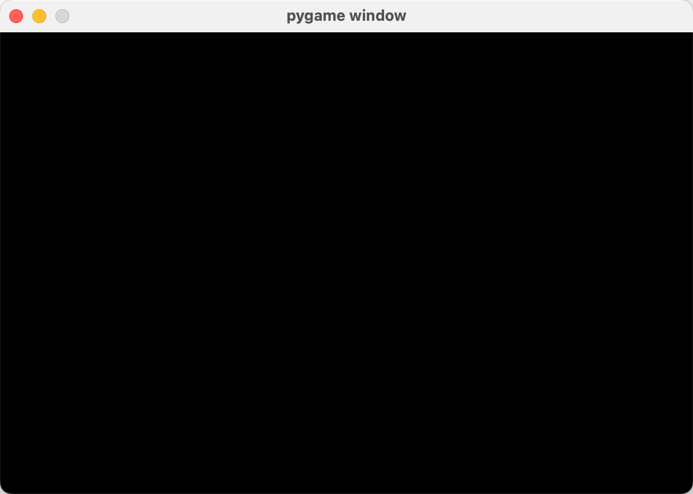

### 3.3 代码解析

#### 3.3.0 涉及的单词

- init：初始化（initialization）
- screen: 屏幕，荧光屏
- width：宽度，广度
- height：身高；高；高度；高处，高地

#### 3.3.1 import pygame  # 导入 pygame 库

导入 Pygame 库，便于后面使用 Pygame 中的功能函数。

#### 3.3.2 pygame.init()  # 调用初始化函数

进入游戏时需要加载游戏——可理解为：游戏初始化，下图为 QQ 飞车进入时的加载「初始化」。


#### 3.3.3 窗口大小设置

```python
screen_width = 600  # 窗口宽度
screen_height = 400  # 窗口高度
screen_size = (screen_width, screen_height)  # 存放在我们的元组中,元组不可变
```

#### 3.3.4 pygame.display.set_mode()

```python
screen = pygame.display.set_mode(screen_size)  # screen 接收了 pygame 建立的对象，对象之后会学到。
```


## 4. 处理窗口一闪而过的问题

::: tip 说明

A. 接下来继续上面 3 的代码，继续完后编写。主要完成持续运行、画面更新和单击右上角 `X` 退出程序。

B. 退出功能需要使用 sys 库，这是 Python 的内置库，不用额外下载安装，直接导入在代码前面即可。导入代码：`import sys`

:::

### 4.1 代码编写

```python
import sys

import pygame  # 导入 pygame 库
# --snip--
screen = pygame.display.set_mode(screen_size)  # screen 接收了 pygame 建立的对象，对象之后会学到。
# 要想程序持续运行，需要使用到循环
while True:
    # 在循环中，每循环一次就判断要不要退出
    for event in pygame.event.get():
        # 使用 for 循环获取当前 pygame 窗体的事件
        if event.type == pygame.QUIT:
            # 如果获取到的事件类型是 QUIT「退出」
            sys.exit()  # 那么调用系统退出
    # 每次判断完毕后，就要更新窗口画面
    pygame.display.update()  # update 意为更新
```

::: warning

A. 注意缩进，每次遇到循环、判断、函数等，都要注意 4 个空格缩进，这样才能体现层级关系，才能让程序按预想正常运行（Python 严格依靠缩进来区别不同的代码块）

B. 对于 4 个空格，其实也可以使用 Tab 键来代替，不过一般推荐使用空格来缩进。

:::

### 4.2 单词

- while：直到……为止、循环「计算机」
- True：真实的；正确的、真「计算机」
- event：事件，大事「你点击鼠标、你拿起手机、你端起电脑，这些都是事件」。
- get：获得，得到
- type：类型，种类
- quit：停止，戒掉
- sys：系统
- exit：出口，通道，退出（电脑程序）
- display：展示，陈列；显露，表现；（计算机）显示；
- update：（计算机软件的）更新；新型，新版

## 5. 为窗口设置名称和背景

### 5.1 设置窗口名称

接下来添加窗口名称，这部分代码需要写在循环前面。也就是下方第 7 行代码。

```python {6-7}
import sys

import pygame  # 导入 pygame 库

# --snip--
# 可以设定窗口名称
pygame.display.set_caption("我第一个游戏")

# ------第一步代码完成，程序运行会有黑色窗口闪过------
# 要想程序持续运行，需要使用到循环
while True:
    # 在循环中，每循环一次就判断要不要退出
    for event in pygame.event.get():
        # 使用 for 循环获取当前 pygame 窗体的事件
        if event.type == pygame.QUIT:
            # 如果获取到的事件类型是 QUIT「退出」
            sys.exit()  # 那么调用系统退出
    # 每次判断完毕后，就要更新窗口画面
    pygame.display.update()  # update 意为更新
# ------第二步完成，现在窗口不会闪退，可以使用鼠标关闭------
```

运行效果：

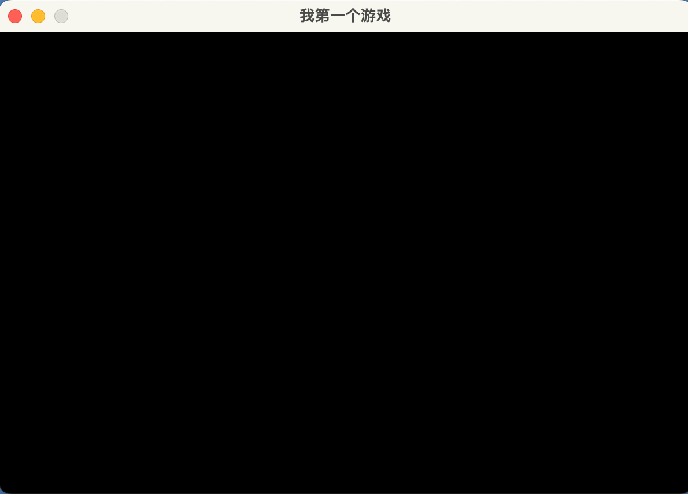

### 5.2 设置窗口背景颜色

接下来设置窗口背景颜色，可以独立写在循环前面也可以直接写在循环内的 `screen.fill(bgcolor)` 。

独立写在循环外面需要，把 rgb 存储在列表当中，下方第 8 行代码。

```python {6-8,19-21}
import sys

import pygame  # 导入 pygame 库

# --snip--
# 定义一个列表存储背景色，采用 rgb 颜色表示
# 可搜索 rgb 颜色对照表，选择自己喜欢颜色的数值
bgcolor = [0, 0, 255]  # 设置背景色 rgb，也可以使用 #0000FF

# ------第一步代码完成，程序运行会有黑色窗口闪过------
# 要想程序持续运行，需要使用到循环
while True:
    # 在循环中，每循环一次就判断要不要退出
    for event in pygame.event.get():
        # 使用 for 循环获取当前 pygame 窗体的事件
        if event.type == pygame.QUIT:
            # 如果获取到的事件类型是 QUIT「退出」
            sys.exit()  # 那么调用系统退出
    # 设置好 rgb，就需要填充。如同，我们画画前挑选需要颜色的画笔
    # 背景色需要使用 fill() 填充，我们需要不停的填充，所以需要放在循环当中
    screen.fill(bgcolor)  # screen.fill("#0000FF")  也可以直接填写
    # 每次判断完毕后，就要更新窗口画面
    pygame.display.update()  # update 意为更新
# ------第二步完成，现在窗口不会闪退，可以使用鼠标关闭------
```

## 6. 此阶段的完整代码

```python
# -*- coding: utf-8 -*-
# @Time    : 2023/2/1 10:14
# @Author  : AI悦创
# @FileName: Code01.py
# @Software: PyCharm
# @Blog    ：https://bornforthis.cn/
import sys

import pygame  # 导入 pygame 库

# 进入游戏时需要加载游戏——可理解为：游戏初始化
pygame.init()  # 调用初始化函数

screen_width = 600  # 窗口宽度
screen_height = 400  # 窗口高度
screen_size = (screen_width, screen_height)  # 存放在我们的元组中

screen = pygame.display.set_mode(screen_size)  # screen 接收了 pygame 建立的对象，对象之后会学到。

# 可以设定窗口名称
pygame.display.set_caption("我第一个游戏")
# 定义一个列表存储背景色，采用 rgb 颜色表示
# 可搜索 rgb 颜色对照表，选择自己喜欢颜色的数值
bgcolor = [0, 0, 255]  # 设置背景色 rgb

# ------第一步代码完成，程序运行会有黑色窗口闪过------
# 要想程序持续运行，需要使用到循环
while True:
    # 在循环中，每循环一次就判断要不要退出
    for event in pygame.event.get():
        # 使用 for 循环获取当前 pygame 窗体的事件
        if event.type == pygame.QUIT:
            # 如果获取到的事件类型是 QUIT「退出」
            sys.exit()  # 那么调用系统退出
    # 设置好 rgb，就需要填充。如同，我们画画前挑选需要颜色的画笔
    # 背景色需要使用 fill() 填充，我们需要不停的填充，所以需要放在循环当中
    screen.fill("#1fef37")  # screen.fill("#0000FF")  也可以直接填写
    # 每次判断完毕后，就要更新窗口画面
    pygame.display.update()  # update 意为更新
# ------第二步完成，现在窗口不会闪退，可以使用鼠标关闭------
```

