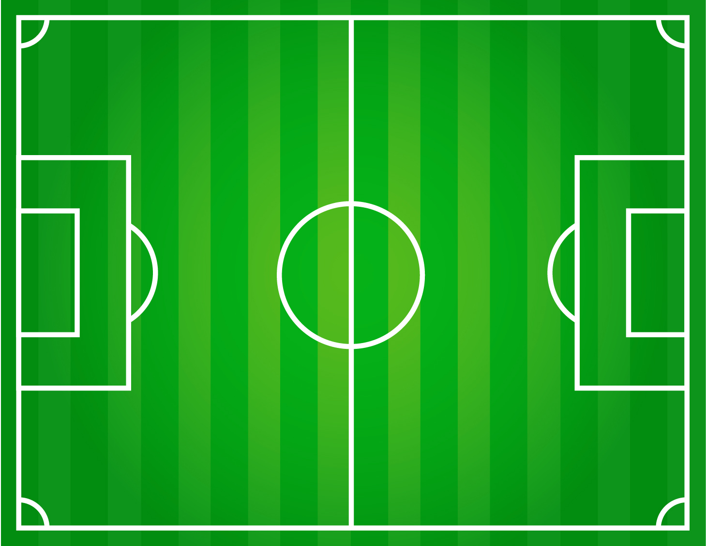
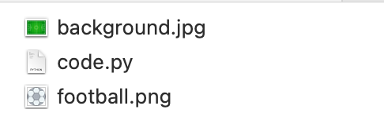
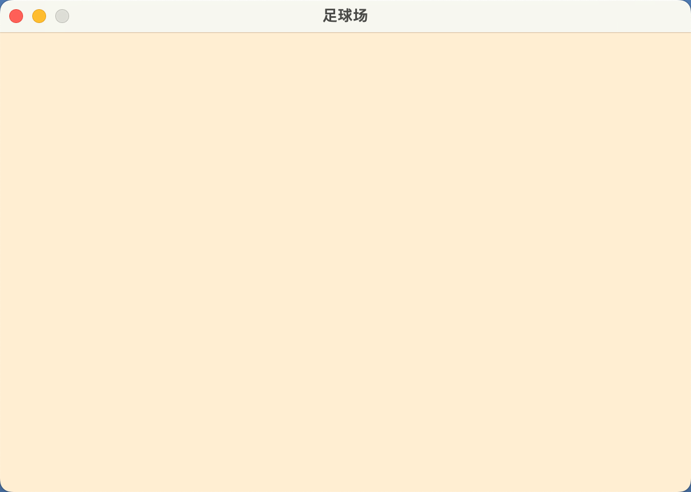
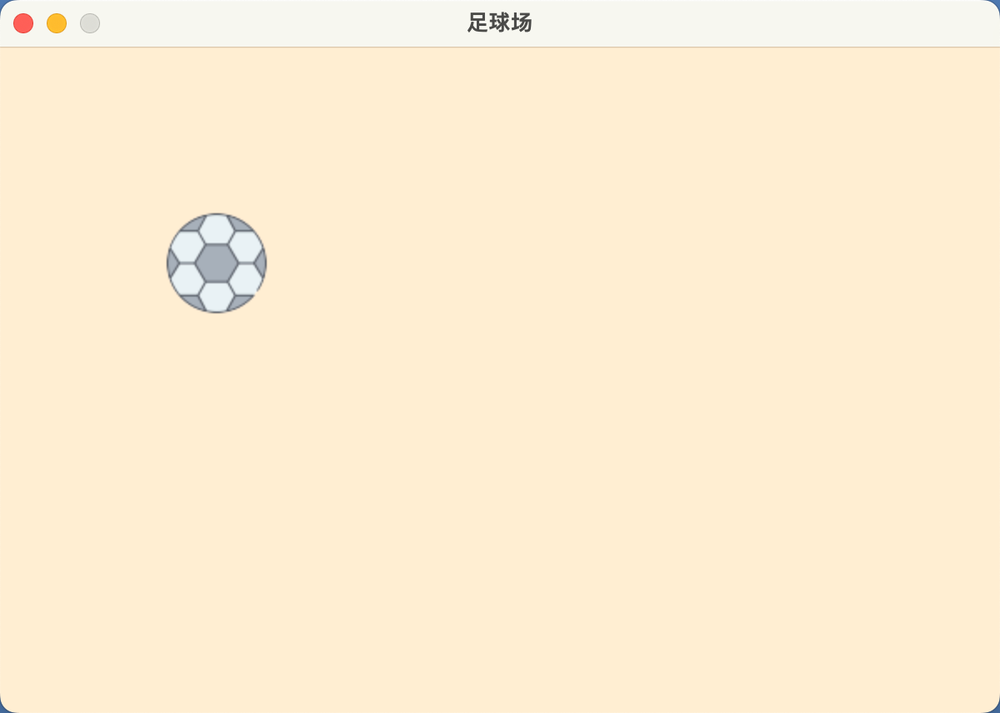
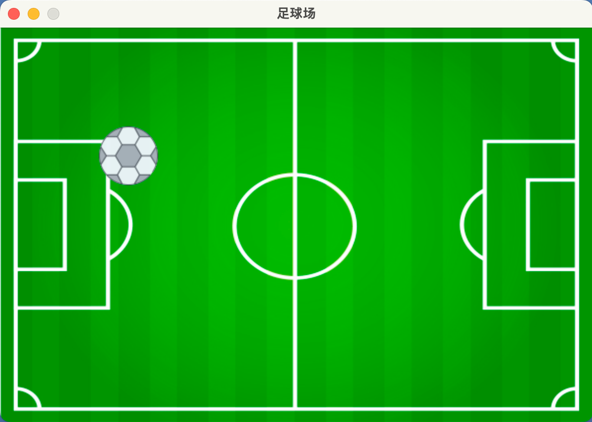
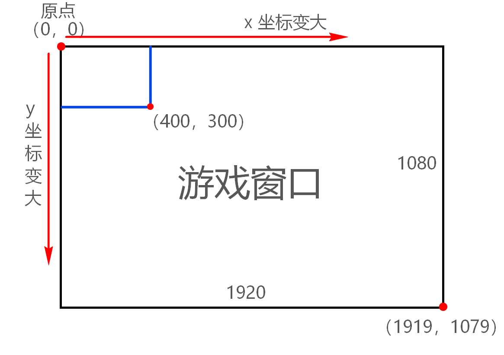

## 0. 目录

- 载入图片、调整大小
- 图片显示规则
- 足球反弹

## 1. 载入图片、调整大小

::: info 案例1

新建文件，准备好两个图片文件「可自行下载喜欢的图片，这两个图片完整文件名已经改为：`football.png` 和 `background.jpg`」，三个文件放在同一个文件夹内，然后编写代码进行图片的载入和大小调整。

:::

::: tabs

@tab football.png


@tab background.jpg



:::

## 2. 先编写基本窗口并优化

### 2.1 前面编写的初始化窗口的代码

```python
import sys

import pygame  # 导入 pygame 库

# 进入游戏时需要加载游戏——可理解为：游戏初始化
pygame.init()  # 调用初始化函数

screen_width = 600  # 窗口宽度
screen_height = 400  # 窗口高度
screen_size = (screen_width, screen_height)  # 存放在我们的元组中
pygame.display.set_caption("足球场")
# 定义一个列表存储背景色，采用 rgb 颜色表示
# 可搜索 rgb 颜色对照表，选择自己喜欢颜色的数值

bgcolor = [255, 239, 213]  # 设置背景色 rgb，也可以使用
screen = pygame.display.set_mode(screen_size)  # screen 接收了 pygame 建立的对象，对象之后会学到。
# 想要程序持续运行，需要使用到循环
while True:
    # 在循环中，每循环一次就判断要不要退出
    for event in pygame.event.get():
        # 使用 for 循环获取当前 pygame 窗体的事件
        if event.type == pygame.QUIT:
            # 如果获取到的事件类型是 QUIT「退出」
            sys.exit()  # 那么调用系统退出
    # 设置好 rgb，就需要填充。如同，我们画画前挑选需要颜色的画笔
    # 背景色需要使用 fill() 填充，我们需要不停的填充，所以需要放在循环当中
    screen.fill(bgcolor)  # screen.fill("#0000FF")  也可以直接填写
    # 每次判断完毕后，就要更新窗口画面
    pygame.display.update()  # update 意为更新
```

### 2.2 优化退出代码

因为，我们不管写什么游戏，都需要编写退出游戏的代码，而且为了方便阅读，我们接下来进行优化。

我们前面一篇文章中，编写了退出代码，如下高亮部分：

```python {1,15-20}
import sys
import pygame

pygame.init()

screen_width = 600 
screen_height = 400
screen_size = (screen_width, screen_height)
pygame.display.set_caption("足球场")

bgcolor = [255, 239, 213]
screen = pygame.display.set_mode(screen_size)

while True:
    # 在循环中，每循环一次就判断要不要退出
    for event in pygame.event.get():
        # 使用 for 循环获取当前 pygame 窗体的事件
        if event.type == pygame.QUIT:
            # 如果获取到的事件类型是 QUIT「退出」
            sys.exit()  # 那么调用系统退出

    screen.fill(bgcolor)
    pygame.display.update()
```

我们可以把这部分代码独立写成函数，以便之后调用：

```python {7-10,14}
import sys
import pygame

pygame.init()

# --snip--
def quit():
    for event in pygame.event.get():
        if event.type == pygame.QUIT:
            sys.exit()

while True:
    # 在循环中，每循环一次就判断要不要退出
    quit()
    screen.fill(bgcolor)
    pygame.display.update()
```


### 2.3 涉及的单词

- def: define，定义函数，英语：给……下定义，解释；阐明，使清楚；标明……界限，明确显出……轮廓；是……的特征，为……的特色


## 3. 加载图片

### 3.1 把图片和代码放在同一个文件夹

首先，需要把你的代码和图片放在同一个文件夹下。



### 3.2 加载足球

在 pygame 中的图像相关函数在 image 里，载入使用 `load()` 。

```python {5-8,13}
import sys
import pygame
# --snip--

# 使用变量保存载入的图片，图像函数一般在 image 中
football = pygame.image.load('football.png')
# 载入的图片会被认为是一层一层的面，称为 surface
football = pygame.transform.smoothscale(football, (60, 60))  # 通过 transform 改变 surface 的大小，存回 football 的变量中

while True:
    # 在循环中，每循环一次就判断要不要退出
    quit()
    screen.blit(football, (100, 100))  # 使用 blit() 显示图片，第二个参数是图片坐标
    # screen.blit(显示的图片, 坐标)
    screen.fill(bgcolor)
    pygame.display.update()
```

载入图片时，编写图片所在的路径。因为，我们已经把图片和代码放在同一个文件夹下，所以直接填写完整的图片名称即可。

::: warning

图片名称需要带上图片的格式，例如：jpg、png 等，还需要使用双引号引起来：`'football.png'` 。

:::

对于 pygame 来说：载入的图片会被视为一个表面「surface」，这个面可以被我们改变坐标和大小。

**运行代码后：**



我们发现，空白的只有背景颜色？What？——别急，这是因为 Pygame 的特点，把每一个图片、颜色等都当作一层一层的来操作。

```python
screen.blit(football, (100, 100))  # 使用 blit() 显示图片，第二个参数是图片坐标
screen.fill(bgcolor)
```

意味着，先渲染足球那层，接下来被背景颜色所覆盖。为了让上面的代码正常运行和显示，此时应该怎么办呢？动脑想想吧～

解决无法，正常显示足球：

```python {12-13}
import sys
import pygame
# --snip--
# 使用变量保存载入的图片，图像函数一般在 image 中
football = pygame.image.load('football.png')
# 载入的图片会被认为是一层一层的面，称为 surface
football = pygame.transform.smoothscale(football, (60, 60))  # 通过 transform 改变 surface 的大小，存回 football 的变量中

while True:
    # 在循环中，每循环一次就判断要不要退出
    quit()
    screen.fill(bgcolor)
    screen.blit(football, (100, 100))  # 使用 blit() 显示图片，第二个参数是图片坐标
    pygame.display.update()
```

接下来，运行后，足球就可以正常显示了：



::: info 动手试一试

足球已经被我们成功加载进来了，接下来把足球场加载进来吧！

:::

### 3.3 加载足球场背景

```python {9,14}
import sys
import pygame
# --snip--
# 使用变量保存载入的图片，图像函数一般在 image 中
football = pygame.image.load('football.png')
background = pygame.image.load('background.jpg')
# 载入的图片会被认为是一层一层的面，称为 surface
football = pygame.transform.smoothscale(football, (60, 60))  # 通过 transform 改变 surface 的大小，存回 football 的变量中
background = pygame.transform.smoothscale(background, (600, 400))
while True:
    # 在循环中，每循环一次就判断要不要退出
    quit()
    screen.fill(bgcolor)
    screen.blit(background, (0, 0))  # 从左上角开始显示背景，pygame 左上角才是坐标原点
    screen.blit(football, (100, 100))  # 使用 blit() 显示图片，第二个参数是图片坐标
    pygame.display.update()
```

运行效果：



## 4. Pygame 的坐标

Pygame Zero 坐标系的原点在游戏窗口的左上角，越靠近窗口右侧横坐标（x）越大，越靠近窗口底部纵坐标（y）越大。

- 以左上角为原点 `(0, 0)`



## 5. 使足球移动起来

```python {2-5,11-17}
# --snip--
ball_x = 30  # 设置足球的 x 坐标
ball_y = 20  # 设置足球的 y 坐标
speed_x = 1  # 设置足球的运动速度
speed_y = 1  # 设置足球的运动速度
while True:
    # 在循环中，每循环一次就判断要不要退出
    quit()  # 调用退出处理函数，判断要不要退出
    screen.blit(background, (0, 0))  # 从左上角开始显示背景，pygame 左上角才是坐标原点

    ball_x = ball_x + speed_x  # 循环让坐标发生变化，则足球会运动
    ball_y = ball_y + speed_y
    if ball_x + 60 > screen_width or ball_x < 0:  # 足球碰到左右边界，速度则变成反方向「负数」
        speed_x = -speed_x
    if ball_y + 60 > screen_height or ball_y < 0:  # 上下边界也是一样
        speed_y = -speed_y
    screen.blit(football, (ball_x, ball_y))  # 使用 blit() 显示图片，第二个参数是图片坐标
    pygame.display.update()  # update 意味更新
```

## 6. 完整代码

```python
import sys
import pygame

pygame.init()

screen_width = 600
screen_height = 400
screen_size = (screen_width, screen_height)
pygame.display.set_caption("足球场")

bgcolor = [255, 239, 213]
screen = pygame.display.set_mode(screen_size)


def quit():
    for event in pygame.event.get():
        if event.type == pygame.QUIT:
            sys.exit()


# 使用变量保存载入的图片，图像函数一般在 image 中
football = pygame.image.load('football.png')
background = pygame.image.load('background.jpg')
# 载入的图片会被认为是一层一层的面，称为 surface
football = pygame.transform.smoothscale(football, (60, 60))  # 通过 transform 改变 surface 的大小，存回 football 的变量中
background = pygame.transform.smoothscale(background, (600, 400))
ball_x = 30  # 设置足球的 x 坐标
ball_y = 20  # 设置足球的 y 坐标
speed_x = 1  # 设置足球的运动速度
speed_y = 1  # 设置足球的运动速度
while True:
    # 在循环中，每循环一次就判断要不要退出
    quit()  # 调用退出处理函数，判断要不要退出
    screen.blit(background, (0, 0))  # 从左上角开始显示背景，pygame 左上角才是坐标原点

    ball_x = ball_x + speed_x  # 循环让坐标发生变化，则足球会运动
    ball_y = ball_y + speed_y
    if ball_x + 60 > screen_width or ball_x < 0:  # 足球碰到左右边界，速度则变成反方向「负数」
        speed_x = -speed_x
    if ball_y + 60 > screen_height or ball_y < 0:  # 上下边界也是一样
        speed_y = -speed_y
    screen.blit(football, (ball_x, ball_y))  # 使用 blit() 显示图片，第二个参数是图片坐标
    pygame.display.update()  # update 意味更新
```


