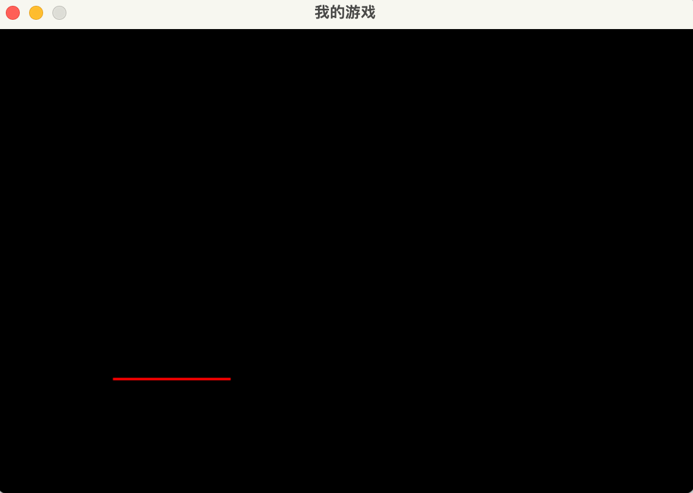
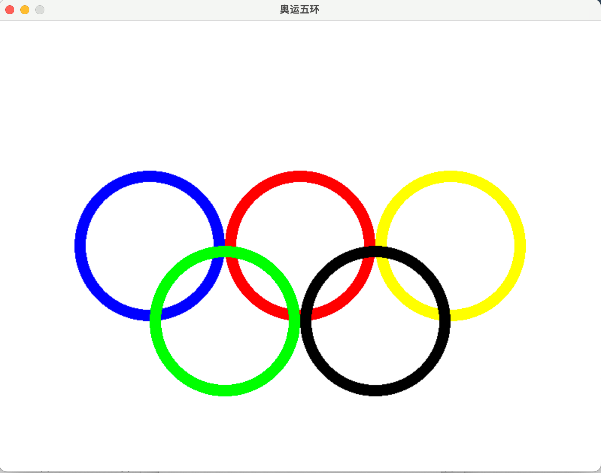
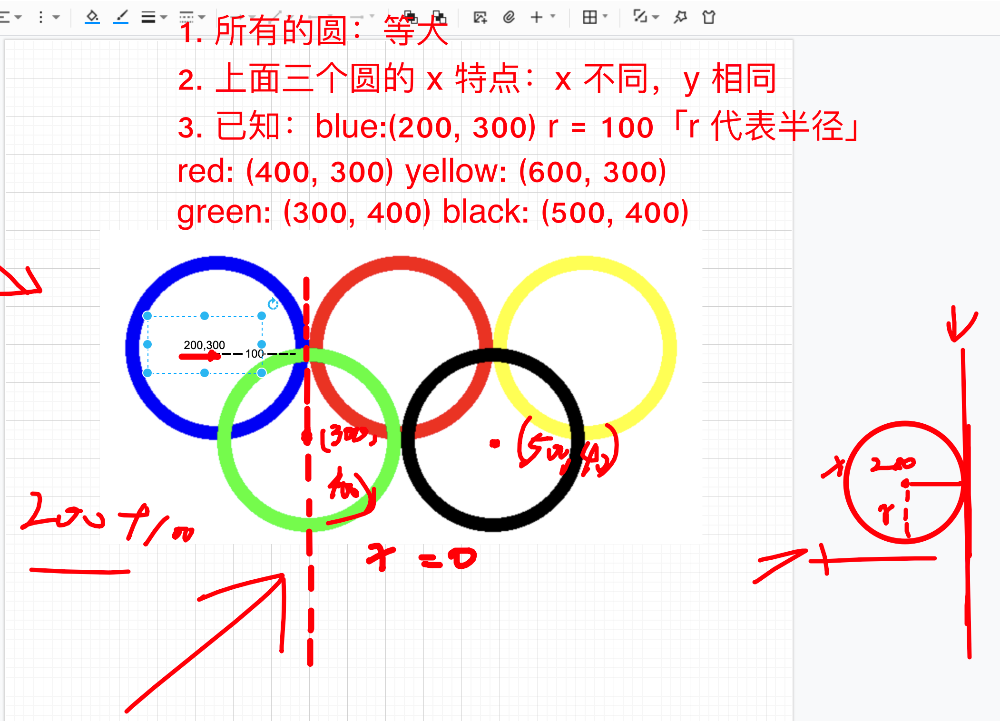

## 0. 目录

- 绘制图形
- 键盘事件处理
- 鼠标事件处理

## 1. 绘制图形

::: info 案例1

新建代码文件，准备好如下代码，然后添加代码实现绘制图形功能。

:::

```python
import sys  # 导入系统库，无须安装
import pygame  # 导入 pygame 库

pygame.init()  # 调用初始化函数

screen_width = 600
screen_height = 400
screen_size = (screen_width, screen_height)
pygame.display.set_caption("我的游戏")

screen = pygame.display.set_mode(screen_size)


def quit():  # 把退出处理，写成函数，方便之后调用
    for event in pygame.event.get():
        if event.type == pygame.QUIT:
            sys.exit()


while True:
    # 在循环中，每循环一次就判断要不要退出
    quit()  # 调用退出处理函数，判断要不要退出
    pygame.display.update()  # update 意味更新
```

在循环部分添加如下几行代码实现绘制图形。

### 1.1 画直线 line()

```python {5-7}
# --snip--
while True:
    quit()  # 调用退出处理函数，判断要不要退出
    # 绘制图形都是在 draw 下，画直线就用 line()
    pygame.draw.line(screen, (255, 0, 0), (100, 300), (200, 300), 2)
    # pygame.draw.line(screen, "red", (100, 300), (200, 300), 2)
    # pygame.draw.line(屏幕/窗口, 颜色(rgb), 起点, 终点, 粗细)
    pygame.display.update()  # update 意味更新
```



::: info 练习

你已经成功画出直线了，那你发挥你聪明的大脑，画一个边长 100 的正三角形吧。

:::

### 1.2 画矩形 rect()

```python {5-6}
# --snip--
while True:
    quit()  # 调用退出处理函数，判断要不要退出
    # --snip--
    pygame.draw.rect(screen, (0, 255, 0), (10, 20, 100, 100), 10)
    # pygame.draw.rect(屏幕/窗口, 颜色(rgb), (x, y, x_length, y_length), 粗细)
    pygame.display.update()  # update 意味更新
```


### 1.3 画圆形 circle()

```python
# --snip--
while True:
    quit()  # 调用退出处理函数，判断要不要退出
    # --snip--
    pygame.draw.circle(screen, (0, 0, 255), (300, 300), 50, 0)
    # pygame.draw.circle(屏幕/窗口, 颜色(rgb), 圆心坐标, 半径, 粗细「0 代表实心」) 
    pygame.display.update()  # update 意味更新
```

::: info 练习

你已经成功画出圆形了，现在试一试画出如下效果：





:::


## 2. 键盘事件处理

::: info 案例2

新建代码文件，编写游戏的基本窗口和退出处理功能，接下来编写键盘检测，用键盘来控制圆形的位置，按一下“wsad”中任意一个按键，就会动一下位置。

:::

接下来，我将带你一步步实现上面的案例2。

### 2.0 游戏的基本窗口

```python
import pygame  # 导入 pygame 库

pygame.init()  # 调用初始化函数

screen_width = 600
screen_height = 400
screen_size = (screen_width, screen_height)
pygame.display.set_caption("我的游戏")

screen = pygame.display.set_mode(screen_size)

while True:
    pygame.display.update()  # update 意味更新
```


### 2.1 获取键盘的事件并判断

```python {1,14-28}
import sys  # 导入系统库，无须安装
import pygame  # 导入 pygame 库

pygame.init()  # 调用初始化函数

screen_width = 600
screen_height = 400
screen_size = (screen_width, screen_height)
pygame.display.set_caption("我的游戏")

screen = pygame.display.set_mode(screen_size)

while True:
    for event in pygame.event.get():
        if event.type == pygame.KEYDOWN:
            # 如果事件类型是 KEYDOWN，说明有按键按下了
            if event.key == pygame.K_a:
                # 再来检测「判断」是按下哪个按键
                print("你按下了键盘 A 键")
            if event.key == pygame.K_d:
                print("你按下了键盘 D 键")
            if event.key == pygame.K_w:
                print("你按下了键盘 W 键")
            if event.key == pygame.K_s:
                print("你按下了键盘 S 键")
            if event.key == pygame.K_q:
                print("你按下了键盘 q 键, 游戏结束 END, Bye～")
                sys.exit()  # 按 q 就退出程序
    pygame.display.update()
```

::: tip 提示

在运行测试代码时，需要提前把你的输入法改成英文输入法，否则会出现程序无法正常实现的问题。

:::

### 2.2 键盘与 pygame 对照表

::: details 点击展开

```
pygame
Constant      ASCII   Description
---------------------------------
K_BACKSPACE   \b      backspace
K_TAB         \t      tab
K_CLEAR               clear
K_RETURN      \r      return
K_PAUSE               pause
K_ESCAPE      ^[      escape
K_SPACE               space
K_EXCLAIM     !       exclaim
K_QUOTEDBL    "       quotedbl
K_HASH        #       hash
K_DOLLAR      $       dollar
K_AMPERSAND   &       ampersand
K_QUOTE               quote
K_LEFTPAREN   (       left parenthesis
K_RIGHTPAREN  )       right parenthesis
K_ASTERISK    *       asterisk
K_PLUS        +       plus sign
K_COMMA       ,       comma
K_MINUS       -       minus sign
K_PERIOD      .       period
K_SLASH       /       forward slash
K_0           0       0
K_1           1       1
K_2           2       2
K_3           3       3
K_4           4       4
K_5           5       5
K_6           6       6
K_7           7       7
K_8           8       8
K_9           9       9
K_COLON       :       colon
K_SEMICOLON   ;       semicolon
K_LESS        <       less-than sign
K_EQUALS      =       equals sign
K_GREATER     >       greater-than sign
K_QUESTION    ?       question mark
K_AT          @       at
K_LEFTBRACKET [       left bracket
K_BACKSLASH   \       backslash
K_RIGHTBRACKET ]      right bracket
K_CARET       ^       caret
K_UNDERSCORE  _       underscore
K_BACKQUOTE   `       grave
K_a           a       a
K_b           b       b
K_c           c       c
K_d           d       d
K_e           e       e
K_f           f       f
K_g           g       g
K_h           h       h
K_i           i       i
K_j           j       j
K_k           k       k
K_l           l       l
K_m           m       m
K_n           n       n
K_o           o       o
K_p           p       p
K_q           q       q
K_r           r       r
K_s           s       s
K_t           t       t
K_u           u       u
K_v           v       v
K_w           w       w
K_x           x       x
K_y           y       y
K_z           z       z
K_DELETE              delete
K_KP0                 keypad 0
K_KP1                 keypad 1
K_KP2                 keypad 2
K_KP3                 keypad 3
K_KP4                 keypad 4
K_KP5                 keypad 5
K_KP6                 keypad 6
K_KP7                 keypad 7
K_KP8                 keypad 8
K_KP9                 keypad 9
K_KP_PERIOD   .       keypad period
K_KP_DIVIDE   /       keypad divide
K_KP_MULTIPLY *       keypad multiply
K_KP_MINUS    -       keypad minus
K_KP_PLUS     +       keypad plus
K_KP_ENTER    \r      keypad enter
K_KP_EQUALS   =       keypad equals
K_UP                  up arrow
K_DOWN                down arrow
K_RIGHT               right arrow
K_LEFT                left arrow
K_INSERT              insert
K_HOME                home
K_END                 end
K_PAGEUP              page up
K_PAGEDOWN            page down
K_F1                  F1
K_F2                  F2
K_F3                  F3
K_F4                  F4
K_F5                  F5
K_F6                  F6
K_F7                  F7
K_F8                  F8
K_F9                  F9
K_F10                 F10
K_F11                 F11
K_F12                 F12
K_F13                 F13
K_F14                 F14
K_F15                 F15
K_NUMLOCK             numlock
K_CAPSLOCK            capslock
K_SCROLLOCK           scrollock
K_RSHIFT              right shift
K_LSHIFT              left shift
K_RCTRL               right control
K_LCTRL               left control
K_RALT                right alt
K_LALT                left alt
K_RMETA               right meta
K_LMETA               left meta
K_LSUPER              left Windows key
K_RSUPER              right Windows key
K_MODE                mode shift
K_HELP                help
K_PRINT               print screen
K_SYSREQ              sysrq
K_BREAK               break
K_MENU                menu
K_POWER               power
K_EURO                Euro
K_AC_BACK             Android back button
```

:::

### 2.3 实现移动圆形

要实现圆形移动，我们需要先画出圆形。

```python {5}
import sys  # 导入系统库，无须安装
import pygame  # 导入 pygame 库

# --snip--
    pygame.draw.circle(screen, (255, 0, 255), (100, 300), 50, 0)
    pygame.display.update()  # update 意味更新
```

使圆移动起来的本质，其实就是圆的坐标移动。

来设置圆坐标相关的变量，代码如下：

```python {4-5,8}
import sys  # 导入系统库，无须安装
import pygame  # 导入 pygame 库
# --snip--
circle_x = 100
circle_y = 300

# --snip--
    pygame.draw.circle(screen, (255, 0, 255), (circle_x, circle_y), 50, 0)
    pygame.display.update()  # update 意味更新
```

上面只是实现的基本的圆移动操作的第一步，我们还没开始操作坐标的变化、键盘的识别。接下来，来编写这部分的代码。

```python {20,23,26,29,34,}
import sys  # 导入系统库，无须安装
import pygame  # 导入 pygame 库
# --snip--
circle_x = 100
circle_y = 300
while True:
    for event in pygame.event.get():
        if event.type == pygame.KEYDOWN:
            # 如果事件类型是 KEYDOWN，说明有按键按下了
            if event.key == pygame.K_a:
                # 再来检测「判断」是按下哪个按键
                circle_x -= 1
                print("你按下了键盘 A 键")
            if event.key == pygame.K_d:
                circle_x += 1
                print("你按下了键盘 D 键")
            if event.key == pygame.K_w:
                circle_y -= 1
                print("你按下了键盘 W 键")
            if event.key == pygame.K_s:
                circle_y += 1
                print("你按下了键盘 S 键")
            if event.key == pygame.K_q:
                print("你按下了键盘 q 键, 游戏结束 END, Bye～")
                sys.exit()  # 按 q 就退出程序
    screen.fill((0, 0, 0))
    pygame.draw.circle(screen, (255, 0, 255), (circle_x, circle_y), 50, 0)
    pygame.display.update()  # update 意味更新
```

貌似现在速度不够快，我们可以稍微进阶，设一个变量 `circle_speed` 作为速度，代码如下：

```python {4,11,14,17,20}
import sys  # 导入系统库，无须安装
import pygame  # 导入 pygame 库
# --snip--
circle_speed = 10  # 移动速度
while True:
    for event in pygame.event.get():
        if event.type == pygame.KEYDOWN:
            # 如果事件类型是 KEYDOWN，说明有按键按下了
            if event.key == pygame.K_a:
                # 再来检测「判断」是按下哪个按键
                circle_x -= circle_speed
                print("你按下了键盘 A 键")
            if event.key == pygame.K_d:
                circle_x += circle_speed
                print("你按下了键盘 D 键")
            if event.key == pygame.K_w:
                circle_y -= circle_speed
                print("你按下了键盘 W 键")
            if event.key == pygame.K_s:
                circle_y += circle_speed
                print("你按下了键盘 S 键")
            if event.key == pygame.K_q:
                print("你按下了键盘 q 键, 游戏结束 END, Bye～")
                sys.exit()  # 按 q 就退出程序
    screen.fill((0, 0, 0))
    pygame.draw.circle(screen, (255, 0, 255), (circle_x, circle_y), 50, 0)
    pygame.display.update()  # update 意味更新
```

## 3. 鼠标事件处理

::: info 案例3

使用鼠标点击圆形变换颜色

:::

### 3.1 随机库 random

在一个遥远的魔法森林里，有一个神奇的数字树。这棵数字树能够结出非常特殊的果实，这些果实里藏着神奇的整数。森林里的小动物们都喜欢玩一个游戏：猜数字树上长出的数字果实里的整数是什么。

**这个游戏的规则很简单：**

数字树会给出一个范围，比如说 1 到10。然后，小动物们就要猜数字果实里的整数是这个范围内的哪一个。但是，这个数字果实非常神奇，每次玩游戏时，它里面的整数都会变成范围内的一个随机数。

Python 的 `random.randint()` 就像这棵数字树的魔法。当你给它一个范围，比如1到10，它会为你生成一个这个范围内的随机整数。

```python
import random

magic_number = random.randint(1, 10)
print(magic_number)
```

这段代码就像神奇的数字树，它会打印出一个 1 到 10 之间的随机整数，让小动物们玩猜数字游戏。每次运行这段代码，你都可能得到不同的整数，就像每次玩游戏时数字果实里的整数都会变一样。所以，下次你想让你的 Python 程序里有一些随机性，就试试使用 `random.randint()` 吧！

### 3.2


::: info 好句

AI 再厉害，当下的即时反应，有可能还是人脑更快。你在问的同时，我已经给出答案。——AI悦创 2023-05-20 20:03:08

:::


