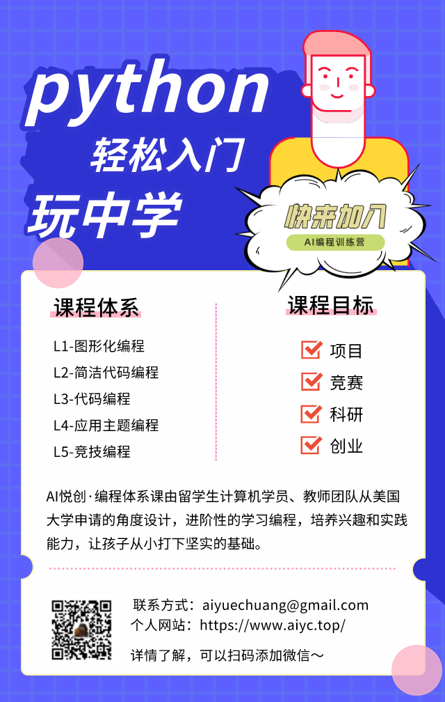
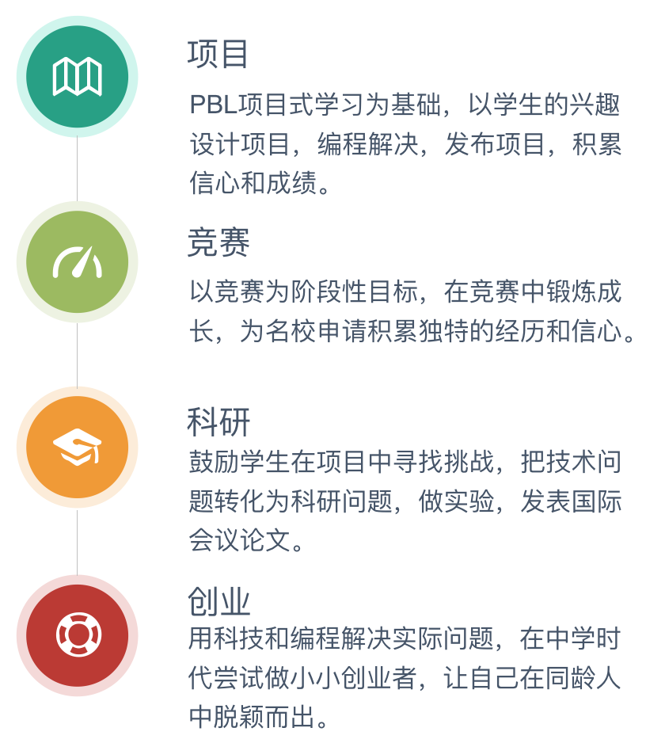
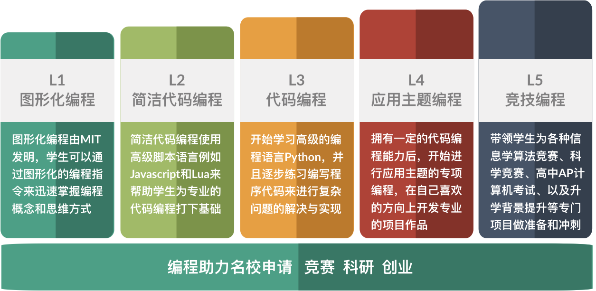
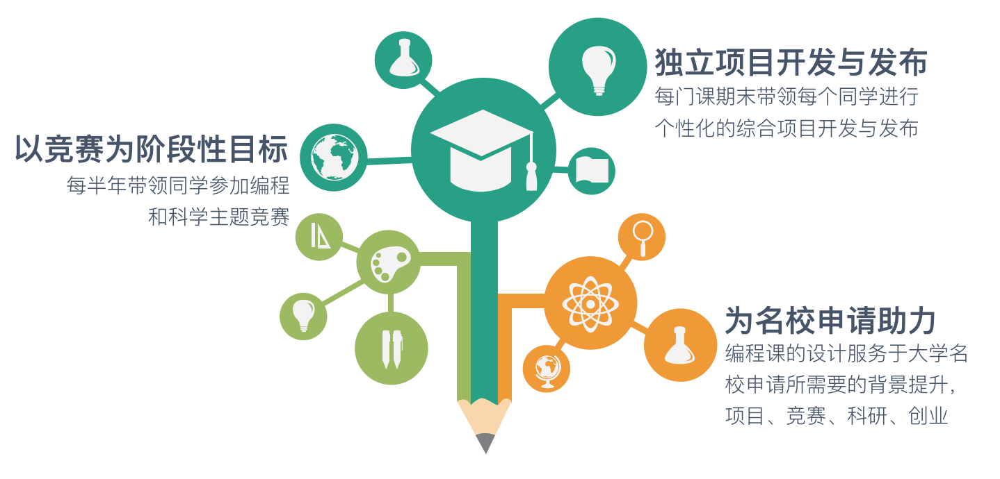

::: info 寄语

编程思维，让孩子更聪明！

:::

::: center

## 高标准 高要求

# 编程助力名校申请

我们对编程的教学要求不是简单的课外兴趣班

而是要为大家提供申请名校的经历、背景与信心

## 编程课程目标

AI悦创·编程课程体系以助力名校申请为核心目标，引导学生学编程、做项目、参加

竞赛、搞科研和创业，通过创新动手提升个人背景

---

## 编程课程体系

AI悦创·编程课程体系由留学生计算机学员、教师团队从美国大学申请的角度设计，进阶性的学习编程，培养兴趣和实践能力，让孩子从小打下坚实的编程基础

所有课程以项目为阶段性目标，增强学生的科技创新背景和信心

:::

1. 书籍源代码：[https://github.com/AndersonHJB/PythonThinking](https://github.com/AndersonHJB/PythonThinking)

::: details .

1. [https://github.com/marblexu?tab=repositories](https://github.com/marblexu?tab=repositories)
2. [https://github.com/marblexu/TankWar](https://github.com/marblexu/TankWar)
3. [https://github.com/marblexu/PythonAngryBirds](https://github.com/marblexu/PythonAngryBirds)
4. [https://github.com/serenity-valley/game](https://github.com/serenity-valley/game)
5. [https://github.com/search?q=python+game](https://github.com/search?q=python+game)
6. [https://www.shizhanmu.com/blog/post/2020/09/22/439/](https://www.shizhanmu.com/blog/post/2020/09/22/439/)
7. [https://www.shizhanmu.com/blog/post/2021/05/12/515/](https://www.shizhanmu.com/blog/post/2021/05/12/515/)
8. [https://tudoubaba.net/ProgrammingHandbook/pythongamezero/pgzero_one_page.html](https://tudoubaba.net/ProgrammingHandbook/pythongamezero/pgzero_one_page.html)

:::
