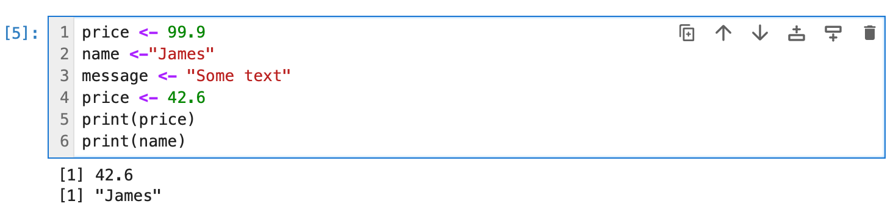
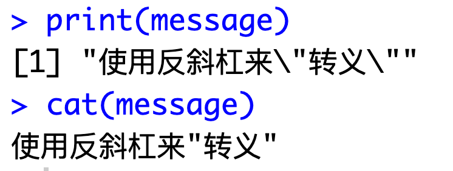

## 1. 欢迎来到 R 语言

你好，我是悦创。

R 语言是应用最广泛的统计编程语言。

而且 R 语言它是数据科学家和分析师的首选。

在本课程中，我们将学习R语言的基础知识，了解如何创建存储和操作数据的程序、以及如何使用各种数据集执行数据分析任务，以及如何使用图形和图表可视化结果。

>  本课程学习的技能可应用于任何与数据相关的领域，包括**金融**、**数据科学**、**机器学习**等。

**【单选题】小测**

“R 语言可以用于机器学习“这句话的描述是正确的吗？

- [x] True（正确）
- [ ] False（错误）

### 1.1 R 语言项目

让我们从编写一个输出文本的简单程序开始。

```r
print( "编程学习就上 Bornforthis.cn！" )
```

运行结果：

```r
[1] "编程学习就上 Bornforthis.cn！"
```

打印（**print**）功能用于输出文本。

它后面是括号，包括我们想要输出的文本，用引号括起来。

运行代码以查看结果！

**【填空题】小测**

将下面代码填写完整使得可以打印出“aiyc good”的结果。

```r
___("___")
```

## 2. 注释

注释用于解释代码。当程序运行时，它们将被忽略。

您可以使用 `# `在 R 中创建注释。

例如：

```r
# 输出 "编程学习就上 Bornforthis.cn！"
print( "编程学习就上 Bornforthis.cn！" )
```

该行的 `#` 符号后面的任何内容都将被忽略。

注释很有用，因为它们有助于阅读和理解更大的代码段，并解释代码正在做什么。

## 3. 变量

通常，每个 R 程序都处理数据。

变量允许您存储和操作数据。变量有名称和值。

例如，让我们创建一个名为 x 的变量，并将值 42 存储在其中：

```r
x = 42
```

注意，我们使用赋值运算符 **`=`** 为变量赋值。

现在，我们可以使用 **`print `** 输出存储在 x 中的值

```r
print(x)
```

> 变量名必须以字母或点开头，可以包括字母、数字和点或下划线字符。

为 R 中的变量赋值的更优选方法是使用**向左赋值 `<-`** 运算符：

我们将 42 左赋值给我们的 x 之后在通过 `print ` 打印出来。

```r
x <- 42
print(x)
```

我们可以在程序中使用多个变量，为它们使用不同的值，并在程序中为它们分配新的值。

例如：

```r
price <- 99.9
name <-"James"
message <- "Some text"
price <- 42.6
print(price)
print(name)
```

效果截图如下所示：



> R 语言是区分大小写的，因此，例如，Price 和 price 是两个不同的变量。

【单选题】小测

下面该代码中会输出什么？

```r
x <- 9
y <- 3
x <- y
print(x)
```

- [ ] 3
- [ ] 0
- [ ] 9
- [ ] 6

## 4. R 语言中输出前的 `[1]` 索引标记的含义

在 R 语言中，当你输出一个向量或其他数据结构时，前面的 `[1]` 是一个索引标记，表示输出的数据从第一个元素开始。这是 R 语言为了帮助用户跟踪长向量或数据的起始位置而提供的一个标记。

例如：

```r
x <- 1:10
print(x)
```

这会输出：

```r
[1]  1  2  3  4  5  6  7  8  9 10
```

这里的 `[1]` 表示输出的第一个元素是这个向量的第一个元素。

如果你有一个更长的向量，例如：

```r
x <- 1:100
print(x)
```

输出可能是这样：

```r
 [1]   1   2   3   4   5   6   7   8   9  10
[11]  11  12  13  14  15  16  17  18  19  20
...
```

这里，每一行前的索引标记 `[1]`、`[11]` 等表示该行的第一个数字在整个向量中的位置。这样，在长向量的输出中，你可以容易地知道每一行的起始位置。


## 5. 数据类型

### 5.1 数字型

变量可以存储不同类型的数据，例如整数、小数、文本。

在 R 中，不需要指定变量将保持的类型。相反，R 语言将自动从分配给它的值中获取类型。

例子：

```r
# 小数赋值
var1 <- 3.14
# 整数赋值
var2 <- 88L
# 文本赋值
var3 <- "hello"
print(var1)
print(var2)
print(var3)
```

效果截图如下：


请注意，对于整数，我们需要按字母 **L** 处理值。这使得 R 语言将值存储为整数。

我们还可以分配不带 **L** 的数字，~~**L** 将它们存储为数字。~~ 不带 **L** 的数字，R 语言将它们存储为数字（双精度浮点数）

> 使用 **L** 表示法可以确保R语言将值用作整数，这比数值占用的内存空间少，因为数值也可以有小数点。

::: details 详情🔎

这句话描述了 R 语言中整数和数值型数字（通常是双精度浮点数）的区别以及如何声明它们。

1. 在 R 中，如果你想确保一个数字被存储为整数，而不是双精度浮点数，你需要在该数字后加上一个字母 "L"。例如，`5L` 表示整数5，而只有 `5` 会被当作双精度浮点数处理。

   ```r
   x <- 5L
   typeof(x)  # 这将返回 "integer"
   ```

   ```r
   y <- 5
   typeof(y)  # 这将返回 "double"
   ```

2. 如果你分配一个不带 "L" 的数字，R 会将它存储为双精度浮点数。这就是第二部分的意思。

总之，这句话的意思是：在 R 语言中，**如果你想存储一个整数值，需要在数字后加 "L"。否则，该数字会被默认存储为双精度浮点数。**

:::

**【单选题】小测**

以下哪个选项是用来将值存储为整数的？ 

- [ ] 1.34
- [ ] "9"
- [ ] 42
- [ ] 87

### 5.2 字符串

R 中的文本存储为字符串。

我们在前面的课程中已经看到字符串：它们被单引号或双引号包围：

````r
X <- "hello"
y <- 'world '
````

你使用哪种引号都没有区别，两者都是创建一个字符串。

只需确保使用相同的引号打开和关闭文本。

如果需要在字符串中使用引号，可以使用**反斜杠**将其转义：

```r
message = "使用反斜杠来\"转义\""
print(message)
```

请注意，在打印值时，它还将输出反斜杠。

您可以使用 `cat `函数而不是打印来输出它，而不使用反斜杠。

```r
message = "使用反斜杠来\"转义\""
print(message)
cat(message)
```

 与 `print `相比，`cat ` 不输出方括号中的输出行号，如果我们都使用 `cat` 进行输出的话内容会连接在一起不会实现语句换行，反之在使用 `print` 进行输出的话每一条语句都可以进行换行输出。

效果如下：



**【填空题】小测**

将下面代码填写完整使得将“bornforthis.cn”赋值给text，并且输出“bornforthis.cn”。

```r
text ___ "bornforthis.cn__
print(___)
```

## 5. 基础数学

### 5.1 算术运算符

R 支持基本的算术运算。你可以将它们用于变量或值。

例子：

```r
x <- 11
y <- 4
# 加法
print(x + y)
# 减法
print(x - y)
# 乘法
print(x * y)
# 除法
print(x / y)
# 求幂（指数）
print(x ^ y)
print(x ** y)
# 取模（取余）
print(x %% y)
# 取商
print(x %/% y)
```

::: warning

R 支持两种除法：除法和整数除法。第一个版本产生一个小数，而第二个版本产生一个整数。

:::

### 5.2 类型结果探究

在 R 语言中，支持两种除法操作：

1. **除法（/）**：这是最常见的除法运算符，结果为小数（浮点数），即便是两个整数相除，结果也会是小数形式。

   例如：`5 / 2` 会得到 `2.5`。

2. **整数除法（%/%）**：这个运算符执行的是整数除法，结果会丢弃小数部分，只保留整数部分，即便原本的结果是一个小数。

   例如：`5 %/% 2` 会得到 `2`。

此外，还有一个与除法相关的运算符：

- **取余数（%%）**：这个运算符返回的是除法操作后的余数。

  例如：`5 %% 2` 会得到 `1`。

所以：R 语言支持两种类型的除法运算：普通除法和整数除法。普通除法（使用 `/` 运算符）的结果为小数，即使两个操作数都是整数。整数除法（使用 `%/%` 运算符）的结果是一个整数，它丢弃了结果的小数部分。

::: tip

9 / 3 得到的是整数

:::

在 R 语言中，使用普通除法运算符 `/` 的话，即使结果是一个可以完全除尽的情况，输出的结果仍然会是一个浮点数，即使它的小数部分是 0。例如：

```r
result <- 9 / 3
print(result)  # 输出将会是 3（实际上是3.0，但R通常不会显示小数点后的0）
```

尽管输出显示为 `3`，这实际上是一个浮点数（在 R 中，它是一个数值类型，numeric）。这意味着即使两个数能够整除，`/` 运算符得到的结果仍然是浮点数类型。这在某些情况下，尤其是在进行类型敏感的操作时，是需要注意的。

```r
> typeof(9 / 3)
[1] "double"
```

**小测**

这段代码的输出是什么？

```r
a <- 7
b <- 2
print(a%/%b)
```

### 5.3 Math 函数

R 还支持执行数学任务的函数。

例如，**min** 和 **max** 函数可用于查找给定数字集的最小值和最大值：

```r
a <- 8  
b <- 12
#最小值
print(min(a, b))
#最大值
print(max(a, b))
```

我们也可以在 **min** 和 **max** 函数中使用 2 个以上的数字—只需使用逗号将它们分隔开即可。

```r
> max(1, 2, 3, 4)
[1] 4
```

类似地，R 语言中有一个内置的 **sqrt** 函数，我们可以用于查找给定数字的平方根：

```r
print(sqrt(64))
```

**【填空题】小测**

将下面代码填充完整使得可以查找并输出给定 3 个变量中的最大值。

```r
x <- 42 
y <- 99
z <- 2
res <-___(x___y,___)
print(res)
```


## 6. 布尔值

### 6.1 布尔值

**布尔指（Boolean**）是 R 中的另一种数据类型。

它可以有以下两个值之一：**TRUE** 和 **FALSE**。

布尔值是在比较值时创建的。

例如：

```R
x <- 14
print(x > 20 )
```

> 在上面的代码中，我们使用**大于 >** 运算符将 x 与值 20 进行比较。

比较的结果是一个值为 **FALSE** 的布尔值，因为 x 不大于20。

**【多选题】小测**

在下面选项中选择出 Boolean 的两个值。

- [ ] no
- [x] FALSE
- [x] TRUE
- [ ] “true”
- [ ] yes

### 6.2 关系运算符

R 支持以下用于比较的关系运算符：

- `>` 大于；
- `<` 小于；
- `<=` 小于等于；
- `>=` 大于等于；
- `==` 相等
- `!=`  不相等

例子：

```r
x <- 42
print(x >= 8)
print(x > 24)
print(x == 42)
print(x != 42)
```

::: warning

**请注意**，你需要使用两个等号来检查是否相等，因为一个等号（“=”）是赋值运算符。

:::

**小测**

下面这串代码中输出是什么？

```r
num <- 15
val <- num-6
print((num%/%val)>=2)
```


## 7. 输入输出

### 7.1 输入输出

#### 7.1.1 接受输入(Taking Input)

这将输出第一个输入。R 允许你获取用户输入并将其存储在变量中。

**readLines** 函数用于读取作为单独输入提供的每一行，使其成为读取多个输入的方便方式。

例如：

```r
input <- readLines('stdin') 
```

现在，输入是一个变量，它分别保存给定输入的每一行。

注意'stdin'参数——需要读取标准输入。

为了访问输入，我们需要使用方括号提供要访问的行数：

```r
print(input[1])
print(input[1])
```

这将输出第一个输入。

> 这个变量实际上是一个向量。在接下来的模块中，我们将了解更多有关向量的信息。现在，请记住访问其元素的语法。

**如何运行？**

脚本会等待您的输入。你可以输入一些文本，然后按 `Ctrl + D`（在 Unix 系统如 Linux 或 Mac 上）或 `Ctrl + Z` 然后回车（在 Windows上）来结束输入。

这将导致 `readLines` 函数从标准输入读取文本，保存到变量 `input` 中，然后打印出来。如果您想从文件而不是从标准输入读取，你需要将 `'stdin'` 替换为文件路径。

::: tip 使用注意

在 Jupyter Notebook 中使用 R 时，你可以这样请求用户输入：

```r
input <- readline(prompt="Please enter some input: ")
print(input)
```

:::

**【选词填空】小测**

```r
x <- readLines('____')
___(x[___])
```

#### 7.1.2 输入(input)

默认情况下，输入是字符串。

因此，为了对输入执行数字操作，我们需要将其转换为数字：

```r
input<- readLines("stdin")
x <- input[1]
X <- as.integer(x)
print(x*2)
```

现在，x 是一个整数，我们可以用它作为一个数字。

> 当 R 读取输入的每一行时，请记住使用新行拆分多个输入。

**【单选题】小测**

在 `readLines()` 中我们将输入存储类型是以下向量那个?

- [ ] integer
- [ ] newlines
- [x] strings

#### 7.1.3 输出（Output）

正如我们在前面的课程中所看到的，我们可以使用 **print** 和 **cat** 函数输出值。

```r
x <- "hello"
print(x)
cat(x)
```

效果如下所示：

```r
> x <- "hello"
> print(x)
[1] "hello"
> cat(x)
hello> 
```

你可以使用 **\n** 特殊符号为文本添加新行。

例如：

```r
x <- "hellolnthere!\n"
print(x)
cat(x)
```

效果如下所示：

```r
> x <- "hellolnthere!\n"
> print(x)
[1] "hellolnthere!\n"
> cat(x)
hellolnthere!
```

**【单选题】小测**

以下哪个选项是换行符号？

- [ ] `\r`
- [ ] `\n`
- [ ] `"`
- [ ] `\t`


## 8. 小节训练

### 8.1 测试（一）

创建变量 age 并赋值 42 并输出。

```r
age <- 42
print(age)
```

### 8.2 测试（二）

下面这个代码输出的内容是什么？

```r
x <- 4
y <- 1
x <- x-y
print(x %% 2)
```

### 8.3 测试（三）

下面这个代码输出的内容是什么？

```r
a <- 8
b <- a/3
print(b < 2)
```

### 8.4 测试（四）

将下面代码填写完整使得代码可以获取键盘输入的内容，将键盘输入的内容转换为整数，然后输出其双精度。

::: code-tabs

@tab Question

```r
input <-___('stdin')
x <-___.___(input[1])
print(x * 2)
```

@tab Answer

```r
input <-readLines('stdin')
x <-as.integer(input[1])
print(x*2)
```

:::


### 8.5 测试（五）

下面这个代码输出的内容是什么？

```r
x <- 6
y <- x-2
z <- min(x, y)
print(sqrt(z))
```

### 8.6 测试（六）

给定的代码需要 3 个数字作为输入。

完成程序以输出 3 个输入中的**最大值**。

> 使用 print 语句输出结果。

::: code-tabs

@tab Question

```r
input <- readLines('stdin')
x <- as.integer(input[1])
y <- as.integer(input[2])
z <- as.integer(input[3])
```

@tab Answer

```r
input <- readLines('stdin')
x <- as.integer(input[1])
y <- as.integer(input[2])
z <- as.integer(input[3])
s <- max(x,y,z)
print(s)
```

:::


- [ ] R 语言变量命名规则
- [ ] R 语言有哪些数据类型
- [ ] R 语言有没有类似 Python type 检测数据类型？
- [ ] R 语言有几种格式的字符串？单引号和双引号的区别？
- [ ] R 语言常用的 Math 函数


欢迎关注我公众号：AI悦创，有更多更好玩的等你发现！

::: details 公众号：AI悦创【二维码】


:::

::: info AI悦创·编程一对一

AI悦创·推出辅导班啦，包括「Python 语言辅导班、C++ 辅导班、java 辅导班、算法/数据结构辅导班、少儿编程、pygame 游戏开发」，全部都是一对一教学：一对一辅导 + 一对一答疑 + 布置作业 + 项目实践等。当然，还有线下线上摄影课程、Photoshop、Premiere 一对一教学、QQ、微信在线，随时响应！微信：Jiabcdefh

C++ 信息奥赛题解，长期更新！长期招收一对一中小学信息奥赛集训，莆田、厦门地区有机会线下上门，其他地区线上。微信：Jiabcdefh

方法一：[QQ](http://wpa.qq.com/msgrd?v=3&uin=1432803776&site=qq&menu=yes)

方法二：微信：Jiabcdefh

:::


