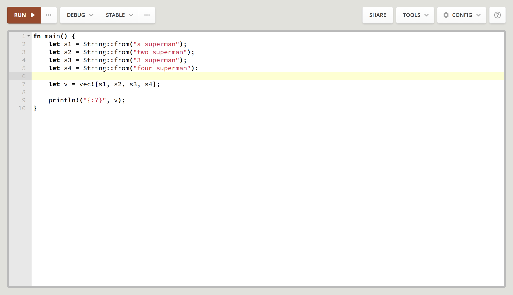
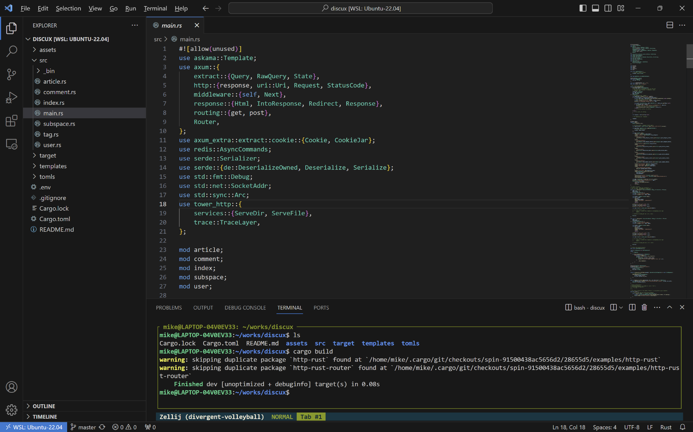
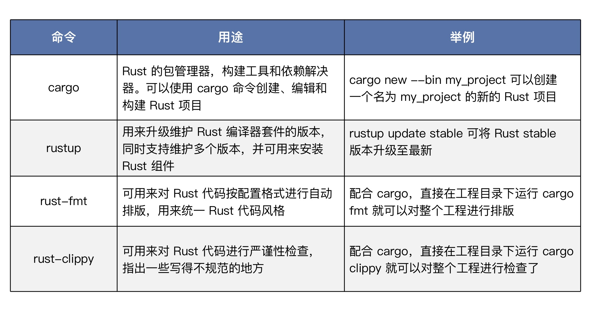
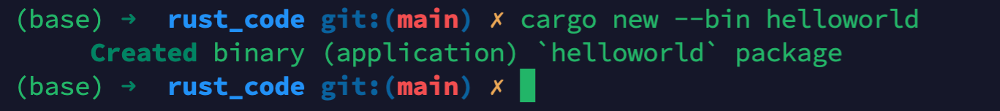
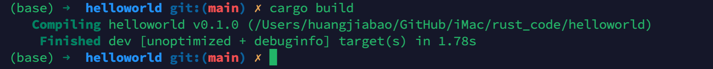
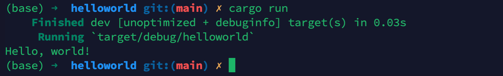
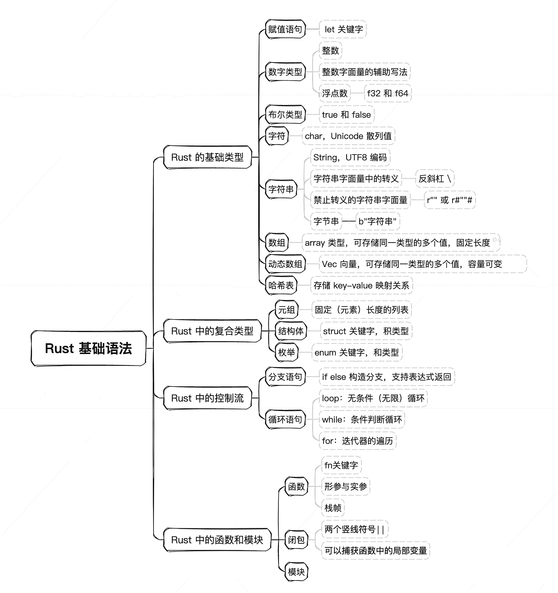
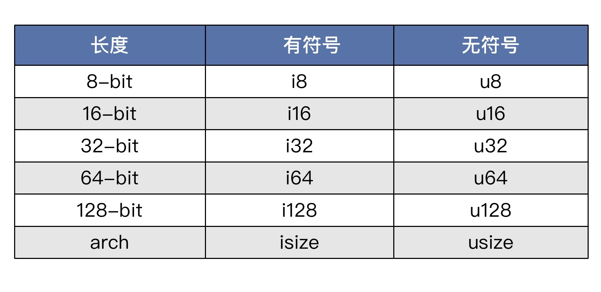

你好，我是悦创。今天是我们的 Rust 入门与实战第一讲。

无论对人，还是对事儿，第一印象都很重要，Rust 也不例外。今天我们就来看一看 Rust 给人的第一印象是什么吧。其实 Rust 宣称的安全、高性能、无畏并发这些特点，初次接触的时候都是感受不到的。第一次能直观感受到的实际是下面这些东西。

- Rust 代码长什么样儿？
- Rust 在编辑器里面体验如何？
- Rust 工程如何创建？
- Rust 程序如何编译、执行？

下面我们马上下载安装 Rust，快速体验一波。

## 1. 下载安装

要做 Rust 编程开发，安装 Rust 编译器套件是第一步。如果是在 MacOS 或 Linux 下，只需要执行：

```bash
curl --proto '=https' --tlsv1.2 -sSf https://sh.rustup.rs | sh
```

按提示执行操作，就安装好了，非常方便。

::::: details 详细🔎操作

:::: tabs

@tab Step1

```bash{1,48}
(base) ➜  bornforthis.cn git:(main) ✗ curl --proto '=https' --tlsv1.2 -sSf https://sh.rustup.rs | sh
info: downloading installer

Welcome to Rust!

This will download and install the official compiler for the Rust
programming language, and its package manager, Cargo.

Rustup metadata and toolchains will be installed into the Rustup
home directory, located at:

  /Users/huangjiabao/.rustup

This can be modified with the RUSTUP_HOME environment variable.

The Cargo home directory is located at:

  /Users/huangjiabao/.cargo

This can be modified with the CARGO_HOME environment variable.

The cargo, rustc, rustup and other commands will be added to
Cargo's bin directory, located at:

  /Users/huangjiabao/.cargo/bin

This path will then be added to your PATH environment variable by
modifying the profile files located at:

  /Users/huangjiabao/.profile
  /Users/huangjiabao/.bash_profile
  /Users/huangjiabao/.zshenv

You can uninstall at any time with rustup self uninstall and
these changes will be reverted.

Current installation options:


   default host triple: aarch64-apple-darwin
     default toolchain: stable (default)
               profile: default
  modify PATH variable: yes

1) Proceed with standard installation (default - just press enter)
2) Customize installation
3) Cancel installation
>  # Enter「回车」
```

在你看到的这个提示之后，你有三个选项来继续安装 Rust 编程语言和它的包管理器 Cargo：

1. **继续标准安装**：如果你想进行标准安装，只需按下 `Enter` 键即可。这是最简单的选择，适合大多数用户。它会使用默认的配置选项，包括安装位置、使用的工具链版本等。

2. **自定义安装**：如果你想自定义安装选项（例如，选择不同的工具链版本或安装位置），你可以输入 `2` 然后按 `Enter` 键。之后，你将能够按照提示修改安装选项。

3. **取消安装**：如果你决定不安装 Rust 和 Cargo，可以输入 `3` 然后按 `Enter` 键来取消安装过程。

根据你的需要选择最适合你的选项。如果你是第一次安装 Rust 并且没有特殊的需求，建议选择标准安装（即，直接按 `Enter` 键）。这样可以快速完成安装，并且可以在以后根据需要调整配置。

@tab Step2

```bash
info: profile set to 'default'
info: default host triple is aarch64-apple-darwin
info: syncing channel updates for 'stable-aarch64-apple-darwin'
714.8 KiB / 714.8 KiB (100 %)  32.0 KiB/s in 24s ETA:  0s
info: latest update on 2024-03-21, rust version 1.77.0 (aedd173a2 2024-03-17)
info: downloading component 'cargo'
  6.2 MiB /   6.2 MiB (100 %) 364.8 KiB/s in  2m  7s ETA:  0s    
info: downloading component 'clippy'
  2.1 MiB /   2.1 MiB (100 %) 966.0 KiB/s in  2s ETA:  0s
info: downloading component 'rust-docs'
 14.9 MiB /  14.9 MiB (100 %)   1.2 MiB/s in 13s ETA:  0s
info: downloading component 'rust-std'
 22.9 MiB /  22.9 MiB (100 %)   1.1 MiB/s in 19s ETA:  0s
info: downloading component 'rustc'
 54.1 MiB /  54.1 MiB (100 %)   1.7 MiB/s in  1m 38s ETA:  0s    
info: downloading component 'rustfmt'
  1.6 MiB /   1.6 MiB (100 %)   1.2 MiB/s in  1s ETA:  0s
info: installing component 'cargo'
info: installing component 'clippy'
info: installing component 'rust-docs'
 14.9 MiB /  14.9 MiB (100 %)   3.9 MiB/s in  2s ETA:  0s
info: installing component 'rust-std'
 22.9 MiB /  22.9 MiB (100 %)  14.7 MiB/s in  1s ETA:  0s
info: installing component 'rustc'
 54.1 MiB /  54.1 MiB (100 %)  17.5 MiB/s in  3s ETA:  0s
info: installing component 'rustfmt'
info: default toolchain set to 'stable-aarch64-apple-darwin'

  stable-aarch64-apple-darwin installed - rustc 1.77.0 (aedd173a2 2024-03-17)


Rust is installed now. Great!

To get started you may need to restart your current shell.
This would reload your PATH environment variable to include
Cargo's bin directory ($HOME/.cargo/bin).

To configure your current shell, you need to source
the corresponding env file under $HOME/.cargo.

This is usually done by running one of the following (note the leading DOT):
. "$HOME/.cargo/env"            # For sh/bash/zsh/ash/dash/pdksh
source "$HOME/.cargo/env.fish"  # For fish
```

完成上述选择之后，根据你的选择，你可能需要执行以下步骤之一：

1. 如果你选择了标准安装（直接按 `Enter` 键）：

- 安装过程将自动继续。你只需等待直到安装完成。安装完成后，你会看到一条消息确认 Rust 已经成功安装。

2. 如果你选择了自定义安装（输入`2`）：

- 你将会看到一系列的选项来自定义你的安装，如选择特定版本的 Rust，设置不同的安装路径等。根据提示操作，完成每一步的自定义设置。
- 在自定义设置完成后，安装程序会开始下载并安装 Rust。等待直到安装过程完成。

3. 如果你选择了取消安装（输入`3`）：

- 安装将被取消，你不需要做任何其他操作。

4. **安装完成后：**

- **验证安装**：打开一个新的终端窗口，运行以下命令来检查 Rust 版本，这可以验证安装是否成功：
  ```
  rustc --version
  ```
- **配置环境变量**：安装程序应该已经自动将 Rust 的安装路径添加到你的 PATH 环境变量中。如果你发现命令无法识别，可能需要手动配置 PATH。通常，**重新启动你的终端或计算机可以解决这个问题。**

- **开始使用 Rust**：现在，你可以开始使用 Rust 了。例如，你可以创建一个新的 Rust 项目，或者尝试编译和运行一些简单的代码来熟悉 Rust 的工具链。

Rust 社区非常活跃且友好，如果你在学习或使用 Rust 的过程中遇到任何问题，不要犹豫寻找资源或向社区求助。

@tab 补充「不一定要操作」

::: important 小问题

不需要运行：`source "$HOME/.cargo/env.fish"`  # For fish这个命令吗？

:::

如果你使用的是 Fish shell，确实需要运行这个命令来将 Rust 的环境变量添加到你的 shell 配置中。这是因为 Rust 安装脚本默认会尝试修改常见的 shell 配置文件（如 `.bash_profile`, `.zshenv` 等），以自动将 Rust 的 bin 目录（`$HOME/.cargo/bin`）添加到你的 `PATH` 环境变量中。但是，如果你使用的是 Fish shell，这个自动化过程可能不会生效，因此需要手动执行这个步骤。

命令 `source "$HOME/.cargo/env.fish"` 作用是临时修改当前 shell 会话的环境变量，使得你可以立即开始使用 Rust 相关的命令，如 `cargo` 和 `rustc`，无需重新启动终端。要使这个变化永久生效，你可以将相似的命令添加到你的 Fish 配置文件中，通常是 `~/.config/fish/config.fish`：

```fish
set -gx PATH $HOME/.cargo/bin $PATH
```

或者，如果你偏好使用 `source` 命令的方式，你可以将原来的命令添加到你的 `config.fish` 文件中，以确保每次启动 Fish shell 时，Rust 的环境变量都会被自动设置：

```fish
source $HOME/.cargo/env.fish
```

请记得，修改配置文件后，为了让变更立即生效，你需要重新启动你的终端窗口，或者手动执行上述 `source` 命令。

::::


:::::

而如果你使用的是 Windows 系统，那么会有更多选择。你既可以在 WSL 中开发编译 Rust 代码，也可以在 Windows 原生平台上开发 Rust 代码。

如果你计划在 WSL 中开发，安装方式与上面一致。

```bash
curl --proto '=https' --tlsv1.2 -sSf https://sh.rustup.rs | sh
```

如果想在 Windows 原生平台上开发 Rust 代码，首先需要确定安装 [32 位的版本](https://github.com/AndersonHJB/BornforthisData/blob/main/column/Rust/01/rustup-init.exe)还是 [64 位的版本](https://github.com/AndersonHJB/BornforthisData/blob/main/column/Rust/01/rustup-init_64bit.exe)。在安装过程中，它会询问你是想安装 GNU 工具链的版本还是 MSVC 工具链的版本。安装 GNU 工具链版本的话，不需要额外安装其他软件包。而安装 MSVC 工具链的话，需要先安装微软的 [Visual Studio](https://kaisery.github.io/trpl-zh-cn/ch01-01-installation.html) 依赖。

如果你暂时不想在本地安装，或者本地安装有问题，对于我们初学者来说，也有一个方便、快捷的方式，就是 Rust 语言官方提供的一个网页端的 [Rust 试验场](https://play.rust-lang.org/?version=stable&mode=debug&edition=2021)，可以让你快速体验。



这个网页 Playground 非常方便，可以用来快速验证一些代码片段，也便于将代码分享给别人。如果你的电脑本地没有安装 Rust 套件，可以临时使用这个 Playground 学习。

## 2. 编辑器 / IDE

开发 Rust，除了下载、安装 Rust 本身之外，还有一个工具也推荐你使用，就是 **VS Code**。需要提醒你的是，在 VS Code 中需要安装 rust-analyzer 插件才会有自动提示等功能。你可以看一下 VS Code 编辑 Rust 代码的效果。



VS Code 功能非常强大，除了基本的 IDE 功能外，还能实现**远程编辑**。比如在 Windows 下开发，代码放在 WSL Linux 里面，在 Windows Host 下使用 VS Code 远程编辑 WSL 中的代码，体验非常棒。

其他一些常用的 Rust 代码编辑器还有 VIM、NeoVIM、IDEA、Clion 等。JetBrains 最近推出了 Rust 专用的 IDE：RustRover，如果有精力的话，你也可以下载下来体验一下。

Rust 编译器套件安装好之后，会提供一些工具，这里我们选几个主要的简单介绍一下。



工具齐备了，下面我们马上体验起来，先来创建一个 Rust 工程。

考虑到阅读本文学习的小伙伴，有些懒到不想打上面的指令或者一开始记不住，重复打有点烦恼。

::: code-tabs

@tab cargo

```rust
cargo new --bin my_project
```

@tab rustup

```rust
rustup update stable
```

@tab rust-fmt

```rust
cargo fmt
```

@tab rust-clippy

```rust
cargo clippy
```

:::


## 3. 创建一个工程

创建工程我们应该使用哪个工具呢？ 没错，就是刚刚我们提到的 cargo 命令行工具。我们用它来创建一个 Rust 工程 helloworld。

打开终端，输入：

```rust
cargo new --bin helloworld 
```

显示：

```rust
     Created binary (application) `helloworld` package
```



这样就创建好了一个新工程。这个新工程的目录组织结构是这样的：

```bash
helloworld
    ├── Cargo.toml
    └── src
        └── main.rss
```

第一层是一个 src 目录和一个 `Cargo.toml` 配置文件。src 是放置源代码的地方，而 `Cargo.toml` 是这个工程的配置文件，我们来看一下里面的内容。

```rust
[package]
name = "helloworld"
version = "0.1.0"
edition = "2021"

# See more keys and their definitions at https://doc.rust-lang.org/cargo/reference/manifest.html

[dependencies]
```

`Cargo.toml` 中包含 package 等基本信息，里面有名字、版本和采用的 Rust 版次。Rust 3 年发行一个版次，目前有 2015、2018 和 2021 版次，最新的是 2021 版次，也是我们这门课使用的版次。可以执行 `rustc -V` 来查看我们课程使用的 Rust 版本。

```rust
rustc 1.69.0 (84c898d65 2023-04-16)
```

好了，一切就绪后，我们可以来看看 src 下的 `main.rs` 里面的代码。

## 4. Hello, World

```rust
fn main() {
    println!("Hello, world!");
}
```

这段代码的意思是，我们要在终端输出这个 "`Hello, world!`" 的字符串。

使用 `cargo build` 来编译。

```bash
$ cargo build
   Compiling helloworld v0.1.0 (/home/mike/works/classes/helloworld)
    Finished dev [unoptimized + debuginfo] target(s) in 1.57s
```



使用 `cargo run` 命令可以直接运行程序。

```bash
$ cargo run
    Finished dev [unoptimized + debuginfo] target(s) in 0.01s
     Running `target/debug/helloworld`
Hello, world!
```



可以看到，最后终端打印出了 Hello, world。我们成功地执行了第一个 Rust 程序。

## 5. Rust 基础语法

快速体验 Hello World 后，你是不是对 Rust 已经有了一个感性的认识？不过只是会 Hello World 的话，我们离入门 Rust 尚远。下面我们就从 Rust 的基础语法入手开始了解这门语言，为今后使用 Rust 编程打下一个良好的基础。

Rust 基础语法主要包括基础类型、复合类型、控制流、函数与模块几个方面，下面我带你一个一个看。



## 6. Rust 的基础类型

### 6.1 赋值语句

Rust 中使用 **let** 关键字定义变量及初始化，你可以看一下我给出的这个例子。

```rust
fn main() {
  let a: u32 = 1;
}
```

可以看到，Rust 中类型写在变量名的后面，例子里变量 a 的类型是 u32, 也就是无符号 32 位整数，赋值为 1。Rust 保证你定义的变量在第一次使用之前一定被初始化过。

### 6.2 数字类型

与一些动态语言不同，Rust 中的数字类型是区分位数的。我们先来看整数。

### 6.3 整数



其中，isize 和 usize 的位数与具体 CPU 架构位数有关。CPU 是 64 位的，它们就是 64 位的，CPU 是 32 位的，它们就是 32 位的。这些整数类型可以在写字面量的时候作为后缀跟在后面，来直接指定值的类型，比如 `let a = 10u32`; 就定义了一个变量 a，初始化成无符号 32 位整型，值为 10。

:::: details rust 数据类型扩展

::: tabs

@tab 表格

Rust 的数据类型主要分为两大类：标量（Scalar）类型和复合（Compound）类型。以下是一个概览表格：

| 类别 | 数据类型     | 描述                                                         |
| ---- | ------------ | ------------------------------------------------------------ |
| 标量 | 整型         | 包括 `i8`、`i16`、`i32`、`i64`、`i128`、`isize`（有符号整型）和 `u8`、`u16`、`u32`、`u64`、`u128`、`usize`（无符号整型） |
| 标量 | 浮点型       | 包括 `f32` 和 `f64`                                          |
| 标量 | 布尔型       | `bool` 类型，它的值可以是 `true` 或 `false`                  |
| 标量 | 字符型       | `char` 类型，表示单个 Unicode 字符                           |
| 复合 | 元组         | 元组（Tuple）类型，可以包含多种类型的几个值                  |
| 复合 | 数组         | 数组（Array）类型，所有元素都必须是相同类型                  |
| 复合 | 结构体       | 自定义数据类型，允许命名和包装多个相关值                     |
| 复合 | 枚举         | 枚举（Enum）类型，用于定义通过多个具体变量来表示的类型       |
| 复合 | 切片         | 切片（Slice）类型，引用集合的一部分数据                      |
| 复合 | 引用         | 引用（Reference）类型，允许以不拥有数据的方式借用值          |
| 特殊 | 动态大小类型 | 如 `str`，它是一个动态大小的字符串类型                       |
| 特殊 | 指针         | 包括裸指针 `*const T` 和 `*mut T`，不建议直接使用            |
| 特殊 | 函数         | 函数也是一种类型，可以通过函数签名来指定                     |
| 特殊 | 单元类型     | `()`，它是一个空元组，也称为单元类型                         |

这个表格提供了 Rust 中各种数据类型的基础概览，每种数据类型都有其用途和操作的特点。Rust 语言特别注重类型安全和内存安全，所以每种类型都被设计得非常细致，以便更好地支持这些特性。

@tab 知识点「标量」

在 Rust 语言中，标量（Scalar）类型是指单一的值类型，不能再分解成更小的数据类型。它们是构建更复杂数据结构的基础。Rust 的标量类型主要包括以下几种：

1. **整型（Integer）**: 用于表示整数。Rust 提供了有符号和无符号的整型，分别用 `i` 和 `u` 开头，后面跟上位数来表示。例如，`i32` 是 32 位的有符号整型，而 `u64` 是 64 位的无符号整型。

2. **浮点型（Floating-point）**: 用于表示小数。Rust 有两种浮点类型：`f32` 和 `f64`，分别代表 32 位和 64 位的浮点数。`f64` 有更高的精度。

3. **布尔型（Boolean）**: 有两个值：`true` 和 `false`。用于逻辑判断。

4. **字符型（Character）**: 使用 `char` 表示，它是一个单个 Unicode 字符，用于表示文本中的一个字符。

标量类型的特点是它们是最基本的数据类型，每个标量类型的值都占据固定大小的内存空间，并且直接表示单一的数据。在 Rust 中，标量类型是不可变的，这意味着一旦一个标量类型的变量被赋予了一个值，就不能改变这个值（除非这个变量被声明为可变的）。这些特性帮助 Rust 实现了高级的内存安全和类型安全。

@tab 知识点「复合」

在 Rust 语言中，"复合"（Compound）数据类型是指可以将多个值组合成一个类型的数据类型。与只能表示单一值的标量（Scalar）数据类型不同，复合数据类型可以包含多种类型的数据，从而形成更复杂的数据结构。复合数据类型主要包括以下几种：

- **元组（Tuple）**：可以包含不同类型的值的固定长度的集合。元组允许你将多个值组合成一个复合类型的值。每个元素都有一个固定的位置，可以通过解构或索引来访问。

- **数组（Array）**：所有元素都是相同类型的固定长度的集合。在 Rust 中，数组的长度是其类型的一部分，这意味着 `[i32; 3]` 和 `[i32; 4]` 是不同的类型。

- **结构体（Struct）**：一个自定义的数据类型，可以包含多个命名字段，每个字段都有自己的数据类型。结构体使得相关数据的组织和处理变得更加容易。

- **枚举（Enum）**：允许你定义一个类型，该类型可以是几个定义好的变体中的任何一个。枚举非常适合用于那些可以有固定数目变体的值的情况。

- **切片（Slice）**：引用一个数组的部分数据。与数组不同，切片的长度不需要在编译时确定，提供了一种灵活处理数组的方法。

- **引用（Reference）**：引用允许你以不拥有数据的方式借用值，它们本身并不拥有它们所指向的值。在 Rust 中，引用的使用遵循严格的借用规则，以确保内存安全。

复合数据类型是 Rust 中构建复杂数据结构的基础，它们使得开发者能够以类型安全的方式处理更复杂的数据集合和结构。

@tab 知识点「特殊」

在 Rust 中，我将某些数据类型分类为“特殊”主要是因为它们具有一些独特的属性或用途，与标准的标量和复合类型有所区别。让我们详细了解一下这些“特殊”类型的特点：

- **动态大小类型（Dynamically Sized Types, DSTs）**：这些类型在编译时大小未知，因此它们的使用方式与常规类型有所不同。`str` 是最常见的动态大小类型，它代表了一个 UTF-8 编码的字符串数据。因为 `str` 的长度在编译时是未知的，所以通常通过引用的方式（如 `&str`）来使用，这样 Rust 就可以在运行时处理其大小。

- **指针**：包括裸指针 `*const T` 和 `*mut T`，这些类型允许直接地址访问，但绕过了 Rust 的所有权和借用规则，因此使用它们可能会造成内存安全问题。它们主要用于与 C 语言库的交互或其他高级场景。相比之下，普通的引用（`&T` 和 `&mut T`）和智能指针（如 `Box<T>`、`Rc<T>` 和 `Arc<T>`）在 Rust 中的使用更加安全和常见。

- **函数**：在 Rust 中，函数也是一种类型。可以将函数作为参数传递给其他函数，或者从函数返回函数。函数类型由其签名决定，例如 `fn(i32) -> i32` 表示一个接受 `i32` 类型参数并返回 `i32` 类型的函数。

- **单元类型（Unit Type）**：用 `()` 表示，称为单元类型，它与其他语言中的 `void` 类似，但在 Rust 中被视为一个具体的类型。它只有一个值，也就是空的元组 `()`，通常用于表示没有有意义的返回值的函数的返回类型。

这些“特殊”类型为 Rust 提供了高级功能和灵活性，但它们的使用通常需要对 Rust 的内存安全原则有更深入的了解。

@tab total

在 Rust 编程语言中，数据类型大致可以被分为几个不同的类别，以便于理解和区分它们的用途和特性。这些类别包括“标量”、“复合”和“特殊”类型。下面是对这些类别的简要说明：

1. **标量（Scalar）类型**:
   - 标量类型是最基本的数据类型，它们代表了单一的值。Rust 有四种基本的标量类型：整型、浮点型、布尔型和字符型。
   - 这些类型包括了如整数、浮点数、布尔值（真/假）以及单个字符等基本构建块，它们是构建更复杂数据结构的基础。

2. **复合（Compound）类型**:
   - 复合类型可以将多个值组合成一个类型。在 Rust 中，典型的复合类型有元组（Tuple）、数组（Array）、结构体（Struct）和枚举（Enum）。
   - 通过复合类型，可以将不同或相同的数据类型的值组合起来，形成一个逻辑单元。比如，一个元组可以包含一个整数、一个浮点数和一个字符串。

3. **特殊（Special）类型**:
   - 特殊类型是 Rust 中的一些特殊用途的类型，包括动态大小类型（如切片和`str`）、指针（裸指针和引用）以及函数类型等。
   - 这些类型有其特殊用途，比如动态大小类型用于表示不确定大小的数据，指针用于底层内存操作，函数类型则表示函数的签名。

- **动态大小类型** 和 **指针** 通常用于更高级的场景，比如操作字符串切片或进行底层内存访问。
- **函数** 类型代表了可以被调用的代码块的类型，其本身可以作为参数传递或者从函数返回。
- **单元类型** (`()`) 是一个特殊的类型，表示没有任何值（可以看作是一个空的返回类型）。

这种分类方法有助于程序员更好地理解和使用 Rust 的类型系统，每种类别的类型都有其特定的语法和用法规则，以支持 Rust 的安全和效率特性。

:::

::::


### 6.4 整数字面量的辅助写法

Rust 提供了灵活的数字表示方法，便于我们编写整数字面量。比如：

```rust
十进制字面量 98_222，使用下划线按三位数字一组隔开
十六进制字面量 0xff，使用0x开头
8进制字面量 0o77，使用0o（小写字母o）开头
二进制字面量 0b1111_0000，使用 0b 开头，按 4 位数字一组隔开
字符的字节表示 b'A'，对一个 ASCII 字符，在其前面加 b 前缀，直接得到此字符的 ASCII 码值
```

各种形式的辅助写法是为了提高程序员写整数字面量的效率，同时更清晰，更不容易犯错。

### 6.5 浮点数

浮点数有两种类型：f32 和 f64，分别代表 32 位浮点数类型和 64 位浮点数类型。它们也可以跟在字面量的后面，用来指定浮点数值的类型，比如 `let a = 10.0f32;` 就定义了一个变量 a，初始化成 32 位浮点数类型，值为 10.0。

### 6.6 布尔类型

Rust 中的布尔类型为 bool，它只有两个值，true 和 false。

```rust
let a = true;
let b: bool = false;
```

### 6.7 字符

Rust 中的字符类型是 char，值用单引号括起来。

```rust
fn main() {
    let c = 'z';
    let z: char = 'ℤ'; 
    let heart_eyed_cat = '😻';
    let t = '中';
}
```

Rust 的 char 类型存的是 [Unicode 散列值](https://unicode.org/glossary/#unicode_scalar_value)。这意味着它可以表达各种符号，比如中文符号、emoji 符号等。在 Rust 中，char 类型在内存中总是占用 [4 个字节](https://doc.rust-lang.org/std/primitive.char.html#representation)大小。这一点与 C 语言或其他某些语言中的 char 有很大不同。

### 6.8 字符串

Rust 中的字符串类型是 String。虽然中文表述上，字符串只比前面的字符类型多了一个串字，但它们内部存储结构完全不同。String 内部存储的是 Unicode 字符串的 UTF8 编码，而 char 直接存的是 Unicode Scalar Value（二者的区别可查阅[这里](https://stackoverflow.com/questions/48465265/what-is-the-difference-between-unicode-code-points-and-unicode-scalars)）。也就是说 **String 不是 char 的数组**，这点与 C 语言也有很大区别。

通过下面示例我们可以看到，Rust 字符串对 Unicode 字符集有着良好的支持。

```rust
let hello = String::from("السلام عليكم");
let hello = String::from("Dobrý den");
let hello = String::from("Hello");
let hello = String::from("שָׁלוֹם");
let hello = String::from("नमस्ते");
let hello = String::from("こんにちは");
let hello = String::from("안녕하세요");
let hello = String::from("你好");
let hello = String::from("Olá");
let hello = String::from("Здравствуйте");
let hello = String::from("Hola");
```

注意，Rust 中的 String 不能通过下标去访问。

```rust
let hello = String::from("你好");
let a = hello[0];  // 你可能想把“你”字取出来，但实际上这样是错误的
```

为什么呢？你可以想一想。因为 String 存储的 Unicode 序列的 UTF8 编码，而 UTF8 编码是变长编码。这样即使能访问成功，也只能取出一个字符的 UTF8 编码的第一个字节，它很可能是没有意义的。因此 Rust 直接对 String 禁止了这个索引操作。

### 6.9 字符串字面量中的转义

与 C 语言一样，Rust 中转义符号也是反斜杠 `\` ，可用来转义各种字符。你可以运行我给出的这几个示例来理解一下。

```rust
fn main() {
    // 将""号进行转义
    let byte_escape = "I'm saying \"Hello\"";
    println!("{}", byte_escape);
    
    // 分两行打印
    let byte_escape = "I'm saying \n 你好";
    println!("{}", byte_escape);
    
    // Windows下的换行符
    let byte_escape = "I'm saying \r\n 你好";
    println!("{}", byte_escape);
    
    // 打印出 \ 本身
    let byte_escape = "I'm saying \\ Ok";
    println!("{}", byte_escape);
    
    // 强行在字符串后面加个0，与C语言的字符串一致。
    let byte_escape = "I'm saying hello.\0";
    println!("{}", byte_escape);
}
```

除此之外，Rust 还支持通过 `\x` 输入等值的 ASCII 字符，以及通过 `\u{}` 输入等值的 Unicode 字符。你可以看一下我给出的这两个例子。

```rust
fn main() {
    // 使用 \x 输入等值的ASCII字符（最高7位）
    let byte_escape = "I'm saying hello \x7f";
    println!("{}", byte_escape);
    
    // 使用 \u{} 输入等值的Unicode字符（最高24位）
    let byte_escape = "I'm saying hello \u{0065}";
    println!("{}", byte_escape);
}
```

注：字符串转义的详细知识点，请参考 [Tokens - The Rust Reference (rust-lang.org)](https://doc.rust-lang.org/reference/tokens.html#character-escapes)。

### 6.10 禁止转义的字符串字面量

有时候，我们不希望字符串被转义，也就是想输出原始字面量。这个在 Rust 中也有办法，使用 `r""` 或 `r#""#` 把字符串字面量套起来就行了。

```rust
fn main() {
    // 字符串字面量前面加r，表示不转义
    let raw_str = r"Escapes don't work here: \x3F \u{211D}";
    println!("{}", raw_str);
    
    // 这个字面量必须使用r##这种形式，因为我们希望在字符串字面量里面保留""
    let quotes = r#"And then I said: "There is no escape!""#;
    println!("{}", quotes);
    
    // 如果遇到字面量里面有#号的情况，可以在r后面，加任意多的前后配对的#号，
    // 只要能帮助Rust编译器识别就行
    let longer_delimiter = r###"A string with "# in it. And even "##!"###;
    println!("{}", longer_delimiter);
}
```

一点小提示，Rust 中的字符串字面量都支持换行写，默认把换行符包含进去。

### 6.11 字节串

很多时候，我们的字符串字面量中用不到 Unicode 字符，只需要 ASCII 字符集。对于这种情况，Rust 还有一种更紧凑的表示法：**字节串**。用 b 开头，双引号括起来，比如 `b"this is a byte string"`。这时候字符串的类型已不是字符串，而是字节的数组 `[u8; N]`，`N` 为字节数。

你可以在 Playground 里面运行一下代码，看看输出什么。

```rust
fn main() {
    // 字节串的类型是字节的数组，而不是字符串了
    let bytestring: &[u8; 21] = b"this is a byte string";
    println!("A byte string: {:?}", bytestring);
    
    // 可以看看下面这串打印出什么
    let escaped = b"\x52\x75\x73\x74 as bytes";
    println!("Some escaped bytes: {:?}", escaped);

    // 字节串与原始字面量结合使用
    let raw_bytestring = br"\u{211D} is not escaped here";
    println!("{:?}", raw_bytestring);
}
```

字节串很有用，特别是在做系统级编程或网络协议开发的时候，经常会用到。

### 6.12 数组

Rust 中的数组是 array 类型，用于存储同一类型的多个值。数组表示成 `[T; N]`，由中括号括起来，中间用分号隔开，分号前面表示类型，分号后面表示数组长度。

```rust
fn main() {
    let a: [i32; 5] = [1, 2, 3, 4, 5];
    let a = [1, 2, 3, 4, 5];
}
```

Rust 中的数组是固定长度的，也就是说在编译阶段就能知道它占用的字节数，并且在运行阶段，不能改变它的长度（尺寸）。

听到这里你是不是想说，这岂不是很麻烦？Rust 中的数组竟然不能改变长度。这里我解释一下，Rust 中区分固定尺寸数组和动态数组。之所以做这种区分是因为 Rust 语言在设计时就要求适应不同的场合，要有足够的韧性能在不同的场景中都达到最好的性能。因为固定尺寸的数据类型是可以直接放栈上的，创建和回收都比在堆上动态分配的动态数组性能要好。

**是否能在编译期计算出某个数据类型在运行过程中占用内存空间的大小**，这个指标很重要，Rust 的类型系统就是按这个对类型进行分类的。后面的课程中我们会经常用到这个指标。

数组常用于开辟一个固定大小的 Buffer（缓冲区），用来接收 IO 输入输出等。也常用已知元素个数的字面量集合来初始化，比如表达一年有 12 个月。

```rust
let months = ["January", "February", "March", "April", "May", "June", "July",
              "August", "September", "October", "November", "December"];
```

数组的访问，可以用下标索引。

```rust
fn main() {
    let a: [i32; 5] = [1, 2, 3, 4, 5];
    let b = a[0];
    println!("{}", b)
}
// 输出 
1
```

我们再来看看，如果下标索引越界了会发生什么。

```rust
fn main() {
    let a: [i32; 5] = [1, 2, 3, 4, 5];
    let b = a[5];
    println!("{}", b)
}
```

提示：

```rust
   Compiling playground v0.0.1 (/playground)
error: this operation will panic at runtime
 --> src/main.rs:3:13
  |
3 |     let b = a[5];
  |             ^^^^ index out of bounds: the length is 5 but the index is 5
```

这时候你可能已经发现了，Rust 在编译的时候，就给我们指出了问题，说这个操作会在运行的时候崩溃。为什么 Rust 能指出来呢？就是因为**数组的长度是确定的**，Rust 在编译时就分析并提取了这个数组类型占用空间长度的信息，因此直接阻止了你的越界访问。

不得不说，Rust 太贴心了。

### 6.13 动态数组

Rust 中的动态数组类型是 Vec（Vector），也就是向量，中文翻译成动态数组。它用来存储同一类型的多个值，容量可在程序运行的过程中动态地扩大或缩小，因此叫做动态数组。

```rust
fn main() {
    let v: Vec<i32> = Vec::new();
    let v = vec![1, 2, 3];
    
    let mut v = Vec::new();
    v.push(5);
    v.push(6);
    v.push(7);
    v.push(8);
}
```

动态数组可以用下标进行索引访问。

比如：

```rust
fn main() {
    let s1 = String::from("superman 1");
    let s2 = String::from("superman 2");
    let s3 = String::from("superman 3");
    let s4 = String::from("superman 4");
    
    let v = vec![s1, s2, s3, s4];

    println!("{:?}", v[0]);
}
// 输出 
"superman 1"
```

如果我们下标越界了会发生什么？Rust 能继续帮我们提前找出问题来吗？试一试就知道了。

```rust
fn main() {
    let s1 = String::from("superman 1");
    let s2 = String::from("superman 2");
    let s3 = String::from("superman 3");
    let s4 = String::from("superman 4");
    
    let v = vec![s1, s2, s3, s4];
    // 这里下标访问越界了
    println!("{:?}", v[4]);
}
```

运行后，出现了提示。

```rust
   Compiling playground v0.0.1 (/playground)
    Finished dev [unoptimized + debuginfo] target(s) in 0.62s
     Running `target/debug/playground`
thread 'main' panicked at 'index out of bounds: the len is 4 but the index is 4', src/main.rs:9:22
note: run with `RUST_BACKTRACE=1` environment variable to display a backtrace
```

可以看到，这段代码正确通过了编译，但在运行的时候出错了，并且导致了主线程的崩溃。

你可以将其与前面讲的数组 array 下标越界时的预警行为对比理解。为什么 array 的越界访问能在编译阶段检查出来，而 Vec 的越界访问不能在编译阶段检查出来呢？你可以好好想一想。

### 6.14 哈希表

哈希表是一种常见的结构，用于存储 Key-Value 映射关系，基本在各种语言中都有内置提供。Rust 中的哈希表类型为 HashMap。对一个 HashMap 结构来说，Key 要求是同一种类型，比如是字符串就统一用字符串，是数字就统一用数字。Value 也是一样，要求是同一种类型。Key 和 Value 的类型不需要相同。

```rust
fn main() {
    use std::collections::HashMap;
    
    let mut scores = HashMap::new();
    scores.insert(String::from("Blue"), 10);
    scores.insert(String::from("Yellow"), 50);
}
```

因为哈希表能从一个键索引到一个值，所以应用场景非常广泛，后面我们还会仔细分析它的用法。

## 7. Rust 中的复合类型

复合类型可以包含多种基础类型，是一种将类型进行有效组织的方式，提供了一级一级搭建更高层类型的能力。Rust 中的复合类型包括元组、结构体、枚举等。

### 7.1 元组

元组是一个固定（元素）长度的列表，每个元素类型可以不一样。用小括号括起来，元素之间用逗号隔开。例如：

```rust
fn main() {
    let tup: (i32, f64, u8) = (500, 6.4, 1);
}
```

元组元素的访问：

```rust
fn main() {
    let x: (i32, f64, u8) = (500, 6.4, 1);
    
    // 元组使用.运算符访问其元素，下标从0开始，注意语法
    let five_hundred = x.0;
    let six_point_four = x.1;
    let one = x.2;
}
```

数组的相同点是，它们都是固定元素个数的，在运行时不可伸缩。与数组的不同点是，元组的每个元素的类型可以不一样。元组在 Rust 中很有用，因为它可以用于**函数的返回值**，相当于把多个想返回的值捆绑在一起，一次性返回。

当没有任何元素的时候，元组退化成 `()`，就叫做 unit 类型，是 Rust 中一个非常重要的基础类型和值，unit 类型唯一的值实例就是 `()`，与其类型本身的表示相同。比如一个函数没有返回值的时候，它实际默认返回的是这个 unit 值。

### 7.2 结构体

结构体也是一种复合类型，它由若干字段组成，每个字段的类型可以不一样。Rust 中使用 **struct** 关键字来定义结构体。比如下面的代码就定义了一个 User 类型。

```rust
struct User {
    active: bool,
    username: String,
    email: String,
    age: u64,
}
```

下面这段代码演示了结构体类型的实例化。

```rust
fn main() {
    let user1 = User {
        active: true,
        username: String::from("someusername123"),
        email: String::from("someone@example.com"),
        age: 1,
    };
}
```

### 7.3 枚举

Rust 中使用 **enum** 关键字定义枚举类型。比如：

```rust
enum IpAddrKind {
    V4,
    V6,
}
```

枚举类型里面的选项叫做此枚举的变体（variants）。变体是其所属枚举类型的一部分。

枚举使用变体进行枚举类型的实例化，比如：

```rust
let four = IpAddrKind::V4;
let six = IpAddrKind::V6;
```

可以看到，枚举类型也是一种复合类型。但是与结构体不同，结构体类型是里面的所有字段（所有类型）同时起作用，来产生一个具体的实例，而枚举类型是其中的一个变体起作用，来产生一个具体实例，这点区别可以细细品味。学术上，通常把枚举叫作**和类型**（sum type），把结构体叫作**积类型**（product type）。

**枚举类型是 Rust 中最强大的复合类型**，在后面的课程中我们会看到，枚举就像一个载体，可以携带任何类型。

## 8. Rust 中的控制流

下面我们来了解一下 Rust 语言的控制流语句。

### 8.1 分支语句

Rust 中使用 if else 来构造分支。

```rust
fn main() {
    let number = 6;
    // 判断数字number能被4，3，2中的哪一个数字整除
    if number % 4 == 0 {
        println!("number is divisible by 4");
    } else if number % 3 == 0 {
        println!("number is divisible by 3");
    } else if number % 2 == 0 {
        println!("number is divisible by 2");
    } else {
        println!("number is not divisible by 4, 3, or 2");
    }
}
```

与其他 C 系语言不同，Rust 中 if 后面的条件表达式不推荐用 `()` 包裹起来，因为 Rust 设计者认为那个是不必要的，是多余的语法噪音。

还要注意一点，if else 支持表达式返回。

```rust
fn main() {
    let x = 1;
    // 在这里，if else 返回了值
    let y = if x == 0 {
        // 代码块结尾最后一句不加分号，表示把值返回回去
        100
    } else {
        // 代码块结尾最后一句不加分号，表示把值返回回去
        101
    };
    println!("y is {}", y);
}
```

像上面这样的代码，其实已经实现了类似于 C 语言中的三目运算符这样的设计，在 Rust 中，不需要额外提供那样的特殊语法。

### 8.2 循环语句

Rust 中有三种循环语句，分别是 loop、while、for。

- loop 用于无条件（无限）循环。

```rust
fn main() {
    let mut counter = 0;
    
    // 这里，接收从循环体中返回的值，对result进行初始化
    let result = loop {
        counter += 1;
        if counter == 10 {
            // 使用break跳出循环，同时带一个返回值回去
            break counter * 2;
        }
    };

    println!("The result is {result}");
}
```

请仔细品味这个例子，这种**返回一个值到外面对一个变量初始化的方式**，是 Rust 中的习惯用法，这能让代码更紧凑。

- while 循环为条件判断循环。当后面的条件为真的时候，执行循环体里面的代码。和前面的 if 语句一样，Rust 中的 while 后面的条件表达式不推荐用 `()` 包裹起来。比如：

```rust
fn main() {
    let mut number = 3;

    while number != 0 {
        println!("{number}!");

        number -= 1;
    }

    println!("LIFTOFF!!!");
}
```

- for 循环在 Rust 中，基本上只用于迭代器（暂时可以想象成对数组，动态数组等）的遍历。Rust 中没有 C 语言那种 for 循环风格的语法支持，因为那被认为是一种不好的设计。

你可以看一下下面的代码，就是对一个数组进行遍历。

```rust
fn main() {
    let a = [10, 20, 30, 40, 50];

    for element in a {
        println!("the value is: {element}");
    }
}
```

上面代码对动态数组 Vec 的遍历阻止了越界的可能性，因此用这种方式访问 Vec 比用下标索引的方式访问更加安全。

对于循环的场景，Rust 还提供了一个便捷的语法来生成遍历区间： `..`（两个点）。

请看下面的示例。

```rust
fn main() {
    // 左闭右开区间
    for number in 1..4 {
        println!("{number}");
    }
    println!("--");
    // 左闭右闭区间
    for number in 1..=4 {
        println!("{number}");
    }
    println!("--");
    // 反向
    for number in (1..4).rev() {
        println!("{number}");
    }
}
// 输出
1
2
3
--
1
2
3
4
--
3
2
1
```

我们再来试试打印字符。

```rust
fn main() {
for ch in 'a'..='z' {
        println!("{ch}");
    }
}
// 输出：
a
b
c
d
e
f
g
h
i
j
k
l
m
n
o
p
q
r
s
t
u
v
w
x
y
z
```

嘿，Rust 很智能啊！

## 9. Rust 中的函数和模块

最后我们来看 Rust 的函数、闭包和模块，它们用于封装和复用代码。

### 9.1 函数

函数基本上是所有编程语言的标配，在 Rust 中也不例外，它是一种基本的代码复用方法。在 Rust 中使用 **fn 关键字**来定义一个函数。比如：

```rust
fn print_a_b(a: i32, b: char) {
    println!("The value of a b is: {a}{b}");
}

fn main() {
    print_a_b(5, 'h');
}
```

函数定义时的参数叫作**形式参数**（形参），函数调用时传入的参数值叫做**实际参数**（实参）。函数的调用要与函数的签名（函数名、参数个数、参数类型、参数顺序、返回类型）一致，也就是实参和形参要匹配。

函数对于几乎所有语言都非常重要，实际上各种编程语言在实现时，都是以函数作为基本单元来组织栈上的内存分配和回收的，这个基本的内存单元就是所谓的**栈帧（frame）**，我们在下节课会讲到。

### 9.2 闭包（Closure）

闭包是另一种风格的函数。它使用两个竖线符号 `||` 定义，而不是用 `fn()` 来定义。你可以看下面的形式对比。

::: code-tabs

@tab Code1

```rust
// 标准的函数定义
fn  add_one_v1   (x: u32) -> u32 { x + 1 }
// 闭包的定义，请注意形式对比
let add_one_v2 = |x: u32| -> u32 { x + 1 };
// 闭包的定义2，省略了类型标注
let add_one_v3 = |x|             { x + 1 };
// 闭包的定义3，花括号也省略了
let add_one_v4 = |x|               x + 1  ;
```

@tab Code2

```rust
fn main() {
    // // 标准的函数定义
    // fn  add_one_v1   (x: u32) -> u32 { x + 1 }

    // // 闭包的定义，请注意形式对比
    // let add_one_v2 = |x: u32| -> u32 { x + 1 };

    // // 闭包的定义2，省略了类型标注
    // let add_one_v3 = |x|             { x + 1 };

    // // 闭包的定义3，花括号也省略了
    // let add_one_v4 = |x|              x + 1  ;
    
    let add_one = |x| x + 1; 
    let a_vec: Vec<u32> = vec![1,2,3,4,5];
    let vec2: Vec<_> = a_vec.iter().map(add_one).collect();
}
```


:::

注：可参考完整代码[链接](https://play.rust-lang.org/?version=stable&mode=debug&edition=2021&gist=abbfe79ef90d992b9caeb58b2405ed20)

闭包与函数的一个显著不同就是，闭包可以捕获函数中的局部变量为我所用，而函数不行。比如，下面示例中的闭包 `add_v2` 捕获了 main 函数中的局部变量 a 来使用，但是函数 `add_v1` 就没有这个能力。

```rust
fn main() {
    let a = 10u32;             // 局部变量
    
    fn  add_v1   (x: u32) -> u32 { x + a }    // 定义一个内部函数
    let add_v2 = |x: u32| -> u32 { x + a };   // 定义一个闭包
    
    let result1 = add_v1(20);  // 调用函数
    let result2 = add_v2(20);  // 调用闭包
    println!("{}", result2);
}
```

这样会编译出错，并提示错误。

```rust
error[E0434]: can't capture dynamic environment in a fn item
 --> src/main.rs:4:40
  |
4 |     fn  add_v1   (x: u32) -> u32 { x + a }    // 定义一个内部函数
  |                                        ^
  |
  = help: use the `|| { ... }` closure form instead
```

闭包之所以能够省略类型参数等信息，主要是其定义在某个函数体内部，从闭包的内容和上下文环境中能够分析出来那些类型信息。

### 9.3 模块

我们不可能把所有代码都写在一个文件里面。代码量多了后，分成不同的文件模块书写是非常自然的事情。这个需求需要从编程语言层级去做一定的支持才行，Rust 也提供了相应的方案。

分文件和目录组织代码理解起来其实很简单，主要的知识点在于目录的组织结构上。比如下面示例：

```rust
backyard
├── Cargo.lock
├── Cargo.toml
└── src
    ├── garden              // 子目录
    │   └── vegetables.rs
    ├── garden.rs           // 与子目录同名的.rs文件，表示这个模块的入口
    └── main.rs
```

第五行代码到第七行代码组成 garden 模块，在 `garden.rs` 中，使用 `mod vegetables;` 导入 vegetables 子模块。

在 `main.rs` 中，用同样的方式导入 garden 模块。

```rust
mod garden;
```

整个代码结构就这样一层一层地组织起来了。

另一种文件的组织形式来自 2015 版，也很常见，有很多人喜欢用。

```rust
backyard
├── Cargo.lock
├── Cargo.toml
└── src
    ├── garden          // 子目录
    │   └── mod.rs      // 子目录中有一个固定文件名 mod.rs，表示这个模块的入口
    │   └── vegetables.rs
    └── main.rs
```

同上，由第五行到第七行代码组成 garden 模块，在 `main.rs` 中导入它使用。

你可以在本地创建文件，来体会两种不同目录组织形式的区别。

### 9.4 测试

Rust 语言中自带单元测试和集成测试方案。我们来看一个示例，在 `src/lib.rs` 或 `src/main.rs` 下有一段代码。

```rust
fn foo() -> u32 { 10u32 }

#[cfg(test)]            // 这里配置测试模块
mod tests {
    use crate::foo;
     
    #[test]             // 具体的单元测试用例
    fn it_works() {
        let result = foo();           // 调用被测试的函数或功能
        assert_eq!(result, 10u32);    // 断言
    }
}
```

在项目目录下运行 `cargo test`，会输出类似如下结果。

```rust
running 1 test
test tests::it_works ... ok
test result: ok. 1 passed; 0 failed; 0 ignored; 0 measured; 0 filtered out; finished in 0.00s

running 0 tests
test result: ok. 0 passed; 0 failed; 0 ignored; 0 measured; 0 filtered out; finished in 0.00s
```

Rust 自带测试方案，让我们能够非常方便地写测试用例，并且统一了社区的测试设计规范。

## 10. 配置文件 Cargo.toml

这节课开头的时候，我们简单介绍过 `Cargo.toml`，它是 Rust 语言包和依赖管理器 Cargo 的配置文件，由官方定义约定。写 Rust 代码基本都会按照这种约定来使用它，对所在工程进行配置。这里面其实包含的知识点非常多，后面实战的部分，我们会详细解释用到的特性。

我们要对包依赖这件事情的复杂度有所了解。不知道你有没有听说过 **npm 依赖黑洞**？指的就是 Node.js 的包依赖太多太琐碎了。这怪不得 Node.js，其实 Rust 也类似。包依赖这件事儿，本身就很复杂，可以说这是软件工程固有的复杂性。对固有复杂性，不能绕弯过，只能正面刚。

幸运的是，Cargo 工具已经帮我们搞定了包依赖相关方方面面的麻烦事（此刻 C++ 社区羡慕不已）。为了应对这种复杂性，Cargo 工具的提供了非常多的特性，配置起来也相对比较复杂。有兴趣的话，你可以详细了解一下[各种配置属性](https://doc.rust-lang.org/cargo/)。

## 11. 小结

这节课我们洋洋洒洒罗列了写一个 Rust 程序所需要用到的基本的语法结构和数据类型，让你对 Rust 语言有了一个初步印象。这些知识点虽多，但并不复杂。因为这节课呈现的绝大部分元素都能在其他语言中找到，所以理解起来应该不算太难。

这节课出现了一个比较重要的指标：**是否能在编译期计算出某个数据类型在运行过程中占用的内存空间的大小**。如果能计算出，那我们称之为固定尺寸的数据类型；如果不能计算出，那我们称之为不固定尺寸的数据类型，或动态数据类型。

其实这也很好理解，因为 Rust 要尽量在编译期间多做一些事情，帮我们做安全性的检查。而在编译期只有能计算出内存尺寸的数据类型，才能被更详尽地去分析和检查，就是这个原理。

## 12. 思考题

1. Rust 中能否实现类似 JS 中的 number 这种通用的数字类型呢？
2. Rust 中能否实现 Python 中那种无限大小的数字类型呢？

希望你可以积极思考这几个问题，然后把你的答案分享到评论区，如果你觉得这节课对你有帮助的话，也欢迎你分享给你的朋友，邀他一起学习，我们共同进步。下节课再见！


::: note AI 智能总结

Rust语言基础语法入门指南 

本文详细介绍了Rust语言的基础语法，旨在帮助初学者快速入门。读者将通过安装Rust编译器套件和选择合适的编辑器，快速体验Rust编程。文章涵盖了Rust的基础语法，包括变量定义、数字类型、布尔类型和字符类型等，以及复合类型（元组、结构体、枚举）和控制流（分支语句、循环语句）。此外，还介绍了Rust中的函数和模块，用于封装和复用代码。另外，文章还介绍了闭包的概念和使用方法，以及Rust自带的单元测试和集成测试方案。最后，对Cargo.toml配置文件进行了简要介绍。总的来说，本文内容详实全面，适合初学者快速入门，为进一步学习和使用Rust编程打下良好的基础。

:::

:::: tip

::: tabs

@tab Tip1

推荐几个 Rust 的 VsCode 插件 

- Rust Syntax：语法高亮 

- crates：分析项目依赖 
- Even Better Toml：项目配置管理 
- Rust Test Lens：Rust快速测试

@tab Tip2

IDE 推荐一波 RustRover，jetbrains 家新出的，现在免费使用阶段；

> [https://www.jetbrains.com/rust/](https://www.jetbrains.com/rust/)

@tab Tip3


:::

::::

欢迎关注我公众号：AI悦创，有更多更好玩的等你发现！

::: details 公众号：AI悦创【二维码】


:::

::: info AI悦创·编程一对一

AI悦创·推出辅导班啦，包括「Python 语言辅导班、C++ 辅导班、java 辅导班、算法/数据结构辅导班、少儿编程、pygame 游戏开发」，全部都是一对一教学：一对一辅导 + 一对一答疑 + 布置作业 + 项目实践等。当然，还有线下线上摄影课程、Photoshop、Premiere 一对一教学、QQ、微信在线，随时响应！微信：Jiabcdefh

C++ 信息奥赛题解，长期更新！长期招收一对一中小学信息奥赛集训，莆田、厦门地区有机会线下上门，其他地区线上。微信：Jiabcdefh

方法一：[QQ](http://wpa.qq.com/msgrd?v=3&uin=1432803776&site=qq&menu=yes)

方法二：微信：Jiabcdefh

:::


