``

``

你好，我是悦创。

欢迎和我一起探索 AI 绘画的魅力。热身篇这一章相当于整个学习过程里的“新手村”，我会带你一起熟悉各种各样免费开源的 AI 绘画工具和模型，帮助你全面掌握 AI 绘画的无限潜能。

今天是课程的第一讲，我们先从 Stable Diffusion 和 WebUI 说起。学完今天的内容，你不但能够知道 Stable Diffusion 的来龙去脉，还能解锁 WebUI 里的特色功能，来实现各种富有想象力的视觉创意。

## 1. 初识 WebUI

想必你一定听说过 Stable Diffusion，其背后的技术便是人们常说的扩散模型。扩散模型这个概念源自热力学，在图像生成问题中得以应用。

简言之，Stable Diffusion 是这样一个过程：你不妨想象一下，任何一张图像都可以通过不断添加噪声变成一张完全被噪声覆盖的图像；反过来，任何一张噪声图像通过逐步合理地去除噪声，变得清晰可辨。

Stable Diffusion（以下简称 SD）在 AI 绘画领域中闪耀着耀眼的光芒，SD 背后的方法在学术界被称为 Latent Diffusion，论文发表于 2022 年计算机顶会 CVPR，相关知识在后面的课程中我们会涉及，这里先按下不表。此时你只需要知道，SD 模型可以输入文本，生成图像。这里提到的文本，就是我们常说的 prompt。比如下面这张图，就是由 SD 模型生成的。


这里我并非打算讨论其学术价值，而是想和你说说 SD 模型的高昂成本。你知道吗，训练一个 Stable Diffusion 模型的代价相当可观。SD 模型有几个备受关注的版本，比如 SD 1.4、SD 1.5 和 SD 2.0。

为了训练这些模型，需要使用巨大的数据集，包含 20 亿至 50 亿个图像文本对。这一庞大任务需要依赖数百块 A100 显卡，每块 A100 的价格大约在十万元左右。以 SD 1.5 为例，训练过程需要使用 256 块 A100 显卡，并持续耗时 30 天。这样一算，你可能会感叹，这投入都够买好几套海淀区的学区房了，真不是普通人能玩得起的！

然而，令人惊喜和惊叹的是，这些令人炫目的成果竟然被开源了！这一开源举措在整个社区中引发了热烈反响，掀起了一股热潮。开源的 SD 模型让我们真切感受到了文生图的强大魅力和言出法随的创作能力。

然而，复杂的代码逻辑也让普通用户望而却步。我们今天要用到的 WebUI 便应运而生。2022 年 10 月，开源社区 AUTOMATIC1111 推出了名为 “stable-diffusion-webui” 的图形化界面，为普通用户提供了方便快捷的构建 SD 模型图像 UI 界面的工具。

通过这个界面，用户可以体验到 SD 模型一系列的功能，包括文生图、图生图、inpainting 和 outpainting 等等，甚至还能自定义训练具有指定风格的全新模型。由于开源、易于上手和功能全面等诸多优势，SD WebUI 迅速成为 SD 模型系列中最出色、使用最广泛的图形化程序之一。

为了让你在上手实操前有个基本认识，这里我先贴了个 WebUI 的界面图。

你可以看到，在这个界面最上面的部分，你可以选择各种不同的 AI 绘画模型和不同的 AI 绘画功能；右侧可以展示出 AI 绘画的效果，供我们根据喜好决定是否保存到本地；至于左侧的参数信息怎么用，稍后我再详细讲解。

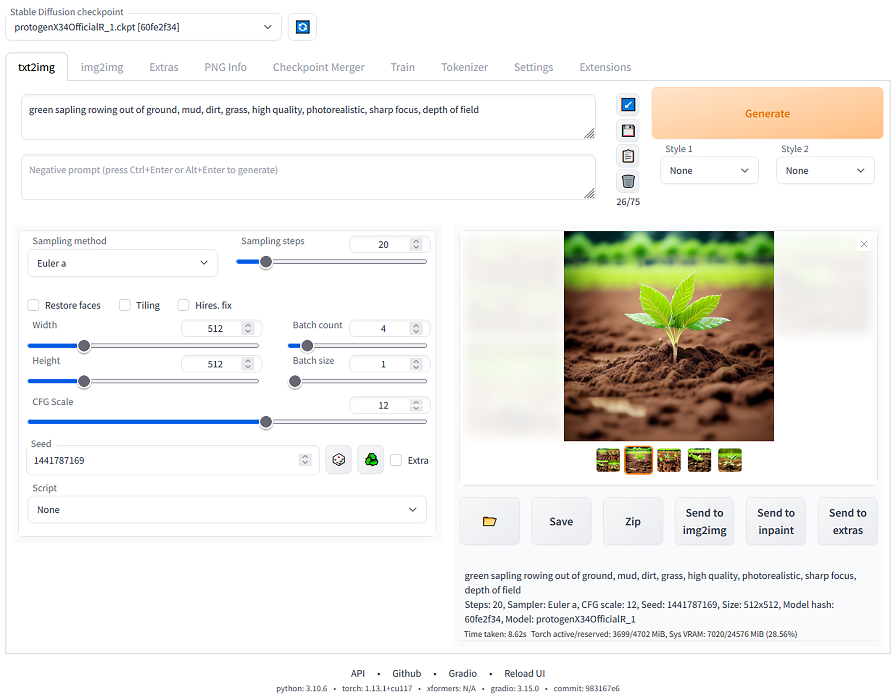

与其他 AI 绘画类模型如 Midjoruney、DALL-E 2 相比，SD WebUI 可以免费在个人电脑或服务器上运行，并根据用户意愿进行改造和扩展。随着社区力量的涌入，SD WebUI 还拥有了丰富的插件，如 LoRA、ControlNet 等，它们让原生 SD 模型的能力和表现更加出色。

目前，SD WebUI 已经支持多平台运行，包括 Windows、MacOS 和 Linux 系统，支持英伟达、AMD 和苹果 M 系列等多种 GPU 架构。对于追求高自由度的 AI 绘画艺术家而言，SD WebUI 几乎已经成为该领域的首选工具。

## 2. WebUI 的安装和部署

一提到安装 WebUI，你可能会担心 GPU 的问题。我事先说明，先把心放在肚子里。因为 WebUI 既可以使用自己的本地 GPU，也可以使用第三方提供的 GPU 资源。

如果你拥有个人显卡或 GPU 服务器，并且希望按照官方的安装方式进行操作，那么首先需要下载 SD WebUI 的代码。你可以使用 Git 命令将整个仓库克隆到本地。如果你的网络速度比较慢，也可以在 GitHub 主页中找到并下载已打包好的 zip 压缩包。

```bash
git clone https://github.com/AUTOMATIC1111/stable-diffusion-webui.git
```

对于 Windows 用户，可以像后面这样操作。

```bash
1. 安装Python 3.10.6，勾选 "Add Python to PATH"。
2. 从Windows资源管理器(CMD终端)中以非管理员的用户身份运行webui-user.bat。
```

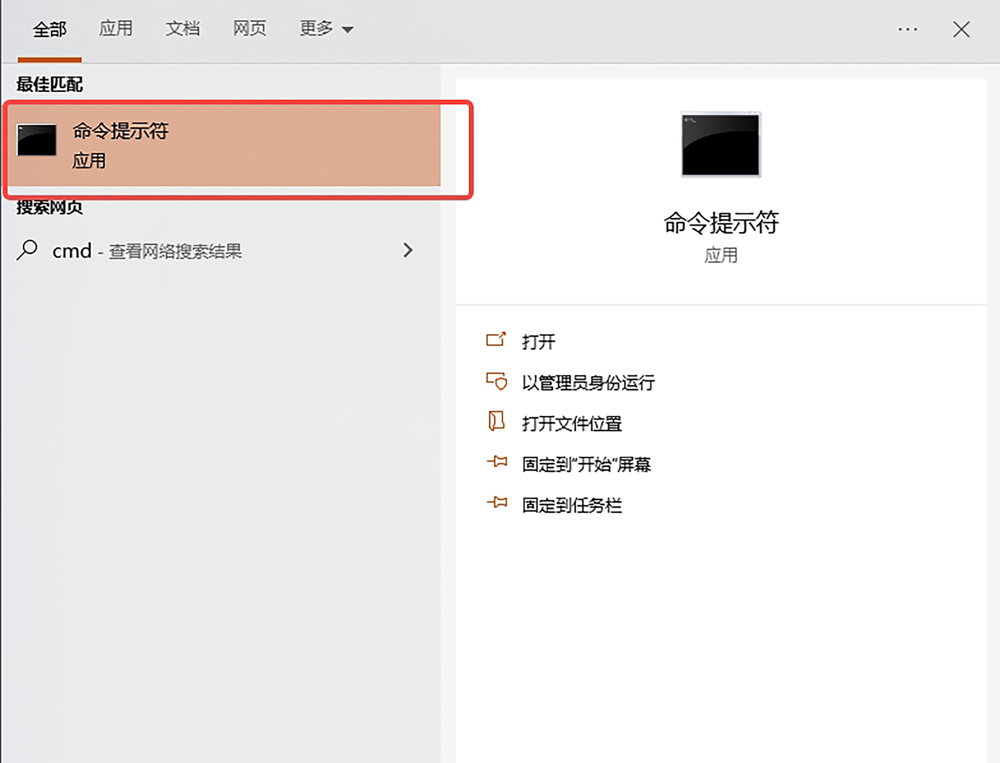

对于 Linux 用户，打开终端命令行。

```bash
# Debian-based:
sudo apt install wget git python3 python3-venv
# Red Hat-based:
sudo dnf install wget git python3
# Arch-based:
sudo pacman -S wget git python3

bash <(wget -qO- https://raw.githubusercontent.com/AUTOMATIC1111/stable-diffusion-webui/master/webui.sh)
```

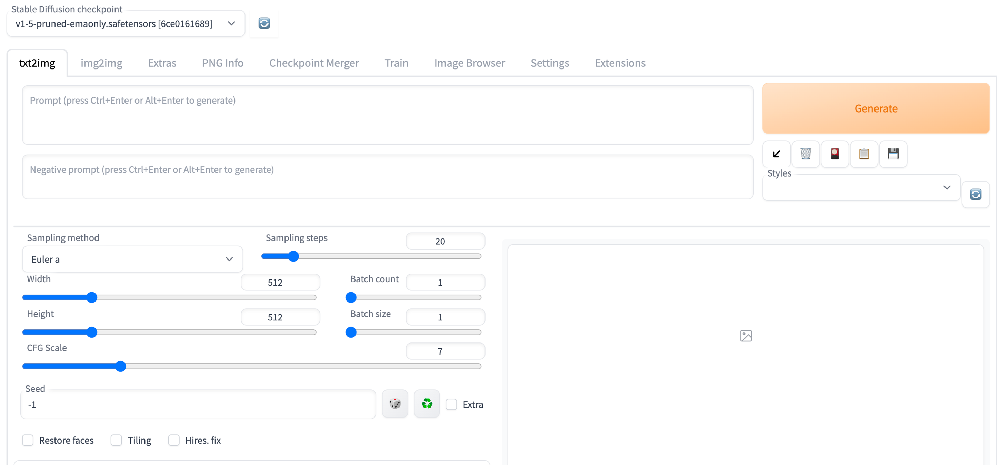

对于苹果 M 系列芯片的电脑用户，打开电脑的 term 命令行工具，根据这个[教程链接](https://github.com/AUTOMATIC1111/stable-diffusion-webui/wiki/Installation-on-Apple-Silicon)来安装 WebUI。

```bash
# 首先cd到你希望安装WebUI的位置

brew install cmake protobuf rust python@3.10 git wget

git clone https://github.com/AUTOMATIC1111/stable-diffusion-webui

cd stable-diffusion-webui

export no_proxy="localhost, 127.0.0.1, ::1"

./webui.sh
```

在你的浏览器输入以下链接 [http://127.0.0.1:7860](http://127.0.0.1:7860)，便可以进入 WebUI。在丐版 M2 处理器的 MacBook Air 上，20 步生成 512 分辨率的单张图像，大概需要 25 秒。即使没有英伟达的高端显卡，也可以在本地进行 AI 绘画。

更详细的安装方案和问题，你可以参考[官方指南](https://github.com/AUTOMATIC1111/stable-diffusion-webui)。

如果你本地没有英伟达显卡，而且不希望等太久，可以使用各种第三方平台提供的 GPU 资源进行操作。这需要发挥下你的聪明才智，也欢迎小伙伴们在评论区留下你的方法。启动 WebUI 后的界面可以看下面的图示。

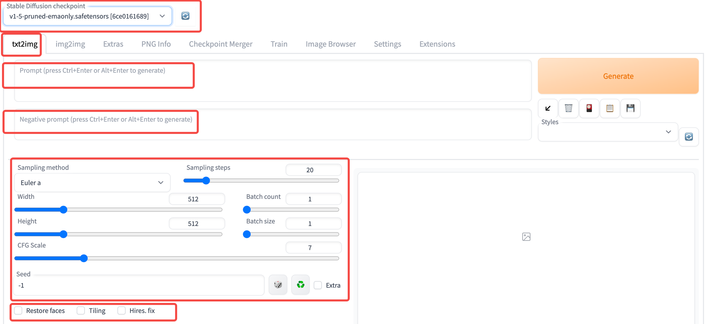

此外，如果你希望进行汉化或者探索更多功能，可以在 Extensions（扩展）中进一步探索。Extensions 提供了一系列额外的功能和工具，里面包括很多功能和定制选项，这让我们的 WebUI 体验更加个性化和定制化。

到这里，我们就完成了 WebUI 的安装和部署。搞定了环境问题，我们便可以玩转 WebUI 了！

## 3. WebUI 基本能力之文生图

现在让我们开始创作吧！首先我们需要熟悉一下后面这些参数信息。

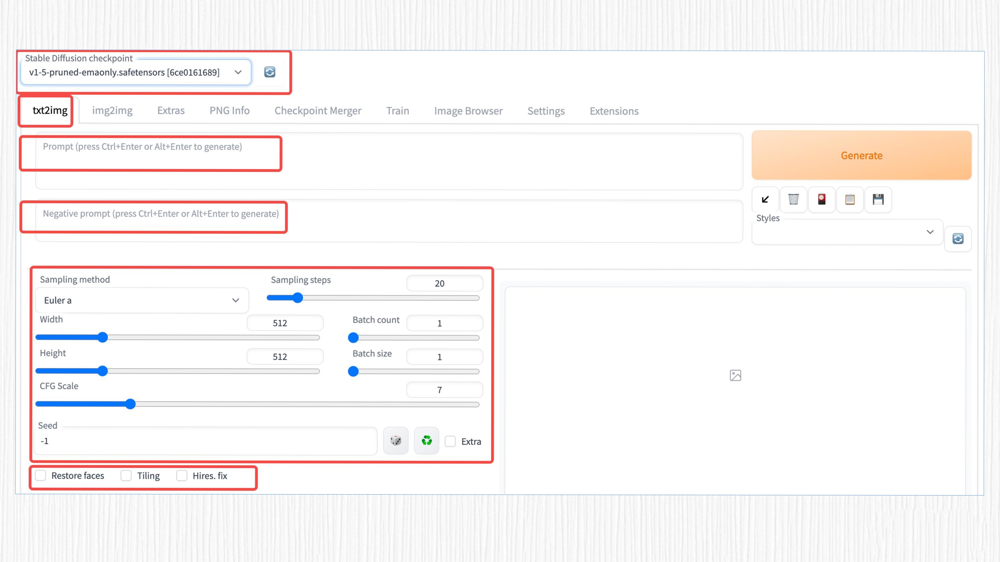

- Stable Diffusion checkpoint：这里可以选择已经下载的模型。目前许多平台支持开源的 SD 模型下载，例如 Civitai、Hugging Face 等。
- txt2img：这个选项表示启用文生图（text-to-image）功能。类似地，img2img 等选项则代表其他功能。
- prompt：用于生成图像的文字输入，需要使用英文输入，但你也可以通过探索 Extensions 来实现中文输入。
- negative prompt：这是生成图像的反向提示词，用于指定你不希望模型生成的内容。例如，如果你不想图像中出现红色，可以在这里输入“red”。
- Sampling method：不同的采样算法，这里深入了 Diffusion 算法领域，稍后我们会更详细地讲解。简单来说，通过这些采样算法，噪声图像可以逐渐变得更清晰。
- Sampling steps：与采样算法配合使用，表示生成图像的步数。步数越大，需要等待的时间越长。通常 20-30 步就足够了。
- Width & Height：生成图像的宽度和高度。
- Batch size：每次生成的图像数。如果显存不够大，建议调小这个数值。
- Batch count：是生成批次，增加这个值会多次生成图片。 Batch size 是每一批的数量，表示每一批次生成多少张图片。 因此生成的图片总数为：`Batch size * Batch count`。
- CFG scale：这里表示 prompt 的影响程度。值越大，prompt 的影响就越大。
- Seed：生成图像的随机种子，类似于抽奖的幸运种子，会影响生成的图像结果。

这些参数的变化会对最终的生成效果产生千般变化。每一个参数都扮演着重要的角色，影响着生成图像的质量、多样性和风格。理解和熟悉这些参数的作用是使用 WebUI 进行图像生成和编辑的关键。

但你不用着急，在后续的课程中，我们将会详细拆解这些参数的作用，逐一介绍它们对生成效果的影响。通过学习这些参数的作用，你将能够更加准确地控制生成图像的特征和风格，实现自己所需的创作效果。

OK，开启 AI 绘画！我们在 WebUI 界面中使用如下参数，让 SD 模型帮我们生成一只可爱的小猫。这里我们使用的是一个名为 RealisticVision 的模型，你可以点开[这个链接](https://civitai.com/models/4201?modelVersionId=6987)进行模型下载，然后将模型放置在 WebUI 安装路径下的模型文件夹中。

```bash
# 模型文件夹地址：./stable-diffusion-webui/models/Stable-diffusion 
model：realisticVisionV13_v13.safetensors[c35782bad8]
prompt：a photo of a cute cat
Sampling method：Euler A
Sampling steps：20
Width & Height: 512
Batch size: 4
CFG scale: 7
seed: 10
```

结果是后面这样。

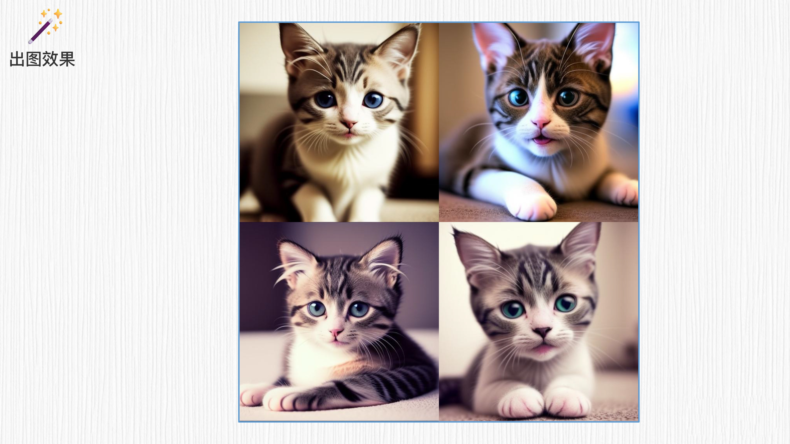

通过 SD 模型，几只可爱的小猫瞬间诞生了！然而，这些小猫似乎带着一丝悲伤。不过，我们可以保持相同的参数，把 prompt 语句稍作修改，在 cute 和 happy cat 之间多写一个单词 “and”。

```bash
prompt：a photo of a cute and happy cat
```

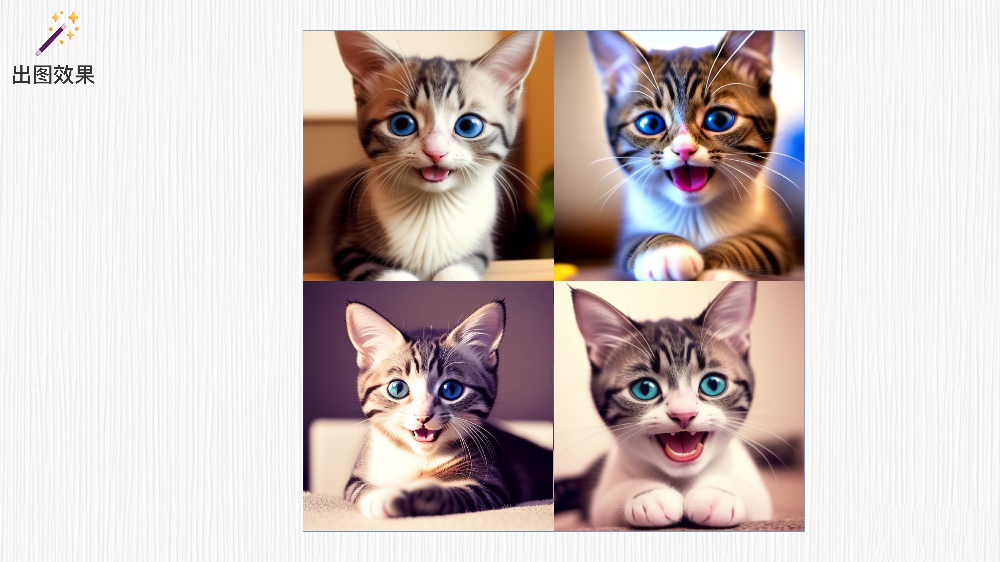

魔法再次生效！现在这些可爱的小猫展现出了微笑的表情。接下来，你可以放飞想象力，将所有的生成和创作交给 SD 模型完成了！AI 绘图的文生图模式已经为你打开大门，更加广阔的创作空间就在眼前！

## 4. WebUI 的其它有趣功能

除了基本的文生图能力外，WebUI 在图像生成和编辑方面几乎无所不能。我们继续探索 WebUI 的其他玩法。

### 4.1 img2img：图生图，不同风格

我先大致给你梳理一下 img2img 的原理。首先，输入图像经过添加噪声的处理，变成了一个“不清晰的噪声图”。然后，通过结合不同的 prompt 语句，图像逐渐变得清晰，并呈现出与 prompt 语句相关的风格。

以一张男士的头像为例，通过使用不同的 prompt 语句，就能将其转变成多种不同的风格，如艺术风格、卡通风格、油画风格等。每一步都会逐渐减少噪声的影响，使得图像细节逐渐清晰，并呈现出与 prompt 语句相匹配的风格特征。

请注意，具体的实现方式可能会因为我们使用的模型和算法而有所不同。这只是一个大致的描述，实际操作需要考虑到具体的模型和算法选择。

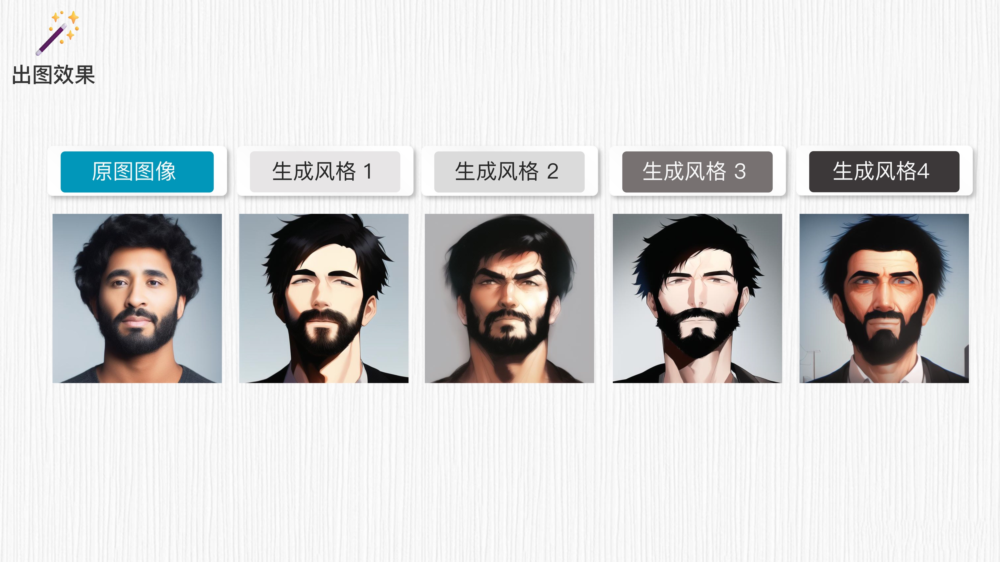

### 4.2 Outpainting：延展图像

我们还可以生成图像之外的区域，这个功能可以帮我们扩展图像的边界或填充缺失的区域，使整体图像更完整。它的基本原理是将原始图像中的图像之外的区域看作“不清晰的噪声图”，但会保持原本区域不变，并参考原始图像的信息来生成原图之外的内容。

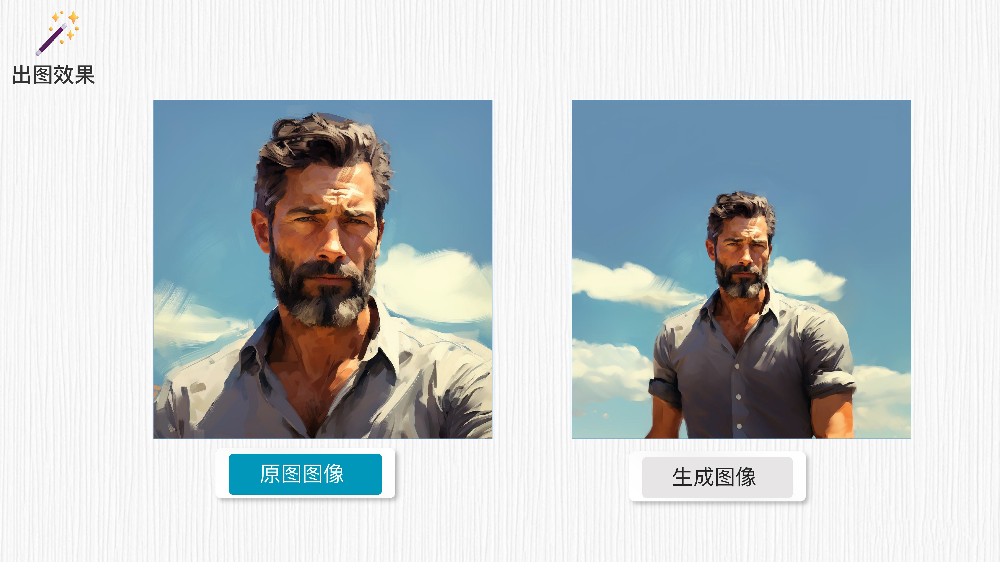

### 4.3 Inpainting：局部重绘

同样的思路，我们可以在图像内部绘制一个遮罩（mask），这个功能使用 WebUI 自带的画笔功能便可以实现。

当我们对要重画的区域进行遮罩后，使用不同的 prompt 语句，就可以为该遮罩重新绘制新的内容。这样做可以根据所选择的风格和要表达的意图，在图像的特定区域上添加或修改内容，从而实现更具创意和个性化的图像效果。

通过与不同的 prompt 语句结合，我们可以为图像内部的遮罩部分赋予各种风格和特征。

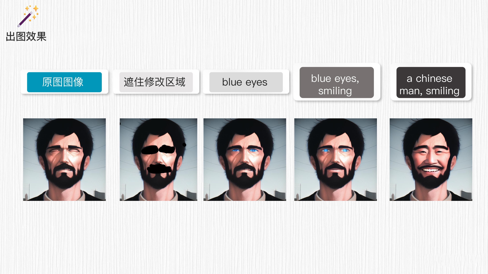

### 4.4 强调 prompt 的关键词

在 WebUI 中，有时我们希望强调 prompt 语句中的特定词汇。为了实现这一目的，我们可以使用圆括号 `( )` 来突出显示这些词汇。举个例子，如果我们想强调少年头发的卷曲特征，即 curly hair，只需在该词汇外添加多个 `( )`，以突出显示该词汇，从而引导生成模型更加关注这一特定要素。

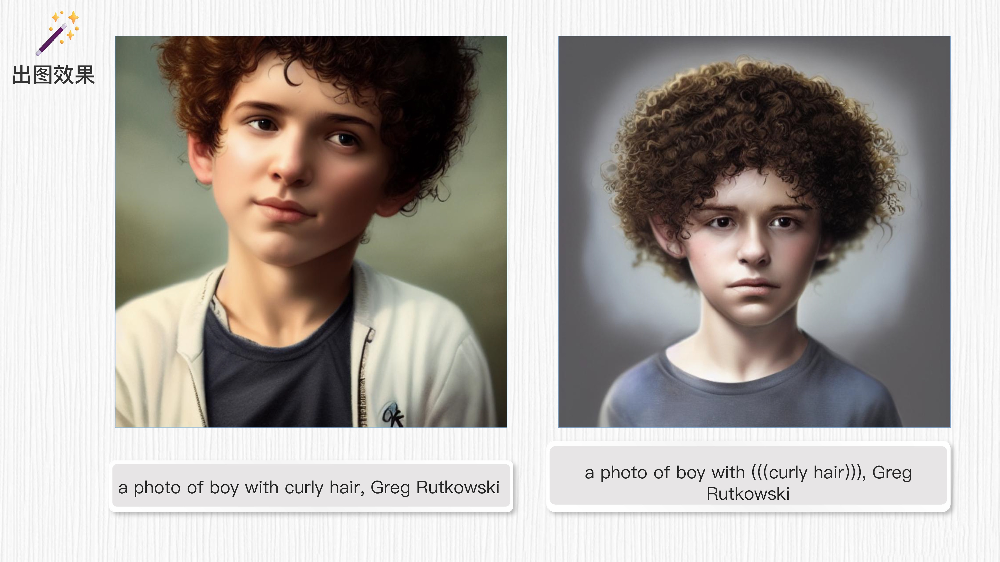

### 4.5 Negative prompt：反向提示词

通过在 negative prompt 区域添加不想出现的信息，比如在此处添加 “smile（微笑）”，就可以去掉笑容。生成模型会参考这些负面 prompt 信息，尽量避免生成带有笑容的图像。这样的处理可以帮助控制图像生成的特定要素，使其符合特定需求或风格。

请注意，生成模型的效果可能会受到多种因素的影响，包括数据集、模型架构等。

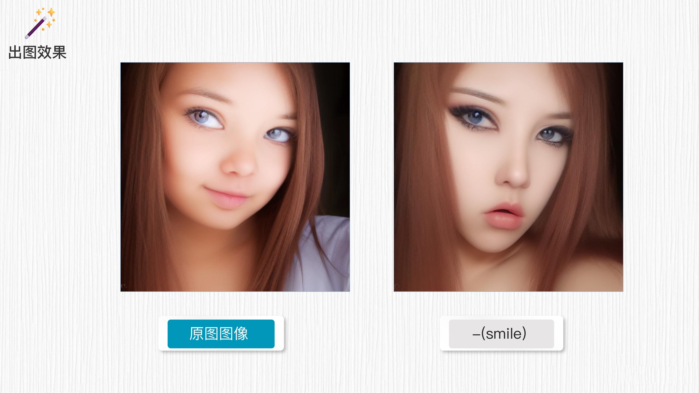

### 4.6 Face restoration：面部修复

对于 SD 模型来说，实现高质量而且精确的人脸生成确实是一个挑战。为了解决这个问题，WebUI 可以结合以往针对人脸修复的工作，例如 GFPGAN、CodeFormer 等，对生成图像中的人脸区域进行修复，从而提高人脸的生成质量。

通过对生成的人脸进行修复，可以改善细节、纠正不准确的特征，让生成的人脸显得更加自然和美观。这种修复过程可以针对人脸区域做精细调整，提升生成结果的真实感和质量。

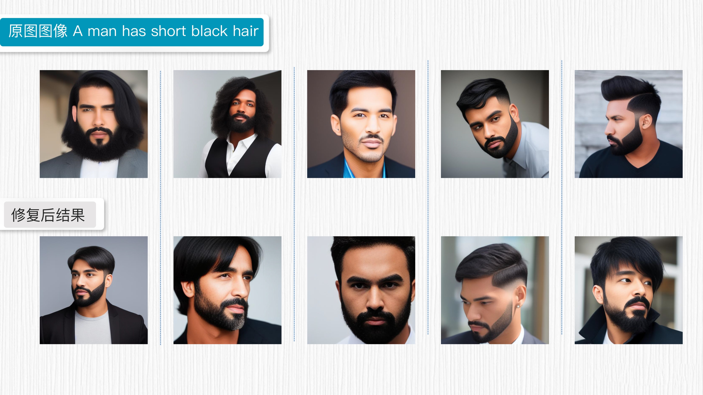

## 5. WebUI 的功能拓展插件

WebUI 的功能，不光是前面我们提到的这几种。通过探索 WebUI 的 Extensions，你会发现更多让人惊喜的功能和工具，实现更多个性化的需求。例如，你可以探索中文输入的扩展，方便你在中文模式下生成和编辑图像。

此外，用户也可以通过自定义训练模型，实现更加个性化和定制化的图像生成。通过指定特定的风格和样本图像，用户可以训练出符合自己需求的模型，进一步发挥创造力。

总之，WebUI 的功能远远超出我们展示的范围，它为用户提供了一个广阔的创作空间。期待你能充分发挥想象力，探索出更多新颖和创造性的玩法，将 WebUI 的潜力发挥到极致。无论是专业人士还是爱好者，都能在 WebUI 中找到满足自己创作需求的工具和功能。让我们一起期待更多精彩的创作和探索！

## 6. 总结时刻

这一讲，我们学习了 Stable Diffusion 模型，了解了它在创意图像生成和编辑中的应用。

Stable Diffusion 模型是一种基于噪声图像逐步演化的生成模型。通过对图像进行多次采样和演化，我们可以逐渐生成高质量、多样性的图像。

为了满足普通人使用 SD 模型的需求，WebUI 这个强大的图形化界面工具应运而生，它为我们提供了便捷的使用接口和丰富的功能。

通过 WebUI，我们可以轻松选择和加载已训练好的 Stable Diffusion 模型，使用文生图等功能生成具有创意和多样性的图像。我们还介绍了 WebUI 中的一些关键参数，如 prompt、negative prompt 等，它们对图片生成效果起着重要的影响。

此外，我们还探索了 WebUI 的其他功能，如图像编辑、样式迁移等，这些功能使得我们可以在图像生成和编辑过程中实现更多的创作可能性。WebUI 的易用性和灵活性使得它成为广大创意艺术家和 AI 爱好者的首选工具之一。

希望这一讲能够激发你对 WebUI 工具和 Stable Diffusion 模型的兴趣和热情，并尝试开启广阔的创作空间。

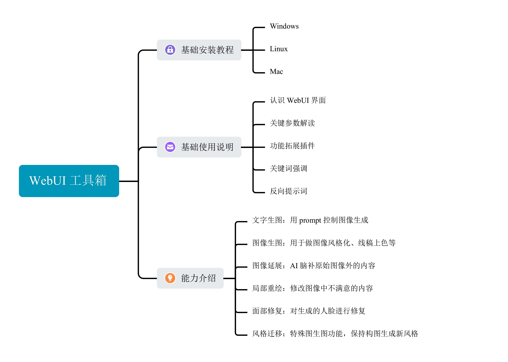

## 7. 思考题

你的工作与图像和创意创作有关吗？WebUI 在这方面扮演怎样的角色呢？

欢迎你在留言区与我交流讨论，并把今天的内容分享给身边的同事和朋友，和他一同探索 AI 绘画的无限可能！

## 8. 补充

::: info 环境安装

:::

Win11 搭建笔记：https://xie.infoq.cn/article/62e1d389d8a0c4c7638ba610d 

Mac M1版本搭建笔记：https://xie.infoq.cn/article/5fd4d53d1ed467f51c4c7f7a2 

> Mac 的版本是很早前的笔记了，如果使用win11中的方法，大概率应该也不会再报那些奇怪的错误了。

---

::: info 好像不支持 mac M 芯片的 GPU 吧，只能用 cpu 跑

:::

作者回复: 你好，M 芯片中同时包含 CPU、GPU 和 NPU。实际在运行 WebUI 的时候，一些运算是在 GPU上进行加速的。如果你观察 WebUI 作图时的实时功耗会发现，GPU 几乎是打满的。无论如何，使用 M 芯片作图速度还是慢一些，需要一点点耐心。希望能帮助到你。

---

::: info 老师，运行报错：NansException: A tensor with all NaNs was produced in VAE. Use --disable-nan-check commandline argument to disable this check。这个要怎么处理。百度了一圈还是没处理掉。谢谢

:::

作者回复: 你好。出现这个报错可能是下载的 SD 模型有一些问题，印象里我也遇到过。你可以下载这个模型试试：https://civitai.com/models/4201?modelVersionId=105674。下载后放置在 `stable-diffusion-webui/models/Stable-diffusion` 路径下。按照这个方式运行 webUI：`./webui.sh --disable-nan-check`。如果遇到更多安装问题，可以参考这个 macOS 的 webUI 问题专用讨论帖：https://github.com/AUTOMATIC1111/stable-diffusion-webui/discussions/5461。希望能够帮助到你。

---

::: info SD 是已经训练好的模型，我们只是拿来使用对吧？ SD  WEB UI 部署到本地，模型也在本地，也就是不用联网都行了，对吧？

:::

作者回复: 你好。是的，当我们把 SD 模型下载到本地后，不需要联网也可以使用 WebUI。另外，WebUI 的插件也支持我们本地训练 LoRA 模型，我们后面的课程中也会涉及。

---

::: info 推荐几个低成本体验ai绘画的方式：https://note.youdao.com/s/XwhBsykQ

:::

---

::: info 老师，请教一下，如何搭建 stable diffusion 的 python 脚本呢？  目前主要根据 webui 测试好的出图配置，但是要如何写成对应的 python 脚本在服务端部署呢？ 我尝试了调 diffusers 的 pipeline 例如 from diffusers import StableDiffusionControlNetPipeline，但是 webui 中使用的一些采样方法在里面无法找到替代。 请问老师还有没有其他从头搭的方法？

:::

作者回复: 你好，diffusers 这个代码仓是比较推荐的 SD 脚本化使用方式：https://github.com/huggingface/diffusers/tree/main，里面提供的采样器和 WebUI 提供的采样器确实有差异（https://github.com/huggingface/diffusers/tree/main/src/diffusers/schedulers）。

有两个建议：一般而言，不同采样器之间得到的结果差异不是很大， 使用 python 代码生图可以考虑使用 diffusers 中提供的采样器做替换；或者，重新实现你想要的采样器的代码逻辑，相当于对 diffusers 仓做扩展，这部分会涉及较大工作量。 在后面采样器章节，我们也会对采样器的原理和选择做详细讲解。希望能帮助到你。

- https://www.lanrui-ai.com/register


欢迎关注我公众号：AI悦创，有更多更好玩的等你发现！

::: details 公众号：AI悦创【二维码】


:::

::: info AI悦创·编程一对一

AI悦创·推出辅导班啦，包括「Python 语言辅导班、C++ 辅导班、java 辅导班、算法/数据结构辅导班、少儿编程、pygame 游戏开发」，全部都是一对一教学：一对一辅导 + 一对一答疑 + 布置作业 + 项目实践等。当然，还有线下线上摄影课程、Photoshop、Premiere 一对一教学、QQ、微信在线，随时响应！微信：Jiabcdefh

C++ 信息奥赛题解，长期更新！长期招收一对一中小学信息奥赛集训，莆田、厦门地区有机会线下上门，其他地区线上。微信：Jiabcdefh

方法一：[QQ](http://wpa.qq.com/msgrd?v=3&uin=1432803776&site=qq&menu=yes)

方法二：微信：Jiabcdefh

:::


