``

``

你好，我是悦创。

之前我们解锁了 Web UI 的七大特色功能，如果拿烹饪来做比喻，前一讲的内容大概只是把菜做熟的程度，还无法产出“色香味”俱全的图像作品。实际应用的时候，你很可能遇到后面这些困扰。

- 图生图如何优化，如何生成具有特定特征或内容的图像？
- 输入了提示词，但 AI 模型不太“听话”，要怎么做参数调优？
- 怎样生成多样风格的图像作品？

这一讲我们就来解决这些问题，学习影响图像风格、内容和质量的重要参数。熟练掌握应用和优化这些参数的技巧以后，你就可以随心所欲地控制 AI 绘画的构图、内容和风格，制作出更符合自己心意的专属内容了。

## 1. WebUI 咒语指南：prompt 入门

想要控制 Stable Diffusion 创作我们喜好的图像，熟练运用 prompt（提示词）至关重要。在开源社区中，prompt 甚至因为对 AI 绘画的神秘影响，被赋予了“咒语”或“魔法”的称号。

不过 prompt 其实并没那么玄乎，学完它的使用方法和实用技巧以后，你也能成为 AI 绘画界的杰出“魔法师”。

### 1.1 初阶咒语：直接描述

prompt 最简单且常见的用法，就是直接在 prompt 区域描述我们想要创作的图像，例如输入 `a happy dog and a cute girl`。通过这样的描述，我们可以生成后面这样的图像。

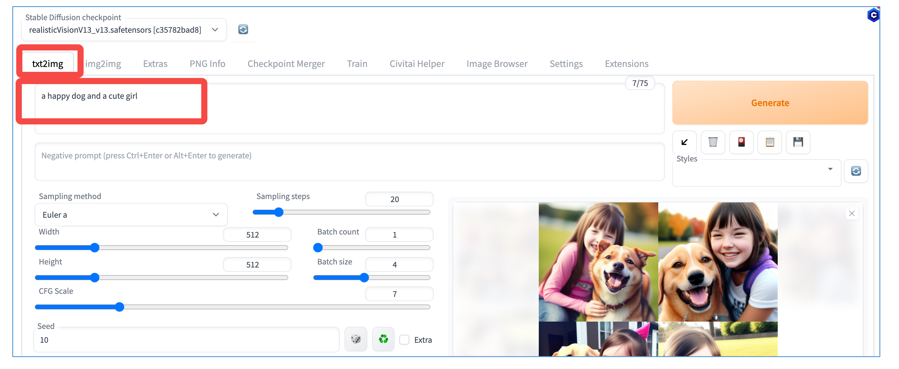

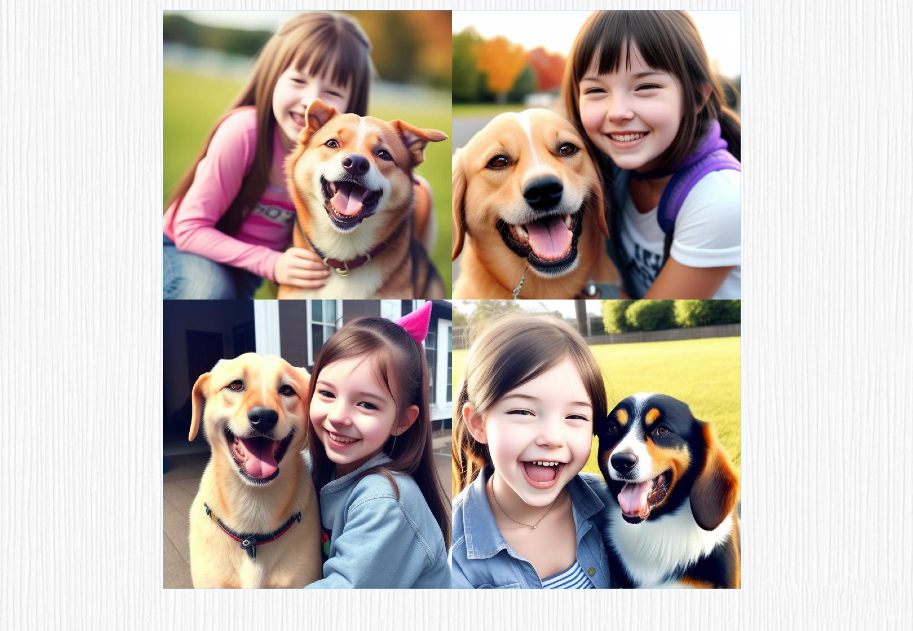

如果你想生成和我相同的图像，请记得将 SD 基础模型选择为 realv1.3，固定随机种子设为 10。采样方法选择 Euler a，步数选择 20，CFG Scale 为 7。目前你可能还不熟悉这些参数的含义，不必担心，我们将逐步了解它们。

紧接着，我们可以通过修改 prompt 来赋予创作图像不同的风格化效果。例如，我们可以使用以下修改后的 prompt： `a happy dog and a cute girl, watercolor style`。这样生成的图像会呈现水彩风格的效果。

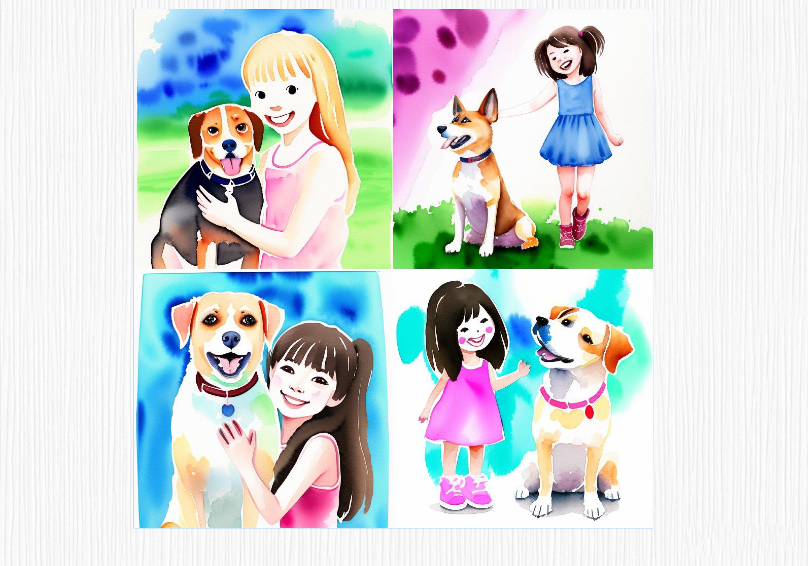

通过添加两个描述单词，我们可以看到整个画面发生了巨大的变化，图像的风格都变成了水彩风，这正是 prompt 的魅力所在！

### 1.2 二阶咒语：巧用标签

当然，我相信同学们对美的追求是无止境的。现在让我们进一步提升这幅画的质量，方法就是使用标签（tag）继续优化。

例如，在我们之前的 prompt 语句中添加 “best quality” 和 “masterpiece”，最终的句子会变成：`best quality, masterpiece, a happy dog and a cute girl, watercolor style`。这样的修改将进一步提升生成画面的质量。

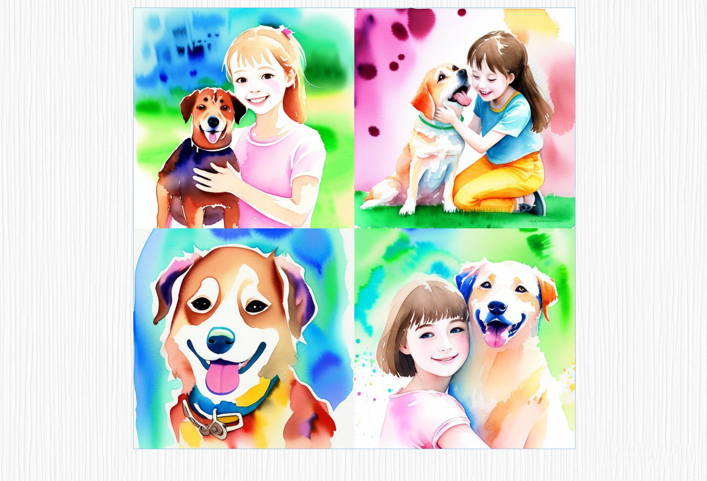

可以看到，画面变得更美了！SD 模型的绘画技巧真是令人惊叹！不过别光顾着开心，我们仔细看一下生成的图片，似乎出现了一些问题。左下角只有小狗，可爱的小女孩似乎不见了。这正是当前 SD 模型的局限性，它对于 prompt 语句的表达能力还不够充分。

### 1.3 三阶咒语：负面提示词

为了获得更好的创作效果，我们通常需要生成多张样本，然后反复修改我们的 prompt 语句。社区的朋友们也称这个过程为“抽卡”，我们只能依靠运气来获取满意的图像。但作为专业的魔法师，我们还是有办法挽救这个图像的。这时，我们可以进一步结合 **负向提示词（negative prompt）** 进行创作。

具体做法就是，在 negative prompt 区域填入“`lowres, bad anatomy, extra digits, low quality`”。所谓 negative prompt，代表的是我们不想拥有的特性。

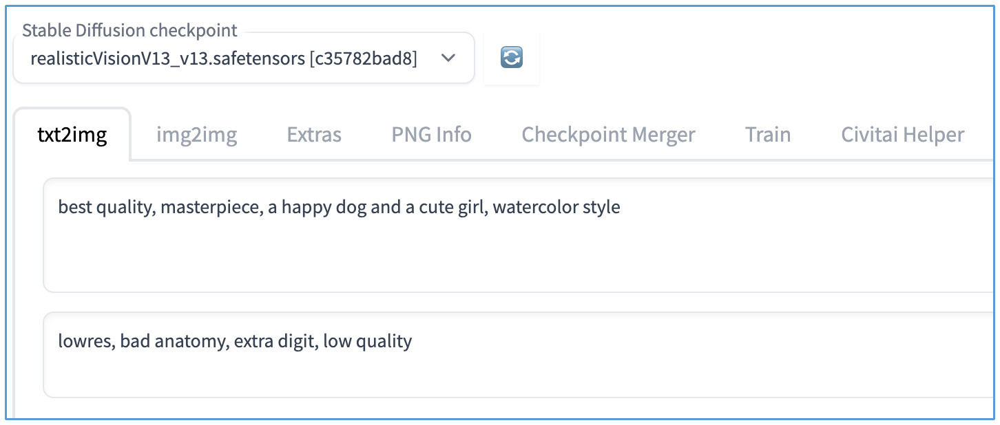

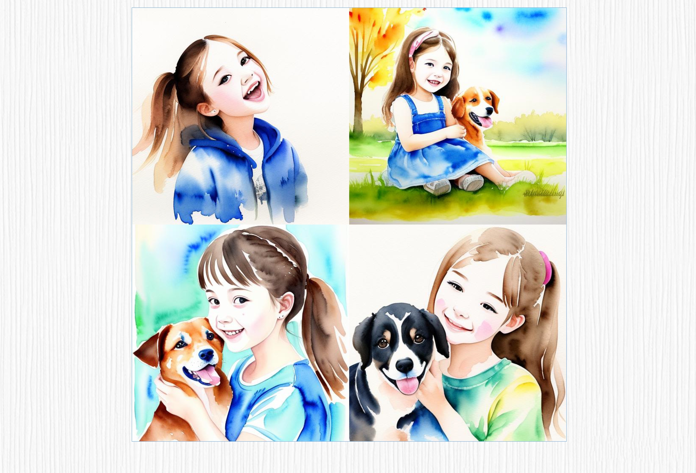

上面这个例子可以说明，控制 SD 模型的确是一项挑战，但也正是这种挑战性赋予了它独特的魅力。正因为 SD 模型做出来的图像难以预测，才让每一次创作都充满了惊喜和探索的乐趣。

不过很多情况下，我们还是希望 SD 模型不要太过自由发挥。这时候就需要用到 ControlNet 模型。它能够更精确地控制生成的图像，让我们能够更好地实现自己的创作愿景。关于 ControlNet 的原理和使用技巧，我们后面的课程还会详细展开讲解，这里你先留一个大致印象就行。

### 1.4 四阶咒语：文本权重调整

好，言归正传，我们先继续探索 prompt 的神奇魅力。在没有 ControINet 的情况下，我们实际上可以通过一些巧妙的语法，让 SD 模型知道在 prompt 中要关注的重点。

这里我们需要用上一种叫做 `()` 的特殊语法来增强提示词的权重。

我们还是结合例子来体会这个语法。比方说，我们把 prompt 语句修改为：`best quality, masterpiece, a happy (dog) and a cute girl, watercolor style`，那么它将产生后面这样的图像。

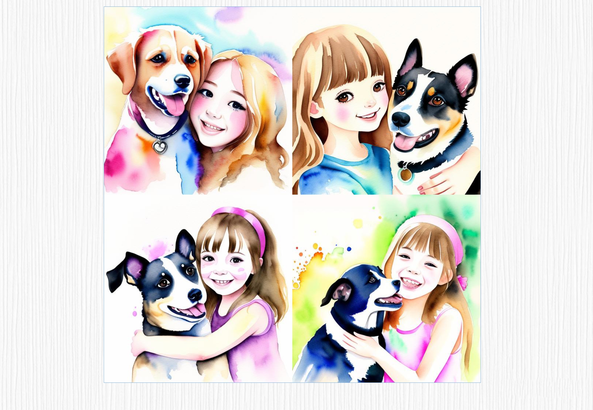

对比一下前面的作品，是不是挺惊喜的？终于，欢快的小狗和可爱的女孩再次同框了，新咒语生效！

现在我们总结一下“施法”技巧：在 prompt 中添加 `()` ，默认情况下会让对应的单词产生 `1.1` 倍的强度。双括号 `(())` ，则表示 `1.1 x 1.1` 倍的加强。当然，我们也可以直接将数字写上去，例如` (dog:1.2)` 。

正确地运用这种技巧，可以帮助我们更好地控制创作的效果。不过通常情况下，我不建议该权重超过 `1.3`，否则对画面的影响很大，甚至不能产生正常的图像。

**补充：**

- 强度范围没有严格的约定，设置设置过大可能会生成糟糕的效果。关于 prompt 的更多用法说明我推荐这个链接：[https://github.com/ivon852/stable-diffusion-webui-manuals/blob/main/content.zh-cn/prompts/general-prompt-guide.md](https://github.com/ivon852/stable-diffusion-webui-manuals/blob/main/content.zh-cn/prompts/general-prompt-guide.md)。

## 2. 中型法阵：引入 LoRA

除了添加文本和文本强度的变化，我们还可以通过在 prompt 区域中引入 LoRA 来实现风格的二次变化。如果前面的还是入门程度的咒语，那 LoRA 就相当于让作品脱胎换骨的进阶法阵。

LoRA 模型可以看作是原始模型的新特效，你可以这样理解：LoRA 相当于给原有模型穿上了“新服饰”一样，能让图像呈现出不同的表现。我们这就来体会一下，在 prompt 区域中使用 LoRA 的咒语是什么效果。

我们需要先了解规范的“念咒”动作，标准写法是 `<lora: 模型文件名: 权重 >`。

通常权重的范围是 0 到 1，其中 0 表示 LoRA 模型完全不起作用。WebUI 会自动加载相应的 LoRA 模型，并根据权重的大小进行应用。这些 LoRA 文件可以是自己训练的，你也可以从开源社区获取。关于 LoRA 的神奇之处和制作方法，我们后面的课程里会逐步介绍，敬请期待。

现在，假设我们已经获取了一个风格化的 LoRA 模型，例如在 Civitai 开源社区的 “大概是盲盒” 这个 LoRA 模型。[https://civitai.com/models/25995?modelVersionId=32988](https://civitai.com/models/25995?modelVersionId=32988)

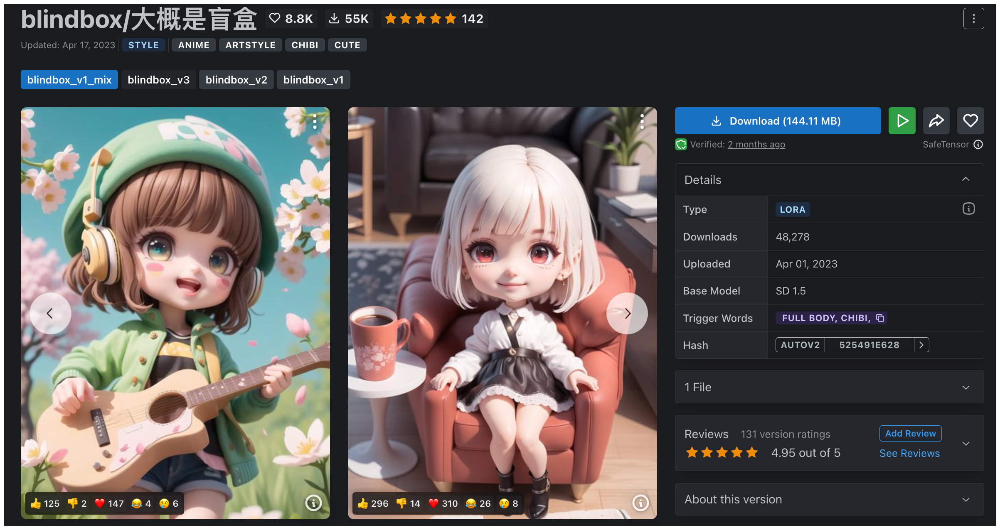

我们将其下载并放入 `stable-diffusion-webui/models/Lora` 文件夹，然后就可以在 WebUI 中看到这个模型了。

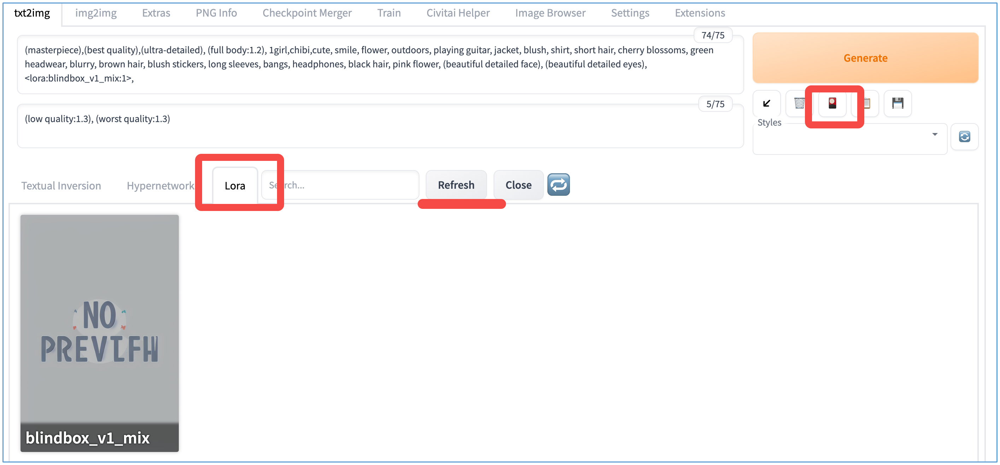

现在，我们将前面学到的技巧融为一体，输入后面这样的指令。

- prompt：

::: code-tabs

@tab en

```bash
(masterpiece),(best quality),(ultra-detailed), (full body:1.2), 1girl,chibi,cute, smile, flower, outdoors, playing guitar, jacket, blush, shirt, short hair, cherry blossoms, green headwear, blurry, brown hair, blush stickers, long sleeves, bangs, headphones, black hair, pink flower, (beautiful detailed face), (beautiful detailed eyes), <lora:blindbox_v1_mix:1>
```

@tab zh

```bash
（杰作），（最高品质），（超级详细），（全身：1.2），1个女孩，Q版，可爱，微笑，花，户外，弹吉他，夹克，害羞，衬衫，短发，樱花，绿色头饰，模糊，棕色头发，害羞贴纸，长袖，刘海，耳机，黑发，粉色花朵，（美丽详细的脸），（美丽详细的眼睛），<lora:blindbox_v1_mix:1>
```

:::

- egative prompt：

```bash
(low quality:1.3), (worst quality:1.3)
```

这时，我们的新图像也将会变成后面的样式。

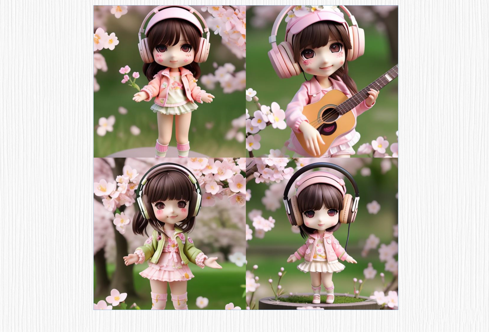

你看，可爱的、盲盒版本的、爱音乐的小女孩就创作出来了。想必你也发现了，相同的模型，在 LoRA 的加持下，生成的图像会呈现出完全不同的风格。所以，如果能成为 prompt 的使用高手，你就离成为 WebUI 的 AI 绘画大师更近了！

另外，开源社区还整理了许多相关的[魔法法典](https://docs.qq.com/doc/DWHl3am5Zb05QbGVs)供我们参考。你可以借助这些资料，寻找更多指导和灵感，进一步提升自己的技能，在 AI 绘画的旅程中更上一层楼。

## 3. 文生图的引导：CFG Scale 提示词相关性

讲完最基础的 prompt 语句，下面让我们探讨一些配合 prompt 起作用的重要参数。

首先是 CFG Scale，也就是我们常说的 “提示词相关性”。CFG Scale 在有的教程中也叫 Guidance Scale，二者是一回事。我们这就来看看这个参数又会让 AI 绘画作品出现怎样的奇妙反应。

在 WebUI 中，CFG Scale 的范围是 1-30，默认值为 7。我们可以通过调整不同的 Scale 值来观察图像的变化。以输入 prompt 语句 “`a dog, cartoon style`” 为例。如下表所示，不同的 Scale 值会产生不同的效果。

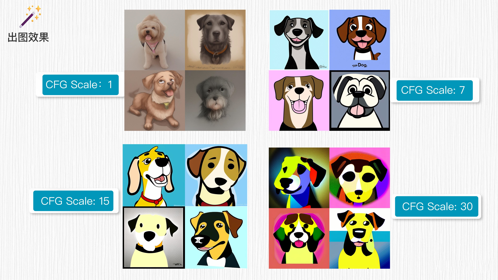

从下一讲开始，我们便会引入一些具体的代码实操，很多代码运行需要用到 GPU 资源。对于没有 GPU 或服务器的同学来说，我们仍然可以充分利用一些免费的服务器资源，其中 Google Colab 便是一个不错的选择！

Google Colab 是一款强大而便利的云端编程环境，具备许多优势。首先，它无需安装和配置，用户只需拥有浏览器和可靠的网络连接，即可立即开始编写和运行代码，省去了繁琐的安装步骤。其次，Google Colab 是免费使用的，为学生、研究人员和开发者提供了免费的实验和学习环境。

特别提示一下，Google Colab 需要用到 Google 账号！解决这个问题就要发挥你的聪明才智了。

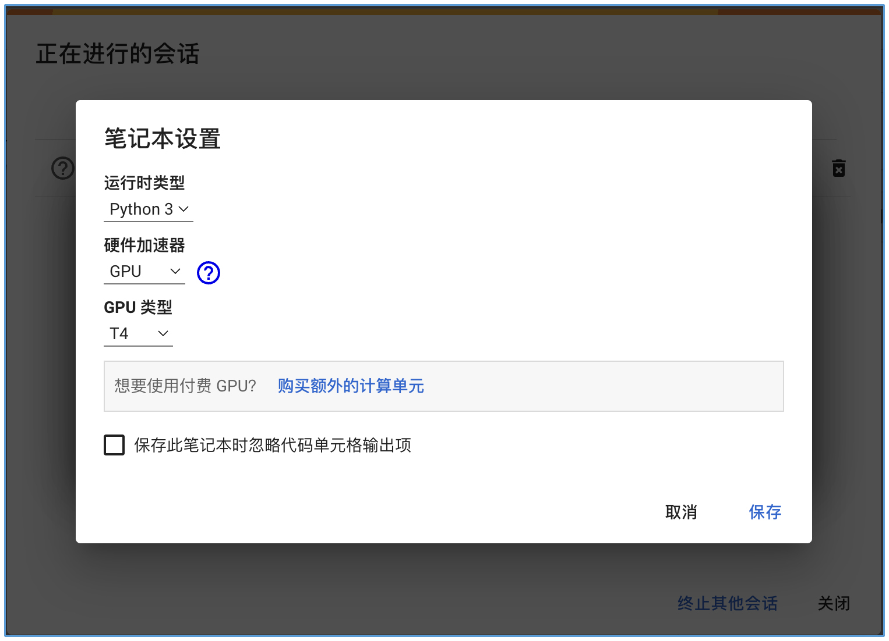

## 4. 总结

这一讲我们学习了 AI 绘画的很多“施法咒语（prompt 技巧）”和重要参数，现在我们来做个总结。

我们今天重点学习了如何设计巧妙的 prompt 咒语，比如标签用法、负面提示词、文本权重控制、LoRA 用法等。同时，还探索了围绕 prompt 的关键参数 CFG Scale 对于最终 AI 绘画成图效果的影响。

在使用 SD 模型进行 AI 绘画时，正确使用和设计 prompt 至关重要。prompt 可以用来引导模型生成特定风格、内容或特征的图像。通过精心构思和设计 prompt，你可以激发模型创造出符合你意愿的艺术作品。

CFG Scale 是文生成图模型中的一个重要参数，它表示输入文本对生成图像的影响程度。较高的 CFG Scale 值可以使生成图像更贴近 prompt 的信息，但并非越高越好。通过调整 CFG Scale 值，你可以控制生成图像与提示之间的相似度，从而获得期望的结果。

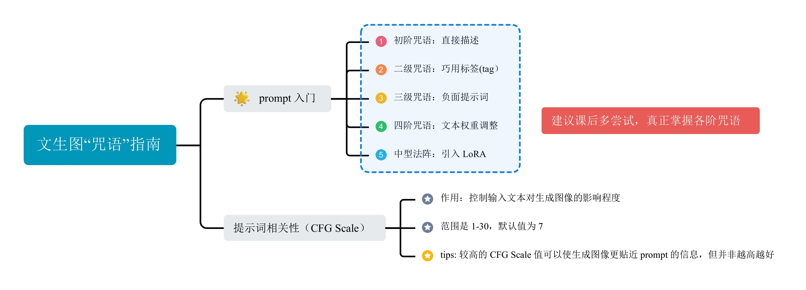

## 5. 思考题

如果你想绘制一幅精细化的人物肖像，AI 绘画生成的图像在手部和脸部细节存在瑕疵。这种情况下，有哪些方法可以改善这些问题？

期待你在留言区和我交流讨论，也推荐你把今天学到的内容分享给更多朋友，我们一起探索 AI 绘画的无限潜力！

---

**学员 Toni：**

- 思考题: 如果你想绘制一幅精细化的人物肖像，AI 绘画生成的图像在手部和脸部细节存在瑕疵。这种情况下，有哪些方法可以改善这些问题？
- 我尝试了下面的提示词：

```bash
a beautiful women, medium shot, studio light, Realism Portrait
```

- 当使用 "`a utral detailed portrait of ...`" 时，效果与 "close up" 接近:

```bash
a utral detailed portrait of a beautiful women,
```

应对手部和脸部的瑕疵，使用了下面的负面提示词:

```bash
mutated hands, fused fingers, too many fingers, missing fingers, poorly drawn hands, blurry eyes, blurred iris, blurry face, poorly drawn face, mutation, deformed, ugly, blurry, bad anatomy, bad proportions, extra limbs, cloned face, disfigured, out of frame, multiple faces, long neck, nsfw, 
```

请大家补充好的想法。

## 6. 补充

::: info 希望老师再多增加一些关于 CFG Scale的讲解

:::

作者回复: 你好，在经典模型解读的篇章我会对 CFG Scale 的算法原理做更多讲解。热身篇你可以先试着调调这个参数（比如在5.0-15.0这个范围内调整，7.5是常用设置），或者遵循 CivitAI 图片中的 CFG Scale 参数设置来做图。希望能帮助到你。

---

- 介绍两个插件，方便小伙伴们更好的使用 webui 和提示词 http://gk.link/a/1277p
- 找到一个还不错的提示词网站 https://stablediffusion.fr/prompts


欢迎关注我公众号：AI悦创，有更多更好玩的等你发现！

::: details 公众号：AI悦创【二维码】


:::

::: info AI悦创·编程一对一

AI悦创·推出辅导班啦，包括「Python 语言辅导班、C++ 辅导班、java 辅导班、算法/数据结构辅导班、少儿编程、pygame 游戏开发」，全部都是一对一教学：一对一辅导 + 一对一答疑 + 布置作业 + 项目实践等。当然，还有线下线上摄影课程、Photoshop、Premiere 一对一教学、QQ、微信在线，随时响应！微信：Jiabcdefh

C++ 信息奥赛题解，长期更新！长期招收一对一中小学信息奥赛集训，莆田、厦门地区有机会线下上门，其他地区线上。微信：Jiabcdefh

方法一：[QQ](http://wpa.qq.com/msgrd?v=3&uin=1432803776&site=qq&menu=yes)

方法二：微信：Jiabcdefh

:::


