``

``

你好，我是悦创。

前一讲我们学习了如何优化文生图、图生图过程中的关键参数，让 AI 模型更加听话。但是，如果我们想要进一步展现自己的创意和想象力，比如创作漫画时让 AI 帮我们生成特定风格和特定人物，又该怎么办呢？

为了解决这个问题，我们可以考虑在原有模型上引入 LoRA 技术。引入 LoRA（Low-Rank Adaptation），最初只是想把它当成微调大型语言模型的方法。然而，在 AI 绘画领域，它展现了独特的作用。通俗一点说，我们可以将 LoRA 比喻为一条在广袤大道上的小路，这两条路径都可以达到目的地，但所见的景色却完全不同。

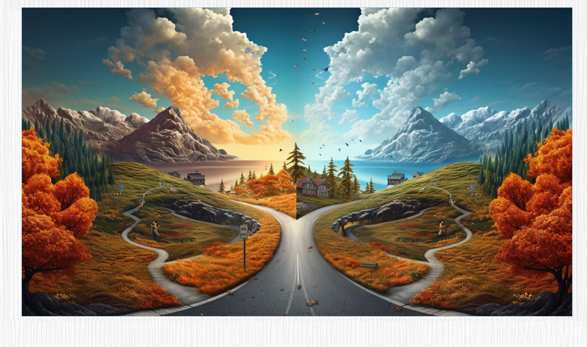

```text
Midjourney: A main road is divided into two small roads, and the scenery of the two roads is different --no broken road --ar 16:9
```

这一讲我们将使用 LoRA 技术来制作一个属于你自己的漫画故事。无论是故事情节、角色设计还是画风表现，都可以完全按照你的创意和想象来打造。我们这就来开启精彩作品的创作之旅！

## 1. 变化万千的 LoRA

相比我们前面学到的 prompt 和其他调参方式，LoRA 模型能给我们提供更大的灵活性和控制力，让我们在图像创作上实现更多样化的结果。同样的 SD 模型，引入不同的 LoRA 模型后就会呈现变化万千的风格，我们这就来一探究竟。

### 1.1 风格化的 LoRA

为了在 WebUI 中添加 LoRA 的效果，我们需要下载心仪的 LoRA 模型。

我们先打开 [Civitai](https://civitai.com/) 网站，找到网站右上角类似漏斗的符号，它能帮我们选择不同功能或设置。当你点击这个漏斗并选择 LoRA 时，网站界面会提示你选择基础模型（Base model）。因为每个 LoRA 要结合基础模型才能使用。选定基础模型后，网站便会呈现所有适合当前基础模型的 LoRA 模型。

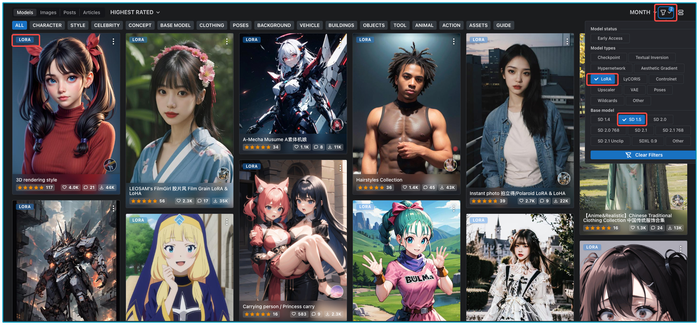

你也可以点开一个 LoRA 模型，通过点击图像下方的感叹号来查看当前图像在生成时用到的基础模型。

我们结合一个具体例子来看看。从下面的图中你可以看到，模型卡片上写到的基础模型是 SD1.5，而我们选中的图像用到的基础模型是另一个模型（revAnimated_v122）。事实上，社区中很多基础模型都是基于 SD 模型的微调。当前这个 LoRA 可以和 SD1.5 微调后的模型进行搭配使用，产生更多样化的效果。

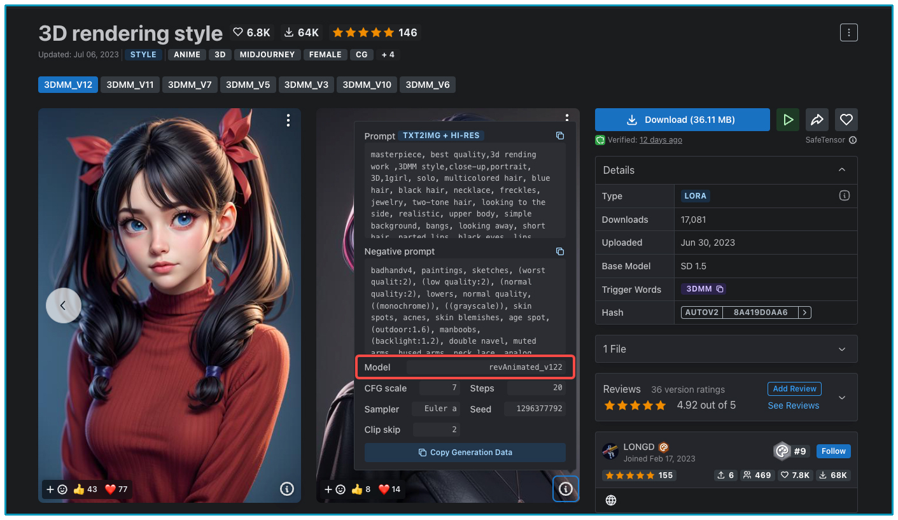

我们需要考虑最终预期的图像风格是什么样，再据此选择合适的基础模型。当我们遇到一个自己喜欢的 LoRA 模型，需要在 Civitai 的模型信息中找到这个 LoRA 模型对应的基础模型。下载好对应的基础模型，放置在 WebUI 安装位置下面的路径中：`stable-diffusion-webui/models/Lora`，你便可以获得跟样图十分类似的效果。

然后，在当前页面中，你将看到所有经过筛选后的 LoRA 模型的模型卡片。这些模型卡片通常会在左上角标有 LoRA 的标识方便我们快速辨认。你可以浏览这些模型卡片，查看它们的描述、示例图像和其他相关信息，选出一个你喜欢的 LoRA 模型。

现在，假设我们已经获取了一个风格化的 LoRA 模型，例如在 Civitai 开源社区的“[大概是盲盒](https://civitai.com/models/25995)” LoRA 模型。

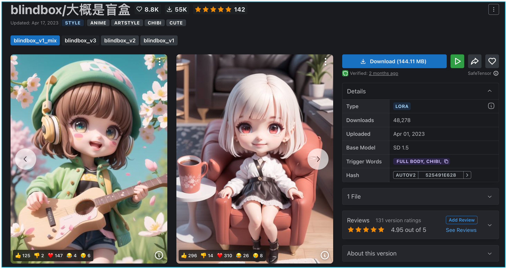

我们将其下载并放入 `stable-diffusion-webui/models/Lora` 文件夹，可以在 WebUI 中看到。

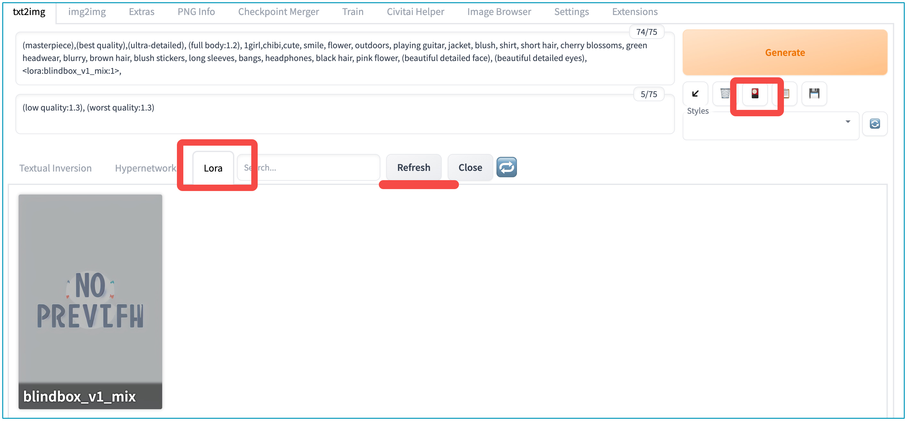

现在又到了运用 “魔法”，也就是我们 prompt 的时候了。你还记得上一讲的内容吗？LoRA 的使用与之前的技巧并不冲突，例如添加变化文本和改变文本强度。我们通过在 prompt 区域中引入 LoRA 来实现风格的二次变化。如果上一讲的还是入门程度的咒语，那 LoRA 就相当于让作品脱胎换骨的进阶法阵。

我们首先需要了解规范的 LoRA 使用咒语，标准写法是 ` <lora: 模型文件名: 权重 >` 。通常权重的范围是 0 到 1，其中 0 表示 LoRA 模型完全不起作用。WebUI 会自动加载相应的 LoRA 模型，并根据权重的大小进行应用。

现在，我们将所有学到的技巧融为一体，输入后面这样的指令。这里我们的基础模型使用 [Realistic Vision v1.3](https://civitai.com/models/4201?modelVersionId=6987)，采样器选择 Eular a，采样步数设置为 20 步。

- prompt：

```bash
(masterpiece),(best quality),(ultra-detailed), (full body:1.2), 1girl,chibi,cute, smile, flower, outdoors, playing guitar, jacket, blush, shirt, short hair, cherry blossoms, green headwear, blurry, brown hair, blush stickers, long sleeves, bangs, headphones, black hair, pink flower, (beautiful detailed face), (beautiful detailed eyes), <lora:blindbox_v1_mix:1>
```

- negative prompt：

```bash
(low quality:1.3), (worst quality:1.3)
```

这时，我们新图像也将会变成后面的样式。

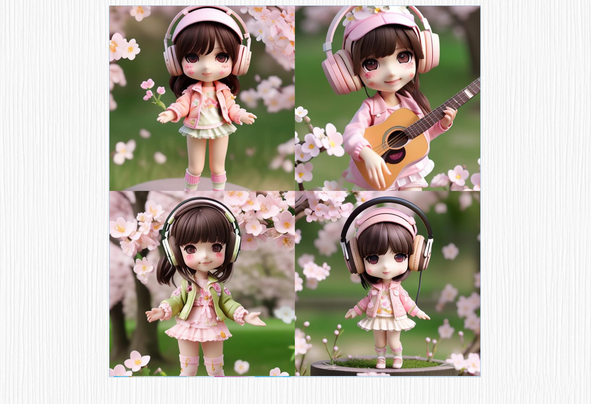

你看，可爱的、盲盒版本的、爱音乐的小女孩就创作出来了。相信你也发现了，相同的模型，在 LoRA 的加持下，生成的图像会呈现出完全不同的风格。

接下来我们继续尝试下，如果把主角改成小男孩呢？很简单，我们修改 prompt 语句，改成小男孩试试看。

- prompt：

```bash
(masterpiece),(best quality),(ultra-detailed), (full body:1.2), 1boy,chibi,cute, smile, flower, outdoors, playing guitar, jacket, blush, shirt, <lora:blindbox_v1_mix:1>
```

- negative prompt：

```bash
(low quality:1.3), (worst quality:1.3)
```

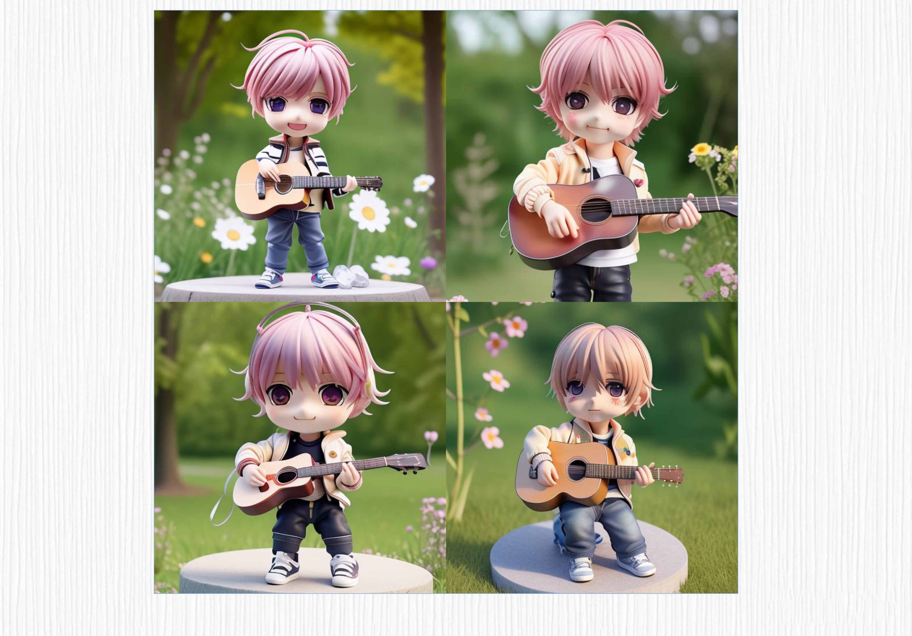

我们又成功地创作出了一个帅气的、盲盒版本的、热爱音乐的小男孩！这个角色的出现都要归功于 LoRA 发挥的作用。

现在，让我们进行一次实验，去掉 LoRA 的语句，启用后面的咒语，看看会发生什么。

- prompt：

```bash
(masterpiece),(best quality),(ultra-detailed), (full body:1.2), 1boy,chibi,cute, smile, flower, outdoors, playing guitar, jacket, blush, shirt
```

- negative prompt：

```bash
(low quality:1.3), (worst quality:1.3)
```

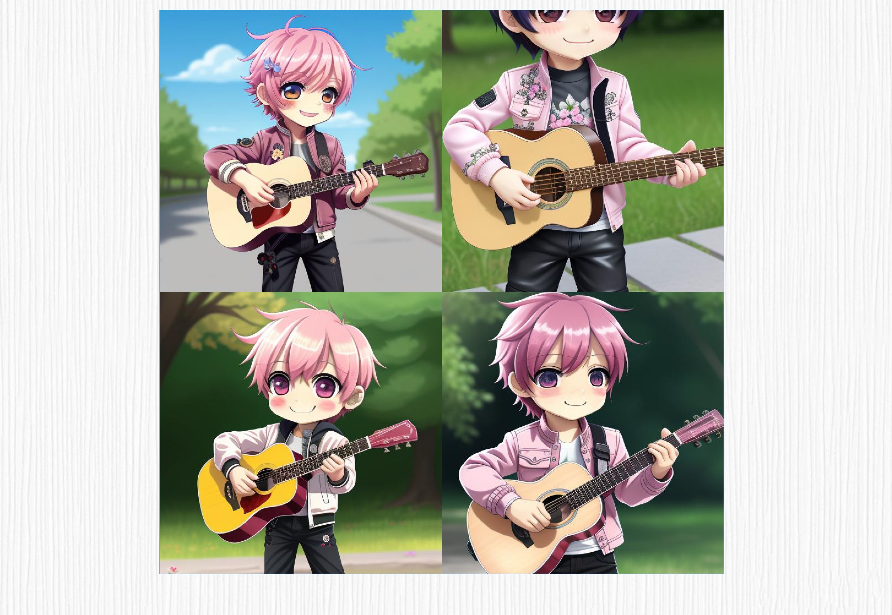

生成效果完全不一样，看来确实是 LoRA 起到了关键作用，让图像呈现盲盒风格。那么 LoRA 的 weights 又会产生什么影响呢？

试一试才知道，我们继续修改小男孩的 prompt。

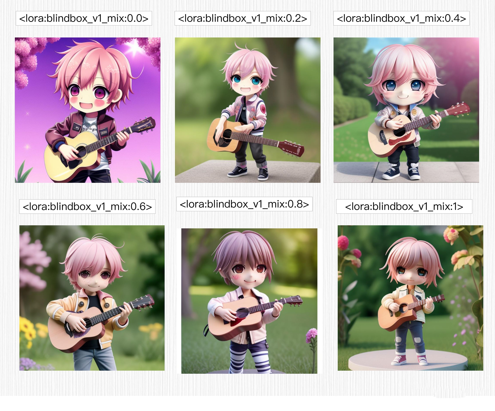

对照图片效果，我们发现 LoRA 的权重也很重要。权重越高，生成的图像就越倾向 LoRA 模型所代表的独特风格。

当我们增加 LoRA 权重时，模型会更加重视 LoRA 模型中的参数和特征，这将直接影响生成图像的风格和特征。这意味着，如果 LoRA 模型代表了某种特定的艺术风格、绘画风格或是故事情感，增加 LoRA 权重将使生成的图像更加贴合该风格。

经过前面的实战探索，我们稍微总结归纳一下。LoRA 模型是我们图像创作过程中的优秀搭档，能帮我们实现更有个性、更独特的漫画作品。也推荐你课后围绕 LoRA 做更多尝试，一定会收获更多惊喜。

---

#### 填坑

**是不是很恼火？**——指令一样，为什么自己测试生成的，天差地别？哈哈哈哈哈哈，我故意把需要的一个基础模型放在这个部分来写，会研究的也研究研究出解决方法，不会研究的我来把上面的坑填了。

就是需要进对应的 LoRA 模型中，点击图片，查看效果图片所使用的基础模型。步骤如下：

##### 1. 访问模型

- blindbox/大概是盲盒：[https://civitai.com/models/25995](https://civitai.com/models/25995)

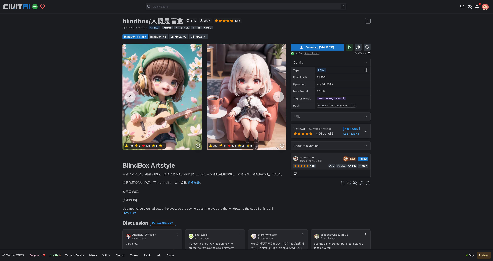

点击你想要的风格对应的图片，比如点击上图左边的图片。

- 链接如下：[https://civitai.com/images/375791?modelVersionId=32988&prioritizedUserIds=266262&period=AllTime&sort=Most+Reactions&limit=20](https://civitai.com/images/375791?modelVersionId=32988&prioritizedUserIds=266262&period=AllTime&sort=Most+Reactions&limit=20)


我们可以看见，这个风格图片所使用的基础模型为：`ReV Animated`，此时我们可以直接点击这个名称即可进入该模型的页面：

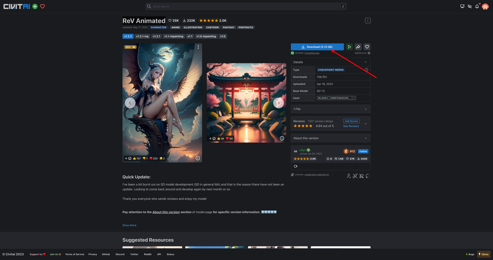

接下来就是自行下载并放到 `stable-diffusion-webui\models\Stable-diffusion`，接着刷新页面即可。

此时，使用下面的参数就能和我生成类似的图片了：

```bash
# Stable Diffusion checkpoint: revAnimated_v122.safetensors
# text2img:(masterpiece),(best quality),(ultra-detailed), (full body:1.2), 1girl,chibi,cute, smile, flower, outdoors, playing guitar, jacket, blush, shirt, short hair, cherry blossoms, green headwear, blurry, brown hair, blush stickers, long sleeves, bangs, headphones, black hair, pink flower, (beautiful detailed face), (beautiful detailed eyes), <lora:blindbox_v1_mix:1>
# negative prompt：(low quality:1.3), (worst quality:1.3)
# Sampling steps:20
# Width: 512
# Height: 512
# CFG Scale: 7
# Seed: 10
```

::: tip 具体的其他参数，自己调整挖掘咯～

:::

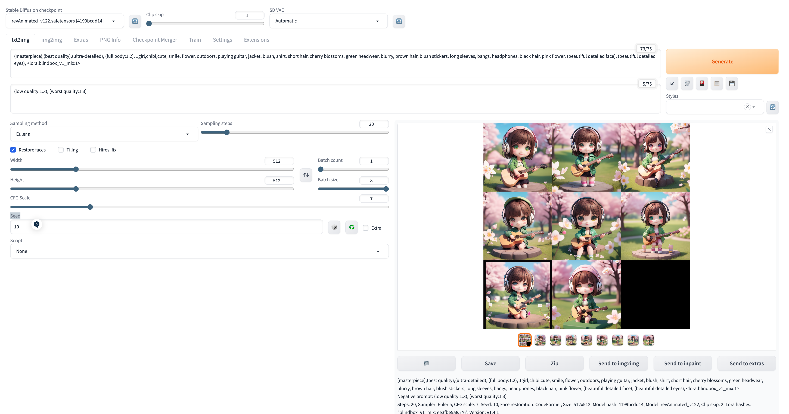


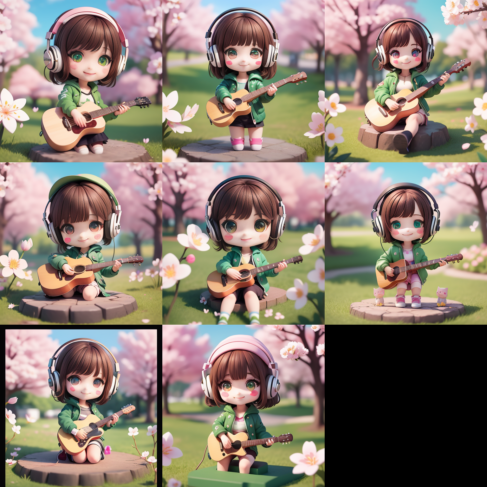


### 1.2 实物化的 LoRA

创作一个漫画故事需要的不仅仅是确定性的风格，还需要固定 ID 的角色，这样才能保持故事的连贯性和角色的一致性。

LoRA 不仅可以作为一个风格化模型，还可以实现对特定 ID 的保持，使得角色在不同的场景和情节中保持一致。这样，读者或观众可以轻易地识别和连接这个角色，并与他建立起情感上的联系，让我们的漫画故事更连贯、更容易被记住。

后面这个 LoRA 模型，就能让我们生成的人物形象接近“中谷育”这个小女孩。让我们用这个模型作为例子，继续来探索。

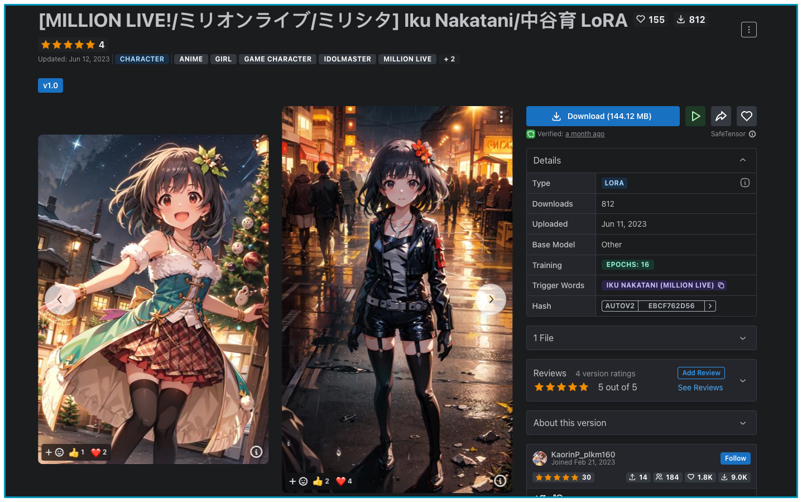

我们取原始英文单词首字母的缩写，简称这个 LoRA 为 IN。IN 是一个经过训练的 LoRA 模型。通过使用 IN 这个 LoRA，我们可以确保角色的 ID 在故事中保持不变。

我们下载好这个模型，再放入 `stable-diffusion-webui/models/Lora` 目录下，点击 Refresh 就能看见新添加的 LoRA。

让我们来实际使用一下 IN 这个 LoRA 模型，比如我们输入文本描述 “`a photo of a girl,  <lora:Iku_Nakatani-000016_v1.0:1>`” ，生成漫画故事主人公。说明一下，这里的基础模型我们使用 AnythingV5，采样器选择 DPM++ 2s a Karras，采样步数 20 步，初始分辨率设置为 448 x 640，记得开 2 倍超分。

negative prompt 可以按照下面这样设置。

```text
negative prompt：EasyNegative, (worst quality, low quality:1.4), (lip, nose, rouge, lipstick:1.4), (jpeg artifacts:1.4), (1boy, abs, muscular:1.0), greyscale, monochrome, dusty sunbeams, trembling, motion lines, motion blur, emphasis lines, text, title, logo, signature 
```

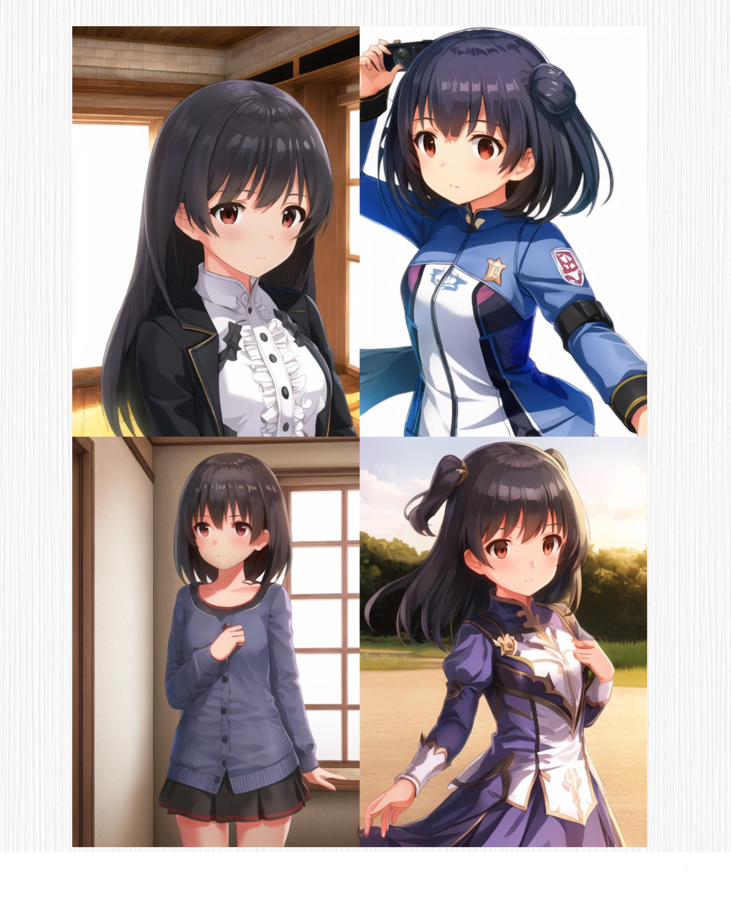

每个生成的图像都拥有相同的脸，这个小女孩将成为我们接下来漫画故事的核心角色。

在实际操作中，我们可以引入多个不同的 LoRA 模型同时使用。通过结合不同的 LoRA 模型，我们可以混合并匹配不同的风格、特点和创作元素，创造出独特而个性化的作品。这种创作方法不仅丰富了图像的表现力，还让我们能够更好地实现自己的创意和想象。

## 2. 一个漫画故事的诞生

现在我们结合前面学到的知识，使用 IN 这个 LoRA 模型来创作漫画故事，LoRA 模型你可以[点开链接](https://civitai.com/models/88201?modelVersionId=93864)获取。我们使用 Anything V5 的一个版本作为基础模型，你可以[点开链接](https://civitai.com/models/9409?modelVersionId=30163)获取它。

首先，我们确定漫画的主题和情节。我们假定要制作一个这样的故事。

```text
小女孩主人公在生日宴上许愿去海边玩。
然后，她便乘坐飞机前往海滩。
飞机起飞，载着小女孩去往目的地。
在海滩她捡到一个美丽的贝壳。
之后潜入海底欣赏了美丽的海底世界。
最后，女孩在海岸上与海鸥合照，定格这次美好的旅行。
```

这样拆解完，我们可以拆分为 6 格漫画，分别是生日宴、去机场、飞行过程、拣贝壳、潜入海底和海岸合影。如果你没太想好如何描述画面，可以用下 GPT 协助你。这里只是举个例子（我后面画的漫画又按自己想法调整了描述），目的是让你想到可以引入 AI 工具辅助自己，比如后面这个例子。

```text
请根据***故事，写出对应的漫画分镜头脚本。格式是一个镜头画面，一句对应的画面文本描述。
```

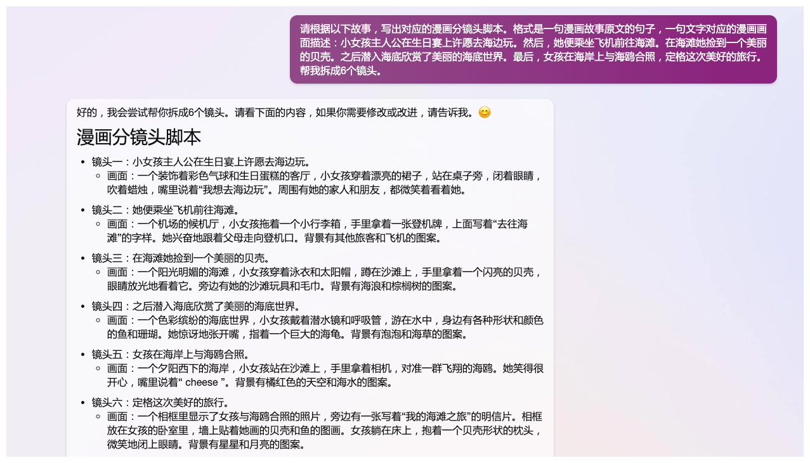

这里分享一个实用的技巧。在使用 WebUI 进行漫画制作时，**我们可以先通过文生图功能验证基础效果，确认没问题后使用超分功能进行高分辨率处理。** 使用超分模块也很简单，只需要像下面图中一样，勾选超分功能即可。

::: code-tabs

@tab prompt：

```text
At the airport,shiny skin,a lovely girl in casual attire carrying a suitcase, hair bobbles,black hair,very happy  <lora:Iku_Nakatani:1>
```

@tab negative prompt：

```text
EasyNegative, (worst quality, low quality: 1.4), (lip, nose, rouge, lipstick:1.4), (jpeg artifacts:1.4), (1boy, abs, muscular:1.0), greyscale, monochrome, dusty sunbeams, trembling, motion lines, motion blur, emphasis lines, text, title, logo, signature
```

@tab Width

```text
448
```

@tab Height

```text
640
```

@tab CFG Scale:

```text
8.5
```

@tab Seed:

```text
3093788489
```

:::

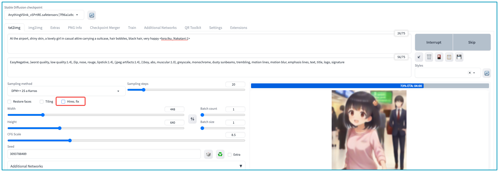

然后我们根据实际情况，对超分的参数进行设置，比如上采样倍率设置为 2，可以将分辨率提升一倍。细心的你也许注意到右侧也有一个重绘强度选项，是的，这里的用法类似于我们已经学过的图生图功能。你可以根据自己的实际需求进行设置。

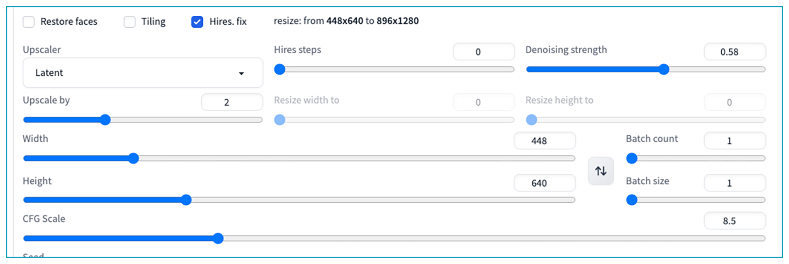

这样操作的原因是超分功能会比较耗时，以 M 系列的 Mac 为例，文生图需要 20 秒，超分需要 15 分钟。我们先验证效果再进行超分，既能提高漫画制作的效率，又能得到精致的绘画效果。

我们来依次制作这 6 格漫画。

第一格漫画：小女孩坐在椅子上，面对大蛋糕许下心愿。下面是我具体使用的描述文案和负向描述词。

- prompt：

```text
(best quality, 8K, masterpiece, ultra detailed:1.2), the girl is in front of the big cake and made a wish, sitting on the chair, shiny skin, ((lovely short skirt)), black hair, <lora:Iku_Nakatani-000016_v1.0:1>
```

- negative prompt：

```text
EasyNegative, (worst quality, low quality:1.4), (lip, nose, rouge, lipstick:1.4), (jpeg artifacts:1.4), (1boy, abs, muscular:1.0), greyscale, monochrome, dusty sunbeams, trembling, motion lines, motion blur, emphasis lines, text, title, logo, signature 
```

- 采样器：DPM++ 2s a Karras
- 采样步数：30 步
- 分辨率：448 x 640
- 超分模块：2 倍超分，最终分辨率为 896 x 1280

第二格漫画：在机场，小女孩携带着一个箱子，头上圈着色彩斑斓的皮筋。

- prompt：

```text
At the airport, shiny skin,a lovely girl in casual attire carrying a suitcase, hair bobbles, <lora:Iku_Nakatani-000016_v1.0:1>
```

第三格漫画：描绘着蓝天、洁白的蓬松云朵，以及在天空中翱翔的飞机。这幅图需要特殊说明一下，因为图中没有我们的主角小女孩，为了实现更好的效果，我使用了 Midjourney 进行绘制，并指定了和其他几格漫画一样的分辨率。

- prompt：

```text
Create a cartoon-style drawing depicting a blue sky with fluffy white clouds, and include an airplane soaring through the sky. The vibrant colors and playful nature of the illustration should evoke a sense of joy and wonder, capturing the cheerful essence of flight in a whimsical, imaginative manner
```

第四格漫画：小女孩在沙滩捡起来一个美丽的贝壳。

- prompt:

```text
((a girl picked up a beautiful shell)), beach solo, serafuku <lora:Iku_Nakatani-000016_v1.0:1>
```

第五格漫画：小女孩进行深潜，有很多鱼围绕在她身边。

- prompt:

```text
Girl diving, fish circling around,1girl, solo, shiny skin, smile, cute, happy, slight smile, collarbone, floating hair<lora:Iku_Nakatani-000016_v1.0:1>
```

第六格漫画：小女孩在海岸合影，背景包括帆船，大海，海鸥和远处的岛屿。

- prompt:

```text
(best quality, 8K, masterpiece, ultra detailed:1.2), dynamic pose, cinematic angle, cowboy shot, light particles, sparkle, beautiful detailed eyes, shiny skin, shiny hair,day, dappled sunlight, blue sky, beautiful clouds, beach, wide shot, depth of field, blurry, sailing boats, ocean, seagull, islands in distance, 1girl, solo, skirt, smile, cute, happy, open mouth, sailor collar, shirt, pleated skirt, short sleeves, :d, school uniform, serafuku, collarbone, ribbon, bow <lora:Iku_Nakatani-000016_v1.0:1>
```

稍等片刻后，我们可以得到这样的绘画效果。

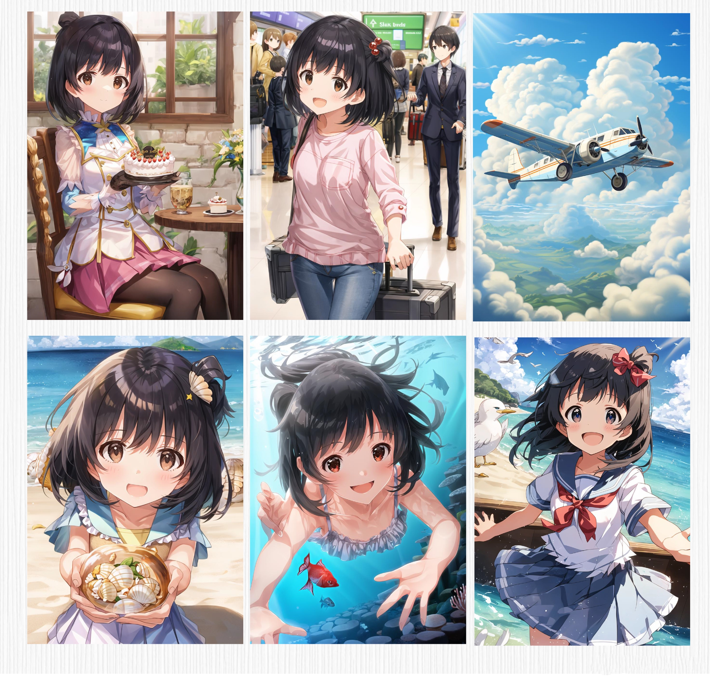


到此为止，我们使用 LoRA 创作了一个独特而有趣的漫画故事。你不妨按照这个思路，发挥你的创造力和想象力，创作属于你自己的漫画故事。

当然，你可能希望用自己的专属 IP 形象去制作漫画故事。如何训练自己的专属 LoRA 模型，我们会在之后的实战篇一起来完成，这一讲是为了先让你对 LoRA 有一个整体的认知。开源 LoRA 模型和基础模型的生成能力还有提升空间，按照开源社区的更新节奏，相信很快就会有效果更强的模型可以供我们使用。

LoRA 的本质是冻结住 Stable Diffusion 模型的参数，重新微调很少一部分的模型参数，使用这部分参数对原始的 Stable Diffusion 模型参数进行干预。研究发现，LoRA 的微调质量与全模型微调相当，所以没有 256 块 A100 显卡的我们也能训练自己的 AI 绘画模型。

## 3. 总结

这一讲，我们学习了 LoRA 的多个能力和应用。

首先，我们探讨了 LoRA 的变化万千的特性，通过调整其权重可以改变生成图像的风格和特征。接着，我们了解了 LoRA 的风格化能力，它可以为图像赋予特定的艺术风格，或者保持特定 ID 的能力。

紧接着，基于一个 Civitai 网站的 LoRA 模型，我们一起创作了一个有趣的漫画故事。关于 LoRA 的使用，我们可以关注两个要点。

**第一，选择不同功能的 LoRA 模型。** 根据创作需求，可以选择风格化的 LoRA 或人物化的 LoRA。风格化的 LoRA 可用于生成具有特定风格的图像，而人物化的 LoRA 则更适用于创建独特的人物形象。

**第二，选择合适的 LoRA 权重。** 权重越高，生成的图像越接近 LoRA 模型的效果。但在 AI 绘画中，并不是权值越高越好。权重的选择需要根据设计师的意图和具体应用场景来权衡。

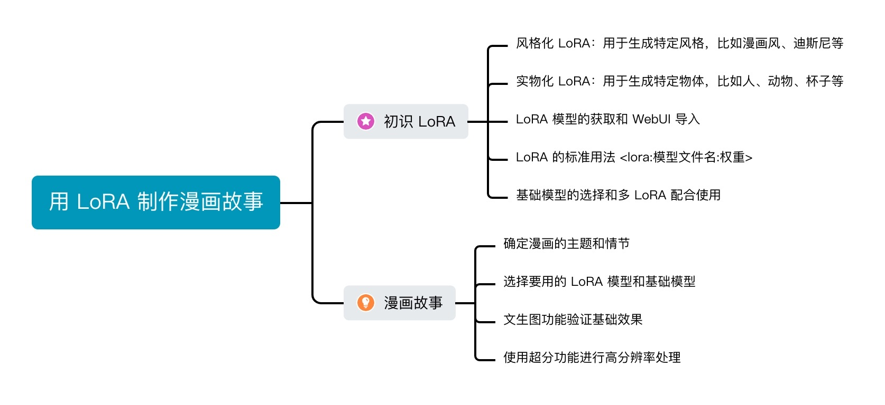

## 4. 思考题

在使用 LoRA 模型生成图像时，如何既保持特定 ID 的角色，同时引入多样化的风格？

期待你在留言区和我交流讨论，也推荐你把今天学到的内容分享给更多朋友，我们一起探索 LRA 的更多玩法！

::: details .

第一处需要使用的基础模型是 Realistic Vision V1.3：https://civitai.com/models/4201?modelVersionId=6987；

第二处需要使用的基础模型是AnythingV5:https://civitai.com/models/9409?modelVersionId=29588。

Prompt 描述是：“`a photo of a girl, <lora:Iku_Nakatani-000016_v1.0:1>`”，采样器是 DPM++ 2s a Karras，记得开 2 倍超分（其余配置可以参考漫画故事部分的设置）。

:::


欢迎关注我公众号：AI悦创，有更多更好玩的等你发现！

::: details 公众号：AI悦创【二维码】


:::

::: info AI悦创·编程一对一

AI悦创·推出辅导班啦，包括「Python 语言辅导班、C++ 辅导班、java 辅导班、算法/数据结构辅导班、少儿编程、pygame 游戏开发」，全部都是一对一教学：一对一辅导 + 一对一答疑 + 布置作业 + 项目实践等。当然，还有线下线上摄影课程、Photoshop、Premiere 一对一教学、QQ、微信在线，随时响应！微信：Jiabcdefh

C++ 信息奥赛题解，长期更新！长期招收一对一中小学信息奥赛集训，莆田、厦门地区有机会线下上门，其他地区线上。微信：Jiabcdefh

方法一：[QQ](http://wpa.qq.com/msgrd?v=3&uin=1432803776&site=qq&menu=yes)

方法二：微信：Jiabcdefh

:::


