``

``

你好，我是悦创。

今天开始，我们正式进入 AI 绘画理论阶段的学习。我会带你理解图像生成模型背后的算法原理，掌握 AI 绘画主流算法方案背后通用的算法模块，并带你从零到一训练一个扩散模型。

基于扩散模型的 AI 绘画技术是我们这门课的主题，但其实在 22 年以前，GAN 才是业界公认的 AI 绘画技术首选。在老一辈的 AI 画图中，GAN（生成对抗网络）可以说是唯一的选择。相信你也在各种社交软件上见到过各种变小孩、变老、性别变换的视觉特效，这类效果通常就是靠 GAN 完成的。

然而，随着 22 年 DALL-E 2、Stable Diffusion 的推出，扩散模型技术逐渐成为了 AI 绘画的主流技术。无论是绘画细节的精致度还是内容的多样性，扩散模型似乎都要优于 GAN。

即便如此，对于入门 AI 绘画知识体系而言，GAN 仍然是绕不开的话题，值得我们深入了解。因为搞懂了 GAN 的长处和短板，才能理解后来扩散模型解决了 GAN 的哪些痛点。而且今天我们要学的各种算法模型，也是面试中常常会问到的。

在正式探索基于扩散模型的 AI 绘画技术之前，我们用这一讲来重温旧画师 GAN，探讨 GAN 如何从兴起到高光，并简要回顾 GAN 发展史上那些里程碑式的技术。

## 1. GAN 的起源

下面我放了两张例子。第一个例子是张大千模仿石涛的画作，第二个例子是贝特莱奇 14 岁时仿照毕加索的画作。假如你是艺术鉴赏家，能否发现这些仿作的破绽呢？

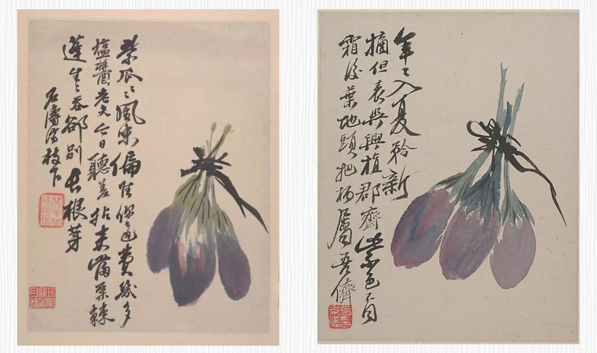

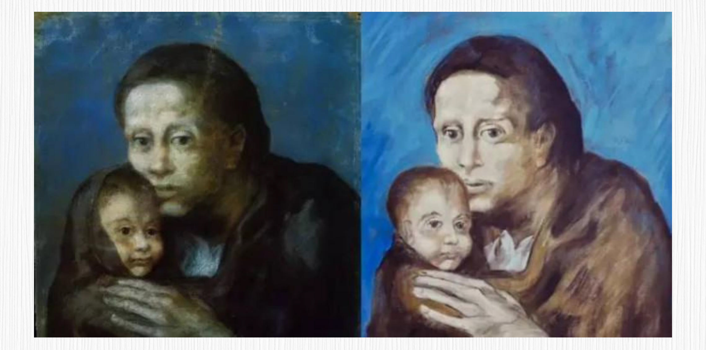

事实上，名画伪造家和艺术鉴赏家之间的较量，酷似 GAN 中生成器与判别器之间的对抗。接下来，就让我们一起揭开 GAN 背后的奥秘。

故事还要从“遥远”的 2014 年说起。那时候，Ian Goodfellow 等人提出了生成对抗网络——也就是 GAN 这个全新的概念。

当时的深度神经网络通常需要收集图像样本和目标标签，比如分类任务的标签就是类别信息、年龄回归任务的标签就是年龄数值。通常通过交叉熵损失来训练分类任务，通过数值误差损失（比如 L1 损失和 L2 损失）来训练回归任务。

而 GAN 的思路则完全不同。GAN 模型由两个模块构成，也就是常说的生成器（Generator）和判别器（Discriminator）。可以这样类比，生成器是一位名画伪造家，目标是创作出逼真的艺术品，判别器是一位艺术鉴赏家，目标是从细节中找出伪造破绽。生成器与判别器在模型训练的过程中持续更新与对抗，最终达到平衡。

你可以看下面的伪代码，加深对 GAN 这种对抗训练思想的理解。

```python
for epoch in range(num_epochs):
    for batch_data in data_loader:
        # 更新判别器
        real_images = batch_data.to(device)
        z = torch.randn(batch_size, latent_dim).to(device)
        fake_images = generator(z).detach()
        d_loss_real = discriminator(real_images)
        d_loss_fake = discriminator(fake_images)
        # 判别器损失
        d_loss = -(torch.mean(d_loss_real) - torch.mean(d_loss_fake))
        discriminator.zero_grad()
        d_loss.backward()
        discriminator_optimizer.step()
        
        # 更新生成器
        z = torch.randn(batch_size, latent_dim).to(device)
        fake_images = generator(z)
        g_loss = -torch.mean(discriminator(fake_images))
        generator.zero_grad()
        g_loss.backward()
        generator_optimizer.step()
```

在每个训练周期内，对于每个批次的数据是这样处理的。

1. 首先更新判别器，将真实图像和生成器生成的假图像输入到判别器中，计算真实图像的损失和生成图像的损失。通过反向传播更新判别器的参数，也就是利用梯度下降类的算法更新模型的权重。
2. 接着更新生成器。生成一批随机噪声输入到生成器中生成图像，再将生成的图像输入到判别器中计算损失，之后反向传播更新生成器的参数。
3. 重复以上步骤进行多个训练周期，直到达到预定的训练次数。

在上面代码中，关于判别器损失的计算你可能会有疑问，我这就为你解释一下。我们已经知道，判别器的目标是区分真实图像和生成图像，因此损失函数的设计是通过**最大化真实图像的损失（`d_loss_real`）和最小化生成图像的损失（`d_loss_fake`）** 来实现的。

`torch.mean(d_loss_real)` 计算了真实图像的平均损失，而 `torch.mean(d_loss_fake)` 计算了生成图像的平均损失。在这里，我们用减号将两个损失相减，是为了实现最大化真实图像损失和最小化生成图像损失的效果。通过这样的设计，我们希望判别器能够更好地区分真实图像和生成图像，从而提高生成器生成逼真图像的能力。

GAN 最初的故事咱们就说到这里，它的精髓在于对抗训练思想。GAN 通过生成器和判别器的竞争和学习，使得生成的图像逐渐趋近于真实图像。在现实世界中，GAN 的应用场景广泛，包括图像合成、图像修复、图像风格转换等。

## 2. 走向高光的 GAN

最初的 GAN 并没有走进大众的视野，主要是因为 GAN 模型存在一些问题，比如同时训练生成器和判别器的过程并不稳定，最初的生成器生成内容不能被指定，生成的图像分辨率较低，模型推理在手机等设备上用时过长等等。

从 14 年 GAN 被提出以来，随着上面提到的这些问题逐一得到解决，GAN 的发展经历了一系列的重要改进，终于迎来了它的高光时刻。那 GAN 是如何从平凡到卓越的呢？我们这就来看看。

### 2.1 图像生成能力的进化：DCGAN/CGAN/WGAN

最初的 GAN 模型使用全连接神经网络，对于图像生成任务来说，学习图像的空间结构和局部特征是非常困难的。

但 2015 年由 Radford 等人提出的[深度卷积 GAN（DCGAN）](https://arxiv.org/pdf/1511.06434.pdf)给 GAN 带来了进化可能。主要创新就是引入卷积神经网络（CNN）结构，通过卷积层和反卷积层替代全连接层，使得生成器和判别器能够感知和利用图像的局部关系，更好地处理图像数据，从而生成更逼真的图像。

DCGAN 的优点在于它的稳定性和生成效果。通过使用卷积神经网络，DCGAN 能够更好地保持图像的空间结构和细节信息，生成的图像质量更高。此外，DCGAN 的架构设计也为后续的 GAN 改进工作提供了重要的基础。

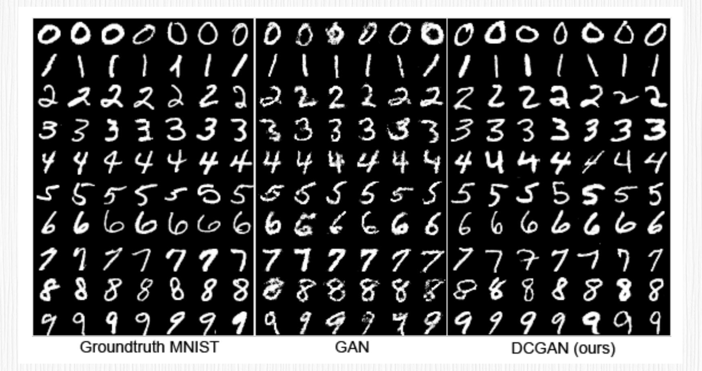

[条件 GAN](https://readpaper.com/pdf-annotate/note?pdfId=4500170052153794561&noteId=1848651293424178944)，简称 cGAN，允许我们在生成图像的过程中引入额外的条件信息。这样一来，我们可以控制生成图像的特征，比如生成特定类别的图像。比如在上面的数字图中，普通的 GAN 无法提前指定生成的数字是 0 到 9 中的哪一个，而 cGAN 便可以轻松控制要生成的数字是几。

[Wasserstein GAN](https://readpaper.com/pdf-annotate/note?pdfId=4665126035419840513&noteId=1848652981780710144)，简称 wGAN，是另一个重要的改进，它通过使用 Wasserstein 距离（瓦瑟斯坦距离，也被称为地面距离）来衡量生成图像和真实图像之间的差异，这样就能提升训练的稳定性和生成图像的质量。

Wasserstein 距离用于比较两个概率分布之间的差异，量化了将一个分布转换为另一个分布所需的最小工作量。

这么说有点抽象，我再举个形象的例子帮你理解，假设我们有两堆沙子，一堆沙子分布在一个地方，另一堆沙子分布在另一个地方。现在我们想将第一堆沙子移动到第二堆沙子的位置，但我们只能以一定的速度和固定的容器大小来移动沙子。Wasserstein 距离就是将第一堆沙子移动到第二堆沙子所需的最小总移动成本。在 wGAN 中，这两堆沙子就是真实数据分布和生成数据分布。

cGAN 和 wGAN 生成图像的分辨率很低，分辨率提升是图像生成领域一个持续研究的方向，后来的 [PGGAN](https://readpaper.com/pdf-annotate/note?pdfId=4500186031072108545&noteId=1848670213424382720)、[BigGAN](https://arxiv.org/abs/1809.11096)、[StyleGAN](https://arxiv.org/abs/1812.04948) 等工作，将生成图像的分辨率提高了 1024x1024 分辨率之上。这个我们之后再讲。

### 2.2 手机端实时特效：从 Pix2Pix 到 CycleGAN

[Pix2Pix](https://readpaper.com/pdf-annotate/note?pdfId=4500178853162541057&noteId=1848681503787931392) 系列工作延续了 cGAN 的思想，将 cGAN 的条件换成了与原图尺寸大小相同的图片，可以实现类似轮廓图转真实图片、黑白图转彩色图等效果。是不是听起来很熟悉？没错，就是 GAN 时代的 ControlNet！

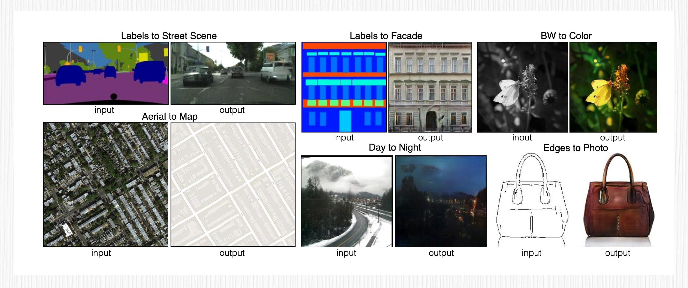

Pix2Pix 最大的缺点就是训练需要大量目标图像与输入图像的图像对，优点是模型可以做到很轻很快，甚至能在很低端的手机上也能达到实时效果。从 18 年至今，我们在短视频平台上看到的各种实时变脸特效，比如年龄转换、性别编辑等特效，都是基于这个技术。

那么问题来了，获取成对的数据是困难且耗时的，那大量成对数据该怎么来呢？答案就是大名鼎鼎的 [CycleGAN](https://junyanz.github.io/CycleGAN/)。2017 年 Jun-Yan Zhu 等人提出了 CycleGAN，也就是循环一致性生成对抗网络。

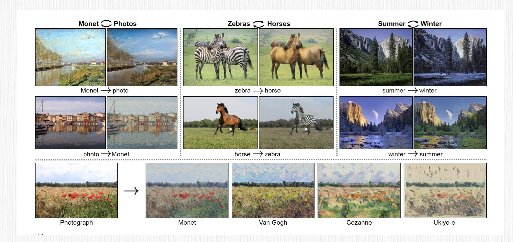

CycleGAN 的核心要点就是让两个不同领域的图像可以互相转换。它有两个生成器，分别是 G（`A→B`）和 G（`B→A`），它们的任务是把 A 领域的图像变成 B 领域的，反之亦然。同时，还有两个判别器，`D_A` 和 `D_B`，负责分辨 A 和 B 领域里的真实图像和生成的图像。

CycleGAN 的关键点在于循环一致性损失。这个方法把原图像转换到目标领域，然后再转换回原来的领域，就可以确保生成的图像跟原图像差别不大。这种循环一致性约束让图像转换有了双向的一致性。我举个例子你就明白了，先把马变成斑马，再恢复成马，最后的图像应该跟原来的马图像很相似。

CycleGAN 的优势是不需要成对的训练数据便可以实现图像转换，在很多图像转换任务上都表现得非常出色，比如风景、动物、风格等转换。再加上 Pix2Pix，CycleGAN 简直是制作短视频特效的神器。

### 2.3 高分辨率的生成：StyleGAN 系列工作

之后，英伟达在 2018 年提出的生成对抗网络模型 StyleGAN，彻底改变了 GAN 在图像合成和风格迁移方面的应用前景。与传统的 GAN 模型相比，StyleGAN 在图像生成的质量、多样性和可控性方面取得了显著的突破。

StyleGAN 的核心思想是用风格向量来控制生成图像的各种属性特点，并通过自适应实例归一化（AdaIN）把风格向量和生成器的特征图结合在一起。另外，用渐进式的生成器结构逐渐提高分辨率，这样可以提高训练的稳定性和生成图像的质量。

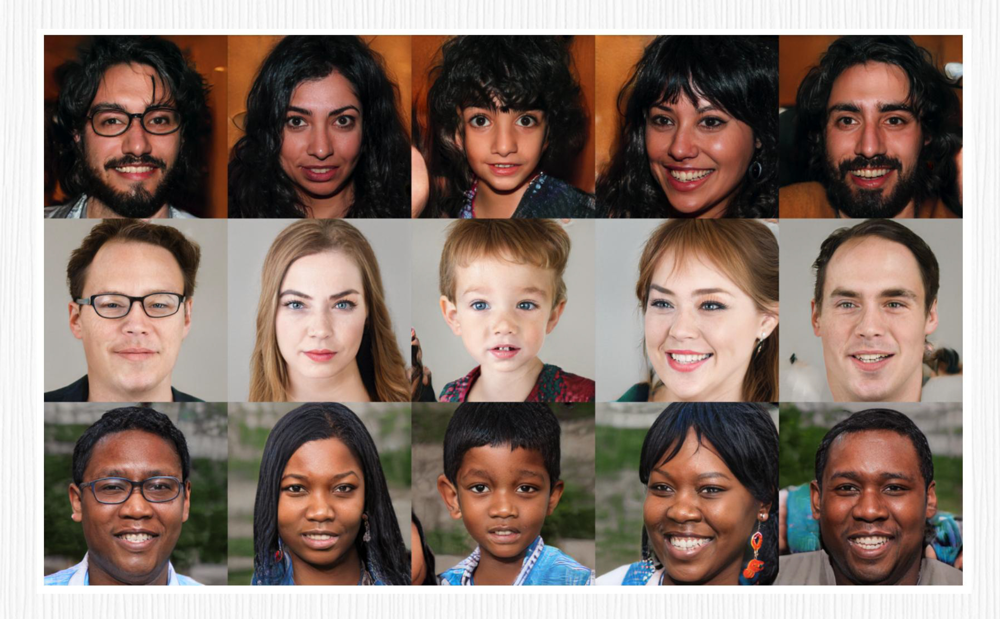

StyleGAN 的应用非常广泛。它不仅可以用于生成高分辨率的逼真图像，还可以用于风格迁移、图像编辑和人脸合成等任务。StyleGAN 生成的图像质量非常高，具有细致的纹理、自然的细节和丰富的变化，可用于各种创作、设计和研究领域。

StyleGAN 2 和 StyleGAN 3 是 StyleGAN 的改进版本。它在 StyleGAN 的基础上引入了一系列重要的改进，进一步提升了图像生成的质量、稳定性和控制性。

另外还有一种叫做超分辨率生成对抗网络（SRGAN）的模型，它的目标是将低分辨率图像转换成高分辨率的图像。

讲到这估计你也发现了，GAN 类型的生成模型非常多，我这里给你分享的是最有影响力的模型，对于其他 GAN 模型，有兴趣的话你可以了解下 BigGAN、StarGAN、Progressive GAN 等模型。

## 3. GAN 的应用场景

无论过去还是现在，在图像生成、编辑和风格化领域，GAN 都占据着非常重要的地位，而且是生成模型发展的重要里程碑。

### 3.1 图像生成

GAN 可以生成各种类型的图像，包括自然风景、人脸、动物等。通过训练生成器网络，GAN 能够从随机噪声中生成逼真的图像，为艺术创作、虚拟场景生成、游戏开发等领域提供了强大的工具。


### 3.2 图像局部编辑

GAN 可以通过生成器网络实现对图像局部的编辑。通过将输入图像和编辑向量结合，可以精确地控制生成器网络，在特定区域编辑图像，比如改变图像的颜色、纹理或形状。这为图像编辑和修复提供了一种更加灵活和高效的方式。

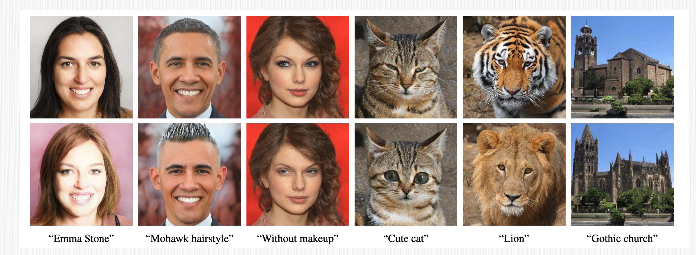

### 3.3 图像风格化

GAN 可以将图像转换为具有不同艺术风格的图像。通过训练一个生成器网络，可以将输入图像转换为特定风格的图像，如印象派、油画、水彩画等。这种图像风格化技术，广泛应用于艺术创作、图像处理和社交媒体滤镜等领域。

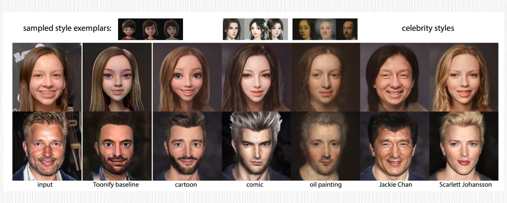

### 3.4 老照片修复

另外，GAN 可以用于修复老照片中的损坏或模糊的部分。通过训练生成器网络，GAN 可以学习恢复损坏图像的细节和纹理，并生成高质量的修复结果。这在数字文化遗产保护和历史文档修复等领域具有重要的应用意义。

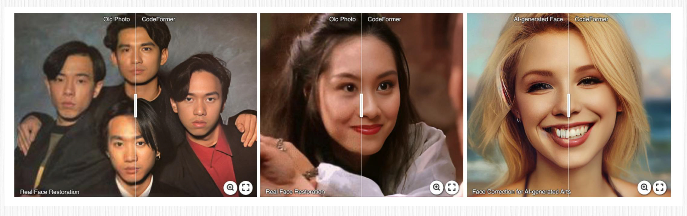

## 4. 与扩散模型狭路相逢

尽管 GAN 逐渐走向高光，高分辨率生成、可控编辑能力等问题也得到了解决，GAN 仍然存在着局限性。GAN 的局限性主要表现在训练不稳定性、生成图像模糊、难以评估和控制生成质量等问题。此外，在图像风格化、图像编辑等任务中，通常是每个任务一个 GAN。训练成本、数据需求量、使用场景局限性都是实际工作中的痛点。

而扩散模型在很大程度上解决了 GAN 的痛点。其实扩散模型并不是这两年的新鲜事，实际上，早在 2015 年就有人提出了图像扩散模型的概念。而 GAN 是 2014 年！二者几乎是前后脚同时提出的。

2021 年之前 GAN 一直在图像生成领域处于制霸地位，直到 2021 年 10 月，一篇名为“[扩散模型在图像生成领域击败了 GAN](https://arxiv.org/abs/2105.05233)” 的文章横空出世，扩散模型在图像生成领域的潜力才广为人知。

后来 OpenAI 的 Glide、DALL-E 2，Google 的 Imagen、Parti，还有广为人知的 Stable Diffusion、Midjourney，更是把基于扩散模型的 AI 绘画推向了新的高度。关于扩散模型，下一讲我们再深入探讨。

## 5. GAN 能否东山再起？

有意思的是，热衷于 GAN 的研究人员并没有放弃。就在 2023 年 3 月，Adobe 的学者提出了 GigaGAN, 一个新的 GAN 架构。一听这个名字，就有一种大模型的味道。

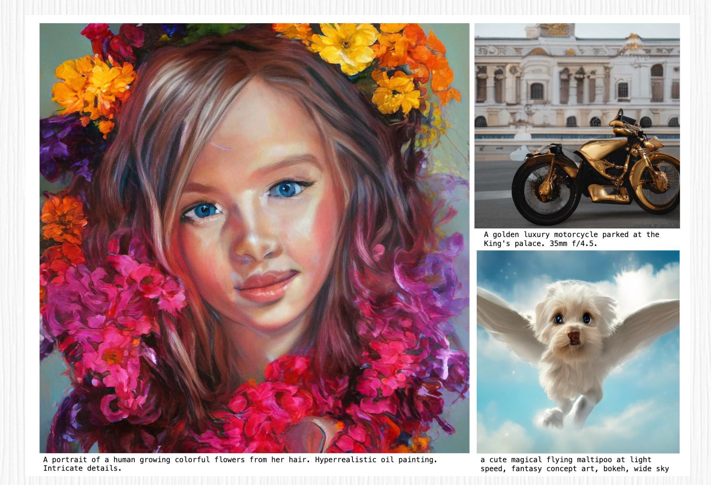

GigaGAN 是一种具有突破性的 GAN 模型，它通过扩大模型规模，在多个方面展现了卓越的优势。比如，对于 512 分辨率图像的合成，仅需要 0.13 秒的推理速度，这比现有的工作在推理速度上高出了一个数量级。并且 GigaGAN 可以合成更高分辨率的图像，生成 1600 万像素的图像仅需 3.66 秒。

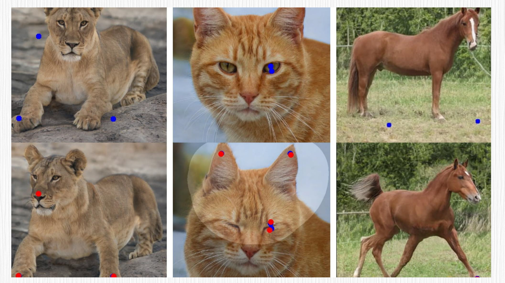

我们再来看看 GAN 领域的另一位明星——DragGAN。实际上，DragGAN 是一种交互式图像操作方法，为各种 GAN 开发提供了一种神奇的功能，我们用鼠标简单拉伸图像，就能够生成全新的图像。

使用 DragGAN 非常简单，用户只需要设置一个起始点、一个目标点，以及希望修改的区域。接下来，模型会进行运动监督和点跟踪这两个步骤的迭代，然后修改原始图像。这种交互式的操作方式让图像的编辑变得非常直观和有趣。

## 6. 课程小结

这一讲，我们认识了生成对抗网络（GAN），了解了 GAN 的基本算法原理，还学习了经典的 GAN 算法和它的应用场景，比如图像生成、局部编辑、图像风格化、老照片修复等。

之后我们也探讨了 GAN 的局限性，这对我们后续学习和理解扩散模型也很有帮助。即便在扩散模型风靡的今天，GAN 的改进版例如 GigaGAN 和 DragGAN 仍展示出令人惊叹的创新和功能。在 AI 绘画这个快速发展的领域中，我们也期待 GAN 技术能够取得更大的突破和进步，为我们带来更加出色的图像生成和编辑能力。

我把今天的重点内容梳理成了知识导图，供你参考复习。

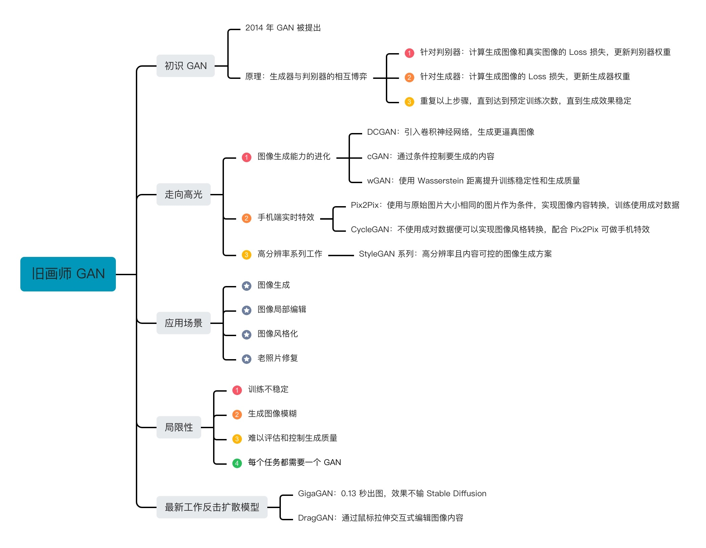

## 7. 思考题

在基于扩散模型的 AI 绘画时代到来之前，你还见过哪些有意思的 GAN 的应用？背后的技术原理是怎样的？

欢迎你在留言区和我交流互动，如果这一讲对你有启发，别忘了分享给身边更多朋友。

## 8. 补充

::: info Question 1

请教老师几个问题：

Q1：GAN有具体产品吗？ 扩散模型有具体产品，比如 SD，GAN 有具体产品吗？ 

Q2：GAN 的生成器加随机噪声，请问有非随机噪声吗？ 

Q3：模型的训练一般用什么语言？ 

Q4：GAN 或 webUI 能制作技术文档上的图吗？比如写一个技术文档，上面有数据链应用图等，可以制作这一类的技术图片吗？

:::

作者回复: 你好：

针对 Q1，2019 年风靡一时的「ZAO」、各种 DeepFake 换脸软件都是 GAN 的具体产品；抖音、快手各种实时的人像特效（年龄、性别、表情编辑）基本也都是 GAN；SD 的具体产品当前有很多，比如 Midjourney、最近大火的妙鸭相机、Lensa 相机、Wink 相机等等，以及去年年底以来各种 AIGC 短视频特效。

针对 Q2，在 GAN 和扩散模型中提到的噪声，可以理解为高斯噪声（都是随机噪声），这样才能保证最终生成内容的多样性。

针对 Q3，模型训练一般使用 Python，训练框架可以是 Pytorch、TensorFlow 等（对于矩阵运算进行各种加速处理）；

针对 Q4，GAN 和 WebUI 不适合制作确定性的流程图、时间轴、链路图等，当前主要用于创意图片的生成。希望能帮助到你。


欢迎关注我公众号：AI悦创，有更多更好玩的等你发现！

::: details 公众号：AI悦创【二维码】


:::

::: info AI悦创·编程一对一

AI悦创·推出辅导班啦，包括「Python 语言辅导班、C++ 辅导班、java 辅导班、算法/数据结构辅导班、少儿编程、pygame 游戏开发」，全部都是一对一教学：一对一辅导 + 一对一答疑 + 布置作业 + 项目实践等。当然，还有线下线上摄影课程、Photoshop、Premiere 一对一教学、QQ、微信在线，随时响应！微信：Jiabcdefh

C++ 信息奥赛题解，长期更新！长期招收一对一中小学信息奥赛集训，莆田、厦门地区有机会线下上门，其他地区线上。微信：Jiabcdefh

方法一：[QQ](http://wpa.qq.com/msgrd?v=3&uin=1432803776&site=qq&menu=yes)

方法二：微信：Jiabcdefh

:::


