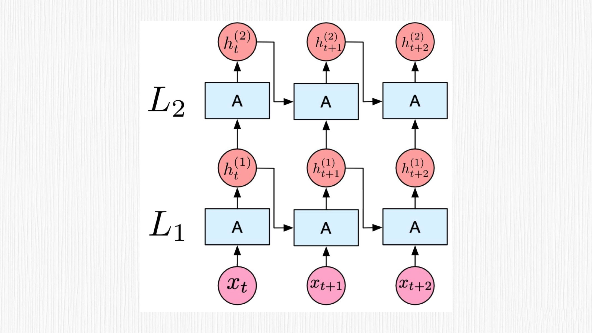

``

你好，我是悦创。

前两讲中，我们已经学习了扩散模型的加噪去噪过程，了解了 UNet 模型用于预测噪声的算法原理。事实上，Stable Diffusion 模型在原始的 UNet 模型中加入了 Transformer 结构（至于怎么引入的，我们等[下一讲](10.md)学完 UNet 结构便会清楚），这么做可谓一举两得，因为 Transformer 结构不但能提升噪声去除效果，还是实现 prompt 控制图像内容的关键技术。

重要的是，Transformer 结构也是 GPT 系列工作的核心模块之一。也就是说，我们只有真正理解了 Transformer，才算是进入了当下 AIGC 世界的大门。这一讲，我就为你揭秘 Tranformer 的算法原理。

## 1. 初识 Transformer

在深度学习中，有很多需要处理时序数据的任务，比如语音识别、文本理解、机器翻译、音乐生成等。不过，经典的卷积神经网络，也就是 CNN 结构，主要擅长处理空间相关的任务，比如图像分类、目标检测等。

因此，[RNN](https://ieeexplore.ieee.org/document/6795228)（循环神经网络）、[LSTM](https://papers.baulab.info/Hochreiter-1997.pdf)（长短时记忆网络）以及 [Transformers](https://arxiv.org/abs/1706.03762) 这些解决时序任务的方案便应运而生。

## 2. RNN 和 LSTM 解决序列问题

RNN 专为处理序列数据而设计，可以灵活地处理不同长度的数据。RNN 的主要特点是在处理序列数据时，对前面的信息会产生某种“记忆”，通过这种记忆效果，RNN 可以捕捉序列中的时间依赖关系。这种“记忆”在 RNN 中被称为隐藏状态（hidden state）。

然而，传统的 RNN 存在一个关键的问题，即“长时依赖问题”——当序列很长时，RNN 在处理过程中会出现梯度消失（梯度趋近于 0）或梯度爆炸（梯度趋近于无穷大）现象。这种情况下，RNN 可能无法有效地捕捉长距离的时间依赖信息。

为了解决这个问题， LSTM 这种特殊的 RNN 结构就派上用场了。LSTM 通过加入遗忘门、记忆门和输出门来处理长时依赖问题。这些门有助于 LSTM 更有效地保留和更新序列中的长距离信息。

欢迎关注我公众号：AI悦创，有更多更好玩的等你发现！

::: details 公众号：AI悦创【二维码】

:::

::: info AI悦创·编程一对一

AI悦创·推出辅导班啦，包括「Python 语言辅导班、C++ 辅导班、java 辅导班、算法/数据结构辅导班、少儿编程、pygame 游戏开发」，全部都是一对一教学：一对一辅导 + 一对一答疑 + 布置作业 + 项目实践等。当然，还有线下线上摄影课程、Photoshop、Premiere 一对一教学、QQ、微信在线，随时响应！微信：Jiabcdefh

C++ 信息奥赛题解，长期更新！长期招收一对一中小学信息奥赛集训，莆田、厦门地区有机会线下上门，其他地区线上。微信：Jiabcdefh

方法一：[QQ](http://wpa.qq.com/msgrd?v=3&uin=1432803776&site=qq&menu=yes)

方法二：微信：Jiabcdefh

:::

