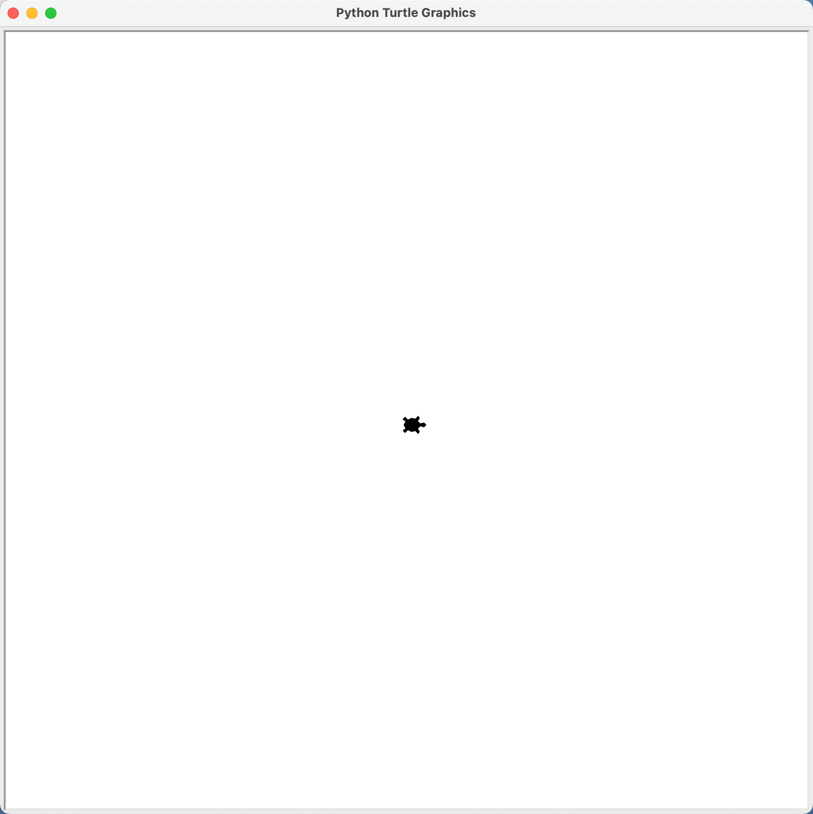
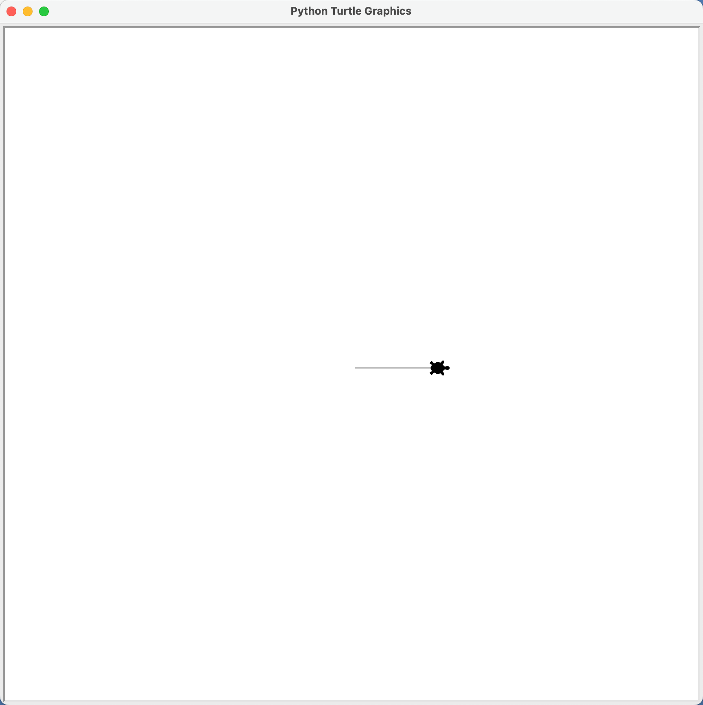
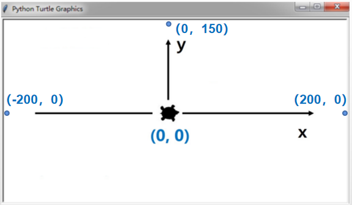

## 1. 功能介绍

这个项目我们利用海龟绘图（turtle 库），在弹窗中显示海龟图案，实现当点击关闭窗口时才关闭，否则一直显示。之后实现海龟向前移动 100 像素，让海龟动起来，并将实现效果展示出来。课程会分为两个任务的形式进行学习，下表为课程任务及涉及到的知识点。

| 实现功能           | 知识点   |
| ------------------ | -------- |
| 任务一：画出海龟   | 库和注释 |
| 任务二：海龟动起来 | 函数     |

## 2. 项目实践

### 2.1 任务一：画出海龟

#### 2.1.1 任务分析

我们怎么能画出海龟呢，其实很简单，Python 已经内置了 turtle 库，所以我们先要导入库，之后只需要调用一下他的 `turtle.shape("turtle")`函数使其显示海龟的造型，最后调用 `turtle.exitonclick()` 函数实现点击退出的功能。

```python
import turtle  # 导入库

turtle.shape("turtle")  # 外形显示乌龟
turtle.exitonclick()  # 点击退出
```



#### 2.1.2 代码释义

##### 1. 第一行代码中的 import 的使用

```python
import turtle  # 导入库
```

1. 代码解释

此段代码为导入海龟绘图库文件，导入之后就可以使用海龟绘图库文件的相关代码了。

2. 什么是库文件

它有很多种叫法，比如库，包，项目等，意思就是别人写好的项目代码，你下载放到规定的目录后就可以正常使用别人的项目代码，比如我们程序中用到的 turtle 库，这就是 Python 内置库，如果不是内置的就要另外安装了。

导入库就像你打王者荣耀或者其它游戏，你选了一个英雄或人物(库)，你就会拥有该英雄或人物的相应技能，你就可以利用这些技能进行相应的游戏项目了。

- 内置库：直接通过”`impot + 库文件名称`“即可导入。

- 外置库：需要先通过 pip 模式进行安装，之后再通过”`impot + 库文件名称`“即可导入。当然如果当你没有安装相应的库文件，直接导入，我们的终端也会报错提醒的。

3. 导入库的方法

如果想项目中加载其它的库文件，就用“`import`” 空格后面加相应的库文件名即可。例如代码中导入 turtle 的库，`import turtle`。

##### 2. 第一行代码中 `#` 符号的使用

```python
# 导入库
```

1. 代码解释

“`# 导入库`”这是代码中的说明文字，可以叫做**注释**。在程序运行过程中，“`#`” 符号所在行之后的文字将不被编译器编译。

2. 什么是注释

注释在代码中是非常有用的，它可以帮助你理解代码，如果项目比较复杂，自然而然，代码也会随之非常的长，此时注释就会发挥很大作用，可以快速帮你回忆起这段代码的功能。同样，当把你的代码分享给别人的时候，别人也会很快理解你的代码。

3. 注释的使用方法

当需要对代码进行解释说明时，方便自己或者他人理解时，可以在对于代码段后面加 `#`，`#` 后面加上需要解释的文字进行说明即可。

##### 3. 第二行代码中 turtle 库 shape() 函数的使用

```python
turtle.shape("turtle")  # 外形显示乌龟
```

1. 代码解释

此段带代码为调用海龟绘图（turtle）的“ `shape()` ”函数，设置图案的显示方式，这段代码可以让图案显示为“海龟”。

2. `shape()` 函数的使用方法

代码中需要调用库文件中的函数的方式都是“`库文件名称.函数名()`”，`shape()` 函数的默认形状还有“`arrow`”、“`turtle`”、“`circle`”、“`square`”、“`triangle`”，即“`箭头`”、“`海龟`”、“`圆圈`”、“`四方形`”、“`三角形`”，一般默认为 “`classic` ”也就是箭头形状。

##### 4. 第二行代码中 turtle 库 exitonclick() 函数的使用

```python
turtle.exitonclick()  # 点击退出
```

1. 代码解释

此段带代码为调用海龟绘图（turtle）的“`exitonclick()`”函数，能让海龟在弹窗中显示，并当点击退出时才退出显示窗口。

### 2.2 任务二：让海龟动起来

#### 2.2.1 任务分析

在任务一弹窗显示海龟的基础上，增加让海龟动起来的代码，这里我们让海龟向前移动 100 的像素。

#### 2.2.2 编写程序

```python
import turtle  # 导入库

turtle.shape("turtle")  # 外形显示乌龟
turtle.forward(100)  # 向前移动距离 100 像素
turtle.exitonclick()  # 点击退出
```



#### 2.2.3 代码释义

##### 1. 代码中 turtle 库 forward() 函数的使用

```python
turtle.forward(100)  # 向前移动距离 100 像素
```

##### 2. 代码解释

此段带代码为调用海龟绘图（turtle）的“`forward()`”函数，让海龟向前移动 100 像素的距离，数值越大移动的距离越远。

**注意：**

我们的画布默认是有一定的尺寸的，所以当设置数值过大时，会看到海龟会“`飞向远方`”，飞出画布之外，会导致看不到海龟了，所以在设置数值时需要注意。当然画布的大小尺寸都是可以自己设计的。例如一个 `400*300` 的画布如下图所示，这里需要注意的是每次海龟的出发点都是坐标为 `(0, 0)` 的原点出发的。




欢迎关注我公众号：AI悦创，有更多更好玩的等你发现！

::: details 公众号：AI悦创【二维码】


:::

::: info AI悦创·编程一对一

AI悦创·推出辅导班啦，包括「Python 语言辅导班、C++ 辅导班、java 辅导班、算法/数据结构辅导班、少儿编程、pygame 游戏开发、Linux、Web全栈」，全部都是一对一教学：一对一辅导 + 一对一答疑 + 布置作业 + 项目实践等。当然，还有线下线上摄影课程、Photoshop、Premiere 一对一教学、QQ、微信在线，随时响应！微信：Jiabcdefh

C++ 信息奥赛题解，长期更新！长期招收一对一中小学信息奥赛集训，莆田、厦门地区有机会线下上门，其他地区线上。微信：Jiabcdefh

方法一：[QQ](http://wpa.qq.com/msgrd?v=3&uin=1432803776&site=qq&menu=yes)

方法二：微信：Jiabcdefh

:::


