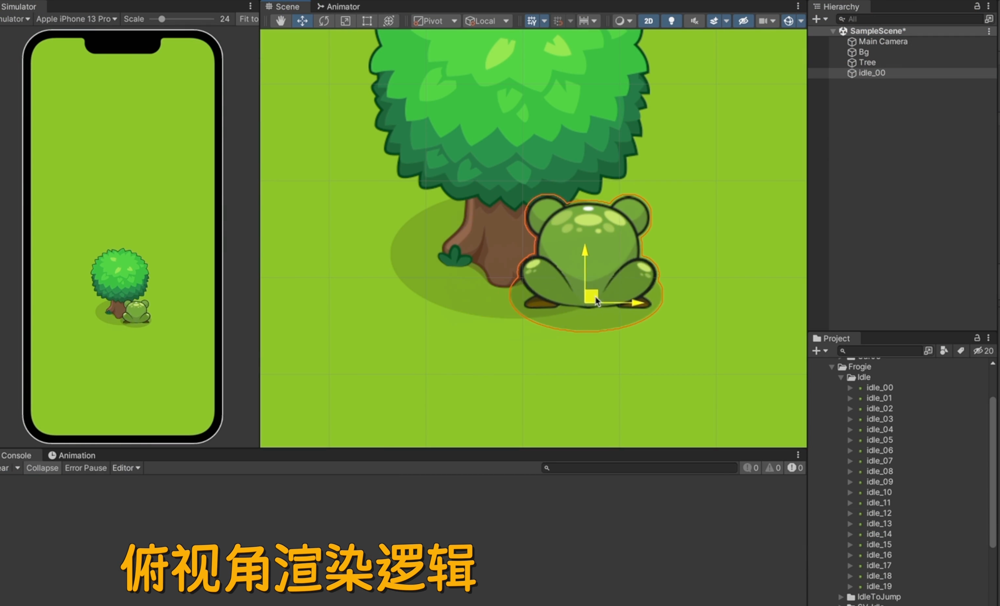
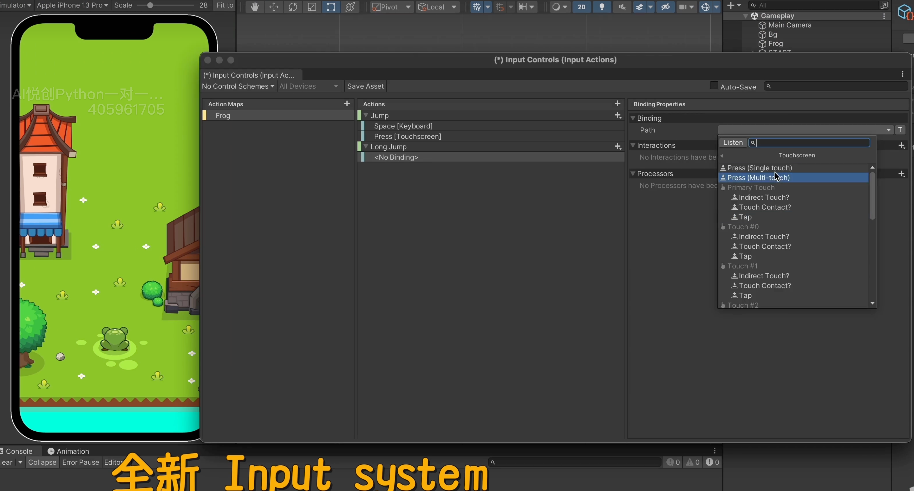
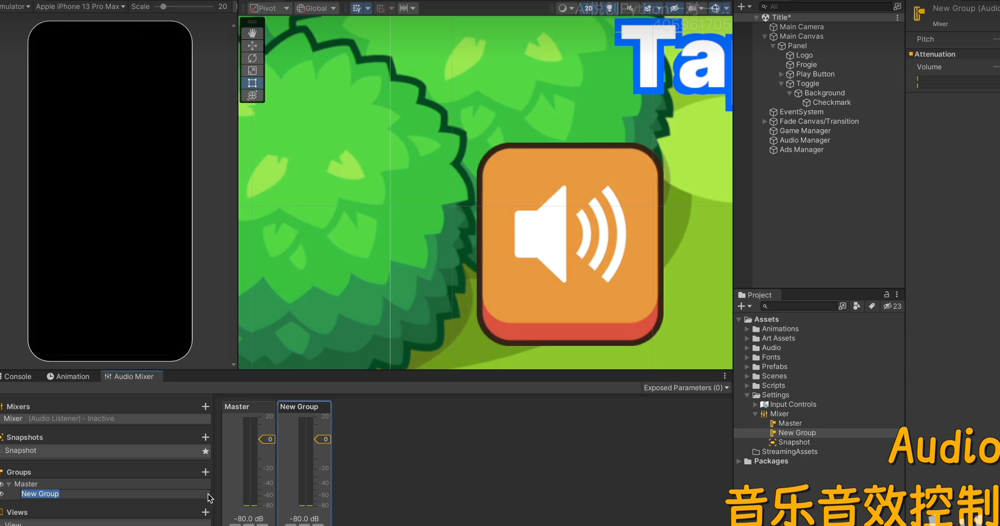
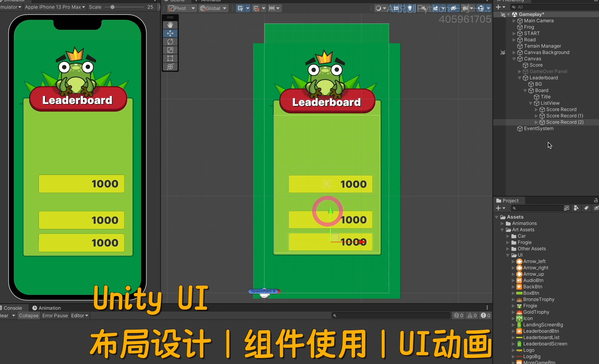
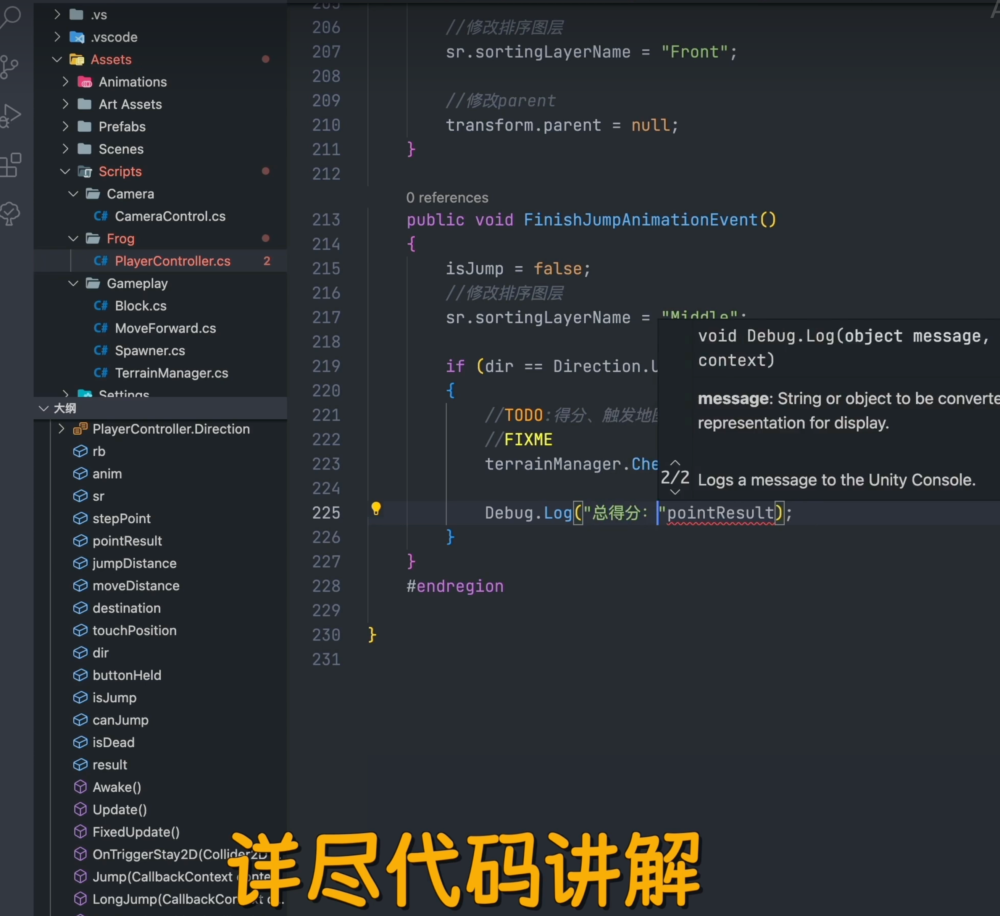
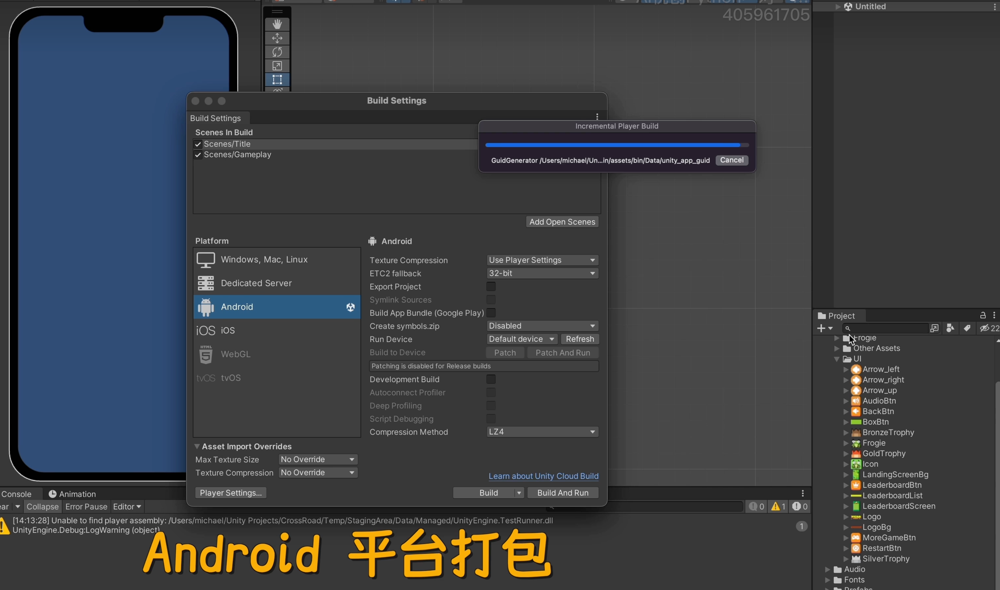
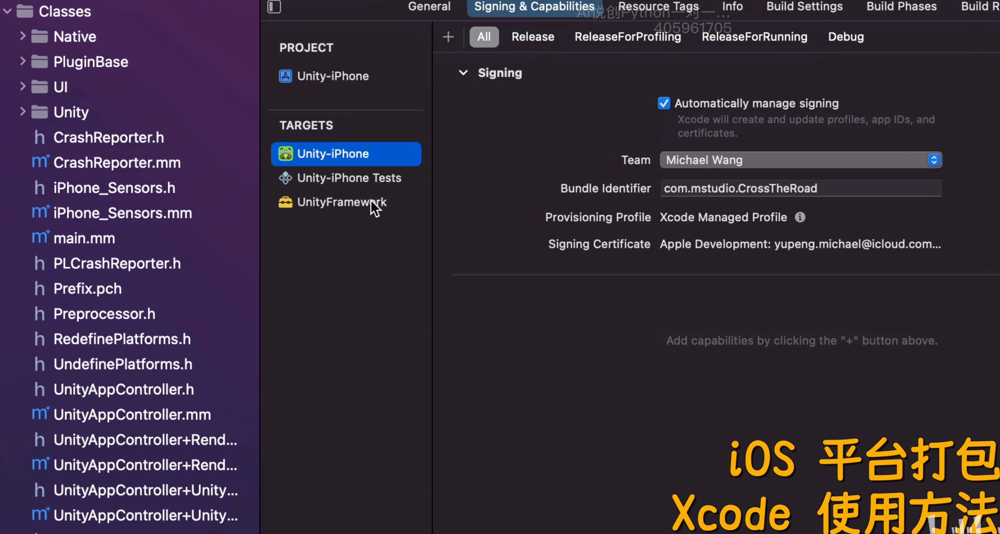
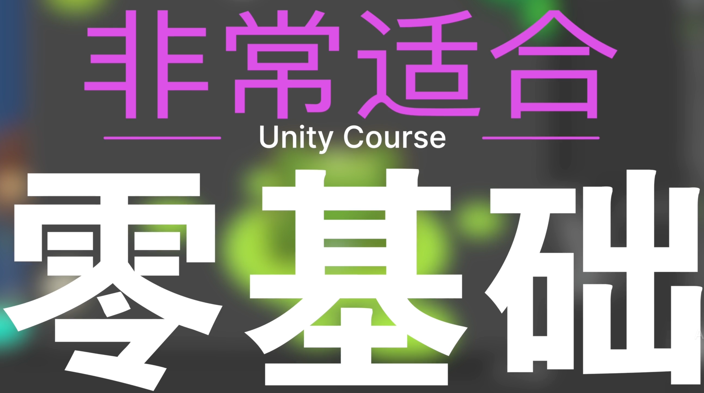

## 完整手机游戏制作「iOS & Android」

你好，我是悦创。

我这次为你准备了，适合快速入门学习的教程内容。

我会带你制作一款休闲的手机游戏，就是那种玩起来停不下来的那种。

## 学会使用 Unity C#

我们会通过这个项目学习 Unity 编辑器，以及 C# 编程语言。本教程使用最新的 Unity 2022.1 版本。

## Unity Ads 广告系统接入

帮组你快速上手新功能，同时这个项目也会教大家。如何接入 Unity 的广告系统。

实现免费休闲游戏获得广告收益。

## 教程涵盖常用 2D 游戏开发知识

教程会教会大家构建一个游戏的基本知识。

### 俯视角渲染逻辑

例如俯视角渲染：

### 全新 Input system

全新的输入系统。

### 动画控制器 Animator & Animation

### 音乐与音效 Audio

### Unity UI 布局设计｜组件使用｜UI 动画

### 详尽代码讲解

我会带你写每一行代码。

### Android 平台打包

### iOS 平台打包 Xcode 使用方法

欢迎关注我公众号：AI悦创，有更多更好玩的等你发现！

::: details 公众号：AI悦创【二维码】

:::

::: info AI悦创·编程一对一

AI悦创·推出辅导班啦，包括「Python 语言辅导班、C++ 辅导班、java 辅导班、算法/数据结构辅导班、少儿编程、pygame 游戏开发、Linux、Web全栈」，全部都是一对一教学：一对一辅导 + 一对一答疑 + 布置作业 + 项目实践等。当然，还有线下线上摄影课程、Photoshop、Premiere 一对一教学、QQ、微信在线，随时响应！微信：Jiabcdefh

C++ 信息奥赛题解，长期更新！长期招收一对一中小学信息奥赛集训，莆田、厦门地区有机会线下上门，其他地区线上。微信：Jiabcdefh

方法一：[QQ](http://wpa.qq.com/msgrd?v=3&uin=1432803776&site=qq&menu=yes)

方法二：微信：Jiabcdefh

:::

