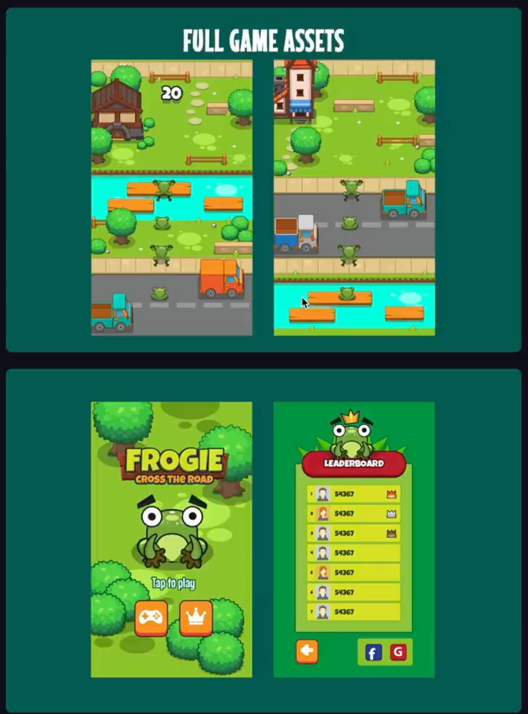
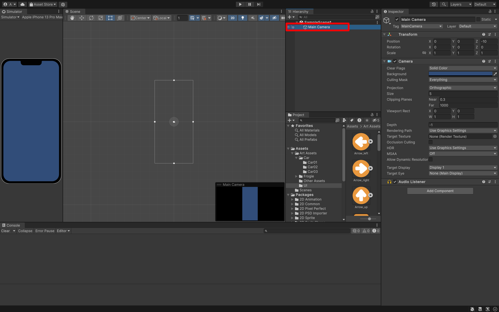
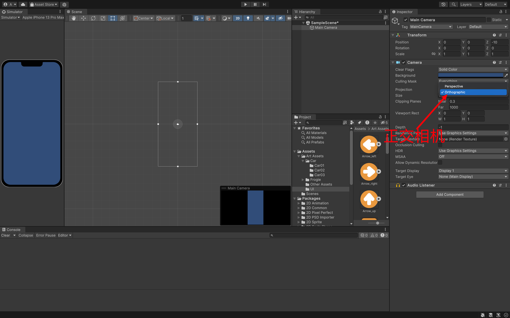
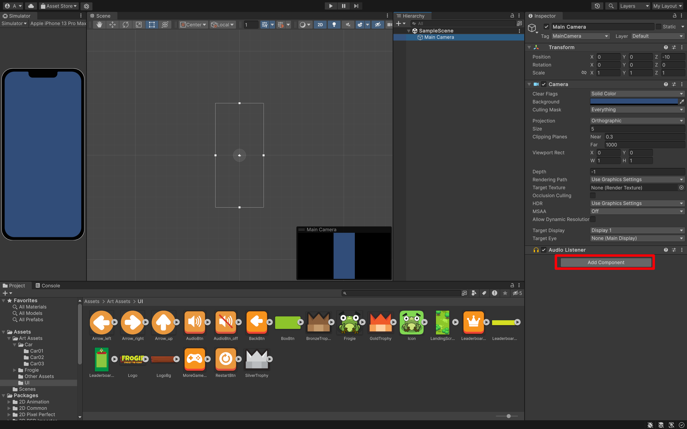
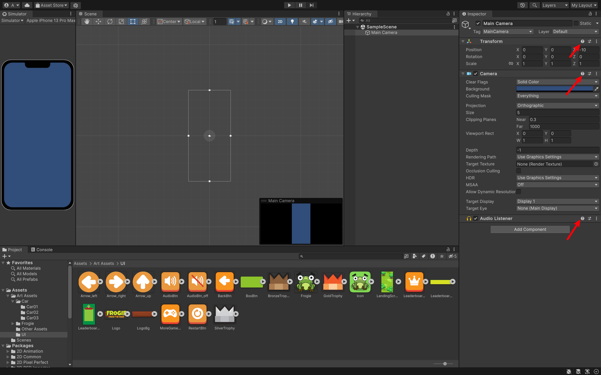
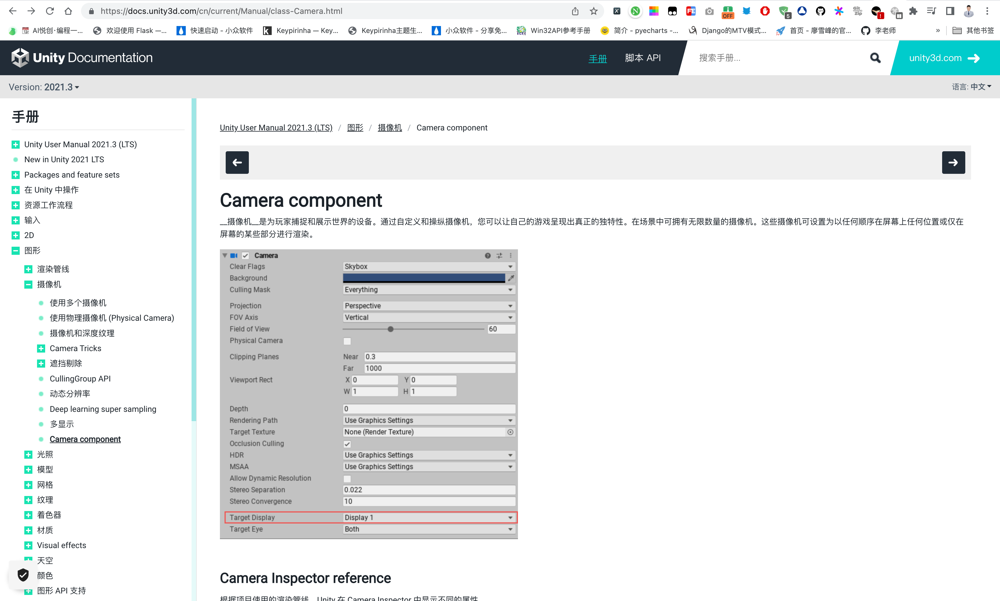
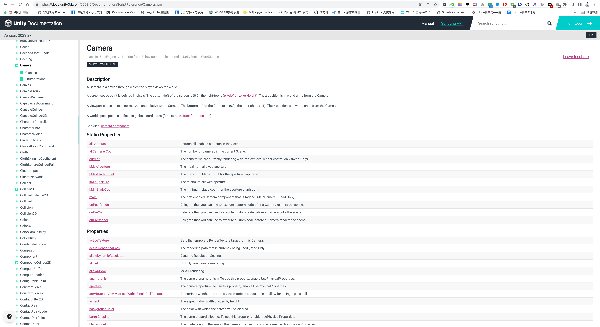
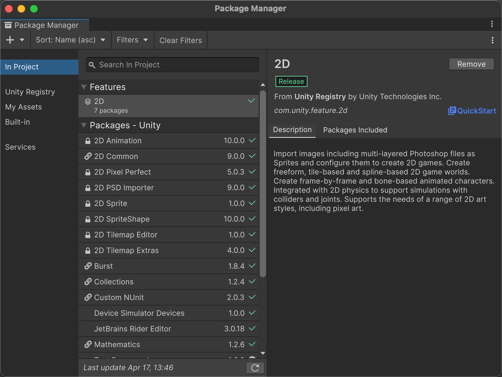

## 需求

- 运行平台
    - 移动端「制作项目的时候，留意在手机端上显示的效果」
    - 点击屏幕操作（见 玩法）
    - 自适应不同屏幕尺寸（调整 Camera 正交 size）「既然考虑到手机了，那就要考虑不同不同设备」
- 游戏场景
    - 主要三个部分：公路、草地、小河

::: info !!!

可以考虑整个游戏纵向无限循环或随机出现以上三个部分做成 Prefab 循环随机加载拼接地图。

- 公路：左侧纵向双排随机时间间隔生成移动车辆🚗
- 草地：随机障碍物位置
- 小河：坐车纵向双排生成 3 种木板

:::

- 游戏性
    - 青蛙可以三方向移动（左、右、上）
    - 相机跟随纵向移动，或地图纵向向下移动（♾️️）
    - 点击跳跃
        - 可以固定距离，或长按跳跃更远
    - 碰到汽车、掉入河里、撞到草地上的栅栏和墙，则游戏结束
    - 倒计时时间记录跳跃多远，或者无时间限制，记录跳了多远
- 额外功能
    - 记录得分或距离生成本地排行榜
        - 死亡后查看
        - 尤其主页界面 Button 查看
    - 死亡播放广告继续当前游戏

## 代码手册

另一个就是透视相机。透视就是会有这种视觉差的效果。例如横版游戏上，恶魔城之类的游戏。造成前景后景不同的移动。在我们的项目中，直接使用正交相机。

每一个都称为我们的组件。

点击问好就可以跳转到对应的文档。

也可以查找我们的所需要的 API。

可以去掉我们未使用的包。

欢迎关注我公众号：AI悦创，有更多更好玩的等你发现！

::: details 公众号：AI悦创【二维码】

:::

::: info AI悦创·编程一对一

AI悦创·推出辅导班啦，包括「Python 语言辅导班、C++ 辅导班、java 辅导班、算法/数据结构辅导班、少儿编程、pygame 游戏开发、Linux、Web全栈」，全部都是一对一教学：一对一辅导 + 一对一答疑 + 布置作业 + 项目实践等。当然，还有线下线上摄影课程、Photoshop、Premiere 一对一教学、QQ、微信在线，随时响应！微信：Jiabcdefh

C++ 信息奥赛题解，长期更新！长期招收一对一中小学信息奥赛集训，莆田、厦门地区有机会线下上门，其他地区线上。微信：Jiabcdefh

方法一：[QQ](http://wpa.qq.com/msgrd?v=3&uin=1432803776&site=qq&menu=yes)

方法二：微信：Jiabcdefh

:::

