## 1. 刚体

你好，我是悦创。

我现在要让小青蛙移动起来，而我们现在的小青蛙只是一张图片。我们需要把小青蛙变成真实的物体。

如何变成真实的物体呢？——就是为他添加一个钢体的组件。

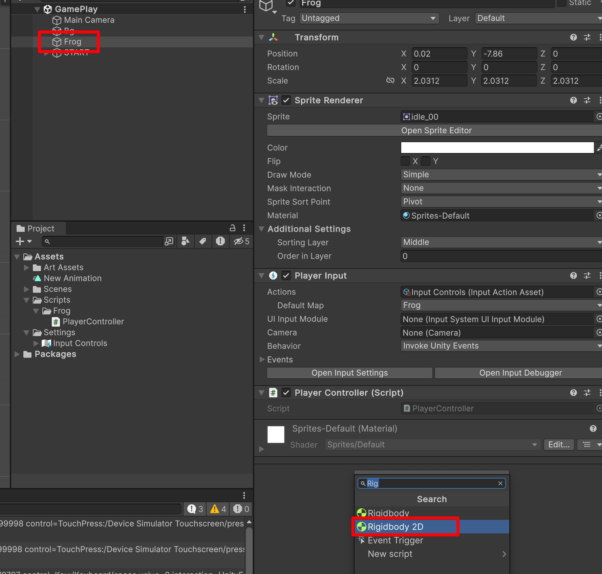

2D 的钢体可以模拟物理的效果。——一旦一个物体有了钢体，就模拟真实世界中的一个真实的物体。

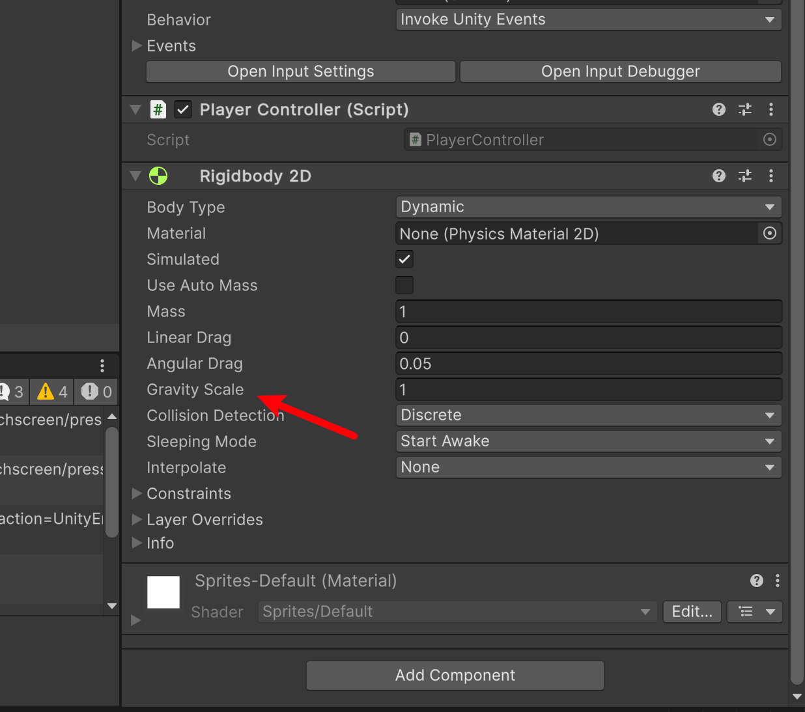

也就是，角色有了重力。

**此时，我们运行游戏，你会发现小青蛙会自己向下滑走。**

我们如果不希望它掉落，我们可以将他改成 0。这样就不会自己往下滑走了。

::: tabs

@tab 1

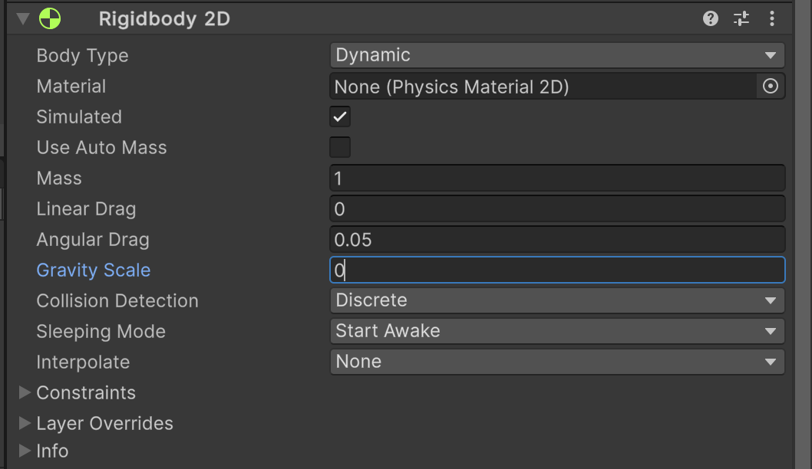

@tab 2

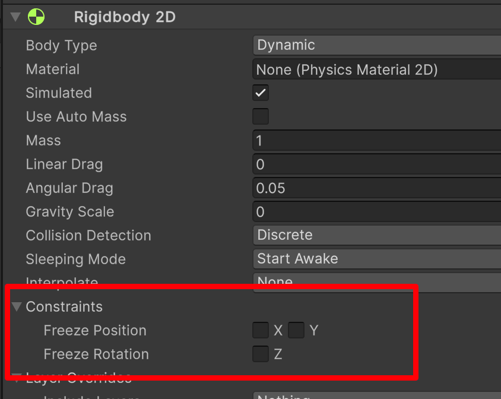

:::

上面这个就是锁定坐标，锁定 X 轴就不能左右移动，锁定 Y 就不能上下移动，锁定 Z 那就不能旋转「也就是不会因为，我们碰撞了什么而导致旋转」。

那不能旋转，是我们需要的。我们勾选 Z。

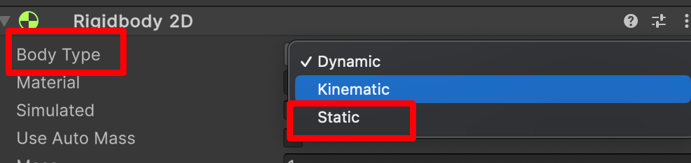

**如果你选择 static ，那就变成静态物体了。也就没有模拟物理效果了。**「点击问号查询文档」

**Body Type** 有三个选项；每个选项定义一种常见和固定的行为。附加到 2D 刚体的 2D 碰撞体将继承 2D 刚体的 **Body Type**。这三个选项是：

- **Dynamic**
- **Kinematic**
- **Static**

所选的选项将定义：

- 移动（位置和旋转）行为
- 碰撞体相互作用

请注意，尽管经常将 2D 刚体表述为相互碰撞，但实际上发生碰撞的是每个刚体所连接的 2D 碰撞体。如果没有碰撞体，2D 刚体不能相互碰撞。

改变 2D 刚体的 Body Type 可能是一个复杂的过程。Body Type 发生变化时，各种与质量相关的内部属性都将立即重新计算，并且在游戏对象的下一个 [FixedUpdate](https://docs.unity3d.com/cn/current/ScriptReference/MonoBehaviour.FixedUpdate.html) 期间需要重新估算连接到 2D 刚体的 2D 碰撞体的所有现有触点。根据触点数量以及连接到刚体的 2D 碰撞体数量，更改 Body Type 可能会导致性能变化。「FixedUpdate() 类似，代码中的 Update，具体要看你电脑情况，没每台电脑帧数是不一样的。」有的电脑只能执行30次，有的电脑只能执行40次。如果，我把同样的 update 放在设置里面的话，很有可能在不同的设备上，得到不同的结果。

- 所以，通常输入的计算、布尔值的计算我们会放在 update 中；
- 使用刚体去模拟物理的判断，我们放在 FixedUpdate 当中。

那么 Update 一般会判断什么呢？——一些值的判断。「例如：布尔值、键盘输入的判断，反正电脑配置不一样，我们需要通过当前电脑输入的去判断。

使用刚体，模拟物理的判断，我们放在 FixedUpdate 当中。

- [https://docs.unity3d.com/cn/current/Manual/class-Rigidbody2D.html](https://docs.unity3d.com/cn/current/Manual/class-Rigidbody2D.html)

| **属性：**              | **功能：**                                                   |                                                              |
| :---------------------- | :----------------------------------------------------------- | ------------------------------------------------------------ |
| **Body Type**           | 设置 2D 刚体的组件设置，从而可操纵移动（位置和旋转）行为和 2D 碰撞体交互。 选项为：Dynamic**、**Kinematic、Static |                                                              |
| **Material**            | 使用此属性可为连接到特定父 2D 刚体的所有 2D 碰撞体指定公共材质。 **注意：**2D 碰撞体使用自己的 Material 属性（如果已设置）。如果此处或在 2D 碰撞体中未指定材质，则默认选项为 **None (Physics Material 2D)**。这种情况下使用可在 [Physics 2D](https://docs.unity3d.com/cn/current/Manual/class-Physics2DManager.html) 窗口中设置的默认材质。 2D 碰撞体使用以下优先级顺序来确定要使用的 **Material** 设置： 1. 在 2D 碰撞体上指定的 2D 物理材质。 2.在附加的 2D 刚体上指定的 2D 物理材质。 在 [Physics 2D](https://docs.unity3d.com/cn/current/Manual/class-Physics2DManager.html) 窗口中指定的 2D 物理材质默认材质。 **提示：**使用此设置确保附加到同一 **Static** Body Type 2D 刚体的所有 2D 碰撞体都可使用同一材质。 |                                                              |
| **Simulated**           | 如果希望 2D 刚体以及所有附加的 2D 碰撞体和 2D 关节在运行时与物理模拟系统交互，请启用 **Simulated__（选中复选框）。如果禁用此功能（取消选中复选框），这些组件不会与模拟系统进行交互。请参阅下面的 [2D 刚体属性：Simulated](https://docs.unity3d.com/cn/current/Manual/class-Rigidbody2D.html#SimulatedProperty) 以了解更多详细信息。默认情况下会选中此框。 \| \|** Use Auto Mass__ | 如果希望 2D 刚体从其 2D 碰撞体中自动检测游戏对象的质量，请选中此框。 |
| **Mass**                | 定义 2D 刚体的质量。如果已选中 Use Auto Mass，此属性将显示灰色。 |                                                              |
| **Linear Drag**         | 一种会影响位置移动的阻力系数。                               |                                                              |
| **Angular Drag**        | 一种会影响旋转移动的阻力系数。                               |                                                              |
| **Gravity Scale**       | 定义游戏对象受重力影响的程度。                               |                                                              |
| **Collision Detection** | 定义如何检测 2D 碰撞体之间的碰撞。                           |                                                              |
| Discrete                | 将 **Collision Detection** 设置为 **Discrete** 时，具有 2D 刚体和 2D 碰撞体的游戏对象在物理更新期间可以重叠或穿过彼此（如果移动得足够快/会出现穿模的情况）。仅会在新位置生成碰撞触点。 |                                                              |
| Continuous              | **Collision Detection** 设置为 **Continuous** 时，具有 2D 刚体和 2D 碰撞体的游戏对象在更新期间不会穿过彼此。相反，Unity 会计算 2D 碰撞体的第一个影响点，并将游戏对象移动到该点。请注意，此设置比 **Discrete** 耗费更多 CPU 时间。 |                                                              |
| **Sleeping Mode**       | 定义游戏对象如何在处于静止状态时“睡眠”以节省处理器时间。「总不能一直后台运行耗费资源吧」 |                                                              |
| Never Sleep             | 禁用睡眠（应尽可能避免此设置，否则会影响系统资源）。         |                                                              |
| Start Awake             | 游戏对象最初处于唤醒状态。                                   |                                                              |
| Start Asleep            | 游戏对象最初处于睡眠状态，但可以被碰撞唤醒。                 |                                                              |
| **Interpolate**         | 定义如何在物理更新间隔之间插入游戏对象的移动（运动趋于颠簸状态时很有用）。 |                                                              |
| None                    | 不应用移动平滑。                                             |                                                              |
| Interpolate             | 根据游戏对象在先前帧中的位置来平滑移动。                     |                                                              |
| Extrapolate             | 根据游戏对象在下一帧中的估计位置来平滑移动。                 |                                                              |
| **Constraints**         | 定义对 2D 刚体运动的任何限制。                               |                                                              |
| **Freeze Position**     | 选择性停止 2D 刚体沿世界 X 和 Y 轴的移动。                   |                                                              |
| **Freeze Rotation**     | 选择性停止 2D 刚体围绕 Z 轴的旋转。                          |                                                              |

请勿使用变换「Transform」组件来设置 **Dynamic** 类型的 2D 刚体的位置或旋转。模拟系统会根据 **Dynamic** 2D 刚体的速度对该刚体重新定位；可以通过脚本施加于刚体的力来直接更改此值，也可以通过碰撞和重力来间接更改此值。

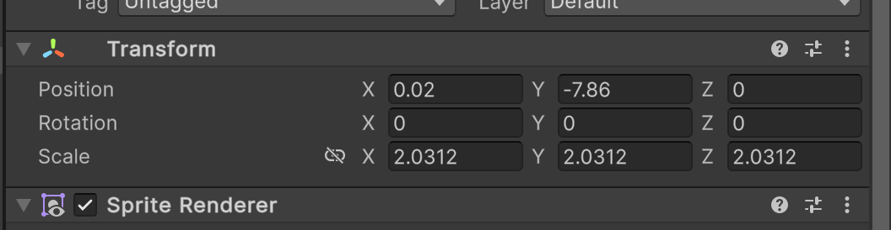

按上面的讲解，我们来设置对应的功能。

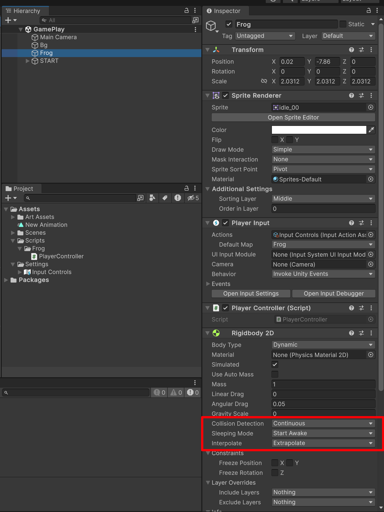

## 2. 设置碰撞💥体

1. Frog
2. Physics 2D

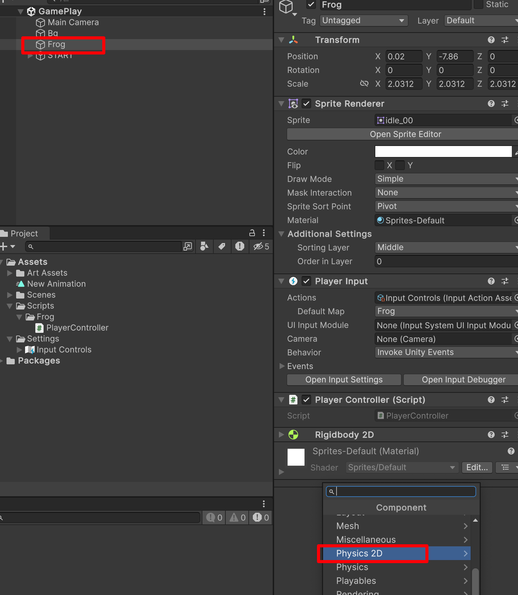

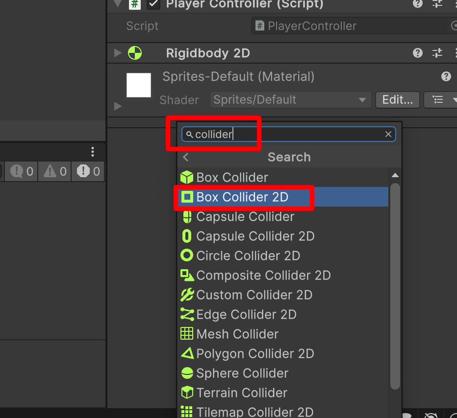

这样我们的组件就添加进来了，接下来我们的角色外面会有一个绿色的框。

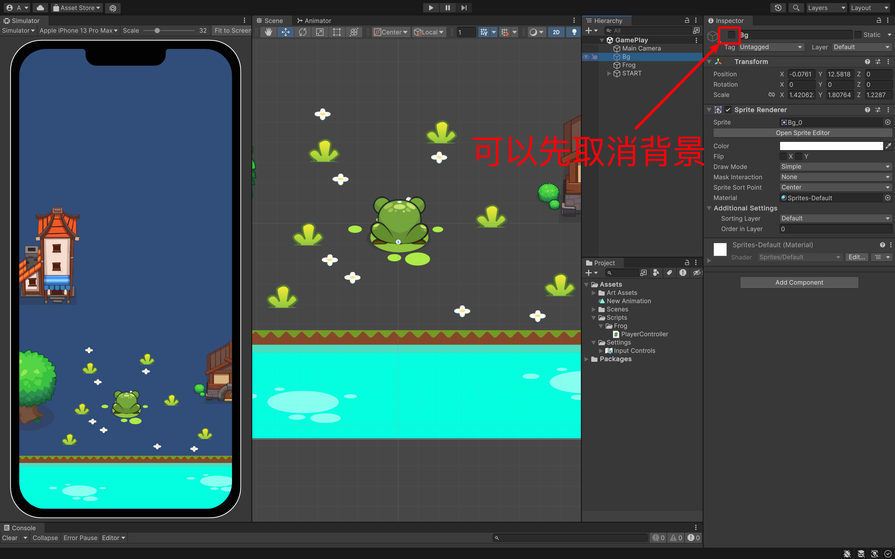

选中我们的青蛙🐸Frog，你就可以看见绿色的外框了。

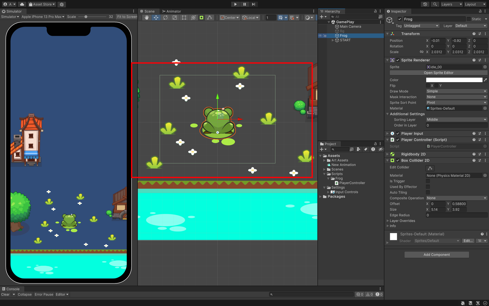

这是 collider 组件，预判了你图片的大小，来设置的。不过，这不是我们想要的。我们可以想想，我们有可能只需要脚底有碰撞检测就可以了，那我们来设置一下。

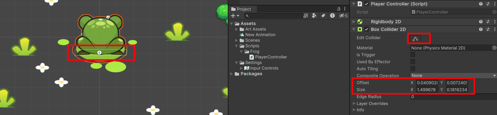

都可以进行设置。

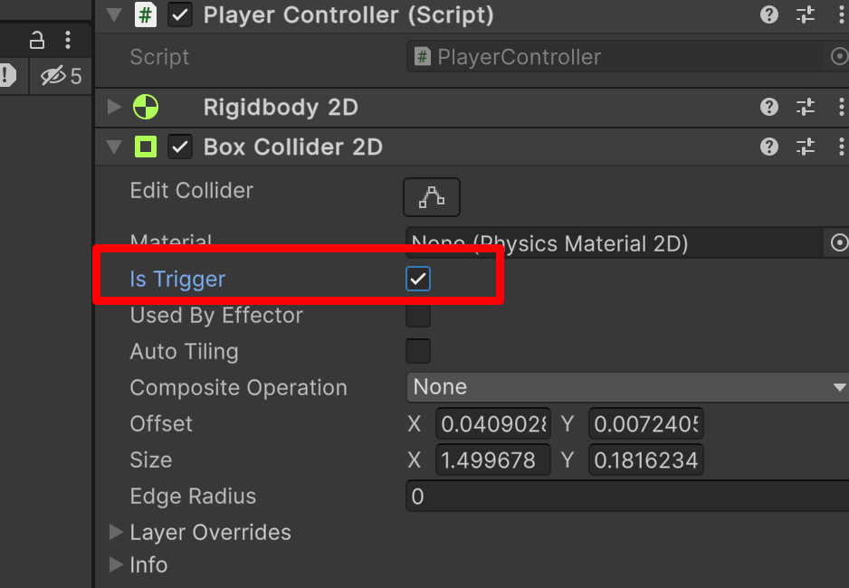

**原本 is Trigger 原本是没有勾选的，我们可以勾选它。为什么呢？**

——现在那个框是碰撞体，但是我们希望角色只和我们的另一个碰撞体「角色」碰撞有反应。而不是和我们地面碰撞也有反应。所以，我们可以设置 is Trigger ，也就是两个碰撞体的重合和接触。所以，我们可以利用不同的参数实现不同的效果。

## 3. 编写代码

```cs {19-21,23-25}
using System.Collections;
using System.Collections.Generic;
using UnityEngine;
using UnityEngine.InputSystem;

public class PlayerController : MonoBehaviour
{
    public void Jump(InputAction.CallbackContext context)
    {
        // TODO: 执行跳跃，跳跃的距离，记录分数，播放跳跃的音效
        // 创建一个默认的函数写法
        // public 公开的，其它类都可以调用
        // void 没有返回类型
        if (context.phase == InputActionPhase.Performed) 
        {  // 这样只有在功能完全的执行，我们才有里面的内容
            Debug.Log("Jump! Hello..." + context);
        }
    }

    public void LongJump(InputAction.CallbackContext context) {

    }

    public void GetTouchPosition(InputAction.CallbackContext context) {
        
    }
}
```

 设置 Event：

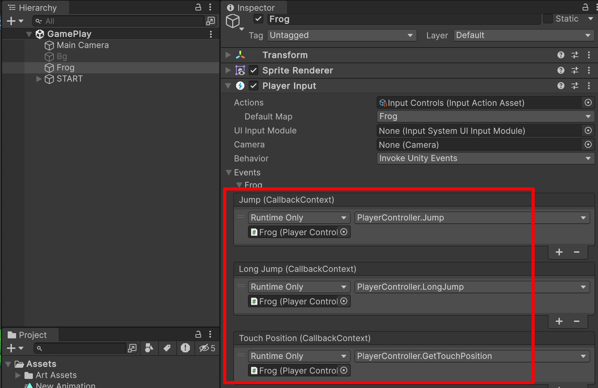

那我们现在要移动我们的小青蛙，我们需要哪些参数：我们要跳跃，我们要知道基本的跳跃距离。那长跳，是基本跳跃的二倍。

```cs {3}
public class PlayerController : MonoBehaviour
{
    public float jumpDistance; 
}
```

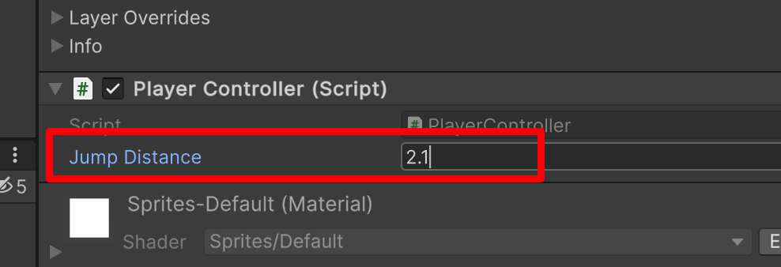

经过我的测试，我们小跳 2.1 是比较合适的，其他你们自行测试。

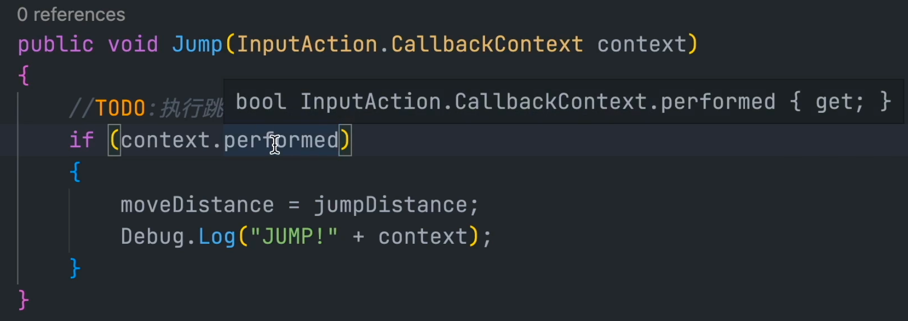

```cs {18-21,25-28}
using System.Collections;
using System.Collections.Generic;
using UnityEngine;
using UnityEngine.InputSystem;

public class PlayerController : MonoBehaviour
{
    public float jumpDistance; 
    private float moveDistance;  // 真实跳跃距离

    public void Jump(InputAction.CallbackContext context)
    {
        // TODO: 执行跳跃，跳跃的距离，记录分数，播放跳跃的音效
        // 创建一个默认的函数写法
        // public 公开的，其它类都可以调用
        // void 没有返回类型
        // if (context.phase == InputActionPhase.Performed) {  // 这样只有在功能完全的执行，我们才有里面的内容
        if (context.Performed) {  // 这样只有在功能完全的执行，我们才有里面的内容
            moveDistance = jumpDistance; // 小跳执行的话，那就是 jumpDistance
            Debug.Log("Jump!" + context);
        }
    }

    public void LongJump(InputAction.CallbackContext context) {
        if (context.Performed) {
            moveDistance = jumpDistance * 2;
            Debug.Log("Long Jump!" + context);
        }

    }

    public void GetTouchPosition(InputAction.CallbackContext context) {

    }
}
```

点击 Play 运行看看效果。

- 按下键盘空格，Jump 执行；
- 长按空格 Long Jump 执行了；

不过在测试的时候，你有可能会发现：我按下键盘，达到一定时间，可是我的键盘还没松开，Long Jump 已经执行了。我希望我的小青蛙，在松开的时候可以移动，那怎么记录按键松开的状态呢？「或者说是松开的阶段」

```cs {20-22,29,33-38}
using System.Collections;
using System.Collections.Generic;
using UnityEngine;
using UnityEngine.InputSystem;

public class PlayerController : MonoBehaviour
{
    public float jumpDistance;
    private float moveDistance;  // 真实跳跃距离
    public void Jump(InputAction.CallbackContext context)
    {
        // 创建一个默认的函数写法
        // public 公开的，其它类都可以调用
        // void 没有返回类型
        // if (context.phase == InputActionPhase.Performed)
        // 下面是简写
        if (context.performed)
        {  // 这样只有在功能完全的输出，我们才有里面的内容
            // Debug.Log("Jump! Hello..." + context);
            // 也改成具体跳跃的距离，方便后期调试
            moveDistance = jumpDistance;
            Debug.Log("JUMP!" + " " + moveDistance);
        }
    }

    public void LongJump(InputAction.CallbackContext context) {
        if (context.performed) 
        {
            moveDistance = jumpDistance * 2; // 小跳执行的话，那就是 jumpDistance
            // Debug.Log("LONG JUMP!" + " " + moveDistance);
        }

        // canceled 取消了
        if (context.canceled) 
        {
            // 松掉空格「按键」
            // TODO: 执行跳跃,而我们说了，要在松掉键盘，执行。那么把上面的 30 行代码，移动下来：
            Debug.Log("LONG JUMP!" + " " + moveDistance);

        }
    }

    public void GetTouchPosition(InputAction.CallbackContext context) {
        
    }
}
```

测试运行：

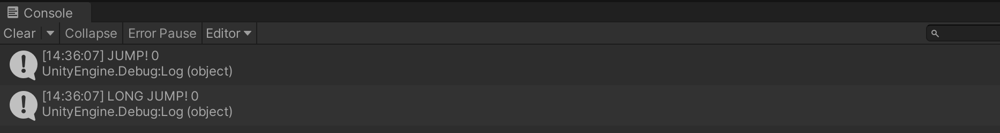

你会发现，按下空格两个同时运行了，看来还有 bug 我们继续修改。——原因是什么呢？

我按下键盘，松开的时候，Long Jump 也执行了一次。那么我们再测试一下，直接长按，然后你会发现按再久也没有输出，松开就输出了。并且输出变成了 2 倍。

现在我来解决：`context.canceled` 会同时监测到短按的键盘抬起，所以，一旦抬起，短按的命令和长按的命令都会被执行。

所以，我们需要添加一个状态的判断，我们松开的时候，只是执行短按或者长按。

::: code-tabs

@tab 简写

```cs {5,13,17,22}
// ---snip---
public class PlayerController : MonoBehaviour
{
    // ---snip---
    private bool buttonHeld;  // 代表是否长按
    // ---snip---

    public void LongJump(InputAction.CallbackContext context) {
        if (context.performed) 
        {
            moveDistance = jumpDistance * 2; // 小跳执行的话，那就是 jumpDistance
            // Debug.Log("LONG JUMP!" + " " + moveDistance);
            buttonHeld = true;  // 一旦被长按了，我们的 buttonHeld 就为 true
        }

        // canceled 取消了
        if (context.canceled && buttonHeld) // 既要是被按下松开 context.canceled && 也要是 true buttonHeld
        {
            // 松掉空格「按键」
            // TODO: 执行跳跃,而我们说了，要在松掉键盘，执行。那么把上面的 29 行代码，移动下来：
            Debug.Log("LONG JUMP!" + " " + moveDistance);
            buttonHeld = false;  // 把状态改回来
        }
    }

    // ---snip---
}
```

@tab 目前的完整代码

```cs
using System.Collections;
using System.Collections.Generic;
using UnityEngine;
using UnityEngine.InputSystem;

public class PlayerController : MonoBehaviour
{
    public float jumpDistance;
    private float moveDistance;  // 真实跳跃距离
    private bool buttonHeld;  // 代表是否长按
    public void Jump(InputAction.CallbackContext context)
    {
        // 创建一个默认的函数写法
        // public 公开的，其它类都可以调用
        // void 没有返回类型
        // if (context.phase == InputActionPhase.Performed)
        // 下面是简写
        if (context.performed)
        {  // 这样只有在功能完全的输出，我们才有里面的内容
            // Debug.Log("Jump! Hello..." + context);
            // 也改成具体跳跃的距离，方便后期调试
            moveDistance = jumpDistance;
            Debug.Log("JUMP!" + " " + moveDistance);
        }
    }

    public void LongJump(InputAction.CallbackContext context) {
        if (context.performed) 
        {
            moveDistance = jumpDistance * 2; // 小跳执行的话，那就是 jumpDistance
            // Debug.Log("LONG JUMP!" + " " + moveDistance);
            buttonHeld = true;  // 一旦被长按了，我们的 buttonHeld 就为 true
        }

        // canceled 取消了
        if (context.canceled && buttonHeld) // 既要是被按下松开 context.canceled && 也要是 true buttonHeld
        {
            // 松掉空格「按键」
            // TODO: 执行跳跃,而我们说了，要在松掉键盘，执行。那么把上面的 29 行代码，移动下来：
            Debug.Log("LONG JUMP!" + " " + moveDistance);
            buttonHeld = false;  // 把状态改回来
        }
    }

    public void GetTouchPosition(InputAction.CallbackContext context) {
        
    }
}
```

@tab 可以把输出注释掉

```cs
using System.Collections;
using System.Collections.Generic;
using UnityEngine;
using UnityEngine.InputSystem;

public class PlayerController : MonoBehaviour
{
    public float jumpDistance;
    private float moveDistance;  // 真实跳跃距离
    private bool buttonHeld;  // 代表是否长按
    public void Jump(InputAction.CallbackContext context)
    {
        // 创建一个默认的函数写法
        // public 公开的，其它类都可以调用
        // void 没有返回类型
        // if (context.phase == InputActionPhase.Performed)
        // 下面是简写
        if (context.performed)
        {  // 这样只有在功能完全的输出，我们才有里面的内容
            // Debug.Log("Jump! Hello..." + context);
            // 也改成具体跳跃的距离，方便后期调试
            moveDistance = jumpDistance;
            // Debug.Log("JUMP!" + " " + moveDistance);  // 可以先注释掉了，不然控制台太乱
        }
    }

    public void LongJump(InputAction.CallbackContext context) {
        if (context.performed) 
        {
            moveDistance = jumpDistance * 2; // 小跳执行的话，那就是 jumpDistance
            // Debug.Log("LONG JUMP!" + " " + moveDistance);
            buttonHeld = true;  // 一旦被长按了，我们的 buttonHeld 就为 true
        }

        // canceled 取消了
        if (context.canceled && buttonHeld) // 既要是被按下松开 context.canceled && 也要是 true buttonHeld
        {
            // 松掉空格「按键」
            // TODO: 执行跳跃,而我们说了，要在松掉键盘，执行。那么把上面的 29 行代码，移动下来：
            // Debug.Log("LONG JUMP!" + " " + moveDistance);  // 可以先注释掉了，不然控制台太乱
            buttonHeld = false;  // 把状态改回来
        }
    }

    public void GetTouchPosition(InputAction.CallbackContext context) {
        
    }
}
```

:::

这样就正常了。

## 4. 实现移动

小青蛙的移动上面讲了，不要使用 Transform 来实现，要是用 Rigidbody2D。

```cs {4-7,11-16,18-25}
//  ---snip---
public class PlayerController : MonoBehaviour
{
    // 组件一般写在上面
    // 一般用两种方法: 一种就是 public 但是不推荐，因为 public 实现，需要我们自己去 Unity 里面去拖拽
    // private 我们可以实现获取 Frog 自身身上的 Rigidbody2D 组件
    private Rigidbody2D rb;

	//  ---snip---

    // 我们要在我们的游戏最最开始第一帧执行，那么有一个周期函数是在 start 函数之前执行的，也就是 Awake
    // 「Unity 为我们提供好的周期代码函数」
    private void Awake()  // 会在 start 之前执行
    {
        rb = GetComponent<Rigidbody2D>();  // 获得自身身上的组件
    }

    // 我们前面说了，如果你想使用物理的话，我们需要在 FixedUpdate 里面执行
    private void FixedUpdate() 
    // FixedUpdate 是固定每 0.02s 执行一次，它不会依照你系统的快慢来执行——所以它是一个非常稳定的物理系统
    {
        // 在这里吗我们要实现什么呢？——实现真实的移动
        // rb.position = Vector2.Lerp(起始坐标, 最终的坐标);  // Linearly interpolates between vectors a and b by t.// 通过 t 在向量 a 和 b 之间进行线性插值。
        // rb.position = Vector2.Lerp(transform.position, 那么最总坐标是？); // 目前不知道最终坐标位置，先注释掉
    }
    //  ---snip---
}
```

**不过我们用 moveDistance，我们用现在的坐标 + moveDistance 不就是移动的目标坐标**

::: code-tabs

@tab 1

```cs {5,11,20,30}
//  ---snip---
public class PlayerController : MonoBehaviour
{
   //  ---snip---
    private Vector2 destination;  // 用来存储计算的值

    //  ---snip---
    private void FixedUpdate()
    {
        //  ---snip---
        rb.position = Vector2.Lerp(transform.position, destination,0.134f); // 目前不知道最终坐标位置，先注释掉
    }
    public void Jump(InputAction.CallbackContext context)
    {
        //  ---snip---
        if (context.performed)
        {  
            //  ---snip---
            moveDistance = jumpDistance;
            destination = new Vector2(transform.position.x, transform.position.y + moveDistance);
        }
    }

    public void LongJump(InputAction.CallbackContext context)
    {
        //  ---snip---
        if (context.canceled && buttonHeld)
        {
            //  ---snip---
            destination = new Vector2(transform.position.x, transform.position.y + moveDistance);
            buttonHeld = false;
        }
    }

    //  ---snip---
}
```

@tab 目前完整代码

```cs
using System.Collections;
using System.Collections.Generic;
using UnityEngine;
using UnityEngine.InputSystem;

public class PlayerController : MonoBehaviour
{
    // 组件一般写在上面
    // 一般用两种方法: 一种就是 public 但是不推荐，因为 public 实现，需要我们自己去 Unity 里面去拖拽
    // private 我们可以实现获取 Frog 自身身上的 Rigidbody2D 组件
    private Rigidbody2D rb;

    public float jumpDistance;
    private float moveDistance;  // 真实跳跃距离
    private bool buttonHeld;  // 代表是否长按
    private Vector2 destination;  // 用来存储计算的值

    // 我们要在我们的游戏最最开始第一帧执行，那么有一个周期函数是在 start 函数之前执行的，也就是 Awake
    // 「Unity 为我们提供好的周期代码函数」
    private void Awake()  // 会在 start 之前执行
    {
        rb = GetComponent<Rigidbody2D>();  // 获得自身身上的组件
    }

    // 我们前面说了，如果你想使用物理的话，我们需要在 FixedUpdate 里面执行
    private void FixedUpdate() 
    // FixedUpdate 是固定每 0.02s 执行一次，它不会依照你系统的快慢来执行——所以它是一个非常稳定的物理系统
    {
        // 在这里吗我们要实现什么呢？——实现真实的移动
        // rb.position = Vector2.Lerp(起始坐标, 最终的坐标);  // Linearly interpolates between vectors a and b by t.// 通过 t 在向量 a 和 b 之间进行线性插值。
        // rb.position = Vector2.Lerp(transform.position, 那么最总坐标是？); // 目前不知道最终坐标位置，先注释掉
        rb.position = Vector2.Lerp(transform.position, destination,0.134f); // 目前不知道最终坐标位置，先注释掉
        // 不过我们用 moveDistance，我们用现在的坐标+moveDistance不就是移动的目标坐标
    }
    public void Jump(InputAction.CallbackContext context)
    {
        // 创建一个默认的函数写法
        // public 公开的，其它类都可以调用
        // void 没有返回类型
        // if (context.phase == InputActionPhase.Performed)
        // 下面是简写
        if (context.performed)
        {  // 这样只有在功能完全的输出，我们才有里面的内容
            // Debug.Log("Jump! Hello..." + context);
            // 也改成具体跳跃的距离，方便后期调试
            moveDistance = jumpDistance;
            // Debug.Log("JUMP!" + " " + moveDistance);  // 可以先注释掉了，不然控制台太乱

            destination = new Vector2(transform.position.x, transform.position.y + moveDistance);
        }
    }

    public void LongJump(InputAction.CallbackContext context)
    {
        if (context.performed)
        {
            moveDistance = jumpDistance * 2; // 小跳执行的话，那就是 jumpDistance
            // Debug.Log("LONG JUMP!" + " " + moveDistance);
            buttonHeld = true;  // 一旦被长按了，我们的 buttonHeld 就为 true
        }

        // canceled 取消了 
        if (context.canceled && buttonHeld) // 既要是被按下松开 context.canceled && 也要是 true buttonHeld
        {
            // 松掉空格「按键」
            // TODO: 执行跳跃,而我们说了，要在松掉键盘，执行。那么把上面的 29 行代码，移动下来：
            // Debug.Log("LONG JUMP!" + " " + moveDistance);  // 可以先注释掉了，不然控制台太乱
            buttonHeld = false;  // 把状态改回来
            destination = new Vector2(transform.position.x, transform.position.y + moveDistance);
        }
    }

    public void GetTouchPosition(InputAction.CallbackContext context)
    {

    }
}
```

:::

> 使用了非线性速度的跳跃，每次移动两个坐标的0.134距离，凑18帧跳跃完成，和后面的跳跃18帧触发落地事件呼应
>
> 18帧抛去开始结束的2帧，16*0.134差不多正好是2.1的距离范围

::: warning

角色、背景坐标一定要记得设置为 0！！！不然，一点测试运行，就自动跑了。

:::

我们现在有一个问题：就是一直连续按空格我们的青蛙，会一直往前。但是我们需要青蛙要有一个状态。

——我们加个条件，如果正在跳跃的话，我们不允许再按。

```cs {4,12-15,25-29,39,47,53,61,68}
public class PlayerController : MonoBehaviour
{
    // ---snip---
    private bool isJump;
	// ---snip---

    private void Update()
    {
        // isJump 什么时候变成 flase 呢？
        // FIXME:临时操作
        // if (transform.position.y == destination.y)
        if (destination.y - transform.position.y < 0.1f)
        {
            isJump = false;
        }
    }

    // 我们前面说了，如果你想使用物理的话，我们需要在 FixedUpdate 里面执行
    private void FixedUpdate()
    // FixedUpdate 是固定每 0.02s 执行一次，它不会依照你系统的快慢来执行——所以它是一个非常稳定的物理系统
    {
        // 在这里吗我们要实现什么呢？——实现真实的移动
        // rb.position = Vector2.Lerp(起始坐标, 最终的坐标);  // Linearly interpolates between vectors a and b by t.// 通过 t 在向量 a 和 b 之间进行线性插值。
        // rb.position = Vector2.Lerp(transform.position, 那么最终坐标是？); // 目前不知道最终坐标位置，先注释掉
        if (isJump)  // 如果正在跳跃，则进行计算
        {
            rb.position = Vector2.Lerp(transform.position, destination, 0.134f); // 目前不知道最终坐标位置，先注释掉
                                                                                 // 不过我们用 moveDistance，我们用现在的坐标+moveDistance不就是移动的目标坐标
        }
    }
    public void Jump(InputAction.CallbackContext context)
    {
        // 创建一个默认的函数写法
        // public 公开的，其它类都可以调用
        // void 没有返回类型
        // if (context.phase == InputActionPhase.Performed)
        // 下面是简写
        // if (context.performed && isJump == false)
        if (context.performed && !isJump)  // 要执行跳跃，那前提是当前的青蛙没有跳跃
        {  // 这样只有在功能完全的输出，我们才有里面的内容
            // Debug.Log("Jump! Hello..." + context);
            // 也改成具体跳跃的距离，方便后期调试
            moveDistance = jumpDistance;
            // Debug.Log("JUMP!" + " " + moveDistance);  // 可以先注释掉了，不然控制台太乱

            destination = new Vector2(transform.position.x, transform.position.y + moveDistance);
            isJump = true;
        }
    }

    public void LongJump(InputAction.CallbackContext context)
    {
        if (context.performed && !isJump)  // 要执行跳跃，那前提是当前的青蛙没有跳跃
        {
            moveDistance = jumpDistance * 2; // 小跳执行的话，那就是 jumpDistance
            // Debug.Log("LONG JUMP!" + " " + moveDistance);
            buttonHeld = true;  // 一旦被长按了，我们的 buttonHeld 就为 true
        }

        // canceled 取消了 
        if (context.canceled && buttonHeld && !isJump) // 既要是被按下松开 context.canceled && 也要是 true buttonHeld
        {
            // 松掉空格「按键」
            // TODO: 执行跳跃,而我们说了，要在松掉键盘，执行。那么把上面的 29 行代码，移动下来：
            // Debug.Log("LONG JUMP!" + " " + moveDistance);  // 可以先注释掉了，不然控制台太乱
            buttonHeld = false;  // 把状态改回来
            destination = new Vector2(transform.position.x, transform.position.y + moveDistance);
            isJump = true;
        }
    }

    public void GetTouchPosition(InputAction.CallbackContext context)
    {

    }
}
```

## 5. 完整代码

```cs
using System.Collections;
using System.Collections.Generic;
using UnityEngine;
using UnityEngine.InputSystem;

public class PlayerController : MonoBehaviour
{
    // 组件一般写在上面
    // 一般用两种方法: 一种就是 public 但是不推荐，因为 public 实现，需要我们自己去 Unity 里面去拖拽
    // private 我们可以实现获取 Frog 自身身上的 Rigidbody2D 组件
    private Rigidbody2D rb;

    public float jumpDistance;
    private float moveDistance;  // 真实跳跃距离
    private bool buttonHeld;  // 代表是否长按
    private Vector2 destination;  // 用来存储计算的值
    private bool isJump;
    // 我们要在我们的游戏最最开始第一帧执行，那么有一个周期函数是在 start 函数之前执行的，也就是 Awake
    // 「Unity 为我们提供好的周期代码函数」
    private void Awake()  // 会在 start 之前执行
    {
        rb = GetComponent<Rigidbody2D>();  // 获得自身身上的组件
    }

    private void Update()
    {
        // isJump 什么时候变成 flase 呢？
        // FIXME:临时操作
        // if (transform.position.y == destination.y)
        if (destination.y - transform.position.y < 0.1f)
        {
            isJump = false;
        }
    }

    // 我们前面说了，如果你想使用物理的话，我们需要在 FixedUpdate 里面执行
    private void FixedUpdate()
    // FixedUpdate 是固定每 0.02s 执行一次，它不会依照你系统的快慢来执行——所以它是一个非常稳定的物理系统
    {
        // 在这里吗我们要实现什么呢？——实现真实的移动
        // rb.position = Vector2.Lerp(起始坐标, 最终的坐标);  // Linearly interpolates between vectors a and b by t.// 通过 t 在向量 a 和 b 之间进行线性插值。
        // rb.position = Vector2.Lerp(transform.position, 那么最终坐标是？); // 目前不知道最终坐标位置，先注释掉
        if (isJump)  // 如果正在跳跃，则进行计算
        {
            rb.position = Vector2.Lerp(transform.position, destination, 0.134f); // 目前不知道最终坐标位置，先注释掉
                                                                                 // 不过我们用 moveDistance，我们用现在的坐标+moveDistance不就是移动的目标坐标
        }
    }
    public void Jump(InputAction.CallbackContext context)
    {
        // 创建一个默认的函数写法
        // public 公开的，其它类都可以调用
        // void 没有返回类型
        // if (context.phase == InputActionPhase.Performed)
        // 下面是简写
        // if (context.performed && isJump == false)
        if (context.performed && !isJump)  // 要执行跳跃，那前提是当前的青蛙没有跳跃
        {  // 这样只有在功能完全的输出，我们才有里面的内容
            // Debug.Log("Jump! Hello..." + context);
            // 也改成具体跳跃的距离，方便后期调试
            moveDistance = jumpDistance;
            // Debug.Log("JUMP!" + " " + moveDistance);  // 可以先注释掉了，不然控制台太乱

            destination = new Vector2(transform.position.x, transform.position.y + moveDistance);
            isJump = true;
        }
    }

    public void LongJump(InputAction.CallbackContext context)
    {
        if (context.performed && !isJump)  // 要执行跳跃，那前提是当前的青蛙没有跳跃
        {
            moveDistance = jumpDistance * 2; // 小跳执行的话，那就是 jumpDistance
            // Debug.Log("LONG JUMP!" + " " + moveDistance);
            buttonHeld = true;  // 一旦被长按了，我们的 buttonHeld 就为 true
        }

        // canceled 取消了 
        if (context.canceled && buttonHeld && !isJump) // 既要是被按下松开 context.canceled && 也要是 true buttonHeld
        {
            // 松掉空格「按键」
            // TODO: 执行跳跃,而我们说了，要在松掉键盘，执行。那么把上面的 29 行代码，移动下来：
            // Debug.Log("LONG JUMP!" + " " + moveDistance);  // 可以先注释掉了，不然控制台太乱
            buttonHeld = false;  // 把状态改回来
            destination = new Vector2(transform.position.x, transform.position.y + moveDistance);
            isJump = true;
        }
    }

    public void GetTouchPosition(InputAction.CallbackContext context)
    {

    }
}
```


欢迎关注我公众号：AI悦创，有更多更好玩的等你发现！

::: details 公众号：AI悦创【二维码】


:::

::: info AI悦创·编程一对一

AI悦创·推出辅导班啦，包括「Python 语言辅导班、C++ 辅导班、java 辅导班、算法/数据结构辅导班、少儿编程、pygame 游戏开发、Linux、Web全栈」，全部都是一对一教学：一对一辅导 + 一对一答疑 + 布置作业 + 项目实践等。当然，还有线下线上摄影课程、Photoshop、Premiere 一对一教学、QQ、微信在线，随时响应！微信：Jiabcdefh

C++ 信息奥赛题解，长期更新！长期招收一对一中小学信息奥赛集训，莆田、厦门地区有机会线下上门，其他地区线上。微信：Jiabcdefh

方法一：[QQ](http://wpa.qq.com/msgrd?v=3&uin=1432803776&site=qq&menu=yes)

方法二：微信：Jiabcdefh

:::


