## 1. 概述

你好，我是悦创。

在这次课，我们开始尝试让我们的青蛙左右跳跃了。

那在开始左右跳跃之前，我们要先解决一个问题。

我们如何获取，我们点击的是青蛙的左侧还是青蛙的右侧呢？

我们先看看，input Action，也就是 Input Controls。

::: tabs

@tab 1

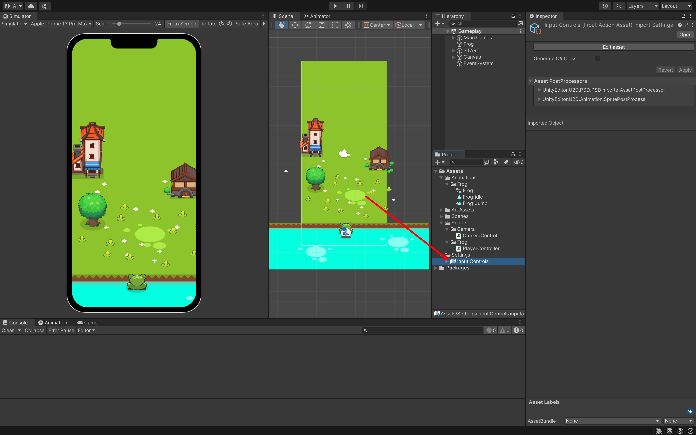

@tab 2

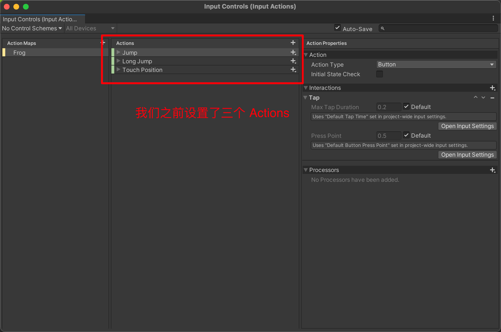

:::

## 2. 设置 Vector 2

其中一个就是 Touch Position。

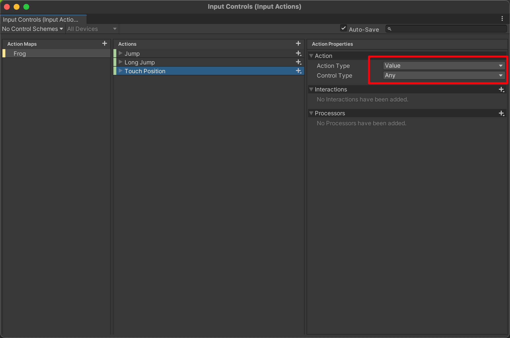

之前，我们只选择了它的 Value，并没有它的 control type。

::: tabs

@tab 1

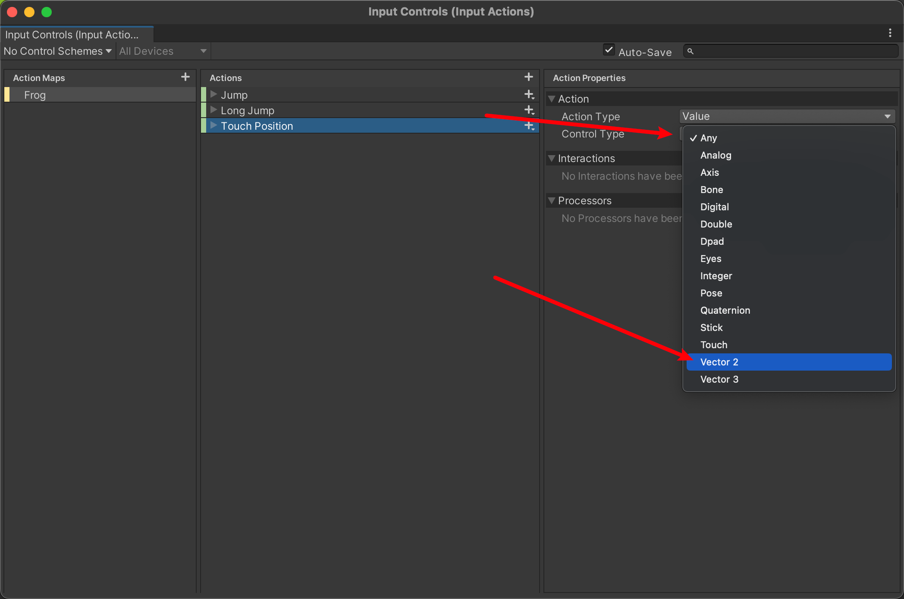

@tab 2

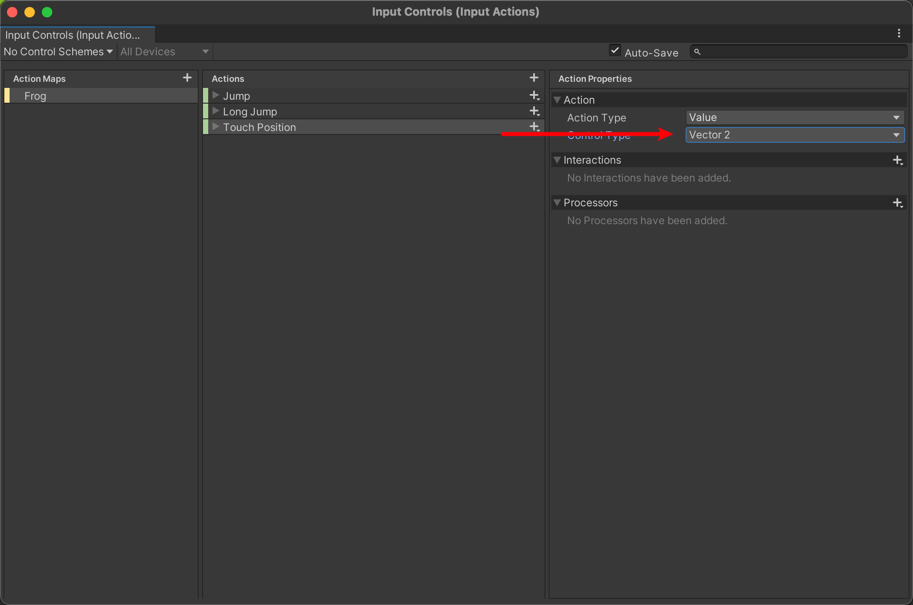

:::

我们选择 Vector 2，也就是二维坐标。二维向量坐标，可以代表它的 x、y 对应的位置。这样，我们在点击的时候，就可以返回屏幕上指定的位置。修改之后，记得点击保存。

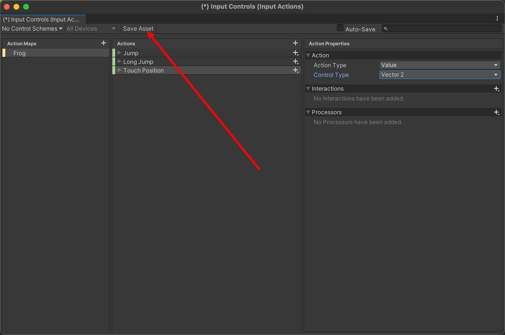

接下来，我们来一起动手试一试。

## 3. 编写 PlayerController.cs

这个代码文件中有一个函数，我们一直都留着，没去写的。

```cs
public void GetTouchPosition(InputAction.CallbackContext context)
    {

    }
```

首先，我们先尝试打印出屏幕的坐标是什么？

::: code-tabs

@tab 代码

```cs
public void GetTouchPosition(InputAction.CallbackContext context)
    {
        Debug.Log(context.ReadValue<Vector2>()); // 这也就是我们刚刚设置好的
    }
```

@tab 目前完整代码

```cs
using System.Collections;
using System.Collections.Generic;
using UnityEngine;
using UnityEngine.InputSystem;

public class PlayerController : MonoBehaviour
{
    // 组件一般写在上面
    // 一般用两种方法: 一种就是 public 但是不推荐，因为 public 实现，需要我们自己去 Unity 里面去拖拽
    // private 我们可以实现获取 Frog 自身身上的 Rigidbody2D 组件
    private Rigidbody2D rb;
    private Animator anim;
    public float jumpDistance;
    private float moveDistance;  // 真实跳跃距离
    private bool buttonHeld;  // 代表是否长按
    private Vector2 destination;  // 用来存储计算的值
    private bool isJump;
    private bool canJump;
    // 我们要在我们的游戏最最开始第一帧执行，那么有一个周期函数是在 start 函数之前执行的，也就是 Awake
    // 「Unity 为我们提供好的周期代码函数」
    private void Awake()  // 会在 start 之前执行
    {
        rb = GetComponent<Rigidbody2D>();  // 获得自身身上的组件
        anim = GetComponent<Animator>();  // 获取 Animator 组件
    }

    private void Update()
    {
        // isJump 什么时候变成 flase 呢？
        // FIXME:临时操作
        // if (transform.position.y == destination.y)
        // if (destination.y - transform.position.y < 0.1f)
        // {
        //     isJump = false;
        // }
        if (canJump)
        {
            TriggerJump();
        }

    }

    // 我们前面说了，如果你想使用物理的话，我们需要在 FixedUpdate 里面执行
    private void FixedUpdate()
    // FixedUpdate 是固定每 0.02s 执行一次，它不会依照你系统的快慢来执行——所以它是一个非常稳定的物理系统
    {
        // 在这里吗我们要实现什么呢？——实现真实的移动
        // rb.position = Vector2.Lerp(起始坐标, 最终的坐标);  // Linearly interpolates between vectors a and b by t.// 通过 t 在向量 a 和 b 之间进行线性插值。
        // rb.position = Vector2.Lerp(transform.position, 那么最终坐标是？); // 目前不知道最终坐标位置，先注释掉
        if (isJump)  // 如果正在跳跃，则进行计算
        {
            rb.position = Vector2.Lerp(transform.position, destination, 0.134f); // 目前不知道最终坐标位置，先注释掉
                                                                                 // 不过我们用 moveDistance，我们用现在的坐标+moveDistance不就是移动的目标坐标
        }
    }

    #region INPUT 输入回调函数
    public void Jump(InputAction.CallbackContext context)
    {
        // 创建一个默认的函数写法
        // public 公开的，其它类都可以调用
        // void 没有返回类型
        // if (context.phase == InputActionPhase.Performed)
        // 下面是简写
        // if (context.performed && isJump == false)
        // TODO: 执行跳跃，跳跃的距离，记录分数，播放跳跃的音效
        if (context.performed && !isJump)  // 要执行跳跃，那前提是当前的青蛙没有跳跃
        {  // 这样只有在功能完全的输出，我们才有里面的内容
            // Debug.Log("Jump! Hello..." + context);
            // 也改成具体跳跃的距离，方便后期调试
            moveDistance = jumpDistance;
            // Debug.Log("JUMP!" + " " + moveDistance);  // 可以先注释掉了，不然控制台太乱

            destination = new Vector2(transform.position.x, transform.position.y + moveDistance);
            // isJump = true;
            canJump = true;
        }
    }

    public void LongJump(InputAction.CallbackContext context)
    {
        if (context.performed && !isJump)  // 要执行跳跃，那前提是当前的青蛙没有跳跃
        {
            moveDistance = jumpDistance * 2; // 小跳执行的话，那就是 jumpDistance
            // Debug.Log("LONG JUMP!" + " " + moveDistance);
            buttonHeld = true;  // 一旦被长按了，我们的 buttonHeld 就为 true
        }

        // canceled 取消了 
        if (context.canceled && buttonHeld && !isJump) // 既要是被按下松开 context.canceled && 也要是 true buttonHeld
        {
            // 松掉空格「按键」
            // TODO: 执行跳跃,而我们说了，要在松掉键盘，执行。那么把上面的 29 行代码，移动下来：
            // Debug.Log("LONG JUMP!" + " " + moveDistance);  // 可以先注释掉了，不然控制台太乱
            buttonHeld = false;  // 把状态改回来
            destination = new Vector2(transform.position.x, transform.position.y + moveDistance);
            // isJump = true;
            canJump = true;
        }
    }

    public void GetTouchPosition(InputAction.CallbackContext context)
    {
        Debug.Log(context.ReadValue<Vector2>()); // 这也就是我们刚刚设置好的
    }
    #endregion

    /// <summary>
    /// 触发执行跳跃动画
    /// </summary>
    private void TriggerJump()
    {
        canJump = false;
        //TODO:获得移动方向、播放动画
        anim.SetTrigger("Jump");  // 和在 unity 里面设置的参数名称一致才可以，大小写要一致
        // anim.SetBool();
        // anim.SetFloat();
        // anim.SetInteger(); 
    }

    #region Animation Event
    public void JumpAnimationEvent()  // 跳跃的动画事件
    {
        // 改变状态
        isJump = true;
    }
    // 还需要另外一个状态，也就是跳跃结束的时候，状态改为 false
    public void FinishJumpAnimationEvent()
    {
        isJump = false;
    }
    #endregion
}
```

:::

保存代码后，我们点击运行，点击屏幕的任意位置，看看会输出什么。

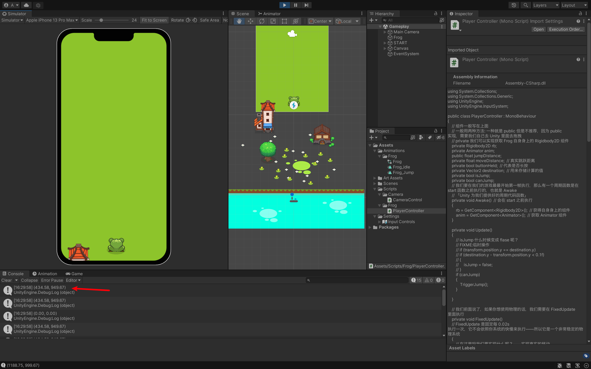

我们知道这个坐标数值非常的大。可是，我们的人物坐标是 0, 0。

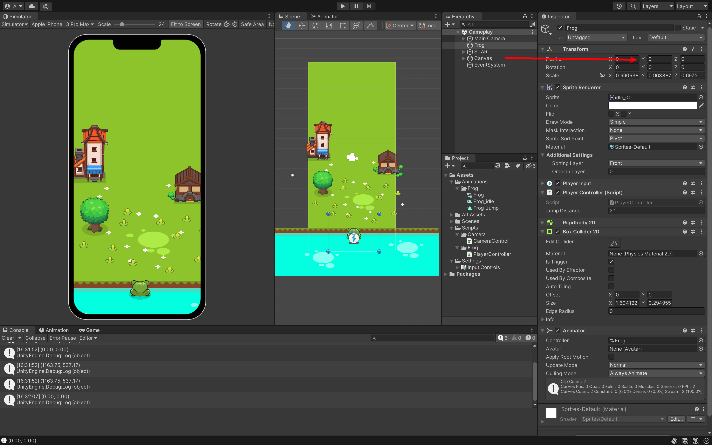

## 4. 小青蛙的世界坐标

我们只要稍微给 Y + 1，你就会发现，青蛙就移动了一段很大的位置。如果我们真的加九百多的 Y 值的话，那么青蛙完全超出屏幕的好几倍。

为什么得到这样一个数值呢？——因为，我们在打印的时候，点击的位置，实际上是我们的屏幕的像素点。

我们知道我们的屏幕分辨率很有可能在1920x1080。这是代表，宽度有 1080 个像素单位，所以才导致我们点击的坐标是这么大的。尤其是 iPhone，分辨率更高的话，就更大了。

那么我们应该如何修改，把屏幕像素显示和小青蛙一样的，世界坐标呢？——我们就需要使用 Camera 进行渲染了。

可以留意一下，Main Camera 的参数：

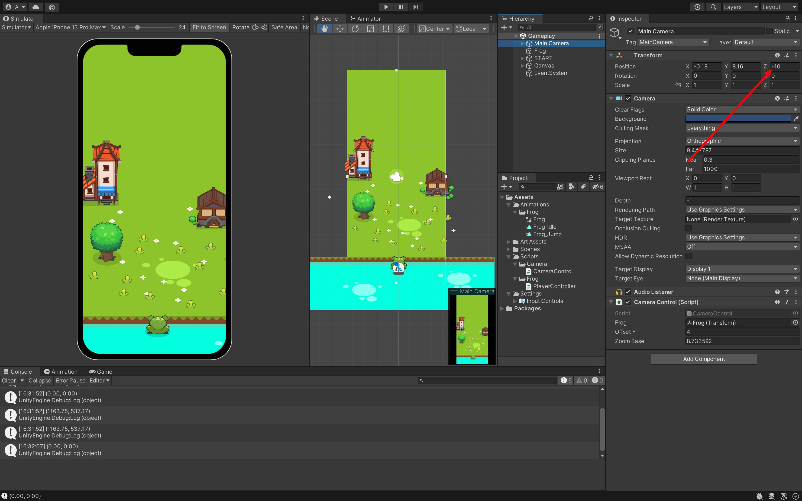

也就是说，它离我的整体物体有负10 的距离。然后结合我们正交相机的角度、远近等，各种数值，Unity 会计算出屏幕距离对应世界坐标。

这是 Unity 为我们做好的内置函数，我们通过函数，就可以把读到的值，转换为世界坐标。

## 5. 编写实现

```cs
private Vector2 touchPosition;  // 存储屏幕的像素值
```

```cs
public void GetTouchPosition(InputAction.CallbackContext context)
{
    // Debug.Log(context.ReadValue<Vector2>()); // 这也就是我们刚刚设置好的
    touchPosition = Camera.main.ScreenToWorldPoint(context.ReadValue<Vector2>());
    Debug.Log(touchPosition);
}
```

保存代码，运行：

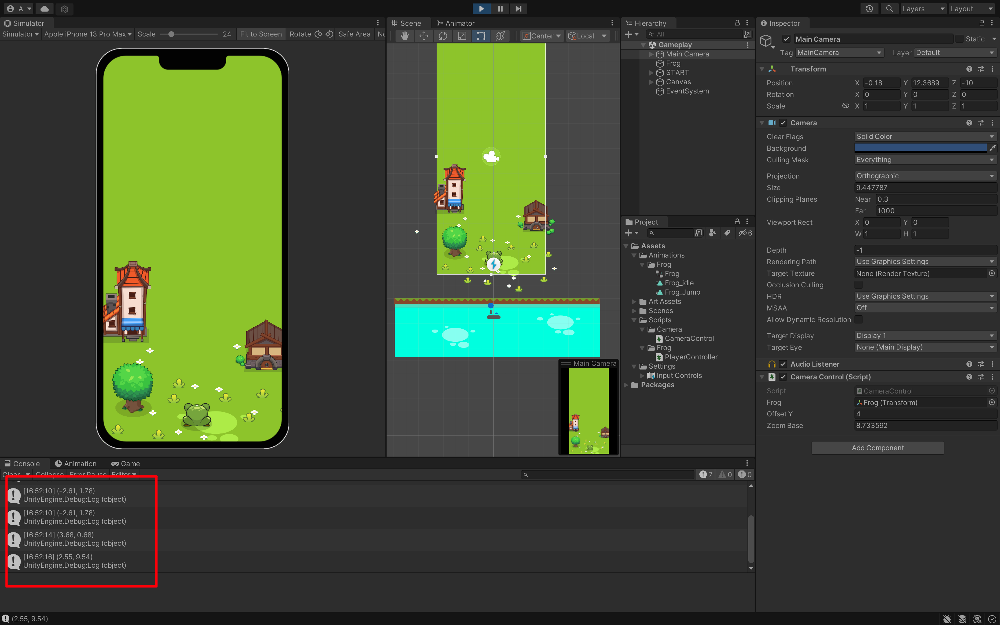

现在的坐标就很正常了。

## 6. 如何判断点击左右？

那么现在有个问题：我们如何判断点的是左边还是右边呢？

有一个很简单的方法，就是使用：点击的 x 值，去减去当前坐标的 x 值，看看是负数还是正数。如果是负数代表左侧，如果是正数代表右侧。

同样的道理，如果 y 的差值是大于 0 的，表明是上面，小于零就是下面。不过，就算是下面，我们也希望小青蛙的移动是向上的。

那么，我们如何记录是向左向右还是向上呢？——使用枚举变量。

什么是枚举变量呢？——枚举变量，就是有固定内容的一个值。它的类型，可以帮组我们，快速的选择、赋值等，来进行一些判断。通常会用到固定的值，例如我们的季节，只有春夏秋冬这四个季节。或者一个物品的类型，工具或者可食用的物品。——所以，这种有固定类型的，我们一般用枚举来表示。

```cs {5-11}
// ---snip---
public class PlayerController : MonoBehaviour
{
    // 我们只需要在内部使用，所以直接写在里面
    private enum Direction
    {
        // 可以写上这个类，包含哪些内容
        Up, Right, Left  
    }
    // 创建枚举之后，我们也需要创建对应枚举的变量
    public Direction dir; // 现在发现有个红色报错，原因是上面我们使用了 private 没有办法把它暴露出来
    // ---snip---
}
```

我们进行如下修改：

```cs {5}
// ---snip---
public class PlayerController : MonoBehaviour
{
    // 我们只需要在内部使用，所以直接写在里面
    public enum Direction
    {
        // 可以写上这个类，包含哪些内容
        Up, Right, Left  
    }
    // 创建枚举之后，我们也需要创建对应枚举的变量
    public Direction dir; // 现在发现有个红色报错，原因是上面我们使用了 private 没有办法把它暴露出来
    // ---snip---
}
```

保存运行看看：

::: tabs

@tab 1

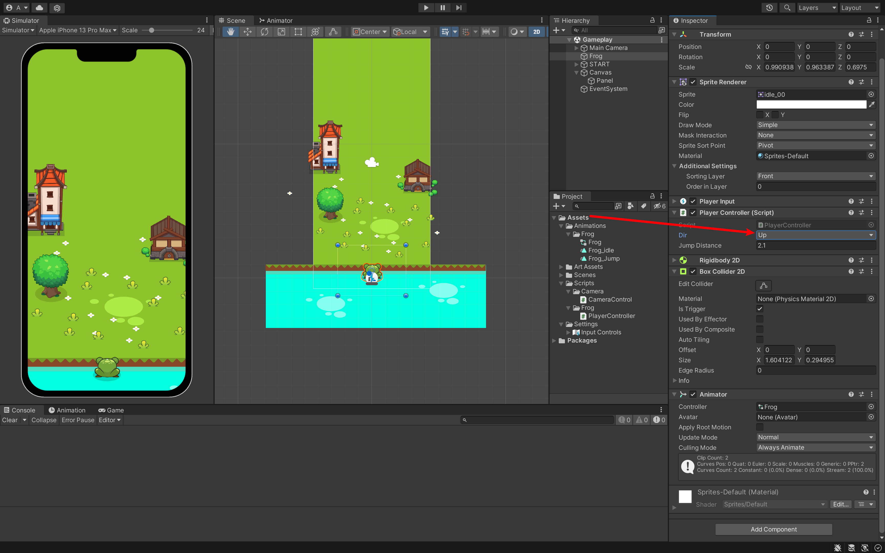

@tab 2

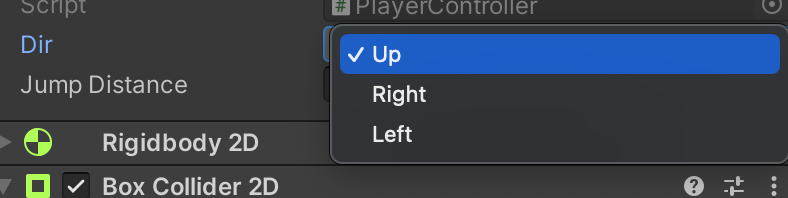

:::

现在变量有弹出的菜单，我们可以选择具体变量的赋值。

是不是很像我们系统的菜单方式，其实系统的菜单就是枚举的方式。

不过，你要注意⚠️，在这个项目中。我们不需要手动的为项目赋值，我需要用屏幕点击的位置自动为它赋值。

那代码就不需要使用 public 实现了。

::: code-tabs

@tab Simple

```cs
// 我们只需要在内部使用，所以直接写在里面
    private enum Direction
    {
        // 可以写上这个类，包含哪些内容
        Up, Right, Left  
    }
    // 创建枚举之后，我们也需要创建对应枚举的变量
    private Direction dir; // 现在发现有个红色报错，原因是上面我们使用了 private 没有办法把它暴露出来
```

@tab 截止目前的网站代码

```cs
using System.Collections;
using System.Collections.Generic;
using UnityEngine;
using UnityEngine.InputSystem;

public class PlayerController : MonoBehaviour
{
    // 我们只需要在内部使用，所以直接写在里面
    private enum Direction
    {
        // 可以写上这个类，包含哪些内容
        Up, Right, Left  
    }
    // 创建枚举之后，我们也需要创建对应枚举的变量
    private Direction dir; // 现在发现有个红色报错，原因是上面我们使用了 private 没有办法把它暴露出来
    // 组件一般写在上面
    // 一般用两种方法: 一种就是 public 但是不推荐，因为 public 实现，需要我们自己去 Unity 里面去拖拽
    // private 我们可以实现获取 Frog 自身身上的 Rigidbody2D 组件
    private Rigidbody2D rb;
    private Animator anim;
    public float jumpDistance;
    private float moveDistance;  // 真实跳跃距离
    private bool buttonHeld;  // 代表是否长按
    private Vector2 destination;  // 用来存储计算的值
    private Vector2 touchPosition;  // 存储屏幕的像素值
    private bool isJump;
    private bool canJump;
    // 我们要在我们的游戏最最开始第一帧执行，那么有一个周期函数是在 start 函数之前执行的，也就是 Awake
    // 「Unity 为我们提供好的周期代码函数」
    private void Awake()  // 会在 start 之前执行
    {
        rb = GetComponent<Rigidbody2D>();  // 获得自身身上的组件
        anim = GetComponent<Animator>();  // 获取 Animator 组件
    }

    private void Update()
    {
        // isJump 什么时候变成 flase 呢？
        // FIXME:临时操作
        // if (transform.position.y == destination.y)
        // if (destination.y - transform.position.y < 0.1f)
        // {
        //     isJump = false;
        // }
        if (canJump)
        {
            TriggerJump();
        }

    }

    // 我们前面说了，如果你想使用物理的话，我们需要在 FixedUpdate 里面执行
    private void FixedUpdate()
    // FixedUpdate 是固定每 0.02s 执行一次，它不会依照你系统的快慢来执行——所以它是一个非常稳定的物理系统
    {
        // 在这里吗我们要实现什么呢？——实现真实的移动
        // rb.position = Vector2.Lerp(起始坐标, 最终的坐标);  // Linearly interpolates between vectors a and b by t.// 通过 t 在向量 a 和 b 之间进行线性插值。
        // rb.position = Vector2.Lerp(transform.position, 那么最终坐标是？); // 目前不知道最终坐标位置，先注释掉
        if (isJump)  // 如果正在跳跃，则进行计算
        {
            rb.position = Vector2.Lerp(transform.position, destination, 0.134f); // 目前不知道最终坐标位置，先注释掉
                                                                                 // 不过我们用 moveDistance，我们用现在的坐标+moveDistance不就是移动的目标坐标
        }
    }

    #region INPUT 输入回调函数
    public void Jump(InputAction.CallbackContext context)
    {
        // 创建一个默认的函数写法
        // public 公开的，其它类都可以调用
        // void 没有返回类型
        // if (context.phase == InputActionPhase.Performed)
        // 下面是简写
        // if (context.performed && isJump == false)
        // TODO: 执行跳跃，跳跃的距离，记录分数，播放跳跃的音效
        if (context.performed && !isJump)  // 要执行跳跃，那前提是当前的青蛙没有跳跃
        {  // 这样只有在功能完全的输出，我们才有里面的内容
            // Debug.Log("Jump! Hello..." + context);
            // 也改成具体跳跃的距离，方便后期调试
            moveDistance = jumpDistance;
            // Debug.Log("JUMP!" + " " + moveDistance);  // 可以先注释掉了，不然控制台太乱

            destination = new Vector2(transform.position.x, transform.position.y + moveDistance);
            // isJump = true;
            canJump = true;
        }
    }

    public void LongJump(InputAction.CallbackContext context)
    {
        if (context.performed && !isJump)  // 要执行跳跃，那前提是当前的青蛙没有跳跃
        {
            moveDistance = jumpDistance * 2; // 小跳执行的话，那就是 jumpDistance
            // Debug.Log("LONG JUMP!" + " " + moveDistance);
            buttonHeld = true;  // 一旦被长按了，我们的 buttonHeld 就为 true
        }

        // canceled 取消了 
        if (context.canceled && buttonHeld && !isJump) // 既要是被按下松开 context.canceled && 也要是 true buttonHeld
        {
            // 松掉空格「按键」
            // TODO: 执行跳跃,而我们说了，要在松掉键盘，执行。那么把上面的 29 行代码，移动下来：
            // Debug.Log("LONG JUMP!" + " " + moveDistance);  // 可以先注释掉了，不然控制台太乱
            buttonHeld = false;  // 把状态改回来
            destination = new Vector2(transform.position.x, transform.position.y + moveDistance);
            // isJump = true;
            canJump = true;
        }
    }

    public void GetTouchPosition(InputAction.CallbackContext context)
    {
        Debug.Log(context.ReadValue<Vector2>()); // 这也就是我们刚刚设置好的
        touchPosition = Camera.main.ScreenToWorldPoint(context.ReadValue<Vector2>());
        Debug.Log(touchPosition);
    }
    #endregion

    /// <summary>
    /// 触发执行跳跃动画
    /// </summary>
    private void TriggerJump()
    {
        canJump = false;
        //TODO:获得移动方向、播放动画
        anim.SetTrigger("Jump");  // 和在 unity 里面设置的参数名称一致才可以，大小写要一致
        // anim.SetBool();
        // anim.SetFloat();
        // anim.SetInteger(); 
    }

    #region Animation Event
    public void JumpAnimationEvent()  // 跳跃的动画事件
    {
        // 改变状态
        isJump = true;
    }
    // 还需要另外一个状态，也就是跳跃结束的时候，状态改为 false
    public void FinishJumpAnimationEvent()
    {
        isJump = false;
    }
    #endregion
}
```

:::

那么，我们什时候获取到方向具体赋值呢？

那就需要在 GetTouchPosition 这个函数当中，所以，我们需要通过差值来判断。它目前对应的是哪个方向。

不过，我们需要留意一个问题，由于：我们的鼠标指针式非常的尖，而且很精准，但是实际上在手机上，我们是使用拇指去点按。所以这个范围比较广，也就意味着，不可能非常准确的只点中青蛙的正下方或者正上方。所以，我们用差值等于零来判断它向前，是不可能的。

——所以，我们需要给差值设置一个范围，比如说在 0.5 范围之内，或者超过 0.7 的范围之内，或者超过特别远的时候，我才开始判断青蛙是向左还是向右。

所以，给我们的玩家一个容错的几率。

那么，我们就将我们的差值进行向量话，判断它的 x 和 y。

::: code-tabs

@tab 修改的代码

```cs
// ---snip---

public class PlayerController : MonoBehaviour
{
    // ---snip---
    public void GetTouchPosition(InputAction.CallbackContext context)
    {
        Debug.Log(context.ReadValue<Vector2>()); // 这也就是我们刚刚设置好的
        touchPosition = Camera.main.ScreenToWorldPoint(context.ReadValue<Vector2>());
        // Debug.Log(touchPosition);  // 先注释掉
        // 首先我们创建一个临时的变量，用来存储：获得屏幕点按，返回的值。和我们青蛙坐标的差值
        // var 代表临时的变量 variable ，起名 offset 也就是位移，值如：touchPosition - transform.position
        // 但是这两个数据类型不同，也就是 Vector2 和 Vector3 不能相减，所以需要强制转换：(Vector3)touchPosition
        var offset = ((Vector3)touchPosition - transform.position).normalized;  // normalized 进行向量化，也就是让它趋于 0 和 1 之间，把它趋于 1。「所以，这个值只能返回 0 到 1 之间」
        // 所以当 offset > 0.7 的时候，就是百分之 70，相当于你偏移的位置超过 70% 了，那么我就判断你是向左或者向右。

        //  我们可以想象一下，这个 offset.x 的值，可能是多少？
        // 如果点在左边 offset.x 可能是个负值，如果点在屏幕的右侧，代表它是一个正值。但是无论它是正值也好、负值也好。
        // 如果它的差值超过 70%，我都要它向左或者向右的方向。
        // 不过换一个方向思考：如果它点按的位移差，小于 70%，我都判断它向正上方移动。
        // 也代表这个值的绝对值，<= 0.7f「f 代表 float 浮点数」
        // if (offset.x <= 0.7f) {}
        // 那么我们，怎么判断它距离的位移差呢？——使用数学的方法，绝对值。数学的方法都在 Mathf 里面
        if (Mathf.Abs(offset.x) <= 0.7f)  // 这里是绝对值，去掉绝对值则需要考虑正负数
        {
            dir = Direction.Up;
        }
        else if (offset.x < 0)  // 上面的条件不成立的话，表明 offset.x 绝对值大于 0.7f。那么接着我们就需要判断差值是否大于 0
        {
            dir = Direction.Left;
        }
        else if (offset.x > 0)
        {
            dir = Direction.Right;
        }
    }
    // ---snip---
}
```

@tab 截止目前完整代码

```cs
using System.Collections;
using System.Collections.Generic;
using UnityEngine;
using UnityEngine.InputSystem;

public class PlayerController : MonoBehaviour
{
    // 我们只需要在内部使用，所以直接写在里面
    private enum Direction
    {
        // 可以写上这个类，包含哪些内容
        Up, Right, Left
    }
    // 创建枚举之后，我们也需要创建对应枚举的变量
    private Direction dir; // 现在发现有个红色报错，原因是上面我们使用了 private 没有办法把它暴露出来
    // 组件一般写在上面
    // 一般用两种方法: 一种就是 public 但是不推荐，因为 public 实现，需要我们自己去 Unity 里面去拖拽
    // private 我们可以实现获取 Frog 自身身上的 Rigidbody2D 组件
    private Rigidbody2D rb;
    private Animator anim;
    public float jumpDistance;
    private float moveDistance;  // 真实跳跃距离
    private bool buttonHeld;  // 代表是否长按
    private Vector2 destination;  // 用来存储计算的值
    private Vector2 touchPosition;  // 存储屏幕的像素值
    private bool isJump;
    private bool canJump;
    // 我们要在我们的游戏最最开始第一帧执行，那么有一个周期函数是在 start 函数之前执行的，也就是 Awake
    // 「Unity 为我们提供好的周期代码函数」
    private void Awake()  // 会在 start 之前执行
    {
        rb = GetComponent<Rigidbody2D>();  // 获得自身身上的组件
        anim = GetComponent<Animator>();  // 获取 Animator 组件
    }

    private void Update()
    {
        // isJump 什么时候变成 flase 呢？
        // FIXME:临时操作
        // if (transform.position.y == destination.y)
        // if (destination.y - transform.position.y < 0.1f)
        // {
        //     isJump = false;
        // }
        if (canJump)
        {
            TriggerJump();
        }

    }

    // 我们前面说了，如果你想使用物理的话，我们需要在 FixedUpdate 里面执行
    private void FixedUpdate()
    // FixedUpdate 是固定每 0.02s 执行一次，它不会依照你系统的快慢来执行——所以它是一个非常稳定的物理系统
    {
        // 在这里吗我们要实现什么呢？——实现真实的移动
        // rb.position = Vector2.Lerp(起始坐标, 最终的坐标);  // Linearly interpolates between vectors a and b by t.// 通过 t 在向量 a 和 b 之间进行线性插值。
        // rb.position = Vector2.Lerp(transform.position, 那么最终坐标是？); // 目前不知道最终坐标位置，先注释掉
        if (isJump)  // 如果正在跳跃，则进行计算
        {
            rb.position = Vector2.Lerp(transform.position, destination, 0.134f); // 目前不知道最终坐标位置，先注释掉
                                                                                 // 不过我们用 moveDistance，我们用现在的坐标+moveDistance不就是移动的目标坐标
        }
    }

    #region INPUT 输入回调函数
    public void Jump(InputAction.CallbackContext context)
    {
        // 创建一个默认的函数写法
        // public 公开的，其它类都可以调用
        // void 没有返回类型
        // if (context.phase == InputActionPhase.Performed)
        // 下面是简写
        // if (context.performed && isJump == false)
        // TODO: 执行跳跃，跳跃的距离，记录分数，播放跳跃的音效
        if (context.performed && !isJump)  // 要执行跳跃，那前提是当前的青蛙没有跳跃
        {  // 这样只有在功能完全的输出，我们才有里面的内容
            // Debug.Log("Jump! Hello..." + context);
            // 也改成具体跳跃的距离，方便后期调试
            moveDistance = jumpDistance;
            // Debug.Log("JUMP!" + " " + moveDistance);  // 可以先注释掉了，不然控制台太乱

            destination = new Vector2(transform.position.x, transform.position.y + moveDistance);
            // isJump = true;
            canJump = true;
        }
    }

    public void LongJump(InputAction.CallbackContext context)
    {
        if (context.performed && !isJump)  // 要执行跳跃，那前提是当前的青蛙没有跳跃
        {
            moveDistance = jumpDistance * 2; // 小跳执行的话，那就是 jumpDistance
            // Debug.Log("LONG JUMP!" + " " + moveDistance);
            buttonHeld = true;  // 一旦被长按了，我们的 buttonHeld 就为 true
        }

        // canceled 取消了 
        if (context.canceled && buttonHeld && !isJump) // 既要是被按下松开 context.canceled && 也要是 true buttonHeld
        {
            // 松掉空格「按键」
            // TODO: 执行跳跃,而我们说了，要在松掉键盘，执行。那么把上面的 29 行代码，移动下来：
            // Debug.Log("LONG JUMP!" + " " + moveDistance);  // 可以先注释掉了，不然控制台太乱
            buttonHeld = false;  // 把状态改回来
            destination = new Vector2(transform.position.x, transform.position.y + moveDistance);
            // isJump = true;
            canJump = true;
        }
    }

    public void GetTouchPosition(InputAction.CallbackContext context)
    {
        Debug.Log(context.ReadValue<Vector2>()); // 这也就是我们刚刚设置好的
        touchPosition = Camera.main.ScreenToWorldPoint(context.ReadValue<Vector2>());
        // Debug.Log(touchPosition);  // 先注释掉
        // 首先我们创建一个临时的变量，用来存储：获得屏幕点按，返回的值。和我们青蛙坐标的差值
        // var 代表临时的变量 variable ，起名 offset 也就是位移，值如：touchPosition - transform.position
        // 但是这两个数据类型不同，也就是 Vector2 和 Vector3 不能相减，所以需要强制转换：(Vector3)touchPosition
        var offset = ((Vector3)touchPosition - transform.position).normalized;  // normalized 进行向量化，也就是让它趋于 0 和 1 之间，把它趋于 1。「所以，这个值只能返回 0 到 1 之间」
        // 所以当 offset > 0.7 的时候，就是百分之 70，相当于你偏移的位置超过 70% 了，那么我就判断你是向左或者向右。

        //  我们可以想象一下，这个 offset.x 的值，可能是多少？
        // 如果点在左边 offset.x 可能是个负值，如果点在屏幕的右侧，代表它是一个正值。但是无论它是正值也好、负值也好。
        // 如果它的差值超过 70%，我都要它向左或者向右的方向。
        // 不过换一个方向思考：如果它点按的位移差，小于 70%，我都判断它向正上方移动。
        // 也代表这个值的绝对值，<= 0.7f「f 代表 float 浮点数」
        // if (offset.x <= 0.7f) {}
        // 那么我们，怎么判断它距离的位移差呢？——使用数学的方法，绝对值。数学的方法都在 Mathf 里面
        if (Mathf.Abs(offset.x) <= 0.7f)  // 这里是绝对值，去掉绝对值则需要考虑正负数
        {
            dir = Direction.Up;
        }
        else if (offset.x < 0)  // 上面的条件不成立的话，表明 offset.x 绝对值大于 0.7f。那么接着我们就需要判断差值是否大于 0
        {
            dir = Direction.Left;
        }
        else if (offset.x > 0)
        {
            dir = Direction.Right;
        }
    }
    #endregion

    /// <summary>
    /// 触发执行跳跃动画
    /// </summary>
    private void TriggerJump()
    {
        canJump = false;
        //TODO:获得移动方向、播放动画
        anim.SetTrigger("Jump");  // 和在 unity 里面设置的参数名称一致才可以，大小写要一致
        // anim.SetBool();
        // anim.SetFloat();
        // anim.SetInteger(); 
    }

    #region Animation Event
    public void JumpAnimationEvent()  // 跳跃的动画事件
    {
        // 改变状态
        isJump = true;
    }
    // 还需要另外一个状态，也就是跳跃结束的时候，状态改为 false
    public void FinishJumpAnimationEvent()
    {
        isJump = false;
    }
    #endregion
}
```

:::

同样是回调函数，它（GetTouchPosition）也会在我们不做任何判断的前提下，执行两次。

其实，细心的小伙伴也知道了，每次点按都会输出两次。

## 7. 解决 GetTouchPosition 调用两次的情况

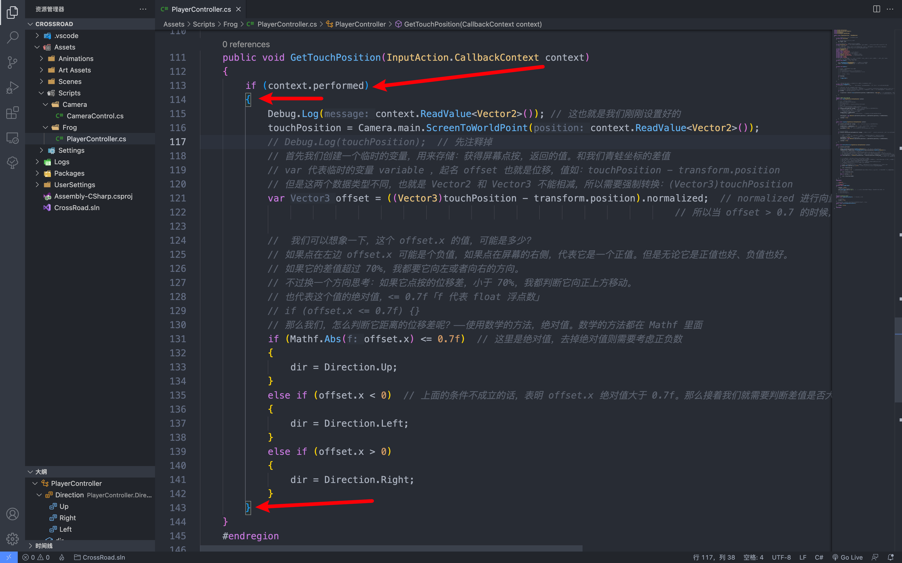

```cs {3-6}
public void GetTouchPosition(InputAction.CallbackContext context)
    {
        if (context.performed)
        {
            // ---snip---
        }
    }
```

## 8. 如何验证我们实现是否正确呢？

还记得我们怎么实现跳跃的吗？

在跳跃的时候，我们使用的是 `JumpAnimationEvent` 在这个代码里面，一旦变成 true，我们在 FixedUpdate 就检测到了，之后就可以跳跃了。

```cs {5}
public void JumpAnimationEvent()  // 跳跃的动画事件
    {
        // 改变状态
        isJump = true;
        Debug.Log(dir);
    }
```

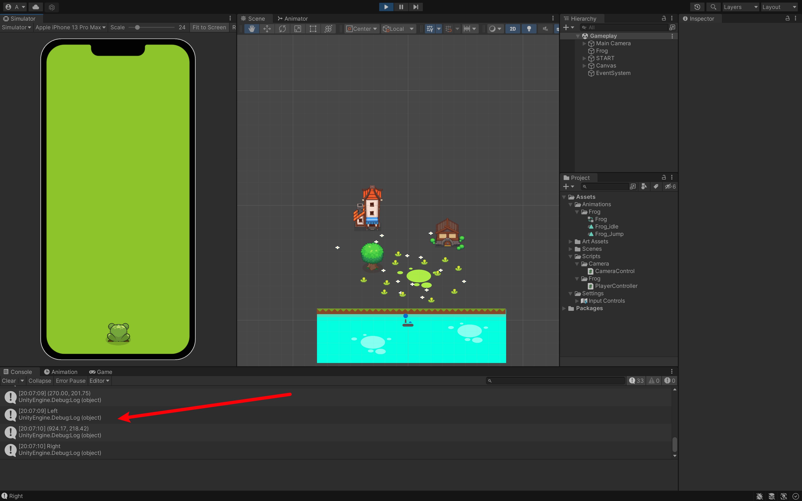

> 多角度测试看看。

## 9. 实现左右跳跃

现在我们实现了青蛙的世界坐标，获得了是要向左还是向右跳，那么我们需要给它一个具体的位移。向前我们设置的是 2.1，那么向左向右我们也设置成 2.1，或者长按的话，有一个大跳跃。也就是4.2。

那么我们要在哪里获得最终方向跳跃的位移值呢？

::: tabs

@tab 1

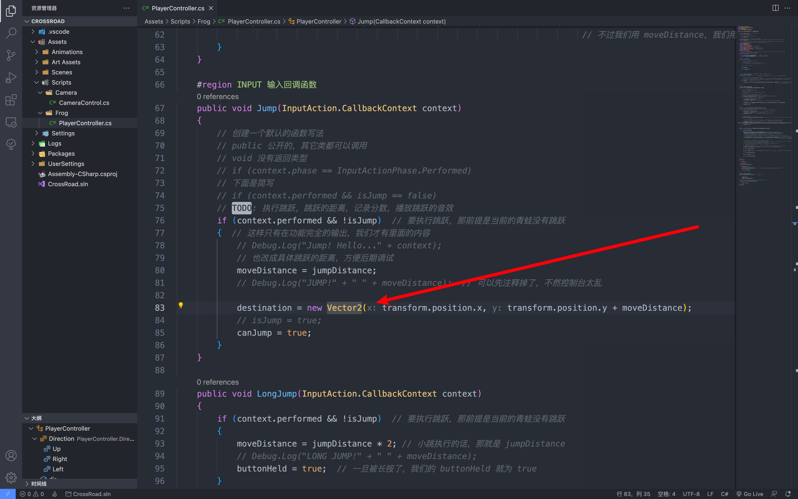

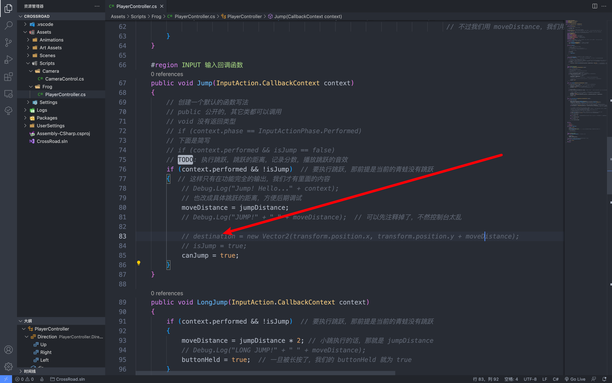

@tab 2

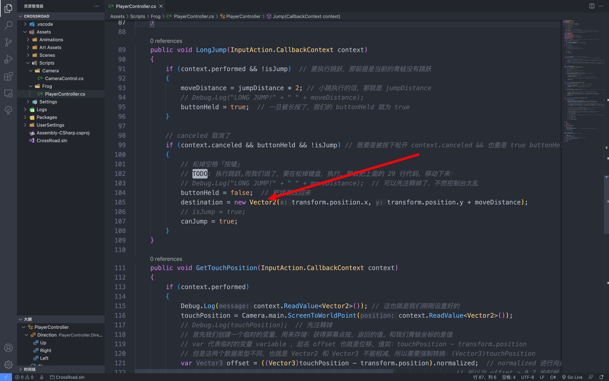

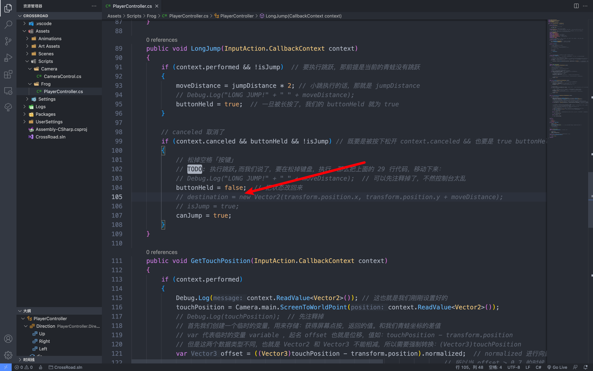

:::

::: code-tabs

@tab 注释掉代码1

```cs {8}
public void Jump(InputAction.CallbackContext context)
    {
        if (context.performed && !isJump)  // 要执行跳跃，那前提是当前的青蛙没有跳跃
        {
            moveDistance = jumpDistance;
            // Debug.Log("JUMP!" + " " + moveDistance);  // 可以先注释掉了，不然控制台太乱

            // destination = new Vector2(transform.position.x, transform.position.y + moveDistance);
            // isJump = true;
            canJump = true;
        }
    }
```

@tab 注释掉代码2

```cs {8}
public void LongJump(InputAction.CallbackContext context)
    {
        // --- snip---
        if (context.canceled && buttonHeld && !isJump) 
        {
            // --- snip---
            buttonHeld = false;  // 把状态改回来
            // destination = new Vector2(transform.position.x, transform.position.y + moveDistance);
            // isJump = true;
            canJump = true;
        }
    }
```

:::

所以，接下来是要根据青蛙移动的方向来做位移。

如果是向左向右的话，那就是操作 x。

::: code-tabs

@tab 1

```cs {6-14}
public void JumpAnimationEvent()  // 跳跃的动画事件
    {
        // 改变状态
        isJump = true;
        Debug.Log(dir);
        switch (dir)
        {
            case Direction.Up:
                break;
            case Direction.Right:
                break;
            case Direction.Left:
                break; 
        }
    }
```

@tab 2

```cs {9,12,15}
public void JumpAnimationEvent()  // 跳跃的动画事件
    {
        // 改变状态
        isJump = true;
        Debug.Log(dir);
        switch (dir)
        {
            case Direction.Up:
                destination = new Vector2(transform.position.x, transform.position.y + moveDistance);
                break;
            case Direction.Right:
                destination = new Vector2(transform.position.x + moveDistance, transform.position.y);
                break;
            case Direction.Left:
                destination = new Vector2(transform.position.x - moveDistance, transform.position.y);
                break; 
        }
    }
```

:::

现在你可以测试代码了。

现在你的青蛙就可以正常的左右移动了，虽然还没有动画。这是之后的事情。

## 10. 项目总结

我们除了控制方向以外，根据点按的位置，来切换动画。这也是今天的小作业。

那么，我们要切换动画，而我们使用的是 TriggerJump 来播放我们的跳跃动画。

```cs
private void TriggerJump()
    {
        canJump = false;
        //TODO:获得移动方向、播放动画
        anim.SetTrigger("Jump");  // 和在 unity 里面设置的参数名称一致才可以，大小写要一致
        // anim.SetBool();
        // anim.SetFloat();
        // anim.SetInteger(); 
    }
```

所以，我们在产生动画的时候，需要知道青蛙冲向哪个方面。

所以，在 TriggerJump 的时候，其实也是要根据 dir 的方向来切换方向。

这样的情况下，我们会写一个重复的 switch 语句。「和 JumpAnimationEvent 重复」

其实，你想想。我们是先执行 TriggerJump，还是先执行 JumpAnimationEvent？——显然是先执行 TriggerJump，然后再执行 JumpAnimationEvent。

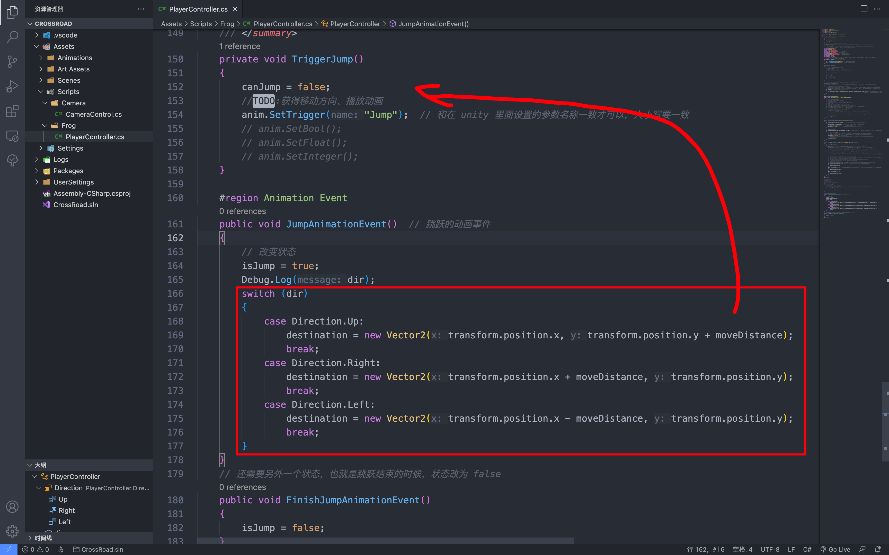

```cs {8-19, 32-43}
/// <summary>
    /// 触发执行跳跃动画
    /// </summary>
    private void TriggerJump()
    {
        canJump = false;
        //TODO:获得移动方向、播放动画
        switch (dir)
        {
            case Direction.Up:
                destination = new Vector2(transform.position.x, transform.position.y + moveDistance);
                break;
            case Direction.Right:
                destination = new Vector2(transform.position.x + moveDistance, transform.position.y);
                break;
            case Direction.Left:
                destination = new Vector2(transform.position.x - moveDistance, transform.position.y);
                break; 
        }
        anim.SetTrigger("Jump");  // 和在 unity 里面设置的参数名称一致才可以，大小写要一致
        // anim.SetBool();
        // anim.SetFloat();
        // anim.SetInteger(); 
    }

    #region Animation Event
    public void JumpAnimationEvent()  // 跳跃的动画事件
    {
        // 改变状态
        isJump = true;
        Debug.Log(dir);
        // switch (dir)
        // {
        //     case Direction.Up:
        //         destination = new Vector2(transform.position.x, transform.position.y + moveDistance);
        //         break;
        //     case Direction.Right:
        //         destination = new Vector2(transform.position.x + moveDistance, transform.position.y);
        //         break;
        //     case Direction.Left:
        //         destination = new Vector2(transform.position.x - moveDistance, transform.position.y);
        //         break; 
        // }
    }
    // 还需要另外一个状态，也就是跳跃结束的时候，状态改为 false
    public void FinishJumpAnimationEvent()
    {
        isJump = false;
    }
    #endregion
```

::: tip 作业

创建左右移动动画。

:::


欢迎关注我公众号：AI悦创，有更多更好玩的等你发现！

::: details 公众号：AI悦创【二维码】


:::

::: info AI悦创·编程一对一

AI悦创·推出辅导班啦，包括「Python 语言辅导班、C++ 辅导班、java 辅导班、算法/数据结构辅导班、少儿编程、pygame 游戏开发、Linux、Web全栈」，全部都是一对一教学：一对一辅导 + 一对一答疑 + 布置作业 + 项目实践等。当然，还有线下线上摄影课程、Photoshop、Premiere 一对一教学、QQ、微信在线，随时响应！微信：Jiabcdefh

C++ 信息奥赛题解，长期更新！长期招收一对一中小学信息奥赛集训，莆田、厦门地区有机会线下上门，其他地区线上。微信：Jiabcdefh

方法一：[QQ](http://wpa.qq.com/msgrd?v=3&uin=1432803776&site=qq&menu=yes)

方法二：微信：Jiabcdefh

:::


