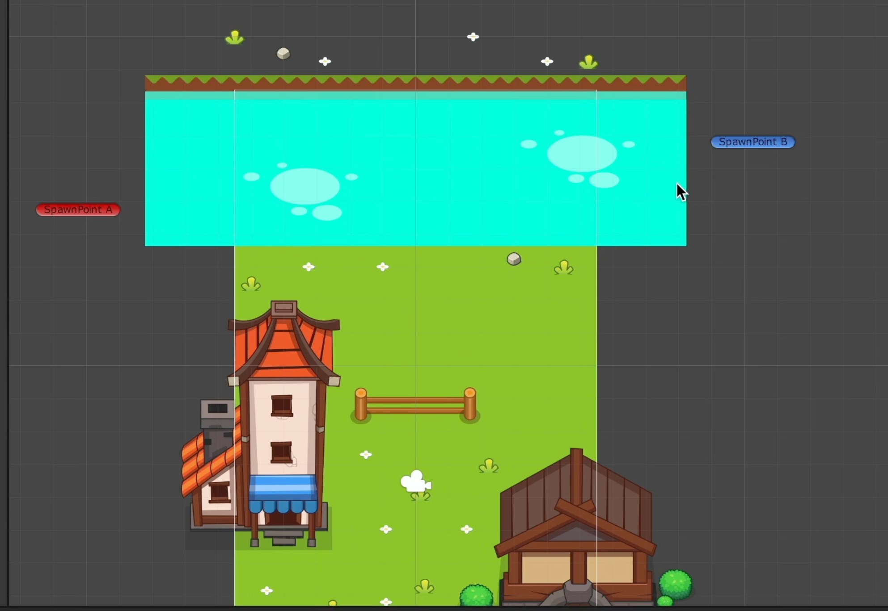
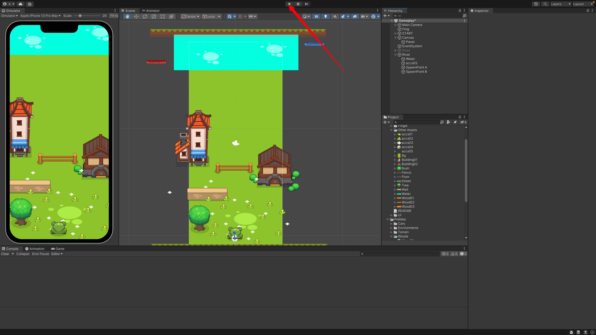
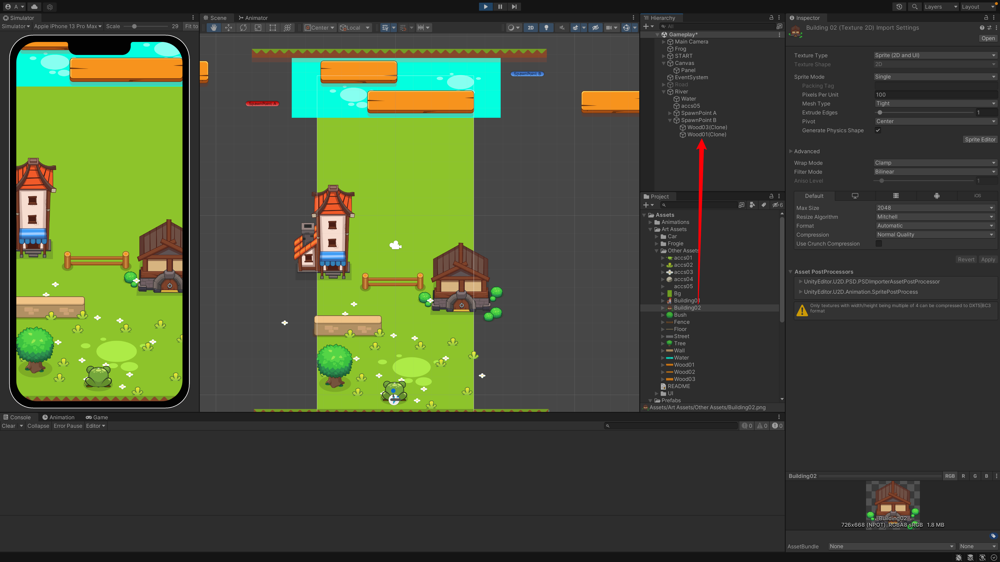
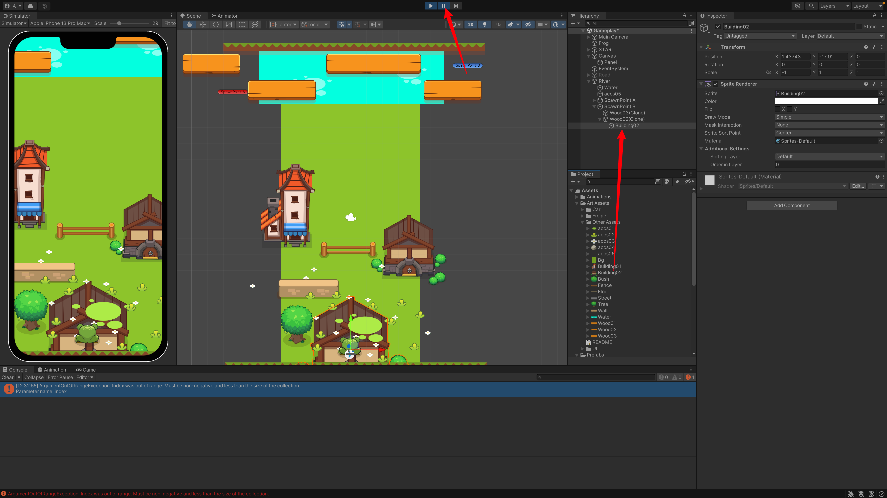
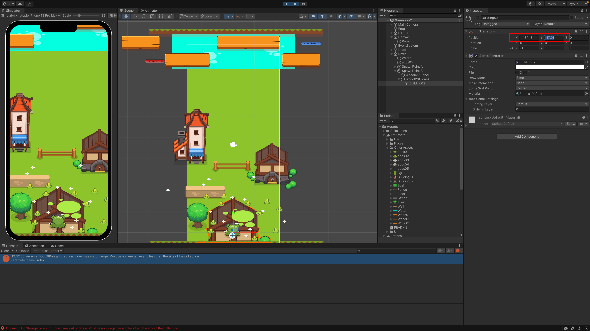
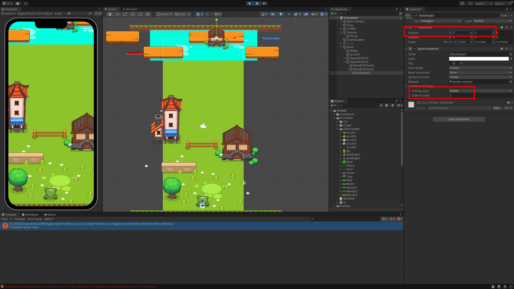
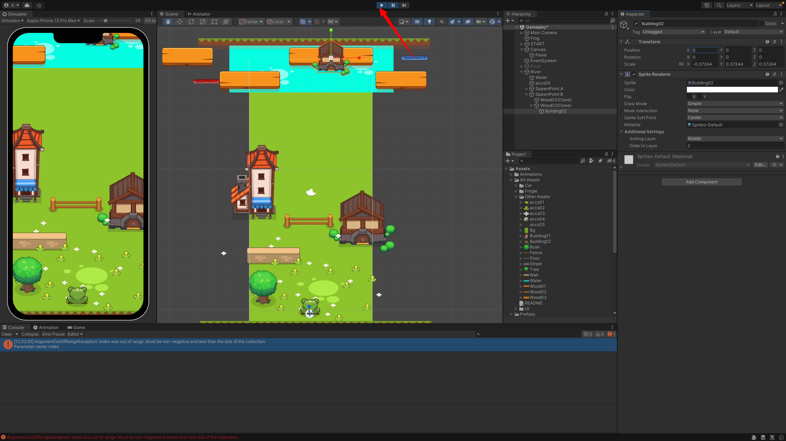
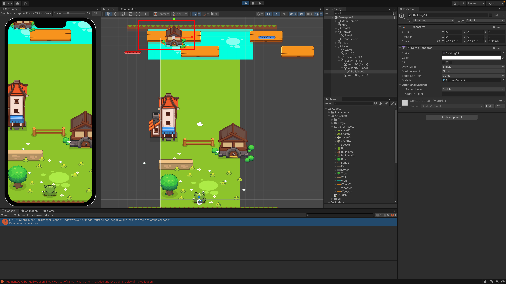

你好，我是悦创。

我们先布置一点花花草草：



## 1. 青蛙跟随木板移动

首先，我们如何实现一个物体跟着另一个物体移动。

一个物体成为另一个物体的子物体就可以实现跟随移动。

我们可以拖一个试一试：

::: tabs

@tab 1

先运行程序：



@tab 2


@tab 3



@tab 4



@tab 5



@tab 6



@tab 7



@tab 8



:::

## 2. 如何在代码中实现

```cs {7}
// filename: PlayerController.cs
if (hit.collider.CompareTag("Wood"))
{
    // TODO: 跟随木板移动
    Debug.Log("在木板上");
    // 所以最简单的是让青蛙跟随父级物体
    transform.parent = hit.collider.transform;  // 把青蛙的父级物体设为当前的碰撞，而我们上面已经判断了碰撞物体 Wood
}
```


欢迎关注我公众号：AI悦创，有更多更好玩的等你发现！

::: details 公众号：AI悦创【二维码】


:::

::: info AI悦创·编程一对一

AI悦创·推出辅导班啦，包括「Python 语言辅导班、C++ 辅导班、java 辅导班、算法/数据结构辅导班、少儿编程、pygame 游戏开发、Linux、Web全栈」，全部都是一对一教学：一对一辅导 + 一对一答疑 + 布置作业 + 项目实践等。当然，还有线下线上摄影课程、Photoshop、Premiere 一对一教学、QQ、微信在线，随时响应！微信：Jiabcdefh

C++ 信息奥赛题解，长期更新！长期招收一对一中小学信息奥赛集训，莆田、厦门地区有机会线下上门，其他地区线上。微信：Jiabcdefh

方法一：[QQ](http://wpa.qq.com/msgrd?v=3&uin=1432803776&site=qq&menu=yes)

方法二：微信：Jiabcdefh

:::


