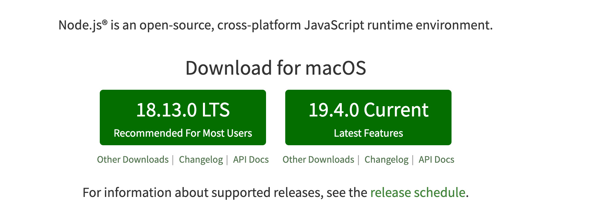
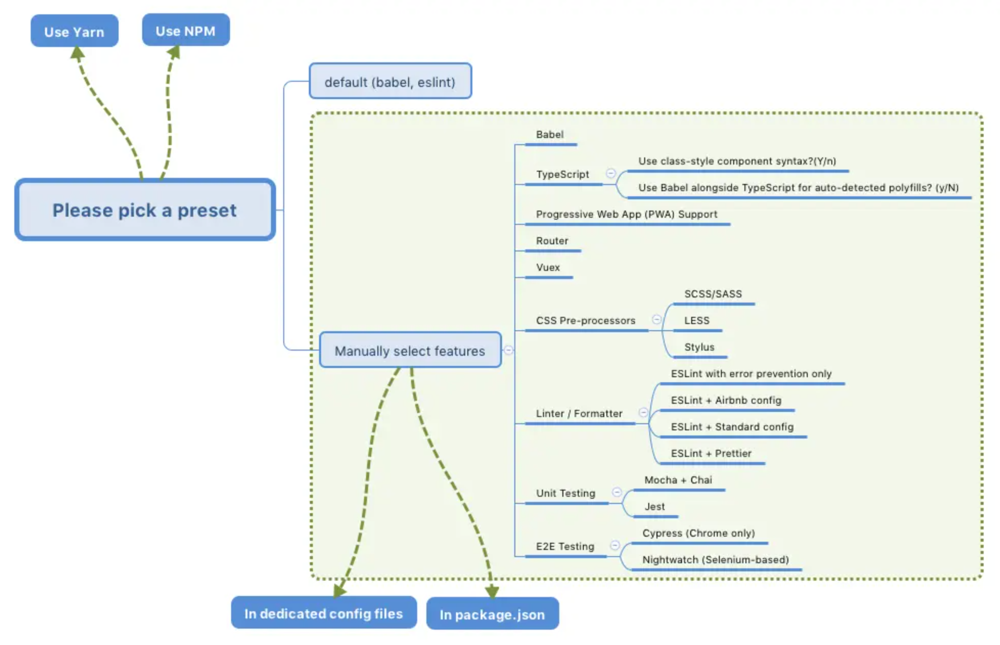
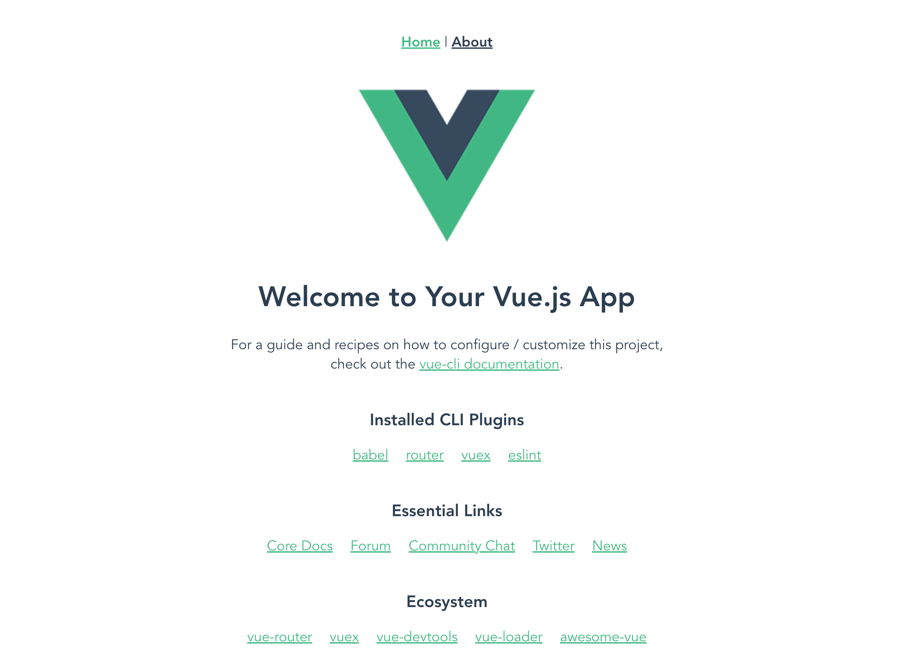

你好，我是悦创。

当你点进这个标题，开始阅读本章的时候，说明你对 `Vue.js` 是充满好奇心和求知欲的。我之前写过一篇文章，这样评价 Vue.js，称它是“**简单却不失优雅，小巧而不乏大匠**”的作品，正如其官网介绍的“易用，灵活和高效”那样。其实框架是 Vue.js 的本质，而真正了解它的人则会把它当成一件作品来欣赏。

Vue.js 作为一门轻量级、易上手的前端框架，从入门难度和学习曲线上相对其他框架来说算是占据优势的，越来越多的人开始投入 Vue.js 的怀抱，走进 Vue.js 的世界。那么接下来屏幕前的你不妨一起来和我从零开始构建一个 Vue 项目，体会一下 Vue.js 的精彩绝伦。

## 1. 依赖工具

在构建一个 Vue 项目前，我们先要确保你本地安装了 `Node` 环境以及包管理工具 `npm`，打开终端运行：

```shell
# 查看 node 版本
node -v

# 查看 npm 版本
npm -v
```

如果成功打印出版本号，说明你本地具备了 node 的运行环境，我们可以使用 npm 来安装管理项目的依赖，而如果没有或报错，则你需要去[ node 官网](https://nodejs.org/en/)进行 node 的下载及安装，如图：



左边的版本是推荐安装的稳定版本，也就是目前已经被正式列入标准的版本，而右边的版本是当前最新的版本，该版本包含了一些新的特性，还未被完全列入标准，可能以后会有所变动。这里建议大家安装最新的 node 稳定版进行开发。

## 2. 脚手架

当我们安装完 node 后便可以开始进行后续的构建工作了，那么这里我主要给大家介绍下最便捷的脚手架构建。

### 2.1 什么是脚手架

很多人可能经常会听到“脚手架”三个字，无论是前端还是后台，其实它在生活中的含义是为了保证各施工过程顺利进行而搭设的工作平台。因此作为一个工作平台，前端的脚手架可以理解为能够帮助我们快速构建前端项目的一个工具或平台。

### 2.2 vue-cli

其实说到脚手架，目前很多主流的前端框架都提供了各自官方的脚手架工具，以帮助开发者快速构建起自己的项目，比如 `Vue`、`React` 等，这里我们就来介绍下 Vue 的脚手架工具 `vue-cli`。

`vue-cli` 经历了几个版本的迭代，目前最新的版本是 3.x，也是本小册构建项目所使用的版本，我们一起来看下其人性化的构建流程：

#### a. 安装

我们可以在终端通过以下命令全局安装 vue-cli：

```shell
# 安装 Vue CLI 3.x
npm i -g @vue/cli
```

如果你习惯使用 `yarn`，你也可以：

```shell
# 没有全局安装 yarn 需执行此命令
npm i -g yarn
yarn global add @vue/cli
```

注意因为是全局安装，所以 `vue-cli` 是全局的包，它和我们所处的项目没有关系。同时我们这里介绍的 CLI 版本是最新的 `3.x`，它和 `2.x` 版本存在着很大的区别，具体的讲解会在后续章节中进行介绍。

#### b. 构建

安装完 `vue-cli` 后，我们在你想要创建的项目目录地址下执行构建命令：

```shell
# my-project 是你的项目名称
vue create my-project
```

执行完上述命令后，会出现一系列的选择项，我们可以根据自己的需要进行选择，流程图如下：



如果你只想构建一个基础的 Vue 项目，那么使用 `Babel`、`Router`、`Vuex`、`CSS Pre-processors` 就足够了，最后选择你喜欢的包管理工具 npm or yarn。

::: details 操作

```shell
➜  ~ cd GitHub/SourceCode
➜  SourceCode vue create my-project
?  Your connection to the default yarn registry seems to be slow.
   Use https://registry.npmmirror.com for faster installation? Yes


Vue CLI v5.0.8
? Please pick a preset: Manually select features
? Check the features needed for your project: Babel, Linter
? Choose a version of Vue.js that you want to start the project with
  3.x
❯ 2.x
➜  SourceCode vue create my-project


Vue CLI v5.0.8
? Please pick a preset: Manually select features
? Check the features needed for your project: Babel, Router, Vuex, CSS
Pre-processors, Linter
? Choose a version of Vue.js that you want to start the project with 3.x
? Use history mode for router? (Requires proper server setup for index fallback
in production) Yes
? Pick a CSS pre-processor (PostCSS, Autoprefixer and CSS Modules are supported
by default): Sass/SCSS (with dart-sass)
? Pick a linter / formatter config: Basic
? Pick additional lint features: Lint on save
? Where do you prefer placing config for Babel,
ESLint, etc.? In package.json
? Save this as a preset for future projects? Yes
? Save preset as:
? Pick the package manager to use when installing
dependencies: Yarn


Vue CLI v5.0.8
✨  Creating project in /Users/huangjiabao/GitHub/SourceCode/my-project.
🗃  Initializing git repository...
⚙️  Installing CLI plugins. This might take a while...

yarn install v1.22.19
info No lockfile found.
[1/4] 🔍  Resolving packages...
[2/4] 🚚  Fetching packages...
[3/4] 🔗  Linking dependencies...

success Saved lockfile.
✨  Done in 14.98s.
🚀  Invoking generators...
📦  Installing additional dependencies...

yarn install v1.22.19
[1/4] 🔍  Resolving packages...
[2/4] 🚚  Fetching packages...
[3/4] 🔗  Linking dependencies...
[4/4] 🔨  Building fresh packages...

success Saved lockfile.
✨  Done in 5.49s.
⚓  Running completion hooks...

📄  Generating README.md...

🎉  Successfully created project my-project.
👉  Get started with the following commands:

 $ cd my-project
 $ yarn serve

➜  SourceCode
```

:::

#### c. 启动

等待构建完成后你便可以运行命令来启动你的 Vue 项目：

```shell
# 打开项目目录
cd vue-project

# 启动项目
yarn serve

# or
npm run serve
```

需要注意的是如果启动的时候出现报错或者包丢失等情况，最好将 node 或者 yarn （如果使用）的版本更新到最新重新构建。

成功后打开浏览器地址：[http://localhost:8080/](https://link.juejin.cn/?target=http%3A%2F%2Flocalhost%3A8080%2F) 可以看到如下界面：



#### d. 目录结构

最后脚手架生成的目录结构如下：

```bash
├── node_modules     # 项目依赖包目录
├── public
│   ├── favicon.ico  # ico图标
│   └── index.html   # 首页模板
├── src 
│   ├── assets       # 样式图片目录
│   ├── components   # 组件目录
│   ├── views        # 页面目录
│   ├── App.vue      # 父组件
│   ├── main.js      # 入口文件
│   ├── router.js    # 路由配置文件
│   └── store.js     # vuex状态管理文件
├── .gitignore       # git忽略文件
├── .postcssrc.js    # postcss配置文件
├── babel.config.js  # babel配置文件
├── package.json     # 包管理文件
└── yarn.lock        # yarn依赖信息文件
```

根据你安装时选择的依赖不同，最后生成的目录结构也会有所差异。

## 3. 可视化界面

当然，除了使用上述命令行构建外，`vue-cli 3.x` 还提供了可视化的操作界面，在项目目录下我们运行如下命令开启图形化界面：

```shell
vue ui
```

之后浏览器会自动打开本地 `8000` 端口，页面如下：


欢迎关注我公众号：AI悦创，有更多更好玩的等你发现！

::: details 公众号：AI悦创【二维码】


:::

::: info AI悦创·编程一对一

AI悦创·推出辅导班啦，包括「Python 语言辅导班、C++ 辅导班、java 辅导班、算法/数据结构辅导班、少儿编程、pygame 游戏开发、Linux、Web全栈」，全部都是一对一教学：一对一辅导 + 一对一答疑 + 布置作业 + 项目实践等。当然，还有线下线上摄影课程、Photoshop、Premiere 一对一教学、QQ、微信在线，随时响应！微信：Jiabcdefh

C++ 信息奥赛题解，长期更新！长期招收一对一中小学信息奥赛集训，莆田、厦门地区有机会线下上门，其他地区线上。微信：Jiabcdefh

方法一：[QQ](http://wpa.qq.com/msgrd?v=3&uin=1432803776&site=qq&menu=yes)

方法二：微信：Jiabcdefh

:::


