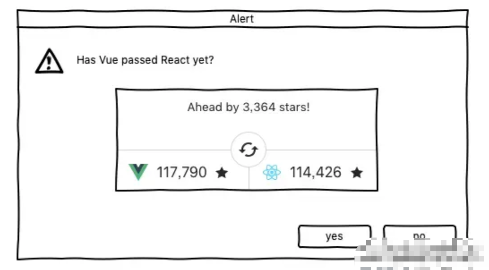
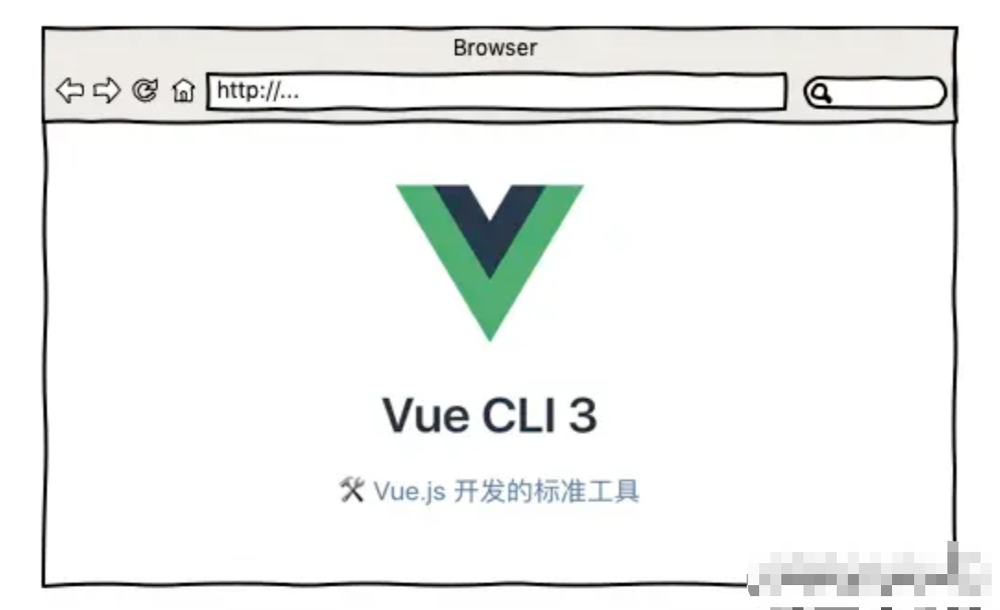

你好，我是悦创。

关于写作背景，随着 Vue 影响力的不断扩大，越来越多的开发者开始投入 Vue 的怀抱，这从 Vue 在 NPM 上下载量的增长速度可以看出，同时 Vue 在 github 上的 star 数已经超过 React 也验证了这一点。

::: center

:::

当然我们也不能以 star 数论天下，但是这在某种程度上体现了 Vue 的趋势和未来，而正因为这种趋势和未来使得使用 Vue 开发项目越来越流行，其易上手、门槛低的特点吸引了很多刚入门的前端投身其中。

虽然说国内 Vue 的用户群里比较庞大，但是在质量上可能往往会出现良莠不齐的现象。比如大多数学习 Vue 开发的工程师一般不会关注项目从哪里来，也就是项目的构建部分，同时在开发上也没有养成良好的开发习惯和编码风格，这会导致虽然功能没有问题，但后期维护起来却大有问题的情况。

以上也是为什么要写本专栏的原因，其实主要还是由两点构成：项目构建的必要性、项目开发的规范性。希望能够将自己在学习 Vue 过程中的心得和体会用最通俗易懂的方式分享给大家，使大家快速了解项目构建及开发的基本知识，少走不必要的弯路。

::: center

:::

## 你会学到什么？

- 基于 Vue CLI 3.x 项目构建的基础知识
- 常用的前端包管理工具及命令相关知识
- 使用脚手架构建的参数配置与注意事项
- webpack 在 Vue CLI 3.x 中的应用方式
- 单页及多页应用的构建方法
- Vue 项目开发技巧和代码优化相关知识
- Vue API 中实用但容易忽略的属性和方法
- 实用的 Vue 项目开发工具、第三方库及接口知识
- ...

## 适宜人群

- 有一定 Vue 基础的初中级前端开发工程师
- 想了解 Vue 构建及开发知识的互联网从业人员
- 对 Vue CLI 3.x 版本尚不了解的前端开发者
- 希望通过系统性的学习完善自己 Vue 项目构建和开发的朋友们

欢迎关注我公众号：AI悦创，有更多更好玩的等你发现！

::: details 公众号：AI悦创【二维码】

:::

::: info AI悦创·编程一对一

AI悦创·推出辅导班啦，包括「Python 语言辅导班、C++ 辅导班、java 辅导班、算法/数据结构辅导班、少儿编程、pygame 游戏开发、Linux、Web全栈」，全部都是一对一教学：一对一辅导 + 一对一答疑 + 布置作业 + 项目实践等。当然，还有线下线上摄影课程、Photoshop、Premiere 一对一教学、QQ、微信在线，随时响应！微信：Jiabcdefh

C++ 信息奥赛题解，长期更新！长期招收一对一中小学信息奥赛集训，莆田、厦门地区有机会线下上门，其他地区线上。微信：Jiabcdefh

方法一：[QQ](http://wpa.qq.com/msgrd?v=3&uin=1432803776&site=qq&menu=yes)

方法二：微信：Jiabcdefh

:::

