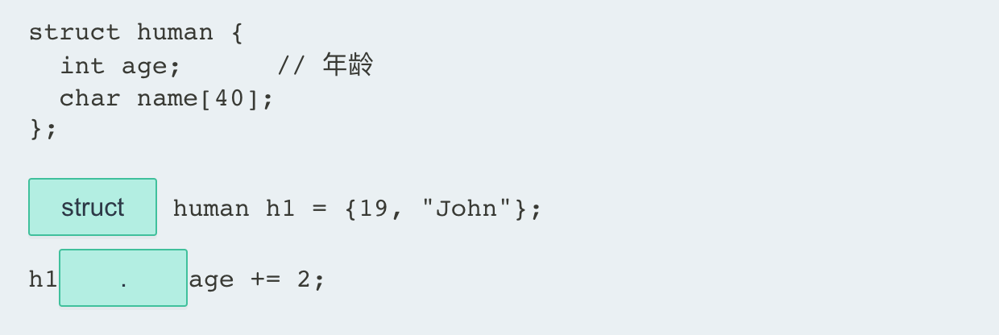
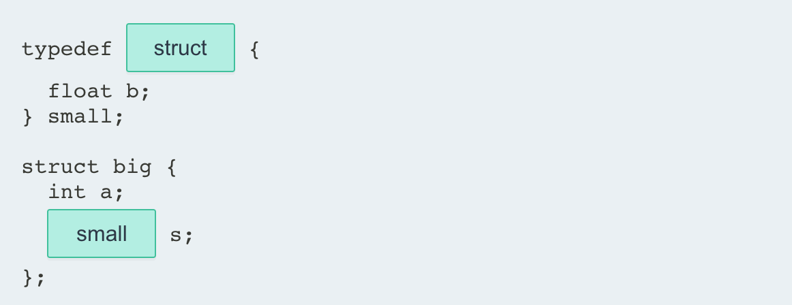

## 1. 结构体 struct

### 1.1 结构体

一个**结构体**( struct )是**用户自定义**的数据类型，将不同数据类型的相关变量组合在一起。

结构体的**声明**使用关键字 **struct**，以及带有变量声明列表的大括号 `{}`，称为**成员**。

**例如：**

```c
// 课程结构体
struct course {
    int id;                 // 课程 ID
    char title[40];      // 课程名
    float hours;        // 课程时长
}; 
```

该结构体语句定义了一个新数据类型 `course`，它有三个成员。 结构体成员可以是任何数据类型，包括基本类型、字符串、数组、指针，甚至其他结构，你将在后面的课程中学习。

::: warning

不要忘了在结构体声明后面加一个分号 `;`。 结构体也称为**复合**或**集合**数据类型。有些语言将结构体称为**记录**。

:::

- 填空，声明结构体 `human`:

```c
___human {
    int age;
    char name[40]; 
}
```

> struct
>
> ;

### 1.2 结构体变量的定义

要声明结构体数据类型的变量，请使用关键字 **struct**，后跟 struct 标记，然后变量名。

例如，下面的语句声明了一个结构数据类型，然后使用 **student** 结构来声明变量 **s1** 和 **s2**。

::: code-tabs

@tab Code

```c
#include <stdio.h>

struct student {
    int age;
    int grade;
    char name[40];
};

int main() {
    /* 声明结构体变量 */
    struct student s1;
    struct student s2;
    
    s1.age = 19;
    s1.grade = 9;
    sprintf(s1.name, "John Bighimer");
    
    s2.age = 22;
    s2.grade = 10;
    sprintf(s2.name, "Batman Jokerson");
    
    printf("Student: %s, %d\n", s1.name, s1.age);
    printf("Student: %s, %d\n", s2.name, s2.age);
    
    return 0;
}
```

@tab 注释

```c
#include <stdio.h>   // 包含标准输入输出库，为 printf 和 sprintf 函数提供支持

/* 定义结构体类型，描述学生信息 */
struct student {
    int age;           // 学生的年龄
    int grade;         // 学生的年级
    char name[40];     // 学生的名字，最大长度为 39 字符（因为最后一个字符是字符串终止符 '\0'）
};

int main() {
    /* 在 main 函数内部声明两个结构体变量 */
    struct student s1; // 第一个学生
    struct student s2; // 第二个学生
    
    /* 为第一个学生赋值 */
    s1.age = 19;                  // 设置年龄
    s1.grade = 9;                 // 设置年级
    sprintf(s1.name, "John Bighimer"); // 使用 sprintf 函数为名字赋值
    
    /* 为第二个学生赋值 */
    s2.age = 22;                  // 设置年龄
    s2.grade = 10;                // 设置年级
    sprintf(s2.name, "Batman Jokerson"); // 使用 sprintf 函数为名字赋值
    
    /* 打印两个学生的信息 */
    printf("Student: %s, %d\n", s1.name, s1.age); // 打印第一个学生的名字和年龄
    printf("Student: %s, %d\n", s2.name, s2.age); // 打印第二个学生的名字和年龄
    
    return 0;  // 主函数结束，返回 0
}
```

:::

::: warning

一个结构体变量存储在一个**连续**的内存块中。必须使用 **sizeof** 操作符来获取结构体所需的字节数，就像使用基本数据类型一样。

:::

1. 填空，声明一个结构体变量 `h1`:

```c
struct human {
    int age;
    char name[40];
};
___ human h1;
```

> struct

### 1.3 声明结构体变量

结构体变量也可以在声明中进行初始化，在大括号 `{}` 内按顺序列出初始值：

```c {11, 12}
#include <stdio.h>

struct student {
    int age;
    int grade;
    char name[40];
};

int main() {
    /* declare two variables */
    struct student s1 = {19, 9, "John Birghimer"};
    struct student s2 = {22, 10, "Batman Jokerson"};
    
    printf("Student: %s, %d\n", s1.name, s1.age);
    printf("Student: %s, %d\n", s2.name, s2.age);
    
    return 0;
}
```

如果你想在声明后使用大括号 `{}` 来初始化一个结构，则还需要写明**类型转换**，如以下语句所示：

```c {10, 12-13}
#include <stdio.h>

struct student {
    int age;
    int grade;
    char name[40];
};

int main() {
    struct student s1; // 声明结构体变量
    
    // 类型转换声明
    s1= (struct student){19, 9, "John Birghimer"};
    
    printf("Student: %s, %d\n", s1.name, s1.age);
    
    return 0;
}
```

你可以在初始化结构体变量时使用命名的成员来初始化相应的成员：

```c {10}
#include <stdio.h>

struct student {
    int age;
    int grade;
    char name[40];
};

int main() {
    struct student s1 = { .grade = 9, .age = 19, .name = "John Birghimer"};
    
    printf("Name: %s, Age: %d, Grade: %d\n", s1.name, s1.age, s1.grade);
    
    return 0;
}
```

在上面的例子中，`.grade` 指的是结构中的 `grade` 成员。同样地，`.age` 和 `.name` 指的是 `age` 和 `name` 成员。

- 填空，使用类型转换初始化 struct 变量 `h1`：

```c
struct human h1;
h1 = (___human) {19, "John"};
```

### 1.4 结构体变量的引用

可以通过在变量名和成员名之间使用点运算符`.`来访问结构体的成员变量。

例如，要给 **s1** 结构体变量的 **age** 成员赋值，可以使用如下语句：

```c
s1.age = 19;
```

你也可以把一个结构赋值给另一个同类型的结构。

```c {10-11,14}
#include <stdio.h>

struct student {
    int age;
    int grade;
    char name[40];
};

int main() {
    struct student s1 = {19, 9, "Jason"};
    struct student s2;
    
    printf("Assigning, s2 = s1\n");
    s2 = s1;
    
    printf("Results, Name: %s, Age: %d, Grade: %d\n", s2.name, s2.age, s2.grade);
    
    return 0;
}
```

下面的代码演示了使用一个结构：

```c
#include <stdio.h>
#include <string.h>

struct course {
    int id;
    char title[40];
    float hours;
};

int main() {
    struct course cs1 = {341279, "Intro to C++", 12.5};
    struct course cs2;

    /* 初始化 cs2 */
    cs2.id = 341281;
    strcpy(cs2.title, "Advanced C++");
    cs2.hours = 14.25;

    /* 打印成员信息 */
    printf("%d\t%s\t%4.2f\n", cs1.id, cs1.title, cs1.hours);
    printf("%d\t%s\t%4.2f\n", cs2.id, cs2.title, cs2.hours);

    return 0;
}
```

字符串赋值需要来自 `string.h` 库的 `strcpy()`。 还要注意格式指定符 `%4.2f` 包括宽度和精度选项。

- 填空，将变量 `h` 的年龄增加2岁：

```c
struct human {
  int age;      // 年龄
  char name[40];
};
___human h1 = {19, "John"}; 
h1___age += 2;
```

::: details Answer



:::

### 1.5 使用 typedef

**typedef** 关键字 创建一个类型定义，该定义可简化代码并使程序更易于阅读。

**typedef** 通常与结构体一起使用，因为它消除了在声明变量时使用关键字 struct 的需要。

例如:

```c {4-8,11-12}
#include <stdio.h>
#include <string.h>

typedef struct {
    int id;
    char title[40];
    float hours; 
} course;

int main() {
    course cs1;
    course cs2;

    cs1.id = 123456;
    strcpy(cs1.title, "JavaScript Basics");
    cs1.hours = 12.30;

    /* 初始化 cs2 */
    cs2.id = 341281;
    strcpy(cs2.title, "Advanced C++");
    cs2.hours = 14.25;
       
    /* 打印信息 */
    printf("%d\t%s\t%4.2f\n", cs1.id, cs1.title, cs1.hours);
    printf("%d\t%s\t%4.2f\n", cs2.id, cs2.title, cs2.hours);
  
    return 0;
}
```

注意，不再使用结构标签，而是在结构声明之前显示 typedef 名称。

现在，变量声明中不再需要使用 struct 一词，从而使代码更简洁，更易于阅读。

- 填空，使用 **typedef** 关键字声明"human"结构":

```c
___struct {
  int age;
  char name[40];
}___;
```

## 2. 结构体的妙用

### 2.1 结构体中的结构

一个结构体的成员也可以是结构体。 例如，考虑以下代码：

```c {3-6,8-11}
#include <stdio.h>

typedef struct {
  int x;
  int y;
} point;

typedef struct {
  float radius;
  point center;
} circle; 

int main() {
    point p;
    p.x = 3;
    p.y = 4;
    
    circle c;
    c.radius = 3.14;
    c.center = p;
    
    printf("Circle radius is %.2f, center is at (%d, %d)", c.radius, c.center.x, c.center.y);
  
    return 0;
}
```

嵌套的大括号 `{}` 用来初始化属于结构的成员。`.`  点运算符被两次用于访问成员的成员，如语句中:

```c {14-16}
#include <stdio.h>

typedef struct {
  int x;
  int y;
} point;

typedef struct {
  float radius;
  point center;
} circle; 

int main() {
    circle c = {4.5, {1, 3}};
    printf("%3.1f %d,%d", c.radius, c.center.x, c.center.y);
    /* 4.5  1,3 */
  
    return 0;
}
```

::: warning

一个结构体的定义必须先出现，然后才能在另一个结构体中使用。

:::

- 填空，定义一个 `small` 结构体类型，并在结构体 `big` 中将成员变量 `s` 声明为 `small` 类型：

```c
typedef ___{
    float b;
} small;

struct big {
    int a;
    ___s;
};
```

::: details Answer



:::

### 2.2 结构体指针

就像变量的指针一样，结构的指针也可以被定义。

```c
struct myStruct *struct_ptr;
```

定义了一个指向 *myStruct* 结构体的指针。

```c
struct_ptr = &struct_var;
```

将结构变量 `struct_var` 的地址存储在指针 `struct_ptr` 中。

```c
struct_ptr -> struct_mem;
```

访问结构成员 `struct_mem` 的值。

**例如：**

```c
#include <stdio.h>
#include <string.h>

// Student 结构体定义
struct student{
    char name[50];
    int number;
    int age;
};

// 结构体指针作为函数参数
void showStudentData(struct student *st) {
    printf("\nStudent:\n");
    printf("Name: %s\n", st->name);
    printf("Number: %d\n", st->number);
    printf("Age: %d\n", st->age);
}

int main() {
    // New Student Record Creation
    struct student st1;
    struct student st2;
    
    // Filling Student 1 Details
    strcpy(st1.name, "Krishna");
    st1.number = 5;
    st1.age = 21;
    
    // Filling Student 2 Details
    strcpy(st2.name, "Max");
    st2.number = 9;
    st2.age = 15;
    
    // Displaying Student 1 Details
    showStudentData(&st1);
    
    // Displaying Student 2 Details
    showStudentData(&st2);
    
    return 0;
}
```

`->` 操作符允许通过指针访问结构体的成员。

::: warning

`(*st).age` 与 `st->age` 相同。 同样，当使用 **typedef** 命名结构时，仅使用 typedef 名称以及 `*` 和指针名称来声明指针。

:::

【题目】填空，声明一个指向结构的指针并使用该指针访问结构成员 `y`：

```c
struct Point {
  int x;
  int y;
} p1;
struct Point ____ptr = &p1;
ptr->x = 3;
ptr____y = 4;
```

### 2.3 结构体作为函数参数

一个函数可以具有结构体参数，当仅需要结构变量的副本时，该结构体参数将按值接受参数。

要使函数更改 struct 变量中的实际值，则需要使用指针参数。

**例如：**

```c
#include <stdio.h>
#include <string.h>

typedef struct {
    int id;
    char title[40];
    float hours; 
} course;

void update_course(course *class);
void display_course(course class);

int main() {
    course cs2;
    update_course(&cs2);
    display_course(cs2);
    return 0;
}

void update_course(course *class) {
    strcpy(class->title, "C++ Fundamentals");
    class->id = 111;
    class->hours = 12.30;
}

void display_course(course class) {
    printf("%d\t%s\t%3.2f\n", class.id, class.title, class.hours);
}
```

正如你所见，`update_course()` 接受一个指针作为参数，而 `display_course()` 则按值接受该结构。

【题目】对于要更改 struct 变量中的实际值的函数：

A. 不需要参数

B. 指针参数是必需的

C. 数组参数是必需的

::: details Answer

B

:::

### 2.4 结构体数组

一个数组可以存储任何数据类型的元素，包括结构体。 

在声明了一个结构体数组后，可以用索引号访问一个元素。 

然后用 `.` 点运算符来访问该元素的成员，例如：

```c
#include <stdio.h>

typedef struct {
    int h;
    int w;
    int l;
} box;

int main() {
    box boxes[3] = {{2, 6, 8},
                    {4, 6, 6},
                    {2, 6, 9}};
    int k, volume;

    for (k = 0; k < 3; k++) {
        volume = boxes[k].h * boxes[k].w * boxes[k].l;
        printf("box %d volume %d\n", k, volume);
    }
    return 0;
}
```

结构体数组可用于复杂的数据结构，如l链表、二叉树等。

【题目】填空，声明一个 **point** 结构体和一个 **point** 结构体数组：

```c
___struct {
    int x;
    int y;
} point;
___points[3] = {{1, 2}, {3, 4}, {5, 6}};
```

> typedef
>
> point

## 3. 联合体 Union

### 3.1 联合体 Union

一个 **union** (联合体)允许在同一个内存位置存储不同的数据类型。

它就像一个结构，因为它有成员。然而，一个联合体变量为其所有成员使用同一个内存位置，并且每次只有一个成员可以占用该内存位置。

联合体的声明使用关键字 **union**，及一个 **union** 标签，以及大括号 `{ }` 和一个**成员的列表**。

联合体成员可以是任何数据类型，包括基本类型、字符串、数组、指针和结构。

**例如：**

```c {3-7}
#include <stdio.h>

union val {
    int int_num;
    float fl_num;
    char str[20];
};

int main() {
    union val test;
    test.int_num = 42;
    printf("%d", test.int_num);
    return 0;
}
```

在声明了一个联合体之后，你可以声明联合体变量。你甚至可以将一个联合体赋值给另一个相同类型的联合体。

```c {10,11}
#include <stdio.h>

union val {
    int int_num;
    float fl_num;
    char str[20]; 
};

int main() {
    union val u1;
    union val u2;
    u1.int_num = 42;
    u2 = u1;
    printf("%d", u2.int_num);
    return 0;
}
```

联合体主要用于**内存管理**。最大的成员数据类型被用来确定要共享的内存大小，然后所有成员都使用这一个位置。

这个过程也有助于限制内存碎片的产生。 内存管理将在后面的课程中讨论。

【题目】填空，声明一个联合体：

```c
___val {
    int int_num;
    float fl_num;
    char str[20]; 
___
```

> union
>
> };

### 3.2 访问联合体成员

你可以通过使用 `.` 点运算符访问联合体变量的成员。点运算符 `.` 在变量名和成员名之间。

当执行赋值时，内存位置将用于该成员，直到执行另一个成员赋值。

试图访问一个不占用内存位置的成员，会得到**意想不到**的结果。

下面的程序演示了访问联合体成员的过程：

::: code-tabs

@tab Code1

```c
#include <stdio.h>

union val {
    int int_num;
    float fl_num;
    char str[20];
};

int main() {
    union val test;

    test.int_num = 123;
    test.fl_num = 98.76;
    strcpy(test.str, "hello");

    printf("%d\n", test.int_num);
    printf("%f\n", test.fl_num);
    printf("%s\n", test.str);
    return 0;
}

```

@tab Code2

```c
#include <stdio.h>
#include <string.h>

union val {
    int int_num;
    float fl_num;
    char str[20];
};

int main() {
    union val test;

    // 赋值并打印int_num
    test.int_num = 123;
    printf("After int_num = 123:\n");
    printf("int_num: %d\n", test.int_num);

    // 赋值并打印fl_num
    test.fl_num = 98.76;
    printf("After fl_num = 98.76:\n");
    printf("fl_num: %f\n", test.fl_num);

    // 赋值并打印str
    strcpy(test.str, "hello");
    printf("After str = \"hello\":\n");
    printf("str: %s\n", test.str);

    return 0;
}
```


:::

最后的赋值会覆盖之前的赋值，这就是为什么 **str** 会存储一个值，而访问 **int_num** 和 **fl_num** 则没有意义。

【题目】填空，声明联合体 `val` 并访问它的成员变量：

```c
___val {
  int int_num;
  float fl_num; 
};
union val test;
___int_num = 123;
test.fl_num = 98.76;
```

> union
>
> test.

### 3.3 结构体中的联合体

联合体 (union) 经常在结构体 (struct) 中使用，因为结构体中可以有一个成员来跟踪联合体当前存储了那个成员变量的值。

例如，在下面的程序中，一个车辆结构体 `vehicle` 要么使用车辆识别码（VIN），要么使用分配的 ID，但不能同时使用：

```c
#include <stdio.h>
#include <string.h>

typedef struct {
    char make[20];
    int model_year;
    int id_type; /* 0 for id_num, 1 for VIN */
    union {
        int id_num;
        char VIN[20];
    } id;
} vehicle;

int main() {
    vehicle car1;
    strcpy(car1.make, "Ford");
    car1.model_year = 2017;
    car1.id_type = 0;
    car1.id.id_num = 123098;

    printf("Car %s, %d", car1.make, car1.model_year);

    return 0;
}
```

请注意，该联合体在结构体内部声明。这样做时，声明的末尾需要一个联合体名。

一个带有 union 标签的 union 可以在结构体外声明，但由于有这样一个特定的用途，结构体内的 union 提供了更容易理解的代码。

还要注意的是，`. ` 点运算符使用了两次，以访问结构体成员的联合体成员。

`id_type` 跟踪了当前联合体存储那个具体哪个成员的值。以下语句显示 `car1` 数据，并使用 `id_type` 确定要读取的联合成员：

::: code-tabs

@tab Code1

```python
/* display vehicle data */
printf("Make: %s\n", car1.make);
printf("Model Year: %d\n", car1.model_year);
if (car1.id_type == 0)
  printf("ID: %d\n", car1.id.id_num);
else
  printf("ID: %s\n", car1.id.VIN); 
```

@tab Code2

```python
#include <stdio.h>
#include <string.h>

typedef struct {
  char make[20];
  int model_year;
  int id_type; /* 0 for id_num, 1 for VIN */
  union {
    int id_num;
    char VIN[20]; 
  } id;
} vehicle;

int main() {  
  vehicle car1;
  strcpy(car1.make, "Ford");
  car1.model_year = 2017;
  car1.id_type = 0;
  car1.id.id_num = 123098;
  
  printf("Make: %s\n", car1.make);
  printf("Model Year: %d\n", car1.model_year);
  if (car1.id_type == 0)
    printf("ID: %d\n", car1.id.id_num);
  else
    printf("ID: %s\n", car1.id.VIN);

  return 0;
}
```

:::

> 一个联合体也可以包含一个结构体。

填空，声明 `person` 结构体并包含一个联合体成员：

```c
___ person {
  int age;
  char name[40];
  ___ {
    int id_num;
    char text[20]; 
  } passport;
};
```

::: details Answer

```c
struct
union
```

:::


## 4. 联合体的妙用

### 4.1 联合体指针

指向联合体的指针指向了分配给联合体的内存位置。

通过使用关键字 **union** 和 **union 标签**以及 `*` 和指针名来声明联合体指针。

例如，考虑下面的语：

::: code-tabs

@tab Code1

```c
union val {
  int int_num;
  float fl_num;
  char str[20]; 
};

union val info;
union val *ptr = NULL;
ptr = &info;
ptr->int_num = 10;
printf("info.int_num is %d", info.int_num); 
```

@tab Code2

```c
#include <stdio.h>
#include <string.h>

union val {
  int int_num;
  float fl_num;
  char str[20]; 
};

int main() {  
  union val info;
  union val *ptr = NULL;
  ptr = &info;
  ptr->int_num = 10;
  printf("info.int_num is %d", info.int_num);
  
  return 0;
}
```

:::

当你想通过一个指针访问联合体成员时，需要使用 `->` 操作符。

> `(*ptr).int_num` 与 `ptr->int_num` 作用相同。

填空，声明一个指向联合体 `info` 的指针:

```c
___ val {
  int int_num;
  float fl_num;
};

union val info;
union val ___ ptr = ___ info;
```

::: details Answer

union

`*`

`&`

:::

### 4.2 联合体作为函数参数

一个函数可以具有联合体参数，当需要联合体变量的副本时，该参数可以按值接受参数。

函数要更改联合体存储位置中的实际值，需要使用指针参数。

**例如：**

::: code-tabs

@tab Code1

```c
union id {
  int id_num;
  char name[20]; 
};

void set_id(union id *item) {
  item->id_num = 42;
}

void show_id(union id item) {
  printf("ID is %d", item.id_num);
} 
```

@tab Code2

```c
#include <stdio.h>
#include <string.h>

union id {
  int id_num;
  char name[20]; 
};

void set_id (union id *item);
void show_id (union id item);

int main() {  
  union id item;
  
  set_id(&item);  
  show_id(item);

  return 0;
}

void set_id(union id *item) {
    item->id_num = 42;
}

void show_id(union id item) {
    printf("ID is %d", item.id_num);
}
```


:::

填空，声明一个带有联合体参数并输出成员 `id_num` 值的函数:

```c
union passport {
  int id_num;
  char text[20];
};

void show(___ passport p) {
  printf("ID is %d", ___.id_num);
  }
```

> union
>
> p

### 4.3 联合体数组

数组可以存储任何数据类型的元素，包括联合体。

使用联合体时，请记住，联合体中只有一个成员可以存储每个数组元素的数据，这一点很重要。

在声明了一个联合体的数组后，一个元素可以用索引号来访问。然后用`.`点运算符来访问联合体的成员，如下所示：

::: code-tabs

@tab Code1

```c
union val {
  int int_num;
  float fl_num;
  char str[20]; 
};

union val nums[10];
int k;

for (k = 0; k < 10; k++) {
  nums[k].int_num = k;
}

for (k = 0; k < 10; k++) {
  printf("%d  ", nums[k].int_num);
} 
```

@tab Code2

```c
#include <stdio.h>

union val {
  int int_num;
  float fl_num;
  char str[20]; 
};

int main() {  
  union val nums[10];
  int k;
  
  /* create an array of ints */
  for (k = 0; k < 10; k++) {
    nums[k].int_num = k;
  }
  
  /* display array values */
  for (k = 0; k < 10; k++) {
    printf("%d  ", nums[k].int_num);
  }
  
  return 0;
}
```


:::

数组是一种数据结构，用于存储所有**相同类型**的集合值。联合体的数组则允许存储**不同类型**的值。

**例如：**

::: code-tabs

@tab Code1

```c
union type {
  int i_val;
  float f_val;
  char ch_val;
};
union type arr[3];
arr[0].i_val = 42;
arr[1].f_val = 3.14;
arr[2].ch_val = 'x'; 
```

@tab Code2

```c
#include <stdio.h>

union type {
  int i_val;
  float f_val;
  char ch_val;
};

int main() {
  union type arr[3];
  arr[0].i_val = 42;
  arr[1].f_val = 3.14;
  arr[2].ch_val = 'x';
  printf("1st element is %d, 2nd is %f, and the 3rd is %c", arr[0].i_val, arr[1].f_val, arr[2].ch_val);
  
  return 0;
}
```


:::

填空，声明一个联合体数组并访问第一个元素成员：

```c
union test {
  int int_num;
  float fl_num;
};
___ test nums[2];
nums[0] ___int_num = 42;
```

> union
>
> `.`


## 5. 小测验

### 5.1 练习-1

填空，声明一个具有两个成员（`minutes` 和 `hours`）的 `time` 结构体：

```c
___time {
  int minutes;
  int hours;
  ___;
```

> struct
>
> }

### 5.2 练习-2

填空，声明一个结构体类型 `shape` 和一个该类型的变量。

```c
___struct {
  int width;
  int height;
} shape;

___sh;
sh.width = 3;
sh.height = 4;
```

> typedef
>
> shape

### 5.3 练习-3

填空，声明一个指向结构变量 `ship` 的指针并访问其成员。

```c
struct ship {
  int x;
  int y;
} sh1;
___ ship *ptr = ___ sh1;
ptr->x = 3;
ptr ___ y = 4;
```

> `struct`
>
> `&`
>
> `->`

```c
struct ship {
  int x;
  int y;
} sh1;

struct ship *ptr = &sh1; // 将 ptr 指向 sh1 的地址
ptr->x = 3; // 通过 ptr 指针访问 sh1 的 x 成员并赋值为 3
ptr->y = 4; // 通过 ptr 指针访问 sh1 的 y 成员并赋值为 4
```


### 5.4 练习-4

填空，声明一个包含一个整数、一个浮点数和一个 char 的联合体。 然后，声明一个联合体变量并初始化其成员 `c_val`。

```c
___values {
  int i_val;
  float f_val;
  char c_val;
};
union ___ val;
___.c_val = 'a';
```

> union
>
> values
>
> val

### 5.5 练习-5

填空，声明一个联合体数组，并访问其成员。

```c
___values {
  int i_val;
  float f_val;
  char c_val;
};
union ___ nums[3];
nums[0].i_val = 42;
___[1].f_val = 3.14;
nums[2].c_val = 'f';
```

> union
>
> values
>
> nums


- [ ] 为什么点不能实现 `class->id = 111;`


::: details 公众号：AI悦创【二维码】


:::

::: info AI悦创·编程一对一

AI悦创·推出辅导班啦，包括「Python 语言辅导班、C++ 辅导班、java 辅导班、算法/数据结构辅导班、少儿编程、pygame 游戏开发、Linux、Web、Sql」，全部都是一对一教学：一对一辅导 + 一对一答疑 + 布置作业 + 项目实践等。当然，还有线下线上摄影课程、Photoshop、Premiere 一对一教学、QQ、微信在线，随时响应！微信：Jiabcdefh

C++ 信息奥赛题解，长期更新！长期招收一对一中小学信息奥赛集训，莆田、厦门地区有机会线下上门，其他地区线上。微信：Jiabcdefh

方法一：[QQ](http://wpa.qq.com/msgrd?v=3&uin=1432803776&site=qq&menu=yes)

方法二：微信：Jiabcdefh

:::


