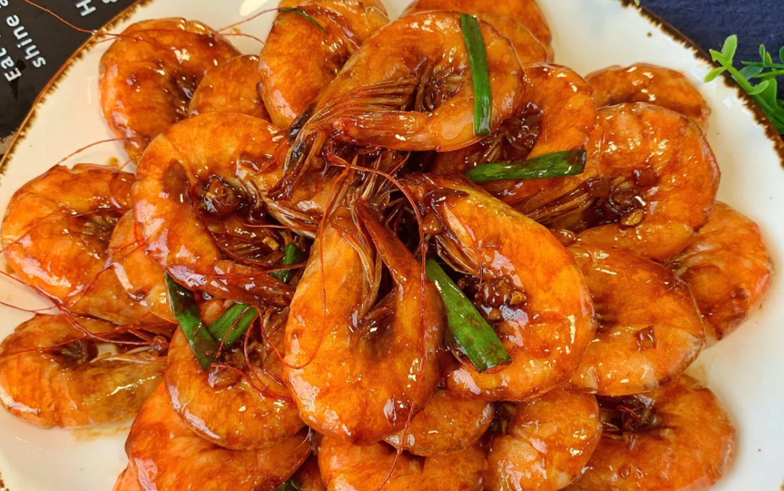
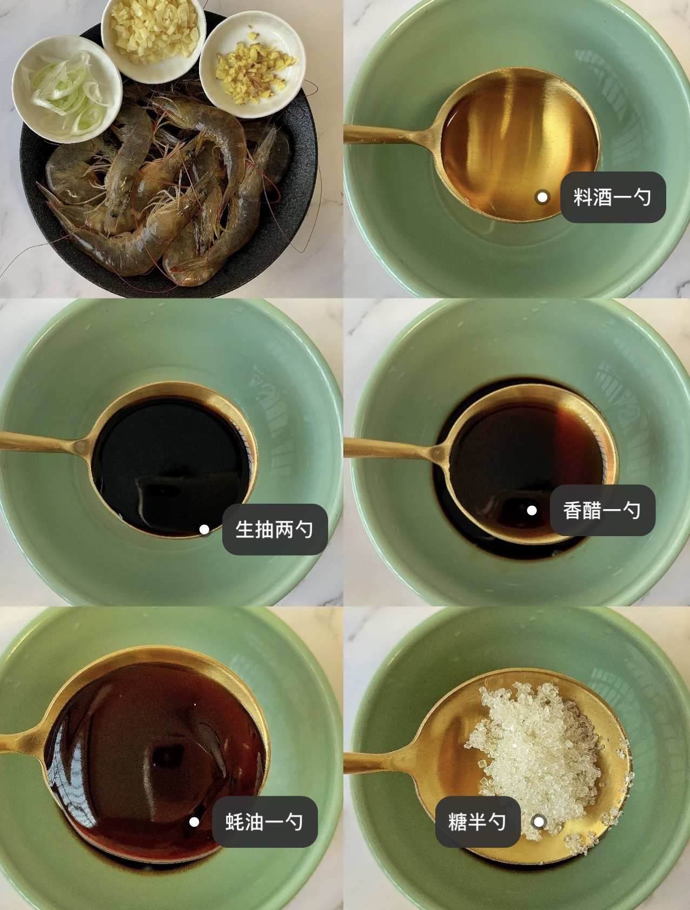
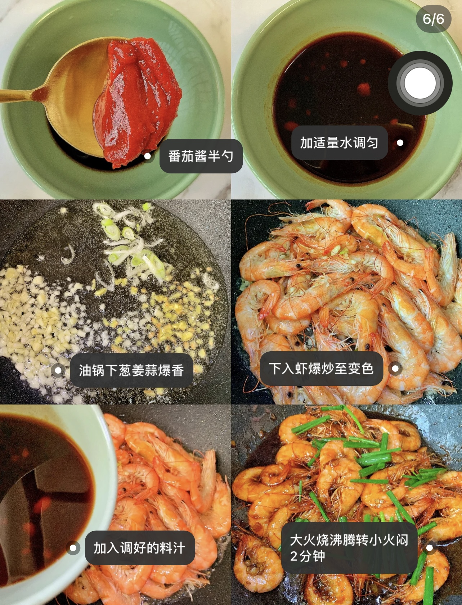

## 10分钟快手家常菜🔥油门大虾‼️好吃到哭

::: tabs

@tab 成品

@tab 菜谱1

@tab 菜谱2

:::

🌈🌈晚上是神兽回归的时候，也是找妈妈要吃饭的时候，这就非常考验妈妈的厨艺啦！

一道超好吃的油焖大虾分享给大家🌸简单易做❗️米饭配大虾连吃两碗都吃不够～

🌺食材🌺

处理好的鲜虾一斤、葱、姜、蒜

🌸做法🌸

1⃣️两勺生抽➕一勺料酒➕一勺蚝油➕一勺香醋➕半勺白糖➕半勺番茄酱➕适量清水搅拌均匀备用

2⃣️油锅放油爆香葱、姜、蒜，倒入处理好的虾，翻炒至变色，倒入料汁，大火烧开，转小火闷煮2分钟，开盖撒入小葱段即可盛出装盘😋

## 食材

1. 虾🦐
2. 大葱
3. 大蒜🧄「切沫」
4. 生姜「切沫」
5. 料酒
6. 生抽
7. 香醋
8. 蚝油
9. 糖
10. 蕃茄酱
11. 水

## 步骤

### 1. 调一碗酱汁

1. 料酒一勺
2. 生抽两勺
3. 香醋一勺
4. 蚝油一勺
5. 糖半勺
6. 蕃茄酱半勺
7. 加适量的水，调均匀

### 2. 翻炒

1. 油锅，下：葱姜蒜爆香
2. 下入虾🦐爆炒至变色
3. 加入调好的料汁
4. 大火烧沸腾，转小火焖 2min

欢迎关注我公众号：AI悦创，有更多更好玩的等你发现！

::: details 公众号：AI悦创【二维码】

:::

::: info AI悦创·编程一对一

AI悦创·推出辅导班啦，包括「Python 语言辅导班、C++ 辅导班、java 辅导班、算法/数据结构辅导班、少儿编程、pygame 游戏开发、Linux、Java」，全部都是一对一教学：一对一辅导 + 一对一答疑 + 布置作业 + 项目实践等。当然，还有线下线上摄影课程、Photoshop、Premiere 一对一教学、QQ、微信在线，随时响应！微信：Jiabcdefh

C++ 信息奥赛题解，长期更新！长期招收一对一中小学信息奥赛集训，莆田、厦门地区有机会线下上门，其他地区线上。微信：Jiabcdefh

方法一：[QQ](http://wpa.qq.com/msgrd?v=3&uin=1432803776&site=qq&menu=yes)

方法二：微信：Jiabcdefh

:::

