## 1. 食材

| 食材名称 |      |
| -------- | ---- |
| 鲤鱼     | 盐   |
| 白酒     | 水   |
| 油       | 白糖 |
| 八角     | 花椒 |
| 干辣椒   | 姜   |
| 大葱     | 蒜   |
| 花雕酒   | 酱油 |
| 胡椒粉   | 醋   |

## 2. 步骤

:::: tabs

@tab Step1

去掉鱼嗓子眼的部位「鱼牙」

::: center

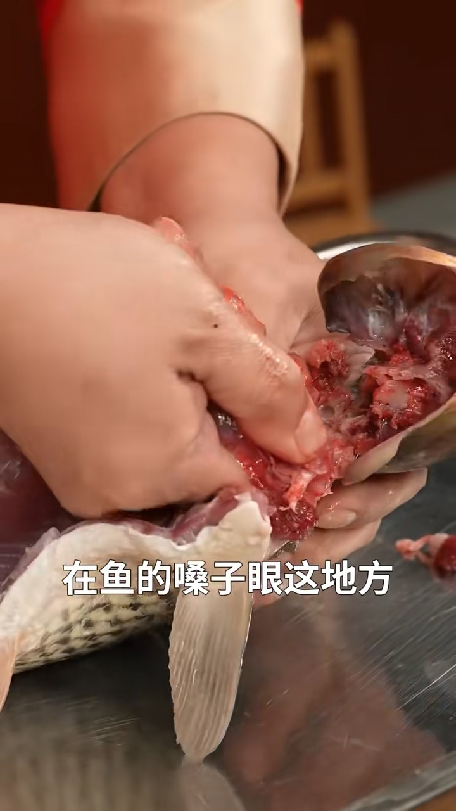

:::

@tab Step2

盐撒在鱼皮表面

::: center

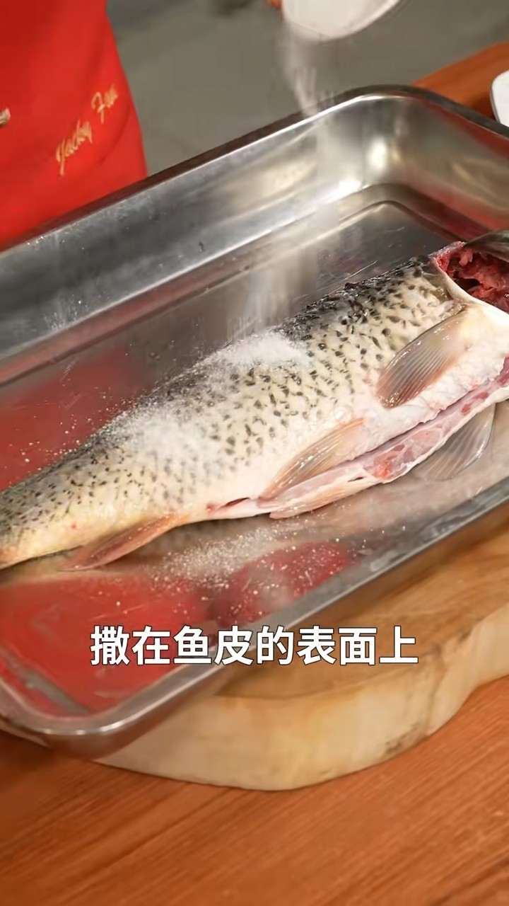

:::

盐可以增大摩擦，白酒可以挥发腥味。去除掉鱼表面的粘液，鱼肚子里面也用盐酒的混合搓一搓。

@tab Step3

用水冲洗干净

::: center

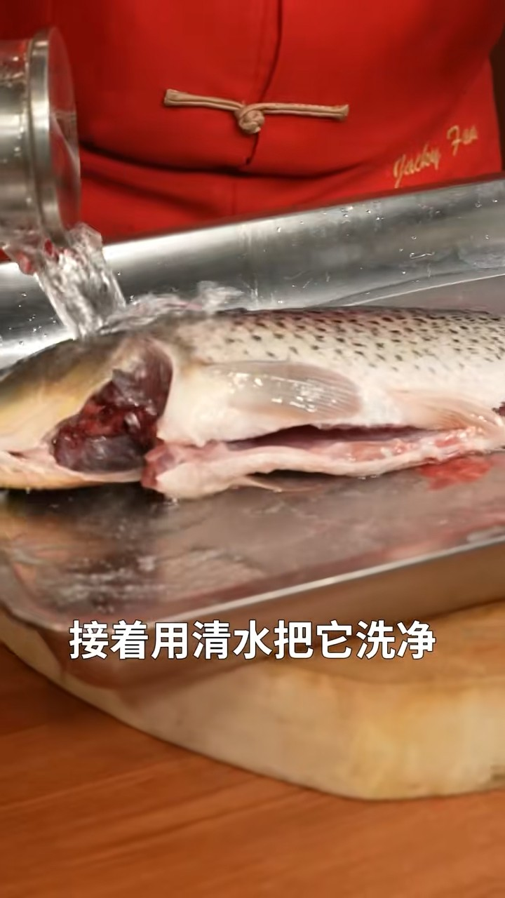

:::

@tab Step4

**切花刀**

斜 45 度切进去，深及鱼骨。每五公分一刀，一直切到鱼尾。

::: center

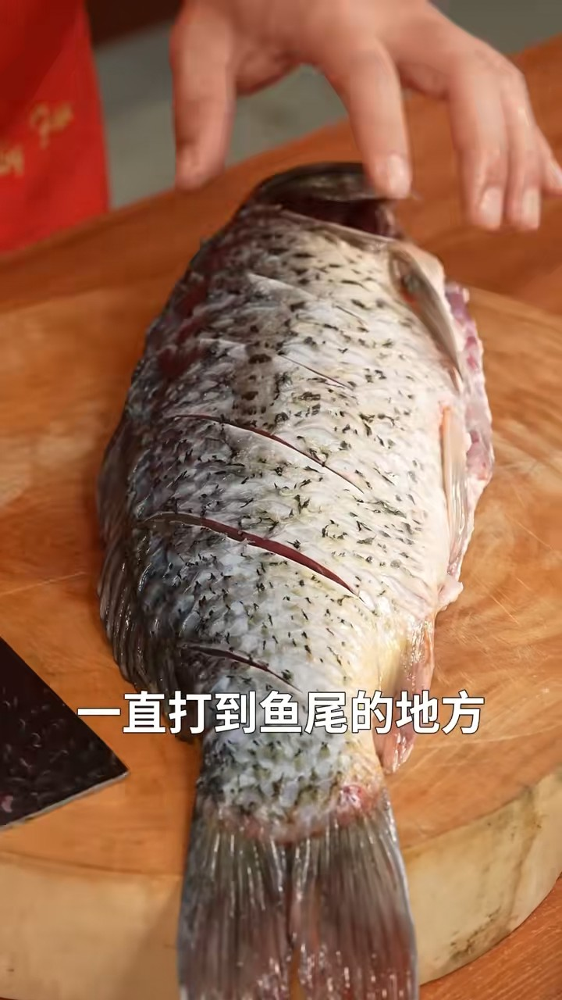

:::

> 两面都要

@tab Step5

剪鱼尾「做燕尾造型」

::: center

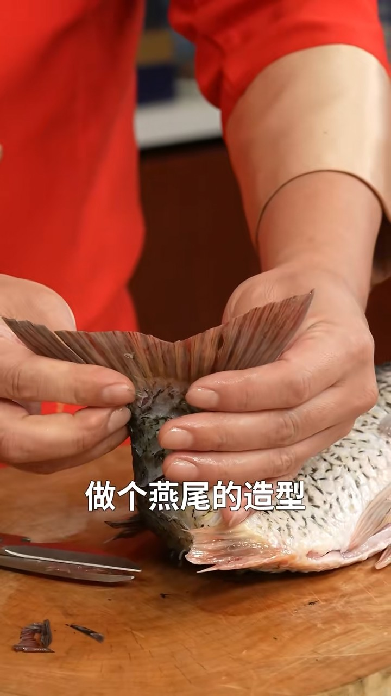

:::

@tab Step6

油，润满锅底即可

::: center

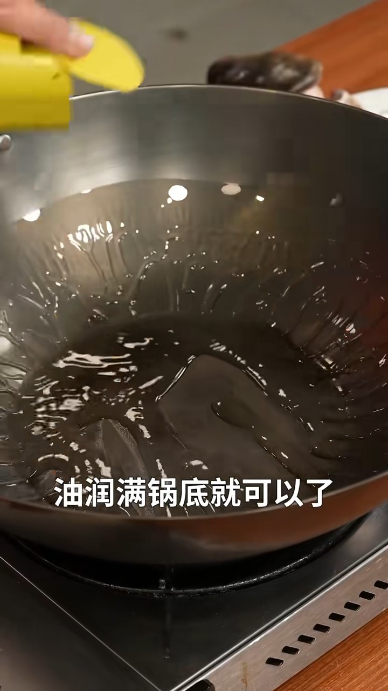

:::

@tab Step7

盐，撒匀锅底。盐立在锅底，形成一个托举层，把鱼可以拖起来，这样鱼就不粘锅

::: center

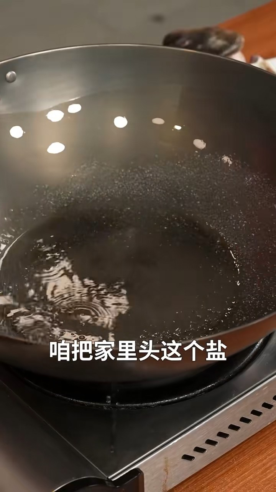

:::

@tab Step8

油温冒烟的状态，6～7成热直接下鱼，刚下锅的时候别动鱼🐟让鱼定型定型

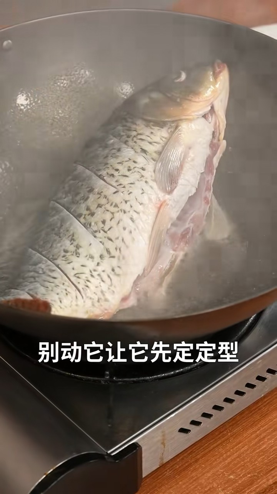

::::

:::: tabs

@tab Step9

转一转锅，让鱼在锅里均匀受热。一面定住了，煎另外一面；煎到两面均匀后、定型，关火🔥出锅。

::: center

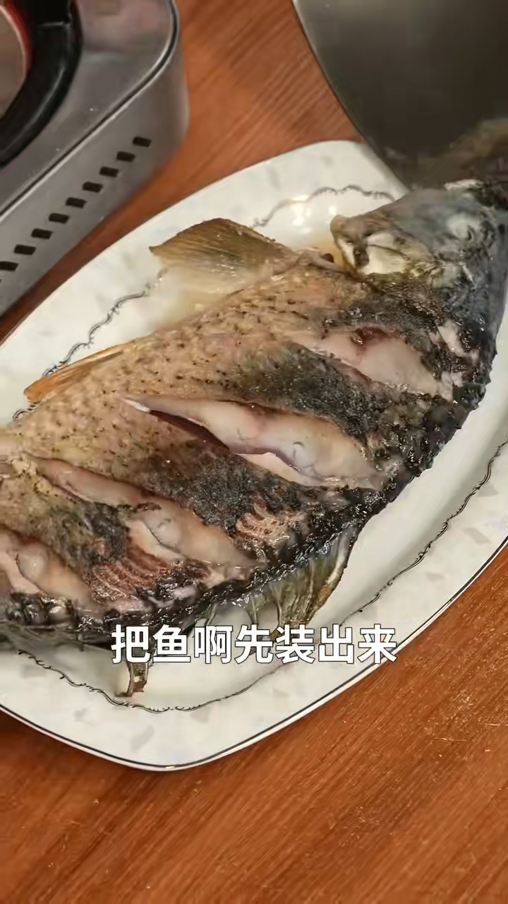

:::

@tab Step10

洗锅，开始红烧；

@tab Step11

锅里加油，油热，加入五花肉；「给鱼整香」

肉片把它煸香

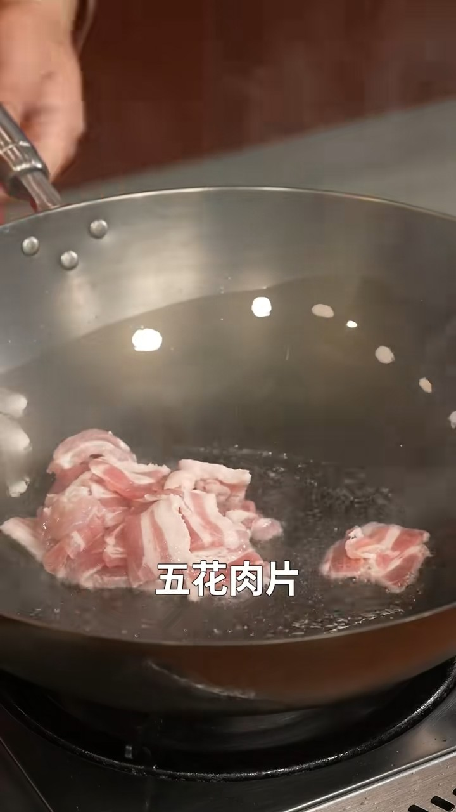

@tab Step12

加入糖，炒出焦糖的颜色和香气

::: center

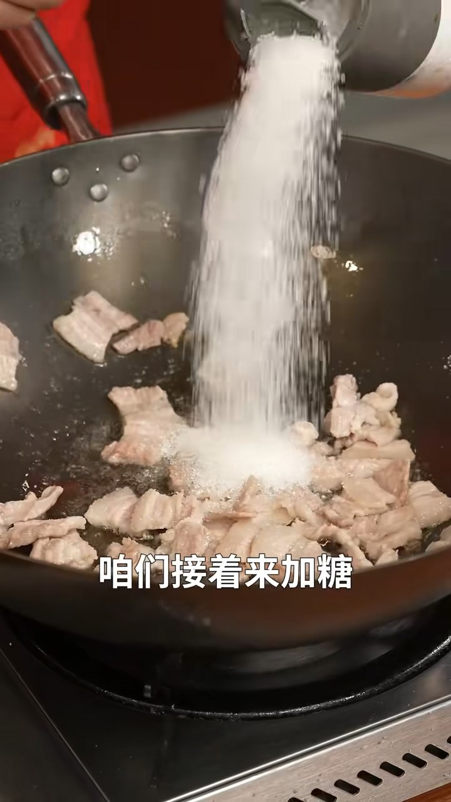

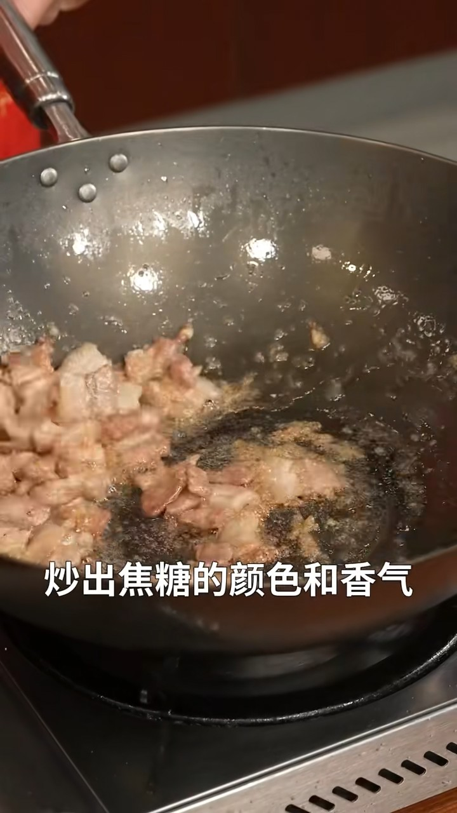

:::

@tab Step13

加入香料：八角、花椒、干辣椒，炒出香气

::: center

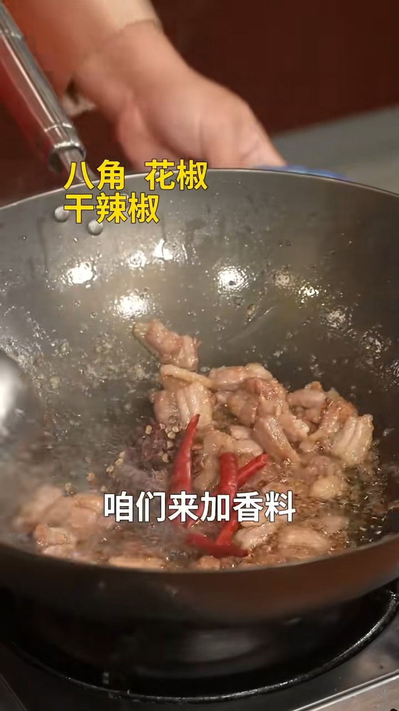

:::

@tab Step14

加入大块的大葱、姜、蒜块，随着焦糖的颜色越来越深。

::: center

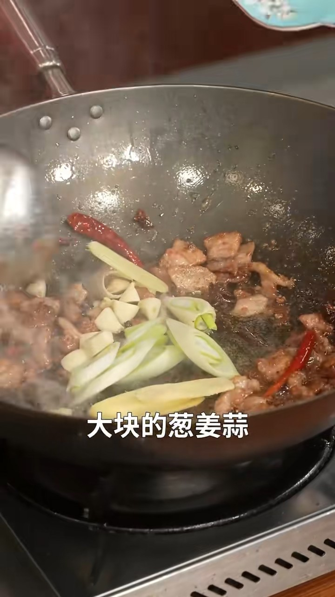

:::

@tab Step15

加入花雕酒「料酒」、酱油。

酱油的豉香，伴随着花雕酒的酒香，已经充满了我们的鼻腔。

**加入水，大火烧开。**

- 加盐
- 加胡椒粉
- 醋少一点，起到去腥的作用
- 味道调好了，把鱼下锅
- 开锅之后，把火🔥调整到中火的状态「千滚豆腐万滚鱼」
- 这鱼要在锅里烧一会，一边烧一边把热汤浇上去；
- 但是红烧鲤鱼全程不盖盖子，为什么呢？——看鱼是否熟了。就是筷子直接插入最厚的鱼肉，然后就可以了。看插入是否轻松，拔出来是否带肉。
- 最厚淀粉勾芡。
- 加入香油增香。

::::

欢迎关注我公众号：AI悦创，有更多更好玩的等你发现！

::: details 公众号：AI悦创【二维码】

:::

::: info AI悦创·编程一对一

AI悦创·推出辅导班啦，包括「Python 语言辅导班、C++ 辅导班、java 辅导班、算法/数据结构辅导班、少儿编程、pygame 游戏开发、Linux、Java」，全部都是一对一教学：一对一辅导 + 一对一答疑 + 布置作业 + 项目实践等。当然，还有线下线上摄影课程、Photoshop、Premiere 一对一教学、QQ、微信在线，随时响应！微信：Jiabcdefh

C++ 信息奥赛题解，长期更新！长期招收一对一中小学信息奥赛集训，莆田、厦门地区有机会线下上门，其他地区线上。微信：Jiabcdefh

方法一：[QQ](http://wpa.qq.com/msgrd?v=3&uin=1432803776&site=qq&menu=yes)

方法二：微信：Jiabcdefh

:::

