## 1. 食材

| 食材名称   | 重量   |
| ---------- | ------ |
| 小龙虾🦞    | 2斤    |
| 熟白芝麻   | 少许   |
| 油         | 适量   |
| 盐         | 少许   |
| 郫县豆瓣酱 | 2汤勺  |
| 生抽       | 2汤勺  |
| 蚝油       | 1汤勺  |
| 米酒       | 2汤勺  |
| 茴香       | 半汤勺 |
| 花椒       | 半汤勺 |
| 桂皮       | 少许   |
| 冰糖       | 10颗   |
| 干辣椒     | 20个   |
| 大葱       | 1小节  |
| 蒜         | 10瓣   |
| 姜         | 1小块  |
| 香菜       | 1棵    |
| 十三香     | 1茶匙  |

::: tip 酱香和麻辣的区别

酱香按原本的，麻辣的需要把干辣椒掰碎，然后可以考虑加辣椒粉。

:::

## 2. 步骤

| 图片                                                         | 操作                                                         |
| ------------------------------------------------------------ | ------------------------------------------------------------ |
| 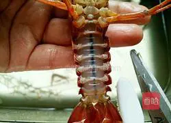 | **1.** 龙虾买回来，清水养1小时以上，用剪刀剪去细脚、拉掉沙线，用牙刷、刷洗干净。 |
| 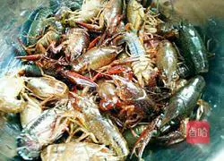 | **2.** 修剪干净的龙虾，用清水洗净。                          |
| 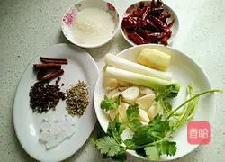 | **3.** 姜、蒜、大葱、香菜、桂皮、干辣椒洗净，花椒、茴香、冰糖、米酒。 |
| 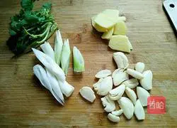 | **4.** 姜切片、蒜拍松、大葱切片、香菜切段。                  |
| 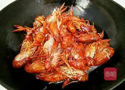 | **5.** 锅里加适量油烧热，倒入龙虾爆炒至变色。(龙虾过热油更能去腥、做出来更香)。 |
| 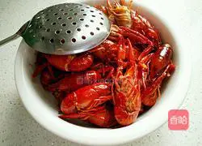 | **6.** 捞出备用。                                            |
| 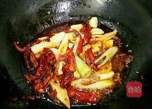 | **7.** 锅里留油(炒龙虾的油)烧干水份后，加入豆瓣酱(小火)炒出红油，加入姜片、蒜、大葱结、干辣椒、花椒、桂皮、茴香、冰糖、炒出香味。 |
| 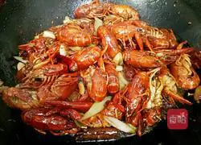 | **8.** 倒入龙虾、加入生抽、蚝油翻炒1至2分钟。                |
| 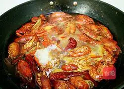 | **9.** 加适量水烧沸腾、加入十三香、盐，米酒中小火焖煮20分钟。 |
| 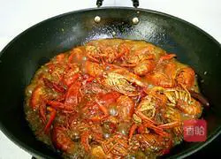 | **10.** 再大火稍微收下汁。                                   |
| 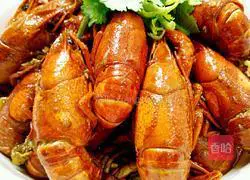 | **11.** 盛入容器、撒上熟白芝麻、放上香菜。                   |
| 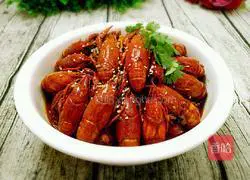 | **12.** 即食。                                               |

## 小贴士

1、龙虾买回来用清水多养，中途多换几次水，让龙虾吐出脏物。

2、龙虾焖熟后，汁别收太干了，盛入容器时，尽量有少许汤汁浸着龙虾，这样更好吃有味哦。

欢迎关注我公众号：AI悦创，有更多更好玩的等你发现！

::: details 公众号：AI悦创【二维码】

:::

::: info AI悦创·编程一对一

AI悦创·推出辅导班啦，包括「Python 语言辅导班、C++ 辅导班、java 辅导班、算法/数据结构辅导班、少儿编程、pygame 游戏开发、Linux、Java」，全部都是一对一教学：一对一辅导 + 一对一答疑 + 布置作业 + 项目实践等。当然，还有线下线上摄影课程、Photoshop、Premiere 一对一教学、QQ、微信在线，随时响应！微信：Jiabcdefh

C++ 信息奥赛题解，长期更新！长期招收一对一中小学信息奥赛集训，莆田、厦门地区有机会线下上门，其他地区线上。微信：Jiabcdefh

方法一：[QQ](http://wpa.qq.com/msgrd?v=3&uin=1432803776&site=qq&menu=yes)

方法二：微信：Jiabcdefh

:::

