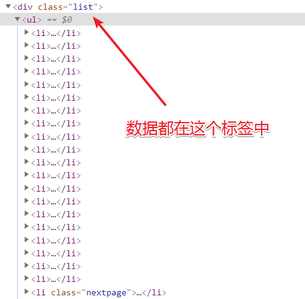
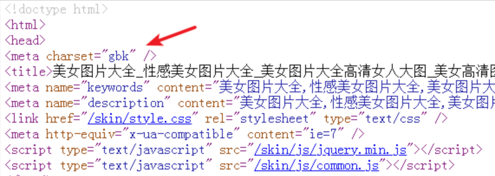
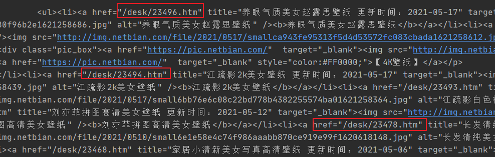
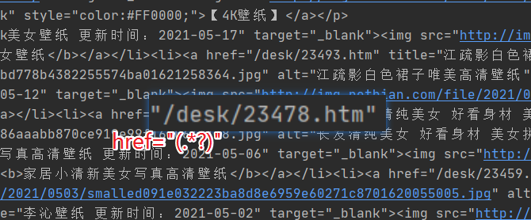
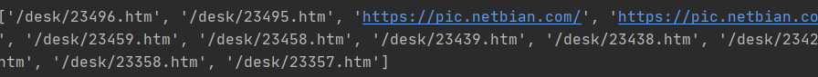
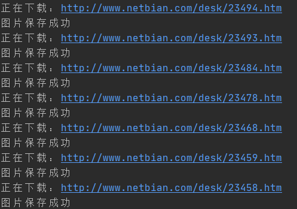
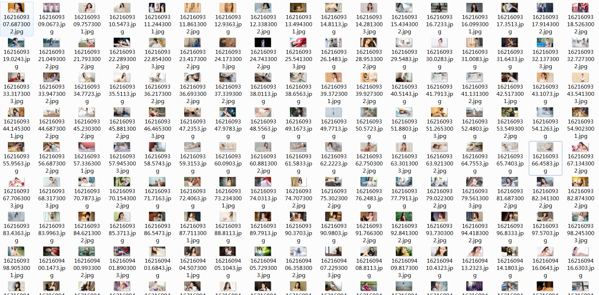

你好，我悦创。

一切的起点，10 行代码集美女

## 1. 前奏篇

正式编写爬虫学习前，以下内容先搞定：

- [x] 能安装 Python 环境，例如安装 3.5 版本，可以切换为其他版本；
- [x] 能熟练开发工具，例如 VSCode，PyCharm；
- [x] 能熟练 Python 第三方库；
- [x] 能运行 Python 脚本文件，能输出 hello world。
- [x] 有以上技能，就可以放心大胆的进行学习。

## 2. 目标数据源分析

### 2.1 本次待抓取的目标地址为：

- [http://www.netbian.com/mei/index.htm](http://www.netbian.com/mei/index.htm)


### 2.2 抓取目标：

抓取该网站的图片，目标 2000 张。

### 2.3 用到的 Python 框架为：

requests 库、re 模块

### 2.4 其它技术栈补充：

正则表达式：

- [https://bornforthis.cn/column/crawler/s3_02.html](https://bornforthis.cn/column/crawler/s3_02.html)
- [https://bornforthis.cn/column/crawler/supplement/regex.html](https://bornforthis.cn/column/crawler/supplement/regex.html)

### 2.5 目标网站地址规则：

- [http://www.netbian.com/mei/index.htm](http://www.netbian.com/mei/index.htm)
- [http://www.netbian.com/mei/index_2.htm](http://www.netbian.com/mei/index_2.htm)
- [http://www.netbian.com/mei/index_3.htm](http://www.netbian.com/mei/index_3.htm)

结论，列表页规则为 `http://www.netbian.com/mei/index_{页码}.htm`。

## 2.6 数据范围

1. 累计 164 页；
2. 每页 20 条数据。

### 2.7 图片所在标签与页面地址

图片所在标签位置代码如下：

```html
<li><a href="/desk/23397.htm" title="陆萱萱 白色衬衫  裙子 职业装 美女模特壁纸 更新时间：2021-04-11" target="_blank"><b>陆萱萱 白色衬衫  裙子 职业装 美女模特壁纸</b></a></li>
```

页面地址为 `/desk/23397.htm`。

## 3. 整理需求如下

1. 生成所有列表页 URL 地址；
2. 遍历列表页 URL 地址，并获取图片详情页地址；
3. 进入详情页获取大图；
4. 保存图片；
5. 得到 2000 张图片之后，开始欣赏。

## 4. 代码实现时间

提前安装完毕 `requests` 模块，使用 `pip install requests` 即可，如果访问失败，切换国内 pip 源。

留个课后小作业，如何设置全局的 pip 源。

代码结构如下：

```python
import requests

# 抓取函数
def main():
    pass

# 解析函数
def format():
    pass

# 存储函数
def save_image():
    pass

if __name__ == '__main__':
    main()
```

先实现 10 行代码抓美女图，举个例子，在正式开始前，需要略微了解一些前端知识与正则表达式知识。

例如通过开发者工具查看网页，得到图片素材都在 `<div class="list">` 和 `<div class="page">` 这两个标签中，首先要做的就是拆解字符串，取出目标数据部分。



通过 `requests` 对网页源码进行获取，代码如下。

```python
# 抓取函数
def main():
    url = "http://www.netbian.com/mei/index.htm"
    headers = {
        "User-Agent": "Mozilla/5.0 (Windows NT 6.1; Win64; x64) AppleWebKit/537.36 (KHTML, like Gecko) Chrome/90.0.4430.93 Safari/537.36"
    }
    res = requests.get(url=url, headers=headers, timeout=5)
    res.encoding = "GBK"
    print(res.text)
```

使用 requests 模块的 get 方法即可获取网页数据，其中的参数分别是请求地址，请求头，等待时间。

请求头字段中的 `User-Agent`，可以先使用我提供给你的内容，也可以通过开发者工具，进行获取。

在数据返回 Response 对象之后，通过 `res.encoding="GBK"` 设置了数据编码，该值可以从网页源码中获取到。



请求到数据源码，即开始解析数据，如果使用正则表达式，建议先对目标数据进行一些简单的裁剪工作。

裁剪字符串是 Python 中比较常规的操作了，直接编写代码即可实现。

用到的还是上文已经提及的两个字符串。

```python
# 解析函数
def format(text):
    # 处理字符串
    div_html = '<div class="list">'
    page_html = '<div class="page">'
    start = text.find(div_html) + len(div_html)
    end = text.find(page_html)
    origin_text = text[start:end]
```

最终得到的 `origin_text` 就是我们的目标文本。

## 5. 通过 re 模块解析目标文本

上文返回的目标文本如下所示，本小节的目标就是获取到图片详情页地址。



使用的技术是 re 模块，当然需要配合正则表达式进行使用，对于正则表达式，可以跟随 AI悦创一点点的接触。

```python
# 解析函数
def format(text):
    # 处理字符串
    div_html = '<div class="list">'
    page_html = '<div class="page">'
    start = text.find(div_html) + len(div_html)
    end = text.find(page_html)
    origin_text = text[start:end]

    pattern = re.compile('href="(.*?)"')
    hrefs = pattern.findall(origin_text)
    print(hrefs)
```

其中 `re.compile` 方法中传递的就是正则表达式，它是一种检索字符串特定内容的语法结构。

例如

- `.` ：表示除换行符（`\n`、`\`r）之外的任何单个字符；
- `*`：表示匹配前面的子表达式零次或多次；
- `?`：当该字符紧跟在任何一个其他限制符 (`*`, `+`, `?`, `{n}`, `{n,}`, `{n,m}`) 后面时，匹配模式是非贪婪的，非贪婪就是减少匹配；
- `()`：分组提取用。

有这些知识之后，在回到代码中去看实现。



假设存在一个字符串：`href="/desk/23478.htm"`，使用 `href="(.\*?)"` 可以将其中的 `/desk/23478.htm` 匹配出来，括号的作用也是为了后续方便提取。

最后输出内容如下图所示。



## 6. 清洗爬取结果

其中存在部分链接地址不正确，需要从列表中进行去除，本步骤使用列表生成器即可完成任务。

```python
    pattern = re.compile('href="(.*?)"')
    hrefs = pattern.findall(origin_text)
    hrefs = [i for i in hrefs if i.find("desk")>0]
    print(hrefs)
```

## 7. 抓取内页数据

获取到列表页地址之后，就可以对图片内页数据进行获取了，这里用到的技术与前文逻辑一致。

```python
# 解析函数
def format(text, headers):
    # 处理字符串
    div_html = '<div class="list">'
    page_html = '<div class="page">'
    start = text.find(div_html) + len(div_html)
    end = text.find(page_html)
    origin_text = text[start:end]

    pattern = re.compile('href="(.*?)"')
    hrefs = pattern.findall(origin_text)
    hrefs = [i for i in hrefs if i.find("desk") > 0]
    for href in hrefs:
        url = f"http://www.netbian.com{href}"
        res = requests.get(url=url, headers=headers, timeout=5)
        res.encoding = "GBK"
        format_detail(res.text)
        break
```

在第一次循环中增加了 `break`，跳出循环，`format_detail` 函数用于格式化内页数据，依旧采用格式化字符串的形式进行。

由于每页只有一张图片是目标数据，故使用的是 `re.search` 进行检索，同时调用该对象的 `group` 方法对数据进行提取。

> 发现重复代码了，稍后进行优化。

```python
def format_detail(text):
    # 处理字符串
    div_html = '<div class="pic">'
    page_html = '<div class="pic-down">'
    start = text.find(div_html) + len(div_html)
    end = text.find(page_html)
    origin_text = text[start:end]
    pattern = re.compile('src="(.*?)"')
    image_src = pattern.search(origin_text).group(1)
    # 保存图片
    save_image(image_src)
```

保存图片部分，需要提前导入 `time` 模块，对图片进行重命名。

使用 `requests.get` 方法直接请求图片地址，调用响应对象的 `content` 属性，获取二进制流，然后使用 `f.write` 存储成图片。

```python
# 存储函数
def save_image(image_src):
    res = requests.get(url=image_src, timeout=5)
    content = res.content
    with open(f"{str(time.time())}.jpg", "wb") as f:
        f.write(content)
```

得到的第一张图片，贴到博客中记录。


## 8. 优化代码

将代码重复逻辑进行提取，封装成公用函数，最终整理之后的代码如下：

```python
import requests
import re
import time


# 请求函数
def request_get(url, ret_type="text", timeout=5, encoding="GBK"):
    headers = {
        "User-Agent": "Mozilla/5.0 (Windows NT 6.1; Win64; x64) AppleWebKit/537.36 (KHTML, like Gecko) Chrome/90.0.4430.93 Safari/537.36"
    }
    res = requests.get(url=url, headers=headers, timeout=timeout)
    res.encoding = encoding
    if ret_type == "text":
        return res.text
    elif ret_type == "image":
        return res.content


# 抓取函数
def main():
    url = "http://www.netbian.com/mei/index.htm"
    text = request_get(url)
    format(text)


# 解析函数
def format(text):
    origin_text = split_str(text, '<div class="list">', '<div class="page">')
    pattern = re.compile('href="(.*?)"')
    hrefs = pattern.findall(origin_text)
    hrefs = [i for i in hrefs if i.find("desk") > 0]
    for href in hrefs:
        url = f"http://www.netbian.com{href}"
        print(f"正在下载：{url}")
        text = request_get(url)
        format_detail(text)


def split_str(text, s_html, e_html):
    start = text.find(s_html) + len(e_html)
    end = text.find(e_html)
    origin_text = text[start:end]

    return origin_text


def format_detail(text):
    origin_text = split_str(text, '<div class="pic">', '<div class="pic-down">')
    pattern = re.compile('src="(.*?)"')
    image_src = pattern.search(origin_text).group(1)
    # 保存图片
    save_image(image_src)


# 存储函数
def save_image(image_src):
    content = request_get(image_src, "image")
    with open(f"{str(time.time())}.jpg", "wb") as f:
        f.write(content)
        print("图片保存成功")


if __name__ == '__main__':
    main()
```

运行代码，得到下图所示运行效果。



## 9. 目标 2000 张

20 张图片的爬取已经得到，下面目标 2000 张，初学阶段按照这种简单的方式抓取即可。

这一步需要改造的就是 `main` 函数：

```python
# 抓取函数
def main():
    urls = [f"http://www.netbian.com/mei/index_{i}.htm" for i in range(2, 201)]
    url = "http://www.netbian.com/mei/index.htm"
    urls.insert(0, url)
    for url in urls:
        print("抓取列表页地址为：", url)
        text = request_get(url)
        format(text)
```



## 10. 完整代码

```python
# -*- coding: utf-8 -*-
# @Time    : 2023/2/22 14:38
# @Author  : AI悦创
# @FileName: spider.py
# @Software: PyCharm
# @Blog    ：https://bornforthis.cn/
import requests
import re
import time


# 请求函数
def request_get(url, ret_type="text", timeout=5, encoding="GBK"):
    headers = {
        "User-Agent": "Mozilla/5.0 (Windows NT 6.1; Win64; x64) AppleWebKit/537.36 (KHTML, like Gecko) Chrome/90.0.4430.93 Safari/537.36"
    }
    res = requests.get(url=url, headers=headers, timeout=timeout)
    res.encoding = encoding
    if ret_type == "text":
        return res.text
    elif ret_type == "image":
        return res.content


# 抓取函数
def main():
    urls = [f"http://www.netbian.com/mei/index_{i}.htm" for i in range(2, 201)]
    url = "http://www.netbian.com/mei/index.htm"
    urls.insert(0, url)
    for url in urls:
        print("抓取列表页地址为：", url)
        text = request_get(url)
        format(text)


# 解析函数
def format(text):
    origin_text = split_str(text, '<div class="list">', '<div class="page">')
    pattern = re.compile('href="(.*?)"')
    hrefs = pattern.findall(origin_text)
    hrefs = [i for i in hrefs if i.find("desk") > 0]
    for href in hrefs:
        url = f"http://www.netbian.com{href}"
        print(f"正在下载：{url}")
        text = request_get(url)
        format_detail(text)


def split_str(text, s_html, e_html):
    start = text.find(s_html) + len(e_html)
    end = text.find(e_html)
    origin_text = text[start:end]

    return origin_text


def format_detail(text):
    origin_text = split_str(text, '<div class="pic">', '<div class="pic-down">')
    pattern = re.compile('src="(.*?)"')
    image_src = pattern.search(origin_text).group(1)
    # 保存图片
    save_image(image_src)


# 存储函数
def save_image(image_src):
    content = request_get(image_src, "image")
    with open(f"{str(time.time())}.jpg", "wb") as f:
        f.write(content)
        print("图片保存成功")


if __name__ == '__main__':
    main()
```

欢迎关注我公众号：AI悦创，有更多更好玩的等你发现！

::: details 扫码添加交流群，记得备注来意。


:::

::: details 公众号：AI悦创【二维码】


:::

::: info AI悦创·编程一对一

AI悦创·推出辅导班啦，包括「Python 语言辅导班、C++ 辅导班、java 辅导班、算法/数据结构辅导班、少儿编程、pygame 游戏开发」，全部都是一对一教学：一对一辅导 + 一对一答疑 + 布置作业 + 项目实践等。当然，还有线下线上摄影课程、Photoshop、Premiere 一对一教学、QQ、微信在线，随时响应！微信：Jiabcdefh

C++ 信息奥赛题解，长期更新！长期招收一对一中小学信息奥赛集训，莆田、厦门地区有机会线下上门，其他地区线上。微信：Jiabcdefh

方法一：[QQ](http://wpa.qq.com/msgrd?v=3&uin=1432803776&site=qq&menu=yes)

方法二：微信：Jiabcdefh

:::

